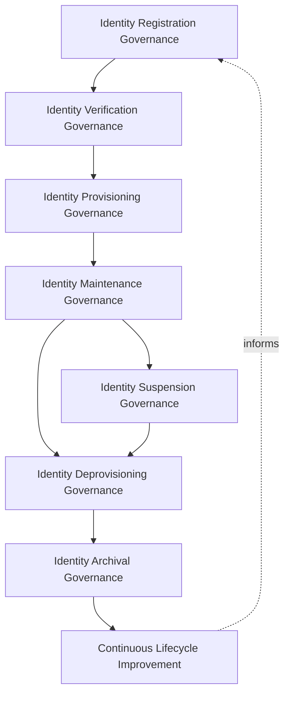
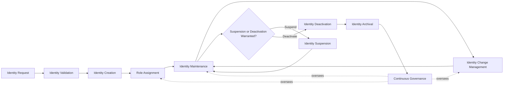
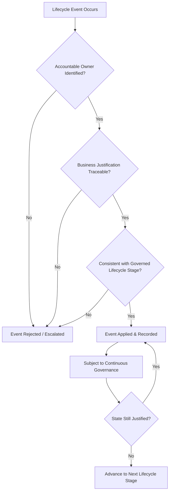
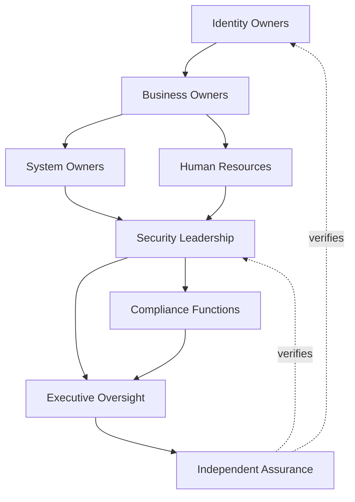
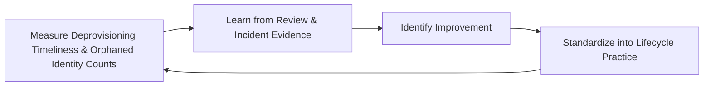
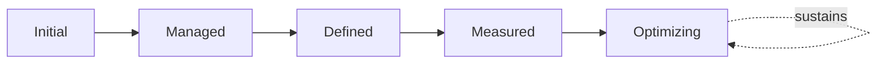

# Enterprise Identity Lifecycle Governance Strategy

## 1. Document Purpose

This document defines the official Enterprise Identity Lifecycle Governance Strategy for **StackLeo Tech Store** — the CIDO/CISO-owned executive charter under which every identity's existence and state, from first request to final archival, is governed across the platform. It establishes identity lifecycle governance, identity ownership, organizational accountability, identity state management, executive oversight, lifecycle consistency, and long-term identity lifecycle maturity, consistent with ISO/IEC 27001, the NIST Cybersecurity Framework, NIST SP 800-63 digital identity concepts, Zero Trust principles, and TOGAF enterprise architecture thinking.

`identity-lifecycle-management.md` remains the operational governance framework for identity state — the document that elaborates in full operational depth how each lifecycle stage is governed for every identity domain. This document sits above it as executive mandate, consistent with how `identity-access-strategy.md` charters `identity-access-management.md` for identity and access governance as a whole: it does not restate operational lifecycle detail, it establishes the philosophy, accountability structure, and executive expectations that give that operational practice authority and continuity.

- **Purpose of Identity Lifecycle Governance** — to ensure every identity's existence and state — active, suspended, deactivated, or archived — is governed as a deliberate, accountable decision at every stage of its life, so that no identity outlives its legitimate purpose or exists without anyone specifically responsible for it.
- **Relationship with Identity & Access Management** — this strategy is the lifecycle-specific elaboration of `identity-access-strategy.md`; where that strategy governs identity and access as a whole, this document governs specifically whether an identity exists, in what state, and for how long — the precondition every access decision depends on.
- **Relationship with Information Security** — an identity that has outlived its legitimate purpose is one of the most common sources of unauthorized access; this strategy protects the information security posture established in `security-governance.md` by ensuring stale identities are never left ungoverned.
- **Relationship with Zero Trust** — this strategy operationalizes `zero-trust-strategy.md`'s "never trust, always verify" posture into standing lifecycle accountability: an identity's state must be current and genuinely justified before any trust is extended to it at all.
- **Relationship with Compliance Governance** — identity lifecycle records — evidence of registration, review, and deprovisioning — are frequently the specific artifact regulators and auditors request; this strategy ensures those records are reliably produced, coordinated with `compliance.md`.
- **Relationship with Enterprise Risk Management** — orphaned, stale, or improperly retained identities are a distinct, tracked risk category within `risk-management.md` and `security-risk-management.md`, governed here at the lifecycle-specific strategic level.
- **Relationship with Enterprise Governance** — identity lifecycle governance is not a separate structure from how StackLeo governs the rest of the business; it is the lifecycle-specific application of the same executive accountability, policy discipline, and control assurance applied enterprise-wide in `policy-management.md`, `internal-controls.md`, and `audit-governance.md`.

This document is implementation-independent and vendor-neutral. It defines identity lifecycle governance philosophy, model, domains, stages, and executive oversight conceptually — not specific identity platforms, IAM vendors, directory services, cloud providers, HR systems, provisioning tools, security products, provisioning procedures, onboarding workflows, synchronization methods, infrastructure configurations, deployment architectures, implementation workflows, or code.

## 2. Identity Lifecycle Philosophy

Identity lifecycle governance at StackLeo rests on eight principles. Each exists to produce a specific business outcome — an identity's state is governed deliberately because an inaccurate or stale identity record undermines every other security domain that depends on it.

### 2.1 Identity as a Managed Asset

Every identity is treated as a deliberately managed enterprise asset with a known state, not an artifact that persists indefinitely once created.

- **Business Value** — ensures the organization always knows what identities exist and why, rather than accumulating an unaccounted-for population over time.

### 2.2 Lifecycle Before Access

An identity's lifecycle state is established and verified before any access decision is made on its behalf; access governance depends entirely on lifecycle state being accurate and current.

- **Business Value** — prevents access from ever being granted to an identity whose right to exist has not itself been established.

### 2.3 Ownership & Accountability

Every identity's lifecycle state traces to a specific, named, accountable owner responsible for keeping it current.

- **Business Value** — prevents an identity's state from drifting out of accuracy because no one is specifically responsible for maintaining it.

### 2.4 Least Privilege Throughout the Lifecycle

An identity's access is reassessed and re-scoped at every lifecycle stage, never assumed to remain correct simply because it was correct when granted.

- **Business Value** — ensures access remains proportionate to genuine current need across an identity's entire life, not only at its creation.

### 2.5 Governance by Design

Lifecycle governance is established deliberately as an identity domain is introduced, not retrofitted once orphaned or stale identities have already accumulated.

- **Business Value** — prevents the costly, high-visibility discovery of lifecycle governance gaps only after a stale identity has already been exploited or discovered in an audit.

### 2.6 Business Alignment

Lifecycle governance decisions are made in service of genuine business events — hiring, contract completion, account closure — never as a technical process disconnected from business reality.

- **Business Value** — keeps lifecycle governance genuinely followed rather than resented as friction disconnected from real business need.

### 2.7 Privacy Awareness

Identity lifecycle records, including historical and archived data, are governed under the same protective discipline applied to any other sensitive personal data.

- **Business Value** — ensures identity lifecycle governance protects individuals' data even after their active relationship with StackLeo has ended.

### 2.8 Continuous Improvement

Lifecycle governance practice matures over time, informed by real review findings, incidents, and the organization's growth in scale and complexity.

- **Business Value** — keeps identity lifecycle governance aligned with StackLeo's growth in workforce, customer base, and partner ecosystem.

## 3. Enterprise Identity Lifecycle Governance Model

Identity lifecycle governance operates across eight conceptual layers, each holding accountability for a distinct stage-family of an identity's existence.

### 3.1 Identity Registration Governance

- **Purpose** — own the coherence of how new identities are formally requested and recorded.
- **Governance Scope** — oversight of Identity Request (Section 5.1) across every domain in Section 4.
- **Business Value** — ensures every identity's creation traces to a deliberate, stated business purpose.
- **Executive Expectations** — leadership trusts no identity is created without a recorded, legitimate reason.

### 3.2 Identity Verification Governance

- **Purpose** — own the coherence of how a registered identity's claim is confirmed before it is created as a managed record.
- **Governance Scope** — oversight of Identity Validation (Section 5.2), coordinated with `authentication-strategy.md`.
- **Business Value** — ensures the identity being established is genuine before it enters the managed population at all.
- **Executive Expectations** — leadership trusts verification rigor is proportionate to the domain and intended access.

### 3.3 Identity Provisioning Governance

- **Purpose** — own the coherence of how a verified identity is formally established and given its initial role.
- **Governance Scope** — oversight of Identity Creation and Role Assignment (Sections 5.3–5.4), consistent with Least Privilege Throughout the Lifecycle (Section 2.4).
- **Business Value** — ensures every identity begins its life with only the standing and access it genuinely requires.
- **Executive Expectations** — leadership trusts initial access is never granted broadly by default.

### 3.4 Identity Maintenance Governance

- **Purpose** — own the coherence of how an identity's attributes and access are kept current across its active life.
- **Governance Scope** — oversight of Identity Maintenance and Identity Change Management (Sections 5.5–5.6) across every domain.
- **Business Value** — ensures identity records remain an accurate reflection of current business reality throughout an identity's active life.
- **Executive Expectations** — leadership trusts that role and access changes are reflected promptly, not left to accumulate as drift.

### 3.5 Identity Suspension Governance

- **Purpose** — own the coherence of how an identity's access is deliberately and reversibly disabled without full removal.
- **Governance Scope** — oversight of Identity Suspension (Section 5.7), applicable across leave, investigation, and temporary role change scenarios.
- **Business Value** — provides a proportionate, recorded response to circumstances that do not yet warrant permanent removal.
- **Executive Expectations** — leadership trusts suspension is a distinct, deliberate state, never informally improvised.

### 3.6 Identity Deprovisioning Governance

- **Purpose** — own the coherence of how an identity's access and standing are formally and permanently removed once its purpose has genuinely ended.
- **Governance Scope** — oversight of Identity Deactivation (Section 5.8), the highest-consequence stage in this model when delayed or skipped.
- **Business Value** — prevents the single most common source of identity risk: access that outlives its legitimate purpose.
- **Executive Expectations** — leadership expects deprovisioning to be triggered promptly by the relevant business event, without exception.

### 3.7 Identity Archival Governance

- **Purpose** — own the coherence of how historical identity records are retained after deprovisioning, where genuine business or compliance need exists.
- **Governance Scope** — oversight of Identity Archival (Section 5.9), coordinated with `04_Database/data-retention.md` and `compliance.md`.
- **Business Value** — preserves evidence needed for audit or investigation without indefinitely retaining active access or identity data.
- **Executive Expectations** — leadership trusts archived data is retained only as long as genuine need requires, then genuinely retired.

### 3.8 Continuous Lifecycle Improvement

- **Purpose** — govern the mechanism by which every other layer in this model matures over time.
- **Governance Scope** — consolidates findings from lifecycle reviews, audits, and incidents across every domain in Section 4.
- **Business Value** — prevents lifecycle governance itself from becoming the next thing that quietly stagnates as the organization scales.
- **Executive Expectations** — leadership expects lifecycle maturity to be assessed periodically, not assumed static once established.

### Enterprise Identity Lifecycle Governance Matrix

| Layer | Purpose | Business Value | Executive Expectations |
|---|---|---|---|
| Identity Registration Governance | Own coherence of how identities are formally requested | Ensures creation traces to a deliberate, stated purpose | Trusts no identity is created without a recorded, legitimate reason |
| Identity Verification Governance | Own coherence of claim confirmation before creation | Ensures the identity is genuine before entering the managed population | Trusts verification rigor is proportionate to domain and access |
| Identity Provisioning Governance | Own coherence of establishment and initial role | Ensures every identity begins with only the access it requires | Trusts initial access is never granted broadly by default |
| Identity Maintenance Governance | Own coherence of ongoing accuracy across active life | Keeps records an accurate reflection of current reality | Trusts changes are reflected promptly, not left to drift |
| Identity Suspension Governance | Own coherence of reversible access disablement | Provides a proportionate response short of full removal | Trusts suspension is deliberate, never informally improvised |
| Identity Deprovisioning Governance | Own coherence of permanent removal once purpose ends | Prevents the most common source of identity risk | Expects prompt deprovisioning without exception |
| Identity Archival Governance | Own coherence of historical record retention | Preserves audit evidence without indefinite active retention | Trusts archived data is retained only as long as genuinely needed |
| Continuous Lifecycle Improvement | Govern maturation of every other layer | Prevents governance itself from stagnating | Expects maturity to be assessed periodically |

*Diagram 1: Enterprise Identity Lifecycle Governance Framework — registration and verification governance establish an identity, provisioning and maintenance govern its active life, suspension and deprovisioning govern its wind-down, and archival and continuous improvement close and inform the cycle.*

## 4. Enterprise Identity Domains

Identity lifecycle governance applies across ten conceptual domains, each requiring a somewhat different lifecycle emphasis.

### 4.1 Employees

- **Purpose** — represent StackLeo's own internal staff across their employment lifecycle.
- **Lifecycle Considerations** — lifecycle events are triggered by employment status change, coordinated with Human Resources (Section 7.4).
- **Business Importance** — protects internal systems and data from access that has outlived its legitimate employment basis.
- **Executive Expectations** — leadership expects lifecycle changes to be triggered promptly by hiring, role change, and termination events.

### 4.2 Customers

- **Purpose** — represent individual shoppers' accounts and their relationship with StackLeo across the account lifecycle.
- **Lifecycle Considerations** — lifecycle events are triggered by account creation, dormancy, and closure, coordinated with `privacy.md`.
- **Business Importance** — foundation of the direct-to-consumer relationship and repeat commerce.
- **Executive Expectations** — leadership expects customer lifecycle governance to protect trust without adding friction to genuine shopping.

### 4.3 Vendors

- **Purpose** — represent external suppliers and service providers integrated with the platform.
- **Lifecycle Considerations** — lifecycle events are triggered by contract initiation, renewal, and termination.
- **Business Importance** — protects the integrations the commerce experience directly depends on.
- **Executive Expectations** — leadership expects vendor identities to be deprovisioned promptly at contract end.

### 4.4 Business Partners

- **Purpose** — represent couriers, service centers, corporate buyers, and future marketplace sellers.
- **Lifecycle Considerations** — lifecycle events are triggered by the partnership agreement's own lifecycle, coordinated with `identity-federation.md`.
- **Business Importance** — will become foundational to corporate sales, wholesale, and the multi-vendor marketplace as those models launch.
- **Executive Expectations** — leadership expects partner lifecycle governance to be designed ahead of, not after, marketplace launch.

### 4.5 Contractors

- **Purpose** — represent individuals engaged for a defined engagement rather than direct employment.
- **Lifecycle Considerations** — lifecycle events are bounded explicitly by engagement start and end dates, never open-ended by default.
- **Business Importance** — enables flexible staffing without inheriting the risk of indefinite, unreviewed access.
- **Executive Expectations** — leadership expects every contractor identity to carry an explicit end date from creation.

### 4.6 Temporary Users

- **Purpose** — represent identities granted for a short-lived, specific purpose — seasonal access, short-term projects, or event-driven need.
- **Lifecycle Considerations** — lifecycle governance treats expiration as a defining characteristic, not an afterthought.
- **Business Importance** — prevents short-term access needs from becoming permanent, unreviewed grants.
- **Executive Expectations** — leadership expects temporary identities to expire automatically rather than requiring manual removal.

### 4.7 Service Accounts

- **Purpose** — represent non-human identities used by application components to interact with one another.
- **Lifecycle Considerations** — lifecycle governance applies with the same rigor as human identities, elaborated in `service-accounts-management.md`.
- **Business Importance** — protects against the common failure mode where service accounts accumulate broad, unreviewed standing over time.
- **Executive Expectations** — leadership expects service accounts to be inventoried and lifecycle-reviewed with the same discipline as human accounts.

### 4.8 API & Integration Identities

- **Purpose** — represent identities through which external systems and internal services exchange data and capability.
- **Lifecycle Considerations** — lifecycle is bound to the integration's own lifecycle; an identity is deprovisioned when its integration is retired.
- **Business Importance** — protects the integration surface connecting StackLeo to payment, courier, and communication partners.
- **Executive Expectations** — leadership expects integration identities to be reviewed whenever the underlying integration changes purpose or ownership.

### 4.9 AI Agent Identities

- **Purpose** — represent autonomous or semi-autonomous AI-driven actors performing actions on the platform.
- **Lifecycle Considerations** — governed as a distinct, explicitly inventoried lifecycle category, never an informal extension of the human identity that configured them.
- **Business Importance** — protects against a category of identity that can act at scale and speed, making an unreviewed lifecycle especially consequential.
- **Executive Expectations** — leadership expects AI agent identities to be reviewed on the same cadence as, or more frequently than, human identities.

### 4.10 External Federated Identities

- **Purpose** — represent external identities StackLeo does not directly control but must extend a bounded degree of trust to.
- **Lifecycle Considerations** — lifecycle governance is bilateral, coordinated with the federated organization and elaborated in `identity-federation.md`.
- **Business Importance** — protects against risk introduced by parties outside StackLeo's direct organizational control.
- **Executive Expectations** — leadership expects federated identity lifecycle status to be reviewed, not assumed to remain current indefinitely.

### Enterprise Identity Domain Matrix

| Domain | Purpose | Business Importance | Executive Expectations |
|---|---|---|---|
| Employees | Represent internal staff across the employment lifecycle | Protects systems from access outliving employment basis | Changes triggered promptly by hiring, role change, termination |
| Customers | Represent shoppers' accounts and relationship with StackLeo | Foundation of the direct-to-consumer relationship | Protects trust without adding shopping friction |
| Vendors | Represent external suppliers and service providers | Protects integrations commerce directly depends on | Deprovisioned promptly at contract end |
| Business Partners | Represent couriers, service centers, corporate/marketplace relationships | Foundational to future corporate sales and marketplace models | Designed ahead of, not after, marketplace launch |
| Contractors | Represent individuals engaged for a defined engagement | Enables flexible staffing without indefinite unreviewed access | Every identity carries an explicit end date from creation |
| Temporary Users | Represent short-lived, purpose-specific access | Prevents short-term needs becoming permanent grants | Identities expire automatically, not via manual removal |
| Service Accounts | Represent non-human, application-level actors | Prevents accumulation of broad, unreviewed standing | Inventoried and lifecycle-reviewed with the same discipline |
| API & Integration Identities | Represent system-to-system exchange actors | Protects the integration surface commerce depends on | Reviewed when the integration changes purpose or ownership |
| AI Agent Identities | Represent autonomous or semi-autonomous AI-driven actors | Protects against scale-and-speed risk of unreviewed AI lifecycle | Reviewed on the same or greater cadence than human identities |
| External Federated Identities | Represent external identities outside direct control | Protects against risk from parties outside organizational control | Lifecycle status reviewed, never assumed current indefinitely |

## 5. Enterprise Identity Lifecycle

Identity state proceeds through ten conceptual stages, applicable across every domain in Section 4.

### 5.1 Identity Request

- **Purpose** — formally initiate the creation of a new identity with a stated business purpose.
- **Governance Objectives** — require every request to state its purpose and the domain (Section 4) it belongs to.
- **Business Value** — ensures identity creation is deliberate, not an incidental byproduct of onboarding activity.

### 5.2 Identity Validation

- **Purpose** — confirm the requested identity genuinely represents who or what it claims to be.
- **Governance Objectives** — require validation rigor proportionate to the identity's domain and intended access.
- **Business Value** — ensures the identity being established is genuine before it enters the managed population.

### 5.3 Identity Creation

- **Purpose** — formally establish the validated identity as a managed enterprise record.
- **Governance Objectives** — require creation to occur only after validation is complete, never in parallel with it.
- **Business Value** — ensures every identity's existence is deliberately and traceably established.

### 5.4 Role Assignment

- **Purpose** — assign the newly created identity its initial role and standing, consistent with Least Privilege Throughout the Lifecycle (Section 2.4).
- **Governance Objectives** — require initial role assignment to be scoped to genuine, stated need.
- **Business Value** — ensures every identity begins its life with only the standing it genuinely requires.

### 5.5 Identity Maintenance

- **Purpose** — keep identity attributes current as circumstances change.
- **Governance Objectives** — require maintenance to be triggered by genuine change events, not left to drift indefinitely.
- **Business Value** — ensures identity records remain an accurate reflection of current reality.

### 5.6 Identity Change Management

- **Purpose** — govern deliberate changes to an identity's role, standing, or attributes as responsibility genuinely changes.
- **Governance Objectives** — require every change to be justified and recorded.
- **Business Value** — prevents standing and access from silently accumulating beyond current, genuine need.

### 5.7 Identity Suspension

- **Purpose** — deliberately and reversibly disable an identity without fully removing it, where circumstance warrants.
- **Governance Objectives** — require suspension to be a distinct, recorded state, never conflated with full deactivation.
- **Business Value** — provides a proportionate response to circumstances — leave, investigation, temporary role change — that do not yet warrant full removal.

### 5.8 Identity Deactivation

- **Purpose** — formally and permanently remove an identity's standing and access once its legitimate purpose has genuinely ended.
- **Governance Objectives** — require deactivation to be triggered promptly by the relevant change event.
- **Business Value** — prevents the single most common source of identity risk: access that outlives its legitimate purpose.

### 5.9 Identity Archival

- **Purpose** — retain historical identity records for a defined period after deactivation, where genuine business or compliance need exists.
- **Governance Objectives** — coordinate retention with `04_Database/data-retention.md` and applicable obligations in `compliance.md`.
- **Business Value** — preserves evidence needed for audit or investigation without indefinitely retaining active standing.

### 5.10 Continuous Governance

- **Purpose** — sustain oversight of an identity's existence and state across every stage, rather than treating governance as a one-time gate.
- **Governance Objectives** — require periodic reassessment to run continuously alongside, not only at, discrete lifecycle events.
- **Business Value** — catches an unjustified identity or stale state before it becomes a genuine risk, rather than relying on the next scheduled event to surface it.

### Identity Lifecycle Stage Matrix

| Stage | Purpose | Governance Objective | Business Value |
|---|---|---|---|
| Identity Request | Formally initiate creation with a stated purpose | Requests state purpose and domain | Ensures creation is deliberate, not incidental |
| Identity Validation | Confirm the identity genuinely represents its claim | Rigor proportionate to domain and intended access | Ensures genuineness before entering the managed population |
| Identity Creation | Establish the validated identity as a managed record | Creation follows, never parallels, validation | Ensures existence is deliberately, traceably established |
| Role Assignment | Assign initial role and standing at Least Privilege | Scoped to genuine, stated need | Every identity begins with only the standing it requires |
| Identity Maintenance | Keep identity attributes current | Triggered by genuine change events | Keeps records an accurate reflection of reality |
| Identity Change Management | Govern deliberate changes to role or standing | Justified and recorded | Prevents standing silently accumulating beyond need |
| Identity Suspension | Deliberately, reversibly disable an identity | A distinct, recorded state | Provides proportionate response short of full removal |
| Identity Deactivation | Formally, permanently remove standing once purpose ends | Triggered promptly by the relevant change event | Prevents the most common source of identity risk |
| Identity Archival | Retain historical records for a defined period | Coordinated with data retention and compliance obligations | Preserves audit evidence without indefinite active standing |
| Continuous Governance | Sustain oversight across every stage | Reassessment runs continuously, not only at events | Catches unjustified identity or stale state before it becomes risk |

*Diagram 2: Identity Lifecycle Flow — an identity proceeds from request through validation, creation, and role assignment into ongoing maintenance and change management, with suspension, deactivation, and archival handling its eventual wind-down, all under continuous governance oversight.*

## 6. Identity Lifecycle Governance Principles

- **Accountability** — every identity's lifecycle state traces to a specific, named, responsible party, consistent with Section 2.3.
- **Ownership** — every identity has a single accountable owner across its full lifecycle, not merely at creation.
- **Traceability** — every lifecycle event can be traced to its business justification, approver, and timing.
- **Auditability** — lifecycle events — creation, modification, suspension, deactivation, archival — can be independently reviewed after the fact.
- **Business Alignment** — lifecycle governance decisions are made in service of genuine business events, consistent with Section 2.6.
- **Privacy Awareness** — identity lifecycle data, including archived records, is governed under the same protective discipline as any other personal data.
- **Lifecycle Consistency** — every domain in Section 4 is governed through the same ten stages defined in Section 5, applied with domain-appropriate rigor rather than domain-specific exceptions.
- **Continuous Improvement** — lifecycle governance practice matures over time, informed by real review findings and incidents.

### Identity Lifecycle Governance Principles Matrix

| Principle | Description | Business Value |
|---|---|---|
| Accountability | Every lifecycle state traces to a specific, responsible party | Ensures lifecycle decisions have a clear owner |
| Ownership | Every identity has a single accountable owner across its full life | Prevents ownership from lapsing after creation |
| Traceability | Lifecycle events traceable to justification, approver, timing | Enables defensible, evidence-based lifecycle decisions |
| Auditability | Lifecycle events independently reviewable after the fact | Supports ISO/IEC 27001-aligned assurance and audit confidence |
| Business Alignment | Decisions made in service of genuine business events | Keeps lifecycle governance followed rather than resented as friction |
| Privacy Awareness | Lifecycle data governed under the same protective discipline | Protects individuals' data even after the relationship ends |
| Lifecycle Consistency | Every domain governed through the same stages | Prevents inconsistent, domain-specific exceptions from eroding governance |
| Continuous Improvement | Practice matures from real review findings and incidents | Keeps governance aligned with organizational growth |

*Diagram 4: Enterprise Identity Lifecycle Decision Flow — every lifecycle event passes through ownership, traceability, and consistency gates before being applied and recorded, remaining subject to continuous reassessment thereafter.*

## 7. Identity Ownership & Lifecycle Accountability

Governance authority for identity lifecycle state is distributed deliberately across eight accountable functions, defined here at the governance-objective level, without prescribing the specific operational procedures each function uses to fulfill it.

### 7.1 Identity Owners

- **Governance Objective** — each identity, across every domain in Section 4, has a single accountable owner responsible for its current lifecycle state.
- **Business Value** — prevents identities from persisting without anyone specifically responsible for confirming their state remains justified.

### 7.2 Business Owners

- **Governance Objective** — business functions own the justification for why an identity exists and when its purpose has ended.
- **Business Value** — keeps lifecycle decisions grounded in real business responsibility rather than technical convenience alone.

### 7.3 System Owners

- **Governance Objective** — each system or platform component has an accountable owner responsible for the identities it exposes and their lifecycle state.
- **Business Value** — ensures no system's identity population is left ungoverned because no one considered it theirs to own.

### 7.4 Human Resources

- **Governance Objective** — Human Resources triggers Employee and Contractor lifecycle events (Sections 4.1, 4.5) promptly from genuine employment and engagement status change.
- **Business Value** — ensures workforce identity lifecycle state reliably reflects genuine employment reality.

### 7.5 Security Leadership

- **Governance Objective** — security leadership owns the coherence and enforcement of this strategy across every domain, layer, and stage it defines.
- **Business Value** — provides a single point of accountability for whether identity lifecycle governance is genuinely functioning as intended.

### 7.6 Compliance Functions

- **Governance Objective** — compliance functions confirm that identity lifecycle governance satisfies applicable regulatory and contractual obligations, coordinated with `compliance.md`.
- **Business Value** — ensures lifecycle governance protects the business's standing with regulators, partners, and enterprise customers.

### 7.7 Executive Oversight

- **Governance Objective** — executive leadership sets the risk appetite this strategy operates within and holds security leadership accountable for its execution.
- **Business Value** — ensures identity lifecycle governance decisions reflect genuine organizational priority, not a delegated technical afterthought.

### 7.8 Independent Assurance

- **Governance Objective** — an independent function, separate from those who design and operate lifecycle governance, periodically verifies it is genuinely functioning as documented.
- **Business Value** — prevents lifecycle governance from being assumed effective on the word of the same function responsible for running it.

### Identity Ownership & Accountability Matrix

| Role | Governance Objective | Business Value |
|---|---|---|
| Identity Owners | Defend the current lifecycle state of a specific identity | Prevents identities persisting without a specifically responsible party |
| Business Owners | Own the justification for an identity's existence and end | Keeps lifecycle decisions grounded in genuine business responsibility |
| System Owners | Own the identity population a system exposes | Ensures no system's identities go ungoverned |
| Human Resources | Trigger workforce lifecycle events from employment status change | Ensures lifecycle state reflects genuine employment reality |
| Security Leadership | Own coherence and enforcement of this strategy | Provides a single point of accountability for governance function |
| Compliance Functions | Confirm alignment with regulatory/contractual obligations | Protects standing with regulators, partners, enterprise customers |
| Executive Oversight | Set risk appetite and hold security leadership accountable | Ensures decisions reflect genuine organizational priority |
| Independent Assurance | Independently verify governance functions as documented | Prevents self-assessed assumption of effectiveness |

*Diagram 3: Identity Ownership & Accountability Model — accountability flows from individual identity ownership through business, system, and HR ownership into security leadership, with compliance and executive oversight converging on independent assurance.*

## 8. Executive Oversight

- **Identity Lifecycle Reviews** — the overall coherence of identity lifecycle governance is formally reviewed on a regular cadence, consistent with `security-governance.md` (Section 6).
- **Executive Reporting** — aggregated lifecycle health — deprovisioning timeliness, orphaned identity counts, review completion — is reported to executive leadership.
- **Lifecycle Risk Reviews** — identity lifecycle risk from `risk-management.md` and `security-risk-management.md` is reviewed alongside broader enterprise and security risk, never in isolation.
- **Governance Reviews** — the governance model, domains, stages, and ownership structure defined in this strategy (Sections 3–7) are periodically reassessed for continued fitness.
- **Documentation Governance** — this strategy's relationship to `identity-access-strategy.md`, `identity-access-management.md`, and `identity-lifecycle-management.md` is kept current as those documents evolve.
- **Audit Readiness** — identity lifecycle decisions, reviews, and their outcomes are maintained in a state ready for internal or external audit at any time, coordinated with `audit-governance.md`.

### Executive Oversight Matrix

| Oversight Mechanism | Purpose | Governance Role |
|---|---|---|
| Identity Lifecycle Reviews | Confirm overall lifecycle governance coherence | Regular, predictable cadence for the strategy as a whole |
| Executive Reporting | Provide leadership a single, coherent lifecycle picture | Reports deprovisioning timeliness, orphaned counts, review completion |
| Lifecycle Risk Reviews | Review lifecycle risk alongside broader risk visibility | Not conducted in isolation from enterprise or security risk |
| Governance Reviews | Reassess the governance model itself for continued fitness | Applies to Sections 3–7 of this strategy |
| Documentation Governance | Keep this strategy's subordinate relationships current | Updated as related documents evolve |
| Audit Readiness | Maintain decisions and reviews ready for independent review | Continuous state, coordinated with audit governance |

### Governance Responsibility Matrix

| Role | Responsibility |
|---|---|
| CIDO / CISO | Owns coherence and enforcement of this strategy, in partnership with Executive Leadership. |
| Identity Lifecycle Governance Lead | Owns the operational governance model in `identity-lifecycle-management.md` for every domain. |
| Security Leadership | Owns Identity Suspension and Deprovisioning Governance (Sections 3.5–3.6), the highest-consequence layers. |
| Human Resources / People Lead | Coordinates lifecycle events for Employees and Contractors (Sections 4.1, 4.5). |
| Engineering Leads | Own lifecycle governance for Service Accounts, API & Integration, and AI Agent Identities (Sections 4.7–4.9). |
| Partner / Vendor Manager | Coordinates lifecycle governance for Vendors, Business Partners, and External Federated Identities (Sections 4.3–4.4, 4.10). |
| Executive Leadership | Reviews significant lifecycle exceptions and overall governance health. |
| Independent Assurance / Internal Audit | Independently verifies that lifecycle governance records reflect actual practice. |

## 9. Future Readiness

This strategy is designed to remain valid as StackLeo evolves in scale, geography, and organizational complexity, without requiring redefinition of its underlying philosophy.

- **AI Workforce Identities** — as AI-assisted capability expands within the workforce itself, it is governed under the same lifecycle stages (Section 5) as any other identity, never as an informal extension of a human identity.
- **Autonomous Digital Identities** — increasingly autonomous platform components are governed under the same Ownership & Accountability principle (Section 2.3) as any other identity, regardless of the degree of autonomy involved.
- **Global Workforce Expansion** — Identity Registration and Maintenance Governance (Sections 3.1, 3.4) are defined independently of jurisdiction, so they extend coherently as StackLeo's workforce grows from Bangladesh into South Asia and global markets.
- **Multi-Tenant Platforms** — where future architecture introduces tenant isolation, lifecycle governance extends to explicitly scope identity state per tenant.
- **Enterprise Scale** — the governance model, domains, and lifecycle stages defined throughout this strategy are defined independently of organizational size, so they remain coherent as the identity population grows substantially.
- **Passwordless Identity Evolution** — Identity Verification Governance (Section 3.2) is defined independently of any specific verification mechanism, so it applies unchanged as verification approaches evolve.
- **Continuous Identity Intelligence** — Continuous Governance (Section 5.10) and Continuous Lifecycle Improvement (Section 3.8) are structured to absorb increasingly automated, evidence-driven lifecycle insight as it becomes available, without requiring this strategy to be rewritten.
- **Emerging Identity Ecosystems** — External Federated Identities (Section 4.10) and Business Partners (Section 4.4) are structured to absorb genuinely new categories of identity relationship as StackLeo's ecosystem of partners, sellers, and integrations grows.

## 10. Identity Lifecycle Maturity Model

Identity lifecycle governance maturity is described across five conceptual levels, consistent with established process maturity thinking and NIST Cybersecurity Framework tiers.

- **Initial** — identity lifecycle governance, where it exists, is informal and inconsistent; identities persist without regular review, and ownership is unclear.
- **Managed** — basic lifecycle governance exists for individual identity domains, but consistency across the ten domains in Section 4 varies significantly.
- **Defined** — the governance model, domains, stages, and ownership structure are standardized, documented, and consistently applied across the organization, consistent with the model defined throughout this strategy.
- **Measured** — deprovisioning timeliness, orphaned identity counts, and review completion are measured systematically, and decisions are grounded in genuine evidence rather than qualitative impression alone.
- **Optimizing** — identity lifecycle governance is continuously and deliberately improved based on quantitative evidence and organizational learning; improvement itself is a managed, ongoing discipline rather than an occasional initiative.

### Identity Lifecycle Maturity Model Matrix

| Level | Characteristics | Primary Focus |
|---|---|---|
| Initial | Informal, inconsistent governance; identities persist without review | Ad hoc, individually-dependent lifecycle practice |
| Managed | Basic governance exists per domain; consistency varies | Domain-level consistency |
| Defined | Standardized governance model, domains, stages, and ownership | Organization-wide consistency and clear ownership |
| Measured | Deprovisioning timeliness and orphaned counts measured systematically | Evidence-based lifecycle governance decisions |
| Optimizing | Practice continuously and deliberately improved from evidence | Sustained, deliberate improvement as a discipline |

*Diagram 5: Continuous Identity Lifecycle Improvement Cycle — lifecycle review and audit outcomes are measured, learned from, improved upon, and standardized back into governed practice, on a continuing basis.*

*Diagram 6: Identity Lifecycle Maturity Progression Model — maturity advances from informal, unreviewed lifecycle practice toward standardized, measured, and continuously optimized identity lifecycle governance.*

## 11. Anti-Patterns

The following recurring failure patterns are explicitly recognized and avoided, as each one structurally undermines this strategy.

### Anti-Pattern Summary

| Anti-Pattern | Why It's Avoided |
|---|---|
| Orphaned Identities | Contradicts Identity as a Managed Asset (Section 2.1); identities with no traceable owner or purpose accumulate into an unmanageable, ungoverned population. |
| Unknown Identity Ownership | Contradicts Ownership & Accountability (Section 2.3, Section 7.1); an identity without a clear owner has no one specifically responsible for its continued justification. |
| Delayed Deprovisioning | Contradicts Identity Deprovisioning Governance (Section 3.6); access that outlives its legitimate purpose is the single most common source of identity risk. |
| Weak Documentation | Undermines Documentation Governance (Section 8) and Traceability (Section 6), leaving lifecycle decisions unclear or unverifiable after the fact. |
| Weak Executive Visibility | Contradicts Executive Reporting (Section 8); leadership cannot govern lifecycle risk it is never shown. |
| Siloed Identity Management | Contradicts Lifecycle Consistency (Section 6); domain-by-domain practice that never converges leaves no coherent, organization-wide picture of identity state. |
| Compliance Without Lifecycle Governance | Contradicts Compliance Functions (Section 7.6); satisfying a regulatory checklist without genuine underlying lifecycle governance leaves the organization compliant on paper and exposed in practice. |
| Missing Continuous Improvement | Contradicts Continuous Improvement (Section 2.8) and Continuous Lifecycle Improvement (Section 3.8); without deliberate improvement, governance stagnates as the organization and identity population grow. |

## 12. Document Information

| Property | Value |
|----------|-------|
| Document | identity-lifecycle.md |
| Version | 1.0.0 |
| Status | Active |
| Maintained By | StackLeo |
| Last Updated | 2026-07-24 |

---

© StackLeo. All Rights Reserved.
