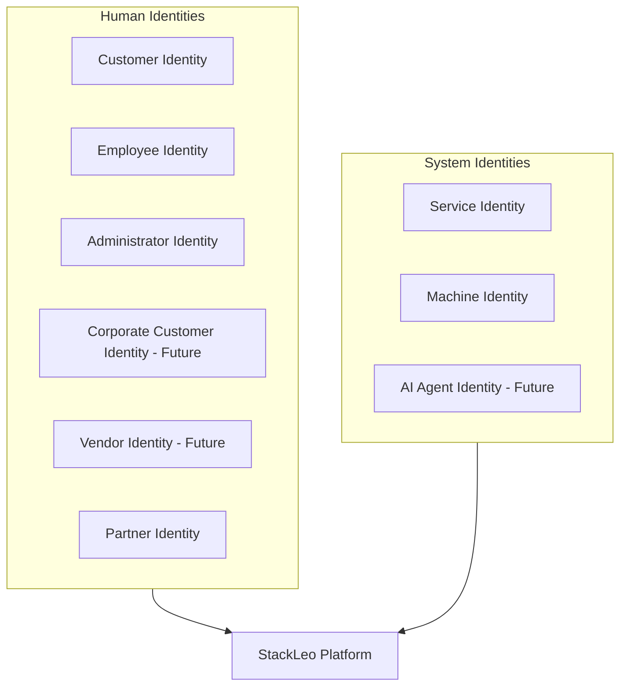
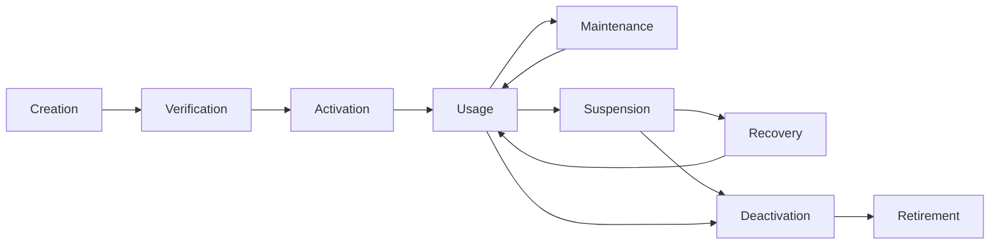
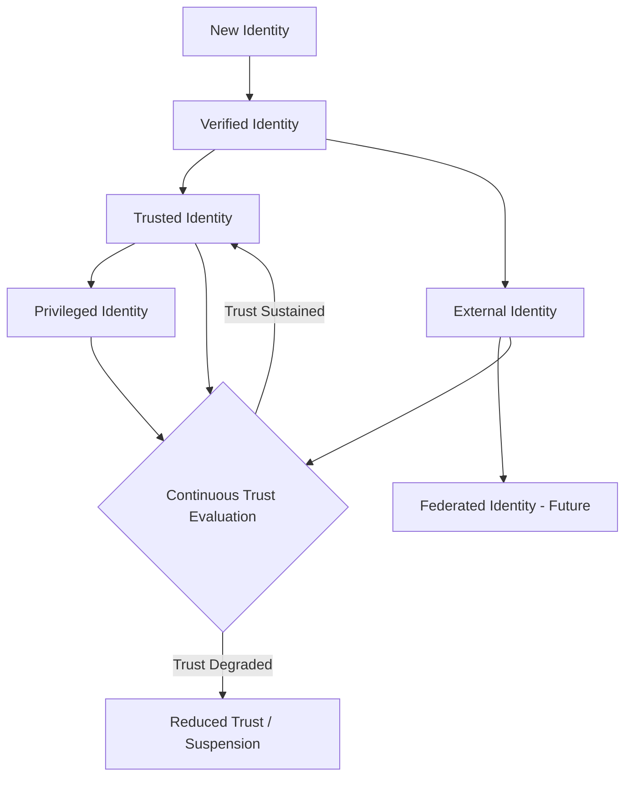
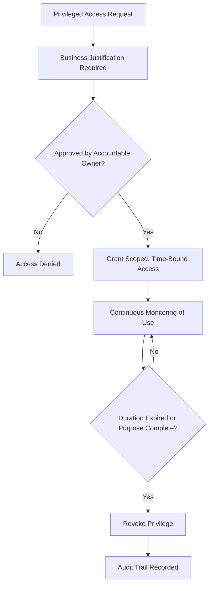
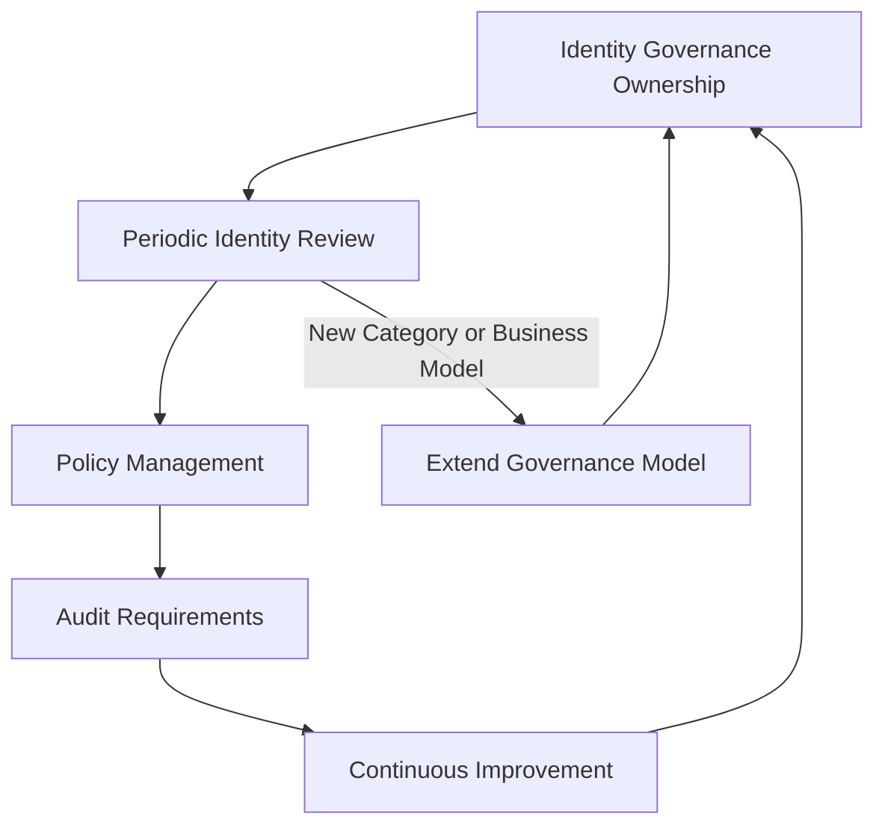

# Identity Management

## 1. Document Purpose

This document defines the official Enterprise Identity Management Strategy for **StackLeo Tech Store**. It establishes the principles governing every digital identity that interacts with the platform — human and system — across its full lifecycle, trust model, and governance.

- **Purpose of Identity Management** — to ensure that every actor the platform interacts with is represented by a distinct, well-governed identity whose existence, access, and trust level can be reasoned about consistently as the organization and platform grow.
- **Relationship with Zero Trust** — identity is the foundational input to the Zero Trust vision described in `security-architecture.md` (Section 2); without well-managed identity, "never trust, always verify" has nothing reliable to verify.
- **Relationship with Authentication** — identity management defines *who an identity is and what state it is in*; `authentication.md` defines *how that identity's claim is verified* at the point of access. This document is the prerequisite the authentication process depends upon.
- **Relationship with Authorization** — identity management defines the identity and its governed attributes; `authorization.md` defines what a verified identity is permitted to do. A well-managed identity is what makes an authorization decision meaningful in the first place.
- **Relationship with Enterprise Security** — this document elaborates Identity Security, one of the five domains defined in `security-architecture.md` (Section 3.1), and is a direct application of Identity-Centric Security and Least Privilege from `security-principles.md` (Sections 3.4 and 3.1).

This document is implementation-independent and vendor-neutral. It defines identity philosophy, categories, lifecycle, and governance — not specific authentication protocols, authorization implementation, IAM products, or code.

## 2. Identity Management Philosophy

- **Identity as the New Security Perimeter** — as StackLeo operates across Web, future Mobile App, future Physical Store, and future POS channels, no fixed network boundary can serve as a meaningful perimeter; identity itself becomes the durable boundary of trust.
- **Identity-Centric Security** — every access decision across the platform begins with a verified identity, never with network origin or convenience alone, consistent with `security-principles.md` (Section 3.4).
- **Least Privilege** — every identity, however it is categorized (Section 3), is granted only the access its defined purpose requires.
- **Continuous Verification** — an identity's trust is never treated as permanently established; it is re-evaluated across its lifecycle (Section 4) and at meaningful points of use, consistent with `security-principles.md` (Section 3.10).
- **Privacy Awareness** — identity data is itself sensitive business and customer data, handled under the same data minimization and privacy principles as any other customer information, per `security-principles.md` (Section 6).
- **Business Enablement** — identity management exists to enable the business to operate and grow safely — from a single-seller B2C model toward corporate sales, wholesale, and a multi-vendor marketplace — not to obstruct legitimate activity.

## 3. Identity Categories

StackLeo recognizes nine conceptual identity categories, each with a distinct purpose, trust level, and business role:

| Category | Purpose | Trust Level | Business Value |
|---|---|---|---|
| Customer Identity | Represents an individual shopper's account and relationship with StackLeo. | Standard | Foundation of the direct-to-consumer relationship and repeat commerce. |
| Employee Identity | Represents internal staff performing operational roles. | Elevated | Enables day-to-day business operation across departments. |
| Administrator Identity | Represents staff with elevated, business-critical capability. | Privileged | Enables platform configuration and oversight; requires the strongest governance. |
| Corporate Customer Identity (Future) | Represents a business-to-business buying relationship. | Standard–Elevated | Enables the future Corporate Sales business model. |
| Vendor Identity (Future) | Represents a third-party seller on the future marketplace. | Scoped External | Enables the Multi-Vendor Marketplace business model. |
| Partner Identity | Represents couriers, service centers, and similar operational partners. | Scoped External | Enables fulfillment, logistics, and after-sales service. |
| Service Identity | Represents an internal service acting on behalf of the platform. | Scoped Internal | Enables reliable, attributable inter-service communication. |
| Machine Identity | Represents infrastructure-level components (schedulers, automation) rather than a business service. | Scoped Internal | Enables automated, unattended operation of routine processes. |
| AI Agent Identity (Future) | Represents AI-assisted capability acting autonomously within defined bounds. | Scoped Internal | Enables AI features (search, recommendations, fraud detection) while remaining governable as a distinct actor. |

### Identity Category Matrix

| Category | Human or System | Primary Channel(s) | Governance Emphasis |
|---|---|---|---|
| Customer Identity | Human | Web, future Mobile App, future Physical Store | Self-service lifecycle, privacy |
| Employee Identity | Human | Internal systems | Role-based provisioning, need-to-know |
| Administrator Identity | Human | Internal systems | Privileged access governance (Section 7) |
| Corporate Customer Identity (Future) | Human (organizational) | Web, future corporate portal | Organizational identity, delegated administration |
| Vendor Identity (Future) | Human (organizational) | Future marketplace | Scoped, seller-specific access boundaries |
| Partner Identity | Human or Organizational | Integration boundary | Contractual and access accountability |
| Service Identity | System | Internal only | Least-privilege, service-to-service scoping |
| Machine Identity | System | Internal only | Automation accountability, credential lifecycle |
| AI Agent Identity (Future) | System | Internal, future external-facing | Bounded autonomy, explicit action scope |

*Diagram 2: Enterprise Identity Ecosystem — human and system identities interact with the same platform under a consistent governance model.*

## 4. Identity Lifecycle

Every identity, regardless of category, moves through a conceptually consistent lifecycle:

- **Creation** — an identity is established in response to a legitimate business need (a new customer registering, a new employee joining, a new service being introduced).
- **Verification** — the claims associated with the identity (such as ownership of an email address, or an employee's onboarding approval) are confirmed before the identity is trusted for use.
- **Activation** — a verified identity is enabled for use, with an initial access scope consistent with least privilege.
- **Usage** — the identity is actively used to access the platform, subject to continuous verification (Section 6).
- **Maintenance** — the identity's attributes and access are kept current as circumstances change (a role change, a renewed business relationship).
- **Suspension** — the identity's access is temporarily disabled in response to a defined trigger (suspected compromise, extended leave, contract pause), without discarding its history.
- **Recovery** — a suspended or inaccessible identity is restored to active use through a deliberate, verified process.
- **Deactivation** — the identity's access is permanently disabled once its legitimate purpose has ended.
- **Retirement** — the identity's remaining data is handled consistently with retention and privacy obligations, per `data-protection.md` and `04_Database/data-retention.md`, until it is no longer required.

*Diagram 1: Identity Lifecycle.*

### Identity Lifecycle Summary

| Stage | Trigger | Primary Concern |
|---|---|---|
| Creation | Legitimate business need arises. | Ensuring the request for a new identity is itself legitimate. |
| Verification | Identity claims require confirmation. | Preventing impersonation or fraudulent registration. |
| Activation | Verification succeeds. | Granting an initial, least-privilege access scope. |
| Usage | Ongoing platform interaction. | Sustaining continuous verification (Section 6). |
| Maintenance | Circumstances change (role, relationship, attributes). | Keeping access aligned with current, legitimate need. |
| Suspension | Risk trigger or temporary pause in legitimacy. | Disabling access without losing accountability history. |
| Recovery | Legitimate request to restore a suspended identity. | Re-verifying legitimacy before restoring trust. |
| Deactivation | Legitimate purpose has ended. | Ensuring access is fully and permanently withdrawn. |
| Retirement | Retention purpose expires. | Handling remaining data per retention and privacy obligations. |

## 5. Identity Governance

- **Identity Ownership** — every identity category has a designated accountable owner (for example, Human Resources for Employee Identity, the Security Lead for Service and Machine Identity) responsible for its lifecycle integrity.
- **Identity Approval** — creation of elevated or privileged identities requires deliberate approval from an accountable party, never self-service provisioning.
- **Identity Review** — active identities and their access are periodically reviewed to confirm continued legitimacy, consistent with Access Governance in `authorization.md`.
- **Identity Audit** — identity lifecycle events (creation, privilege change, suspension, deactivation) are recorded immutably, consistent with `security-principles.md` (Section 9).
- **Lifecycle Oversight** — the Security Lead maintains overall visibility into the lifecycle state of all identity categories, not only privileged ones.
- **Compliance Alignment** — identity governance supports the compliance obligations defined in `01_Business/business-rules.md` (Section 17) and elaborated in `compliance.md`.

## 6. Identity Trust Model

Not every identity carries the same trust level, and trust is never treated as static once granted:

- **Trusted Identities** — identities whose ownership and legitimacy have been fully verified and are actively maintained (e.g., an active employee identity in good standing).
- **Verified Identities** — identities that have completed initial verification but have not yet accumulated the operating history associated with full trust (e.g., a newly registered customer).
- **Privileged Identities** — identities granted elevated capability, subject to the heightened governance described in Section 7.
- **External Identities** — identities belonging to partners, vendors, or other actors outside StackLeo's direct organizational control, trusted only to the scope explicitly granted.
- **Federated Identity Readiness** — the trust model is structured to accommodate identities verified by a trusted external party (for example, a future enterprise customer's own identity system) without requiring a redesign of the underlying categories.
- **Continuous Trust Evaluation** — every identity's trust level is subject to re-evaluation based on behavior, context, and time, not fixed permanently at the point of creation.

*Diagram 3: Identity Trust Model — trust increases through verified history and decreases through continuous re-evaluation, rather than remaining fixed.*

### Trust Level Classification

| Trust Level | Description | Governance Expectation |
|---|---|---|
| Verified | Initial identity claims confirmed. | Standard onboarding controls apply. |
| Trusted | Verified identity with sustained, legitimate operating history. | Periodic review sustains trust status. |
| Privileged | Elevated capability granted. | Heightened governance per Section 7. |
| External | Belongs to a partner or vendor outside direct organizational control. | Scope explicitly bounded by agreement. |
| Federated (Future) | Verified by a trusted external identity provider. | Trust is bounded by the terms of the federation relationship. |

## 7. Privileged Identity Management

- **Administrative Identities** — identities capable of configuring the platform, managing other identities, or accessing sensitive business functions receive the strongest governance of any category.
- **Elevated Access** — access beyond standard operational need is granted only for a specific, justified purpose, consistent with Least Privilege.
- **Temporary Privileges** — elevated access is granted for the minimum necessary duration where the underlying need is time-bound, rather than persisting indefinitely by default.
- **Separation of Duties** — no privileged identity is able to both perform and approve the same high-impact action, consistent with `security-principles.md` (Section 3.8) and `02_Product/user-roles.md` (Section 11).
- **Operational Accountability** — every action taken by a privileged identity is attributable and auditable, consistent with `security-principles.md` (Section 9).

*Diagram 4: Privileged Identity Governance.*

### Privileged Identity Considerations

| Consideration | Description | Why It Matters |
|---|---|---|
| Justification | Every privileged grant traces to a specific business need. | Prevents privilege accumulation without accountability. |
| Time-Boundedness | Elevated access expires when its purpose ends. | Reduces the standing exposure of unused elevated access. |
| Approval | Grants require an accountable approver distinct from the requester. | Enforces Separation of Duties. |
| Monitoring | Use of privileged access is actively observed. | Enables early detection of misuse. |
| Auditability | Every privileged action is attributable and recorded. | Supports investigation and accountability after the fact. |

## 8. Service & Machine Identities

- **Internal Services** — each internal service acts under its own distinct service identity, never under a shared or human identity, so inter-service access can be reasoned about independently.
- **Background Processes** — long-running or asynchronous processes operate under an identity scoped to their specific function, not broad platform-wide access.
- **Scheduled Jobs** — recurring automated tasks are attributed to a specific machine identity, ensuring their actions remain distinguishable from manual activity in audit records.
- **API Consumers** — external and internal systems consuming StackLeo's APIs are represented by distinct identities, enabling per-consumer access scoping and accountability, consistent with `api-security.md`.
- **Automation Systems** — infrastructure automation is attributed to machine identities with access limited to its specific operational function.
- **Future AI Agents** — AI-assisted capability acting autonomously is represented by its own identity category, with explicitly bounded scope of action, so its behavior remains governable and auditable in the same way as any other system actor.

## 9. Future Identity Readiness

This identity strategy is deliberately structured to remain valid as StackLeo's platform and organization evolve:

- **Federated Identity** — the trust model's Federated Identity Readiness (Section 6) allows future recognition of externally verified identities without redefining existing categories.
- **Enterprise SSO** — as enterprise customers require centralized identity management on their own side, the Corporate Customer Identity category (Section 3) is structured to accommodate organization-level identity relationships.
- **Public APIs** — API Consumer identities (Section 8) extend naturally to external, third-party API consumers as public APIs are introduced per `05_API/api-strategy.md`.
- **Marketplace Vendors** — the Vendor Identity category (Section 3) is already defined, allowing seller identity governance to be designed ahead of the marketplace's launch rather than retrofitted.
- **Partner Ecosystem** — the Partner Identity category scales to a growing number of couriers, service centers, and future collaborators under a consistent governance model.
- **AI Services** — the AI Agent Identity category ensures autonomous capability remains subject to the same lifecycle and trust discipline as human and service identities.
- **Multi-Tenant Identity** — as the marketplace and corporate business models mature, the identity model is structured to support multiple organizationally distinct tenants (sellers, corporate accounts) without collapsing their identity boundaries into one another.

## 10. Governance

- **Identity Ownership** — the Security Lead owns the overall coherence of this identity strategy; category-specific ownership (Section 5) is delegated to the most relevant accountable function.
- **Review Process** — identity governance practice is reviewed against this document on a defined cadence and whenever a new identity category or business model is introduced.
- **Policy Management** — operational identity policies derived from this strategy are maintained consistently with it and with `security-governance.md`.
- **Audit Requirements** — identity lifecycle events and privileged identity actions are retained and reviewable, consistent with `security-principles.md` (Section 9) and `compliance.md`.
- **Continuous Improvement** — this strategy is expected to mature as new identity categories, channels, and business models are introduced, rather than being fixed at its initial definition.

*Diagram 5: Identity Governance Lifecycle.*

### Governance Responsibility Matrix

| Role | Responsibility |
|---|---|
| Security Lead | Owns overall coherence of the identity strategy and privileged identity governance. |
| Human Resources | Owns Employee Identity lifecycle events (onboarding, role change, offboarding). |
| Engineering Leads | Own Service and Machine Identity provisioning within their domain. |
| Product Manager | Ensures Customer and future Corporate Customer identity experience aligns with business need. |
| Operations Lead | Owns Partner and future Vendor identity relationship management. |
| Internal Audit / Review Function | Independently verifies identity governance is applied consistently in practice. |

## 11. Anti-Patterns

| Anti-Pattern | Why It's Avoided |
|---|---|
| Shared Accounts | Removes individual accountability, making audit and Separation of Duties (Section 7) impossible to enforce. |
| Orphaned Accounts | Identities that outlive their legitimate purpose (Section 4) remain a standing, unmonitored access risk. |
| Excessive Privileges | Violates Least Privilege (Section 2); expands the impact of any single compromised identity. |
| No Identity Reviews | Allows access to drift away from legitimate current need, undermining Identity Governance (Section 5). |
| Weak Lifecycle Management | Leaves gaps at Suspension, Recovery, or Deactivation (Section 4) that can be exploited or simply forgotten. |
| No Ownership | Leaves identity categories without an accountable party, guaranteeing inconsistent governance over time. |
| Poor Auditability | Prevents identity-related incidents from being investigated or attributed, undermining `security-principles.md` (Section 9). |
| Static Trust | Assumes an identity's trust, once granted, remains valid indefinitely — contradicting Continuous Trust Evaluation (Section 6). |

## 12. Document Information

| Property | Value |
|----------|-------|
| Document | identity-management.md |
| Version | 1.0.0 |
| Status | Active |
| Maintained By | StackLeo |
| Last Updated | 2026-07-17 |

---

© StackLeo. All Rights Reserved.
