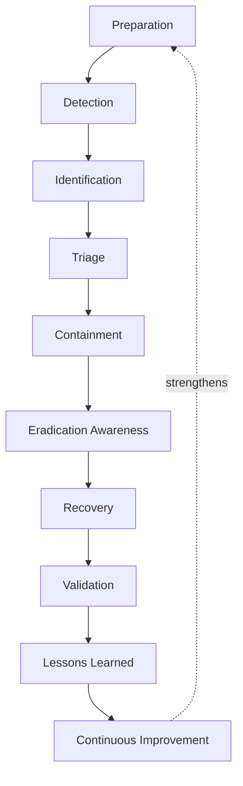
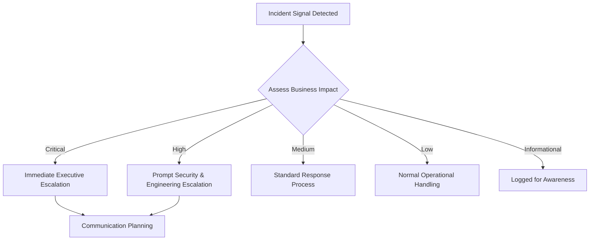
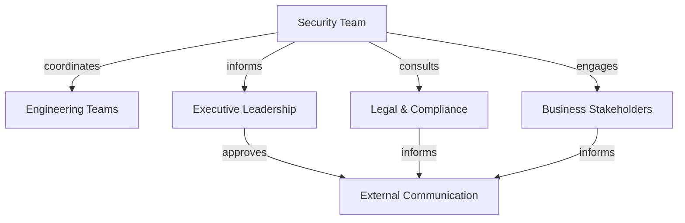
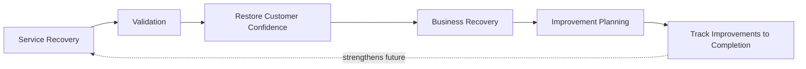
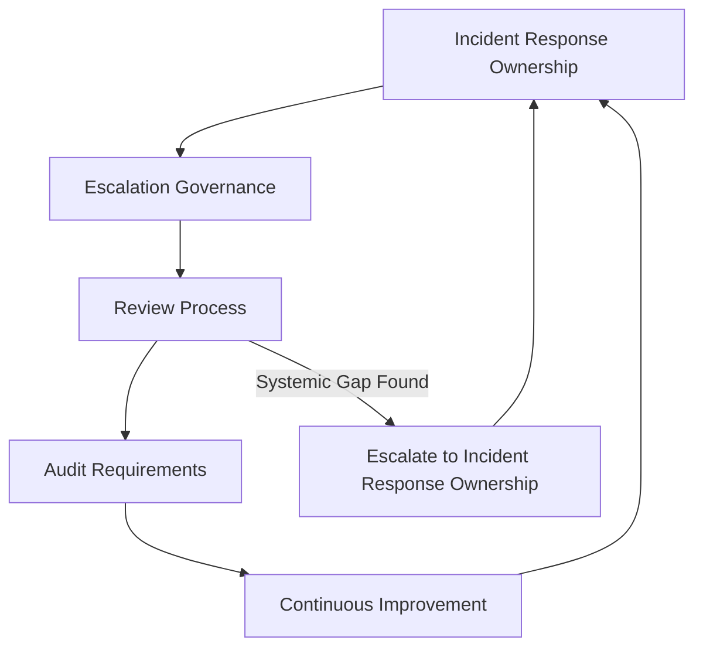

# Incident Response

## 1. Document Purpose

This document defines the official Enterprise Incident Response Strategy for **StackLeo Tech Store**. It establishes how the organization detects, responds to, recovers from, and learns from security incidents affecting the platform.

- **Purpose of Incident Response** — to ensure that when a security incident occurs — not if, consistent with Assume Breach — the organization responds in a coordinated, timely, and effective manner rather than improvising under pressure.
- **Relationship with Cyber Resilience** — incident response is the operational discipline that makes Resilience by Design (`security-architecture.md`, Section 2) concrete: it is how the organization actually detects, contains, and recovers from the failures that resilience assumes will eventually occur.
- **Relationship with Business Continuity** — a security incident affecting availability is simultaneously a continuity incident; this strategy is coordinated with `03_System_Design/resilience-strategy.md` and `04_Database/backup-recovery.md`.
- **Relationship with Enterprise Risk Management** — this document operationalizes the risk philosophy in `security-principles.md` (Section 5) at the moment a risk is realized, turning prior risk assessment into concrete response action.
- **Relationship with Customer Trust** — how StackLeo responds to an incident is as consequential to customer trust as whether the incident occurred at all; a well-handled incident preserves the trust described in `01_Business/vision.md`, while a poorly handled one compounds the damage.

This document is implementation-independent and vendor-neutral. It defines incident response philosophy, lifecycle, and governance — not specific incident response platforms, forensic procedures, attack response techniques, or code.

## 2. Incident Response Philosophy

- **Preparedness First** — the organization maintains a clear, practiced understanding of how it will respond before an incident occurs, rather than designing a response in the moment.
- **Rapid Detection** — the sooner an incident is recognized, the smaller its ultimate impact tends to be; detection capability is treated as a first-class investment, consistent with `security-architecture.md` (Section 8).
- **Coordinated Response** — incident response engages the right people, in the right sequence, with clear ownership — never left to whoever happens to notice first.
- **Business Continuity** — response prioritizes restoring the business's ability to serve customers, not solely the elimination of the technical cause, consistent with `security-principles.md` (Section 9).
- **Evidence Preservation Awareness** — response actions are taken with awareness that evidence may be needed for later investigation or accountability, without requiring any specific forensic technique to be prescribed here.
- **Continuous Improvement** — every incident, near-miss, and drill is treated as an input to improving future readiness, not merely an event to be closed out.

## 3. Incident Response Lifecycle

| Phase | Objectives | Business Value |
|---|---|---|
| Preparation | Establish readiness — roles, escalation paths, and practiced understanding — before an incident occurs. | Reduces response time and confusion when an incident actually happens. |
| Detection | Recognize that an incident may be occurring. | Enables response to begin as early as possible, limiting impact. |
| Identification | Confirm the nature and scope of what is occurring. | Prevents wasted effort responding to a misunderstood situation. |
| Triage | Assess severity and determine appropriate urgency and response scale. | Ensures response effort is proportionate to actual business impact. |
| Containment | Limit the incident's ability to spread or worsen. | Bounds the ultimate impact while a full response is organized. |
| Eradication Awareness | Address the underlying cause once contained, so the incident does not simply recur. | Prevents a contained incident from re-emerging shortly after. |
| Recovery | Restore affected capability to normal, trusted operation. | Restores the business's ability to serve customers. |
| Validation | Confirm recovery is genuine and complete before declaring the incident resolved. | Prevents premature closure of an incident that is not actually over. |
| Lessons Learned | Review what happened and why, and what should change. | Converts a costly event into durable improvement. |
| Continuous Improvement | Apply lessons learned to preparedness, detection, and response capability. | Ensures the organization's response capability compounds over time rather than resetting after each incident. |

*Diagram 1: Incident Response Lifecycle.*

### Incident Lifecycle Matrix

| Phase | Trigger | Primary Concern |
|---|---|---|
| Preparation | Ongoing, before any incident | Ensuring roles and escalation paths are defined and practiced |
| Detection | A potential incident signal appears | Recognizing the signal promptly |
| Identification | A potential incident requires confirmation | Establishing what is actually occurring |
| Triage | An identified incident requires prioritization | Assigning appropriate urgency and response scale |
| Containment | A triaged incident requires limiting spread | Bounding impact while response continues |
| Eradication Awareness | Containment is achieved | Addressing the underlying cause, not just the symptom |
| Recovery | Underlying cause is addressed | Restoring normal, trusted operation |
| Validation | Recovery is claimed complete | Confirming recovery is genuine before closure |
| Lessons Learned | Incident is validated as resolved | Extracting durable improvement from the event |
| Continuous Improvement | Lessons are captured | Applying them to future preparedness |

## 4. Incident Categories

| Category | Business Impact | Response Priorities | Governance Considerations |
|---|---|---|---|
| Application Security Incidents | Compromise of customer-facing or business logic capability. | Contain affected capability; verify business logic integrity. | Coordinate with Engineering leads owning `application-security.md`. |
| API Security Incidents | Compromise or abuse affecting API consumers. | Assess consumer impact; contain abuse or unauthorized access. | Coordinate with API Governance, per `api-security.md`. |
| Infrastructure Incidents | Compromise or failure of the underlying runtime environment. | Contain affected infrastructure; assess blast radius across dependent workloads. | Coordinate with Infrastructure Engineering, per `infrastructure-security.md`. |
| Network Incidents | Compromise or disruption of communication paths. | Contain affected network segments; verify trust boundaries remain intact. | Coordinate with Operations, per `network-security.md`. |
| Identity & Access Incidents | Unauthorized access or credential compromise. | Revoke and re-verify affected identities; assess scope of access exposure. | Heightened urgency given foundational nature, per `identity-management.md`. |
| Data Protection Incidents | Unauthorized disclosure, alteration, or loss of data. | Assess data classification and scope affected; determine notification obligations. | Coordinated with Data Protection Owner and `compliance.md`. |
| Third-Party Incidents | Compromise originating from or affecting an external partner or dependency. | Assess exposure through the trust boundary; coordinate with the partner. | Coordinated per the integration agreement and `security-architecture.md` (Section 4). |
| Operational Security Incidents | Disruption to monitoring, logging, or operational capability itself. | Restore observability first, since it underpins response to everything else. | Highest internal urgency, as it can blind response to other incidents. |

### Incident Category Matrix

| Category | Primary Related Document |
|---|---|
| Application Security Incidents | `application-security.md` |
| API Security Incidents | `api-security.md` |
| Infrastructure Incidents | `infrastructure-security.md` |
| Network Incidents | `network-security.md` |
| Identity & Access Incidents | `identity-management.md`, `authentication.md`, `authorization.md` |
| Data Protection Incidents | `data-protection.md`, `compliance.md` |
| Third-Party Incidents | `security-architecture.md` (Section 4) |
| Operational Security Incidents | `security-architecture.md` (Section 8) |

## 5. Incident Classification

| Severity | Business Impact | Escalation Expectations | Communication Awareness |
|---|---|---|---|
| Critical | Threatens core business viability, customer trust at scale, or regulatory standing. | Immediate executive notification and full incident response activation. | Prepared customer and stakeholder communication considered without delay. |
| High | Significant, contained damage to trust, revenue, or operations. | Prompt notification to Security Lead and affected Engineering leads. | Internal stakeholders informed promptly; external communication assessed. |
| Medium | Noticeable but recoverable impact, unlikely to threaten the business as a whole. | Standard incident response process, tracked to resolution. | Internal awareness maintained; external communication rarely required. |
| Low | Minor, easily absorbed impact. | Handled through normal operational process. | Limited to the directly involved team. |
| Informational | No direct exploitable impact; observational in nature. | Logged for awareness; no response activation required. | No external communication warranted. |

*Diagram 2: Incident Escalation Flow.*

### Severity Classification Matrix

| Severity | Typical Response Timeframe Expectation | Executive Involvement |
|---|---|---|
| Critical | Immediate | Direct, ongoing involvement |
| High | Prompt, within a short defined period | Notified, available if needed |
| Medium | Within a defined, moderate period | Not routinely involved |
| Low | Normal operational handling | Not involved |
| Informational | No mandatory timeframe | Not involved |

## 6. Response Coordination

- **Security Team Coordination** — the Security Lead coordinates overall response, ensuring the right domain expertise is engaged based on the incident category (Section 4).
- **Engineering Coordination** — Engineering leads owning the affected capability participate directly in containment, eradication, and recovery.
- **Executive Awareness** — executive leadership is informed proportionate to severity (Section 5), maintaining visibility into business-significant incidents without being drawn into every operational detail.
- **Business Stakeholders** — Product and Operations stakeholders are engaged where an incident affects customer experience or business process, ensuring response accounts for business consequence, not only technical remediation.
- **Legal & Compliance Awareness** — incidents involving Confidential or Restricted data, per `data-protection.md` (Section 4), are assessed for legal and regulatory notification obligations, coordinated with `compliance.md`.
- **External Communication Principles** — communication with customers, partners, or regulators is deliberate, accurate, and coordinated through a single accountable voice, never improvised by whoever is closest to the incident.

*Diagram 3: Response Coordination Framework.*

### Response Coordination Matrix

| Stakeholder | Role During Incident |
|---|---|
| Security Team | Coordinates overall response and domain expertise engagement |
| Engineering Teams | Execute containment, eradication, and recovery for affected capability |
| Executive Leadership | Maintains visibility proportionate to severity; approves external communication |
| Business Stakeholders | Ensure response accounts for customer and business process impact |
| Legal & Compliance | Assesses notification obligations for data-related incidents |
| External Communication Owner | Delivers accurate, coordinated communication through a single voice |

## 7. Recovery & Resilience

- **Service Recovery** — affected capability is restored to normal, trusted operation, verified rather than assumed complete.
- **Operational Continuity** — recovery prioritizes restoring the business's ability to serve customers, coordinated with `03_System_Design/resilience-strategy.md`.
- **Validation** — recovery is confirmed through deliberate verification before an incident is declared closed, consistent with `security-testing.md` principles applied to the recovered state.
- **Customer Confidence** — recovery includes deliberate attention to restoring customer confidence, not only technical function, recognizing that trust is the asset most at stake per `01_Business/vision.md`.
- **Business Recovery** — recovery extends beyond technical restoration to any affected business process, financial reconciliation, or partner relationship.
- **Improvement Planning** — recovery concludes with a concrete plan for the improvements identified during Lessons Learned (Section 3), tracked to completion like any other prioritized work.

*Diagram 4: Recovery & Improvement Cycle.*

## 8. Future Readiness

This strategy is deliberately structured to remain valid as StackLeo's platform and organization evolve:

- **Cloud-Native Platforms** — the incident categories in Section 4 apply consistently regardless of the specific cloud-native services adopted.
- **Microservices** — as decomposition into more services increases the number of components that could be independently affected, this strategy's category-based triage (Section 4) scales without redefinition.
- **Marketplace Platform** — Third-Party Incidents (Section 4) already anticipate the coordination needs of a growing marketplace vendor ecosystem.
- **AI Systems** — incidents involving AI-assisted capability are triaged under the same lifecycle and severity classification as any other component, with attention to the bounded scope defined in `identity-management.md` (Section 8).
- **Multi-Region Operations** — response coordination extends naturally across regions as StackLeo's infrastructure footprint grows, without requiring a redefined lifecycle.
- **Enterprise Customers** — corporate and wholesale customers bring heightened expectations for incident communication and assurance, which this strategy's coordination principles (Section 6) are structured to satisfy.
- **Global Expansion** — incident classification and response principles remain jurisdiction-agnostic, allowing region-specific notification obligations to layer on via `compliance.md`.

## 9. Governance

- **Incident Ownership** — the Security Lead owns overall incident response readiness and coordination, consistent with the ownership model in `security-architecture.md` (Section 10).
- **Escalation Governance** — escalation paths and severity-based expectations (Section 5) are defined clearly and reviewed periodically to ensure they remain workable.
- **Review Process** — every incident undergoes Lessons Learned review (Section 3); this strategy itself is reviewed periodically for continued effectiveness.
- **Audit Requirements** — incident response activity is recorded consistently with `security-principles.md` (Section 9), supporting later review and accountability.
- **Continuous Improvement** — this strategy is expected to mature as the organization's incident history, platform, and threat landscape evolve.

*Diagram 5: Incident Governance Framework.*

### Governance Responsibility Matrix

| Role | Responsibility |
|---|---|
| Security Lead | Owns coherence and enforcement of the incident response strategy. |
| Engineering Leads | Participate directly in containment, eradication, and recovery for their domain. |
| Executive Leadership | Maintains visibility and decision authority for Critical and High incidents. |
| Operations Lead | Maintains detection and monitoring capability supporting rapid response. |
| Legal & Compliance | Assesses notification obligations for data-related incidents. |
| Internal Audit / Review Function | Independently verifies incident response practice matches this strategy. |

## 10. Anti-Patterns

| Anti-Pattern | Why It's Avoided |
|---|---|
| No Preparation | Contradicts Preparedness First (Section 2); forces response design to happen under pressure, increasing error and delay. |
| Delayed Detection | Allows an incident's impact to grow before response begins, contradicting Rapid Detection (Section 2). |
| Poor Communication | Damages customer and stakeholder trust independent of the incident's technical severity, contradicting Section 6. |
| Weak Coordination | Leaves response fragmented across teams without clear ownership, contradicting Coordinated Response (Section 2). |
| Missing Documentation | Prevents accountability and undermines Lessons Learned (Section 3). |
| No Lessons Learned | Allows the same class of incident to recur without the organization's readiness improving. |
| Reactive Response | Treats incident response as something improvised in the moment rather than a prepared, practiced discipline. |
| Weak Governance | Allows incident response practice to drift from this strategy with no accountable owner or review mechanism (Section 9). |

## 11. Document Information

| Property | Value |
|----------|-------|
| Document | incident-response.md |
| Version | 1.0.0 |
| Status | Active |
| Maintained By | StackLeo |
| Last Updated | 2026-07-17 |

---

© StackLeo. All Rights Reserved.
