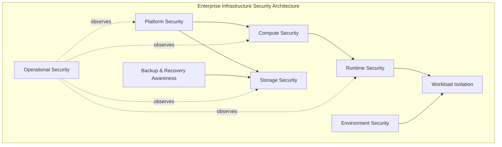
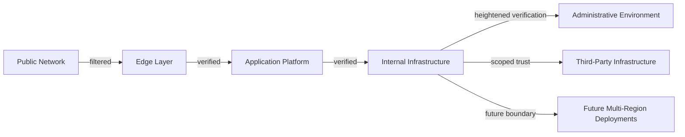
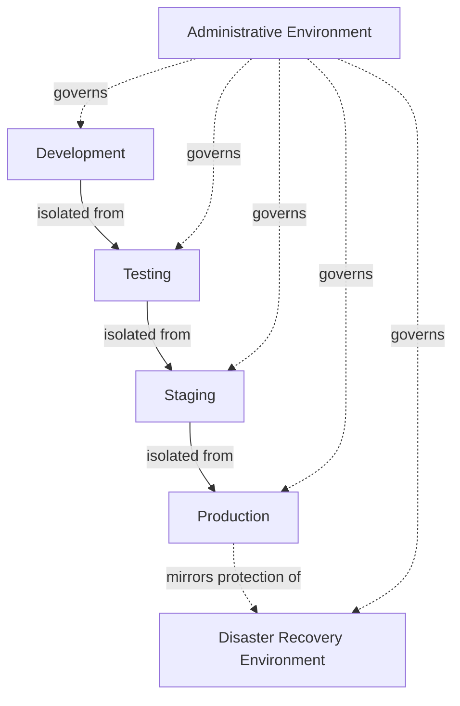
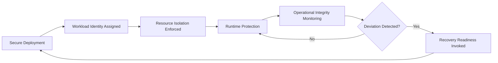
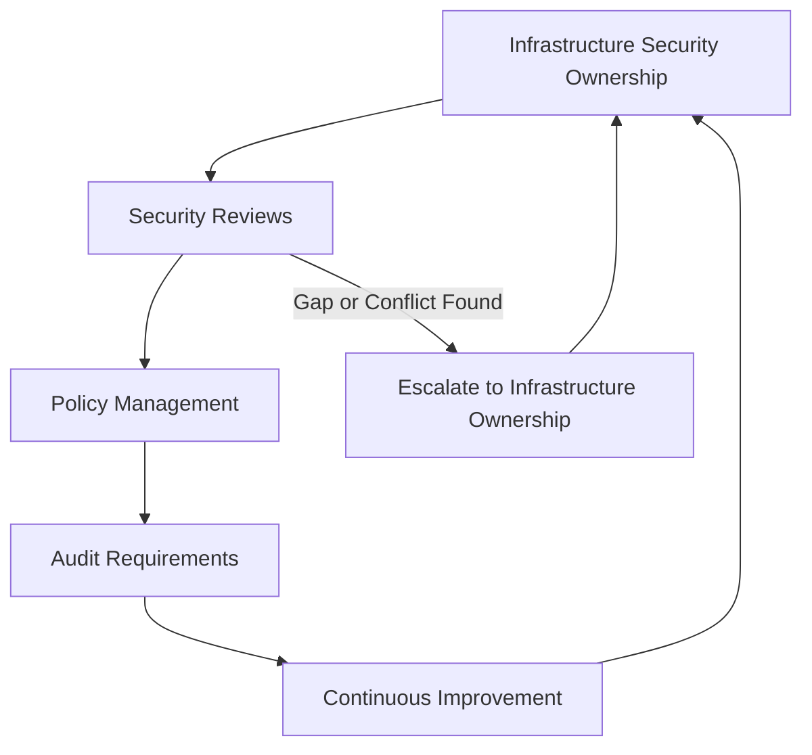

# Infrastructure Security

## 1. Document Purpose

This document defines the official Enterprise Infrastructure Security Strategy for **StackLeo Tech Store**. It establishes how the platform protects the runtime environment underpinning every layer of business capability, independent of any specific cloud provider or deployment model.

- **Purpose of Infrastructure Security** — to ensure that the environment the platform runs in — compute, storage, network, and the platform surrounding them — does not become the weak point undermining otherwise well-protected identity, application, and data layers.
- **Relationship with Enterprise Architecture** — this document elaborates Infrastructure Security, one of the five domains defined in `security-architecture.md` (Section 3.4), and is closely coordinated with `03_System_Design/deployment-architecture.md`.
- **Relationship with Platform Security** — this document establishes the security expectations the platform's runtime environment must satisfy, regardless of which specific technologies or providers realize it.
- **Relationship with Business Resilience** — infrastructure weaknesses can affect every business capability built upon them simultaneously; this strategy exists to prevent the foundation from becoming the business's single largest point of failure, consistent with `security-principles.md` (Section 9).
- **Relationship with Operational Continuity** — infrastructure security and operational continuity are inseparable: a security incident affecting infrastructure availability is also a continuity incident, coordinated with `03_System_Design/resilience-strategy.md` and `04_Database/backup-recovery.md`.

This document is implementation-independent and vendor-neutral. It defines infrastructure security philosophy, domains, and governance — not specific cloud providers, configurations, hardening procedures, or code.

## 2. Infrastructure Security Philosophy

- **Zero Trust Infrastructure** — no infrastructure component trusts another based on network location or physical or logical proximity alone; trust is established explicitly, consistent with `security-architecture.md` (Section 2).
- **Secure by Design** — infrastructure security is considered when deployment topology is first designed, not retrofitted once components are already running, consistent with `security-principles.md` (Section 8).
- **Defense in Depth** — infrastructure protection relies on multiple independent layers (Section 3), so no single control's failure compromises the whole environment.
- **Least Privilege** — every infrastructure component and administrative identity is granted only the access its defined function requires, consistent with `authorization.md`.
- **Environment Isolation** — distinct environments (Section 5) are separated deliberately, preventing a weakness in one from directly affecting another.
- **Continuous Verification** — trust extended to any infrastructure component is re-evaluated over time and across conditions, never assumed to persist indefinitely once granted.

## 3. Infrastructure Security Domains

### Compute Security

- **Purpose** — protect the processing environments that execute the platform's workloads.
- **Business Value** — ensures the environment executing business logic remains trustworthy and unaltered.
- **Protection Objectives** — compute resources are provisioned, accessed, and monitored consistently with least privilege and defense in depth.

### Storage Security

- **Purpose** — protect data at the infrastructure layer where it is physically or logically persisted.
- **Business Value** — provides a foundational layer of protection beneath the data-layer safeguards described in `data-protection.md`.
- **Protection Objectives** — storage access is scoped, monitored, and consistent with the classification-proportionate protection defined in `data-protection.md` (Section 4).

### Runtime Security

- **Purpose** — protect workloads while they are actively executing.
- **Business Value** — ensures business logic runs in an environment free from unauthorized interference during execution.
- **Protection Objectives** — runtime behavior is observable and deviations from expected operation are detectable (Section 7).

### Platform Security

- **Purpose** — protect the underlying platform services (orchestration, shared services) that workloads depend upon.
- **Business Value** — prevents a weakness in shared platform capability from cascading into every workload built upon it.
- **Protection Objectives** — the platform layer itself is held to the same Secure by Design and Least Privilege principles as any other component.

### Environment Security

- **Purpose** — protect the distinct development, testing, staging, and production environments (Section 5) from one another.
- **Business Value** — prevents a lower-assurance environment from becoming a path to compromising production.
- **Protection Objectives** — environments are deliberately isolated, with access and data flow between them explicitly governed.

### Workload Isolation

- **Purpose** — ensure individual workloads cannot interfere with or gain unintended access to one another.
- **Business Value** — limits the blast radius of a single compromised or misbehaving workload, particularly important as multi-tenant capability (marketplace, corporate) matures.
- **Protection Objectives** — workloads operate within clearly bounded resource and access scopes (Section 6).

### Backup & Recovery Awareness

- **Purpose** — ensure infrastructure supports the business's ability to recover from disruption or data loss.
- **Business Value** — protects continuity of commerce and customer trust through adverse events, coordinated with `04_Database/backup-recovery.md`.
- **Protection Objectives** — backup infrastructure is protected to the same standard as primary infrastructure, never treated as an afterthought.

### Operational Security

- **Purpose** — sustain protection and detect deviation from expected behavior across the infrastructure layer while it is running.
- **Business Value** — determines how quickly the business can detect and respond to an infrastructure-originating issue.
- **Protection Objectives** — infrastructure is continuously monitored and logged, consistent with Section 7.

### Infrastructure Security Domain Matrix

| Domain | Primary Risk Addressed | Related Document |
|---|---|---|
| Compute Security | Unauthorized access to or alteration of processing environments | `security-architecture.md` |
| Storage Security | Unauthorized access to data at the infrastructure layer | `data-protection.md`, `encryption.md` |
| Runtime Security | Interference with workloads during active execution | `application-security.md` |
| Platform Security | Cascading failure from shared platform services | `03_System_Design/deployment-architecture.md` |
| Environment Security | Lower-assurance environments compromising production | Section 5 (this document) |
| Workload Isolation | Interference between co-located workloads | Section 6 (this document) |
| Backup & Recovery Awareness | Inability to recover from disruption or data loss | `04_Database/backup-recovery.md` |
| Operational Security | Undetected deviation from expected infrastructure behavior | `security-architecture.md` |

*Diagram 1: Enterprise Infrastructure Security Architecture.*

## 4. Infrastructure Trust Boundaries

Infrastructure layers cross several conceptual trust boundaries, each requiring independent verification:

- **Public Network** — the outermost, entirely untrusted network space from which all external traffic originates.
- **Edge Layer** — the platform's first point of control, where traffic is observed and filtered before reaching internal infrastructure.
- **Application Platform** — the layer hosting business capability, trusted only to the extent its own identity and configuration are verified.
- **Internal Infrastructure** — the broader set of internal compute, storage, and networking components, each still requiring independent verification from one another.
- **Administrative Environment** — the boundary protecting infrastructure configuration and control capability from routine workload traffic.
- **Third-Party Infrastructure** — infrastructure operated by external providers (hosting, CDN, or similar), trusted only to the scope of the specific service relationship.
- **Future Multi-Region Deployments** — the boundary anticipated between infrastructure operating in distinct geographic regions as StackLeo expands internationally.

Infrastructure layers should never implicitly trust each other because physical or logical proximity is not evidence of legitimacy: if an inner layer trusts an outer layer merely because a connection reached it, a single compromised edge or network component becomes a direct path to every layer behind it, defeating the purpose of Defense in Depth (Section 2).

*Diagram 2: Infrastructure Trust Boundary Model.*

## 5. Environment Segregation

- **Development** — used for active feature construction, isolated from any environment holding real customer or business data.
- **Testing** — used for automated and manual verification, populated with representative but non-production data.
- **Staging** — used for pre-production validation under conditions closely resembling production, with access scoped as tightly as production itself.
- **Production** — hosts live customer and business capability, receiving the strongest infrastructure protection of any environment.
- **Administrative Environment** — hosts the tooling and access used to configure and operate the platform itself, isolated and protected beyond routine workload environments.
- **Disaster Recovery Environment** — maintained to restore operation in the event production becomes unavailable, protected to a standard consistent with production itself.

The goal of environment segregation is conceptual isolation: a weakness or compromise in a lower-assurance environment (Development, Testing) must never provide a path into a higher-assurance one (Staging, Production, Disaster Recovery), and data appropriate to one environment must never flow into another without deliberate, governed justification.

*Diagram 3: Environment Segregation Overview.*

### Environment Segregation Matrix

| Environment | Data Sensitivity | Access Restriction |
|---|---|---|
| Development | None to minimal — no real customer data | Broad within Engineering, isolated from Production |
| Testing | Representative, non-production data | Scoped to QA and Engineering |
| Staging | Near-production conditions | Scoped as tightly as Production |
| Production | Full customer and business data | Narrowest, most tightly governed access |
| Administrative Environment | Configuration and control capability | Privileged Access Management applies, per `identity-management.md` (Section 7) |
| Disaster Recovery Environment | Mirrors Production sensitivity | Protected to the same standard as Production |

## 6. Workload Protection

- **Workload Identity** — every workload operates under its own distinct identity, consistent with Service and Machine Identity in `identity-management.md` (Section 3), never a shared or ambient identity.
- **Runtime Protection** — workloads are protected from unauthorized interference while executing, consistent with Runtime Security (Section 3).
- **Resource Isolation** — workloads are bounded in the compute, storage, and network resources they can consume, preventing one workload from starving or interfering with another.
- **Operational Integrity** — a workload's observed behavior is expected to remain consistent with its intended function; deviation is treated as a signal warranting investigation.
- **Secure Deployment Awareness** — the process by which a workload reaches a running state is treated as security-relevant, ensuring what runs matches what was reviewed and approved, consistent with `application-security.md` (Section 3).
- **Recovery Readiness** — every workload has an explicit, understood path to recovery if it fails or is compromised, consistent with `03_System_Design/architecture-principles.md` (ARCH-045).

*Diagram 4: Workload Protection Lifecycle.*

### Workload Protection Summary

| Concern | Protection Approach |
|---|---|
| Workload Identity | Every workload operates under a distinct, verifiable identity |
| Runtime Protection | Workloads are protected from interference during execution |
| Resource Isolation | Workloads are bounded from consuming or affecting shared resources beyond their scope |
| Operational Integrity | Behavior consistent with intended function is continuously expected and monitored |
| Secure Deployment Awareness | What runs is verified to match what was reviewed |
| Recovery Readiness | Every workload has an explicit, understood recovery path |

## 7. Operational Resilience

- **Monitoring** — infrastructure state is continuously observed so deviation from expected behavior can be recognized early, consistent with `security-architecture.md` (Section 8).
- **Logging** — infrastructure-level events are recorded with sufficient context to support investigation, consistent with `security-principles.md` (Section 9).
- **Backup Awareness** — infrastructure supporting backup capability is protected and validated, coordinated with `04_Database/backup-recovery.md`.
- **Recovery Planning** — the organization maintains a clear, practiced understanding of how infrastructure-affecting disruption is recovered from.
- **Capacity Awareness** — infrastructure capacity is planned and monitored to avoid disruption from resource exhaustion under legitimate demand.
- **Business Continuity** — infrastructure resilience is designed to preserve the business's ability to keep serving customers through disruption, coordinated with `03_System_Design/resilience-strategy.md`.

### Operational Resilience Matrix

| Concern | Purpose | Coordinated With |
|---|---|---|
| Monitoring | Early recognition of deviation from expected behavior | `security-architecture.md` (Section 8) |
| Logging | Sufficient context for investigation and accountability | `security-principles.md` (Section 9) |
| Backup Awareness | Protected, validated recovery capability | `04_Database/backup-recovery.md` |
| Recovery Planning | Practiced, understood disruption recovery | `03_System_Design/resilience-strategy.md` |
| Capacity Awareness | Avoiding disruption from resource exhaustion | `03_System_Design/scalability-strategy.md` |
| Business Continuity | Preserving customer-facing service through disruption | `security-principles.md` (Section 9) |

## 8. Future Infrastructure Readiness

This strategy is deliberately structured to remain valid as StackLeo's infrastructure evolves:

- **Cloud-Native Platforms** — the domain-and-boundary structure in Sections 3–4 applies consistently regardless of the specific cloud-native services adopted.
- **Containerized Workloads** — Workload Isolation and Workload Protection (Sections 3, 6) apply directly to containerized execution models without redefinition.
- **Kubernetes** — orchestration-managed workloads remain subject to the same Workload Identity, isolation, and monitoring principles as any other execution model.
- **Multi-Cloud** — infrastructure security principles remain independent of any specific provider, supporting the multi-cloud posture referenced in `security-principles.md` (Section 10).
- **Multi-Region** — Future Multi-Region Deployments (Section 4) are already anticipated, allowing regional infrastructure boundaries to be governed deliberately as expansion occurs.
- **Marketplace Platform** — infrastructure supporting seller-facing capability is subject to the same domain coverage (Section 3) as infrastructure supporting the core platform today.
- **AI Infrastructure** — infrastructure supporting AI-assisted capability remains subject to the same Compute, Runtime, and Workload Isolation principles as any other workload.

## 9. Governance

- **Infrastructure Ownership** — the Security Lead, in coordination with Operations and Infrastructure Engineering leads, owns the coherence of this infrastructure security strategy.
- **Security Reviews** — significant infrastructure and deployment decisions are reviewed against this strategy, consistent with the review discipline in `03_System_Design/architecture-decisions.md`.
- **Policy Management** — operational infrastructure security policies are derived from this strategy and maintained consistently with `security-governance.md`.
- **Audit Requirements** — infrastructure-level security events and administrative access are recorded consistently with `security-principles.md` (Section 9).
- **Continuous Improvement** — this strategy is expected to mature as infrastructure architecture, scale, and threat context evolve.

*Diagram 5: Infrastructure Security Governance Framework.*

### Governance Responsibility Matrix

| Role | Responsibility |
|---|---|
| Security Lead | Owns coherence and enforcement of the infrastructure security strategy. |
| Operations Lead | Executes operational monitoring, backup, and recovery practice. |
| Infrastructure Engineering Leads | Apply infrastructure security domains within their area. |
| Solution Architect | Ensures infrastructure security remains consistent with `03_System_Design/deployment-architecture.md`. |
| Data Protection Owner | Ensures storage-layer protection aligns with `data-protection.md`. |
| Internal Audit / Review Function | Independently verifies infrastructure security practice matches this strategy. |

## 10. Anti-Patterns

| Anti-Pattern | Why It's Avoided |
|---|---|
| Flat Infrastructure Trust | Contradicts Zero Trust Infrastructure (Section 2); allows lateral movement across layers assumed to be equally trusted. |
| Weak Environment Isolation | Allows a lower-assurance environment to become a path into Staging or Production, contradicting Section 5. |
| Excessive Administrative Access | Violates Least Privilege (Section 2); expands the impact of any single compromised administrative identity. |
| Poor Backup Governance | Leaves Backup & Recovery Awareness (Section 3) unmanaged, threatening the business's ability to recover from disruption. |
| Missing Operational Visibility | Removes the ability to detect deviation from expected infrastructure behavior, undermining Section 7. |
| Weak Platform Governance | Leaves shared platform services (Section 3) inadequately protected, risking cascading failure across every dependent workload. |
| No Recovery Planning | Leaves infrastructure-affecting disruption without a practiced, understood response, contradicting Section 7. |
| Reactive Infrastructure Security | Treats infrastructure security as a response to incidents rather than a continuous discipline embedded in design (Section 2). |

## 11. Document Information

| Property | Value |
|----------|-------|
| Document | infrastructure-security.md |
| Version | 1.0.0 |
| Status | Active |
| Maintained By | StackLeo |
| Last Updated | 2026-07-17 |

---

© StackLeo. All Rights Reserved.
