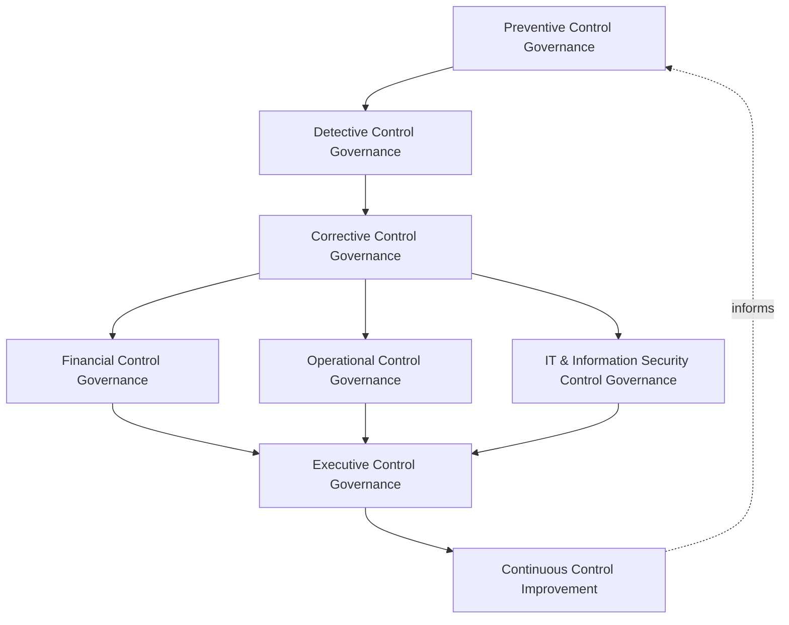
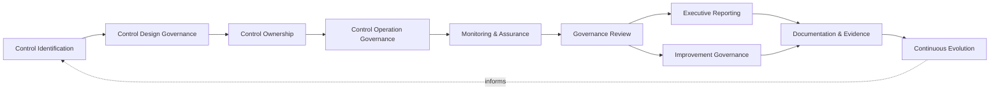
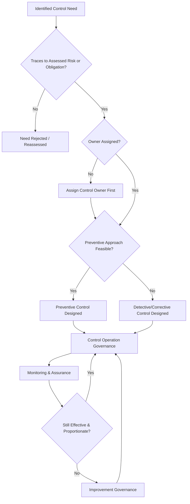
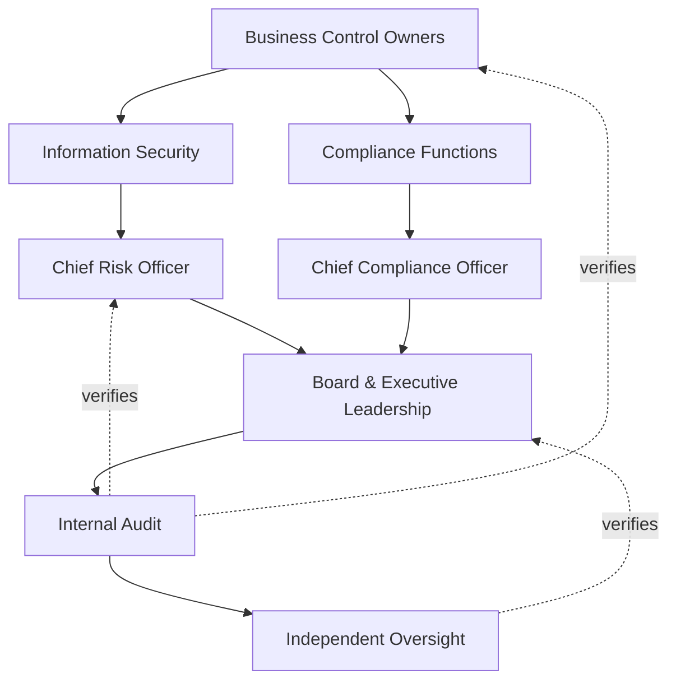
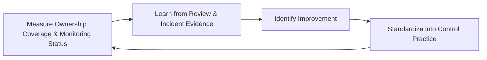
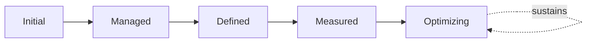

# Enterprise Internal Control Framework

## 1. Document Purpose

This document defines the official Enterprise Internal Control Framework for **StackLeo Tech Store** — the CRO/CCO/CAE-owned executive charter under which every preventive, detective, and corrective control across the organization is governed as a deliberate, accountable discipline. It establishes governance for control ownership, organizational accountability, executive oversight, control assurance, and long-term internal control maturity, consistent with the COSO Internal Control–Integrated Framework, ISO/IEC 27001, and TOGAF enterprise architecture thinking.

`internal-controls.md` remains the operational governance framework for control practice — the document that elaborates in full operational depth the control governance model, domains, and lifecycle across every category of business activity. This document sits above it as the highest-level executive mandate, consistent with the executive-charter relationship `enterprise-risk-management-strategy.md` holds over `risk-management.md` and `compliance-governance.md` holds over `compliance.md`: it does not restate operational control detail, it establishes the philosophy, organizational ownership, and executive expectations that give control governance its authority and continuity at the level of the Board and executive leadership.

- **Purpose of Internal Controls** — to ensure the organization has genuine, governed assurance that its objectives are being met reliably, its reporting is accurate, and its operations comply with applicable obligations, deliberately and accountably rather than assumed to occur by default.
- **Relationship with Enterprise Risk Management** — `enterprise-risk-management-strategy.md` establishes how risk is identified and evaluated; this framework establishes the controls that form the organization's actual response to that evaluated risk, consistent with COSO's integration of risk and control.
- **Relationship with Compliance Governance** — `compliance-governance.md` categorizes obligations and tracks their satisfaction; this framework is the enterprise-wide, COSO-aligned control discipline those obligations' satisfaction genuinely depends upon.
- **Relationship with Information Security** — `security-controls-framework.md` is the control-specific elaboration of this framework for information security controls; this document does not restate that framework but establishes the enterprise-wide control philosophy and governance model information security controls, alongside every other control category, operate within.
- **Relationship with Audit Governance** — control assurance (Section 3.7, Section 5.5) provides the evidence base that internal and external audit, coordinated through `audit-governance.md`, depends on to verify that controls are genuinely operating, not merely documented.
- **Relationship with Corporate Governance** — internal control is a core function of corporate governance, providing the assurance the organization's governance structures depend on to direct and control the business responsibly.
- **Relationship with Executive Decision-Making** — this framework exists to give executive leadership genuine confidence that the organization's stated objectives, reporting, and obligations are actually being met, a confidence every significant decision implicitly depends on.

This document is implementation-independent and vendor-neutral. It defines internal control governance philosophy, model, domains, and lifecycle conceptually — not specific GRC platforms, audit software, cloud providers, consulting firms, control automation products, security vendors, control testing procedures, approval workflows, segregation of duties implementations, infrastructure configurations, deployment architectures, operational control activities, implementation checklists, or code.

## 2. Internal Control Philosophy

Internal control governance at StackLeo rests on eight principles. Each exists to produce a specific business outcome — controls are governed deliberately because genuine assurance, not the appearance of it, is what actually protects the organization.

### 2.1 Controls Enable Business Confidence

Controls exist to give the organization genuine confidence that its objectives are being met, not to obstruct legitimate business activity with unnecessary friction.

- **Business Value** — allows leadership to pursue ambitious growth with genuine confidence in the reliability of the organization beneath it.

### 2.2 Prevention Before Correction

Controls are designed to prevent an undesired outcome where feasible, before relying on detecting and correcting it after the fact.

- **Business Value** — reduces the genuine cost and consequence of failures by stopping them before they occur, not only responding once they have.

### 2.3 Governance Before Control Activities

The governance structure — who decides, who owns, who is accountable — is established before specific control activities are designed.

- **Business Value** — ensures controls exist because a genuine, governed decision called for them, not as an ad hoc technical response.

### 2.4 Accountability

Every control traces to a specific, named, responsible owner.

- **Business Value** — ensures every control has someone genuinely responsible for confirming it is actually operating.

### 2.5 Transparency

Which controls exist, what they protect, and their current status are documented and visible to those who need them.

- **Business Value** — allows the organization's control posture to be scrutinized and defended, not merely assumed adequate.

### 2.6 Business Alignment

Control governance decisions are made in service of genuine business need, never imposed as friction disconnected from real operational purpose.

- **Business Value** — keeps control governance genuinely followed rather than resented as bureaucratic overhead.

### 2.7 Continuous Assurance

The effectiveness of controls is verified on an ongoing basis, not assumed correct simply because a control was once designed and documented.

- **Business Value** — catches a control that has silently stopped working before it fails to prevent the outcome it exists to protect against.

### 2.8 Continuous Improvement

Control governance practice matures over time, informed by real control findings, incidents, and the organization's growth in scale and complexity.

- **Business Value** — keeps control governance aligned with StackLeo's growth in scale, market reach, and business model complexity.

## 3. Enterprise Internal Control Governance Model

Internal control governance operates across eight conceptual layers, each holding accountability for a distinct category of control. Every layer here is elaborated in full operational depth in `internal-controls.md`.

### 3.1 Preventive Control Governance

- **Purpose** — own the coherence of how controls designed to stop an undesired outcome before it occurs are governed.
- **Governance Scope** — oversight of preventive controls across every domain in Section 4, consistent with Prevention Before Correction (Section 2.2).
- **Business Value** — ensures the organization's first line of defense against undesired outcomes is deliberately designed, not incidental.
- **Executive Expectations** — leadership trusts preventive controls exist wherever genuine risk warrants them.

### 3.2 Detective Control Governance

- **Purpose** — own the coherence of how controls designed to identify an undesired outcome that has already occurred are governed.
- **Governance Scope** — oversight of detective controls across every domain, complementing preventive controls where prevention alone is insufficient.
- **Business Value** — ensures undesired outcomes that slip past prevention are still identified promptly, not left undiscovered indefinitely.
- **Executive Expectations** — leadership trusts detective controls close the gap preventive controls alone cannot fully cover.

### 3.3 Corrective Control Governance

- **Purpose** — own the coherence of how controls designed to remediate a detected undesired outcome are governed.
- **Governance Scope** — oversight of corrective controls across every domain, ensuring detection translates into genuine remediation.
- **Business Value** — ensures a detected problem actually gets resolved, not merely identified and left unaddressed.
- **Executive Expectations** — leadership trusts detected issues are corrected promptly and their resolution verified.

### 3.4 Financial Control Governance

- **Purpose** — own the coherence of controls protecting financial reporting accuracy and transaction integrity.
- **Governance Scope** — oversight of Financial Controls (Section 4.1), receiving the highest rigor in this model given regulatory and audit sensitivity.
- **Business Value** — protects the business's financial integrity and its standing with regulators and payment partners.
- **Executive Expectations** — leadership expects financial controls to meet the strictest assurance standard this framework provides.

### 3.5 Operational Control Governance

- **Purpose** — own the coherence of controls protecting day-to-day business operation.
- **Governance Scope** — oversight of Operational Controls (Section 4.2), spanning fulfillment, logistics, and customer service.
- **Business Value** — protects the operational reliability customers directly experience.
- **Executive Expectations** — leadership trusts operational controls are proportionate to genuine operational risk.

### 3.6 IT & Information Security Control Governance

- **Purpose** — own the coherence of how technology and security controls are governed within the broader control framework.
- **Governance Scope** — oversight of Information Security, Privacy, and Technology Controls (Sections 4.3–4.5), coordinated with `security-controls-framework.md`.
- **Business Value** — ensures technical controls remain integrated with, not separate from, the organization's broader control discipline.
- **Executive Expectations** — leadership trusts IT and security controls are governed with the same rigor as financial and operational controls.

### 3.7 Executive Control Governance

- **Purpose** — own executive-level accountability for the control decisions carrying the greatest organizational consequence.
- **Governance Scope** — oversight spanning Sections 3.1–3.6 wherever a control matter rises to genuine executive or Board concern.
- **Business Value** — ensures the most consequential control gaps or failures are visible at the level accountable for the organization as a whole.
- **Executive Expectations** — leadership expects to be informed of, not surprised by, the organization's most significant control weaknesses.

### 3.8 Continuous Control Improvement

- **Purpose** — govern the mechanism by which every other layer in this model matures over time.
- **Governance Scope** — consolidates findings from control assurance reviews, audits, and incidents across every domain in Section 4.
- **Business Value** — prevents control governance itself from becoming the next thing that quietly stagnates as the organization scales.
- **Executive Expectations** — leadership expects control maturity to be assessed periodically, not assumed static once established.

### Enterprise Internal Control Governance Matrix

| Layer | Purpose | Business Value | Executive Expectations |
|---|---|---|---|
| Preventive Control Governance | Own coherence of controls stopping outcomes before they occur | Ensures the first line of defense is deliberately designed | Trusts preventive controls exist wherever risk warrants them |
| Detective Control Governance | Own coherence of controls identifying occurred outcomes | Ensures outcomes past prevention are still identified promptly | Trusts detective controls close prevention's gap |
| Corrective Control Governance | Own coherence of controls remediating detected outcomes | Ensures detected problems actually get resolved | Trusts detected issues corrected and verified promptly |
| Financial Control Governance | Own coherence of financial reporting and transaction controls | Protects financial integrity and regulator/partner standing | Expects the strictest assurance standard in this framework |
| Operational Control Governance | Own coherence of day-to-day operational controls | Protects the operational reliability customers experience | Trusts controls proportionate to genuine operational risk |
| IT & Information Security Control Governance | Own coherence of technology and security controls | Ensures technical controls integrated with broader discipline | Trusts IT/security controls governed with the same rigor |
| Executive Control Governance | Own executive accountability for highest-consequence decisions | Ensures the most consequential gaps are visible to leadership | Expects leadership informed of, not surprised by, top weaknesses |
| Continuous Control Improvement | Govern maturation of every other layer | Prevents governance itself from stagnating | Expects maturity to be assessed periodically |

*Diagram 1: Enterprise Internal Control Governance Framework — preventive, detective, and corrective governance establish the response chain, financial, operational, and IT/security governance apply it across specialized domains, and executive oversight converges on continuous improvement that feeds back into the model.*

## 4. Enterprise Internal Control Domains

Internal controls are governed across ten conceptual domains, each requiring a distinct governance emphasis.

### 4.1 Financial Controls

- **Purpose** — protect the accuracy and integrity of financial reporting and transactions.
- **Governance Considerations** — governed under Financial Control Governance (Section 3.4), receiving the highest rigor in this model.
- **Business Importance** — protects the business's financial integrity and its standing with regulators and payment partners.
- **Executive Expectations** — leadership expects financial controls to be independently assured with the greatest frequency.

### 4.2 Operational Controls

- **Purpose** — protect day-to-day business operation — fulfillment, logistics, customer service.
- **Governance Considerations** — governed under Operational Control Governance (Section 3.5).
- **Business Importance** — protects the operational reliability customers directly experience.
- **Executive Expectations** — leadership expects operational controls to scale proportionately with genuine operational risk.

### 4.3 Information Security Controls

- **Purpose** — protect the confidentiality, integrity, and availability of the platform and its data.
- **Governance Considerations** — governed under IT & Information Security Control Governance (Section 3.6), elaborated fully in `security-controls-framework.md`.
- **Business Importance** — protects the trust customers place in the platform with their data and transactions.
- **Executive Expectations** — leadership expects security controls to be reviewed alongside every other significant control category.

### 4.4 Privacy Controls

- **Purpose** — protect personal data from use inconsistent with individuals' rights and StackLeo's lawful basis.
- **Governance Considerations** — governed under IT & Information Security Control Governance (Section 3.6), coordinated with `privacy-governance.md`.
- **Business Importance** — protects individuals' data and the trust relationship it represents.
- **Executive Expectations** — leadership expects privacy controls to be reviewed as obligations and business practice evolve together.

### 4.5 Technology Controls

- **Purpose** — protect the platform's technology and architecture from risk affecting its reliability.
- **Governance Considerations** — governed under IT & Information Security Control Governance (Section 3.6), coordinated with `03_System_Design/architecture-principles.md`.
- **Business Importance** — protects the platform's ability to reliably serve customers across every current and future channel.
- **Executive Expectations** — leadership expects technology controls to inform, not merely follow, significant architectural decisions.

### 4.6 Third-Party Controls

- **Purpose** — protect the business from risk introduced by external vendors, partners, and future marketplace sellers.
- **Governance Considerations** — governed under Corrective Control Governance (Section 3.3), coordinated with `identity-federation.md`.
- **Business Importance** — protects the business from risk it does not directly control but is nonetheless exposed to.
- **Executive Expectations** — leadership expects third-party controls to be proportionate to the access and data each party is granted.

### 4.7 Marketplace Controls

- **Purpose** — protect the future multi-vendor marketplace business model from its distinct category of risk.
- **Governance Considerations** — governed under Operational Control Governance (Section 3.5), structured ahead of the marketplace model's launch.
- **Business Importance** — will become foundational to the multi-vendor marketplace business model as it launches.
- **Executive Expectations** — leadership expects marketplace controls to be designed before, not retrofitted after, launch.

### 4.8 AI & Automated Controls

- **Purpose** — protect against risk from AI-assisted capability and other genuinely automated decision processes.
- **Governance Considerations** — governed under Continuous Control Improvement (Section 3.8) as a distinct, explicitly monitored category.
- **Business Importance** — protects against a category of risk that can act at scale and speed, making control gaps especially consequential.
- **Executive Expectations** — leadership expects AI and automated controls to be governed with the same rigor as any human-operated control.

### 4.9 Business Continuity Controls

- **Purpose** — protect the organization's ability to continue operating through and recover from a disruptive event.
- **Governance Considerations** — governed under Corrective Control Governance (Section 3.3), coordinated with `09_OPERATIONS/business-continuity.md`.
- **Business Importance** — protects business continuity when an accepted or unavoidable risk eventually materializes.
- **Executive Expectations** — leadership expects business continuity controls to be tested, not merely documented.

### 4.10 Corporate Governance Controls

- **Purpose** — protect the integrity of the organization's own governance and decision-making structures.
- **Governance Scope** — governed under Executive Control Governance (Section 3.7), coordinated with the Board's own governance practice.
- **Business Importance** — protects the fundamental legitimacy of how the organization is directed and controlled.
- **Executive Expectations** — leadership expects corporate governance controls to be foundational, never an afterthought to other domains.

### Enterprise Internal Control Domain Matrix

| Domain | Purpose | Business Importance | Executive Expectations |
|---|---|---|---|
| Financial Controls | Protect financial reporting accuracy and transaction integrity | Protects financial integrity and regulator/partner standing | Independently assured with the greatest frequency |
| Operational Controls | Protect day-to-day fulfillment and operation | Protects the operational reliability customers experience | Scale proportionately with genuine operational risk |
| Information Security Controls | Protect confidentiality, integrity, and availability | Protects customer trust in data and transactions | Reviewed alongside every other significant control category |
| Privacy Controls | Protect personal data from inconsistent use | Protects individuals' data and the trust it represents | Reviewed as obligations and practice evolve together |
| Technology Controls | Protect platform technology and architecture reliability | Protects the platform's ability to reliably serve customers | Informs, not merely follows, architectural decisions |
| Third-Party Controls | Protect against risk from external parties | Protects against risk not directly controlled | Proportionate to access and data each party is granted |
| Marketplace Controls | Protect the future multi-vendor marketplace model | Will become foundational to the marketplace business model | Designed before, not retrofitted after, launch |
| AI & Automated Controls | Protect against risk from AI and automated processes | Protects against scale-and-speed risk of control gaps | Governed with the same rigor as human-operated controls |
| Business Continuity Controls | Protect ability to continue operating through disruption | Protects continuity when a materializing risk occurs | Tested, not merely documented |
| Corporate Governance Controls | Protect integrity of governance and decision-making structures | Protects the fundamental legitimacy of how the org is directed | Foundational, never an afterthought to other domains |

## 5. Enterprise Internal Control Lifecycle

Controls are governed across ten conceptual lifecycle stages, applicable across every domain in Section 4.

### 5.1 Control Identification

- **Purpose** — recognize that a specific risk or obligation warrants a dedicated control.
- **Governance Objectives** — require identification to trace directly to a risk assessed under `risk-assessment-framework.md` or an obligation tracked under `compliance.md`.
- **Business Value** — ensures every control exists for a genuine, traceable reason, never as an untethered administrative habit.

### 5.2 Control Design Governance

- **Purpose** — govern how an identified need is translated into a specific control approach.
- **Governance Objectives** — require design to reflect Prevention Before Correction (Section 2.2) wherever genuinely feasible.
- **Business Value** — ensures the control approach chosen genuinely addresses the risk or obligation that motivated it.

### 5.3 Control Ownership

- **Purpose** — assign a specific, accountable owner to a designed control.
- **Governance Objectives** — require ownership assignment before a control is considered established, consistent with Accountability (Section 2.4).
- **Business Value** — ensures no control exists without someone genuinely responsible for confirming it is actually operating.

### 5.4 Control Operation Governance

- **Purpose** — govern how an established control is actually carried out on an ongoing basis.
- **Governance Objectives** — require operation to match the control's designed approach, never diverge informally in practice.
- **Business Value** — ensures the control that actually runs matches the control that was genuinely designed and approved.

### 5.5 Monitoring & Assurance

- **Purpose** — sustain awareness of whether an operating control remains genuinely effective.
- **Governance Objectives** — require monitoring to be a continuous, standing activity, consistent with Continuous Assurance (Section 2.7).
- **Business Value** — catches a control that has silently stopped working before it fails to prevent the outcome it exists to protect against.

### 5.6 Governance Review

- **Purpose** — formally reassess whether a control remains proportionate and appropriately designed.
- **Governance Objectives** — require review to occur on a predictable cadence, proportionate to the control's significance.
- **Business Value** — catches controls that have become disproportionate — either excessive or insufficient — as circumstances change.

### 5.7 Executive Reporting

- **Purpose** — communicate control effectiveness, status, and significant findings to executive leadership and the Board.
- **Governance Objectives** — require reporting to occur on a predictable cadence, consistent with Section 8.
- **Business Value** — ensures leadership maintains genuine visibility into the organization's control posture over time.

### 5.8 Improvement Governance

- **Purpose** — govern how identified control weaknesses or gaps are remediated.
- **Governance Objectives** — require remediation to trace to a specific, accountable owner and a defined resolution.
- **Business Value** — ensures identified control weaknesses actually get resolved, not merely logged and forgotten.

### 5.9 Documentation & Evidence

- **Purpose** — record control design, operation, and assurance activity in a form suitable for independent review.
- **Governance Objectives** — require every stage of this lifecycle to leave a durable, reviewable record.
- **Business Value** — ensures control governance can be independently verified, not merely asserted.

### 5.10 Continuous Evolution

- **Purpose** — apply accumulated learning to strengthen the control framework itself over time.
- **Governance Objectives** — require evolution to be a deliberate, periodic decision, consistent with Continuous Improvement (Section 2.8).
- **Business Value** — keeps the control framework from becoming the next thing that silently drifts out of relevance.

### Enterprise Internal Control Lifecycle Matrix

| Stage | Purpose | Governance Objective | Business Value |
|---|---|---|---|
| Control Identification | Recognize a risk or obligation warrants a control | Traces directly to an assessed risk or tracked obligation | Ensures every control exists for a genuine, traceable reason |
| Control Design Governance | Translate an identified need into a control approach | Reflects prevention before correction wherever feasible | Ensures the approach genuinely addresses its motivating need |
| Control Ownership | Assign a specific, accountable owner | Assigned before a control is considered established | Ensures someone is genuinely responsible for confirming operation |
| Control Operation Governance | Govern how an established control is carried out | Operation matches the designed approach | Ensures the control that runs matches what was approved |
| Monitoring & Assurance | Sustain awareness of continued effectiveness | A continuous, standing activity | Catches a control that has silently stopped working |
| Governance Review | Reassess whether a control remains proportionate | Predictable cadence, proportionate to significance | Catches controls that become excessive or insufficient |
| Executive Reporting | Communicate effectiveness, status, findings | Occurs on a predictable cadence | Ensures leadership maintains genuine visibility over time |
| Improvement Governance | Govern remediation of identified weaknesses | Traces to a specific owner and defined resolution | Ensures weaknesses actually get resolved, not just logged |
| Documentation & Evidence | Record activity for independent review | Every stage leaves a durable, reviewable record | Ensures governance can be independently verified |
| Continuous Evolution | Apply learning to strengthen the framework itself | A deliberate, periodic decision | Prevents the framework from drifting out of relevance |

*Diagram 2: Enterprise Internal Control Lifecycle — an identified need is designed, owned, and operated, with ongoing monitoring, review, and executive reporting feeding improvement, documentation, and continuous evolution back into the cycle.*

## 6. Internal Control Principles

- **Accountability** — every control traces to a specific, named, responsible owner, consistent with Section 2.4.
- **Transparency** — which controls exist, what they protect, and their status are documented and visible.
- **Proportionality** — control rigor is proportionate to the genuine risk or obligation it addresses, never uniformly applied regardless of stakes.
- **Risk Alignment** — every control traces to a specific, assessed risk or tracked obligation, consistent with Control Identification (Section 5.1).
- **Traceability** — every control decision can be traced to its evidentiary basis, owner, and timing.
- **Independent Assurance** — control effectiveness is independently verified, never assumed from self-assessment alone.
- **Business Enablement** — controls exist to enable confident business operation, consistent with Section 2.1, never to obstruct it disproportionately.
- **Continuous Improvement** — governance practice matures over time, informed by real control findings and incidents.

### Internal Control Principles Matrix

| Principle | Description | Business Value |
|---|---|---|
| Accountability | Every control traces to a specific, named, responsible owner | Ensures controls have a clear owner |
| Transparency | Controls, their purpose, and status documented and visible | Allows control posture to be scrutinized and defended |
| Proportionality | Rigor proportionate to the genuine risk or obligation addressed | Prevents both excessive and insufficient control application |
| Risk Alignment | Every control traces to an assessed risk or tracked obligation | Ensures controls exist for genuine, traceable reasons |
| Traceability | Decisions traceable to evidentiary basis, owner, timing | Enables defensible, evidence-based control governance |
| Independent Assurance | Effectiveness independently verified, not self-assessed | Prevents effectiveness being assumed on the operator's own word |
| Business Enablement | Controls exist to enable confident operation | Keeps controls from becoming disproportionate obstruction |
| Continuous Improvement | Practice matures from real findings and incidents | Keeps control governance aligned with organizational growth |

*Diagram 4: Enterprise Internal Control Decision Flow — a control need is checked for genuine risk or obligation traceability and ownership, designed preventively where feasible, operated and monitored, then reassessed for continued effectiveness or routed to improvement governance.*

## 7. Ownership & Accountability

Governance authority for internal controls is distributed deliberately across eight accountable functions, defined here at the governance-objective level, without prescribing specific operational control responsibilities.

### 7.1 Board & Executive Leadership

- **Governance Objective** — the Board and executive leadership hold ultimate accountability for the internal control framework and the assurance it provides.
- **Business Value** — provides a single point of ultimate accountability for whether control governance is genuinely functioning as intended.

### 7.2 Chief Risk Officer

- **Governance Objective** — the Chief Risk Officer ensures controls remain aligned to the risks they exist to treat, coordinated with `enterprise-risk-management-strategy.md`.
- **Business Value** — ensures the control framework remains a genuine response to assessed risk, not a disconnected parallel exercise.

### 7.3 Chief Compliance Officer

- **Governance Objective** — the Chief Compliance Officer ensures controls remain aligned to the obligations they exist to satisfy, coordinated with `compliance-governance.md`.
- **Business Value** — ensures controls genuinely satisfy the obligations tracked in `compliance.md`, not merely gesture toward them.

### 7.4 Business Control Owners

- **Governance Objective** — each control has a specific, named business owner accountable for its design, operation, and continued effectiveness.
- **Business Value** — ensures no control persists without someone genuinely responsible for confirming it is actually operating.

### 7.5 Information Security

- **Governance Objective** — information security owns IT & Information Security Control Governance (Section 3.6), coordinated with `security-controls-framework.md`.
- **Business Value** — ensures technical controls remain integrated with, not separate from, the organization's broader control discipline.

### 7.6 Internal Audit

- **Governance Objective** — internal audit independently verifies that controls are genuinely operating as designed, not merely documented.
- **Business Value** — provides the Board with independent assurance that control effectiveness is genuine, not assumed.

### 7.7 Compliance Functions

- **Governance Objective** — compliance functions confirm that controls satisfying regulatory obligation genuinely do so, coordinated with `compliance.md`.
- **Business Value** — ensures obligation-driven controls protect the business's actual standing with regulators, not only its documentation.

### 7.8 Independent Oversight

- **Governance Objective** — an independent function, separate from those who design and operate controls, periodically verifies the overall effectiveness of control governance.
- **Business Value** — prevents governance from being assumed effective on the word of the same function responsible for running it.

### Ownership & Accountability Matrix

| Role | Governance Objective | Business Value |
|---|---|---|
| Board & Executive Leadership | Hold ultimate accountability for the framework and its assurance | Provides a single point of ultimate accountability |
| Chief Risk Officer | Ensure controls remain aligned to the risks they treat | Keeps the framework a genuine response to assessed risk |
| Chief Compliance Officer | Ensure controls remain aligned to obligations they satisfy | Ensures controls genuinely satisfy, not merely gesture toward, obligations |
| Business Control Owners | Own design, operation, and effectiveness of a specific control | Ensures no control persists without genuine responsibility |
| Information Security | Own IT and information security control governance | Ensures technical controls stay integrated with broader discipline |
| Internal Audit | Independently verify controls are genuinely operating | Provides the Board independent assurance |
| Compliance Functions | Confirm obligation-driven controls genuinely satisfy obligation | Protects actual standing with regulators, not only documentation |
| Independent Oversight | Independently verify overall governance effectiveness | Prevents self-assessed assumption of effectiveness |

*Diagram 3: Internal Control Ownership & Accountability Model — accountability flows from business control ownership through security and compliance functions into the Chief Risk Officer and Chief Compliance Officer, converging on Board oversight verified by internal audit and independent oversight.*

## 8. Executive Oversight

- **Executive Control Reviews** — the overall coherence of internal control governance is formally reviewed on a regular cadence, consistent with `security-governance.md` (Section 6).
- **Control Effectiveness Reporting** — aggregated control health — ownership coverage, monitoring status, weakness resolution — is reported to executive leadership and the Board.
- **Governance Reviews** — the governance model, domains, and lifecycle defined in this framework (Sections 3–7) are periodically reassessed for continued fitness.
- **Risk & Control Alignment** — control coverage is directly reviewed against the risk landscape defined in `enterprise-risk-management-strategy.md`, ensuring no significant risk exists without a corresponding control.
- **Documentation Governance** — this framework's relationship to `internal-controls.md`, `security-controls-framework.md`, and `enterprise-risk-management-strategy.md` is kept current as those documents evolve.
- **Audit Readiness** — control decisions, evidence, and outcomes are maintained in a state ready for internal or external audit at any time, coordinated with `audit-governance.md`.

### Executive Oversight Matrix

| Oversight Mechanism | Purpose | Governance Role |
|---|---|---|
| Executive Control Reviews | Confirm overall control governance coherence | Regular, predictable cadence for the framework as a whole |
| Control Effectiveness Reporting | Provide leadership a single, coherent control picture | Reports ownership coverage, monitoring status, weakness resolution |
| Governance Reviews | Reassess the governance model itself for continued fitness | Applies to Sections 3–7 of this framework |
| Risk & Control Alignment | Review control coverage against the risk landscape | Ensures no significant risk exists without a corresponding control |
| Documentation Governance | Keep this framework's subordinate relationships current | Updated as related documents evolve |
| Audit Readiness | Maintain decisions and evidence ready for independent review | Continuous state, coordinated with audit governance |

### Governance Responsibility Matrix

| Role | Responsibility |
|---|---|
| Board & Executive Leadership | Owns ultimate accountability for internal control governance. |
| Chief Risk Officer | Ensures control coverage remains aligned to the enterprise risk landscape. |
| Chief Compliance Officer | Ensures control coverage remains aligned to compliance obligation. |
| Internal Control Governance Lead | Owns the operational control model within `internal-controls.md`. |
| Business Control Owners | Own design, operation, and effectiveness within their assigned control. |
| Information Security | Owns IT & Information Security Control Governance in coordination with `security-controls-framework.md`. |
| Internal Audit | Independently verifies that controls are genuinely operating as designed. |
| Independent Oversight | Independently verifies the overall effectiveness of control governance. |

## 9. Future Readiness

This framework is designed to remain valid as StackLeo evolves in scale, geography, and organizational complexity, without requiring redefinition of its underlying philosophy.

- **AI-Assisted Control Governance** — as control monitoring increasingly incorporates AI-assisted analysis, it remains governed under Monitoring & Assurance (Section 5.5) at the same rigor and explainability standard as any other method.
- **Continuous Control Monitoring (conceptual only)** — Continuous Assurance (Section 2.7) is defined independently of any specific monitoring technology, so it extends coherently as control verification moves progressively closer to a continuous state.
- **Enterprise Scale** — the governance model, domains, and lifecycle defined throughout this framework are defined independently of organizational size, so they remain coherent as StackLeo's control population grows substantially.
- **Global Expansion** — the governance model is defined independently of jurisdiction, so it extends coherently as StackLeo expands from Bangladesh into South Asia and global markets.
- **Multi-Tenant Platforms** — where future architecture introduces tenant isolation, control governance extends to explicitly scope controls per tenant.
- **Digital Business Transformation** — this framework's governance model is defined independently of any specific business model configuration, so it extends coherently as StackLeo evolves from B2C toward corporate sales, wholesale, and the multi-vendor marketplace.
- **Adaptive Control Frameworks** — Proportionality (Section 6) is structured to allow control rigor to adapt as risk and obligation genuinely change, rather than remaining fixed once designed.
- **Future Governance Evolution** — Continuous Control Improvement (Section 3.8) and Continuous Evolution (Section 5.10) are structured to absorb genuinely new categories of control need as they emerge, without requiring this framework to be rewritten.

## 10. Internal Control Maturity Model

Internal control governance maturity is described across five conceptual levels, consistent with the COSO Internal Control–Integrated Framework and established process maturity thinking.

- **Initial** — control governance, where it exists, is informal and inconsistent; controls are applied reactively, and ownership is unclear.
- **Managed** — basic control governance exists for individual domains, but consistency across the ten domains in Section 4 varies significantly.
- **Defined** — the governance model, domains, and lifecycle are standardized, documented, and consistently applied across the organization, consistent with the model defined throughout this framework.
- **Measured** — ownership coverage, monitoring status, and weakness resolution are measured systematically, and decisions are grounded in genuine evidence rather than qualitative impression alone.
- **Optimizing** — internal control governance is continuously and deliberately improved based on quantitative evidence and organizational learning; improvement itself is a managed, ongoing discipline rather than an occasional initiative.

### Internal Control Maturity Model Matrix

| Level | Characteristics | Primary Focus |
|---|---|---|
| Initial | Informal, inconsistent governance; controls applied reactively | Ad hoc, individually-dependent control practice |
| Managed | Basic governance exists per domain; consistency varies | Domain-level consistency |
| Defined | Standardized governance model, domains, and lifecycle | Organization-wide consistency and clear ownership |
| Measured | Ownership coverage and monitoring status measured systematically | Evidence-based control governance decisions |
| Optimizing | Practice continuously and deliberately improved from evidence | Sustained, deliberate improvement as a discipline |

*Diagram 5: Continuous Internal Control Improvement Cycle — control review and audit outcomes are measured, learned from, improved upon, and standardized back into governed practice, on a continuing basis.*

*Diagram 6: Internal Control Maturity Progression Model — maturity advances from informal, reactively-applied control practice toward standardized, measured, and continuously optimized internal control governance.*

## 11. Anti-Patterns

The following recurring failure patterns are explicitly recognized and avoided, as each one structurally undermines this framework.

### Anti-Pattern Summary

| Anti-Pattern | Why It's Avoided |
|---|---|
| Controls Without Ownership | Contradicts Business Control Owners (Section 7.4); a control with no accountable owner has no one genuinely responsible for confirming it operates. |
| Excessive Controls | Contradicts Proportionality (Section 6); rigor beyond genuine risk or obligation creates disproportionate friction without corresponding benefit. |
| Missing Preventive Controls | Contradicts Prevention Before Correction (Section 2.2); relying solely on detection and correction accepts avoidable harm before addressing it. |
| Weak Executive Visibility | Contradicts Control Effectiveness Reporting (Section 8); leadership cannot govern control risk it is never shown. |
| Poor Documentation | Undermines Documentation & Evidence (Section 5.9) and Transparency (Section 6), leaving control decisions unclear or unverifiable after the fact. |
| Compliance Without Effective Controls | Contradicts Risk Alignment (Section 6); a control that exists only to satisfy a checklist without genuine effectiveness leaves the organization compliant on paper and exposed in practice. |
| Siloed Control Governance | Contradicts the Enterprise Internal Control Governance Model (Section 3); domain-by-domain practice that never converges leaves no coherent, organization-wide picture of control posture. |
| Missing Continuous Improvement | Contradicts Continuous Improvement (Section 2.8) and Continuous Control Improvement (Section 3.8); without deliberate improvement, control governance stagnates as the organization and its risk landscape grow. |

## 12. Document Information

| Property | Value |
|----------|-------|
| Document | internal-control-framework.md |
| Version | 1.0.0 |
| Status | Active |
| Maintained By | StackLeo |
| Last Updated | 2026-07-24 |

---

© StackLeo. All Rights Reserved.
