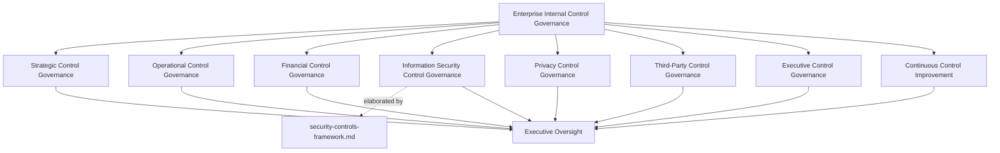
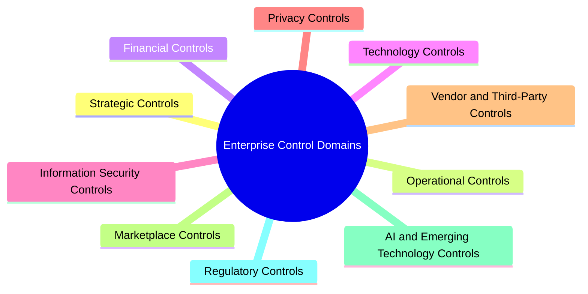
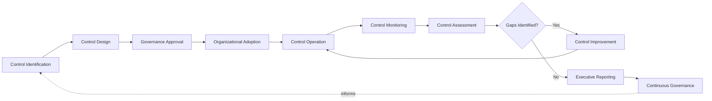
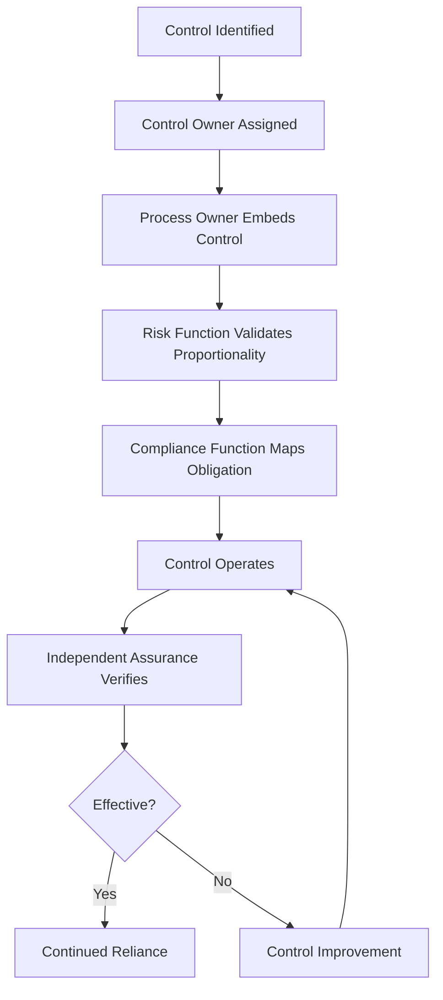
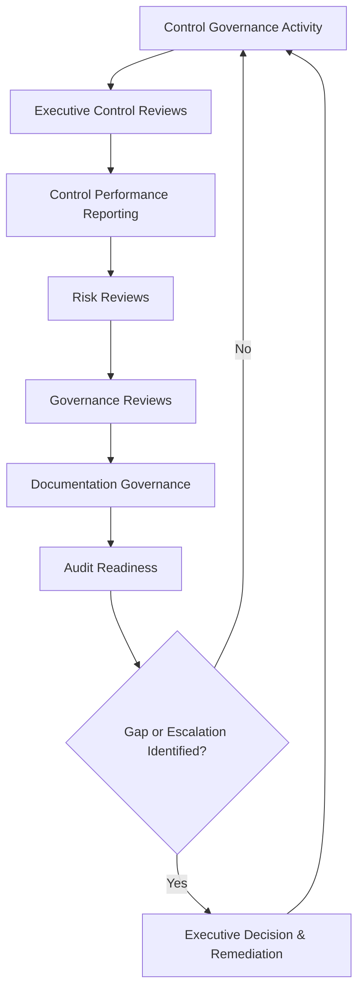
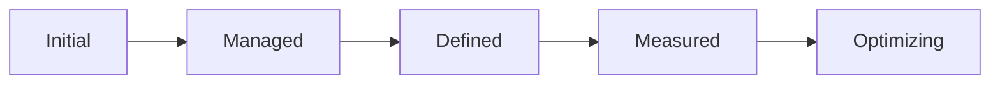
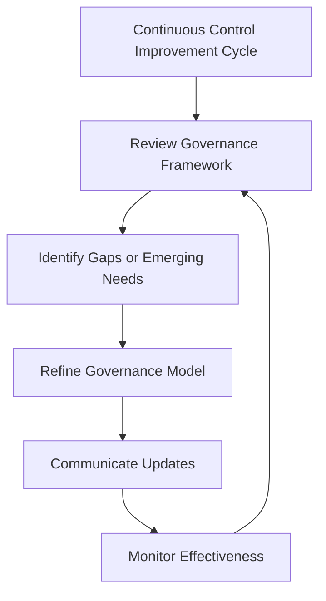

# Enterprise Internal Control Governance Framework

## 1. Document Purpose

This document establishes the enterprise-wide internal control governance framework for StackLeo Tech Store, consistent with COSO Internal Control–Integrated Framework thinking. It defines how controls across every category of business activity — strategic, operational, financial, and technological — are identified, designed, governed, and assured, providing the enterprise layer under which specialized control frameworks operate.

- **Purpose of Internal Controls** — to ensure the organization has genuine, governed assurance that its objectives are being met reliably, its reporting is accurate, and its operations comply with applicable obligations, rather than assuming these outcomes occur by default.
- **Relationship with Compliance Governance** — `compliance.md` categorizes controls briefly (administrative, technical, physical, detective, preventive, corrective) as part of tracking regulatory obligations; this document is the enterprise-wide COSO-aligned control framework those categories operate within, extending control governance beyond compliance-driven controls alone.
- **Relationship with Enterprise Risk Management** — `risk-management.md` establishes how risk is identified and evaluated; this document establishes the controls that form the organization's actual response to that evaluated risk, consistent with COSO's integration of risk and control.
- **Relationship with Audit Governance** — control assurance (Section 7) provides the evidence base that internal and external audit, coordinated through `compliance.md` (Section 10), depends on to verify that controls are genuinely operating, not merely documented.
- **Relationship with Information Security** — `security-controls-framework.md` is the control-specific elaboration of this framework for information security; this document does not restate that framework but establishes the enterprise-wide control philosophy and governance model information security controls, along with every other control category, operate within.
- **Relationship with Corporate Governance** — internal control is a core function of corporate governance, providing the assurance the organization's governance structures depend on to direct and control the business responsibly.
- **Relationship with Business Operations** — controls exist to let the business operate with confidence, not to obstruct it; well-governed controls are what allow operational scale and complexity to grow without a corresponding growth in unmanaged risk.

This document is implementation-independent and vendor-neutral. It defines control philosophy, governance model, domains, and lifecycle conceptually — not specific control implementation procedures, technical configurations, testing methodologies, or infrastructure settings.

## 2. Internal Control Philosophy

| Principle | Business Value |
|---|---|
| **Controls as Business Enablement** | Framing controls as what allows the business to scale and operate with confidence, not as bureaucratic overhead, keeps investment proportionate and purposeful. |
| **Governance Before Control** | Establishing the governance structure a control operates within before designing the control itself ensures controls are coherent, not ad hoc. |
| **Preventive Thinking** | Prioritizing controls that prevent an undesired outcome, ahead of controls that only detect it afterward, reduces the cost and consequence of failure. |
| **Accountability** | Assigning clear ownership for every control ensures someone is always responsible for its continued effectiveness. |
| **Transparency** | Making control performance visible to those who depend on it builds confidence that objectives are genuinely being met. |
| **Defense in Depth** | Distributing protection across multiple, independent controls ensures no single control's failure compromises the whole. |
| **Governance by Design** | Building control governance into how new processes and capabilities are designed, rather than retrofitting it, keeps the organization consistently in control. |
| **Continuous Improvement** | Treating control governance as an evolving discipline keeps it aligned with a growing business and an evolving risk landscape. |

## 3. Enterprise Internal Control Governance Model

### Enterprise Internal Control Governance Matrix

| Governance Layer | Purpose | Governance Scope | Business Value | Executive Expectations |
|---|---|---|---|---|
| **Strategic Control Governance** | Governs controls ensuring strategic objectives and major decisions are pursued with appropriate assurance. | Controls tied to strategic planning and major business commitments. | Ensures strategic ambition is pursued with genuine assurance, not blind confidence. | Expect strategic controls to be evaluated alongside major business decisions. |
| **Operational Control Governance** | Governs controls ensuring day-to-day operations function reliably. | Controls embedded in ordinary operational practice across functions. | Protects operational reliability at the scale the business actually operates. | Expect operational controls to be visible through routine reporting. |
| **Financial Control Governance** | Governs controls ensuring financial integrity and accurate reporting. | Controls over financial transactions, reconciliation, and reporting. | Protects financial integrity and stakeholder trust. | Expect financial controls to receive the highest governance rigor. |
| **Information Security Control Governance** | Governs the enterprise's relationship to the specialized security control discipline. | Coordination with `security-controls-framework.md`. | Ensures security controls are consolidated into enterprise-wide control assurance. | Expect security control effectiveness to be represented in enterprise reporting. |
| **Privacy Control Governance** | Governs controls ensuring personal data is handled consistently with commitments in `privacy.md`. | Controls specific to privacy-related processes and safeguards. | Protects customer and workforce trust. | Expect privacy controls to receive dedicated governance attention. |
| **Third-Party Control Governance** | Governs controls over reliance on vendors, partners, and marketplace participants. | Controls addressing risk introduced by external parties. | Ensures external dependencies do not become uncontrolled exposure. | Expect third-party controls to scale with the access and data each party holds. |
| **Executive Control Governance** | Governs the executive-level accountability and reporting structure for internal controls. | Executive reporting, review cadence, and ultimate control accountability. | Keeps control effectiveness a visible, actively managed executive concern. | Expect regular, substantive control performance reporting. |
| **Continuous Control Improvement** | Governs how the control governance framework itself evolves over time. | Governance review cadence, lessons learned, and framework refinement. | Keeps control governance relevant as the business and risk landscape evolve. | Expect periodic evidence that the framework itself is being actively improved. |

*Diagram 1: Enterprise Internal Control Governance Framework.*

## 4. Enterprise Control Domains

### Enterprise Control Domain Matrix

| Domain | Purpose | Governance Scope | Business Importance | Executive Expectations |
|---|---|---|---|---|
| **Strategic Controls** | Ensure major strategic decisions are supported by appropriate assurance. | Controls tied to new markets, new business models, and major commitments. | Protects the business's most consequential decisions from unmanaged risk. | Expect strategic controls evaluated before major commitments. |
| **Operational Controls** | Ensure day-to-day operations function reliably and consistently. | Ordinary business operation across functions. | Protects operational reliability at scale. | Expect operational controls visible through routine reporting. |
| **Financial Controls** | Ensure financial integrity, accurate reporting, and fiscal discipline. | Financial transactions, reconciliation, and reporting processes. | Directly affects financial integrity and stakeholder trust. | Expect financial controls to receive the highest governance rigor. |
| **Technology Controls** | Ensure the platform's technical foundation supports reliable, controlled operation. | Coordinated with `security-architecture.md`. | Protects the structural foundation every other domain depends on. | Expect technology controls evaluated as architecture evolves. |
| **Information Security Controls** | Ensure cyber and information security risk is appropriately mitigated. | Elaborated in full by `security-controls-framework.md`. | Protects the platform and data the business depends on. | Expect this domain's detail to be found in the dedicated security control framework. |
| **Privacy Controls** | Ensure personal data handling is consistent with privacy commitments. | Coordinated with `privacy.md`. | Protects customer and workforce trust and regulatory standing. | Expect privacy controls evaluated whenever new data use is introduced. |
| **Vendor & Third-Party Controls** | Ensure external dependencies are appropriately governed. | Controls addressing vendor, partner, and marketplace participant risk. | Ensures the business's control posture is not undermined by its weakest external party. | Expect third-party controls proportionate to access granted. |
| **Marketplace Controls** | Ensure the multi-vendor marketplace operates with appropriate seller and transaction assurance. | Seller onboarding, listing integrity, and marketplace transaction controls. | Protects marketplace trust and credibility as it scales. | Expect marketplace controls addressed proactively as the marketplace launches. |
| **AI & Emerging Technology Controls** | Ensure AI-assisted capability operates within appropriate assurance boundaries. | Controls over automated and AI-assisted decision-making. | Increasingly significant as AI capability grows within the business. | Expect proactive governance attention to this domain rather than retroactive correction. |
| **Regulatory Controls** | Ensure controls exist to satisfy applicable regulatory obligations. | Coordinated with `compliance.md`. | Protects the organization's license to operate in current and future markets. | Expect regulatory controls to be demonstrably mapped to tracked obligations. |

*Diagram: Enterprise Control Domain Overview.*

## 5. Enterprise Control Lifecycle

### Enterprise Control Lifecycle Matrix

| Stage | Purpose | Governance Objectives | Business Value |
|---|---|---|---|
| **Control Identification** | Recognizes where a control is needed to address an evaluated risk or obligation. | Connect every identified control need to a specific risk or obligation. | Ensures controls exist for genuine reasons, not arbitrary coverage. |
| **Control Design** | Determines the nature and rigor of the control appropriate to its purpose. | Design proportionate to the significance of the risk or obligation addressed. | Avoids both under-protection and wasteful over-engineering. |
| **Governance Approval** | Formally authorizes a new or modified control. | Ensure controls are never introduced without deliberate governance sign-off. | Prevents uncoordinated, informally introduced controls. |
| **Organizational Adoption** | Ensures a control is genuinely adopted across the relevant part of the organization. | Confirm adoption, not merely documentation. | Closes the gap between a control existing on paper and genuinely operating. |
| **Control Operation** | Recognizes the period during which a control is actively functioning. | Confirm the control continues to operate as designed. | Ensures ongoing reliance on the control is genuinely warranted. |
| **Control Monitoring** | Sustains ongoing awareness of whether a control remains effective. | Coordinate with domain-specific monitoring practice where applicable. | Reduces the risk of a control silently degrading unnoticed. |
| **Control Assessment** | Formally evaluates whether a control is achieving its intended purpose. | Assess on a defined cadence and whenever risk or obligation changes. | Surfaces control gaps proactively, before they are exploited or discovered externally. |
| **Control Improvement** | Addresses gaps or weaknesses identified through monitoring or assessment. | Track improvement actions to completion. | Prevents identified weaknesses from persisting indefinitely. |
| **Executive Reporting** | Communicates control performance to executive leadership. | Provide regular, substantive reporting proportionate to significance. | Keeps control effectiveness a visible, actively managed concern. |
| **Continuous Governance** | Reassesses the coherence and effectiveness of the control framework itself. | Feed lessons learned back into the framework. | Prevents the control function from becoming stale relative to a changing business. |

*Diagram 2: Enterprise Control Lifecycle.*

## 6. Internal Control Principles

### Internal Control Principles Matrix

| Principle | Explanation |
|---|---|
| **Accountability** | Every control has a specific, named accountable owner. |
| **Traceability** | Every control traces back to the risk or obligation it was designed to address. |
| **Transparency** | Control performance is visible to those who depend on it. |
| **Segregation of Duties** | No single individual has end-to-end control over a significant process without independent oversight. |
| **Risk Alignment** | Control rigor is proportionate to the genuine risk being addressed. |
| **Auditability** | Control design and operation can be independently reviewed after the fact. |
| **Business Alignment** | Controls remain connected to genuine business activity and objectives, not applied as a generic overlay. |
| **Continuous Improvement** | Control governance practice is periodically reassessed and refined. |

## 7. Control Ownership & Assurance

### Control Ownership & Assurance Matrix

| Accountability Layer | Governance Objective | Business Value |
|---|---|---|
| **Business Owners** | Ensure controls within their area genuinely serve the business objective they protect. | Keeps controls connected to real business purpose, not abstract compliance. |
| **Control Owners** | Own the day-to-day effectiveness of a specific control. | Provides clear, individual accountability for every control. |
| **Process Owners** | Ensure controls are embedded coherently within the processes they govern. | Prevents controls from existing as disconnected add-ons to a process. |
| **Risk Functions** | Ensure control design is proportionate to the risk it addresses, coordinated with `risk-management.md`. | Keeps control investment aligned with genuine risk significance. |
| **Compliance Functions** | Ensure controls addressing regulatory obligations are mapped and current, coordinated with `compliance.md`. | Provides the evidence base for demonstrating regulatory compliance. |
| **Technology Leadership** | Ensure technology-enabled controls are designed and maintained reliably. | Prevents control gaps introduced through unreviewed technical decisions. |
| **Executive Accountability** | Ensure executive leadership owns the organization's overall control assurance posture. | Establishes control effectiveness as a genuine governance priority. |
| **Independent Assurance** | Ensure an independent function verifies that controls operate as designed. | Provides credible, unbiased confirmation of control effectiveness. |

This section addresses control ownership and assurance from a governance-objective perspective; specific testing or operational procedures remain a matter for the domain owning each control.

*Diagram 3: Control Ownership & Assurance Model.*

## 8. Executive Oversight

### Executive Oversight Matrix

| Oversight Activity | Purpose |
|---|---|
| **Executive Control Reviews** | Confirm the overall internal control governance framework remains coherent and effective. |
| **Control Performance Reporting** | Provide leadership with visibility into the state of enterprise control effectiveness. |
| **Risk Reviews** | Assess whether control coverage remains proportionate to evaluated risk, coordinated with `risk-management.md`. |
| **Governance Reviews** | Confirm control governance remains aligned with the broader enterprise governance model. |
| **Documentation Governance** | Confirm control governance documentation remains current and accurate. |
| **Audit Readiness** | Confirm the organization is prepared to demonstrate its control governance on request. |

*Diagram 4: Enterprise Control Governance Flow.*

## 9. Future Readiness

| Future Direction | Readiness Consideration |
|---|---|
| **AI Governance** | Extends control governance to AI-assisted capability as a distinct, actively monitored control domain. |
| **Intelligent Controls** | Anticipates controls that themselves leverage AI-assisted capability, subject to the same assurance rigor as any other control. |
| **Multi-Tenant Platforms** | Marketplace and Third-Party Control domains extend to cover cross-tenant assurance as the marketplace scales. |
| **Global Expansion** | Regulatory and Strategic Control Governance extend to evaluate new markets as StackLeo expands regionally and globally. |
| **Digital Transformation** | Technology Control domain absorbs control needs introduced by continued digital capability growth without requiring framework redesign. |
| **Enterprise Scale** | Ensures the governance framework remains coherent as control volume and diversity grow substantially. |
| **Emerging Risks** | Continuous Control Improvement ensures new control needs are identified as new risk categories emerge. |
| **Continuous Governance Evolution** | Treats the framework itself as subject to ongoing refinement rather than a static, one-time definition. |

## 10. Internal Control Maturity Model

### Internal Control Maturity Model Matrix

| Level | Characteristics |
|---|---|
| **Initial** | Controls exist ad hoc, are inconsistently applied, and are largely undocumented. |
| **Managed** | Core controls have identified owners and basic operating practice, though governance is still largely reactive. |
| **Defined** | A documented, organization-wide internal control framework exists and is consistently applied across domains. |
| **Measured** | Control effectiveness is actively monitored, with visibility into control performance and assessment outcomes. |
| **Optimizing** | Internal control governance is continuously refined based on organizational learning, evolving risk, and business growth. |

*Diagram 6: Internal Control Maturity Progression Model.*

## 11. Anti-Patterns

### Anti-Pattern Summary

| Anti-Pattern | Why It Is Avoided |
|---|---|
| **Controls Without Governance** | Controls introduced without a governing framework become inconsistent and disconnected from genuine risk. |
| **Reactive Controls** | Designing controls only after a failure has occurred forfeits the far cheaper option of preventing it. |
| **Unknown Control Ownership** | A control without a named owner has no one responsible for confirming it remains effective. |
| **Weak Documentation** | Undocumented control design and rationale cannot be defended, audited, or consistently applied. |
| **Weak Executive Visibility** | Without executive oversight, control governance drifts from a strategic discipline into an unmonitored operational afterthought. |
| **Siloed Controls** | Managing controls in isolation across domains prevents the organization from seeing its true, aggregate control posture. |
| **Compliance Without Control Assurance** | Treating a control as satisfied because it is documented, without verifying it genuinely operates, produces a false sense of protection. |
| **Missing Continuous Improvement** | A static control framework falls out of alignment with a growing, evolving business and risk landscape. |

## 12. Document Information

| Property | Value |
|----------|-------|
| Document | internal-controls.md |
| Version | 1.0.0 |
| Status | Active |
| Maintained By | StackLeo |
| Last Updated | 2026-07-27 |

---

### Governance Responsibility Matrix

| Role | Responsibility |
|---|---|
| Chief Internal Control Officer / CRO function | Owns coherence and currency of this enterprise internal control framework across all domains. |
| CISO | Owns `security-controls-framework.md` as the elaboration of this framework for information security controls. |
| Compliance & Risk Functions | Coordinate Regulatory and Financial Control Governance with `compliance.md` and `risk-management.md`. |
| Control / Process Owners | Own individual controls and their embedding within the processes they govern. |
| Executive Leadership | Provides oversight, reviews control performance reporting, and is accountable for the organization's overall control assurance posture. |
| Internal Audit / Independent Assurance | Independently verifies that controls operate as designed. |

*Diagram 5: Continuous Control Improvement Cycle.*

© StackLeo. All Rights Reserved.
