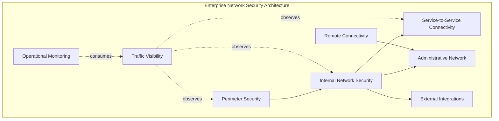
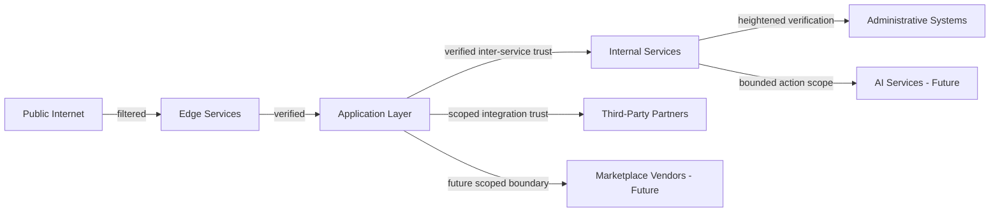
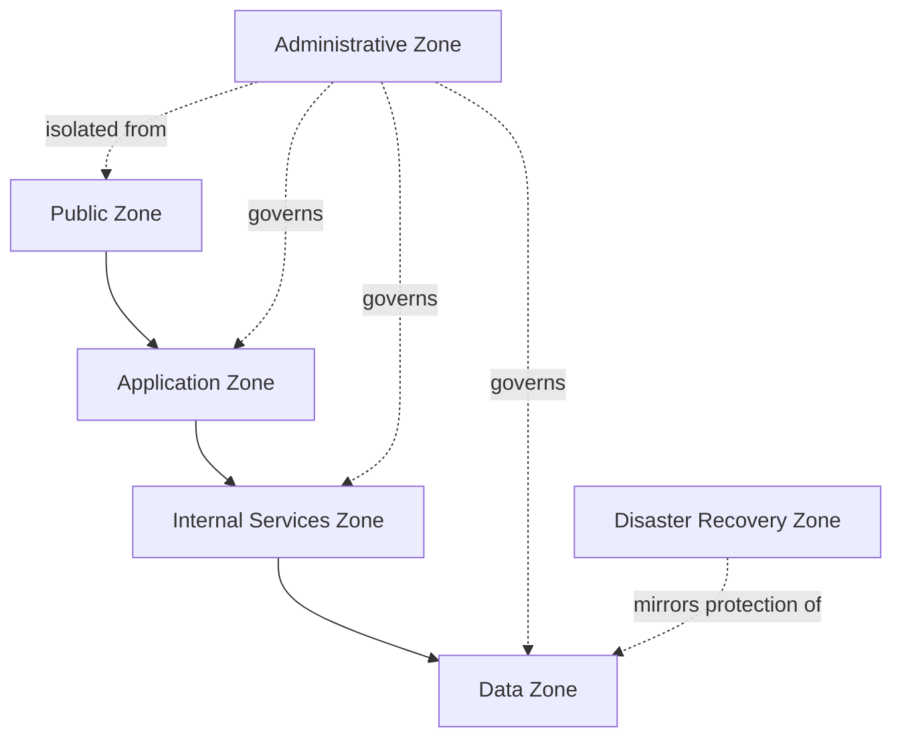
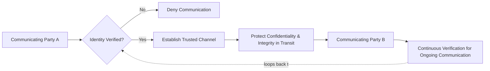
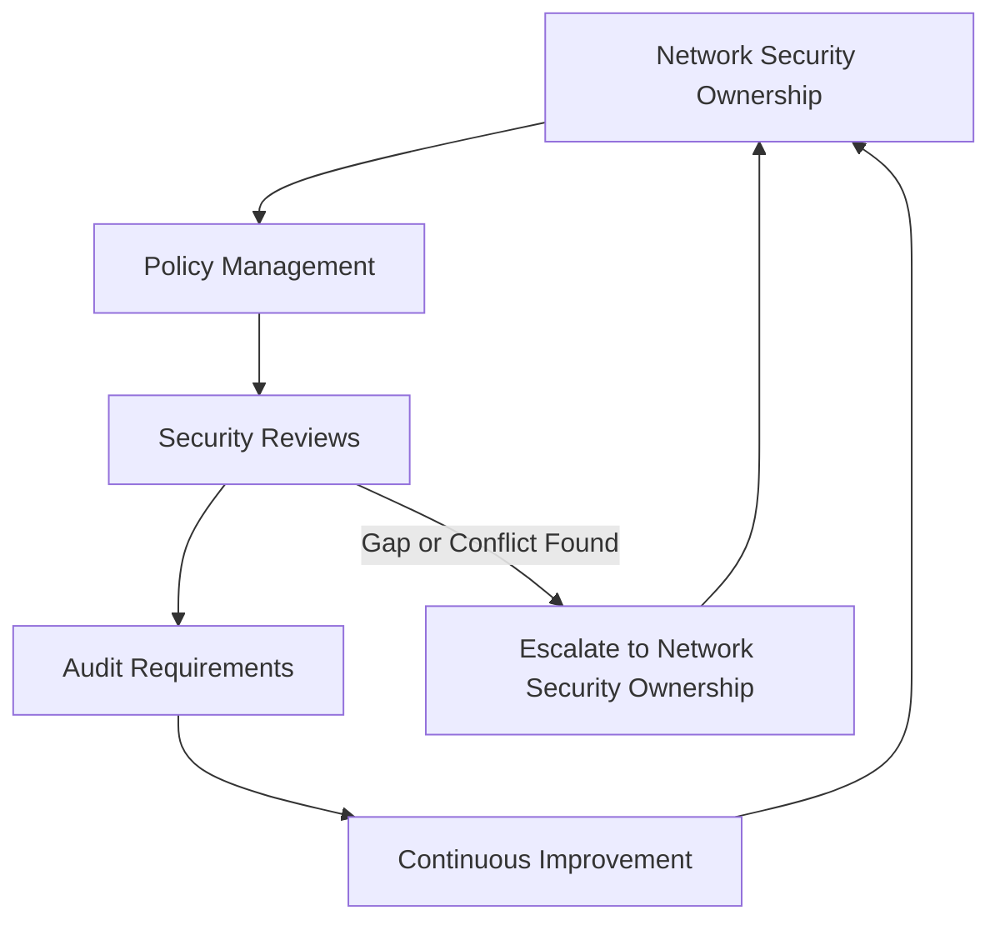

# Network Security

## 1. Document Purpose

This document defines the official Enterprise Network Security Strategy for **StackLeo Tech Store**. It establishes how the platform protects communication paths between components and with the outside world, independent of any specific networking technology or provider.

- **Purpose of Network Security** — to ensure that communication between customers, the platform, and its components occurs only through explicitly permitted, verified paths, rather than relying on network location as an implicit indicator of trust.
- **Relationship with Enterprise Architecture** — this document elaborates Network Security, part of Infrastructure Security defined in `security-architecture.md` (Section 3.4), and is closely coordinated with `03_System_Design/deployment-architecture.md`.
- **Relationship with Infrastructure Security** — this document is the network-specific elaboration of `infrastructure-security.md`, applying the same Zero Trust and Defense in Depth philosophy specifically to communication paths rather than compute, storage, or platform layers.
- **Relationship with Business Continuity** — network disruption directly affects the platform's ability to serve customers; this strategy exists to preserve continuity of commerce, coordinated with `03_System_Design/resilience-strategy.md`.
- **Relationship with Zero Trust** — network security is where the Zero Trust vision in `security-architecture.md` (Section 2) confronts its most persistent historical counterexample — the assumption that "inside the network" means "trusted" — and this document exists to reject that assumption structurally.

This document is implementation-independent and vendor-neutral. It defines network security philosophy, domains, and governance — not specific networking vendors, firewall rules, VPN configurations, or code.

## 2. Network Security Philosophy

- **Zero Trust Networking** — no request is trusted based on the network segment it originates from; identity and context are verified regardless of network position, consistent with `security-architecture.md` (Section 2).
- **Defense in Depth** — network protection is one layer among several (`security-architecture.md`, Section 5), never relied upon as a sole safeguard for identity or data protection.
- **Least Privilege Connectivity** — components are permitted to communicate only with the specific other components their function requires, never broadly by default.
- **Secure by Design** — network topology and segmentation are considered from the point deployment architecture is first designed, consistent with `security-principles.md` (Section 8).
- **Continuous Verification** — trust extended to a network path or connection is re-evaluated over time, never assumed to persist indefinitely once established.
- **Segmentation by Default** — components are isolated into distinct network zones (Section 5) unless a specific, justified need for connectivity exists between them.

## 3. Network Security Domains

### Perimeter Security

- **Purpose** — control the boundary between the public internet and the platform's own infrastructure.
- **Business Value** — provides the first point of observation and filtering for all external traffic reaching the platform.
- **Protection Objectives** — traffic entering the platform is observed and filtered before reaching internal components, consistent with the Edge Layer boundary in `security-architecture.md` (Section 4).

### Internal Network Security

- **Purpose** — protect communication between components within the platform's own infrastructure.
- **Business Value** — prevents internal network position from being treated as a substitute for verified trust.
- **Protection Objectives** — internal traffic is segmented and verified consistently with Zero Trust Networking (Section 2).

### Service-to-Service Connectivity

- **Purpose** — govern which backend services may communicate with one another over the network.
- **Business Value** — limits the paths available to an adversary who compromises a single service, consistent with `backend-security.md` (Section 4).
- **Protection Objectives** — connectivity between services is scoped to genuine, justified need rather than open by default.

### Administrative Network

- **Purpose** — isolate the network paths used to configure and operate the platform from routine workload traffic.
- **Business Value** — protects the platform's most consequential capability from exposure to ordinary customer-facing traffic paths.
- **Protection Objectives** — administrative connectivity is segmented and subject to heightened verification, consistent with `identity-management.md` (Section 7).

### External Integrations

- **Purpose** — govern network connectivity to payment, courier, and communication providers.
- **Business Value** — ensures trust extended to external parties over the network is scoped to the specific integration purpose.
- **Protection Objectives** — integration traffic is isolated and monitored distinctly from internal service traffic, consistent with `security-architecture.md` (Section 4).

### Remote Connectivity

- **Purpose** — govern how staff and administrative users connect to internal systems from outside the platform's own infrastructure.
- **Business Value** — extends consistent verification to remote access rather than treating it as inherently different from local access.
- **Protection Objectives** — remote connectivity is subject to the same identity verification and least-privilege principles as any other access path.

### Traffic Visibility

- **Purpose** — ensure network traffic patterns can be observed and understood.
- **Business Value** — enables the organization to distinguish legitimate traffic from anomalous or abusive patterns.
- **Protection Objectives** — traffic is observable in a manner sufficient to support Operational Monitoring (below).

### Operational Monitoring

- **Purpose** — sustain continuous observation of network behavior in production.
- **Business Value** — determines how quickly the organization can detect and respond to network-originating anomalies.
- **Protection Objectives** — network behavior is continuously monitored, consistent with Section 7.

### Network Security Domain Matrix

| Domain | Primary Risk Addressed | Related Document |
|---|---|---|
| Perimeter Security | Unfiltered external traffic reaching internal components | `security-architecture.md` |
| Internal Network Security | Internal position treated as a substitute for verified trust | `security-architecture.md` |
| Service-to-Service Connectivity | Open, unscoped connectivity between backend services | `backend-security.md` |
| Administrative Network | Administrative capability exposed to routine traffic paths | `identity-management.md` |
| External Integrations | Excessive trust extended to third parties over the network | `security-architecture.md` |
| Remote Connectivity | Inconsistent verification for remote versus local access | `authentication.md` |
| Traffic Visibility | Inability to distinguish legitimate from anomalous traffic | Section 7 (this document) |
| Operational Monitoring | Undetected deviation from expected network behavior | `security-architecture.md` |

*Diagram 1: Enterprise Network Security Architecture.*

## 4. Trust Boundary Model

Network communication crosses several conceptual trust boundaries, each requiring independent verification:

- **Public Internet** — entirely untrusted; every request originates as an unverified party until authenticated.
- **Edge Services** — the platform's first point of observation and filtering, itself trusted only to perform that specific function.
- **Application Layer** — where business logic begins to apply identity and context to a request, per `application-security.md`.
- **Internal Services** — communication among backend services, verified explicitly rather than assumed from being on the same internal segment.
- **Administrative Systems** — communication involving elevated, business-critical capability, isolated and heightened relative to routine traffic.
- **Third-Party Partners** — communication with payment, courier, and communication providers, scoped to the specific integration relationship.
- **Marketplace Vendors (Future)** — communication anticipated for third-party sellers, requiring scoped, verifiable network trust distinct from internal services.
- **AI Services (Future)** — communication involving AI-assisted capability, bounded to its explicitly defined scope of action, per `identity-management.md` (Section 8).

Each boundary requires independent verification because network communication, by its nature, crosses control domains: a request that has already traversed one boundary has not thereby earned trust at the next — treating boundary-crossing traffic as pre-verified is precisely how a single compromised segment becomes a path to the rest of the platform.

*Diagram 2: Zero Trust Network Model.*

### Trust Boundary Summary

| Boundary | Trust Basis | Primary Risk If Unverified |
|---|---|---|
| Public Internet | None | Unrestricted, anonymous traffic reaching internal components |
| Edge Services | Scoped to observation and filtering function | Malformed or hostile traffic passed through unfiltered |
| Application Layer | Identity and context evaluation | Requests processed without business context applied |
| Internal Services | Explicit, verified inter-service identity | Lateral movement from one compromised service to others |
| Administrative Systems | Heightened, privileged verification | Routine traffic gaining elevated network reach |
| Third-Party Partners | Scoped integration agreement | Exposure beyond the integration's intended purpose |
| Marketplace Vendors (Future) | Seller-scoped network relationship | Cross-vendor network exposure |
| AI Services (Future) | Bounded, explicit action scope | Unbounded or unattributed autonomous network activity |

## 5. Network Segmentation

- **Public Zone** — hosts components directly reachable from the public internet, kept as minimal as possible.
- **Application Zone** — hosts customer- and staff-facing application capability, reachable from the Public Zone only through defined paths.
- **Internal Services Zone** — hosts backend services, reachable from the Application Zone but not directly from the Public Zone.
- **Administrative Zone** — hosts configuration and operational control capability, isolated from all routine workload zones.
- **Data Zone** — hosts data stores, reachable only from the specific services authorized to access them, per `data-protection.md`.
- **Disaster Recovery Zone** — mirrors the protection and isolation of production zones, maintained to support continuity during severe disruption.

The goal of segmentation is conceptual isolation: a compromise in the Public Zone must not directly reach the Data Zone, and the Administrative Zone must remain isolated from every routine workload path — each zone boundary is a deliberate point of reduced blast radius, providing clear business value by containing the consequence of any single zone's compromise.

*Diagram 3: Network Segmentation Overview.*

### Network Segmentation Matrix

| Zone | Reachable From | Primary Isolation Goal |
|---|---|---|
| Public Zone | Public Internet | Minimize directly internet-reachable surface |
| Application Zone | Public Zone (via defined paths only) | Prevent direct internet reach into backend services |
| Internal Services Zone | Application Zone | Prevent public traffic from reaching backend services directly |
| Administrative Zone | Isolated remote/administrative paths only | Prevent routine traffic from reaching elevated capability |
| Data Zone | Authorized Internal Services only | Prevent unauthorized services from reaching data stores directly |
| Disaster Recovery Zone | Mirrors Data/Application Zone access | Preserve continuity without weakening protection standards |

## 6. Secure Communications

- **Trusted Communications** — communication paths are established only between parties whose identity has been verified, not assumed from network reachability.
- **Identity-Aware Connectivity** — network-level access decisions incorporate the identity of the communicating parties, consistent with `identity-management.md`, not only their network address.
- **Service Trust** — service-to-service communication is verified explicitly, consistent with `backend-security.md` (Section 4).
- **Confidential Data Transmission** — data classified as Confidential or Restricted, per `data-protection.md` (Section 4), is protected in transit consistent with Encryption in Transit (`encryption.md`, Section 3).
- **Integrity Protection** — communication is protected against undetected tampering while in transit, consistent with `encryption.md` (Section 7).
- **Availability Considerations** — secure communication design accounts for the need to remain available under legitimate load, balancing protection against unnecessary disruption of genuine traffic.

*Diagram 4: Secure Communication Flow.*

### Secure Communication Principles

| Principle | What It Ensures |
|---|---|
| Trusted Communications | Paths established only between verified parties |
| Identity-Aware Connectivity | Access decisions consider identity, not only network address |
| Service Trust | Service-to-service communication is explicitly verified |
| Confidential Data Transmission | Sensitive data is protected proportionately in transit |
| Integrity Protection | Tampering in transit is detectable |
| Availability Considerations | Protection does not unduly disrupt legitimate traffic |

## 7. Operational Network Security

- **Monitoring** — network behavior is continuously observed to recognize deviation from expected patterns early.
- **Logging** — significant network events are recorded with sufficient context to support investigation, consistent with `security-principles.md` (Section 9).
- **Traffic Visibility** — network traffic is observable in a manner that supports distinguishing legitimate from anomalous activity (Section 3).
- **Incident Detection** — network anomalies are recognized promptly enough to enable timely response, consistent with `threat-model.md` (Section 9).
- **Operational Resilience** — the network is expected to withstand and recover from disruption as a normal part of how it is operated.
- **Business Continuity** — network resilience preserves the platform's ability to keep serving customers through disruption, coordinated with `03_System_Design/resilience-strategy.md`.

## 8. Future Network Readiness

This strategy is deliberately structured to remain valid as StackLeo's network architecture evolves:

- **Cloud-Native Networking** — the domain-and-zone structure in Sections 3 and 5 applies consistently regardless of the specific cloud-native networking services adopted.
- **Multi-Cloud** — network security principles remain independent of any specific provider, supporting the multi-cloud posture referenced in `security-principles.md` (Section 10).
- **Multi-Region** — segmentation and trust-boundary principles extend naturally to network paths spanning multiple geographic regions as expansion occurs.
- **Marketplace Platform** — the Marketplace Vendors network boundary (Section 4) is already anticipated, allowing seller network connectivity to be governed deliberately ahead of launch.
- **Public APIs** — external API consumer traffic, per `api-security.md`, is treated with the same Zero Trust Networking principles as any other external traffic.
- **AI Services** — AI Services network boundary (Section 4) ensures AI-assisted capability's network activity remains bounded and attributable.
- **Hybrid Infrastructure** — segmentation principles apply consistently whether components run on-premises, in the cloud, or across both.
- **Distributed Systems** — as decomposition into more services increases the number of internal network paths, this strategy's boundary-first, segmentation-by-default approach becomes more important, not less.

## 9. Governance

- **Network Ownership** — the Security Lead, in coordination with Infrastructure Engineering and Operations leads, owns the coherence of this network security strategy.
- **Policy Management** — operational network security policies are derived from this strategy and maintained consistently with `security-governance.md`.
- **Security Reviews** — significant network topology and segmentation decisions are reviewed against this strategy, consistent with `03_System_Design/architecture-decisions.md`.
- **Audit Requirements** — significant network security events and administrative network access are recorded consistently with `security-principles.md` (Section 9).
- **Continuous Improvement** — this strategy is expected to mature as network architecture, scale, and threat context evolve.

*Diagram 5: Network Security Governance Framework.*

### Governance Responsibility Matrix

| Role | Responsibility |
|---|---|
| Security Lead | Owns coherence and enforcement of the network security strategy. |
| Infrastructure Engineering Leads | Apply network segmentation and connectivity principles within their area. |
| Operations Lead | Executes network monitoring and incident detection practice. |
| Solution Architect | Ensures network security remains consistent with `03_System_Design/deployment-architecture.md`. |
| Data Protection Owner | Ensures Data Zone protection aligns with `data-protection.md`. |
| Internal Audit / Review Function | Independently verifies network security practice matches this strategy. |

## 10. Anti-Patterns

| Anti-Pattern | Why It's Avoided |
|---|---|
| Flat Network Architecture | Removes the segmentation (Section 5) that contains the consequence of any single zone's compromise. |
| Implicit Trust | Assumes traffic is legitimate because of its network origin, contradicting Zero Trust Networking (Section 2). |
| Poor Segmentation | Allows a compromise in a low-sensitivity zone to reach the Data or Administrative Zone directly. |
| Excessive Connectivity | Violates Least Privilege Connectivity (Section 2); permits communication paths beyond genuine, justified need. |
| Weak Visibility | Prevents legitimate traffic from being distinguished from anomalous activity, undermining Section 3. |
| Missing Monitoring | Removes the ability to detect network-originating deviation early, undermining Section 7. |
| Weak Governance | Allows network security practice to drift from this strategy with no accountable owner or review mechanism (Section 9). |
| Reactive Network Security | Treats network security as a response to incidents rather than a continuous discipline embedded in design (Section 2). |

## 11. Document Information

| Property | Value |
|----------|-------|
| Document | network-security.md |
| Version | 1.0.0 |
| Status | Active |
| Maintained By | StackLeo |
| Last Updated | 2026-07-17 |

---

© StackLeo. All Rights Reserved.
