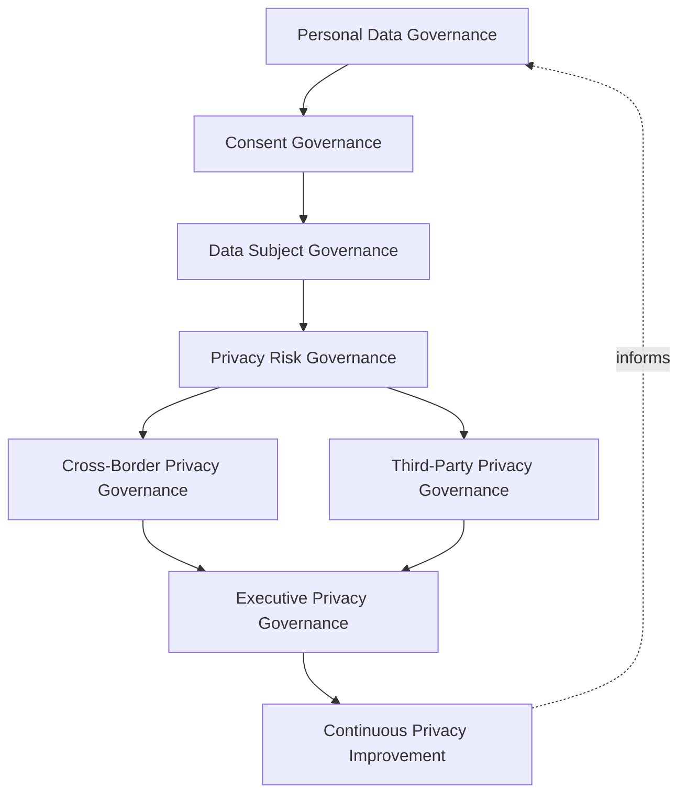
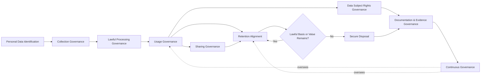
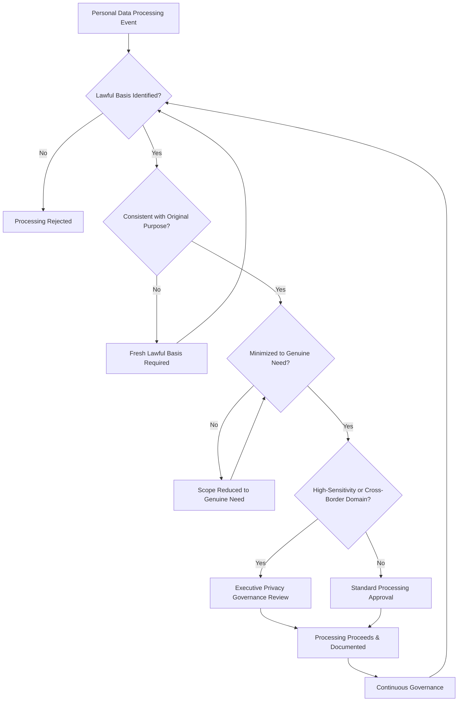
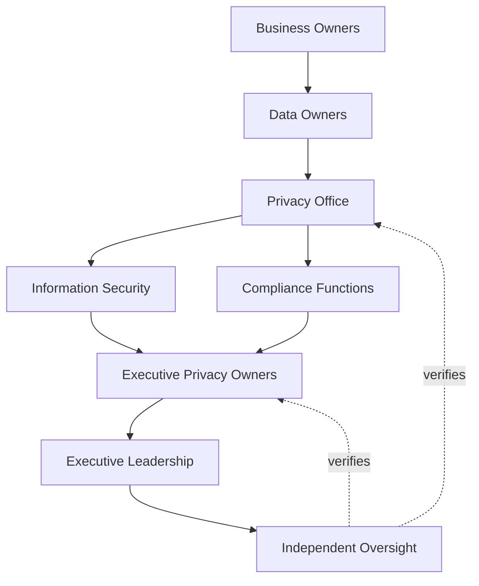
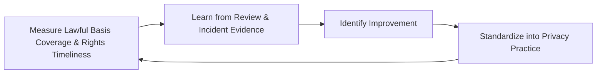
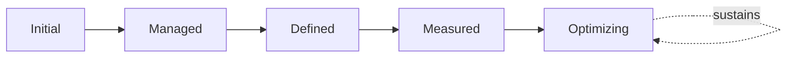

# Enterprise Privacy Governance Strategy

## 1. Document Purpose

This document defines the official Enterprise Privacy Governance Strategy for **StackLeo Tech Store** — the CPO/CISO/CDO-owned executive charter under which every category of personal data is governed with deliberate respect for the individual it describes. It establishes privacy governance, personal data governance, privacy-by-design governance, consent governance, data subject governance, organizational accountability, executive oversight, and long-term privacy maturity, consistent with ISO/IEC 27701, ISO/IEC 27001, the NIST Privacy Framework, and TOGAF enterprise architecture thinking.

`privacy.md` remains the operational governance framework for privacy practice — the document that elaborates in full operational depth StackLeo's privacy principles, personal data governance, privacy lifecycle, and cross-border readiness. This document sits above it as executive mandate, consistent with the executive-charter relationship `identity-access-strategy.md` holds over `identity-access-management.md` and `data-governance-strategy.md` holds over `data-governance.md`: it does not restate operational detail, it establishes the philosophy, accountability structure, and executive expectations that give that operational practice authority and continuity.

- **Purpose of Privacy Governance** — to ensure personal data is treated as belonging to the individual it describes, not merely as a business asset StackLeo happens to hold, and that this commitment is reflected consistently and accountably across every function that touches personal data.
- **Relationship with Enterprise Data Governance** — this strategy is the privacy-specific elaboration of `04_Database/data-governance-strategy.md`; personal data is a distinct, especially sensitive category within the broader data asset every category of data governance applies to.
- **Relationship with Information Security** — privacy and security are complementary but distinct: `data-protection.md` and `encryption.md` define how personal data is *safeguarded*; this strategy defines the principles governing *whether and how it should be used at all*. Security without privacy can protect data used inappropriately; privacy without security cannot protect data at all.
- **Relationship with Data Classification** — Personal Data is a distinct classification category governed under `04_Database/data-classification.md` (Section 4.7); this strategy governs the substantive privacy principles that classification category's handling must satisfy.
- **Relationship with Data Lifecycle Governance** — personal data's lifecycle — particularly collection, sharing, retention, and disposal — is governed under the same stages defined in `04_Database/data-lifecycle-governance.md`, with this strategy adding the privacy-specific obligations that apply at each stage.
- **Relationship with Compliance Governance** — this strategy provides the accountability and principled foundation regulatory and contractual privacy obligations tracked in `compliance.md` depend on to be reliably satisfied in practice, not merely acknowledged in policy language.
- **Relationship with Enterprise Governance** — privacy governance is not a separate structure from how StackLeo governs the rest of the business; it is the privacy-specific application of the same executive accountability, policy discipline, and control assurance applied enterprise-wide in `policy-management.md` and `internal-controls.md`.

This document is implementation-independent and vendor-neutral. It defines privacy governance philosophy, model, domains, and lifecycle conceptually — not specific privacy management platforms, consent management systems, cloud providers, legal service vendors, consulting firms, security products, GDPR implementation procedures, consent collection workflows, cookie banner configurations, technical privacy controls, infrastructure configurations, deployment architectures, operational processes, or code.

## 2. Privacy Governance Philosophy

Privacy governance at StackLeo rests on eight principles. Each exists to produce a specific business outcome — privacy is governed deliberately because personal data represents a trust individuals extend to StackLeo, not merely an asset the business happens to hold.

### 2.1 Privacy as a Fundamental Business Principle

Respect for individuals' data is treated as a core business commitment, not a compliance obligation layered on afterward.

- **Business Value** — protects the trust relationship every customer and employee extends to StackLeo, per `01_Business/vision.md`.

### 2.2 Privacy by Design

Privacy considerations are embedded into how new capability is conceived and built, never bolted on after the fact.

- **Business Value** — prevents the costly, high-visibility discovery of privacy gaps only after a capability has already launched.

### 2.3 Privacy by Default

The most privacy-protective setting is the default; individuals are never required to take deliberate action to obtain reasonable privacy protection.

- **Business Value** — ensures baseline privacy protection is universal, not dependent on an individual's own awareness or effort.

### 2.4 Accountability

Every privacy governance decision traces to a specific, named, responsible party.

- **Business Value** — ensures every decision affecting personal data has someone genuinely responsible for defending its justification.

### 2.5 Transparency

How personal data is collected, used, and shared is documented and genuinely communicated to the individuals it describes, never hidden in language designed to obscure.

- **Business Value** — protects trust by ensuring individuals are never surprised by how their data is actually used.

### 2.6 Fairness

Personal data is used in ways individuals would reasonably expect and would not object to if fully informed.

- **Business Value** — protects the business from the reputational harm of practices that are technically permitted but genuinely unfair.

### 2.7 Business Enablement

Privacy governance exists to let the business build trusted, personalized commerce experiences — from single-seller B2C toward corporate sales and the multi-vendor marketplace — not to obstruct legitimate use with disproportionate friction.

- **Business Value** — keeps privacy governance genuinely followed rather than resented as an obstacle to real product work.

### 2.8 Continuous Improvement

Privacy governance practice matures over time, informed by real review findings, incidents, and the organization's growth in scale and regulatory reach.

- **Business Value** — keeps privacy governance aligned with StackLeo's growth in customer base, market reach, and regulatory exposure.

## 3. Enterprise Privacy Governance Model

Privacy governance operates across eight conceptual layers, each holding accountability for a distinct dimension of privacy practice. Every layer here is elaborated in full operational depth in `privacy.md`.

### 3.1 Personal Data Governance

- **Purpose** — own the coherence of how personal data is identified, categorized, and governed as a distinct asset class.
- **Governance Scope** — oversight of every domain in Section 4, coordinated with `04_Database/data-governance-strategy.md`.
- **Business Value** — ensures personal data receives deliberately elevated governance, not the same generic treatment as any other business data.
- **Executive Expectations** — leadership trusts no personal data category exists outside this framework's visibility.

### 3.2 Consent Governance

- **Purpose** — own the coherence of how, when, and on what lawful basis personal data processing is justified.
- **Governance Scope** — oversight of Lawful Processing Governance (Section 5.3) across every domain, applied without prescribing specific consent collection mechanisms.
- **Business Value** — ensures every instance of personal data processing rests on a genuine, defensible lawful basis.
- **Executive Expectations** — leadership trusts processing never proceeds without a confirmed lawful basis.

### 3.3 Data Subject Governance

- **Purpose** — own the coherence of how individuals' rights over their own personal data are recognized and honored.
- **Governance Scope** — oversight of Data Subject Rights Governance (Section 5.7) across every domain.
- **Business Value** — ensures individuals can exercise genuine control over their data, not merely a theoretical right stated in policy.
- **Executive Expectations** — leadership trusts data subject requests are honored promptly and completely.

### 3.4 Privacy Risk Governance

- **Purpose** — own the coherence of how privacy-specific risk is identified, assessed, and treated.
- **Governance Scope** — oversight of privacy risk across every domain, coordinated with `risk-management.md` and `security-risk-management.md`.
- **Business Value** — ensures privacy risk receives dedicated attention, not folded indistinguishably into generic security risk.
- **Executive Expectations** — leadership expects privacy risk to be assessed before new personal data processing begins, not after.

### 3.5 Cross-Border Privacy Governance

- **Purpose** — own the coherence of how personal data is governed when it moves across jurisdictional boundaries.
- **Governance Scope** — oversight of Cross-Border Personal Data (Section 4.9), anticipating StackLeo's expansion from Bangladesh into South Asia and global markets.
- **Business Value** — ensures international growth does not outpace the organization's ability to govern cross-border data responsibly.
- **Executive Expectations** — leadership expects cross-border data governance to be designed ahead of, not after, market expansion.

### 3.6 Third-Party Privacy Governance

- **Purpose** — own the coherence of how personal data shared with or received from external parties is governed.
- **Governance Scope** — oversight of Third-Party Shared Personal Data (Section 4.8), coordinated with `identity-federation.md`.
- **Business Value** — ensures personal data does not lose its governance protection simply because it crosses an organizational boundary.
- **Executive Expectations** — leadership expects third-party data sharing to be reviewed and bounded before it begins.

### 3.7 Executive Privacy Governance

- **Purpose** — own executive-level accountability for the privacy decisions carrying the greatest organizational consequence.
- **Governance Scope** — oversight spanning Sections 3.1–3.6 wherever a privacy matter rises to genuine executive concern.
- **Business Value** — ensures the most consequential privacy decisions are visible at the level accountable for organizational risk.
- **Executive Expectations** — leadership expects to be informed of, not surprised by, the platform's highest-risk privacy matters.

### 3.8 Continuous Privacy Improvement

- **Purpose** — govern the mechanism by which every other layer in this model matures over time.
- **Governance Scope** — consolidates findings from privacy reviews, audits, and incidents across every domain in Section 4.
- **Business Value** — prevents privacy governance itself from becoming the next thing that quietly stagnates as the organization scales.
- **Executive Expectations** — leadership expects privacy maturity to be assessed periodically, not assumed static once established.

### Enterprise Privacy Governance Matrix

| Layer | Purpose | Business Value | Executive Expectations |
|---|---|---|---|
| Personal Data Governance | Own coherence of how personal data is identified and governed | Ensures personal data receives deliberately elevated governance | Trusts no personal data category exists outside visibility |
| Consent Governance | Own coherence of how processing is lawfully justified | Ensures every processing instance rests on a genuine lawful basis | Trusts processing never proceeds without confirmed basis |
| Data Subject Governance | Own coherence of how individuals' rights are honored | Ensures individuals have genuine control over their data | Trusts requests are honored promptly and completely |
| Privacy Risk Governance | Own coherence of how privacy risk is identified and treated | Ensures privacy risk receives dedicated attention | Expects risk assessed before processing begins, not after |
| Cross-Border Privacy Governance | Own coherence of governance across jurisdictional boundaries | Ensures growth doesn't outpace responsible data governance | Expects governance designed ahead of market expansion |
| Third-Party Privacy Governance | Own coherence of governance for externally shared data | Ensures data doesn't lose protection crossing organizational boundaries | Expects sharing reviewed and bounded before it begins |
| Executive Privacy Governance | Own executive accountability for highest-consequence decisions | Ensures the most consequential decisions are visible to leadership | Expects leadership informed of, not surprised by, top matters |
| Continuous Privacy Improvement | Govern maturation of every other layer | Prevents governance itself from stagnating | Expects maturity to be assessed periodically |

*Diagram 1: Enterprise Privacy Governance Framework — personal data and consent governance establish the foundation, data subject and risk governance sustain individuals' trust, cross-border and third-party governance extend it beyond organizational boundaries, and executive oversight converges on continuous improvement that feeds back into the model.*

## 4. Enterprise Privacy Domains

Privacy is governed across ten conceptual domains, each requiring a distinct governance emphasis.

### 4.1 Customer Personal Data

- **Purpose** — represent individual shoppers' profiles, addresses, and contact information.
- **Privacy Considerations** — governed under Personal Data Governance (Section 3.1), the domain of highest volume and business consequence.
- **Business Importance** — foundation of the direct-to-consumer relationship and repeat commerce central to the B2C model.
- **Executive Expectations** — leadership expects customer personal data governance to protect trust without adding friction to genuine shopping.

### 4.2 Employee Personal Data

- **Purpose** — represent StackLeo's own workforce records.
- **Privacy Considerations** — governed under Personal Data Governance (Section 3.1), coordinated with `identity-lifecycle.md` and applicable employment obligations.
- **Business Importance** — protects the organization's obligations to its own people.
- **Executive Expectations** — leadership expects employee personal data governance to meet the same rigor as customer data governance.

### 4.3 Vendor & Supplier Personal Data

- **Purpose** — represent personal data of individual contacts at StackLeo's suppliers and service providers.
- **Privacy Considerations** — governed under Third-Party Privacy Governance (Section 3.6).
- **Business Importance** — protects the individuals behind StackLeo's business relationships, not only the relationships themselves.
- **Executive Expectations** — leadership expects vendor contact data to be governed with the same discipline as customer data.

### 4.4 Marketplace User Data

- **Purpose** — represent personal data of future marketplace sellers and their representatives.
- **Privacy Considerations** — governed under Personal Data Governance (Section 3.1), anticipating the multi-vendor marketplace model.
- **Business Importance** — will become foundational to the trust the marketplace business model depends on.
- **Executive Expectations** — leadership expects marketplace user privacy governance to be designed ahead of, not after, marketplace launch.

### 4.5 Marketing & Communication Data

- **Purpose** — represent data used to communicate with and market to customers.
- **Privacy Considerations** — governed under Consent Governance (Section 3.2), given its direct dependence on lawful basis and individual preference.
- **Business Importance** — protects the business's ability to communicate with customers without eroding their trust.
- **Executive Expectations** — leadership expects marketing communication to always reflect an individual's genuine, current preference.

### 4.6 Payment & Financial Personal Data

- **Purpose** — represent personal data connected to payment and financial transactions.
- **Privacy Considerations** — governed under the highest rigor within Personal Data and Privacy Risk Governance (Sections 3.1, 3.4), given its combined financial and personal sensitivity.
- **Business Importance** — protects the business's financial integrity alongside individuals' most sensitive data category.
- **Executive Expectations** — leadership expects payment and financial personal data governance to meet the strictest standard in this model.

### 4.7 AI & Analytics Personal Data

- **Purpose** — represent personal data used in AI-assisted capability and analytical reporting.
- **Privacy Considerations** — governed under Privacy Risk Governance (Section 3.4) as a distinct, explicitly inventoried category, since aggregation and derivation do not automatically eliminate personal data risk.
- **Business Importance** — protects against a category of data whose privacy risk is easy to overlook precisely because it is once removed from its original source.
- **Executive Expectations** — leadership expects AI and analytics personal data to be governed with the same rigor as any directly collected personal data.

### 4.8 Third-Party Shared Personal Data

- **Purpose** — represent personal data shared with or received from external vendors, partners, and integrations.
- **Privacy Considerations** — governed under Third-Party Privacy Governance (Section 3.6), coordinated with `identity-federation.md`.
- **Business Importance** — protects individuals' data as it crosses organizational boundaries StackLeo does not fully control.
- **Executive Expectations** — leadership expects third-party sharing relationships to be reviewed and bounded before extension.

### 4.9 Cross-Border Personal Data

- **Purpose** — represent personal data that moves across jurisdictional boundaries as StackLeo's markets expand.
- **Privacy Considerations** — governed under Cross-Border Privacy Governance (Section 3.5), anticipating South Asia and global expansion.
- **Business Importance** — protects the business's ability to expand internationally without outpacing its own governance capability.
- **Executive Expectations** — leadership expects cross-border governance to be designed before, not retrofitted after, each new market entry.

### 4.10 Regulatory Privacy Records

- **Purpose** — represent records retained specifically to demonstrate privacy obligation compliance.
- **Privacy Considerations** — governed under Executive Privacy Governance (Section 3.7), coordinated with `compliance.md` and `audit-governance.md`.
- **Business Importance** — protects the business's ability to demonstrate genuine privacy compliance when required.
- **Executive Expectations** — leadership expects regulatory privacy records to be verified before, not discovered during, an audit.

### Enterprise Privacy Domain Matrix

| Domain | Purpose | Business Importance | Executive Expectations |
|---|---|---|---|
| Customer Personal Data | Represent shoppers' profiles, addresses, contact information | Foundation of the direct-to-consumer relationship | Protects trust without adding shopping friction |
| Employee Personal Data | Represent StackLeo's own workforce records | Protects the organization's obligations to its own people | Meets the same rigor as customer data governance |
| Vendor & Supplier Personal Data | Represent personal data of supplier/provider contacts | Protects individuals behind business relationships | Governed with the same discipline as customer data |
| Marketplace User Data | Represent future marketplace sellers and representatives | Will become foundational to marketplace trust | Designed ahead of, not after, marketplace launch |
| Marketing & Communication Data | Represent data used to communicate and market to customers | Protects the ability to communicate without eroding trust | Always reflects an individual's genuine, current preference |
| Payment & Financial Personal Data | Represent personal data connected to financial transactions | Protects financial integrity and the most sensitive data category | Meets the strictest standard in this model |
| AI & Analytics Personal Data | Represent personal data used in AI and reporting | Protects easily-overlooked derived-data privacy risk | Governed with the same rigor as directly collected data |
| Third-Party Shared Personal Data | Represent data shared with or received from external parties | Protects data crossing organizational boundaries | Sharing relationships reviewed and bounded before extension |
| Cross-Border Personal Data | Represent data moving across jurisdictional boundaries | Protects international expansion from outpacing governance | Designed before, not retrofitted after, market entry |
| Regulatory Privacy Records | Represent records demonstrating obligation compliance | Protects the ability to demonstrate genuine compliance | Verified before, not discovered during, an audit |

## 5. Enterprise Privacy Lifecycle

Personal data is governed across ten conceptual lifecycle stages, applicable across every domain in Section 4.

### 5.1 Personal Data Identification

- **Purpose** — recognize that a given data category constitutes personal data requiring privacy governance.
- **Governance Objectives** — require identification to occur at the point of a category's creation, coordinated with `04_Database/data-classification.md` (Section 4.7).
- **Business Value** — ensures no personal data category escapes privacy governance simply because its status went unrecognized.

### 5.2 Collection Governance

- **Purpose** — govern how personal data is gathered from individuals in a deliberate, limited manner.
- **Governance Objectives** — require collection to be limited to genuine business purpose, consistent with Data Minimization (Section 6).
- **Business Value** — protects the business from accumulating personal data it has no genuine, governed purpose for holding.

### 5.3 Lawful Processing Governance

- **Purpose** — confirm every instance of personal data processing rests on a genuine lawful basis.
- **Governance Objectives** — require the lawful basis to be identified and documented before processing begins, consistent with Consent Governance (Section 3.2).
- **Business Value** — ensures processing is never assumed permissible without genuine, defensible justification.

### 5.4 Usage Governance

- **Purpose** — govern how personal data is used consistent with the purpose that justified its collection.
- **Governance Objectives** — require usage to remain within the bounds of Purpose Limitation (Section 6), never expanded informally.
- **Business Value** — protects individuals from their data being used in ways they did not anticipate or agree to.

### 5.5 Sharing Governance

- **Purpose** — govern how personal data is shared internally across domains or externally with third parties.
- **Governance Objectives** — require sharing to be explicitly approved and documented, consistent with Third-Party Privacy Governance (Section 3.6).
- **Business Value** — prevents personal data from silently propagating beyond its governed boundary.

### 5.6 Retention Alignment

- **Purpose** — ensure personal data's actual retention treatment reflects its governed, lawful retention rationale.
- **Governance Objectives** — coordinate retention alignment with `04_Database/data-lifecycle-governance.md` and `04_Database/data-retention.md`.
- **Business Value** — prevents personal data from being retained indefinitely without a genuine, current justification.

### 5.7 Data Subject Rights Governance

- **Purpose** — govern how individuals' rights over their own personal data are recognized and honored.
- **Governance Objectives** — require rights requests to be received, verified, and responded to within a governed process, consistent with Data Subject Governance (Section 3.3).
- **Business Value** — ensures individuals can exercise genuine control over their own data.

### 5.8 Secure Disposal

- **Purpose** — formally and permanently remove personal data once no lawful basis or genuine business need remains.
- **Governance Objectives** — require disposal to be an explicit, approved decision, coordinated with `04_Database/data-lifecycle-governance.md` (Section 5.9).
- **Business Value** — reduces the accumulated privacy risk of retaining personal data with no remaining lawful purpose.

### 5.9 Documentation & Evidence Governance

- **Purpose** — govern how privacy decisions and activity are recorded in a form suitable for independent review.
- **Governance Objectives** — require every lawful basis determination, sharing approval, and rights response to leave a durable, reviewable record.
- **Business Value** — ensures privacy governance can be independently verified, not merely asserted.

### 5.10 Continuous Governance

- **Purpose** — sustain oversight of personal data across every stage, rather than treating governance as a one-time gate.
- **Governance Objectives** — require reassessment of lawful basis, usage, and retention to run continuously alongside, not only at, discrete lifecycle events.
- **Business Value** — catches unjustified processing or retention before it becomes a genuine risk.

### Enterprise Privacy Lifecycle Matrix

| Stage | Purpose | Governance Objective | Business Value |
|---|---|---|---|
| Personal Data Identification | Recognize a category constitutes personal data | Occurs at the point of creation, coordinated with classification | Ensures no category escapes privacy governance |
| Collection Governance | Govern how personal data is gathered | Limited to genuine business purpose | Protects against accumulating ungoverned-purpose data |
| Lawful Processing Governance | Confirm processing rests on a genuine lawful basis | Identified and documented before processing begins | Ensures processing is never assumed permissible |
| Usage Governance | Govern use consistent with the justifying purpose | Remains within Purpose Limitation, never expanded informally | Protects individuals from unanticipated data use |
| Sharing Governance | Govern internal and external sharing | Explicitly approved and documented | Prevents data silently propagating beyond its boundary |
| Retention Alignment | Reflect governed, lawful retention rationale in practice | Coordinated with data lifecycle and retention governance | Prevents indefinite retention without genuine justification |
| Data Subject Rights Governance | Honor individuals' rights over their own data | Requests received, verified, responded to within a governed process | Ensures individuals exercise genuine control |
| Secure Disposal | Remove personal data with no remaining lawful basis | An explicit, approved decision | Reduces accumulated privacy risk of purposeless retention |
| Documentation & Evidence Governance | Record privacy decisions for independent review | Every determination, approval, response leaves a record | Ensures governance can be independently verified |
| Continuous Governance | Sustain oversight across every stage | Reassessment runs continuously | Catches unjustified processing or retention before it becomes risk |

*Diagram 2: Enterprise Privacy Lifecycle — personal data proceeds from identification through collection and lawful processing into governed usage, sharing, and data subject rights handling, with retention alignment, secure disposal, and documentation closing the cycle under continuous governance.*

## 6. Privacy Governance Principles

- **Lawfulness** — every instance of personal data processing rests on a genuine, identifiable lawful basis.
- **Fairness** — personal data is used in ways individuals would reasonably expect, consistent with Section 2.6.
- **Transparency** — how personal data is collected, used, and shared is genuinely communicated to the individuals it describes.
- **Purpose Limitation** — personal data collected for one purpose is not repurposed to a materially different one without a fresh, genuine justification.
- **Data Minimization** — only the personal data genuinely necessary for a defined purpose is collected, never more.
- **Accuracy** — personal data is kept correct and current, coordinated with `04_Database/data-quality-governance.md`.
- **Accountability** — every privacy decision traces to a specific, named, responsible party, consistent with Section 2.4.
- **Continuous Improvement** — governance practice matures over time, informed by real review findings and incidents.

### Privacy Governance Principles Matrix

| Principle | Description | Business Value |
|---|---|---|
| Lawfulness | Processing rests on a genuine, identifiable lawful basis | Ensures processing is never assumed permissible without justification |
| Fairness | Data used in ways individuals would reasonably expect | Protects the business from reputational harm of unfair practice |
| Transparency | Collection, use, and sharing genuinely communicated | Prevents individuals from being surprised by actual data use |
| Purpose Limitation | Data not repurposed without fresh, genuine justification | Protects individuals from unanticipated secondary use |
| Data Minimization | Only genuinely necessary data is collected | Limits exposure to only what a defined purpose requires |
| Accuracy | Personal data kept correct and current | Protects individuals from decisions based on inaccurate data |
| Accountability | Every decision traces to a specific, responsible party | Ensures privacy decisions have a clear owner |
| Continuous Improvement | Practice matures from real review findings and incidents | Keeps privacy governance aligned with organizational growth |

*Diagram 4: Enterprise Privacy Governance Decision Flow — a processing event is checked for lawful basis, purpose consistency, and data minimization, escalated for executive review where sensitive or cross-border, approved and documented, then continuously reassessed.*

## 7. Ownership & Accountability

Governance authority for privacy is distributed deliberately across eight accountable functions, defined here at the governance-objective level, without prescribing specific operational procedures.

### 7.1 Executive Privacy Owners

- **Governance Objective** — executive privacy owners hold ultimate accountability for the privacy governance strategy and its enforcement across the organization.
- **Business Value** — provides a single point of executive accountability for whether privacy governance is genuinely functioning as intended.

### 7.2 Business Owners

- **Governance Objective** — business functions own the justification for why their processes require personal data and to what extent.
- **Business Value** — keeps personal data collection and use grounded in genuine business responsibility rather than convenience.

### 7.3 Data Owners

- **Governance Objective** — each personal data category's business data owner, established under `04_Database/data-governance-strategy.md`, is accountable for its privacy governance.
- **Business Value** — ensures privacy accountability is integrated with, not separate from, the data's broader ownership.

### 7.4 Privacy Office

- **Governance Objective** — the privacy office owns the coherence and enforcement of this strategy across every domain, layer, and stage it defines.
- **Business Value** — provides a single point of specialist accountability for whether privacy governance is genuinely functioning as intended.

### 7.5 Information Security

- **Governance Objective** — information security ensures personal data receives technical protection commensurate with its classification, coordinated with `security-governance.md`.
- **Business Value** — ensures privacy governance's protective commitments are matched by genuine technical safeguards.

### 7.6 Compliance Functions

- **Governance Objective** — compliance functions confirm that privacy governance satisfies applicable regulatory and contractual obligations, coordinated with `compliance.md`.
- **Business Value** — ensures privacy governance protects the business's standing with regulators, partners, and enterprise customers.

### 7.7 Executive Leadership

- **Governance Objective** — executive leadership sets the risk appetite this strategy operates within and holds the privacy office accountable for its execution.
- **Business Value** — ensures privacy governance decisions reflect genuine organizational priority, not a delegated technical afterthought.

### 7.8 Independent Oversight

- **Governance Objective** — an independent function, separate from those who design and operate privacy governance, periodically verifies it is genuinely functioning as documented.
- **Business Value** — prevents governance from being assumed effective on the word of the same function responsible for running it.

### Ownership & Accountability Matrix

| Role | Governance Objective | Business Value |
|---|---|---|
| Executive Privacy Owners | Hold ultimate accountability for the strategy and its enforcement | Provides a single point of executive accountability |
| Business Owners | Own the justification for why processes require personal data | Keeps collection and use grounded in genuine responsibility |
| Data Owners | Own privacy governance for their assigned personal data category | Integrates privacy accountability with broader data ownership |
| Privacy Office | Own coherence and enforcement of this strategy | Provides a single point of specialist accountability |
| Information Security | Ensure technical protection matches classification requirements | Matches privacy commitments with genuine technical safeguards |
| Compliance Functions | Confirm alignment with regulatory/contractual obligations | Protects standing with regulators, partners, enterprise customers |
| Executive Leadership | Set risk appetite and hold the privacy office accountable | Ensures decisions reflect genuine organizational priority |
| Independent Oversight | Independently verify governance functions as documented | Prevents self-assessed assumption of effectiveness |

*Diagram 3: Privacy Ownership & Accountability Model — accountability flows from business ownership of purpose through data ownership into the privacy office, with security and compliance functions converging on executive privacy ownership and independent oversight.*

## 8. Executive Oversight

- **Executive Privacy Reviews** — the overall coherence of privacy governance is formally reviewed on a regular cadence, consistent with `security-governance.md` (Section 6).
- **Privacy Risk Reporting** — aggregated privacy health — lawful basis coverage, rights request timeliness, incident trends — is reported to executive leadership.
- **Governance Reviews** — the governance model, domains, and lifecycle defined in this strategy (Sections 3–7) are periodically reassessed for continued fitness.
- **Documentation Governance** — this strategy's relationship to `privacy.md`, `04_Database/data-governance-strategy.md`, `04_Database/data-classification.md`, and `04_Database/data-lifecycle-governance.md` is kept current as those documents evolve.
- **Audit Readiness** — privacy governance decisions, reviews, and their outcomes are maintained in a state ready for internal or external audit at any time, coordinated with `audit-governance.md`.
- **Continuous Assurance** — the effectiveness of privacy governance itself, not only the personal data it examines, is subject to ongoing, independent assurance.

### Executive Oversight Matrix

| Oversight Mechanism | Purpose | Governance Role |
|---|---|---|
| Executive Privacy Reviews | Confirm overall privacy governance coherence | Regular, predictable cadence for the strategy as a whole |
| Privacy Risk Reporting | Provide leadership a single, coherent privacy picture | Reports lawful basis coverage, rights timeliness, incident trends |
| Governance Reviews | Reassess the governance model itself for continued fitness | Applies to Sections 3–7 of this strategy |
| Documentation Governance | Keep this strategy's subordinate relationships current | Updated as related documents evolve |
| Audit Readiness | Maintain decisions and reviews ready for independent review | Continuous state, coordinated with audit governance |
| Continuous Assurance | Assure the effectiveness of governance itself, not only its subject | Independent, ongoing verification of governance quality |

### Governance Responsibility Matrix

| Role | Responsibility |
|---|---|
| CPO / CISO / CDO | Owns coherence and enforcement of this strategy, in partnership with Executive Leadership. |
| Privacy Governance Lead | Owns the operational governance model within `privacy.md` for every domain. |
| Data Owners | Own privacy governance within their assigned personal data domain. |
| Information Security | Owns technical protection commensurate with each personal data category's classification. |
| Compliance Function | Owns regulatory obligation tracking in coordination with `compliance.md`. |
| Engineering & Product Leads | Own Privacy by Design implementation of new capability affecting personal data. |
| Executive Leadership | Reviews significant privacy risk exceptions and overall governance health. |
| Independent Oversight / Internal Audit | Independently verifies that privacy governance records reflect actual practice. |

## 9. Future Readiness

This strategy is designed to remain valid as StackLeo evolves in scale, geography, and organizational complexity, without requiring redefinition of its underlying philosophy.

- **AI Privacy Governance** — as AI-assisted capability increasingly processes personal data, it remains governed under Personal Data Governance (Section 3.1) and AI & Analytics Personal Data (Section 4.7) at the same rigor as any other processing.
- **Privacy Enhancing Technologies (conceptual only)** — this strategy's principles — Data Minimization, Purpose Limitation (Section 6) — are defined independently of any specific technical approach, so they remain the governing standard regardless of which privacy-enhancing techniques are later adopted.
- **Global Regulatory Expansion** — Cross-Border Privacy Governance (Section 3.5) is defined independently of any single jurisdiction, so it extends coherently as StackLeo expands from Bangladesh into South Asia and global markets with new regulatory obligations.
- **Multi-Tenant Platforms** — where future architecture introduces tenant isolation, privacy governance extends to explicitly scope personal data handling per tenant.
- **Enterprise Scale** — the governance model, domains, and lifecycle defined throughout this strategy are defined independently of organizational size, so they remain coherent as the volume of personal data grows substantially.
- **Digital Trust** — this strategy's governance discipline is treated as a direct contributor to the digital trust customers, partners, and regulators extend to StackLeo, not merely an internal control exercise.
- **Ethical Data Usage** — Fairness (Section 2.6) extends to encompass the ethical implications of personal data use, particularly for AI & Analytics Personal Data (Section 4.7), as such capability matures.
- **Future Privacy Ecosystems** — Third-Party Shared and Marketplace User Data (Sections 4.8, 4.4) are structured to absorb genuinely new categories of privacy relationship as StackLeo's ecosystem of partners and sellers grows.

## 10. Privacy Governance Maturity Model

Privacy governance maturity is described across five conceptual levels, consistent with the NIST Privacy Framework and established process maturity thinking.

- **Initial** — privacy governance, where it exists, is informal and inconsistent; personal data is processed without a consistently confirmed lawful basis, and ownership is unclear.
- **Managed** — basic privacy governance exists for individual domains, but consistency across the ten domains in Section 4 varies significantly.
- **Defined** — the governance model, domains, and lifecycle are standardized, documented, and consistently applied across the organization, consistent with the model defined throughout this strategy.
- **Measured** — lawful basis coverage, rights request timeliness, and incident trends are measured systematically, and decisions are grounded in genuine evidence rather than qualitative impression alone.
- **Optimizing** — privacy governance is continuously and deliberately improved based on quantitative evidence and organizational learning; improvement itself is a managed, ongoing discipline rather than an occasional initiative.

### Privacy Governance Maturity Model Matrix

| Level | Characteristics | Primary Focus |
|---|---|---|
| Initial | Informal, inconsistent governance; lawful basis inconsistently confirmed | Ad hoc, individually-dependent privacy practice |
| Managed | Basic governance exists per domain; consistency varies | Domain-level consistency |
| Defined | Standardized governance model, domains, and lifecycle | Organization-wide consistency and clear ownership |
| Measured | Lawful basis coverage and rights timeliness measured systematically | Evidence-based privacy governance decisions |
| Optimizing | Practice continuously and deliberately improved from evidence | Sustained, deliberate improvement as a discipline |

*Diagram 5: Continuous Privacy Improvement Cycle — privacy review and audit outcomes are measured, learned from, improved upon, and standardized back into governed practice, on a continuing basis.*

*Diagram 6: Privacy Governance Maturity Progression Model — maturity advances from informal, inconsistently-justified processing toward standardized, measured, and continuously optimized privacy governance.*

## 11. Anti-Patterns

The following recurring failure patterns are explicitly recognized and avoided, as each one structurally undermines this strategy.

### Anti-Pattern Summary

| Anti-Pattern | Why It's Avoided |
|---|---|
| Privacy Without Ownership | Contradicts Data Owners (Section 7.3); personal data with no accountable owner has no one specifically responsible for its lawful, fair use. |
| Excessive Personal Data Collection | Contradicts Data Minimization (Section 6); collecting more personal data than a genuine purpose requires increases exposure without corresponding benefit. |
| Unclear Processing Purposes | Contradicts Purpose Limitation (Section 6); processing without a clearly stated purpose cannot be confirmed lawful or fair. |
| Weak Executive Visibility | Contradicts Privacy Risk Reporting (Section 8); leadership cannot govern privacy risk it is never shown. |
| Poor Documentation | Undermines Documentation & Evidence Governance (Section 5.9) and Transparency (Section 6), leaving privacy decisions unclear or unverifiable after the fact. |
| Compliance Without Governance | Contradicts Compliance Functions (Section 7.6); satisfying a regulatory checklist without genuine underlying governance leaves the organization compliant on paper and exposed in practice. |
| Siloed Privacy Management | Contradicts the Enterprise Privacy Governance Model (Section 3); domain-by-domain practice that never converges leaves no coherent, organization-wide picture of privacy risk. |
| Missing Continuous Improvement | Contradicts Continuous Improvement (Section 2.8) and Continuous Privacy Improvement (Section 3.8); without deliberate improvement, privacy governance stagnates as the organization and personal data volume grow. |

## 12. Document Information

| Property | Value |
|----------|-------|
| Document | privacy-governance.md |
| Version | 1.0.0 |
| Status | Active |
| Maintained By | StackLeo |
| Last Updated | 2026-07-24 |

---

© StackLeo. All Rights Reserved.
