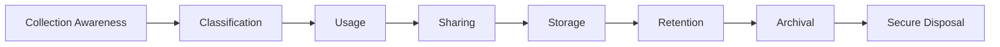
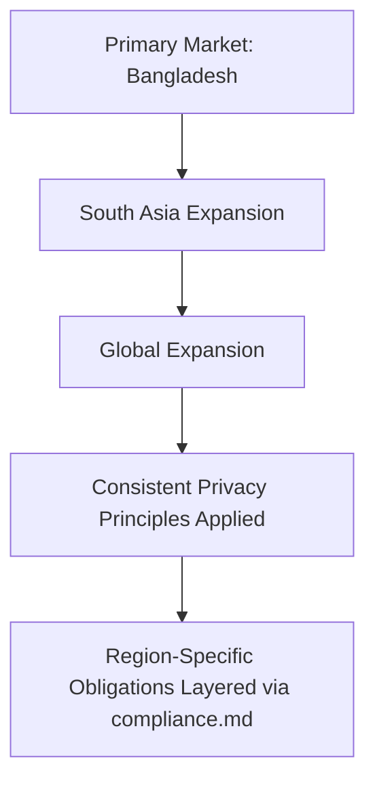
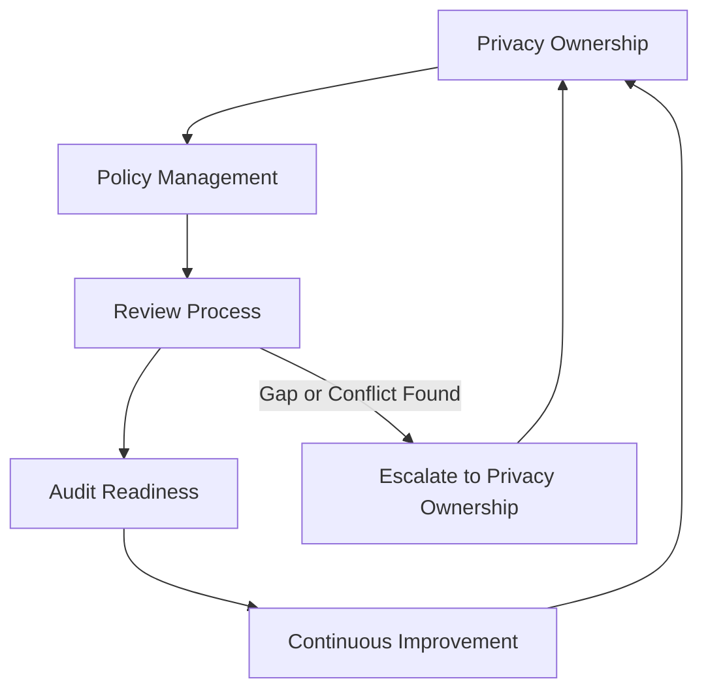
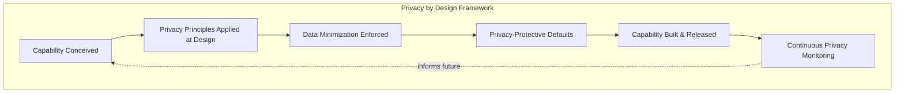

# Privacy

## 1. Document Purpose

This document defines the official Enterprise Privacy Strategy for **StackLeo Tech Store**. It establishes how the organization thinks about and governs personal data — the principles guiding its collection, use, and eventual disposal, independent of any single regulatory regime.

- **Purpose of Privacy Governance** — to ensure that personal data is treated as belonging to the individual it describes, not merely as a business asset StackLeo happens to hold, and that this belief is reflected consistently in how the organization operates.
- **Relationship with Security** — privacy and security are complementary but distinct: `data-protection.md` and `encryption.md` define how data is *safeguarded*; this document defines the principles governing *whether and how it should be used at all*. Security without privacy can protect data used inappropriately; privacy without security cannot protect data at all.
- **Relationship with Data Governance** — this document is the privacy-specific elaboration of the Privacy Principles introduced in `data-protection.md` (Section 6), applied in structural depth across the personal data categories the platform handles.
- **Relationship with Customer Trust** — customers extend StackLeo their identity, contact details, and purchase history; trust in that extension is the business's core differentiator, per `01_Business/vision.md`, and privacy governance is how that trust is honored in substance, not only in policy language.
- **Relationship with Business Resilience** — privacy failures — even absent a technical security breach — damage customer confidence and can trigger regulatory and reputational consequences; disciplined privacy governance protects the business resilience described in `security-principles.md` (Section 9).

This document is implementation-independent and vendor-neutral. It defines privacy philosophy, governance, and lifecycle — not legal advice, mandatory citations to specific privacy regulations, privacy software, or code. Specific legal and regulatory obligations applicable to StackLeo's markets are identified and tracked through `compliance.md` and appropriate legal counsel, not through this document.

## 2. Privacy Philosophy

- **Privacy by Design** — privacy is considered at the point a capability involving personal data is conceived, not layered on afterward, consistent with `security-principles.md` (Section 8).
- **Privacy by Default** — the default handling of personal data is its most privacy-protective reasonable state, requiring deliberate justification to expand rather than deliberate effort to protect.
- **Data Minimization** — only personal data genuinely necessary for a defined, legitimate purpose is collected or retained, consistent with `01_Business/business-rules.md` (BR-128).
- **Transparency** — individuals can reasonably understand what personal data is collected about them and why, without needing to interpret dense or evasive language.
- **Accountability** — responsibility for privacy decisions is traceable to a specific, accountable owner, consistent with the governance model in Section 9.
- **Continuous Improvement** — privacy practice matures deliberately as the platform, business model, and societal expectations around personal data evolve.

## 3. Privacy Principles

- **Lawful & Ethical Processing**
  - *Purpose* — ensure personal data is processed on a legitimate basis and in a manner individuals would consider fair.
  - *Business Value* — protects the business from the reputational and regulatory consequences of processing perceived as illegitimate or exploitative.
  - *Privacy Objectives* — every use of personal data can be justified against a clear, legitimate purpose.
- **Purpose Limitation**
  - *Purpose* — ensure personal data is used only for the purpose it was collected for, or one an individual would reasonably expect.
  - *Business Value* — preserves customer trust by avoiding data being repurposed in ways customers did not anticipate.
  - *Privacy Objectives* — new uses of existing data are evaluated against the original collection purpose before proceeding.
- **Data Minimization**
  - *Purpose* — ensure only necessary personal data is collected and retained.
  - *Business Value* — reduces exposure and simplifies governance as the business scales.
  - *Privacy Objectives* — data collection forms and processes are periodically reviewed against genuine necessity.
- **Accuracy Awareness**
  - *Purpose* — ensure personal data remains correct and current.
  - *Business Value* — inaccurate personal data undermines both the customer experience and business decisions built upon it.
  - *Privacy Objectives* — individuals have a reasonable path to have inaccurate data about them corrected (Section 6).
- **Storage Limitation**
  - *Purpose* — ensure personal data is retained only as long as its legitimate purpose requires.
  - *Business Value* — treats indefinite retention as a liability rather than a convenience, consistent with `data-protection.md` (Section 5).
  - *Privacy Objectives* — retention periods are defined deliberately per data category, per `04_Database/data-retention.md`.
- **Integrity & Confidentiality**
  - *Purpose* — ensure personal data is protected against unauthorized access, alteration, or loss.
  - *Business Value* — connects privacy governance to the concrete safeguards defined in `data-protection.md` and `encryption.md`.
  - *Privacy Objectives* — personal data receives protection proportionate to its sensitivity, consistent with the classification model in `data-protection.md` (Section 4).
- **Accountability**
  - *Purpose* — ensure privacy commitments are backed by a specific, responsible owner.
  - *Business Value* — makes privacy governance durable rather than aspirational, consistent with `security-governance.md`.
  - *Privacy Objectives* — every personal data category has a designated accountable owner (Section 4).

### Privacy Principle Matrix

| Principle | Primary Privacy Objective | Business Outcome |
|---|---|---|
| Lawful & Ethical Processing | Every use is justified against a legitimate purpose | Protects against reputational and regulatory consequence |
| Purpose Limitation | Data used only as reasonably expected | Preserves trust by avoiding unanticipated repurposing |
| Data Minimization | Only necessary data is collected and retained | Reduces exposure and simplifies governance |
| Accuracy Awareness | Data remains correct and current | Improves both experience and business decision quality |
| Storage Limitation | Data retained only as long as necessary | Reduces long-term liability |
| Integrity & Confidentiality | Data protected proportionate to sensitivity | Connects privacy to concrete security safeguards |
| Accountability | Every data category has a responsible owner | Makes privacy commitments durable, not aspirational |

## 4. Personal Data Governance

| Category | Business Importance | Privacy Considerations | Governance Objectives |
|---|---|---|---|
| Customer Data | Represents the direct customer relationship and trust. | Highest sensitivity; directly tied to individual identity and behavior. | Purpose-limited use; accessible and correctable by the customer where reasonable. |
| Employee Data | Enables workforce management and accountability. | Subject to the same privacy expectations as customer data, proportionate to role. | Access limited to legitimate HR and operational need. |
| Vendor Data | Supports operational partnerships (couriers, service centers). | Business contact and performance information, generally lower individual sensitivity. | Scoped to the specific partnership purpose. |
| Marketplace Participants (Future) | Will represent third-party seller identity and business information. | Introduces cross-tenant sensitivity once the marketplace launches. | Seller data governed distinctly from customer data, with clear boundaries. |
| AI Data (Future) | Will support AI-assisted capability (recommendations, fraud detection). | Risk of personal data being used in ways individuals did not anticipate. | Use scoped to purposes consistent with original data collection. |
| Analytics Data | Informs strategic and operational decision-making. | Risk of re-identification when aggregated data is combined with other sources. | Aggregation and anonymization practices reviewed for re-identification risk. |
| Support Data | Enables customer service and issue resolution. | Often contains sensitive detail volunteered directly by the customer. | Retained only as long as the support relationship requires. |

### Personal Data Governance Matrix

| Category | Typical Sensitivity (per `data-protection.md`, Section 4) | Primary Governance Concern |
|---|---|---|
| Customer Data | Confidential–Restricted | Purpose limitation and individual rights |
| Employee Data | Confidential | Access limited to legitimate HR need |
| Vendor Data | Internal–Confidential | Scoped to partnership purpose |
| Marketplace Participants (Future) | Confidential (Future) | Cross-tenant separation |
| AI Data (Future) | Confidential | Use consistent with original purpose |
| Analytics Data | Internal–Confidential | Re-identification risk in aggregation |
| Support Data | Confidential | Retention limited to support relationship duration |

## 5. Privacy Lifecycle

- **Collection Awareness** — personal data is gathered only for a legitimate, defined purpose, with awareness of what is being collected and why.
- **Classification** — personal data is classified consistent with `data-protection.md` (Section 4), determining the proportionate handling it receives.
- **Usage** — personal data is used only within the scope of its collection purpose, consistent with Purpose Limitation (Section 3).
- **Sharing** — personal data shared with third parties (payment, courier, communication providers) is limited to what the specific purpose requires, consistent with `security-architecture.md` (Section 4).
- **Storage** — personal data at rest is protected proportionately to its classification, per `data-protection.md` (Section 5).
- **Retention** — personal data is retained only as long as its legitimate purpose requires, per `04_Database/data-retention.md`.
- **Archival** — personal data retained beyond active use is protected to the same standard as active data.
- **Secure Disposal** — personal data is removed in a manner consistent with its classification once retention purpose has ended.

*Diagram 2: Personal Data Lifecycle.*

### Privacy Lifecycle Matrix

| Stage | Primary Privacy Concern |
|---|---|
| Collection Awareness | Limiting gathering to legitimate, defined purpose |
| Classification | Determining proportionate handling based on sensitivity |
| Usage | Ensuring use stays within the original collection purpose |
| Sharing | Limiting third-party exposure to integration-specific need |
| Storage | Protecting data at rest proportionately to classification |
| Retention | Ensuring data is kept only as long as legitimately required |
| Archival | Sustaining protection standards for inactive data |
| Secure Disposal | Ensuring complete, classification-appropriate removal |

## 6. Data Subject Awareness

StackLeo maintains conceptual awareness of the reasonable expectations individuals hold regarding their own personal data, without this document prescribing specific legal obligations:

- **Transparency** — individuals can reasonably understand what personal data is collected about them and why.
- **Consent Awareness** — where personal data use depends on an individual's agreement, that agreement is sought in a manner the individual can reasonably understand.
- **Access Awareness** — individuals can reasonably expect a path to understand what personal data StackLeo holds about them.
- **Correction Awareness** — individuals can reasonably expect a path to have inaccurate personal data about them corrected.
- **Deletion Awareness** — individuals can reasonably expect a path to request removal of their personal data where a legitimate business or legal purpose no longer requires it.
- **Portability Awareness** — individuals can reasonably expect their own data to be made available to them in a usable form where appropriate.
- **Objection Awareness** — individuals can reasonably expect a path to object to specific uses of their personal data that are not essential to the core service relationship.

These principles reflect StackLeo's own privacy philosophy and are not a substitute for legal advice on specific regulatory obligations, which are tracked separately through `compliance.md`.

## 7. Cross-Border Privacy Readiness

This strategy is deliberately structured to remain applicable as StackLeo's markets expand:

- **Global Expansion** — the privacy principles in Section 3 remain jurisdiction-agnostic, allowing region-specific obligations to layer on as StackLeo expands from Bangladesh into South Asia and beyond.
- **International Customers** — customers outside StackLeo's primary market are afforded the same privacy philosophy, with region-specific legal nuance addressed through `compliance.md`.
- **Multi-Region Operations** — privacy governance applies consistently regardless of the number or location of regions personal data is processed or stored in.
- **Cloud-Native Platforms** — privacy principles remain independent of any specific infrastructure provider or region, consistent with `infrastructure-security.md`.
- **Marketplace Platform** — Marketplace Participants (Section 4) are already anticipated as a distinct governance category, allowing cross-border seller data considerations to be planned ahead of launch.
- **AI Systems** — AI Data (Section 4) use remains subject to Purpose Limitation regardless of where AI processing occurs.

*Diagram 4: Cross-Border Privacy Readiness.*

## 8. Privacy Risk Management

- **Risk Identification** — potential privacy risks (excessive collection, unclear purpose, inadequate protection) are actively identified across new and existing capability.
- **Impact Awareness** — the potential impact of a privacy risk on affected individuals is considered alongside its business consequence, consistent with `security-principles.md` (Section 5).
- **Governance** — identified privacy risks are owned and tracked by an accountable party, consistent with Section 9.
- **Review Process** — privacy risk is reviewed at defined points, including when new capability involving personal data is introduced.
- **Continuous Monitoring** — the organization maintains ongoing awareness of how personal data is actually being used in practice, not only how it was designed to be used.
- **Improvement** — identified privacy risks and gaps inform improvement to this strategy and its underlying practice over time.

### Privacy Risk Management Matrix

| Concern | Governance Expectation |
|---|---|
| Risk Identification | Privacy risks are actively sought, not assumed absent |
| Impact Awareness | Individual impact is weighed alongside business consequence |
| Governance | Every identified risk has an accountable owner |
| Review Process | Reviewed at defined points, including new capability introduction |
| Continuous Monitoring | Ongoing awareness of actual, not only designed, data use |
| Improvement | Findings inform strategy and practice refinement |

## 9. Governance

- **Privacy Ownership** — a designated Data Protection Owner, referenced in `security-principles.md` (Section 11) and `data-protection.md` (Section 8), owns the coherence of this privacy strategy.
- **Policy Management** — operational privacy policies are derived from this strategy and maintained consistently with `security-governance.md`.
- **Review Process** — this strategy and its underlying practice are reviewed on a defined cadence and whenever a new personal data category or business model is introduced.
- **Audit Readiness** — privacy governance decisions and data handling practice are documented in a manner that supports review at any time, consistent with `security-principles.md` (Section 9).
- **Continuous Improvement** — this strategy is expected to mature as personal data categories, business models, and societal expectations evolve.

*Diagram 3: Privacy Governance Model.*

### Governance Responsibility Matrix

| Role | Responsibility |
|---|---|
| Data Protection Owner | Owns coherence and enforcement of the privacy strategy. |
| Security Lead | Ensures privacy governance aligns with `data-protection.md` and `encryption.md`. |
| Product Manager | Ensures new capability involving personal data is evaluated against privacy principles before commitment. |
| Engineering Leads | Apply Privacy by Design and Privacy by Default within their domain. |
| Compliance & Risk Functions | Track alignment with applicable legal and regulatory obligations, per `compliance.md`. |
| Internal Audit / Review Function | Independently verifies privacy practice matches this strategy. |

*Diagram 1: Privacy by Design Framework.*

## 10. Anti-Patterns

| Anti-Pattern | Why It's Avoided |
|---|---|
| Excessive Data Collection | Violates Data Minimization (Section 3); increases exposure without a legitimate corresponding purpose. |
| Weak Transparency | Leaves individuals unable to reasonably understand what data is collected and why, contradicting Section 2. |
| Unlimited Retention | Treats indefinite retention as a convenience rather than a liability, contradicting Storage Limitation (Section 3). |
| Poor Consent Awareness | Fails to seek agreement in a manner individuals can reasonably understand, contradicting Section 6. |
| Weak Governance | Leaves privacy practice without an accountable owner or review mechanism (Section 9). |
| Missing Accountability | Prevents privacy decisions from being traced to a responsible party, contradicting Section 3. |
| Reactive Privacy | Treats privacy as a response to complaints or incidents rather than a continuous discipline, contradicting Privacy by Design (Section 2). |
| Poor Documentation | Prevents privacy practice from being audited, understood, or improved consistently over time. |

## 11. Document Information

| Property | Value |
|----------|-------|
| Document | privacy.md |
| Version | 1.0.0 |
| Status | Active |
| Maintained By | StackLeo |
| Last Updated | 2026-07-17 |

---

© StackLeo. All Rights Reserved.
