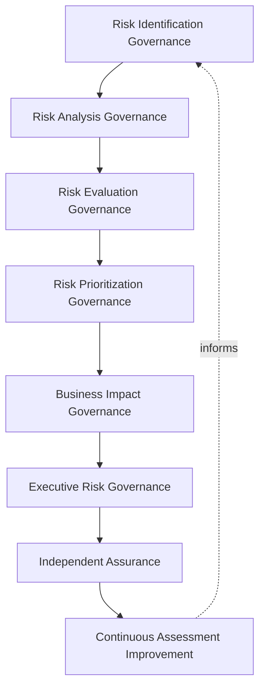
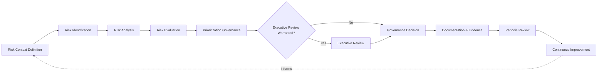
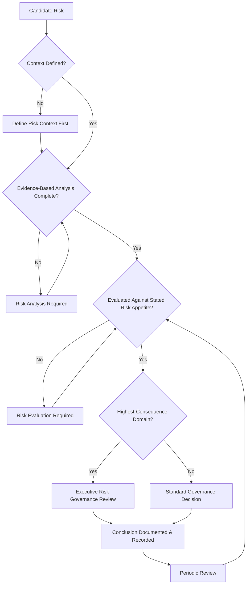
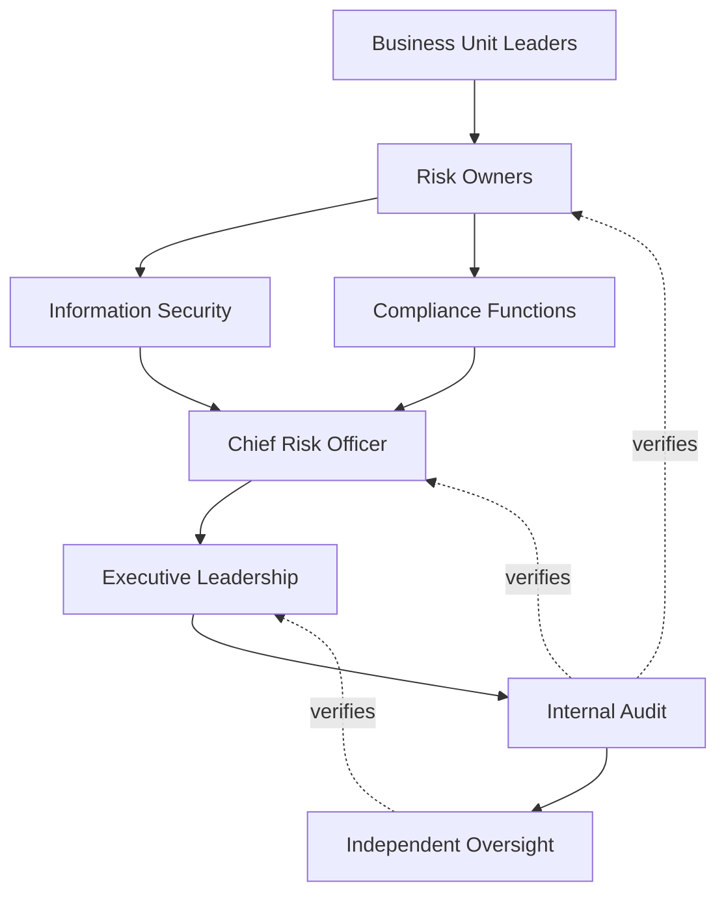
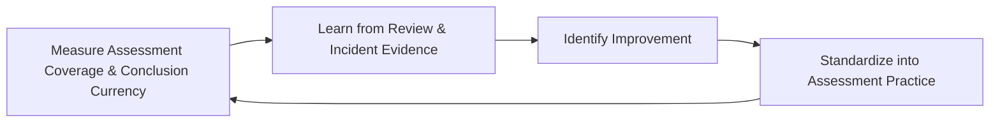
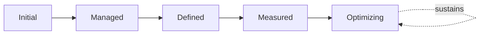

# Enterprise Risk Assessment & Evaluation Framework

## 1. Document Purpose

This document defines the official Enterprise Risk Assessment & Evaluation Framework for **StackLeo Tech Store** — the CRO-owned governance framework under which risk identification, analysis, and evaluation are performed consistently across every risk domain the business carries. It establishes governance for risk identification, risk analysis, risk evaluation, prioritization governance, organizational accountability, executive oversight, and continuous risk assessment maturity, consistent with ISO 31000, ISO/IEC 27005, COSO Enterprise Risk Management, ISO/IEC 27001, and TOGAF enterprise architecture thinking.

Risk identification, analysis, and evaluation — the process of turning an uncertain future event into a decision-ready understanding — is common ground every specialized risk discipline in `06_Security` depends on. `enterprise-risk-management-strategy.md` and `risk-management.md` establish the enterprise-wide governance model, appetite, and domains this framework's methodology applies within; `security-risk-management.md` elaborates the same assessment discipline specifically for cyber risk. This document exists so that "high risk" means the same thing whether it is assessed by security, compliance, operations, or strategy — a single, consistent assessment methodology every domain shares, rather than each discipline inventing its own.

- **Purpose of Risk Assessment** — to ensure every risk StackLeo identifies is understood — its cause, its consequence, its likelihood, and its significance — through a consistent, evidence-based process, so that risk evaluation across every domain is comparable and decisions built on it are genuinely well-founded.
- **Relationship with Enterprise Risk Management** — this framework is the assessment-specific elaboration of `enterprise-risk-management-strategy.md`; where that strategy governs risk ownership, appetite, and treatment as a whole, this document governs specifically how a risk moves from being identified to being genuinely understood and prioritized.
- **Relationship with Information Security** — `security-risk-management.md` applies this framework's assessment discipline specifically to cybersecurity risk; this document establishes the shared methodology that discipline, and every other domain in Section 4, is built upon.
- **Relationship with Compliance Governance** — compliance risk assessed under this framework directly informs the obligation tracking maintained in `compliance.md`, ensuring regulatory risk is understood with the same rigor as any other enterprise risk.
- **Relationship with Business Strategy** — risk assessment exists to inform genuine business decisions in service of `01_Business/business-model.md`, never as an abstract exercise disconnected from what the business is actually trying to achieve.
- **Relationship with Executive Decision-Making** — this framework produces the risk understanding executive and Board-level decisions, governed under `enterprise-risk-management-strategy.md` (Section 3.7), depend on to be genuinely risk-informed.
- **Relationship with Organizational Resilience** — understanding a risk fully — including how the organization would recover from it — is a prerequisite to the resilience commitment in `enterprise-risk-management-strategy.md` (Section 2.7).

This document is implementation-independent and vendor-neutral. It defines risk assessment governance philosophy, model, domains, and lifecycle conceptually — not specific GRC platforms, vulnerability scanners, security testing tools, cloud providers, consulting firms, security products, risk scoring formulas, quantitative models, likelihood calculations, heat maps, assessment worksheets, operational assessment procedures, infrastructure configurations, deployment architectures, mitigation workflows, or code.

## 2. Risk Assessment Philosophy

Risk assessment at StackLeo rests on eight principles. Each exists to produce a specific business outcome — a risk is assessed deliberately because a decision about a risk is only as good as the understanding behind it.

### 2.1 Risk Identification Before Mitigation

A risk is genuinely identified and understood before any decision is made about how to treat it.

- **Business Value** — prevents treatment effort from being spent on a risk that was never fully understood in the first place.

### 2.2 Risk-Informed Decisions

Assessment exists specifically to make significant decisions genuinely informed by risk, consistent with `enterprise-risk-management-strategy.md` (Section 2.2).

- **Business Value** — ensures the understanding this framework produces actually reaches and influences real decisions.

### 2.3 Business Context Matters

A risk's significance is assessed in the context of StackLeo's actual business — its model, its market, its ambitions — never in the abstract.

- **Business Value** — ensures assessment produces judgments genuinely relevant to StackLeo, not generic risk commentary.

### 2.4 Accountability

Every assessment traces to a specific, named, responsible party.

- **Business Value** — ensures every risk understanding has someone genuinely responsible for its quality and completeness.

### 2.5 Transparency

How a risk was assessed, and on what basis, is documented and visible to those who rely on the conclusion.

- **Business Value** — allows a risk conclusion to be scrutinized and defended, not merely accepted on faith.

### 2.6 Governance by Design

Assessment governance is established deliberately as a new risk domain is introduced, not retrofitted once inconsistent, ungoverned assessment practice has already emerged.

- **Business Value** — prevents the costly, high-visibility discovery of assessment gaps only after a poorly understood risk has already materialized.

### 2.7 Continuous Learning

Each assessment cycle, and every risk event, deepens the organization's genuine understanding of its own risk landscape.

- **Business Value** — ensures assessment quality improves over time rather than repeating the same blind spots indefinitely.

### 2.8 Continuous Improvement

Risk assessment governance practice matures over time, informed by real assessment outcomes, incidents, and the organization's growth in scale and complexity.

- **Business Value** — keeps risk assessment governance aligned with StackLeo's growth in scale, market reach, and business model complexity.

## 3. Enterprise Risk Assessment Governance Model

Risk assessment governance operates across eight conceptual layers, each holding accountability for a distinct dimension of the assessment process.

### 3.1 Risk Identification Governance

- **Purpose** — own the coherence of how risks are surfaced and recognized across every domain.
- **Governance Scope** — oversight of Risk Identification (Section 5.2) across every domain in Section 4.
- **Business Value** — ensures risk is surfaced deliberately and completely, not only through whichever channel happens to be most visible.
- **Executive Expectations** — leadership trusts identification draws from every genuinely relevant source, not a single narrow channel.

### 3.2 Risk Analysis Governance

- **Purpose** — own the coherence of how a risk's causes, consequences, and likelihood are understood.
- **Governance Scope** — oversight of Risk Analysis (Section 5.3), applied without prescribing a specific quantitative or qualitative method.
- **Business Value** — ensures every risk conclusion rests on genuine evidence-based understanding, not surface-level impression.
- **Executive Expectations** — leadership trusts analysis is evidence-based and consistently applied across domains.

### 3.3 Risk Evaluation Governance

- **Purpose** — own the coherence of how a risk's significance is judged against the organization's stated risk appetite.
- **Governance Scope** — oversight of Risk Evaluation (Section 5.4), coordinated with `enterprise-risk-management-strategy.md` (Section 3).
- **Business Value** — ensures risk significance is judged consistently, not by whichever standard the assessing function happens to prefer.
- **Executive Expectations** — leadership trusts evaluation reflects the organization's actual, current risk appetite.

### 3.4 Risk Prioritization Governance

- **Purpose** — own the coherence of how assessed risks are ordered for attention and treatment.
- **Governance Scope** — oversight of Prioritization Governance (Section 5.5) across every domain, ensuring the most consequential risks receive attention first.
- **Business Value** — ensures limited organizational attention is spent where a mistaken risk understanding would cost the business most.
- **Executive Expectations** — leadership trusts prioritization reflects genuine consequence, not administrative convenience.

### 3.5 Business Impact Governance

- **Purpose** — own the coherence of how a risk's genuine consequence to the business is understood and articulated.
- **Governance Scope** — oversight of business impact framing across every domain, ensuring assessments speak in terms the business genuinely understands.
- **Business Value** — ensures risk conclusions are meaningful to business decision-makers, not expressed only in technical or abstract terms.
- **Executive Expectations** — leadership expects every significant risk to be articulated in terms of genuine business consequence.

### 3.6 Executive Risk Governance

- **Purpose** — own executive-level accountability for the assessment conclusions carrying the greatest organizational consequence.
- **Governance Scope** — oversight spanning Sections 3.1–3.5 wherever an assessment conclusion rises to genuine executive or Board concern.
- **Business Value** — ensures the most consequential risk conclusions are visible at the level accountable for the organization as a whole.
- **Executive Expectations** — leadership expects to be informed of, not surprised by, the organization's most significant assessed risks.

### 3.7 Independent Assurance

- **Purpose** — own the independent verification that risk assessment is genuinely occurring and genuinely effective.
- **Governance Scope** — oversight of assessment quality, completeness, and evidentiary sufficiency across every layer of this model.
- **Business Value** — prevents assessment effectiveness from being assumed on the word of the same function performing it.
- **Executive Expectations** — leadership trusts an independent party periodically confirms assessment is genuinely happening as documented.

### 3.8 Continuous Assessment Improvement

- **Purpose** — govern the mechanism by which every other layer in this model matures over time.
- **Governance Scope** — consolidates findings from assessment reviews, realized risk events, and audits across every domain in Section 4.
- **Business Value** — prevents assessment governance itself from becoming the next thing that quietly stagnates as the organization scales.
- **Executive Expectations** — leadership expects assessment maturity to be assessed periodically, not assumed static once established.

### Enterprise Risk Assessment Governance Matrix

| Layer | Purpose | Business Value | Executive Expectations |
|---|---|---|---|
| Risk Identification Governance | Own coherence of how risks are surfaced and recognized | Ensures risk is surfaced deliberately and completely | Trusts identification draws from every relevant source |
| Risk Analysis Governance | Own coherence of understanding cause, consequence, likelihood | Ensures conclusions rest on genuine evidence-based understanding | Trusts analysis is evidence-based and consistently applied |
| Risk Evaluation Governance | Own coherence of judging significance against appetite | Ensures significance is judged consistently across domains | Trusts evaluation reflects the organization's actual appetite |
| Risk Prioritization Governance | Own coherence of ordering risks for attention | Ensures limited attention is spent where it matters most | Trusts prioritization reflects genuine consequence |
| Business Impact Governance | Own coherence of articulating genuine business consequence | Ensures conclusions are meaningful to business decision-makers | Expects risk articulated in terms of genuine business consequence |
| Executive Risk Governance | Own executive accountability for highest-consequence conclusions | Ensures the most consequential conclusions are visible to leadership | Expects leadership informed of, not surprised by, top risks |
| Independent Assurance | Own independent verification that assessment is genuinely effective | Prevents effectiveness being assumed on the assessor's own word | Trusts an independent party confirms assessment is real |
| Continuous Assessment Improvement | Govern maturation of every other layer | Prevents governance itself from stagnating | Expects maturity to be assessed periodically |

*Diagram 1: Enterprise Risk Assessment Governance Framework — identification, analysis, and evaluation governance establish the foundation, prioritization and business impact governance translate conclusions into decision-ready understanding, and executive oversight, independently assured, converges on continuous improvement that feeds back into the model.*

## 4. Enterprise Risk Assessment Domains

Risk assessment is governed across ten conceptual domains, each requiring a distinct assessment emphasis, mirroring the domains established in `enterprise-risk-management-strategy.md` (Section 4).

### 4.1 Strategic Risk Assessment

- **Purpose** — assess risk to StackLeo's core business strategy and growth ambitions.
- **Assessment Considerations** — governed under Business Impact Governance (Section 3.5), coordinated with `01_Business/business-model.md`.
- **Business Importance** — ensures growth ambitions are pursued with genuine understanding of what could derail them.
- **Executive Expectations** — leadership expects strategic risk assessment to inform, not follow, major strategic decisions.

### 4.2 Operational Risk Assessment

- **Purpose** — assess risk to day-to-day operation — fulfillment, logistics, customer service.
- **Assessment Considerations** — governed under Risk Analysis Governance (Section 3.2), drawing on genuine operational experience.
- **Business Importance** — protects the operational reliability customers directly experience.
- **Executive Expectations** — leadership expects operational risk assessment to draw on genuine frontline experience, not assumption.

### 4.3 Financial Risk Assessment

- **Purpose** — assess risk to StackLeo's financial position and integrity.
- **Assessment Considerations** — governed under Executive Risk Governance (Section 3.6), given its direct Board-level relevance.
- **Business Importance** — protects the business's financial sustainability and its standing with financial partners.
- **Executive Expectations** — leadership expects financial risk assessment to meet the same evidentiary rigor as any other domain.

### 4.4 Technology Risk Assessment

- **Purpose** — assess risk arising from the platform's technology, architecture, and technical dependencies.
- **Assessment Considerations** — governed under Risk Analysis Governance (Section 3.2), coordinated with `03_System_Design/architecture-principles.md`.
- **Business Importance** — protects the platform's ability to reliably serve customers across every current and future channel.
- **Executive Expectations** — leadership expects technology risk assessment to inform significant architectural decisions before, not after, they are made.

### 4.5 Cybersecurity Risk Assessment

- **Purpose** — assess risk to the confidentiality, integrity, and availability of the platform and its data.
- **Assessment Considerations** — this domain's full ISO/IEC 27005-aligned assessment lifecycle is elaborated in `security-risk-management.md`, applying this framework's shared methodology.
- **Business Importance** — protects the trust customers place in the platform with their data and transactions.
- **Executive Expectations** — leadership expects cybersecurity risk assessment conclusions to be expressed in the same business-impact terms as any other domain.

### 4.6 Compliance Risk Assessment

- **Purpose** — assess risk of failing to meet regulatory or contractual obligation.
- **Assessment Considerations** — governed under Risk Evaluation Governance (Section 3.3), coordinated with `compliance.md`.
- **Business Importance** — protects the business's standing with regulators, partners, and enterprise customers.
- **Executive Expectations** — leadership expects compliance risk assessment to anticipate evolving obligations proactively.

### 4.7 Third-Party Risk Assessment

- **Purpose** — assess risk introduced by external vendors, service providers, and partners.
- **Assessment Considerations** — governed under Risk Identification Governance (Section 3.1), coordinated with `identity-federation.md`.
- **Business Importance** — protects the business from risk it does not directly control but is nonetheless exposed to.
- **Executive Expectations** — leadership expects third-party risk to be assessed before, not after, a relationship is established.

### 4.8 Supply Chain Risk Assessment

- **Purpose** — assess risk to the suppliers and logistics relationships the commerce experience depends on.
- **Assessment Considerations** — governed under Business Impact Governance (Section 3.5), anticipating growth in supplier and wholesale relationships.
- **Business Importance** — protects the business's ability to reliably source and deliver the products it sells.
- **Executive Expectations** — leadership expects supply chain risk assessment to be revisited as sourcing relationships evolve.

### 4.9 Reputational Risk Assessment

- **Purpose** — assess risk to the trust and public standing central to StackLeo's brand.
- **Assessment Considerations** — governed under Executive Risk Governance (Section 3.6), given its inherently cross-cutting nature.
- **Business Importance** — protects the trust relationship every customer transaction and business partnership depends on.
- **Executive Expectations** — leadership expects reputational consequence to be explicitly assessed for every significant risk, not treated as an afterthought.

### 4.10 Emerging & AI Risk Assessment

- **Purpose** — assess risk from AI-assisted capability and other genuinely new categories of risk as they emerge.
- **Assessment Considerations** — governed under Continuous Assessment Improvement (Section 3.8) as a distinct, explicitly monitored category.
- **Business Importance** — protects against risk categories established assessment practice may not yet have anticipated.
- **Executive Expectations** — leadership expects emerging risk to be actively scanned for, not discovered only once it has already materialized.

### Enterprise Risk Assessment Domain Matrix

| Domain | Purpose | Business Importance | Executive Expectations |
|---|---|---|---|
| Strategic Risk Assessment | Assess risk to core business strategy and growth | Ensures ambitions pursued with understanding of what could derail them | Informs, not follows, major strategic decisions |
| Operational Risk Assessment | Assess risk to day-to-day fulfillment and operation | Protects the operational reliability customers experience | Draws on genuine frontline experience, not assumption |
| Financial Risk Assessment | Assess risk to financial position and integrity | Protects financial sustainability and partner standing | Meets the same evidentiary rigor as any other domain |
| Technology Risk Assessment | Assess risk from technology, architecture, dependencies | Protects the platform's ability to reliably serve customers | Informs significant architectural decisions before they're made |
| Cybersecurity Risk Assessment | Assess risk to confidentiality, integrity, availability | Protects customer trust in data and transactions | Expressed in the same business-impact terms as other domains |
| Compliance Risk Assessment | Assess risk of failing regulatory/contractual obligation | Protects standing with regulators, partners, enterprise customers | Anticipates evolving obligations proactively |
| Third-Party Risk Assessment | Assess risk from external vendors and partners | Protects against risk the business doesn't directly control | Assessed before, not after, a relationship begins |
| Supply Chain Risk Assessment | Assess risk to suppliers and logistics relationships | Protects the ability to reliably source and deliver products | Revisited as sourcing relationships evolve |
| Reputational Risk Assessment | Assess risk to trust and public standing | Protects the trust every transaction and partnership depends on | Explicitly assessed for every significant risk |
| Emerging & AI Risk Assessment | Assess risk from AI and other genuinely new categories | Protects against risk not yet anticipated by established practice | Actively scanned for, not discovered after materializing |

## 5. Enterprise Risk Assessment Lifecycle

Risk assessment proceeds through ten conceptual lifecycle stages, applicable across every domain in Section 4.

### 5.1 Risk Context Definition

- **Purpose** — establish the business, operational, and strategic context a given assessment will be conducted within.
- **Governance Objectives** — require context to be explicitly defined before assessment begins, consistent with Business Context Matters (Section 2.3).
- **Business Value** — ensures the assessment that follows is genuinely relevant to StackLeo's actual circumstances.

### 5.2 Risk Identification

- **Purpose** — recognize that a genuine risk exists within the defined context.
- **Governance Objectives** — require identification to draw from multiple sources — strategic planning, operational experience, incidents, audits.
- **Business Value** — ensures risk is surfaced deliberately, not only after it has already caused harm.

### 5.3 Risk Analysis

- **Purpose** — understand a risk's genuine causes, consequences, and likelihood.
- **Governance Objectives** — require analysis to be evidence-based, never assumed from intuition alone.
- **Business Value** — ensures decisions about a risk are grounded in genuine understanding, not surface-level impression.

### 5.4 Risk Evaluation

- **Purpose** — determine a risk's significance against the organization's stated risk appetite.
- **Governance Objectives** — require evaluation to reference `enterprise-risk-management-strategy.md`'s established appetite, never an ad hoc standard.
- **Business Value** — ensures risk significance is judged consistently across every domain.

### 5.5 Prioritization Governance

- **Purpose** — order assessed risks for attention and eventual treatment.
- **Governance Objectives** — require prioritization to reflect genuine consequence, consistent with Section 3.4.
- **Business Value** — ensures limited organizational attention is directed toward what genuinely matters most.

### 5.6 Executive Review

- **Purpose** — escalate assessment conclusions of genuine organizational consequence to executive attention.
- **Governance Objectives** — require escalation criteria to be defined in advance, consistent with Executive Risk Governance (Section 3.6).
- **Business Value** — ensures leadership is engaged specifically where its judgment and authority are genuinely needed.

### 5.7 Governance Decision

- **Purpose** — formally decide how an assessed risk's conclusion will inform subsequent treatment governance.
- **Governance Objectives** — require the decision to trace to a specific, accountable party, consistent with Accountability (Section 2.4).
- **Business Value** — ensures assessment conclusions produce an actual outcome, not a passive observation.

### 5.8 Documentation & Evidence

- **Purpose** — record assessment activity and conclusions in a form suitable for independent review.
- **Governance Objectives** — require every context, identification, analysis, and evaluation to leave a durable, reviewable record.
- **Business Value** — ensures assessment governance can be independently verified, not merely asserted.

### 5.9 Periodic Review

- **Purpose** — formally reassess whether an assessment's conclusions remain genuinely current.
- **Governance Objectives** — require review to occur on a predictable cadence, proportionate to the risk's significance.
- **Business Value** — catches assessment conclusions that have become stale as circumstances change.

### 5.10 Continuous Improvement

- **Purpose** — apply lessons from assessment outcomes to strengthen future identification, analysis, and evaluation.
- **Governance Objectives** — require findings to be genuinely analyzed for recurring patterns, consistent with Continuous Learning (Section 2.7).
- **Business Value** — turns each assessment cycle into an input that makes the next cycle genuinely better.

### Enterprise Risk Assessment Lifecycle Matrix

| Stage | Purpose | Governance Objective | Business Value |
|---|---|---|---|
| Risk Context Definition | Establish the context an assessment will be conducted within | Explicitly defined before assessment begins | Ensures the assessment is genuinely relevant to real circumstances |
| Risk Identification | Recognize a genuine risk exists within the context | Draws from multiple sources, never a single narrow channel | Ensures risk is surfaced deliberately, not after harm |
| Risk Analysis | Understand a risk's causes, consequences, and likelihood | Evidence-based, never assumed from intuition alone | Ensures decisions grounded in genuine understanding |
| Risk Evaluation | Determine significance against stated risk appetite | References the organization's established appetite | Ensures significance is judged consistently |
| Prioritization Governance | Order assessed risks for attention and treatment | Reflects genuine consequence | Directs limited attention toward what matters most |
| Executive Review | Escalate conclusions of genuine organizational consequence | Escalation criteria defined in advance | Ensures leadership engaged where judgment is genuinely needed |
| Governance Decision | Decide how a conclusion informs subsequent treatment | Traces to a specific, accountable party | Ensures conclusions produce an actual outcome |
| Documentation & Evidence | Record activity and conclusions for independent review | Every stage leaves a durable, reviewable record | Ensures governance can be independently verified |
| Periodic Review | Reassess whether conclusions remain genuinely current | Predictable cadence, proportionate to significance | Catches stale conclusions as circumstances change |
| Continuous Improvement | Apply lessons to strengthen future practice | Findings genuinely analyzed for recurring patterns | Makes each assessment cycle genuinely better |

*Diagram 2: Enterprise Risk Assessment Lifecycle — a risk is contextualized, identified, analyzed, and evaluated, prioritized and escalated for executive review where warranted, before a governance decision is documented and periodically reviewed, feeding continuous improvement back into the cycle.*

## 6. Risk Assessment Principles

- **Accountability** — every assessment traces to a specific, named, responsible party, consistent with Section 2.4.
- **Transparency** — how a risk was assessed is documented and visible to those who rely on the conclusion.
- **Traceability** — every assessment conclusion can be traced to its evidentiary basis, assessor, and timing.
- **Business Alignment** — assessment is conducted in service of genuine business decision need, never as an abstract exercise.
- **Risk Awareness** — assessment conclusions are produced with genuine understanding of business consequence, not technical detail alone.
- **Evidence-Based Decisions** — assessment conclusions rest on genuine evidence, never intuition or assumption presented as analysis.
- **Consistency** — the same assessment methodology is applied across every domain, so conclusions are genuinely comparable.
- **Continuous Improvement** — governance practice matures over time, informed by real assessment outcomes and incidents.

### Risk Assessment Principles Matrix

| Principle | Description | Business Value |
|---|---|---|
| Accountability | Every assessment traces to a specific, named, responsible party | Ensures assessments have a clear owner |
| Transparency | How a risk was assessed is documented and visible | Allows conclusions to be scrutinized and defended |
| Traceability | Conclusions traceable to evidentiary basis, assessor, timing | Enables defensible, evidence-based risk governance |
| Business Alignment | Assessment conducted in service of genuine decision need | Keeps assessment relevant rather than an abstract exercise |
| Risk Awareness | Conclusions produced with genuine business consequence understanding | Ensures conclusions are meaningful, not technical detail alone |
| Evidence-Based Decisions | Conclusions rest on genuine evidence, never assumption | Prevents intuition being presented as rigorous analysis |
| Consistency | The same methodology applied across every domain | Ensures conclusions are genuinely comparable |
| Continuous Improvement | Practice matures from real assessment outcomes and incidents | Keeps assessment governance aligned with organizational growth |

*Diagram 4: Enterprise Risk Assessment Decision Flow — a candidate risk is checked for defined context, evidence-based analysis, and appetite-based evaluation, escalated for executive review where highest-consequence, and resolved into a documented, recorded conclusion subject to periodic review.*

## 7. Ownership & Accountability

Governance authority for risk assessment is distributed deliberately across eight accountable functions, defined here at the governance-objective level, without prescribing specific operational assessment activities.

### 7.1 Executive Leadership

- **Governance Objective** — executive leadership consumes assessment conclusions to inform significant business decisions and holds the Chief Risk Officer accountable for assessment quality.
- **Business Value** — ensures assessment conclusions genuinely reach and inform the decisions they exist to support.

### 7.2 Chief Risk Officer

- **Governance Objective** — the Chief Risk Officer owns the coherence and enforcement of this framework across every domain, layer, and stage it defines.
- **Business Value** — provides a single point of specialist accountability for whether risk assessment is genuinely functioning as intended.

### 7.3 Business Unit Leaders

- **Governance Objective** — business unit leaders provide the business context and operational experience assessment within their domain genuinely depends on.
- **Business Value** — ensures assessment reflects genuine operational reality, not an outside function's assumption of it.

### 7.4 Risk Owners

- **Governance Objective** — each identified risk's owner is accountable for ensuring it receives a genuine, complete assessment.
- **Business Value** — ensures no risk persists with an incomplete or stale assessment because no one was responsible for maintaining it.

### 7.5 Information Security

- **Governance Objective** — information security applies this framework's methodology to Cybersecurity Risk Assessment (Section 4.5), coordinated with `security-risk-management.md`.
- **Business Value** — ensures cyber risk assessment remains consistent with, not divergent from, every other domain's methodology.

### 7.6 Compliance Functions

- **Governance Objective** — compliance functions apply this framework's methodology to Compliance Risk Assessment (Section 4.6), coordinated with `compliance.md`.
- **Business Value** — ensures regulatory risk assessment receives the same evidentiary rigor as any other domain.

### 7.7 Internal Audit

- **Governance Objective** — internal audit independently verifies that assessment records reflect actual organizational practice.
- **Business Value** — provides the Board with independent assurance that assessment governance is genuinely functioning as documented.

### 7.8 Independent Oversight

- **Governance Objective** — an independent function, separate from those who design and operate assessment governance, periodically verifies its overall effectiveness.
- **Business Value** — prevents governance from being assumed effective on the word of the same function responsible for running it.

### Ownership & Accountability Matrix

| Role | Governance Objective | Business Value |
|---|---|---|
| Executive Leadership | Consume conclusions and hold the CRO accountable for quality | Ensures conclusions genuinely reach and inform decisions |
| Chief Risk Officer | Own coherence and enforcement of this framework | Provides a single point of specialist accountability |
| Business Unit Leaders | Provide business context and operational experience | Ensures assessment reflects genuine operational reality |
| Risk Owners | Ensure their risk receives a genuine, complete assessment | Prevents incomplete or stale assessments persisting unowned |
| Information Security | Apply methodology to cybersecurity risk assessment | Ensures cyber assessment stays consistent with every other domain |
| Compliance Functions | Apply methodology to compliance risk assessment | Ensures regulatory assessment gets the same evidentiary rigor |
| Internal Audit | Independently verify records reflect actual practice | Provides the Board independent assurance |
| Independent Oversight | Independently verify overall governance effectiveness | Prevents self-assessed assumption of effectiveness |

*Diagram 3: Enterprise Risk Ownership & Accountability Model — accountability flows from business context and risk ownership through security and compliance functions into the Chief Risk Officer, converging on executive leadership verified by internal audit and independent oversight.*

## 8. Executive Oversight

- **Executive Risk Assessment Reviews** — the overall coherence of risk assessment governance is formally reviewed on a regular cadence, consistent with `security-governance.md` (Section 6).
- **Enterprise Risk Reporting** — aggregated assessment health — coverage, conclusion currency, escalation trends — is reported to executive leadership, coordinated with `enterprise-risk-management-strategy.md` (Section 5.7).
- **Governance Reviews** — the governance model, domains, and lifecycle defined in this framework (Sections 3–7) are periodically reassessed for continued fitness.
- **Strategic Decision Support** — significant assessment conclusions are made directly available to inform strategic and Board-level decisions, consistent with Section 2.2.
- **Documentation Governance** — this framework's relationship to `enterprise-risk-management-strategy.md`, `risk-management.md`, and `security-risk-management.md` is kept current as those documents evolve.
- **Audit Readiness** — assessment decisions, evidence, and outcomes are maintained in a state ready for internal or external audit at any time, coordinated with `audit-governance.md`.

### Executive Oversight Matrix

| Oversight Mechanism | Purpose | Governance Role |
|---|---|---|
| Executive Risk Assessment Reviews | Confirm overall assessment governance coherence | Regular, predictable cadence for the framework as a whole |
| Enterprise Risk Reporting | Provide leadership a single, coherent assessment picture | Reports coverage, conclusion currency, escalation trends |
| Governance Reviews | Reassess the governance model itself for continued fitness | Applies to Sections 3–7 of this framework |
| Strategic Decision Support | Make conclusions directly available for strategic decisions | Direct input into strategic and Board-level forums |
| Documentation Governance | Keep this framework's subordinate relationships current | Updated as related documents evolve |
| Audit Readiness | Maintain decisions and evidence ready for independent review | Continuous state, coordinated with audit governance |

### Governance Responsibility Matrix

| Role | Responsibility |
|---|---|
| Chief Risk Officer | Owns coherence and enforcement of this framework, in partnership with Executive Leadership. |
| Risk Assessment Governance Lead | Owns the operational assessment practice across every domain. |
| Business Unit Leaders | Provide business context and operational input within their assigned domain. |
| Information Security | Applies this framework's methodology to cybersecurity risk in coordination with `security-risk-management.md`. |
| Compliance Function | Applies this framework's methodology to compliance risk in coordination with `compliance.md`. |
| Executive Leadership | Consumes assessment conclusions and holds the CRO accountable for their quality. |
| Internal Audit | Independently verifies that assessment records reflect actual practice. |
| Independent Oversight | Independently verifies the overall effectiveness of assessment governance. |

## 9. Future Readiness

This framework is designed to remain valid as StackLeo evolves in scale, geography, and organizational complexity, without requiring redefinition of its underlying philosophy.

- **AI-Assisted Risk Assessment** — as identification and analysis increasingly incorporate AI-assisted signal detection, it remains governed under Risk Identification and Analysis (Sections 5.2–5.3) at the same rigor and explainability standard as any other method.
- **Predictive Risk Intelligence** — Continuous Improvement (Section 5.10) is structured to absorb increasingly forward-looking, predictive risk insight as it becomes available, without displacing the accountability this framework establishes.
- **Enterprise Scale** — the governance model, domains, and lifecycle defined throughout this framework are defined independently of organizational size, so they remain coherent as StackLeo's risk profile grows substantially.
- **Global Expansion** — Business Context Matters (Section 2.3) extends coherently as StackLeo expands from Bangladesh into South Asia and global markets, each with its own genuine business context to assess against.
- **Multi-Tenant Platforms** — where future architecture introduces tenant isolation, Technology Risk Assessment (Section 4.4) extends to explicitly scope assessment per tenant.
- **Digital Transformation** — this framework's methodology is defined independently of any specific business model configuration, so it extends coherently as StackLeo evolves from B2C toward corporate sales, wholesale, and the multi-vendor marketplace.
- **Continuous Risk Intelligence** — Periodic Review (Section 5.9) and Continuous Assessment Improvement (Section 3.8) are structured to move assessment progressively closer to a continuously current state as tooling and practice mature.
- **Future Regulatory Evolution** — Compliance Risk Assessment (Section 4.6) is structured to absorb genuinely new regulatory obligations as StackLeo's market presence and applicable jurisdictions grow.

## 10. Risk Assessment Maturity Model

Risk assessment governance maturity is described across five conceptual levels, consistent with COSO ERM, ISO 31000, and established process maturity thinking.

- **Initial** — assessment, where it exists, is informal and inconsistent; conclusions vary by whoever happens to perform them, and ownership is unclear.
- **Managed** — basic assessment practice exists for individual domains, but consistency across the ten domains in Section 4 varies significantly.
- **Defined** — the governance model, domains, and lifecycle are standardized, documented, and consistently applied across the organization, consistent with the model defined throughout this framework.
- **Measured** — assessment coverage, conclusion currency, and escalation trends are measured systematically, and decisions are grounded in genuine evidence rather than qualitative impression alone.
- **Optimizing** — risk assessment governance is continuously and deliberately improved based on quantitative evidence and organizational learning; improvement itself is a managed, ongoing discipline rather than an occasional initiative.

### Risk Assessment Maturity Model Matrix

| Level | Characteristics | Primary Focus |
|---|---|---|
| Initial | Informal, inconsistent assessment; conclusions vary by assessor | Ad hoc, individually-dependent assessment practice |
| Managed | Basic assessment exists per domain; consistency varies | Domain-level consistency |
| Defined | Standardized governance model, domains, and lifecycle | Organization-wide consistency and clear ownership |
| Measured | Coverage and conclusion currency measured systematically | Evidence-based assessment governance decisions |
| Optimizing | Practice continuously and deliberately improved from evidence | Sustained, deliberate improvement as a discipline |

*Diagram 5: Continuous Risk Assessment Improvement Cycle — assessment review and realized-risk outcomes are measured, learned from, improved upon, and standardized back into governed practice, on a continuing basis.*

*Diagram 6: Risk Assessment Maturity Progression Model — maturity advances from informal, assessor-dependent practice toward standardized, measured, and continuously optimized enterprise risk assessment.*

## 11. Anti-Patterns

The following recurring failure patterns are explicitly recognized and avoided, as each one structurally undermines this framework.

### Anti-Pattern Summary

| Anti-Pattern | Why It's Avoided |
|---|---|
| Incomplete Risk Identification | Contradicts Risk Identification Governance (Section 3.1); a risk never surfaced cannot be analyzed, evaluated, or treated, however good the rest of the process is. |
| Reactive Assessments | Contradicts Risk Identification Before Mitigation (Section 2.1); assessing a risk only after it has already materialized defeats the purpose of assessment. |
| Unknown Risk Ownership | Contradicts Risk Owners (Section 7.4); a risk with no accountable owner has no one genuinely responsible for ensuring its assessment stays current. |
| Weak Executive Visibility | Contradicts Enterprise Risk Reporting (Section 8); leadership cannot make risk-informed decisions about conclusions it is never shown. |
| Poor Documentation | Undermines Documentation & Evidence (Section 5.8) and Transparency (Section 6), leaving assessment conclusions unclear or unverifiable after the fact. |
| Compliance Without Risk Context | Contradicts Business Context Matters (Section 2.3); assessing compliance risk purely against a checklist, disconnected from genuine business consequence, misses what the risk actually means for the organization. |
| Siloed Assessments | Contradicts Consistency (Section 6); each domain applying its own ungoverned methodology makes conclusions incomparable across the organization. |
| Missing Continuous Improvement | Contradicts Continuous Learning (Section 2.7) and Continuous Assessment Improvement (Section 3.8); without deliberate improvement, assessment quality stagnates as the organization and its risk landscape grow. |

## 12. Document Information

| Property | Value |
|----------|-------|
| Document | risk-assessment-framework.md |
| Version | 1.0.0 |
| Status | Active |
| Maintained By | StackLeo |
| Last Updated | 2026-07-24 |

---

© StackLeo. All Rights Reserved.
