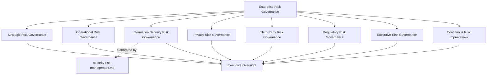
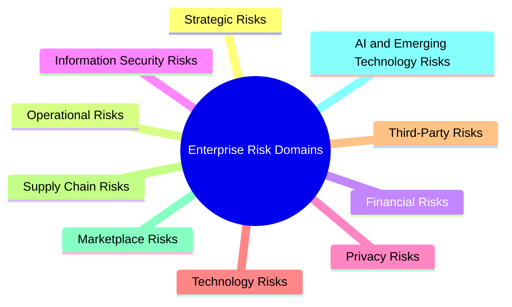
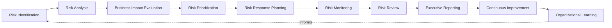
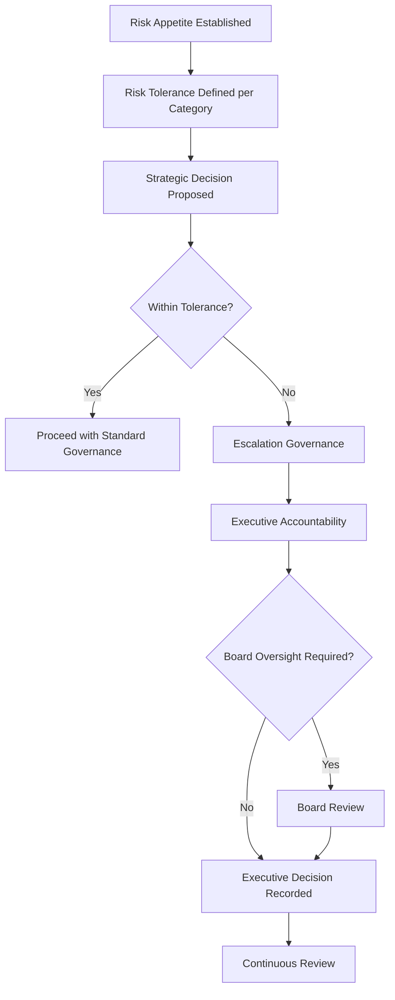
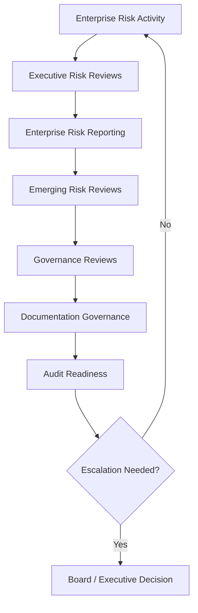
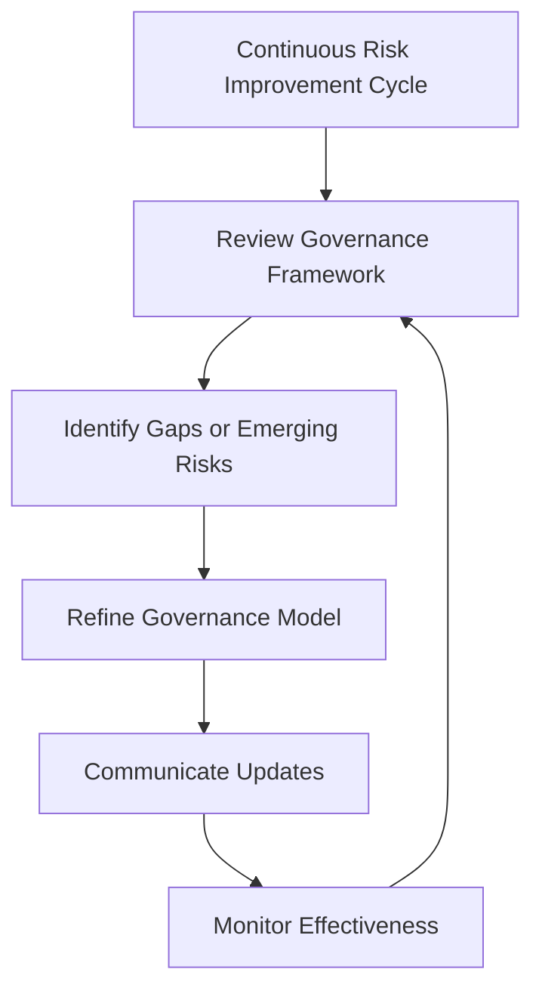

# Enterprise Risk Management (ERM) Strategy

## 1. Document Purpose

This document establishes the enterprise-wide risk management strategy for StackLeo Tech Store — the governance layer under which every category of business risk, including but not limited to security risk, is identified, evaluated, treated, and overseen. It sits above the specialized risk disciplines defined elsewhere in this repository, providing the shared philosophy, appetite, and executive accountability structure they operate within.

- **Purpose of Enterprise Risk Management** — to ensure every category of risk StackLeo carries — strategic, operational, financial, technological, and beyond — is understood and decided upon deliberately by accountable people, weighed consistently against the business's stated risk appetite.
- **Relationship with Compliance Governance** — `compliance.md` governs how regulatory and contractual obligations are tracked and satisfied; this document ensures compliance risk is weighed within the same enterprise risk visibility as every other risk category, rather than assessed in isolation.
- **Relationship with Regulatory Compliance** — regulatory risk, tracked operationally within `compliance.md`, is one of the risk domains this document's governance model and appetite framework apply to (Section 4).
- **Relationship with Information Security** — `security-risk-management.md` is the ISO 31000/27005-aligned elaboration of this document's principles specifically for security and cyber risk. This document does not restate that lifecycle; it establishes the enterprise-wide appetite, governance layers, and domains that security risk management, alongside every other risk discipline, rolls up into.
- **Relationship with Corporate Governance** — enterprise risk management is a core function of corporate governance, providing the risk visibility the organization's governance structures depend on to direct and control the business responsibly.
- **Relationship with Business Continuity** — risk management identifies and evaluates the disruptive events business continuity practice, defined in `09_OPERATIONS/business-continuity.md`, prepares the organization to withstand and recover from.
- **Relationship with Enterprise Strategy** — risk-informed decision-making is embedded directly into strategic planning, ensuring growth decisions — new markets, new business models — are pursued with risk knowingly and deliberately managed, not blindly accepted or reflexively avoided.

This document is implementation-independent and vendor-neutral. It defines enterprise risk philosophy, governance model, domains, lifecycle, and appetite conceptually — not risk scoring formulas, quantitative models, GRC platforms, or specific implementation methodologies.

## 2. Enterprise Risk Philosophy

| Principle | Business Value |
|---|---|
| **Risk as a Strategic Business Consideration** | Treating risk as integral to strategic decision-making, not a separate compliance exercise, ensures growth decisions genuinely account for what could go wrong. |
| **Risk-Informed Decision Making** | Weighing risk explicitly in business decisions produces choices the organization can defend and stand behind, rather than decisions made in unexamined optimism. |
| **Risk Ownership** | Assigning clear ownership for each risk ensures every category of exposure has a responsible party accountable for its evaluation and treatment. |
| **Organizational Accountability** | Embedding risk accountability across the organization, not solely within a centralized risk function, ensures risk is genuinely owned by the people closest to it. |
| **Risk Transparency** | Making risk status visible to those who depend on it prevents decision-makers from being surprised by exposure that was known but never communicated. |
| **Governance by Design** | Building risk governance into how the organization operates from the outset, rather than retrofitting it after a failure, keeps the organization consistently in control. |
| **Enterprise Resilience** | Accepting that some risks will eventually materialize and investing in the organization's capacity to absorb and recover from them balances prevention with genuine preparedness. |
| **Continuous Improvement** | Treating risk management as an evolving discipline keeps it aligned with a growing, changing business and an evolving risk landscape. |

## 3. Enterprise Risk Governance Model

### Enterprise Risk Governance Matrix

| Governance Layer | Purpose | Governance Scope | Business Value | Executive Expectations |
|---|---|---|---|---|
| **Strategic Risk Governance** | Governs risk arising from significant business direction and strategic decisions. | Risks connected to new markets, new business models, and major strategic commitments. | Ensures strategic decisions are made with risk consequence genuinely in view. | Expect strategic risk to be evaluated before, not after, a significant commitment is made. |
| **Operational Risk Governance** | Governs risk arising from day-to-day business operation. | Risk accumulated through ordinary operational practice across functions. | Protects against the everyday risk that unexamined operational practice can introduce. | Expect operational risk to be visible through routine reporting. |
| **Information Security Risk Governance** | Governs the enterprise's relationship to the specialized security and cyber risk discipline. | Coordination with `security-risk-management.md`, ensuring cyber risk is consolidated into enterprise visibility. | Ensures security risk is weighed alongside every other business risk category, not managed in isolation. | Expect security risk exposure to be represented in enterprise-level risk reporting. |
| **Privacy Risk Governance** | Governs the enterprise's relationship to privacy-related risk. | Coordination with `privacy.md` and the privacy risk dimension of `data-protection.md`. | Ensures privacy risk receives enterprise-level visibility alongside other risk categories. | Expect privacy risk exposure to be represented in enterprise-level risk reporting. |
| **Third-Party Risk Governance** | Governs risk arising from external dependencies — vendors, partners, and marketplace participants. | Risk introduced by reliance on parties outside the organization's direct control. | Protects the business from disruption or exposure it does not directly cause but remains responsible for managing. | Expect third-party risk to be evaluated before onboarding a new dependency. |
| **Regulatory Risk Governance** | Governs the enterprise's relationship to regulatory and compliance risk. | Coordination with `compliance.md`, ensuring compliance risk is part of enterprise risk visibility. | Protects the organization's license to operate in current and future markets. | Expect regulatory risk to be evaluated proactively ahead of market expansion. |
| **Executive Risk Governance** | Governs the executive-level accountability and reporting structure for enterprise risk. | Executive reporting, review cadence, and ultimate risk accountability. | Keeps risk a visible, actively managed board- and executive-level concern. | Expect regular, substantive enterprise risk reporting at the executive level. |
| **Continuous Risk Improvement** | Governs how the enterprise risk governance framework itself evolves over time. | Governance review cadence, lessons learned, and framework refinement. | Keeps risk governance relevant as the business and risk landscape evolve. | Expect periodic evidence that the framework itself is being actively improved. |

*Diagram 1: Enterprise Risk Governance Framework.*

## 4. Enterprise Risk Domains

### Enterprise Risk Domain Matrix

| Domain | Purpose | Governance Scope | Business Importance | Executive Expectations |
|---|---|---|---|---|
| **Strategic Risks** | Captures risk from significant business direction and major commitments. | New markets, new business models, significant strategic decisions. | Connects risk directly to decisions most consequential to the business's future. | Expect strategic risk evaluated before major commitments are made. |
| **Operational Risks** | Captures risk from day-to-day operational practice. | Ordinary business operation across functions. | Protects against accumulated, everyday operational exposure. | Expect operational risk visible through routine reporting. |
| **Financial Risks** | Captures risk to financial integrity, revenue, and fiscal stability. | Financial planning, transaction processing, and reporting. | Directly affects the organization's financial health and stakeholder trust. | Expect financial risk to receive the highest governance rigor. |
| **Information Security Risks** | Captures cyber and information security risk. | Elaborated in full by `security-risk-management.md`. | Protects the platform and data StackLeo's business depends on. | Expect this domain's detail to be found in the dedicated security risk framework. |
| **Privacy Risks** | Captures risk that data is used in a way individuals would not reasonably expect. | Coordinated with `privacy.md`. | Protects customer and workforce trust alongside regulatory standing. | Expect privacy risk evaluated whenever new data use is introduced. |
| **Technology Risks** | Captures risk from the platform's technical foundation and its evolution. | Coordinated with `security-architecture.md`. | Protects the structural foundation every other domain depends on. | Expect technology risk evaluated as architecture evolves. |
| **Third-Party Risks** | Captures risk from vendors, partners, and service providers. | External dependencies not under the organization's direct control. | Protects the business from disruption it does not directly cause but remains responsible for. | Expect third-party risk evaluated before onboarding a new dependency. |
| **Supply Chain Risks** | Captures risk from the sourcing and product supply chain underlying the retail business. | Sourcing, vendor reliability, and product availability. | Protects continuity of the core retail and marketplace proposition. | Expect supply chain risk visibility proportionate to its business criticality. |
| **Marketplace Risks** | Captures risk specific to the multi-vendor marketplace model. | Seller onboarding, cross-tenant exposure, and marketplace trust. | Protects the credibility and safety of the marketplace as it scales. | Expect marketplace risk to be addressed proactively as the marketplace launches. |
| **AI & Emerging Technology Risks** | Captures risk from AI-assisted capability and other emerging technology adoption. | Risk introduced by automated or AI-assisted decision-making. | Increasingly significant as AI capability grows within the business. | Expect proactive governance attention to this domain rather than retroactive correction. |

*Diagram: Enterprise Risk Domain Overview.*

## 5. Enterprise Risk Lifecycle

### Enterprise Risk Lifecycle Matrix

| Stage | Purpose | Governance Objectives | Business Value |
|---|---|---|---|
| **Risk Identification** | Recognizes specific risks the enterprise genuinely faces across all domains. | Draw on multiple sources — strategic planning, operations, audits, incidents — not a single narrow input. | Surfaces risk before it materializes into a genuine business impact. |
| **Risk Analysis** | Understands the nature, source, and potential consequence of each identified risk. | Document analysis with sufficient detail to support a defensible evaluation. | Converts raw, identified risk into genuine, actionable understanding. |
| **Business Impact Evaluation** | Assesses the genuine business consequence a risk would carry if it materialized. | Weigh consequence in terms of real business impact, not abstract severity. | Ensures risk priority reflects what the business actually stands to lose. |
| **Risk Prioritization** | Determines which risks warrant the most immediate governance attention. | Prioritize proportionate to evaluated business impact and likelihood. | Focuses limited organizational attention where it matters most. |
| **Risk Response Planning** | Determines the approach for addressing each prioritized risk. | Select a response proportionate to the risk's significance. | Converts risk understanding into concrete, actionable decisions. |
| **Risk Monitoring** | Observes whether treated and accepted risks evolve over time. | Sustain awareness on an ongoing basis, not a single point-in-time assessment. | Keeps risk understanding current as conditions change. |
| **Risk Review** | Formally reassesses whether a risk's evaluation and response remain appropriate. | Review on a defined cadence and whenever material change occurs. | Prevents stale risk decisions from persisting unexamined. |
| **Executive Reporting** | Communicates enterprise risk posture to executive leadership and, where appropriate, the board. | Provide regular, substantive reporting proportionate to risk significance. | Ensures leadership is never surprised by known, uncommunicated risk. |
| **Continuous Improvement** | Feeds lessons learned back into risk management practice itself. | Track improvement actions to completion. | Ensures risk management effectiveness compounds over time. |
| **Organizational Learning** | Captures institutional knowledge from risk outcomes across the enterprise. | Ensure lessons from one domain inform practice in others. | Prevents the same risk failure from recurring in a different part of the business. |

*Diagram 2: Enterprise Risk Lifecycle.*

## 6. Risk Governance Principles

### Risk Governance Principles Matrix

| Principle | Explanation |
|---|---|
| **Accountability** | Every identified risk has a named owner responsible for its evaluation, treatment, and review. |
| **Transparency** | Risk status and treatment decisions are visible to stakeholders who depend on them. |
| **Traceability** | Every risk traces to its identification source, and every response traces to the risk it addresses. |
| **Business Alignment** | Risk decisions are evaluated by genuine business consequence, not abstract severity. |
| **Risk Ownership** | Ownership sits with the function or role closest to the risk, not solely a centralized risk office. |
| **Resilience** | Risk management accepts that some risks will materialize and invests in the organization's capacity to recover. |
| **Continuous Monitoring** | Risk understanding is sustained on an ongoing basis, not confirmed once and assumed permanent. |
| **Continuous Improvement** | Risk governance practice itself is periodically reassessed and refined. |

## 7. Risk Appetite & Tolerance Governance

### Risk Appetite & Tolerance Governance Matrix

| Governance Element | Governance Objective | Business Value |
|---|---|---|
| **Risk Appetite** | Establish the general level and nature of risk the organization is willing to pursue in service of its objectives. | Provides a consistent reference point for evaluating whether a risk is broadly acceptable. |
| **Risk Tolerance** | Establish the acceptable variation around risk appetite for specific risk categories. | Allows nuanced governance without requiring a rigid, one-size-fits-all threshold. |
| **Strategic Decision Alignment** | Ensure major strategic decisions are evaluated against stated risk appetite. | Keeps growth ambition and risk tolerance genuinely aligned rather than implicitly contradictory. |
| **Business Trade-Offs** | Recognize that pursuing business opportunity inherently involves accepting some risk. | Enables confident pursuit of opportunity rather than reflexive risk avoidance. |
| **Escalation Governance** | Define how risks exceeding tolerance are escalated for decision. | Ensures risks outside acceptable bounds receive timely, appropriate attention. |
| **Executive Accountability** | Ensure executive leadership owns decisions that test the boundary of stated appetite. | Provides clear ownership for the organization's most consequential risk trade-offs. |
| **Board Oversight** | Ensure the board maintains visibility into overall risk appetite and material exceptions. | Establishes risk appetite as a genuine governance-level concern. |
| **Continuous Review** | Reassess risk appetite and tolerance periodically as the business evolves. | Keeps appetite and tolerance aligned with the organization's actual capacity and ambition. |

This section addresses risk appetite and tolerance from a governance-objective perspective; specific quantitative thresholds and scoring models are intentionally outside this document's scope.

*Diagram 3: Risk Appetite & Governance Model.*

## 8. Executive Oversight

### Executive Oversight Matrix

| Oversight Activity | Purpose |
|---|---|
| **Executive Risk Reviews** | Confirm the overall enterprise risk governance framework remains coherent and effective. |
| **Enterprise Risk Reporting** | Provide leadership with visibility into the state of enterprise-wide risk exposure. |
| **Emerging Risk Reviews** | Assess newly identified or evolving risk categories relevant to the business. |
| **Governance Reviews** | Confirm risk governance remains aligned with the broader enterprise governance model. |
| **Documentation Governance** | Confirm risk governance documentation remains current and accurate. |
| **Audit Readiness** | Confirm the organization is prepared to demonstrate its risk governance on request. |

*Diagram 4: Enterprise Risk Decision Flow.*

## 9. Future Readiness

| Future Direction | Readiness Consideration |
|---|---|
| **AI Risks** | Extends risk governance to AI-assisted capability as a distinct, actively monitored risk domain. |
| **Cyber Threat Evolution** | Coordinated with `security-risk-management.md`'s Emerging Cyber Risks, ensuring enterprise visibility keeps pace with the evolving threat landscape. |
| **Global Expansion** | Strategic and Regulatory Risk Governance extend to evaluate new markets as StackLeo expands regionally and globally. |
| **Multi-Tenant Platforms** | Marketplace and Third-Party Risk domains extend to cover cross-tenant exposure as the marketplace scales. |
| **Digital Transformation** | Technology Risk domain absorbs risk introduced by continued digital capability growth without requiring framework redesign. |
| **Supply Chain Evolution** | Supply Chain Risk domain extends as sourcing and vendor relationships grow in number and complexity. |
| **Enterprise Scale** | Ensures the governance framework remains coherent as risk volume and diversity grow substantially. |
| **Emerging Risk Landscape** | Continuous Risk Improvement ensures the framework itself adapts as new categories of risk emerge. |

## 10. Enterprise Risk Management Maturity Model

### Enterprise Risk Management Maturity Model Matrix

| Level | Characteristics |
|---|---|
| **Initial** | Risk management is informal and reactive; risks are addressed individually as they surface, with no consistent enterprise-wide process. |
| **Managed** | Basic risk practice exists for individual domains, but consistency across domains and functions varies significantly. |
| **Defined** | A documented, organization-wide enterprise risk management framework exists and is consistently applied across all risk domains. |
| **Measured** | Risk exposure and treatment effectiveness are actively monitored, with visibility into risk posture and appetite alignment. |
| **Optimizing** | Enterprise risk management is continuously refined based on organizational learning, emerging risk, and business growth. |

*Diagram 6: Enterprise Risk Management Maturity Progression Model.*

## 11. Anti-Patterns

### Anti-Pattern Summary

| Anti-Pattern | Why It Is Avoided |
|---|---|
| **Reactive Risk Management** | Addressing risk only after it has materialized forfeits the far cheaper option of managing it proactively. |
| **Unknown Risk Ownership** | A risk without a named owner has no one specifically responsible for its evaluation or treatment. |
| **Siloed Risk Management** | Managing risk domains in isolation prevents the organization from seeing its true, aggregate risk exposure. |
| **Weak Executive Visibility** | Without genuine visibility, leadership cannot make informed decisions about the organization's most consequential risk. |
| **Compliance Without Risk Context** | Treating compliance as a substitute for genuine risk understanding misses risk that regulation does not explicitly address. |
| **Poor Documentation** | Undocumented risk decisions cannot be defended, audited, or consistently applied. |
| **Ignoring Emerging Risks** | Focusing only on historically known risk categories leaves the organization blind to genuinely new sources of exposure. |
| **Missing Continuous Improvement** | A static risk framework falls out of alignment with a growing, evolving business and risk landscape. |

## 12. Document Information

| Property | Value |
|----------|-------|
| Document | risk-management.md |
| Version | 1.0.0 |
| Status | Active |
| Maintained By | StackLeo |
| Last Updated | 2026-07-27 |

---

### Governance Responsibility Matrix

| Role | Responsibility |
|---|---|
| Board / Executive Leadership | Owns overall risk appetite, ratifies material risk acceptance, and provides ultimate risk oversight. |
| Chief Risk Officer (CRO) function | Owns coherence and currency of this enterprise risk framework across all domains. |
| CISO | Owns `security-risk-management.md` as the elaboration of this framework for security and cyber risk. |
| Domain / Risk Owners | Own individual identified risks within their domain through evaluation, treatment, and review. |
| Compliance & Risk Functions | Coordinate Regulatory Risk Governance with `compliance.md`. |
| Internal Audit / Independent Assurance | Independently verifies that risk records reflect actual, decided practice. |

*Diagram 5: Continuous Risk Improvement Cycle.*

© StackLeo. All Rights Reserved.
