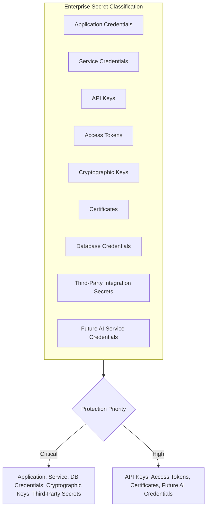
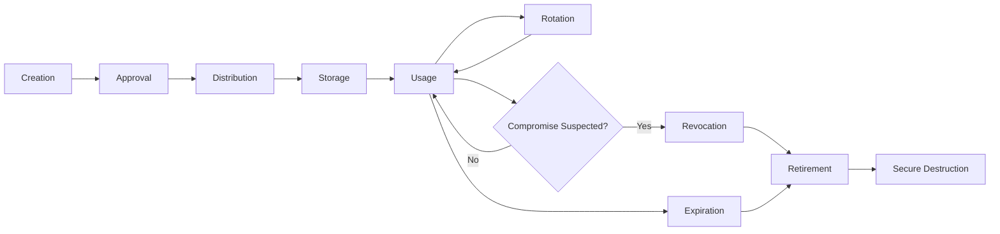
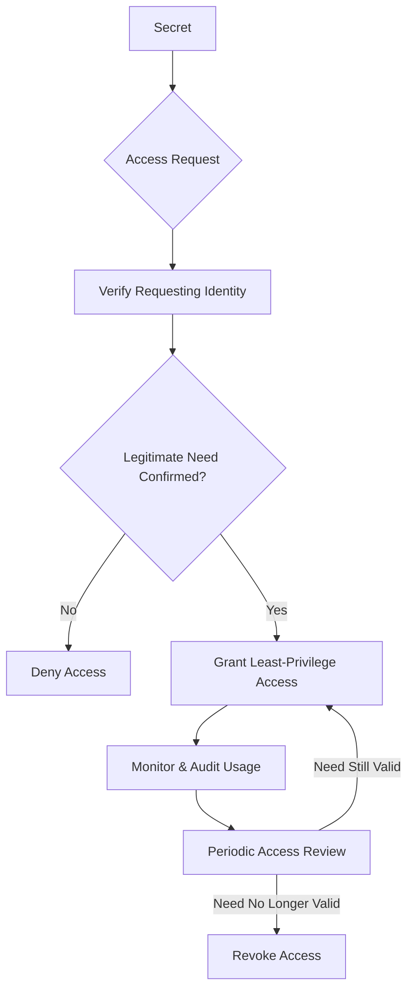
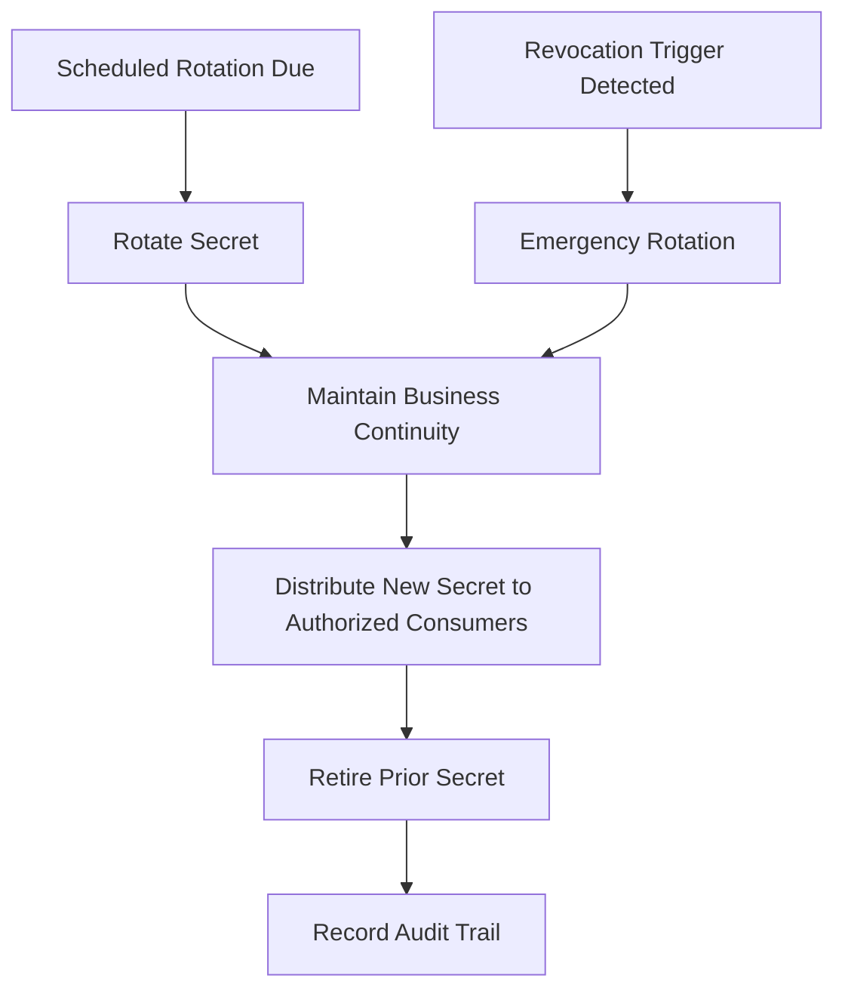
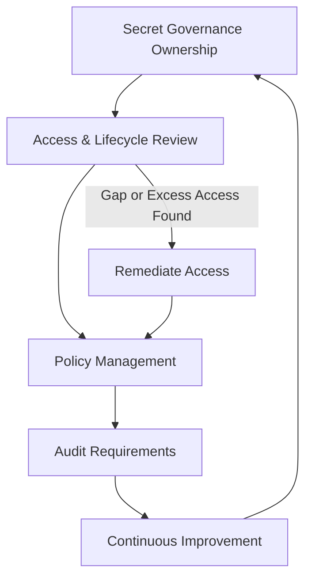

# Secrets Management

## 1. Document Purpose

This document defines the official Enterprise Secrets Management Strategy for **StackLeo Tech Store**. It establishes how sensitive secrets — credentials, keys, tokens, and similar operational material — are protected and governed throughout their lifecycle.

- **Purpose of Secrets Management** — to ensure that the material used to authenticate systems and services to one another is itself protected at least as rigorously as the data and capability it guards.
- **Relationship with Enterprise Security** — this document elaborates a cross-cutting concern spanning Identity Security and Infrastructure Security, the domains defined in `security-architecture.md` (Sections 3.1, 3.4), since secrets underpin both.
- **Relationship with Identity Management** — secrets are, in effect, the credentials of Service and Machine Identities defined in `identity-management.md` (Section 8); this document applies the same lifecycle discipline to that identity category's credentials specifically.
- **Relationship with Encryption** — secrets management and `encryption.md` are interdependent: secrets are protected using cryptographic techniques, and cryptographic keys are themselves one of the secret categories governed by this document (Section 3).
- **Relationship with Operational Resilience** — poorly managed secrets are a recurring source of operational incidents; disciplined secrets management is a precondition for the operational resilience described in `security-principles.md` (Section 9).

This document is implementation-independent and vendor-neutral. It defines secrets management philosophy, categories, and governance — not specific products, environment variable names, credentials, or configuration examples.

## 2. Secrets Management Philosophy

- **Least Exposure** — a secret is visible to, and held by, the fewest possible systems and identities necessary for its purpose.
- **Need-to-Know** — access to a given secret is granted only to identities with a specific, legitimate operational need for it, consistent with `security-principles.md` (Section 3.2).
- **Zero Trust** — no system is trusted with a secret based on its location or prior access alone; access to secrets is verified explicitly, consistent with `security-architecture.md` (Section 2).
- **Defense in Depth** — protection of secrets relies on multiple independent safeguards (access control, encryption, monitoring), so no single control failure exposes a secret.
- **Operational Security** — secrets management is treated as an ongoing operational discipline, not a one-time setup activity, consistent with `security-principles.md` (Section 9).
- **Continuous Governance** — the population of active secrets, and who or what can access them, is continuously governed rather than assumed stable once established.

## 3. Secret Categories

| Category | Business Importance | Protection Priority | Typical Usage Context |
|---|---|---|---|
| Application Credentials | Enables the platform's own components to authenticate to one another. | Critical | Internal service-to-service communication. |
| Service Credentials | Represents the identity of a specific internal service, per `identity-management.md` (Section 8). | Critical | Attribution and access for automated internal processes. |
| API Keys | Enables identification of API consumers, per `api-security.md`. | High | Internal and future external API consumption. |
| Access Tokens | Represents a bounded, often time-limited grant of access following authentication. | High | Session and service authorization following `authentication.md`. |
| Cryptographic Keys | Protects data confidentiality and integrity, per `encryption.md`. | Critical | Encryption, signing, and verification operations. |
| Certificates | Establishes verifiable identity and trust for secure communication, per `encryption.md` (Section 6). | High | Secure communication between components and with external parties. |
| Database Credentials | Enables access to the platform's authoritative data stores. | Critical | Backend service access to persisted business data. |
| Third-Party Integration Secrets | Enables trusted communication with payment, courier, and communication providers. | Critical | External integration boundaries, per `security-architecture.md` (Section 4). |
| Future AI Service Credentials | Will enable AI-assisted capability to access necessary data and services. | High (Future) | AI Agent Identity operation, per `identity-management.md` (Section 8). |

### Secret Category Matrix

| Category | Primary Risk if Exposed | Governing Identity Category |
|---|---|---|
| Application Credentials | Unauthorized internal service impersonation | Service Identity |
| Service Credentials | Unattributed or malicious automated action | Service Identity, Machine Identity |
| API Keys | Unauthorized or unattributed API consumption | Service Identity, external Partner/Vendor identities |
| Access Tokens | Unauthorized session or scoped access | Any authenticated identity category |
| Cryptographic Keys | Loss of confidentiality or integrity of protected data | Key Governance Owner (`encryption.md`, Section 9) |
| Certificates | Impersonation of a trusted party in communication | Service Identity, Machine Identity |
| Database Credentials | Broad unauthorized access to business and customer data | Service Identity |
| Third-Party Integration Secrets | Compromise of trust extended to or from a partner | Partner Identity |
| Future AI Service Credentials | Unbounded or unattributed AI action | AI Agent Identity (Future) |

*Diagram 2: Enterprise Secret Classification.*

## 4. Secret Lifecycle

Every secret, regardless of category, moves through a conceptually consistent lifecycle:

- **Creation** — a secret is generated in response to a specific, legitimate operational need.
- **Approval** — creation of a secret, particularly for Critical-priority categories, requires deliberate approval from an accountable owner.
- **Distribution** — the secret is made available only to the specific systems or identities that require it, consistent with Least Exposure.
- **Storage** — the secret is held in a manner protecting its confidentiality at least as strongly as the data or access it guards.
- **Usage** — the secret is used only for its defined purpose, with usage subject to monitoring consistent with `security-principles.md` (Section 9).
- **Rotation** — the secret is replaced periodically or proactively, limiting its useful lifespan (Section 7).
- **Revocation** — the secret is invalidated immediately upon suspected compromise, independent of its normal rotation schedule.
- **Expiration** — secrets with an inherently time-bound purpose cease to be valid automatically once that period ends.
- **Retirement** — a secret no longer needed is formally retired, ensuring no dependent system continues to rely on it.
- **Secure Destruction** — remnants of a retired secret are removed in a manner consistent with its sensitivity, leaving no recoverable trace.

*Diagram 1: Secret Lifecycle.*

### Secret Lifecycle Summary

| Stage | Trigger | Primary Concern |
|---|---|---|
| Creation | Legitimate operational need arises. | Ensuring the request for a new secret is itself legitimate. |
| Approval | Creation of a Critical-priority secret. | Preventing unauthorized or unnecessary secret proliferation. |
| Distribution | Secret must reach an authorized consumer. | Minimizing exposure during transfer to the point of use. |
| Storage | Secret exists at rest between uses. | Protecting confidentiality at least as strongly as guarded access. |
| Usage | Secret is actively used for its defined purpose. | Detecting use inconsistent with the secret's intended purpose. |
| Rotation | Scheduled interval or proactive decision. | Limiting the useful lifespan of any single secret. |
| Revocation | Suspected compromise. | Ensuring revocation takes effect immediately and completely. |
| Expiration | Time-bound purpose concludes. | Ensuring expiry is enforced automatically, not manually tracked. |
| Retirement | Secret's purpose has permanently ended. | Ensuring no dependent system continues to rely on it. |
| Secure Destruction | Retirement is complete. | Leaving no recoverable trace of the retired secret. |

## 5. Secret Protection Principles

- **Confidentiality** — a secret is disclosed only to the specific systems or identities with a legitimate, verified need for it.
- **Access Restriction** — access to any given secret is limited to the smallest practical set of identities, consistent with Least Exposure (Section 2).
- **Least Privilege** — an identity granted access to a secret is granted access only to that specific secret, not a broader category of secrets it does not require.
- **Segregation of Duties** — no single individual holds unilateral control over the full lifecycle of a Critical-priority secret, consistent with `security-principles.md` (Section 3.8).
- **Auditability** — access to and lifecycle events affecting a secret are recorded, consistent with `security-principles.md` (Section 9).
- **Controlled Distribution** — a secret is never transferred through an uncontrolled or informal channel; distribution follows a defined, accountable process.

### Protection Principle Matrix

| Principle | What It Prevents |
|---|---|
| Confidentiality | Disclosure to parties without legitimate need |
| Access Restriction | Overly broad reachability of a given secret |
| Least Privilege | Access to secrets beyond an identity's specific requirement |
| Segregation of Duties | Unilateral control over a Critical secret's full lifecycle |
| Auditability | Undetected or unattributed access and lifecycle events |
| Controlled Distribution | Exposure during informal or uncontrolled transfer |

*Diagram 5: Secret Access Control Model.*

## 6. Operational Considerations

- **Development Environments** — secrets used in development contexts are treated as distinct from production secrets, preventing a lower-assurance environment from exposing production-grade access.
- **Testing Environments** — testing relies on secrets scoped specifically to testing purposes, avoiding the use of live production secrets in non-production contexts.
- **Production Environments** — production secrets receive the highest level of protection and the narrowest population of authorized access, consistent with `security-architecture.md` (Section 3, Environment Protection).
- **CI/CD Awareness (Conceptual)** — automated build and deployment pipelines are recognized as a point where secrets may be introduced into a running system, warranting the same access and audit discipline as any other secret consumer.
- **Service-to-Service Communication** — secrets enabling one internal service to authenticate to another follow the same lifecycle and protection principles as any other Critical-priority secret.
- **Automation Systems** — infrastructure and business process automation are attributed to specific Machine Identities and associated secrets, per `identity-management.md` (Section 8), so their access remains attributable.

## 7. Rotation & Revocation

- **Rotation Awareness** — every secret has an expected useful lifespan, beyond which continued use is treated as a growing, unmanaged risk.
- **Scheduled Rotation** — secrets are rotated on a defined cadence proportionate to their sensitivity, rather than persisting unchanged indefinitely.
- **Emergency Rotation** — a secret suspected of compromise is rotated immediately, independent of its scheduled cadence.
- **Revocation Triggers** — role change, offboarding, suspected compromise, or the end of a legitimate business relationship each independently trigger revocation consideration.
- **Business Continuity During Rotation** — rotation is designed so that legitimate access is not unduly disrupted during the transition from an old secret to its replacement.

*Diagram 4: Rotation & Revocation Workflow.*

### Rotation & Revocation Matrix

| Trigger | Rotation Type | Business Continuity Consideration |
|---|---|---|
| Scheduled interval elapsed | Scheduled Rotation | Coordinated transition minimizes disruption to dependent systems. |
| Suspected compromise | Emergency Rotation | Immediate action prioritized over continuity; brief disruption accepted if necessary. |
| Role change or offboarding | Revocation | Access removed promptly upon change in legitimate need. |
| End of business relationship | Revocation | Third-party or partner secrets retired in coordination with relationship closure. |

## 8. Future Readiness

This strategy is deliberately structured to remain valid as StackLeo's platform architecture evolves:

- **Microservices** — as decomposition into independently deployable services increases (per `03_System_Design/architecture-principles.md`, ARCH-041), the number of Service Credentials grows; this strategy's category-based, lifecycle-driven approach scales without redefinition.
- **Multi-Cloud** — secrets management principles remain independent of any specific infrastructure provider, supporting the multi-cloud posture referenced in `security-principles.md` (Section 10).
- **Public APIs** — API Keys and Access Tokens (Section 3) extend naturally to external, third-party API consumers as public APIs are introduced per `05_API/api-strategy.md`.
- **Marketplace Integrations** — Third-Party Integration Secrets are already anticipated to extend to future Marketplace Vendors, consistent with `identity-management.md` (Section 9).
- **AI Services** — Future AI Service Credentials (Section 3) ensure AI-assisted capability's access remains attributable and governed as it is introduced.
- **Enterprise Customers** — corporate and wholesale customers bring heightened assurance expectations around credential handling that this lifecycle-and-governance model is structured to satisfy.
- **Global Expansion** — secret category and lifecycle principles remain jurisdiction-agnostic, allowing region-specific obligations to layer on without redefinition.

## 9. Governance

- **Secret Ownership** — every secret category (Section 3) has a designated accountable owner responsible for its lifecycle integrity.
- **Review Process** — active secrets and their access population are periodically reviewed to confirm continued legitimacy.
- **Access Reviews** — access to Critical-priority secrets is reviewed on a defined cadence, consistent with the Access Governance principles in `authorization.md`.
- **Audit Requirements** — secret lifecycle events (Section 4) are recorded consistently with `security-principles.md` (Section 9).
- **Policy Management** — operational secrets management policies are maintained consistently with this strategy and with `security-governance.md`.
- **Continuous Improvement** — this strategy is expected to mature as the platform's architecture, scale, and secret population grow.

*Diagram 3: Secret Governance Framework.*

### Governance Responsibility Matrix

| Role | Responsibility |
|---|---|
| Security Lead | Owns coherence and enforcement of the secrets management strategy. |
| Secret Category Owners | Own lifecycle integrity for their assigned secret category. |
| Engineering Leads | Apply secret protection principles consistently within their domain. |
| Key Governance Owner | Coordinates cryptographic key handling with `encryption.md` (Section 9). |
| Operations Lead | Ensures rotation and revocation are executed operationally without undue disruption. |
| Internal Audit / Review Function | Independently verifies secrets management practice matches this strategy. |

## 10. Anti-Patterns

| Anti-Pattern | Why It's Avoided |
|---|---|
| Hard-Coded Secrets | Embeds sensitive material in a form that is difficult to rotate, audit, or restrict access to. |
| Shared Credentials | Removes individual or service-level accountability, undermining Auditability (Section 5). |
| Unlimited Secret Lifetime | Contradicts Rotation Awareness (Section 7); extends the useful window of a potentially compromised secret indefinitely. |
| Poor Rotation Practices | Leaves secrets in active use well beyond their appropriate lifespan, increasing cumulative exposure risk. |
| Weak Access Controls | Violates Least Privilege and Access Restriction (Section 5), broadening the population able to reach a given secret. |
| Missing Audit Trails | Prevents detection or investigation of unauthorized secret access, undermining accountability. |
| Poor Ownership | Leaves secret categories without an accountable party, guaranteeing inconsistent governance over time. |
| No Governance | Allows secrets management practice to drift from this strategy with no accountable owner or review mechanism (Section 9). |

## 11. Document Information

| Property | Value |
|----------|-------|
| Document | secrets-management.md |
| Version | 1.0.0 |
| Status | Active |
| Maintained By | StackLeo |
| Last Updated | 2026-07-17 |

---

© StackLeo. All Rights Reserved.
