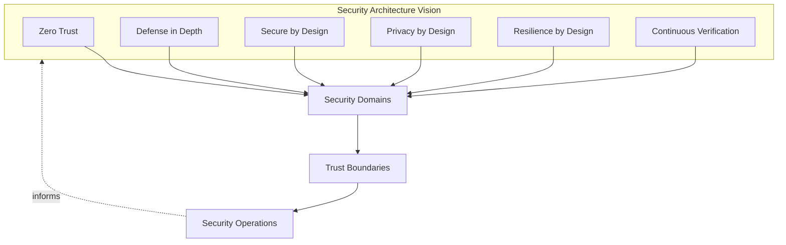
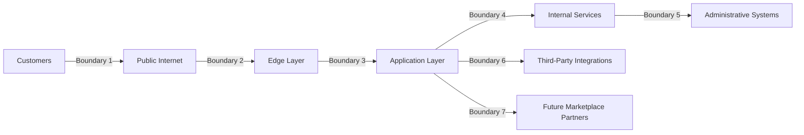
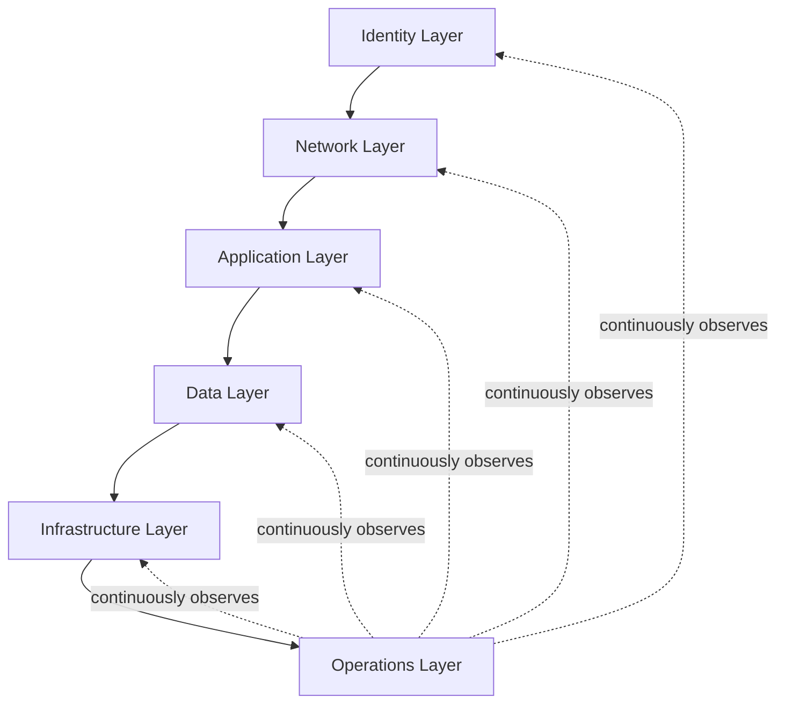
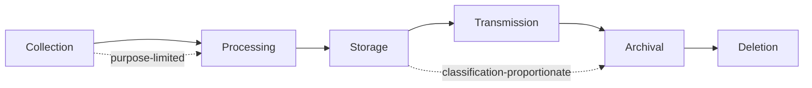
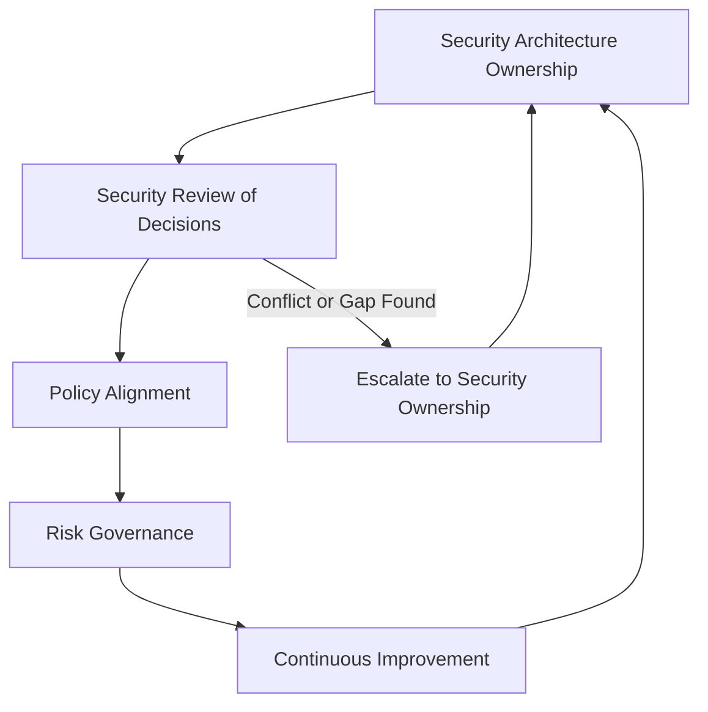

# Security Architecture

## 1. Document Purpose

This document defines the official Enterprise Security Architecture for **StackLeo Tech Store**. It describes how security is structured across the platform — its domains, trust boundaries, protection layers, and long-term evolution — building directly on the philosophy established in `security-principles.md`.

- **Purpose of Security Architecture** — to translate security principle into a coherent structural view: which domains exist, where trust begins and ends, and how protection is layered so that the platform's security posture can be reasoned about as a whole, not as a collection of unrelated controls.
- **Relationship with Enterprise Architecture** — this document is the security-domain elaboration of `03_System_Design/architecture-principles.md` (Section 7) and sits alongside `03_System_Design/component-architecture.md` and `03_System_Design/deployment-architecture.md` as a first-class architectural view of the same system.
- **Relationship with Business Continuity** — security architecture and business continuity are inseparable: the resilience properties described here directly determine how quickly the business can continue serving customers through an adverse event, complementing `03_System_Design/resilience-strategy.md`.
- **Relationship with Customer Trust** — trust is StackLeo's core differentiator, per `01_Business/vision.md`. This architecture exists to make that trust structurally justified, not merely asserted.
- **Relationship with Compliance** — this architecture provides the structural foundation upon which compliance obligations, defined in `01_Business/business-rules.md` (Section 17) and elaborated in `compliance.md`, can be reliably satisfied.

This document is implementation-independent and vendor-neutral. It describes architectural structure and rationale — not specific cloud providers, infrastructure configuration, code, or step-by-step implementation procedures.

## 2. Security Architecture Vision

The security architecture is shaped by six architectural commitments, each elaborated structurally throughout this document:

- **Zero Trust** — no component, request, or actor is trusted by default based on network location or prior context; trust is established explicitly at each meaningful boundary (Section 4).
- **Defense in Depth** — protection is distributed across independent layers spanning identity, network, application, data, infrastructure, and operations, so no single layer's failure compromises the whole (Section 5).
- **Secure by Design** — every architectural domain (Section 3) treats security as a structural property considered from inception, not a constraint applied afterward.
- **Privacy by Design** — data-related architecture defaults to minimum necessary collection, processing, and retention, consistent with `security-principles.md` (Section 6).
- **Resilience by Design** — the architecture assumes eventual failure or compromise of some component and is structured to contain, detect, and recover from it, consistent with Assume Breach (`security-principles.md`, Section 3.7).
- **Continuous Verification** — trust granted at any boundary is re-evaluated over time and across conditions, never treated as permanent once granted.

*Diagram 1: Enterprise Security Architecture Overview — vision commitments shape the security domains, which are bounded by explicit trust boundaries and sustained through continuous operations.*

## 3. Security Domains

The architecture is organized into five domains. Each domain is structurally independent but operates together to form the platform's overall security posture.

### 3.1 Identity Security

- **Purpose** — establish and continuously verify who or what is acting, before any access decision is made.
- **Responsibilities** — identity management (lifecycle of human and system identities), authentication (verifying claimed identity), authorization (scoping what a verified identity may do), and privileged access (heightened control over administrative and high-impact capability).
- **Business Value** — makes every other domain's access decisions meaningful; without trustworthy identity, no authorization decision downstream can be relied upon, per `security-principles.md` (Section 7).

### 3.2 Application Security

- **Purpose** — ensure the platform's software resists misuse and attack across every layer a user or system interacts with.
- **Responsibilities** — frontend security (the customer- and staff-facing experience), backend security (business logic and server-side processing), API security (contracts consumed by channels and external parties), and business logic protection (ensuring workflow rules, such as pricing and order integrity, cannot be circumvented).
- **Business Value** — protects the integrity of the core commerce experience — catalog, cart, checkout, order fulfillment — that directly generates revenue and customer trust.

### 3.3 Data Security

- **Purpose** — protect the confidentiality, integrity, and availability of data across its entire lifecycle.
- **Responsibilities** — data protection (classification-proportionate safeguarding), encryption concepts (protecting data in transit and at rest, conceptually), data lifecycle (from collection through deletion), and privacy (ensuring data is used only as customers would reasonably expect).
- **Business Value** — protects the asset — customer and business data — that both commerce and trust depend on most directly, consistent with `04_Database/data-governance.md`.

### 3.4 Infrastructure Security

- **Purpose** — protect the environment the platform runs in, independent of any single provider or deployment model.
- **Responsibilities** — compute (protection of processing environments), network (protection of communication paths), storage (protection of persisted data at the infrastructure layer), and environment isolation (separation between development, staging, and production).
- **Business Value** — ensures that a weakness in the runtime environment does not become a weakness in the business capability it hosts, supporting the multi-cloud and cloud-portability posture referenced in `security-principles.md` (Section 10).

### 3.5 Operational Security

- **Purpose** — sustain protection while the platform is running, and ensure the organization can respond effectively when protection is tested.
- **Responsibilities** — monitoring (continuous observation of platform state), logging (recording security-relevant activity), incident response (organized detection, containment, and recovery), and recovery (restoring normal operation after disruption).
- **Business Value** — determines how quickly trust can be restored after an adverse event; prevention alone is insufficient without the operational capability to detect and respond, per `security-principles.md` (Section 9).

### Security Domain Matrix

| Domain | Purpose | Key Responsibilities | Business Value |
|---|---|---|---|
| Identity Security | Establish and verify who or what is acting | Identity management, authentication, authorization, privileged access | Makes every downstream access decision trustworthy |
| Application Security | Resist misuse and attack of platform software | Frontend, backend, API, business logic protection | Protects the core revenue-generating commerce experience |
| Data Security | Protect data across its lifecycle | Data protection, encryption concepts, data lifecycle, privacy | Protects the asset trust and commerce depend on most |
| Infrastructure Security | Protect the runtime environment | Compute, network, storage, environment isolation | Prevents environment weaknesses becoming business weaknesses |
| Operational Security | Sustain protection during operation | Monitoring, logging, incident response, recovery | Determines speed of trust restoration after an event |

## 4. Trust Boundaries

A trust boundary marks the point at which the level of trust extended to a request or actor changes, and where verification must therefore occur. StackLeo's architecture recognizes the following conceptual boundaries:

- **Customers ↔ Public Internet** — the point at which an unauthenticated, unverified party first reaches StackLeo's presence.
- **Public Internet ↔ Edge Layer** — the platform's outermost point of control, where traffic is first observed and filtered before reaching application capability.
- **Edge Layer ↔ Application Layer** — the point at which a request begins to be evaluated against business logic and identity.
- **Application Layer ↔ Internal Services** — the boundary between customer-facing capability and the internal services that fulfill it, where inter-service trust must itself be verified, not assumed.
- **Internal Services ↔ Administrative Systems** — the boundary protecting elevated, operationally sensitive capability from routine customer-facing traffic.
- **Application Layer ↔ Third-Party Integrations** — the boundary at which control over data and behavior is shared with an external party (payment, courier, communication providers).
- **Application Layer ↔ Future Marketplace Partners** — the boundary anticipated for future third-party sellers, who will require scoped, verifiable access distinct from both customers and internal staff.

Trust boundaries matter because they are where security architecture becomes concrete: a system with no explicit boundaries has no defined point at which verification is guaranteed to occur, which is the structural precondition for the Zero Trust vision in Section 2.

*Diagram 3: Trust Boundary Model — each arrow marks a point at which trust is re-verified rather than inherited.*

### Trust Boundary Summary

| Boundary | Between | Why Verification Is Required |
|---|---|---|
| Boundary 1 | Customers ↔ Public Internet | The party is entirely unverified until identity is established. |
| Boundary 2 | Public Internet ↔ Edge Layer | The first point where hostile or malformed traffic must be distinguished from legitimate requests. |
| Boundary 3 | Edge Layer ↔ Application Layer | Where identity and business context begin to apply to a request. |
| Boundary 4 | Application Layer ↔ Internal Services | Prevents a compromised customer-facing component from being implicitly trusted internally. |
| Boundary 5 | Internal Services ↔ Administrative Systems | Protects elevated capability from routine operational traffic. |
| Boundary 6 | Application Layer ↔ Third-Party Integrations | Data and control are shared with an external party outside StackLeo's direct governance. |
| Boundary 7 | Application Layer ↔ Future Marketplace Partners | Sellers require scoped access distinct from both customers and staff, with independent verification. |

## 5. Defense in Depth

Protection is deliberately distributed across six independent layers, so that the failure of any single layer does not result in complete compromise:

- **Identity Layer** — verifies who is acting before any other layer is engaged.
- **Network Layer** — controls which communication paths are permitted between components and with the outside world.
- **Application Layer** — enforces business logic integrity and resists misuse of exposed capability.
- **Data Layer** — protects information itself, independent of whichever layer is currently handling it.
- **Infrastructure Layer** — protects the environment all other layers depend on to run.
- **Operations Layer** — observes, detects, and responds across all other layers continuously.

Layering reduces organizational risk because it removes the possibility of a single point of failure: an adversary who defeats the network layer still faces identity verification; one who compromises a single identity still faces authorization scoping and data protection; one who reaches data still faces encryption and classification-based controls. Each additional layer an adversary must defeat disproportionately increases the cost and likelihood of detection, per Assume Breach (`security-principles.md`, Section 3.7).

*Diagram 2: Defense in Depth Layers — the Operations layer continuously observes every other layer rather than acting only after the fact.*

### Defense in Depth Layers

| Layer | Function | Failure Contained By |
|---|---|---|
| Identity Layer | Verifies who is acting | Network, Application, Data layers still require valid authorization |
| Network Layer | Controls permitted communication paths | Identity and Application layers still enforce access decisions |
| Application Layer | Enforces business logic integrity | Data layer still protects information at rest and in transit |
| Data Layer | Protects information itself | Infrastructure layer still isolates and contains exposure |
| Infrastructure Layer | Protects the runtime environment | Operations layer still detects and enables response |
| Operations Layer | Observes, detects, and responds | Governance (Section 10) ensures findings drive systemic improvement |

## 6. Threat Protection Strategy

The architecture conceptually addresses the following classes of risk, without prescribing specific detection or prevention mechanisms:

- **Unauthorized Access** — addressed structurally through identity-centric security and least privilege, ensuring access requires explicit, verified authorization rather than assumed permission.
- **Data Exposure** — addressed through data classification, encryption concepts, and minimization, so that exposure of any single system reveals the least possible sensitive information.
- **Credential Abuse** — addressed through strong identity, continuous verification, and privileged access controls, reducing the value and lifespan of a compromised credential.
- **Insider Threats** — addressed through least privilege, separation of duties, and auditability, so that legitimate access cannot be misused without accountability or detection.
- **Service Abuse** — addressed through authorization scoping and behavioral monitoring at the application and API layers, distinguishing legitimate usage patterns from abuse.
- **Supply Chain Risks** — addressed through deliberate dependency management and trust-boundary treatment of third-party integrations (Section 4), so that a compromised external party does not automatically compromise StackLeo.
- **Distributed System Risks** — addressed through consistent trust-boundary enforcement between internal services, so that decomposition into more services (per `03_System_Design/architecture-principles.md`, ARCH-041) does not silently weaken the security model.

### Threat Protection Matrix

| Threat Class | Primary Architectural Response | Supporting Domain(s) |
|---|---|---|
| Unauthorized Access | Identity-centric security, least privilege | Identity Security |
| Data Exposure | Classification, encryption concepts, minimization | Data Security |
| Credential Abuse | Strong identity, continuous verification | Identity Security |
| Insider Threats | Least privilege, separation of duties, auditability | Identity Security, Operational Security |
| Service Abuse | Authorization scoping, behavioral monitoring | Application Security, Operational Security |
| Supply Chain Risks | Deliberate dependency management, boundary treatment of integrations | Application Security, Infrastructure Security |
| Distributed System Risks | Consistent inter-service trust-boundary enforcement | Infrastructure Security, Identity Security |

## 7. Secure Data Flow

Data protection is applied consistently across the full lifecycle of information moving through the platform:

- **Collection** — data is gathered only for a legitimate, defined purpose, consistent with data minimization (`security-principles.md`, Section 6).
- **Processing** — data is acted upon only by identities and services authorized for that specific purpose, consistent with least privilege and need-to-know.
- **Storage** — data at rest is protected proportionately to its classification, consistent with `04_Database/data-governance.md`.
- **Transmission** — data moving between components, layers, or to third parties is protected against interception or tampering while in transit.
- **Archival** — data retained beyond active use is protected to the same standard as active data, and is retained only as long as a legitimate purpose requires, per `04_Database/data-retention.md`.
- **Deletion** — data is removed in a manner consistent with its classification once retention purpose has ended, treating indefinite retention as a liability rather than a convenience.

*Diagram 4: Secure Data Flow Lifecycle — protection is applied consistently at every stage, not only at storage.*

## 8. Security Operations

- **Continuous Monitoring** — the operational and security state of the platform is observed on an ongoing basis, so deviation from expected behavior can be recognized as it occurs rather than discovered afterward.
- **Logging** — security-relevant and business-critical actions are recorded with sufficient context to support investigation and accountability, consistent with `security-principles.md` (Section 9).
- **Alerting** — significant deviations surfaced by monitoring are routed to the appropriate accountable party promptly enough to enable timely action.
- **Incident Management** — the organization maintains a clear, practiced approach to detecting, containing, communicating about, and recovering from security incidents.
- **Business Continuity** — security operations are designed to preserve the business's ability to keep serving customers through disruption, coordinated with `03_System_Design/resilience-strategy.md`.
- **Disaster Recovery Awareness** — operational teams maintain a shared understanding of how the platform recovers from severe disruption, complementing `04_Database/backup-recovery.md`.

## 9. Future Architecture Readiness

This architecture is deliberately structured to remain valid as the platform's scope and scale grow:

- **Public APIs** — trust-boundary and identity-centric principles (Sections 4, 3.1) extend naturally to external API consumers as capability is exposed per `05_API/api-strategy.md`.
- **AI Features** — AI-assisted capability is treated as an additional system actor, subject to the same identity, authorization, and data-minimization architecture as any other component.
- **Marketplace** — the trust boundary anticipated for Future Marketplace Partners (Section 4) allows seller access to be architected deliberately rather than retrofitted once the marketplace launches.
- **Global Expansion** — domain and boundary definitions remain jurisdiction-agnostic, allowing region-specific obligations to layer on as StackLeo expands from Bangladesh into South Asia and beyond.
- **Multi-Region** — defense in depth and trust-boundary discipline apply consistently regardless of the number or location of regions a component runs in.
- **Event-Driven Systems** — as event-driven interaction matures (per `03_System_Design/event-flows.md`), the same trust-boundary treatment applies to events as to synchronous requests.
- **Microservices** — decomposition toward independently deployable services (per `03_System_Design/architecture-principles.md`, ARCH-041) increases, rather than diminishes, the importance of consistent inter-service trust-boundary enforcement (Section 4, Boundary 4).
- **Enterprise Customers** — corporate and wholesale customers bring heightened assurance expectations that this domain-and-boundary structure is designed to satisfy without architectural rework.

## 10. Security Governance

- **Architecture Ownership** — a designated Security Lead owns the coherence of this document, working alongside the Solution Architect who owns `03_System_Design/architecture-principles.md`, ensuring the two remain consistent.
- **Security Reviews** — architecturally significant decisions affecting any domain in Section 3 are reviewed against this document before adoption, mirroring the review discipline in `03_System_Design/architecture-decisions.md`.
- **Policy Alignment** — operational security policies derived from this architecture are maintained consistently with it, detailed further in `security-governance.md`.
- **Risk Governance** — risks identified against this architecture are assessed and either mitigated or knowingly accepted, following the risk philosophy in `security-principles.md` (Section 5).
- **Continuous Improvement** — this architecture is expected to evolve deliberately as the platform, organization, and threat landscape change, and is reviewed on a defined cadence rather than left static.

*Diagram 5: Security Governance Framework.*

### Governance Responsibility Matrix

| Role | Responsibility |
|---|---|
| Security Lead | Owns coherence and enforcement of this security architecture. |
| Solution Architect | Ensures alignment between this document and `03_System_Design/architecture-principles.md`. |
| Engineering Leads | Apply domain-specific security architecture within their area; raise gaps for review. |
| Operations Lead | Ensures operational security (Section 8) reflects the architecture in practice. |
| Product Manager | Ensures new capability is evaluated against relevant security domains before commitment. |
| Internal Audit / Review Function | Independently verifies that stated architecture is reflected in actual practice. |

## 11. Anti-Patterns

The following structural failures directly undermine this architecture and are explicitly avoided:

| Anti-Pattern | Why It's Avoided |
|---|---|
| Flat Trust Model | Treating all internal traffic as equally trusted removes the trust boundaries (Section 4) that make Zero Trust meaningful. |
| Single Layer Defense | Relying on one control (e.g., network perimeter alone) contradicts Defense in Depth (Section 5) and creates a single point of total failure. |
| Implicit Trust | Assuming a request is legitimate because of its origin or prior context undermines Continuous Verification (Section 2). |
| Weak Identity Controls | Undermines every downstream access decision, since Identity Security (Section 3.1) is foundational to all other domains. |
| Poor Data Protection | Leaves the asset that customer and business trust depend on most directly (Section 3.3) inadequately safeguarded. |
| Missing Monitoring | Removes the ability to detect deviation from expected behavior, undermining Operational Security (Section 3.5) and Assume Breach. |
| Weak Governance | Allows this architecture to drift from actual practice with no accountable owner or review mechanism (Section 10). |
| Security Added Late | Contradicts Secure by Design (Section 2); retrofitted security is consistently costlier and structurally weaker than security considered from inception. |

## 12. Document Information

| Property | Value |
|----------|-------|
| Document | security-architecture.md |
| Version | 1.0.0 |
| Status | Active |
| Maintained By | StackLeo |
| Last Updated | 2026-07-17 |

---

© StackLeo. All Rights Reserved.
