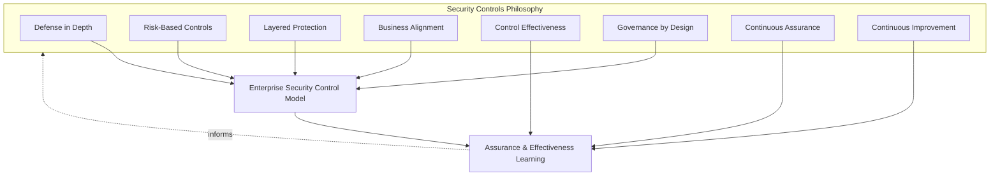
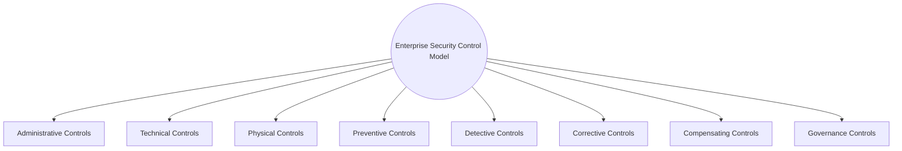
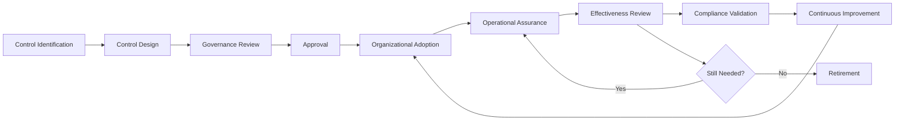
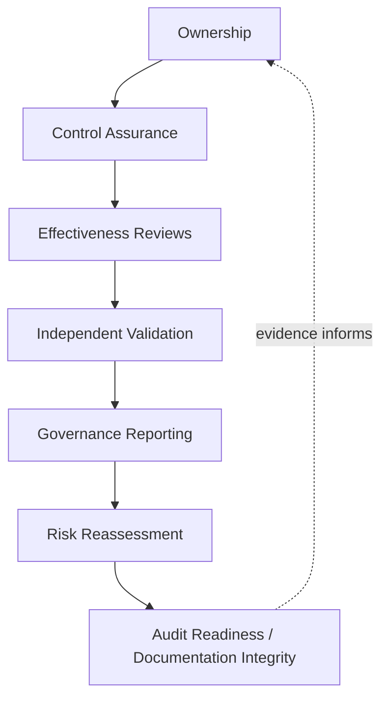
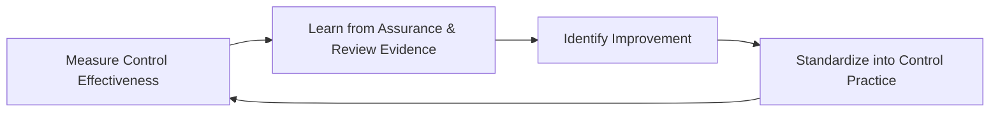
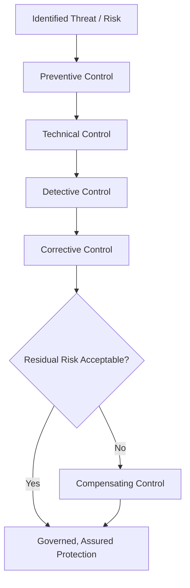
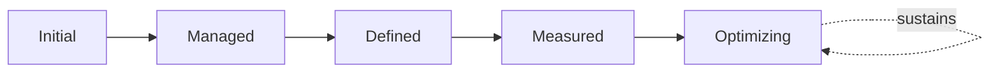

# Enterprise Security Controls Governance Framework

## 1. Document Purpose

This document defines the official Enterprise Security Controls Governance Framework for **StackLeo Tech Store**. It establishes how the specific mechanisms that enforce security policy — administrative, technical, physical, and governance controls — are categorized, governed, and assured across the platform, independent of any specific security product, vendor, or technology.

- **Purpose of Security Controls** — controls exist to convert security policy from a stated expectation into an actual, verifiable safeguard; this document ensures every control has genuine governance behind it, rather than existing as an informal, unverified assumption of protection.
- **Relationship with Security Governance** — this document is the control-specific elaboration of `security-governance.md`; where that document establishes the overarching governance model and domains, this document defines specifically how the concrete mechanisms enforcing them are categorized, designed, and assured.
- **Relationship with Enterprise Internal Controls** — `internal-controls.md` establishes the enterprise-wide, COSO-aligned control governance model this document elaborates for information security controls specifically; strategic, operational, and financial controls outside the security domain are governed there, not here.
- **Relationship with Security Policies** — every control in this framework exists to enforce one or more policies defined in `security-policies.md`; a control without a traceable policy justification, or a policy without any corresponding control, is treated as a governance gap.
- **Relationship with Security Standards** — this framework defines control categories and governance conceptually; the specific, mandatory baseline a control must meet within each domain is defined in `security-standards.md`, ensuring the same control category is implemented to a consistent bar regardless of which team owns it.
- **Relationship with Risk Management** — control selection and rigor are proportionate to genuine risk, consistent with `threat-model.md` and ISO 31000 thinking; controls are not applied uniformly regardless of what they protect.
- **Relationship with Compliance** — this framework's control categories and assurance discipline provide the structural evidence base `compliance.md` depends on to demonstrate regulatory and contractual obligations are genuinely met, not merely asserted.
- **Relationship with Enterprise Architecture** — control placement is coordinated with the trust boundaries and defense layers defined in `security-architecture.md`, ensuring controls are positioned where they structurally matter, not scattered arbitrarily.

This document is implementation-independent and vendor-neutral. It defines control philosophy, categories, lifecycle, and assurance conceptually — not specific security products, vendors, cloud providers, SIEM platforms, EDR platforms, IAM systems, firewalls, implementation procedures, security configurations, technical architectures, cryptographic algorithms, infrastructure settings, or deployment methods.

## 2. Security Controls Philosophy

Security controls at StackLeo are governed by eight principles. Each exists to produce a specific business outcome — controls are governed deliberately because of the genuine protection they must provide, not as compliance artifacts.

### 2.1 Defense in Depth

Protection is distributed across independent, layered controls so that no single control's failure compromises the whole, consistent with `security-architecture.md` (Section 5).

- **Business Value** — ensures a single point of failure in any one control does not become a single point of failure for the entire business.

### 2.2 Risk-Based Controls

Control selection and rigor are proportionate to the genuine business, customer, and financial risk a domain represents, consistent with ISO 31000 thinking.

- **Business Value** — directs finite control investment toward the risks that matter most, rather than spreading effort evenly regardless of consequence.

### 2.3 Layered Protection

Controls are deliberately distributed across administrative, technical, and physical categories (Section 3), so weaknesses in one category are compensated for by strength in another.

- **Business Value** — protects against the common failure mode where an organization over-invests in one control type (typically technical) while neglecting the others.

### 2.4 Business Alignment

Controls exist to enable the business to operate with confidence, consistent with Business Alignment in `security-policies.md` (Section 2.5), not to obstruct legitimate operation with disproportionate friction.

- **Business Value** — keeps controls genuinely followed rather than resented and quietly bypassed as an obstacle to real work.

### 2.5 Control Effectiveness

A control's value is measured by whether it genuinely achieves its protective intent, not merely whether it exists or was implemented as designed.

- **Business Value** — prevents the false confidence of a control that is present but not actually effective against the risk it was meant to address.

### 2.6 Governance by Design

Control governance structures are established deliberately as controls are designed, not retrofitted once a control gap has already been exploited.

- **Business Value** — prevents the costly, high-visibility discovery of control governance gaps only after an incident has already demonstrated their absence.

### 2.7 Continuous Assurance

Confidence that a control remains effective is sustained through ongoing verification (Section 6), not established once at implementation and assumed to persist indefinitely.

- **Business Value** — protects against silent control decay, where a control that once worked quietly stops providing genuine protection as conditions change.

### 2.8 Continuous Improvement

Control governance practice matures over time, informed by real assurance findings, incidents, and the evolving threat landscape.

- **Business Value** — keeps the control framework aligned with StackLeo's growth in scale, architectural complexity, and threat exposure.

*Diagram: Security Controls Philosophy Overview — the eight principles shape the enterprise control model, and assurance and effectiveness learning feed back into the philosophy itself.*

## 3. Enterprise Security Control Model

Controls are organized across eight conceptual categories. A single protective outcome typically depends on multiple categories working together, consistent with Layered Protection (Section 2.3).

### 3.1 Administrative Controls

- **Purpose** — govern security through policy, process, training, and organizational decision-making rather than technical mechanism.
- **Governance Scope** — elaborated through `security-policies.md` and the governance structures in `security-governance.md`.
- **Business Value** — addresses the human and organizational dimension of security that no technical control alone can cover.
- **Executive Expectations** — leadership expects administrative controls to be genuinely followed, not merely documented.

### 3.2 Technical Controls

- **Purpose** — govern security through mechanisms embedded in systems, applications, and infrastructure.
- **Governance Scope** — elaborated through `identity-management.md`, `authentication.md`, `authorization.md`, `encryption.md`, and related domain strategies.
- **Business Value** — provides protection that operates consistently without depending on individual human action in the moment.
- **Executive Expectations** — leadership expects technical controls to be verified effective, not merely present.

### 3.3 Physical Controls

- **Purpose** — govern security of physical access to facilities, devices, and media, relevant as StackLeo's future Physical Store and POS channels are introduced.
- **Governance Scope** — conceptually anticipated here; elaborated fully once dedicated physical security documentation is authored alongside those channels.
- **Business Value** — protects against a category of risk technical and administrative controls alone cannot address.
- **Executive Expectations** — leadership expects physical control planning to begin ahead of, not after, physical channel launch.

### 3.4 Preventive Controls

- **Purpose** — stop an undesired event from occurring in the first place.
- **Governance Scope** — the first line of defense across every domain in `06_Security`, consistent with Security by Design in `security-governance.md` (Section 2.1).
- **Business Value** — is the least expensive point at which to address risk, since prevention avoids the cost of detection and correction entirely.
- **Executive Expectations** — leadership expects preventive controls to be prioritized wherever genuinely feasible.

### 3.5 Detective Controls

- **Purpose** — identify that an undesired event has occurred or is occurring.
- **Governance Scope** — elaborated through `security-monitoring.md` and coordinated with `09_OPERATIONS/monitoring-observability.md`.
- **Business Value** — provides the visibility that makes response possible when prevention alone proves insufficient.
- **Executive Expectations** — leadership expects detection capability proportionate to the criticality of what it protects.

### 3.6 Corrective Controls

- **Purpose** — restore normal, safe operation once an undesired event has been detected.
- **Governance Scope** — elaborated through `incident-response.md` and `vulnerability-management.md`.
- **Business Value** — limits the duration and depth of harm once prevention and detection have both been exercised.
- **Executive Expectations** — leadership expects corrective capability to be exercised and validated, not merely assumed to work when needed.

### 3.7 Compensating Controls

- **Purpose** — provide alternative protection where a standard control cannot be applied as designed.
- **Governance Scope** — governed through Policy Exception Governance in `security-policies.md` (Section 6), since a compensating control typically accompanies a documented exception.
- **Business Value** — allows genuine business constraints to be accommodated without simply accepting unmitigated risk.
- **Executive Expectations** — leadership expects compensating controls to be reviewed with the same rigor as the standard control they replace.

### 3.8 Governance Controls

- **Purpose** — ensure every other control category is itself accountable, reviewed, and sustained.
- **Governance Scope** — this document's own framework, coordinated with `security-governance.md` (Section 3, Enterprise Security Governance Model).
- **Business Value** — prevents the anti-pattern in Section 10.1, where controls exist without any governance accountable for their continued effectiveness.
- **Executive Expectations** — leadership expects governance controls to be the standard every other control category is measured against.

### Enterprise Security Control Categories Matrix

| Category | Purpose | Governance Scope | Business Value |
|---|---|---|---|
| Administrative Controls | Govern security through policy, process, training | Elaborated through `security-policies.md` and `security-governance.md` | Addresses the human/organizational dimension no technical control covers |
| Technical Controls | Govern security through embedded system mechanisms | Elaborated through identity, authentication, encryption strategies | Provides protection independent of individual human action |
| Physical Controls | Govern security of physical access | Anticipated for future Physical Store/POS channels | Protects against risk other control types can't address |
| Preventive Controls | Stop an undesired event from occurring | First line of defense across every domain | Least expensive point to address risk |
| Detective Controls | Identify that an undesired event has occurred | Elaborated through `security-monitoring.md` | Provides visibility making response possible |
| Corrective Controls | Restore normal operation once detected | Elaborated through `incident-response.md`, `vulnerability-management.md` | Limits duration and depth of harm |
| Compensating Controls | Provide alternative protection where standard control can't apply | Governed through Policy Exception Governance | Accommodates genuine constraints without unmitigated risk |
| Governance Controls | Ensure every other category is accountable and sustained | This document's own framework | Prevents controls existing without governance accountability |

*Diagram 1: Enterprise Security Control Model — eight categories, spanning who/how controls are enacted (administrative, technical, physical) and what function they serve (preventive, detective, corrective, compensating), all held accountable by governance controls.*

## 4. Security Control Lifecycle

Security controls are governed across ten conceptual stages, from initial identification through retirement.

### 4.1 Control Identification

- **Purpose** — recognize that a specific control is needed to enforce a policy or address an identified risk.
- **Governance Objectives** — require identification to trace to a specific policy in `security-policies.md` or a risk in `threat-model.md`.
- **Business Value** — ensures control creation is deliberate, not an accumulation of ad hoc mechanisms.

### 4.2 Control Design

- **Purpose** — determine the category (Section 3) and conceptual approach a control will take.
- **Governance Objectives** — require design to consider Defense in Depth and Layered Protection (Sections 2.1, 2.3) rather than relying on a single control alone.
- **Business Value** — produces a control genuinely fit for the risk it addresses, not a generic, one-size-fits-all mechanism.

### 4.3 Governance Review

- **Purpose** — confirm the designed control is consistent with existing controls and genuinely addresses its intended policy or risk.
- **Governance Objectives** — require review by someone other than the control's designer, consistent with independent validation practice used throughout this repository.
- **Business Value** — prevents an unreviewed, potentially redundant or ineffective control from being adopted.

### 4.4 Approval

- **Purpose** — render a deliberate, accountable decision to formally adopt the reviewed control.
- **Governance Objectives** — require approval authority proportionate to the control's risk significance and category (Section 3).
- **Business Value** — converts control adoption into a governed decision point, not a default outcome of design.

### 4.5 Organizational Adoption

- **Purpose** — establish the control as a genuine, operating part of the platform or organization.
- **Governance Objectives** — require affected teams to be explicitly informed and, where relevant, trained on the control's operation.
- **Business Value** — converts an approved design into genuine, functioning protection.

### 4.6 Operational Assurance

- **Purpose** — confirm the adopted control continues to operate as designed during ongoing operation.
- **Governance Objectives** — connect to Control Assurance practice in Section 6, ensuring assurance is continuous, not a one-time check.
- **Business Value** — catches control decay before it becomes an exploitable gap.

### 4.7 Effectiveness Review

- **Purpose** — formally evaluate whether the control genuinely achieves its protective intent, not merely whether it is present.
- **Governance Objectives** — require review to occur on a predictable, regular cadence, consistent with Control Effectiveness (Section 2.5).
- **Business Value** — distinguishes controls providing genuine protection from those offering only the appearance of it.

### 4.8 Compliance Validation

- **Purpose** — confirm the control satisfies applicable regulatory or contractual obligations it was intended to address.
- **Governance Objectives** — coordinate with `compliance.md` to ensure validation evidence is genuinely retained.
- **Business Value** — provides the evidentiary foundation StackLeo depends on to demonstrate compliance during audit or regulatory inquiry.

### 4.9 Continuous Improvement

- **Purpose** — act on effectiveness review and compliance validation findings to improve the control.
- **Governance Objectives** — require improvement actions to be documented and tracked to completion.
- **Business Value** — ensures the control's protective value compounds over time rather than remaining static as the threat landscape evolves.

### 4.10 Retirement

- **Purpose** — formally withdraw a control once it no longer serves a genuine protective purpose.
- **Governance Objectives** — require retirement to be an explicit, recorded decision, confirming no dependent control assumes its continued presence.
- **Business Value** — prevents the accumulation of stale, redundant controls that add complexity without adding genuine protection.

### Security Control Lifecycle Matrix

| Stage | Purpose | Governance Objective | Business Value |
|---|---|---|---|
| Control Identification | Recognize a genuine need for a specific control | Traces to a specific policy or identified risk | Ensures control creation is deliberate |
| Control Design | Determine category and conceptual approach | Considers defense in depth and layered protection | Produces a control genuinely fit for its risk |
| Governance Review | Confirm consistency and genuine adequacy | Reviewed by someone other than the designer | Prevents an unreviewed, ineffective control |
| Approval | Render a deliberate adoption decision | Authority proportionate to risk and category | Converts adoption into a governed decision point |
| Organizational Adoption | Establish the control as genuinely operating | Affected teams informed and trained where relevant | Converts approved design into functioning protection |
| Operational Assurance | Confirm continued operation as designed | Continuous, connected to Section 6 assurance practice | Catches control decay before it becomes exploitable |
| Effectiveness Review | Evaluate whether protective intent is genuinely achieved | Regular, predictable cadence | Distinguishes genuine protection from appearance of it |
| Compliance Validation | Confirm regulatory/contractual obligations are satisfied | Coordinated with `compliance.md` evidence retention | Provides evidentiary foundation for audit and inquiry |
| Continuous Improvement | Act on findings to improve the control | Improvement actions documented and tracked | Protective value compounds as threat landscape evolves |
| Retirement | Formally withdraw a no-longer-needed control | Explicit decision confirming no dependent assumption | Prevents accumulation of stale, redundant controls |

*Diagram 2: Security Control Lifecycle — a control proceeds from identification through adoption and ongoing assurance, with effectiveness review determining whether it continues in force, is improved, or is retired.*

## 5. Security Control Governance Principles

- **Executive Ownership** — significant control investment and risk-acceptance decisions are reviewed at the executive level, proportionate to their business consequence.
- **Control Accountability** — every control has a single, named accountable owner responsible for its design, adoption, and continued effectiveness.
- **Traceability** — every control traces to a specific policy in `security-policies.md` or risk in `threat-model.md` that justifies it.
- **Consistency** — controls across every category (Section 3) are governed with the same rigor, regardless of which team owns them.
- **Auditability** — control approval, adoption, and effectiveness history can be independently reviewed after the fact, supporting ISO/IEC 27001-aligned assurance.
- **Risk Awareness** — control decisions are made with explicit awareness of the risk a gap or weakness would represent, consistent with ISO 31000 thinking.
- **Compliance Alignment** — controls are reviewed with explicit awareness of the regulatory and contractual obligations they help satisfy, coordinated with `compliance.md`.
- **Continuous Improvement** — control governance itself matures over time, informed by real assurance findings and organizational evidence.

### Security Control Governance Principles Matrix

| Principle | Description | Business Value |
|---|---|---|
| Executive Ownership | Significant decisions reviewed at the executive level | Reflects genuine business consequence |
| Control Accountability | Every control has a single, named accountable owner | Ensures continued effectiveness has a responsible party |
| Traceability | Every control traces to a justifying policy or risk | Prevents controls existing without clear purpose |
| Consistency | Controls governed with the same rigor across categories | Makes the framework genuinely coherent, not arbitrary |
| Auditability | Approval, adoption, and effectiveness history reviewable | Supports ISO/IEC 27001-aligned assurance and audit confidence |
| Risk Awareness | Decisions made with explicit awareness of gap risk | Enables deliberate, informed risk-based prioritization |
| Compliance Alignment | Reviewed with awareness of regulatory/contractual role | Protects license to operate as obligations evolve |
| Continuous Improvement | Governance matures from real assurance findings | Keeps the framework aligned with organizational growth |

## 6. Control Assurance & Effectiveness

- **Control Assurance** — confidence that a control remains present and functioning as designed is sustained through ongoing verification, not established once and assumed to persist.
- **Effectiveness Reviews** — controls are formally evaluated for whether they genuinely achieve their protective intent, consistent with Effectiveness Review (Section 4.7).
- **Independent Validation** — assurance and effectiveness findings are confirmed by someone other than the control's owner, consistent with Governance Review (Section 4.3).
- **Governance Reporting** — control assurance status is reported to Security Leadership and, for significant controls, Executive Leadership, coordinated with `security-governance.md` (Section 6, Executive Oversight).
- **Risk Reassessment** — the risk a control addresses is periodically reassessed, confirming the control remains proportionate to genuine, current risk.
- **Continuous Monitoring** — control operation is observed on an ongoing basis where feasible, consistent with `security-monitoring.md` and `09_OPERATIONS/monitoring-observability.md`.
- **Documentation Integrity** — control records remain consistent with the policies and risks that justify them, never left to silently diverge.
- **Executive Oversight** — significant control gaps or effectiveness failures are escalated to executive attention, consistent with Security Risk Governance in `security-governance.md` (Section 3.2).

### Control Assurance Matrix

| Element | Purpose | Governance Role |
|---|---|---|
| Control Assurance | Sustain confidence a control remains present and functioning | Ongoing verification, not a one-time confirmation |
| Effectiveness Reviews | Evaluate whether protective intent is genuinely achieved | Regular, predictable cadence |
| Independent Validation | Confirm findings via someone other than the control owner | Prevents self-assessment bias |
| Governance Reporting | Report assurance status to Security and Executive leadership | Coordinated with executive oversight practice |
| Risk Reassessment | Confirm the control remains proportionate to current risk | Periodic, not assumed static from original design |
| Continuous Monitoring | Observe control operation on an ongoing basis | Coordinated with observability practice |
| Documentation Integrity | Keep control records consistent with justifying policy/risk | Prevents governance decisions against stale information |
| Executive Oversight | Escalate significant gaps or effectiveness failures | Connects to enterprise Security Risk Governance |

*Diagram 4: Security Control Governance Framework — ownership anchors assurance activity, which feeds independent validation, governance reporting, risk reassessment, and ultimately auditable, consistent documentation.*

*Diagram 5: Continuous Control Assurance Cycle — control effectiveness is measured, learned from, improved upon, and standardized back into practice, on a continuing basis.*

### Governance Responsibility Matrix

| Role | Responsibility |
|---|---|
| CISO | Owns coherence and enforcement of this control framework, in partnership with Security and Executive leadership. |
| Security Leadership | Owns Governance Controls (Section 3.8) and coordinates Control Assurance (Section 6) across categories. |
| Control Owners | Own individual controls through their full lifecycle (Section 4). |
| Engineering Leads | Implement Technical and Preventive Controls (Sections 3.2, 3.4) within their domain. |
| Operations Teams | Execute Detective and Corrective Controls (Sections 3.5–3.6), coordinated with `09_OPERATIONS`. |
| Compliance & Risk Functions | Own Compliance Validation (Section 4.8) and coordinate with `compliance.md`. |
| Executive Leadership | Reviews significant control gaps, risk-acceptance decisions, and compensating control approvals. |
| Internal Audit / Review Function | Independently verifies that control records reflect actual, effective practice. |

## 7. Compliance Alignment

- **ISO/IEC 27001** — the control categories (Section 3) and lifecycle (Section 4) are structured to support an Information Security Management System consistent with ISO/IEC 27001 principles, without prescribing specific Annex A control implementations.
- **NIST Cybersecurity Framework (CSF)** — control categories map conceptually to the Protect and Detect functions, with Corrective Controls (Section 3.6) supporting Respond and Recover, without prescribing specific NIST implementation tiers.
- **NIST SP 800-53** — this framework's administrative, technical, and physical control categories (Sections 3.1–3.3) are conceptually consistent with NIST SP 800-53's control family structure, without adopting its specific control identifiers or baselines here.
- **ISO 31000** — Risk-Based Controls (Section 2.2) and Risk Reassessment (Section 6) apply ISO 31000 risk management principles directly to control-level decisions.
- **Internal Governance** — this framework's own principles (Section 2) are the baseline standard StackLeo holds itself to, independent of any external requirement.
- **Enterprise Risk Management** — control-level risk decisions are consolidated into the broader risk visibility maintained by `security-governance.md` (Section 3.2, Security Risk Governance).

### Compliance Alignment Matrix

| Framework / Regime | Alignment | Governance Role |
|---|---|---|
| ISO/IEC 27001 | Control categories and lifecycle support ISMS-consistent practice | Structural alignment, no prescribed Annex A implementation |
| NIST Cybersecurity Framework | Categories map conceptually to Protect/Detect/Respond/Recover | No prescribed implementation tier |
| NIST SP 800-53 | Administrative/technical/physical categories conceptually consistent | No specific control identifiers or baselines adopted |
| ISO 31000 | Risk-based control selection and reassessment | Direct application to Section 2.2 and Section 6 |
| Internal Governance | This framework's own principles are the baseline standard | Independent of external requirement |
| Enterprise Risk Management | Control-level risk consolidated into broader risk visibility | Feeds `security-governance.md` Security Risk Governance |

*Diagram 3: Defense-in-Depth Control Framework — a threat is addressed by successive layers of preventive, technical, detective, and corrective controls, with compensating controls closing any residual gap before protection is considered genuinely governed.*

## 8. Future Readiness

This framework is designed to remain valid as StackLeo evolves in scale and architectural complexity, without requiring redefinition of its underlying philosophy.

- **Cloud-Native Platforms** — Technical and Preventive Controls (Sections 3.2, 3.4) are defined independently of any specific runtime or deployment model, so they apply unchanged as infrastructure evolves.
- **AI Systems** — as AI-assisted capability is introduced, it is governed under the same control categories (Section 3) as any other system component, with Detective Controls (Section 3.5) extending to cover behavioral monitoring, without prescribing AI-specific technical mechanisms.
- **Marketplace Platforms** — the multi-vendor marketplace model extends Technical and Administrative Controls (Sections 3.1–3.2) to cover seller-facing identity and data handling, applying the same lifecycle rigor used for StackLeo's own operations today.
- **Multi-Tenant Architecture** — where future architecture introduces tenant isolation, Technical and Detective Controls (Sections 3.2, 3.5) extend to explicitly verify cross-tenant isolation as a control category.
- **Global Expansion** — Physical Controls (Section 3.3) extend to address new market-specific facility and device requirements as physical channels are introduced regionally.
- **Evolving Threat Landscape** — Control Identification and Risk Reassessment (Sections 4.1, 6) are structured to absorb genuinely new categories of threat as they emerge, consistent with NIST Cybersecurity Framework's ongoing risk-identification discipline.
- **Enterprise Scale** — the control lifecycle, categories, and governance defined in Sections 3–6 are defined independently of organizational size or structure, so they remain coherent as the control inventory grows substantially.

## 9. Security Controls Maturity Model

Security control maturity is described across five conceptual levels, adapted from established process maturity thinking and consistent with NIST Cybersecurity Framework tiers.

- **Initial** — controls, where they exist, are informal and inconsistent; ownership is unclear, and effectiveness is assumed rather than verified.
- **Managed** — basic controls exist for individual categories, but consistency and lifecycle discipline vary significantly across the framework.
- **Defined** — the control model, lifecycle, and assurance discipline are standardized, documented, and consistently applied across the organization, consistent with the model defined throughout this document; ownership is clear organization-wide.
- **Measured** — control effectiveness is measured systematically through Effectiveness Reviews and Continuous Monitoring, and decisions are grounded in genuine evidence rather than qualitative impression alone.
- **Optimizing** — control governance is continuously and deliberately improved based on quantitative evidence and organizational learning; improvement itself is a managed, ongoing discipline rather than an occasional initiative.

### Security Controls Maturity Model Matrix

| Level | Characteristics | Primary Focus |
|---|---|---|
| Initial | Informal, inconsistent controls; effectiveness assumed, not verified | Ad hoc, individually-dependent controls |
| Managed | Basic controls exist per category; consistency varies | Category-level consistency |
| Defined | Standardized control model, lifecycle, and assurance discipline | Organization-wide consistency and clear ownership |
| Measured | Effectiveness measured systematically through review and monitoring | Evidence-based control decisions |
| Optimizing | Practice continuously and deliberately improved from evidence | Sustained, deliberate improvement as a discipline |

*Diagram 6: Security Controls Maturity Progression Model — maturity advances from informal, unverified controls toward standardized, measured, and continuously optimized control governance.*

## 10. Anti-Patterns

The following recurring failure patterns are explicitly recognized and avoided, as each one structurally undermines this framework.

| Anti-Pattern | Why It's Avoided |
|---|---|
| Control Without Governance | Contradicts Governance by Design (Section 2.6) and Governance Controls (Section 3.8); a control introduced outside this framework's lifecycle lacks accountable ownership and assurance from the outset. |
| Duplicate Controls | Contradicts Consistency (Section 5); overlapping controls addressing the same risk waste governance effort and complicate effectiveness assessment without adding genuine protection. |
| Control Gaps | Contradicts Defense in Depth (Section 2.1); a missing layer leaves a risk addressed by fewer independent controls than genuinely warranted. |
| Weak Ownership | Contradicts Control Accountability (Section 5); a control without a named owner has no one specifically responsible for its continued effectiveness. |
| Compliance Without Assurance | Contradicts Control Effectiveness (Section 2.5); a control that satisfies a compliance checklist without genuine, verified effectiveness provides false confidence rather than real protection. |
| Ineffective Reviews | Contradicts Independent Validation (Section 6); a review performed by the control's own owner, or performed superficially, cannot be trusted to surface genuine weakness. |
| Poor Documentation | Undermines Documentation Integrity (Section 6) and Traceability (Section 5), leaving control records disconnected from the policies and risks that justify them. |
| Missing Continuous Improvement | Contradicts Continuous Improvement (Section 2.8); without deliberate improvement, control effectiveness stagnates as the threat landscape and platform continue to evolve. |

## 11. Document Information

| Property | Value |
|----------|-------|
| Document | security-controls-framework.md |
| Version | 1.0.0 |
| Status | Active |
| Maintained By | StackLeo |
| Last Updated | 2026-07-24 |

---

© StackLeo. All Rights Reserved.
