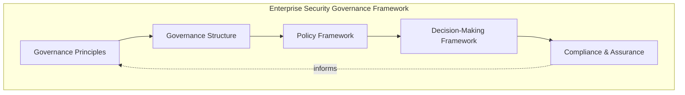
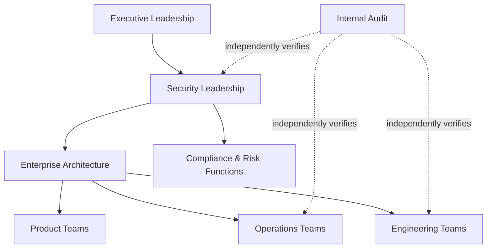
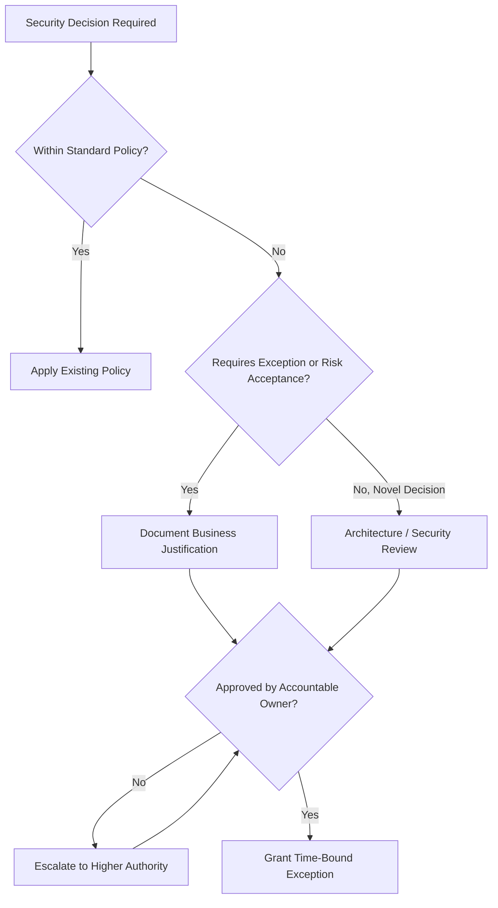
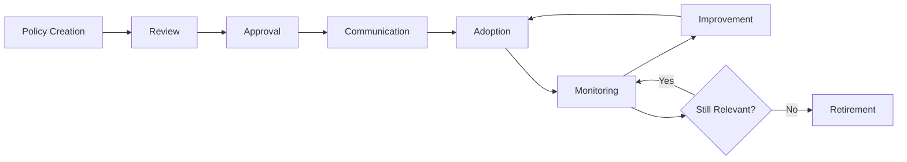
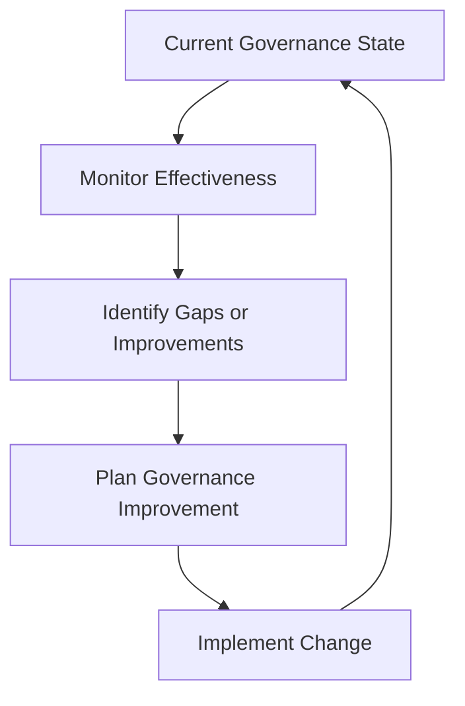

# Security Governance

## 1. Document Purpose

This document defines the official Enterprise Security Governance Strategy for **StackLeo Tech Store**. It establishes the governance principles, ownership structures, policy framework, and decision-making processes that hold every other security document in this folder together as a coherent, accountable whole.

- **Purpose of Security Governance** — to ensure that security decisions across the platform are made deliberately, by accountable people, against a consistent set of principles — never left to accumulate as ad hoc, undocumented judgment calls.
- **Relationship with Enterprise Architecture** — this document is the governance layer sitting above the domain-specific strategies in `06_Security` (identity, application, data, infrastructure, operational), ensuring they remain coherent with one another and with `03_System_Design/architecture-principles.md` (Section 11).
- **Relationship with Business Governance** — security governance is not a separate, parallel structure to how StackLeo governs the rest of the business; it is the security-specific application of the same executive accountability and decision discipline that governs any other significant business function.
- **Relationship with Risk Management** — this document operationalizes accountability for the risk philosophy defined in `security-principles.md` (Section 5) and `threat-model.md`, ensuring risk decisions have a clear, traceable owner.
- **Relationship with Customer Trust** — governance is what makes every other security commitment in this folder durable rather than aspirational; trust described in `01_Business/vision.md` depends on security being consistently governed, not merely well-designed at a single point in time.

This document is implementation-independent and vendor-neutral. It defines governance philosophy, structure, and lifecycle — not specific governance platforms, mandatory regulatory citations, operational procedures, or code.

## 2. Security Governance Philosophy

- **Governance by Design** — governance structures are established deliberately as security capability is built, not retrofitted once gaps have already emerged.
- **Risk-Based Decision Making** — governance decisions weigh business impact and likelihood, consistent with `security-principles.md` (Section 5), rather than applying uniform rigor regardless of consequence.
- **Accountability** — every security decision, policy, and accepted risk traces to a specific, named accountable role, never left ambiguous.
- **Shared Responsibility** — security governance spans Executive Leadership, Security, Engineering, Operations, and Product, consistent with the shared responsibility model in `06_Security/README.md` (Section 7), not the sole burden of any one function.
- **Continuous Improvement** — governance itself is treated as a discipline that matures over time, reviewed and revised as the organization and threat landscape evolve.
- **Security as Business Enablement** — governance exists to let the business pursue growth — corporate sales, wholesale, the multi-vendor marketplace — with confidence, not to obstruct it; well-governed security is what allows expansion to proceed responsibly.

## 3. Governance Principles

- **Executive Sponsorship**
  - *Purpose* — ensure security has visible, accountable support at the highest level of the organization.
  - *Business Value* — signals that security is a business priority, not merely a technical concern, and secures the resourcing security requires.
  - *Governance Objectives* — Executive Leadership is informed of and accountable for significant security risk decisions (Section 6).
- **Clear Ownership**
  - *Purpose* — ensure every security domain and policy has a specific, named accountable role.
  - *Business Value* — prevents gaps from persisting because "everyone" or "no one" was responsible.
  - *Governance Objectives* — every document in `06_Security` and every policy derived from it has a designated owner (Section 4).
- **Policy-Driven Decisions**
  - *Purpose* — ensure security decisions are made against consistent, documented principles rather than case-by-case improvisation.
  - *Business Value* — produces predictable, defensible outcomes as the organization scales beyond what any single person can personally oversee.
  - *Governance Objectives* — decisions reference the applicable policy or strategy document (Section 5) rather than being made in isolation.
- **Risk Awareness**
  - *Purpose* — ensure governance decisions are informed by a clear understanding of the risk involved.
  - *Business Value* — allows the organization to take on genuine business risk deliberately, rather than either avoiding all risk or being blind to it.
  - *Governance Objectives* — significant decisions reference the risk classification in `threat-model.md` (Section 7).
- **Transparency**
  - *Purpose* — ensure security posture and decisions are visible to those who need to understand them.
  - *Business Value* — builds internal confidence and supports informed decision-making across teams.
  - *Governance Objectives* — governance decisions and their rationale are documented and accessible to relevant stakeholders.
- **Auditability**
  - *Purpose* — ensure governance decisions and their outcomes can be reviewed after the fact.
  - *Business Value* — supports accountability, continuous improvement, and confidence for enterprise customers and partners.
  - *Governance Objectives* — decisions are recorded consistently with `security-principles.md` (Section 9).
- **Measurable Governance**
  - *Purpose* — ensure the effectiveness of governance itself can be assessed, not merely assumed.
  - *Business Value* — allows the organization to know whether governance is genuinely working, not merely present on paper.
  - *Governance Objectives* — governance activity (reviews completed, policies current, exceptions tracked) is observable and reportable.
- **Continuous Review**
  - *Purpose* — ensure governance structures remain relevant as the organization and platform evolve.
  - *Business Value* — prevents governance from becoming stale or disconnected from actual practice.
  - *Governance Objectives* — this strategy and its constituent policies are reviewed on a defined cadence (Section 9).

### Governance Principle Matrix

| Principle | Primary Governance Objective |
|---|---|
| Executive Sponsorship | Visible accountability and resourcing at the highest level |
| Clear Ownership | Every domain and policy has a named accountable role |
| Policy-Driven Decisions | Decisions reference documented principles, not improvisation |
| Risk Awareness | Decisions informed by clear risk understanding |
| Transparency | Posture and decisions are visible to relevant stakeholders |
| Auditability | Decisions and outcomes can be reviewed after the fact |
| Measurable Governance | Governance effectiveness itself can be assessed |
| Continuous Review | Governance structures remain relevant as context evolves |

## 4. Security Governance Structure

- **Executive Leadership** — sets risk appetite, sponsors security investment, and holds ultimate accountability for the business consequences of security decisions.
- **Security Leadership** — owns the coherence of the security strategies across `06_Security`, coordinates governance activity, and is the escalation point for cross-domain security decisions.
- **Enterprise Architecture** — ensures security governance remains consistent with the broader architectural principles in `03_System_Design/architecture-principles.md`.
- **Engineering Teams** — apply governed security principles within their domain (identity, application, data, infrastructure) and surface gaps or conflicts for review.
- **Operations Teams** — execute the operational security and monitoring practice governed by this framework and its constituent strategies.
- **Product Teams** — ensure new capability is evaluated against applicable security governance before commitment, balancing security posture with business and customer experience goals.
- **Compliance & Risk Functions** — track alignment with applicable legal, regulatory, and contractual obligations, coordinated with `compliance.md`.
- **Internal Audit** — independently verifies that governed policy and practice actually match, providing assurance distinct from the teams being reviewed.

*Diagram 1: Enterprise Security Governance Framework.*

*Diagram 4: Security Organization Responsibility Model.*

### Governance Role Responsibility Matrix

| Role | Responsibility |
|---|---|
| Executive Leadership | Sets risk appetite; sponsors security investment; accountable for business consequences of security decisions. |
| Security Leadership | Owns coherence of security strategies across `06_Security`; coordinates cross-domain governance. |
| Enterprise Architecture | Ensures security governance remains consistent with `03_System_Design/architecture-principles.md`. |
| Engineering Teams | Apply governed principles within their domain; surface gaps for review. |
| Operations Teams | Execute governed operational security practice. |
| Product Teams | Evaluate new capability against governance before commitment. |
| Compliance & Risk Functions | Track alignment with applicable obligations, per `compliance.md`. |
| Internal Audit | Independently verifies governed policy matches actual practice. |

## 5. Security Policy Framework

Governance applies consistently across every security policy domain in this folder:

| Domain | Governing Strategy Document | Governance Alignment |
|---|---|---|
| Identity & Access | `identity-management.md`, `authentication.md`, `authorization.md` | Ownership, review cadence, and exception handling follow the principles in Sections 3 and 6 of this document. |
| Application Security | `application-security.md`, `frontend-security.md`, `backend-security.md` | Secure SDLC governance is coordinated with Engineering accountability (Section 4). |
| API Security | `api-security.md` | Reviewed alongside API lifecycle governance, per `05_API/api-governance.md`. |
| Infrastructure Security | `infrastructure-security.md`, `network-security.md` | Environment and connectivity governance follows Clear Ownership (Section 3). |
| Data Protection | `data-protection.md`, `encryption.md`, `secrets-management.md` | Classification and access governance align with Compliance & Risk Functions (Section 4). |
| Incident Response | `incident-response.md` | Escalation and crisis governance follow the Decision-Making Framework (Section 6). |
| Business Continuity | `business-continuity.md`, `disaster-recovery.md` | Continuity governance is reviewed alongside Executive Leadership's risk appetite. |
| Vendor Security | `security-architecture.md` (Section 4, trust boundaries), `application-security.md` (Section 7) | Third-party and supply chain trust is governed consistently across domains. |

This document establishes how these policies are governed; it does not prescribe their specific content or implementation, which resides in each domain's own strategy document.

## 6. Decision-Making Framework

- **Risk Acceptance** — a risk may be knowingly and explicitly accepted rather than mitigated, following the risk philosophy in `security-principles.md` (Section 5), with the decision recorded and owned by an accountable party.
- **Security Reviews** — significant architectural, product, and operational decisions are reviewed against the applicable strategy documents in `06_Security` before adoption.
- **Architecture Reviews** — security-relevant architectural decisions are evaluated jointly against `security-architecture.md` and `03_System_Design/architecture-principles.md`, ensuring the two remain consistent.
- **Exception Governance** — deviations from standard policy are granted only through a deliberate, justified, and time-bound process, consistent with the exception principles in `vulnerability-management.md` (Section 7).
- **Change Governance** — material changes to security-relevant systems or policy are evaluated for their governance impact before being adopted.
- **Escalation Principles** — decisions exceeding a given role's authority (Section 4) are escalated promptly to the appropriate accountable level, rather than being resolved informally at the wrong altitude.

*Diagram 2: Security Decision-Making Flow.*

### Decision Governance Matrix

| Decision Type | Governance Mechanism |
|---|---|
| Risk Acceptance | Documented rationale, accountable owner, scheduled reassessment |
| Security Reviews | Evaluation against applicable `06_Security` strategy documents |
| Architecture Reviews | Joint evaluation against `security-architecture.md` and `03_System_Design/architecture-principles.md` |
| Exception Governance | Justified, time-bound, independently approved |
| Change Governance | Evaluated for governance impact before adoption |
| Escalation Principles | Routed to the appropriate accountable authority level |

## 7. Compliance & Assurance

- **Internal Governance** — this framework's own principles (Section 3) are the baseline standard StackLeo holds itself to, independent of any external requirement.
- **External Expectations** — StackLeo maintains awareness of the expectations customers, partners, and enterprise buyers reasonably hold regarding security governance, coordinated with `compliance.md`.
- **Audit Readiness** — governance decisions and outcomes are documented in a manner that supports internal or external review at any time, rather than being assembled reactively when requested.
- **Evidence Management** — records supporting governance decisions (reviews, risk acceptances, exceptions) are retained and organized consistently, per `security-principles.md` (Section 9).
- **Continuous Assurance** — confidence that governance is actually functioning as intended is sustained through ongoing review (Section 9), not established once and assumed to persist.

This document does not mandate specific external certifications or regulatory regimes; applicable legal and regulatory obligations are identified and tracked through `compliance.md` and `01_Business/business-rules.md` (Section 17).

## 8. Future Governance Readiness

This framework is deliberately structured to remain valid as StackLeo's platform and organization evolve:

- **Cloud-Native Platforms** — governance principles (Section 3) apply consistently regardless of the specific infrastructure technologies adopted, per `infrastructure-security.md`.
- **Microservices** — as decomposition into more services increases the number of components requiring governed oversight, Clear Ownership (Section 3) scales by assigning ownership per service or bounded context rather than requiring redefinition.
- **AI Systems** — AI-assisted capability is governed under the same decision-making framework (Section 6) as any other system component, with attention to its bounded scope per `identity-management.md` (Section 8).
- **Marketplace Platform** — governance extends naturally to seller-facing policy domains (vendor identity, marketplace data) as the marketplace launches, using the same structure defined in Section 4.
- **Enterprise Customers** — corporate and wholesale customers bring heightened expectations for governance maturity, which this framework's Auditability and Measurable Governance principles (Section 3) are designed to satisfy.
- **Multi-Region Operations** — governance structures apply consistently regardless of the number of regions the platform operates in.
- **Global Expansion** — this framework remains jurisdiction-agnostic, allowing region-specific compliance obligations to layer on via `compliance.md` without requiring the underlying governance structure to be redefined.

## 9. Governance Lifecycle

Every policy and strategy document within `06_Security` follows a consistent lifecycle:

- **Policy Creation** — a new policy or strategy is drafted in response to an identified need, consistent with the domain structure in Section 5.
- **Review** — the draft is reviewed against this governance framework and relevant existing documents for consistency.
- **Approval** — the policy is formally approved by its accountable owner (Section 4).
- **Communication** — the approved policy is communicated to the teams and stakeholders it affects.
- **Adoption** — the policy is put into actual practice, not merely published.
- **Monitoring** — adherence to the policy is observed over time, consistent with `security-testing.md` and `vulnerability-management.md` where applicable.
- **Improvement** — the policy is refined based on monitoring outcomes, incidents, and organizational change.
- **Retirement** — a policy no longer relevant is formally retired, avoiding the accumulation of stale, contradictory guidance.

*Diagram 3: Governance Lifecycle.*

### Governance Lifecycle Matrix

| Stage | Primary Concern |
|---|---|
| Policy Creation | Drafting in response to an identified, legitimate need |
| Review | Consistency with this framework and existing documents |
| Approval | Formal sign-off by the accountable owner |
| Communication | Ensuring affected stakeholders are informed |
| Adoption | Ensuring the policy is genuinely put into practice |
| Monitoring | Observing adherence over time |
| Improvement | Refining based on real-world outcomes |
| Retirement | Formally removing policies no longer relevant |

## 10. Anti-Patterns

| Anti-Pattern | Why It's Avoided |
|---|---|
| No Ownership | Leaves security domains or policies without accountability, contradicting Clear Ownership (Section 3). |
| Weak Accountability | Allows decisions to be made without a traceable, responsible party, undermining Section 2. |
| Policy Without Adoption | Produces documentation that does not reflect actual practice, contradicting the Adoption stage in Section 9. |
| Reactive Governance | Treats governance as a response to failures rather than a continuous, proactive discipline, contradicting Section 2. |
| Missing Reviews | Allows policy and practice to drift apart over time, undermining Continuous Review (Section 3). |
| Poor Documentation | Prevents governance decisions from being audited, understood, or improved consistently. |
| Weak Executive Support | Removes the resourcing and priority security requires, contradicting Executive Sponsorship (Section 3). |
| No Continuous Improvement | Allows governance itself to become stale and disconnected from organizational reality (Section 9). |

*Diagram 5: Continuous Governance Improvement Cycle.*

## 11. Document Information

| Property | Value |
|----------|-------|
| Document | security-governance.md |
| Version | 1.0.0 |
| Status | Active |
| Maintained By | StackLeo |
| Last Updated | 2026-07-17 |

---

© StackLeo. All Rights Reserved.
