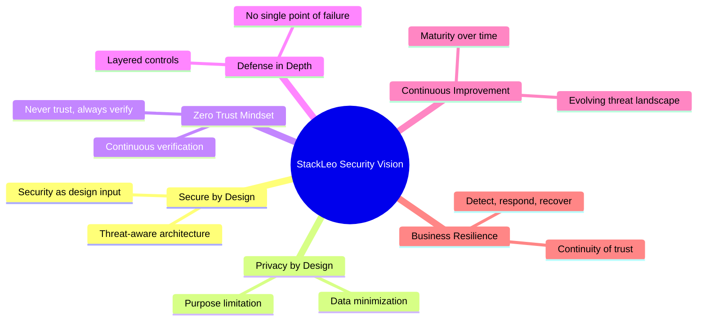
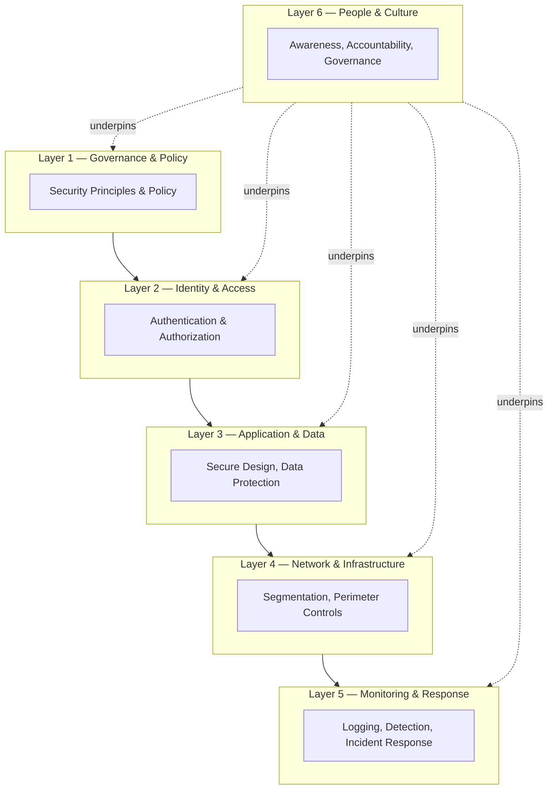
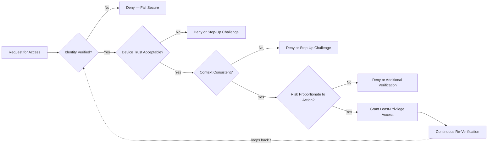
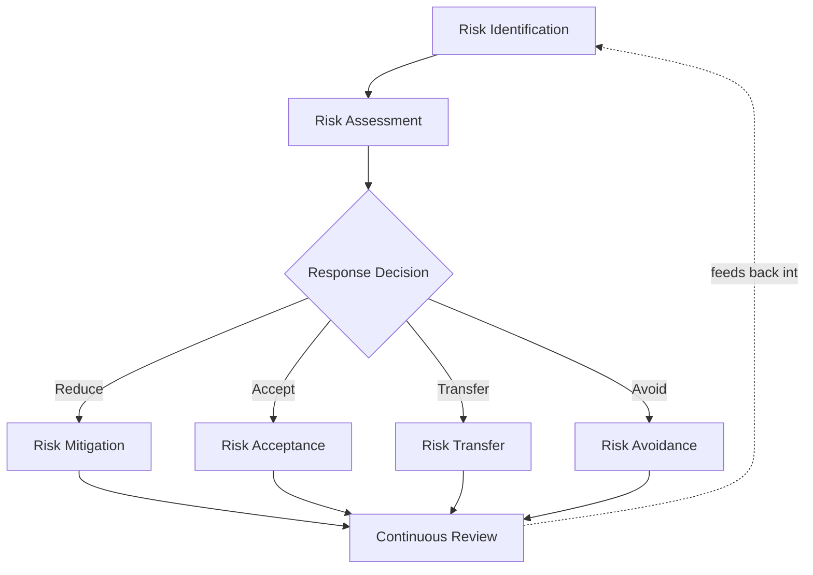
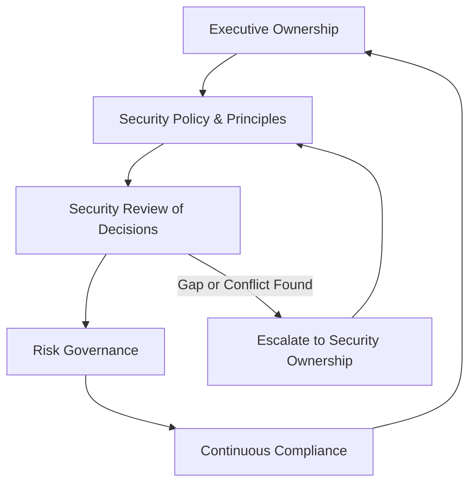

# Security Principles

## 1. Document Purpose

This document defines the official Enterprise Security Principles for **StackLeo Tech Store**. It establishes the foundational security philosophy, guiding principles, trust model, risk management approach, and long-term security mindset that govern every decision made across the platform — present and future.

- **Purpose of Security Principles** — to provide a single, stable point of reference for *why* StackLeo makes the security decisions it makes, so that engineering, product, and operational choices remain coherent as the organization, team, and platform grow. Principles outlast any individual tool, team structure, or technology choice.
- **Relationship with Enterprise Architecture** — this document elaborates and grounds the security principles introduced in `03_System_Design/architecture-principles.md` (Section 7, ARCH-033–ARCH-037). Where that document states the architectural rule, this document explains the underlying philosophy and business reasoning behind it.
- **Relationship with Business Trust** — trust is StackLeo's core differentiator, per `01_Business/vision.md` (Section 2) and `01_Business/mission.md`. Every principle in this document exists to protect and grow that trust; a security failure is, by definition, a trust failure and therefore a business failure.
- **Relationship with Customer Protection** — customers extend StackLeo access to their identity, payment relationship, and purchase history. These principles exist to honor that extension of trust responsibly, across every current and future market StackLeo serves.
- **Relationship with Compliance** — this document is the philosophical foundation upon which compliance obligations are built, not a substitute for them. Specific regulatory and legal obligations are defined in `01_Business/business-rules.md` (Section 17) and elaborated operationally in `04_Database/data-governance.md`; this document explains the security reasoning that makes durable compliance possible rather than incidental.

This document is implementation-independent and vendor-neutral. It defines security philosophy and principle, not specific tools, technologies, configurations, or implementation procedures, all of which are addressed — where appropriate — in dedicated technical documentation elsewhere in the repository.

## 2. Security Vision

> **StackLeo exists to be the most trusted technology marketplace in its markets. Security is not a department that protects that trust after the fact — it is one of the disciplines that creates it.**

The StackLeo security vision rests on six pillars:

- **Secure by Design** — security is a first-class input to every architectural and product decision, considered at the moment a capability is conceived, not retrofitted once it is built. This mirrors ARCH-014 in `03_System_Design/architecture-principles.md`.
- **Privacy by Design** — the platform defaults to collecting, retaining, and exposing the minimum customer and business data necessary for a legitimate purpose, consistent with `01_Business/business-rules.md` (BR-128).
- **Zero Trust Mindset** — no request, actor, network location, or prior authentication event is trusted implicitly; trust is established explicitly and re-established continuously (Section 4).
- **Defense in Depth** — no single control, however strong, is treated as sufficient on its own; protection is layered so that the failure of one control does not become the failure of the platform.
- **Continuous Improvement** — the threat landscape, business model, and platform all evolve; security posture is treated as a continuously improving discipline, not a state that is ever declared "finished."
- **Business Resilience** — security exists to keep the business operating through adverse conditions, not merely to prevent incidents; readiness to detect, respond, and recover is as important as prevention.

*Diagram 1: Security Principles Overview.*

## 3. Core Security Principles

Ten principles form the non-negotiable core of StackLeo's security philosophy. Each is elaborated below with its definition, its business value, and its security impact.

### 3.1 Least Privilege

- **Definition** — every actor, human or system, is granted only the access strictly necessary to perform its defined responsibility, and no more.
- **Business Value** — limits the operational and reputational damage that any single compromised account or misused permission can cause, protecting the trust described in `01_Business/vision.md`.
- **Security Impact** — dramatically reduces the blast radius of credential compromise, insider error, or insider misuse, consistent with ARCH-033.

### 3.2 Need-to-Know

- **Definition** — access to information is granted based on a legitimate operational requirement to know it, not on organizational seniority, convenience, or blanket role membership.
- **Business Value** — protects sensitive business information (pricing strategy, supplier terms, customer data) from unnecessary internal exposure as the organization scales.
- **Security Impact** — reduces the number of people and systems capable of leaking, misusing, or being targeted for sensitive information.

### 3.3 Secure Defaults

- **Definition** — the default state of any system, account, or capability is the most secure reasonable configuration; relaxing security requires a deliberate, accountable action rather than the reverse.
- **Business Value** — protects the business from risk introduced by oversight, haste, or unfamiliarity, which are far more common failure modes than deliberate misconfiguration.
- **Security Impact** — shifts the statistical likelihood of a gap from "insecure unless someone remembers to secure it" to "secure unless someone deliberately and visibly relaxes it," consistent with ARCH-036.

### 3.4 Identity-Centric Security

- **Definition** — identity, not network location, is the primary boundary of trust; every human, service, and device is required to present a verifiable identity before being granted any access.
- **Business Value** — supports a distributed, multi-channel business (Web, future Mobile App, future Physical Store, future POS) where a fixed network perimeter is not a meaningful or durable boundary.
- **Security Impact** — enables consistent authorization decisions regardless of where a request originates, and forms the foundation of the Zero Trust philosophy in Section 4.

### 3.5 Fail Secure

- **Definition** — when a security control cannot make a confident decision — due to error, ambiguity, or failure — the default outcome is denial of access, never silent or implicit permission.
- **Business Value** — protects the business from the far costlier failure mode of an undetected security gap, at the acceptable cost of occasional, visible friction.
- **Security Impact** — ensures that system failure degrades toward safety rather than toward exposure.

### 3.6 Minimize Attack Surface

- **Definition** — the platform exposes only the capability, interface, and data genuinely required to serve its customers and operations, deliberately avoiding unnecessary exposure.
- **Business Value** — reduces the number of paths available to an adversary as the platform grows in complexity across catalog, orders, payments, and — in time — the marketplace.
- **Security Impact** — a smaller, more deliberate surface is inherently easier to reason about, monitor, and defend than one that has grown by accretion.

### 3.7 Assume Breach

- **Definition** — the platform is designed and operated on the assumption that some control, somewhere, will eventually fail or be circumvented, rather than on the assumption of perfect prevention.
- **Business Value** — shifts investment toward detection, containment, and recovery capability — the disciplines that determine how quickly trust can be restored after an incident — rather than prevention alone.
- **Security Impact** — ensures that a single failure is contained and detected rather than being the sole barrier between an adversary and the entire platform.

### 3.8 Separation of Duties

- **Definition** — no single individual or role can both perform and approve the same high-impact action (for example, issuing a refund and approving it) without independent oversight.
- **Business Value** — protects the business from both malicious insider action and honest human error in high-impact financial and customer-facing processes, consistent with `02_Product/user-roles.md` (Section 11).
- **Security Impact** — reduces the likelihood that a single compromised or careless actor can cause significant harm unilaterally.

### 3.9 Defense in Depth

- **Definition** — security relies on multiple independent, layered controls spanning governance, identity, application, data, infrastructure, and monitoring, such that the failure of any one layer does not result in complete compromise.
- **Business Value** — provides resilience proportionate to what a trust-first business requires; no single vendor, technology, or team decision becomes a single point of failure for the business's reputation.
- **Security Impact** — an adversary who defeats one control still faces additional, independent controls before reaching a meaningful asset.

*Diagram 2: Defense in Depth Model — each layer is independently meaningful; compromise of one layer does not imply compromise of the platform.*

### 3.10 Continuous Verification

- **Definition** — trust granted at one point in time (login, prior approval, network admission) is never assumed to persist indefinitely; identity, device, and context are re-evaluated at meaningful intervals and decision points.
- **Business Value** — protects the business as sessions, devices, and risk conditions change over the course of a customer's or employee's interaction with the platform.
- **Security Impact** — closes the gap that a one-time authentication check leaves open for the remainder of a long-lived session, consistent with the Zero Trust philosophy in Section 4.

### Core Security Principles Summary

| ID | Principle | Definition | Business Value | Security Impact |
|---|---|---|---|---|
| SEC-P-01 | Least Privilege | Access limited to defined responsibility only. | Limits damage from any single compromised account. | Reduces blast radius of compromise or misuse. |
| SEC-P-02 | Need-to-Know | Information access based on legitimate operational need. | Protects sensitive business information at scale. | Reduces number of exposed information paths. |
| SEC-P-03 | Secure Defaults | Most secure reasonable configuration by default. | Protects against risk from oversight or haste. | Shifts failure mode from "insecure unless fixed" to "secure unless relaxed." |
| SEC-P-04 | Identity-Centric Security | Identity, not network location, is the trust boundary. | Supports a distributed, multi-channel business. | Enables consistent authorization regardless of origin. |
| SEC-P-05 | Fail Secure | Ambiguous or failed checks default to denial. | Avoids costlier undetected exposure. | System failure degrades toward safety. |
| SEC-P-06 | Minimize Attack Surface | Expose only what is genuinely required. | Fewer paths for adversaries as complexity grows. | Smaller surface is easier to defend and monitor. |
| SEC-P-07 | Assume Breach | Design assumes eventual control failure. | Invests in restoring trust quickly after incidents. | Ensures failures are contained and detected. |
| SEC-P-08 | Separation of Duties | No single actor performs and approves the same action. | Protects against insider risk and human error. | Reduces unilateral harm from one actor. |
| SEC-P-09 | Defense in Depth | Multiple independent, layered controls. | Resilience proportionate to a trust-first business. | No single control failure causes full compromise. |
| SEC-P-10 | Continuous Verification | Trust is re-evaluated continuously, not once. | Protects against risk that changes mid-session. | Closes gaps left open by one-time authentication. |

## 4. Zero Trust Philosophy

StackLeo's Zero Trust philosophy is conceptual, not a specific product category: it is the belief that trust must be established explicitly, contextually, and repeatedly — never inherited from network location, prior authentication, or organizational convenience.

- **Never Trust, Always Verify** — every request is evaluated on its own merits at the point of access, regardless of where it originates or what trusted it previously.
- **Continuous Authentication** — the confidence that an actor is who they claim to be is treated as something that can decay over time or across conditions, not a fact established once at login.
- **Continuous Authorization** — the permissions available to an already-authenticated actor are re-evaluated against current policy and context, not fixed for the life of a session.
- **Device Awareness** — the trustworthiness of the device an actor is using is a meaningful input to an access decision, distinct from the trustworthiness of the actor's identity.
- **Context Awareness** — signals such as location, time, behavior pattern, and request pattern inform how much trust a given request warrants.
- **Risk-Based Decisions** — the strength of verification required for an action scales with the sensitivity and impact of that action, rather than applying uniformly regardless of consequence.

*Diagram 3: Zero Trust Concept Flow — trust is re-established at every meaningful decision point, not assumed from a single prior check.*

### Zero Trust Concepts

| Concept | Description | Business Rationale |
|---|---|---|
| Never Trust, Always Verify | No request is trusted based on origin or prior context alone. | Removes reliance on a fixed, defensible network perimeter across channels. |
| Continuous Authentication | Identity confidence can decay and must be re-established. | Protects long-lived sessions from post-login compromise. |
| Continuous Authorization | Permissions are re-checked against current policy and context. | Reflects that roles, risk, and policy change faster than sessions end. |
| Device Awareness | Device trustworthiness is evaluated independently of identity. | Accounts for compromised or unmanaged devices as a distinct risk. |
| Context Awareness | Location, time, and behavior inform trust decisions. | Detects anomalies that identity and device checks alone would miss. |
| Risk-Based Decisions | Verification strength scales with action sensitivity. | Balances customer experience against the true consequence of an action. |

## 5. Risk Management Philosophy

Security exists to serve business objectives, not to pursue absolute risk elimination — an unattainable and economically irrational goal. StackLeo's risk management philosophy treats risk as something to be understood and consciously managed, not eliminated at any cost.

- **Risk Identification** — potential threats, vulnerabilities, and exposures are actively sought out across people, process, technology, and third parties, rather than assumed absent until proven otherwise.
- **Risk Assessment** — identified risks are evaluated for likelihood and business impact, so that limited attention and investment are directed toward what matters most.
- **Risk Mitigation** — risks warranting action are addressed through proportionate controls, reducing likelihood, impact, or both to an acceptable level.
- **Risk Acceptance** — some risks are knowingly and explicitly accepted, when the cost of further mitigation exceeds the business value of doing so; acceptance is a deliberate, accountable decision, never a default by omission.
- **Continuous Review** — the risk landscape changes as the business, platform, and threat environment evolve; risk posture is reviewed on a regular cadence, not assessed once and left static.

This philosophy allows security to support, rather than obstruct, business objectives such as StackLeo's expansion from single-seller retail into corporate sales, wholesale, and the multi-vendor marketplace: growth introduces new risk, and disciplined risk management is what allows that growth to proceed responsibly rather than being blocked or pursued blindly.

*Diagram 4: Risk Management Lifecycle.*

### Risk Management Matrix

| Likelihood \ Impact | Low | Medium | High | Critical |
|---|---|---|---|---|
| Rare | Accept | Accept | Monitor | Mitigate |
| Unlikely | Accept | Monitor | Mitigate | Mitigate |
| Possible | Monitor | Mitigate | Mitigate | Mitigate Urgently |
| Likely | Mitigate | Mitigate | Mitigate Urgently | Mitigate Urgently |
| Almost Certain | Mitigate | Mitigate Urgently | Mitigate Urgently | Mitigate Urgently / Escalate to Executive |

## 6. Data Protection Principles

Data is the asset that customer trust and business operation both depend on most directly. StackLeo's data protection principles apply consistently across customer data, business data, and partner data, and elaborate the security-layer application of `04_Database/data-governance.md`.

- **Confidentiality** — data is disclosed only to actors with a legitimate, verified need to access it.
- **Integrity** — data remains accurate and unaltered except through authorized, intentional action; unauthorized or accidental modification is prevented or detected.
- **Availability** — data and the capability it supports remain accessible to legitimate users when the business genuinely needs it, consistent with the continuity goals of `04_Database/backup-recovery.md`.
- **Privacy** — customer data is handled as belonging to the customer, not the business; it is used only for purposes the customer would reasonably expect and consent to.
- **Data Minimization** — only data genuinely necessary for a defined, legitimate purpose is collected, consistent with `01_Business/business-rules.md` (BR-128).
- **Data Classification** — data is categorized by sensitivity, so that protection intensity is proportionate to the harm its exposure would cause, consistent with the classification model in `04_Database/data-governance.md`.
- **Retention Awareness** — data is retained only as long as it serves a legitimate business or legal purpose; indefinite retention is treated as a liability, not a convenience, consistent with `04_Database/data-retention.md`.

### Data Protection Principles

| Principle | Description | Why It Matters |
|---|---|---|
| Confidentiality | Data disclosed only to those with legitimate need. | Prevents unauthorized exposure of customer and business data. |
| Integrity | Data remains accurate unless intentionally and authorizedly changed. | Preserves the reliability of orders, pricing, and inventory. |
| Availability | Data accessible to legitimate users when genuinely needed. | Supports continuity of customer trust and business operation. |
| Privacy | Data used only as the customer would reasonably expect. | Honors the trust customers extend by sharing their data. |
| Data Minimization | Only necessary data is collected. | Reduces exposure and simplifies compliance as the business grows. |
| Data Classification | Sensitivity determines protection intensity. | Focuses protection effort where harm potential is greatest. |
| Retention Awareness | Data retained only as long as purpose requires. | Reduces long-term liability and exposure surface. |

## 7. Identity & Access Principles

- **Strong Identity** — every human and system actor is represented by a distinct, verifiable identity; shared or anonymous identities are avoided wherever accountability matters.
- **Authentication** — the platform verifies that an actor is who they claim to be before any access is considered, distinct from and prerequisite to authorization.
- **Authorization** — a verified identity is granted only the specific actions and data access consistent with its defined role, per `02_Product/user-roles.md`.
- **Access Governance** — access grants are reviewed, justified, and revocable over time; access is not "set and forgotten" once initially provisioned.
- **Session Trust** — an active session is treated as a perishable, re-evaluable grant of trust rather than a permanent state, consistent with Continuous Verification (Section 3.10).
- **Privileged Access** — elevated access (administrative, financial-approval, or data-export capability) receives proportionately stronger verification, oversight, and accountability than standard access, consistent with `02_Product/user-roles.md` (Section 11).

## 8. Secure Development Principles

- **Security by Design** — security requirements are treated as functional requirements, considered from the first design conversation rather than a final review gate.
- **Security in Architecture** — architectural decisions are evaluated for their security implications as a matter of course, consistent with `03_System_Design/architecture-principles.md` (Section 7).
- **Secure Coding Mindset** — engineers reason about how a component could be misused or attacked, not only how it is intended to be used, as an ordinary part of building it.
- **Security Reviews** — significant design and implementation decisions receive deliberate security scrutiny before they are relied upon in production, proportionate to their risk.
- **Testing Culture** — security assumptions are treated as claims to be verified, not beliefs to be trusted, consistent with the testing philosophy referenced in `03_System_Design/quality-attributes.md`.
- **Continuous Improvement** — security practice in development is expected to mature over time as the team, platform, and threat landscape evolve, rather than being fixed at whatever the team knew when the platform began.

## 9. Operational Security Principles

- **Monitoring** — the operational state of the platform is continuously observed, so that abnormal or malicious activity can be recognized rather than discovered after harm has occurred.
- **Logging** — security-relevant and business-critical actions are recorded with sufficient context to support investigation and accountability, consistent with ARCH-037.
- **Incident Readiness** — the organization maintains a clear, practiced understanding of how it will detect, contain, communicate, and recover from a security incident, rather than improvising in the moment.
- **Business Continuity** — security operations are designed to preserve the business's ability to keep serving customers through disruption, not solely to prevent disruption from occurring.
- **Operational Resilience** — the platform is expected to withstand and recover from adverse operational conditions — security-related or otherwise — as a normal part of how it is run.
- **Continuous Learning** — every incident, near-miss, and review is treated as an input to improving future posture, not merely as an event to be closed out.

## 10. Future Security Readiness

These principles are deliberately structured to remain valid as StackLeo evolves in scope and scale:

- **AI Systems** — as AI-assisted capability (search, recommendations, fraud detection) is introduced per `02_Product/product-modules.md` (MOD-032), the same identity, least-privilege, and data-minimization principles apply to what AI systems may access and act upon.
- **Public APIs** — as the platform exposes capability to external consumers per `05_API/api-strategy.md`, identity-centric security and continuous verification extend to every external caller, not only internal users.
- **Marketplace Platform** — the shift to a multi-vendor marketplace introduces a new class of external actor (sellers) whose access must be governed by the same least-privilege and separation-of-duties principles as internal roles, per `02_Product/user-roles.md`.
- **Global Expansion** — as StackLeo grows from Bangladesh into South Asia and beyond, these principles remain jurisdiction-agnostic, allowing region-specific compliance obligations to be layered on without redefining the underlying philosophy.
- **Enterprise Customers** — corporate and wholesale customers bring heightened expectations around access governance, auditability, and contractual assurance; the principles in this document are the foundation that such assurance is built upon.
- **Multi-Cloud** — identity-centric security and defense in depth are deliberately independent of any single infrastructure provider, supporting future multi-cloud or cloud-portability decisions without a change in philosophy.
- **Distributed Systems** — as the platform decomposes toward independently deployable services (per `03_System_Design/architecture-principles.md`, ARCH-041), Zero Trust and continuous verification become more, not less, important, since implicit trust between components can no longer rely on physical proximity.

## 11. Governance

- **Security Ownership** — a designated Security Lead is accountable for the coherence, currency, and enforcement of this document, mirroring the ownership model in `03_System_Design/architecture-principles.md` (Section 11).
- **Policy Management** — specific security policies (acceptable use, access management, incident response, and similar) are derived from these principles and maintained as living documents, reviewed on a regular cadence.
- **Security Reviews** — significant architectural, product, and operational decisions are evaluated against these principles before adoption, mirroring the ADR-based governance process in `03_System_Design/architecture-decisions.md`.
- **Risk Governance** — accepted risks (Section 5) are recorded, owned by a named accountable individual, and revisited on a defined schedule rather than accepted indefinitely without review.
- **Continuous Compliance** — compliance with applicable legal and regulatory obligations (`01_Business/business-rules.md`, Section 17) is treated as an ongoing operating condition, not a periodic event to pass and forget.

*Diagram 5: Security Governance Framework.*

### Governance Responsibilities

| Role | Responsibility |
|---|---|
| Security Lead / CISO Function | Owns the coherence and enforcement of this document; final authority on principle interpretation. |
| Executive Leadership | Sets risk appetite and accepts residual risk at the business level. |
| Solution Architect | Ensures architectural decisions remain consistent with these principles, per `03_System_Design/architecture-principles.md`. |
| Engineering Leads | Apply principles within their domain; raise conflicts or gaps for review. |
| Product Manager | Ensures product direction accounts for security and privacy implications from the outset. |
| Data Protection Owner | Ensures data handling remains consistent with Data Protection Principles (Section 6) and applicable compliance obligations. |
| Internal Audit / Review Function | Independently verifies that stated principles are reflected in actual practice. |

## 12. Anti-Patterns

The following practices directly undermine the principles defined in this document and are explicitly discouraged across StackLeo's people, process, and platform:

| Anti-Pattern | Why It's Avoided |
|---|---|
| Security as Afterthought | Violates Secure by Design; controls added after the fact are costlier, weaker, and often incomplete. |
| Excessive Privileges | Violates Least Privilege; expands the blast radius of any single compromised account. |
| Shared Credentials | Undermines Strong Identity and accountability; makes it impossible to attribute action to an individual actor. |
| Implicit Trust | Contradicts the Zero Trust philosophy (Section 4); allows a single compromised point to grant broad, unverified access. |
| Poor Logging | Undermines Auditability and Incident Readiness; makes detection and investigation of incidents materially harder or impossible. |
| Weak Governance | Allows principles to drift from practice with no accountable owner or review mechanism. |
| Ignoring Threat Models | Leaves realistic attack paths unconsidered until they are exploited rather than anticipated. |
| Reactive Security | Treats security as a response to incidents rather than a continuously maintained posture, guaranteeing repeated, avoidable harm. |

## 13. Document Information

| Property | Value |
|----------|-------|
| Document | security-principles.md |
| Version | 1.0.0 |
| Status | Active |
| Maintained By | StackLeo |
| Last Updated | 2026-07-17 |

---

© StackLeo. All Rights Reserved.
