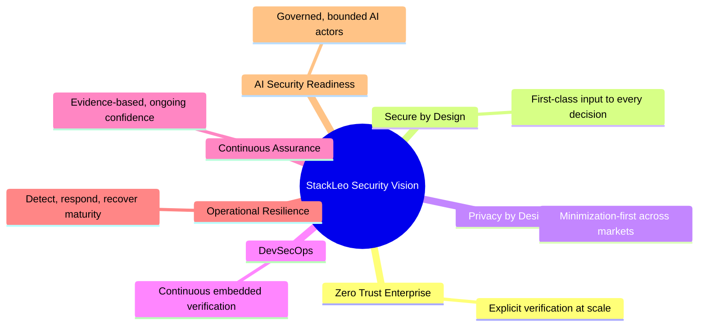
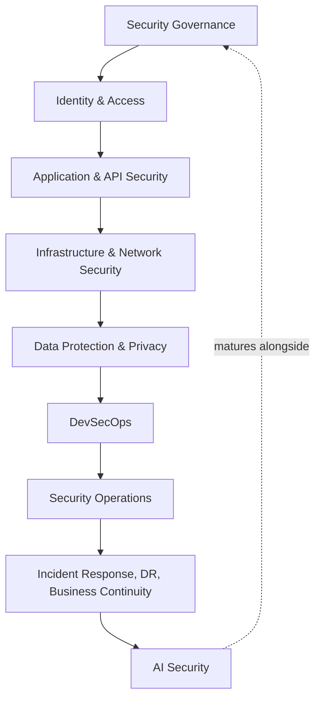
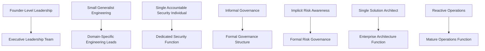
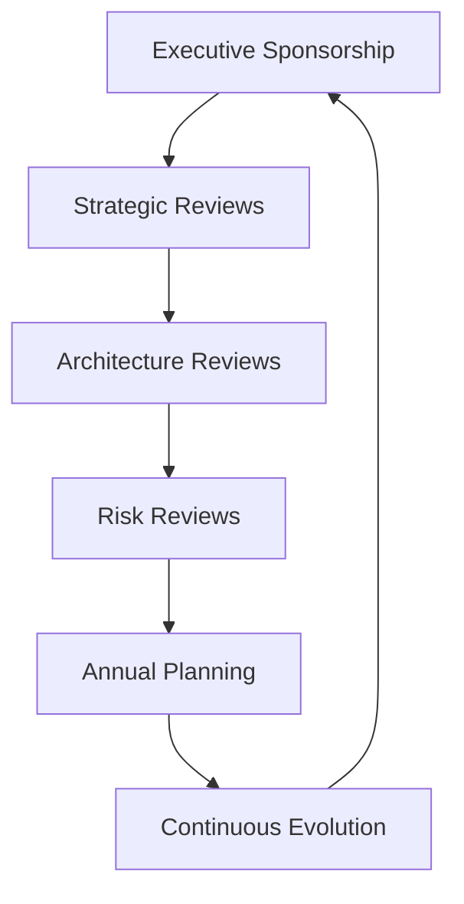

# Security Roadmap

## 1. Executive Summary

This document defines the official Enterprise Security Roadmap for **StackLeo Tech Store**. It describes the long-term strategic evolution of security capability, governance maturity, architecture, resilience, and organizational readiness as StackLeo grows from a single-seller B2C retailer toward corporate sales, wholesale, and a multi-vendor marketplace across Bangladesh, South Asia, and eventually global markets.

- **Vision of Security** — StackLeo's security posture is intended to mature deliberately alongside the business, never lagging so far behind that growth outpaces protection, and never over-investing so far ahead that resources are misallocated against genuine need.
- **Business Alignment** — every stage of this roadmap traces to a corresponding stage of business growth described in `02_Product/product-roadmap.md`, ensuring security investment is justified by validated business need, consistent with `03_System_Design/architecture-principles.md` (ARCH-001).
- **Long-Term Objectives** — this roadmap exists to ensure StackLeo can pursue corporate sales, wholesale distribution, and the multi-vendor marketplace with confidence, not merely hope, that its security foundation can bear the added weight.
- **Security as a Business Enabler** — security is framed throughout this roadmap as what makes ambitious growth possible responsibly, consistent with Security as Business Enablement in `security-principles.md` (Section 2), not as a constraint imposed upon growth.
- **Relationship with Enterprise Architecture** — this roadmap is the temporal, strategic companion to `security-architecture.md`: where that document describes the security architecture's structure at any point in time, this document describes how that structure is expected to evolve over time.

This document is implementation-independent and vendor-neutral. It describes strategic direction and maturity evolution — not specific products, vendors, implementation plans, or regulatory advice.

## 2. Security Vision

StackLeo's long-term security vision rests on seven pillars, each elaborated fully across the documents in `06_Security`:

- **Zero Trust Enterprise** — every request, actor, and component is verified explicitly and continuously, regardless of scale, consistent with `security-architecture.md` (Section 2).
- **Secure by Design** — security is a first-class input to every architectural and product decision, from the platform's current state through its most ambitious future form.
- **Privacy by Design** — customer and business data are handled under a consistent, minimization-first philosophy regardless of how many markets or data categories the platform eventually spans, per `privacy.md`.
- **DevSecOps** — security verification is embedded continuously throughout delivery, per `security-testing.md` and `vulnerability-management.md`, rather than treated as a separate downstream gate.
- **Continuous Assurance** — confidence in the platform's security posture is sustained through ongoing evidence, per `security-testing.md` (Section 5), not established once and assumed to persist.
- **Operational Resilience** — the organization's ability to detect, respond to, and recover from disruption matures continuously, per `incident-response.md`, `disaster-recovery.md`, and `business-continuity.md`.
- **AI Security Readiness** — AI-assisted capability is governed under the same identity, authorization, and data protection discipline as any other system actor, per `identity-management.md` (Section 8), as it becomes a larger part of the platform.

*Diagram 6: Security Vision Framework.*

## 3. Security Maturity Journey

### Stage 1 – Startup

- **Organizational Focus** — establishing the core B2C commerce experience with a small, focused team.
- **Security Priorities** — foundational identity, authentication, and data protection; establishing `security-principles.md` and `security-architecture.md` as the guiding reference.
- **Governance Evolution** — a single accountable Security Lead; lightweight, informal review processes.
- **Architecture Evolution** — a Traditional Application or early Modular Monolith (Section 5).
- **Operational Improvements** — basic monitoring and logging; incident response readiness established in principle.

### Stage 2 – Growth

- **Organizational Focus** — expanding the customer base and internal team as the core business proves out.
- **Security Priorities** — maturing API security, application security domains, and vulnerability management as surface area grows.
- **Governance Evolution** — dedicated Engineering leads accountable for security within their domain; formal review cadence begins.
- **Architecture Evolution** — Modular Monolith maturing toward Modular Services (Section 5).
- **Operational Improvements** — security testing embedded into delivery; incident response practiced, not merely documented.

### Stage 3 – Scale

- **Organizational Focus** — supporting significantly higher transaction volume and beginning to explore Corporate Sales.
- **Security Priorities** — infrastructure and network security mature; identity governance extends to organizational (corporate customer) identities.
- **Governance Evolution** — formal governance structure per `security-governance.md`, with Executive Sponsorship established.
- **Architecture Evolution** — Modular Services evolving toward Event-Driven Services (Section 5).
- **Operational Improvements** — disaster recovery and business continuity formalized beyond principle into practiced capability.

### Stage 4 – Enterprise

- **Organizational Focus** — supporting Wholesale distribution and the Multi-Vendor Marketplace, introducing new external actor categories.
- **Security Priorities** — marketplace vendor identity and data governance; enterprise-grade assurance for corporate customers.
- **Governance Evolution** — mature risk governance, formal audit readiness, and compliance alignment per `compliance.md`.
- **Architecture Evolution** — Event-Driven Services evolving toward Microservices (Section 5).
- **Operational Improvements** — continuous assurance and security automation mature; AI-assisted capability governed at scale.

### Stage 5 – Global

- **Organizational Focus** — operating across South Asia and global markets with a mature, distributed organization.
- **Security Priorities** — multi-region trust boundaries, cross-border privacy readiness per `privacy.md` (Section 7), multi-tenant isolation at full scale.
- **Governance Evolution** — governance operates across regions consistently, with regional compliance layered on a stable core.
- **Architecture Evolution** — Microservices evolving toward a full Cloud-Native, Global Platform (Section 5).
- **Operational Improvements** — enterprise-grade continuous assurance, resilience, and governance sustained across a global footprint.

*Diagram 1: Security Maturity Roadmap.*

### Security Maturity Matrix

| Stage | Business Driver | Governance Model | Architecture Form |
|---|---|---|---|
| Startup | Core B2C commerce launch | Single accountable Security Lead | Traditional Application / early Modular Monolith |
| Growth | Expanding customer base and team | Engineering-domain accountability, formal cadence begins | Modular Monolith → Modular Services |
| Scale | Higher volume, early Corporate Sales | Formal governance structure, Executive Sponsorship | Modular Services → Event-Driven Services |
| Enterprise | Wholesale and Marketplace launch | Mature risk governance, audit readiness | Event-Driven Services → Microservices |
| Global | South Asia and global expansion | Cross-region governance, layered compliance | Microservices → Cloud-Native Global Platform |

## 4. Capability Roadmap

Each capability area matures progressively across the stages defined in Section 3:

| Capability | Startup → Growth | Scale → Enterprise | Enterprise → Global |
|---|---|---|---|
| Security Governance | Informal ownership established | Formal governance per `security-governance.md` | Cross-region governance consistency |
| Identity & Access | Core customer and employee identity | Corporate and marketplace vendor identity added | Multi-tenant identity at global scale |
| Application Security | Secure SDLC foundations | Consistent domain coverage across a growing codebase | Mature across a distributed, multi-region codebase |
| API Security | Internal and basic external APIs | Public and partner API governance mature | Multi-region API consistency |
| Infrastructure Security | Basic environment isolation | Formal workload and platform protection | Multi-region, multi-cloud consistency |
| Network Security | Basic perimeter and segmentation | Formal zone-based segmentation | Multi-region trust boundary consistency |
| Data Protection | Core classification established | Full lifecycle governance mature | Cross-border data governance |
| DevSecOps | Testing embedded informally | Formal quality gates per `security-testing.md` | Continuous assurance at scale |
| Security Operations | Basic monitoring | Mature detection and response | 24/7-equivalent operational maturity across regions |
| Incident Response | Documented, lightly practiced | Formally practiced and coordinated | Cross-region coordinated response |
| Disaster Recovery | Principle established | Practiced and tested per `disaster-recovery.md` | Multi-region recovery capability |
| Business Continuity | Principle established | Formal crisis management per `business-continuity.md` | Global continuity coordination |
| Privacy | Core minimization principles | Formal governance per `privacy.md` | Cross-border privacy readiness mature |
| AI Security | Not yet applicable | Governed AI Agent identities introduced | AI capability governed at global scale |

*Diagram 2: Enterprise Security Capability Evolution.*

## 5. Architecture Evolution

The platform's underlying architecture is expected to evolve through the following conceptual stages, each with distinct security implications:

- **Traditional Applications** — security is concentrated within a single deployable unit; the primary security implication is ensuring internal module boundaries are respected even absent physical separation.
- **Modular Monolith** — internal boundaries become more deliberate, per `03_System_Design/bounded-contexts.md`; security implication is enforcing least privilege across modules despite shared deployment.
- **Modular Services** — services begin to be independently deployable; security implication is the emergence of genuine service-to-service trust boundaries requiring explicit verification, per `backend-security.md` (Section 4).
- **Event-Driven Services** — interaction shifts toward asynchronous events, per `03_System_Design/event-flows.md`; security implication is extending trust-boundary treatment to event producers and consumers, not only synchronous requests.
- **Microservices** — full decomposition into independently deployable services; security implication is a significant increase in the number of internal trust boundaries requiring consistent Zero Trust enforcement.
- **Cloud-Native Platform** — the platform leverages elastic, provider-hosted infrastructure at scale; security implication is ensuring infrastructure security principles remain consistent regardless of the specific cloud-native services adopted, per `infrastructure-security.md`.
- **Global Platform** — the platform operates across multiple regions and markets; security implication is extending trust boundaries, data classification, and governance consistently across geography, per `security-architecture.md` (Section 4) and `privacy.md` (Section 7).

*Diagram 3: Architecture Evolution Timeline.*

### Architecture Evolution Matrix

| Architecture Form | Primary Security Implication |
|---|---|
| Traditional Applications | Enforcing internal boundaries absent physical separation |
| Modular Monolith | Least privilege across modules despite shared deployment |
| Modular Services | Emergence of genuine service-to-service trust boundaries |
| Event-Driven Services | Trust-boundary treatment extends to asynchronous events |
| Microservices | Significant increase in internal trust boundaries |
| Cloud-Native Platform | Consistency of principles regardless of specific services adopted |
| Global Platform | Trust boundaries and governance extend consistently across geography |

## 6. Organizational Evolution

- **Leadership** — evolves from a single technical founder-level decision-maker toward an Executive Leadership team with dedicated Security Lead representation, consistent with Executive Sponsorship in `security-governance.md` (Section 3).
- **Engineering** — grows from a small, generalist team toward domain-specific Engineering leads accountable for security within Identity, Application, Data, and Infrastructure domains.
- **Security Team** — evolves from a single accountable individual toward a dedicated function coordinating across domains, per `security-governance.md` (Section 4).
- **Governance** — evolves from informal, ad hoc decisions toward the formal structure defined in `security-governance.md`, with defined policy, review, and escalation processes.
- **Risk Management** — evolves from implicit risk awareness toward the formal risk classification and governance defined in `threat-model.md` and `vulnerability-management.md`.
- **Architecture** — evolves from a single Solution Architect role toward a coordinated Enterprise Architecture function ensuring security remains consistent with `03_System_Design/architecture-principles.md` at growing scale.
- **Operations** — evolves from reactive, ad hoc operational support toward a mature Operations function sustaining monitoring, incident response, and resilience per Section 4.

*Diagram 4: Organizational Security Growth.*

### Organizational Growth Matrix

| Function | Early State | Mature State |
|---|---|---|
| Leadership | Founder-level decision-making | Executive team with dedicated Security Lead |
| Engineering | Small, generalist team | Domain-specific accountable leads |
| Security Team | Single accountable individual | Dedicated, coordinated function |
| Governance | Informal, ad hoc | Formal structure per `security-governance.md` |
| Risk Management | Implicit awareness | Formal classification and governance |
| Architecture | Single Solution Architect | Coordinated Enterprise Architecture function |
| Operations | Reactive support | Mature, sustained operational function |

## 7. Future Technology Readiness

- **AI Services** — the roadmap anticipates AI-assisted capability maturing from absent (Startup) to fully governed at scale (Global), per `identity-management.md` (Section 8).
- **Marketplace Platform** — the roadmap anticipates the Multi-Vendor Marketplace launching around the Enterprise stage, with Vendor Identity and Data Governance already structurally anticipated across `identity-management.md` and `data-protection.md`.
- **Enterprise Customers** — Corporate Sales and Wholesale relationships are anticipated from the Scale stage onward, driving heightened assurance expectations reflected throughout Section 4.
- **Public APIs** — API exposure to external consumers matures from internal-only (Startup) to fully governed public and partner APIs (Enterprise), per `api-security.md`.
- **Multi-Tenant Platforms** — tenant isolation matures as Corporate and Marketplace models introduce distinct tenant categories, per `authorization.md` (Section 8).
- **Global Expansion** — the roadmap's final stage anticipates operation across South Asia and global markets, per `privacy.md` (Section 7) and `security-architecture.md` (Section 9).
- **Multi-Region Infrastructure** — infrastructure and network trust boundaries extend to multi-region operation as the platform matures, per `infrastructure-security.md` (Section 8) and `network-security.md` (Section 8).
- **Cloud-Native Platforms** — the architecture evolution in Section 5 anticipates a Cloud-Native Platform stage, ensuring security principles remain valid regardless of the specific technologies eventually adopted.

## 8. Strategic Objectives

- **Business Trust** — sustain StackLeo's position as the most trusted technology marketplace in its markets, per `01_Business/vision.md`, through consistently maturing security posture.
- **Customer Confidence** — ensure customers experience consistent, reliable protection of their data and transactions regardless of the platform's growing scale and complexity.
- **Operational Excellence** — sustain a security operating model that performs reliably under both routine and adverse conditions, per `security-architecture.md` (Section 8).
- **Security Automation** — mature toward DevSecOps practice where security verification is continuous and embedded, per `security-testing.md`, reducing reliance on manual, point-in-time review.
- **Continuous Improvement** — treat every stage of this roadmap as a foundation for the next, never as a final destination, consistent with `security-principles.md` (Section 2).
- **Sustainable Growth** — ensure security capability grows in step with business ambition, neither constraining legitimate growth nor lagging dangerously behind it.

### Strategic Objective Matrix

| Objective | What Success Looks Like |
|---|---|
| Business Trust | StackLeo remains the trusted default marketplace as it scales |
| Customer Confidence | Protection experienced consistently regardless of platform complexity |
| Operational Excellence | Reliable performance under both routine and adverse conditions |
| Security Automation | Verification is continuous, not solely point-in-time |
| Continuous Improvement | Each roadmap stage builds toward the next, never stagnates |
| Sustainable Growth | Security capability grows in step with business ambition |

## 9. Success Indicators

Conceptual indicators, without prescribing numeric KPIs, that this roadmap is progressing as intended:

- **Governance Maturity** — governance structures described in `security-governance.md` are genuinely followed in practice, not merely documented.
- **Operational Readiness** — incident response, disaster recovery, and business continuity capability is demonstrably practiced, not merely planned on paper.
- **Architecture Maturity** — the platform's actual architecture is progressing consistent with the stages in Section 5, without security debt silently accumulating.
- **Risk Awareness** — the organization can articulate its current risk posture and accepted risks clearly at any point, consistent with `threat-model.md`.
- **Business Alignment** — security priorities at each stage trace clearly to a corresponding business driver, per Section 3, rather than pursuing security investment disconnected from business need.
- **Continuous Improvement** — lessons from incidents, reviews, and testing visibly inform changes to practice over time, rather than being recorded without effect.

## 10. Roadmap Governance

- **Executive Sponsorship** — Executive Leadership sponsors this roadmap and is accountable for ensuring security investment keeps pace with business growth, consistent with `security-governance.md` (Section 3).
- **Strategic Reviews** — this roadmap is reviewed at major business milestones (a new sales channel, a new business model) defined in `02_Product/product-roadmap.md`.
- **Architecture Reviews** — the Architecture Evolution in Section 5 is reviewed jointly with Enterprise Architecture to confirm the platform's actual trajectory remains consistent with this roadmap.
- **Risk Reviews** — the risk posture implied by each maturity stage is reviewed against `threat-model.md` and `vulnerability-management.md` to confirm continued adequacy.
- **Annual Planning** — this roadmap informs annual security planning and resourcing decisions, ensuring investment is planned rather than improvised.
- **Continuous Evolution** — this roadmap itself is treated as a living document, revised as the business, platform, and threat landscape evolve.

*Diagram 5: Strategic Governance Cycle.*

### Governance Review Matrix

| Review Type | Trigger | Primary Focus |
|---|---|---|
| Strategic Reviews | Major business milestone | Alignment between roadmap stage and business direction |
| Architecture Reviews | Ongoing, periodic | Consistency between actual and planned architecture evolution |
| Risk Reviews | Ongoing, periodic | Continued adequacy of risk posture at current maturity stage |
| Annual Planning | Yearly cycle | Resourcing and investment planning |
| Continuous Evolution | Ongoing | Keeping the roadmap itself current and relevant |

## 11. Anti-Patterns

| Anti-Pattern | Why It's Avoided |
|---|---|
| Short-Term Thinking | Optimizes for immediate convenience at the expense of the maturity trajectory in Section 3, creating costly rework later. |
| Reactive Security | Treats security as a response to incidents rather than a deliberately planned, staged evolution. |
| No Executive Support | Removes the sponsorship and resourcing this roadmap depends upon, contradicting Section 10. |
| Weak Governance | Allows the organizational evolution in Section 6 to stall, leaving governance perpetually informal despite growing scale. |
| Ignoring Architecture | Allows the platform's actual architecture to drift from the evolution in Section 5, accumulating unplanned security debt. |
| Technology-Only Mindset | Focuses on technical capability while neglecting the organizational and governance evolution equally necessary for maturity (Section 6). |
| No Continuous Improvement | Treats a maturity stage as a final destination rather than a foundation for the next, contradicting Section 8. |
| No Long-Term Vision | Leaves security decisions disconnected from the business trajectory in `02_Product/product-roadmap.md`, risking misaligned investment. |

## 12. Document Information

| Property | Value |
|----------|-------|
| Document | security-roadmap.md |
| Version | 1.0.0 |
| Status | Strategic |
| Maintained By | StackLeo |
| Last Updated | 2026-07-17 |

---

© StackLeo. All Rights Reserved.
