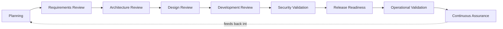
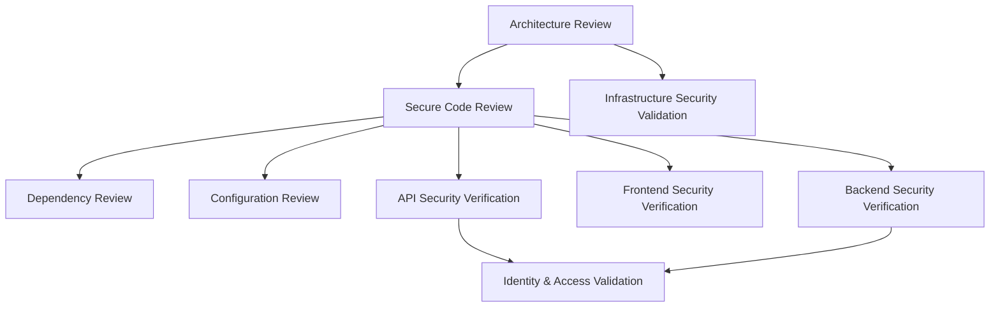
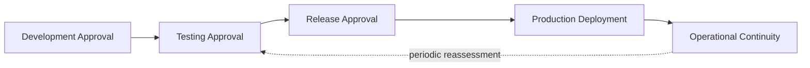
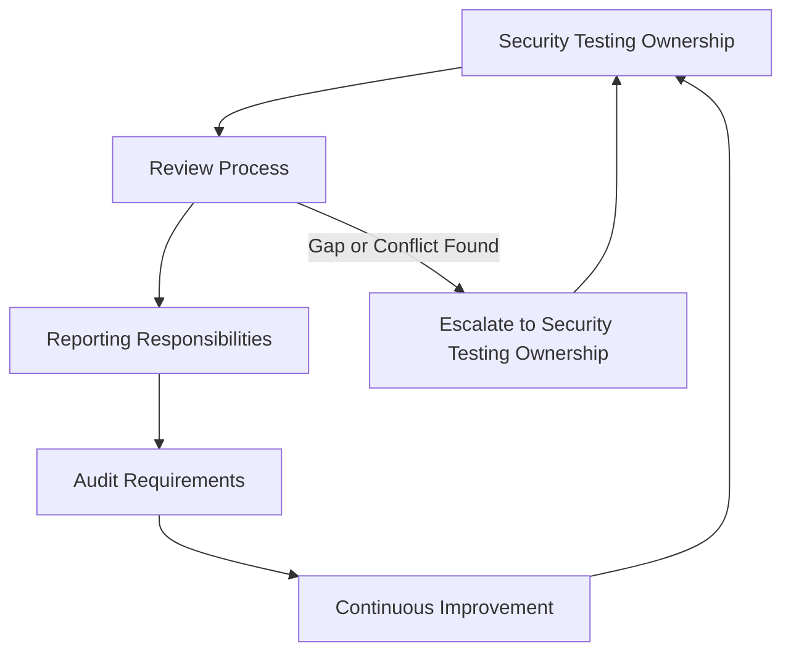

# Security Testing

## 1. Document Purpose

This document defines the official Enterprise Security Testing Strategy for **StackLeo Tech Store**. It establishes how security assumptions across the platform are verified rather than merely trusted, throughout the software lifecycle and in ongoing operation.

- **Purpose of Security Testing** — to ensure that security properties claimed of the platform — proper authentication, correct authorization, sound data protection — are backed by evidence, not assumption.
- **Relationship with Secure SDLC** — this document elaborates the Testing phase of the Secure SDLC defined in `application-security.md` (Section 3), and extends verification activity into every other phase as well.
- **Relationship with Application Security** — security testing is how the design principles and domain protections defined in `application-security.md` are confirmed to actually hold in the built system.
- **Relationship with Risk Management** — this document operationalizes Continuous Validation from `security-principles.md` (Section 5) and `application-security.md` (Section 6), turning risk assessment into concrete, evidence-producing activity.
- **Relationship with Business Resilience** — untested security assumptions are a hidden form of business risk; disciplined security testing keeps that risk visible, supporting the resilience described in `security-principles.md` (Section 9).

This document is implementation-independent and vendor-neutral. It defines security testing philosophy, lifecycle, and governance — not specific testing products, penetration testing procedures, attack techniques, or code.

## 2. Security Testing Philosophy

- **Shift Left Security** — security verification begins as early as requirements and design, not only immediately before release, consistent with the Secure SDLC in `application-security.md` (Section 3).
- **Continuous Verification** — security properties are re-verified as the system changes, never assumed to remain true indefinitely once initially confirmed, consistent with `security-principles.md` (Section 3.10).
- **Risk-Based Testing** — testing effort is directed proportionately to business impact and likelihood, consistent with the Risk Classification in `threat-model.md` (Section 7).
- **Defense in Depth** — no single testing activity is relied upon exclusively; verification occurs across multiple domains (Section 4), consistent with `security-architecture.md` (Section 5).
- **Independent Validation** — security testing includes perspectives independent of the team that built the capability being tested, avoiding the blind spots of self-review alone.
- **Continuous Improvement** — security testing practice matures over time as the codebase, team, and threat landscape evolve, rather than remaining fixed at its initial definition.

## 3. Security Testing Lifecycle

Security verification activity occurs throughout the lifecycle of a capability, not only at a single gate:

| Phase | Objectives | Business Value |
|---|---|---|
| Planning | Identify what security properties the capability must demonstrate before work begins. | Ensures testing scope is defined alongside functional scope, not improvised later. |
| Requirements Review | Confirm security and privacy requirements are complete and testable. | Prevents vague or missing requirements from becoming untestable assumptions. |
| Architecture Review | Verify the proposed structure is consistent with `security-architecture.md`. | Catches structural weaknesses before implementation investment is made. |
| Design Review | Verify the detailed design addresses threats identified in `threat-model.md`. | Confirms threat modeling findings translate into concrete design decisions. |
| Development Review | Verify implementation reflects the reviewed design and secure coding principles. | Catches deviation between intended and actual behavior early. |
| Security Validation | Directly verify security properties (authentication, authorization, data protection) through deliberate testing. | Provides evidence-based confidence rather than assumed correctness. |
| Release Readiness | Confirm all applicable quality gates (Section 6) have been satisfied before production deployment. | Prevents unverified capability from reaching customers. |
| Operational Validation | Verify security properties continue to hold once the capability is live. | Confirms production behavior matches what was tested pre-release. |
| Continuous Assurance | Sustain ongoing verification as the capability and its dependencies evolve. | Prevents security confidence from silently decaying as the system ages. |

*Diagram 1: Security Testing Lifecycle.*

### Security Testing Lifecycle Matrix

| Phase | Primary Verification Activity |
|---|---|
| Planning | Define required security properties and testing scope |
| Requirements Review | Confirm security requirements are complete and testable |
| Architecture Review | Verify structural consistency with `security-architecture.md` |
| Design Review | Verify design addresses identified threats |
| Development Review | Verify implementation matches reviewed design |
| Security Validation | Directly verify security properties through testing |
| Release Readiness | Confirm quality gates are satisfied (Section 6) |
| Operational Validation | Verify security properties hold in production |
| Continuous Assurance | Sustain ongoing verification as the system evolves |

## 4. Security Testing Domains

- **Architecture Review** — *Scope*: proposed structural decisions for new or changed capability. *Objectives*: confirm consistency with `security-architecture.md` and trust-boundary treatment. *Security Benefits*: catches structural weaknesses before they are built.
- **Secure Code Review** — *Scope*: implementation of business logic and security-relevant behavior. *Objectives*: confirm secure coding principles (`application-security.md`, Section 5) are applied consistently. *Security Benefits*: catches implementation-level weaknesses independent of a single author's review.
- **Dependency Review** — *Scope*: third-party libraries and components in use. *Objectives*: confirm dependency governance (`application-security.md`, Section 7) is being followed. *Security Benefits*: reduces supply chain risk introduced through the codebase.
- **Configuration Review** — *Scope*: environment-specific settings governing component behavior. *Objectives*: confirm secure defaults (`security-principles.md`, Section 3.3) are in effect. *Security Benefits*: catches misconfiguration before it becomes exploitable exposure.
- **API Security Verification** — *Scope*: API contracts and their enforcement of identity, authorization, and validation. *Objectives*: confirm the protection principles in `api-security.md` (Section 6) hold in practice. *Security Benefits*: verifies the boundary most frequently exercised by both legitimate and illegitimate traffic.
- **Frontend Security Verification** — *Scope*: the customer- and staff-facing experience layer. *Objectives*: confirm the Zero Trust Client philosophy (`frontend-security.md`, Section 2) is upheld — that the backend never assumes client-reported state is genuine. *Security Benefits*: verifies client-side behavior does not weaken server-side protections.
- **Backend Security Verification** — *Scope*: business logic and server-side processing. *Objectives*: confirm business logic protection and service trust boundaries (`backend-security.md`, Sections 4–5) hold under test. *Security Benefits*: verifies the layer ultimately responsible for enforcing business rules.
- **Infrastructure Security Validation** — *Scope*: the runtime environment underpinning the platform. *Objectives*: confirm environment isolation and workload protection (`infrastructure-security.md`, Sections 5–6) are effective. *Security Benefits*: verifies the foundation every other layer depends upon.
- **Identity & Access Validation** — *Scope*: authentication and authorization behavior across the platform. *Objectives*: confirm assurance levels (`authentication.md`, Section 3) and least-privilege enforcement (`authorization.md`, Section 4) hold as designed. *Security Benefits*: verifies the layer every other access decision depends upon.

### Security Testing Domain Matrix

| Domain | Primary Verification Focus | Related Document |
|---|---|---|
| Architecture Review | Structural consistency with security architecture | `security-architecture.md` |
| Secure Code Review | Implementation-level adherence to design principles | `application-security.md` |
| Dependency Review | Trustworthiness and currency of third-party components | `application-security.md` |
| Configuration Review | Secure-default behavior across environments | `security-principles.md` |
| API Security Verification | Identity, authorization, and validation at API boundaries | `api-security.md` |
| Frontend Security Verification | Zero Trust Client behavior and data handling | `frontend-security.md` |
| Backend Security Verification | Business logic protection and service trust | `backend-security.md` |
| Infrastructure Security Validation | Environment isolation and workload protection | `infrastructure-security.md` |
| Identity & Access Validation | Authentication and authorization enforcement | `authentication.md`, `authorization.md` |

*Diagram 2: Secure SDLC Verification Flow — verification spans structural, implementation, and boundary-specific domains rather than a single generic check.*

## 5. Security Assurance Principles

- **Verification vs Validation** — verification confirms the system was built as designed; validation confirms the design itself actually addresses the intended risk. Both are necessary; neither substitutes for the other.
- **Risk Prioritization** — assurance effort is proportionate to the severity classification in `threat-model.md` (Section 7) and `vulnerability-management.md` (Section 5), not applied uniformly.
- **Evidence-Based Assurance** — confidence in a security property is grounded in the outcome of a specific verification activity, not asserted without supporting evidence.
- **Repeatability** — verification activities are defined clearly enough to be repeated consistently over time, allowing trends to be observed rather than each result standing alone.
- **Auditability** — the outcome of security testing activity is recorded, supporting later review and accountability, consistent with `security-principles.md` (Section 9).
- **Continuous Monitoring** — assurance extends beyond point-in-time testing into ongoing observation of production behavior, per `security-architecture.md` (Section 8).

### Assurance Principle Matrix

| Principle | What It Ensures |
|---|---|
| Verification vs Validation | Both "built correctly" and "addresses the right risk" are confirmed |
| Risk Prioritization | Assurance effort matches business consequence |
| Evidence-Based Assurance | Confidence is grounded in outcomes, not assertion |
| Repeatability | Trends can be observed across consistent verification activity |
| Auditability | Testing outcomes are recorded and reviewable |
| Continuous Monitoring | Assurance extends into ongoing production observation |

## 6. Security Quality Gates

Conceptual quality gates mark points at which a capability must demonstrate sufficient security assurance before proceeding:

- **Development Approval** — design has been reviewed against `security-architecture.md` and `threat-model.md` before implementation begins in earnest.
- **Testing Approval** — implementation has passed the applicable Security Testing Domains (Section 4) relevant to its scope.
- **Release Approval** — all Critical and High findings from testing (per `vulnerability-management.md`, Section 5) are resolved or knowingly accepted through governed exception (Section 7 of that document).
- **Production Deployment** — the deployed capability matches what passed Release Approval, with no undocumented drift.
- **Operational Continuity** — the capability continues to demonstrate its security properties in production through ongoing monitoring and periodic reassessment.

*Diagram 3: Security Quality Gates.*

### Security Quality Gate Summary

| Gate | Passes When |
|---|---|
| Development Approval | Design has been reviewed against architecture and threat model |
| Testing Approval | Applicable testing domains have been satisfied |
| Release Approval | Critical/High findings resolved or governed exception granted |
| Production Deployment | Deployed capability matches approved release, with no undocumented drift |
| Operational Continuity | Security properties continue to hold under ongoing monitoring |

## 7. Security Metrics & Reporting

- **Coverage Awareness** — the organization maintains visibility into which capability has, and has not, received applicable security testing (Section 4).
- **Findings Trends** — the volume and severity of findings over time is tracked to distinguish improving posture from a worsening one.
- **Risk Visibility** — open findings and their severity, per `vulnerability-management.md` (Section 5), remain visible to accountable stakeholders.
- **Remediation Tracking** — the status of remediation for identified findings is tracked to closure, consistent with `vulnerability-management.md` (Section 6).
- **Governance Reporting** — security testing outcomes are reported to the governance function defined in Section 9, proportionate to their severity and business relevance.

## 8. Future Readiness

This strategy is deliberately structured to remain valid as StackLeo's platform and practice evolve:

- **DevSecOps** — the lifecycle in Section 3 is designed to integrate into continuous delivery practice, with verification embedded throughout rather than isolated to a pre-release gate.
- **Cloud-Native Platforms** — the testing domains in Section 4 apply consistently regardless of the specific cloud-native services adopted.
- **Microservices** — as decomposition increases the number of independently deployable components, this strategy's domain-based structure scales without redefinition, verifying each service's boundaries independently.
- **Marketplace Platform** — security testing extends naturally to seller-facing capability as the marketplace launches, using the same domains and quality gates.
- **AI Systems** — AI-assisted capability is subject to the same testing lifecycle and domains as any other component, with particular attention to Identity & Access Validation for its bounded action scope.
- **Multi-Tenant Platforms** — as marketplace and corporate business models mature, testing verifies that tenant isolation (per `authorization.md`, Section 8) holds under test, not only by design.
- **Global Expansion** — security testing principles remain jurisdiction-agnostic, allowing region-specific assurance obligations to layer on via `compliance.md`.

## 9. Governance

- **Security Testing Ownership** — the Security Lead owns the coherence of this security testing strategy, working alongside QA leadership accountable for its execution.
- **Review Process** — this strategy and the testing domains it defines are reviewed periodically and whenever new capability categories or risk context emerge.
- **Audit Requirements** — security testing activity and outcomes are recorded consistently with `security-principles.md` (Section 9).
- **Reporting Responsibilities** — testing outcomes proportionate to severity are reported to the stakeholders defined in the Governance Responsibility Matrix below.
- **Continuous Improvement** — this strategy is expected to mature as testing practice, the codebase, and the threat landscape evolve.

*Diagram 5: Security Testing Governance Framework.*

*Diagram 4: Continuous Security Assurance Model.*

### Governance Responsibility Matrix

| Role | Responsibility |
|---|---|
| Security Lead | Owns coherence and enforcement of the security testing strategy. |
| QA Lead | Executes testing domains and coordinates with Engineering on findings. |
| Engineering Leads | Address findings surfaced through security testing within their domain. |
| Solution Architect | Ensures Architecture Review reflects `security-architecture.md`. |
| Product Manager | Balances release timelines against unresolved Critical/High findings. |
| Internal Audit / Review Function | Independently verifies security testing practice matches this strategy. |

## 10. Anti-Patterns

| Anti-Pattern | Why It's Avoided |
|---|---|
| Testing Only Before Release | Contradicts Shift Left Security (Section 2); defers discovery of weaknesses to the point where they are costliest to fix. |
| No Architecture Review | Allows structural weaknesses to reach implementation before being caught, contradicting Section 4. |
| Ignoring Dependency Risks | Leaves Dependency Review (Section 4) unperformed, allowing supply chain risk to enter unexamined. |
| Weak Security Evidence | Contradicts Evidence-Based Assurance (Section 5); asserts confidence without supporting verification. |
| No Quality Gates | Removes the defined checkpoints in Section 6, allowing unverified capability to reach production. |
| Missing Governance | Allows security testing practice to drift from this strategy with no accountable owner or review mechanism (Section 9). |
| No Continuous Validation | Assumes security properties verified once remain true indefinitely, contradicting Section 2. |
| Reactive Testing | Treats security testing as a response to incidents rather than a continuous discipline embedded throughout the lifecycle (Section 3). |

## 11. Document Information

| Property | Value |
|----------|-------|
| Document | security-testing.md |
| Version | 1.0.0 |
| Status | Active |
| Maintained By | StackLeo |
| Last Updated | 2026-07-17 |

---

© StackLeo. All Rights Reserved.
