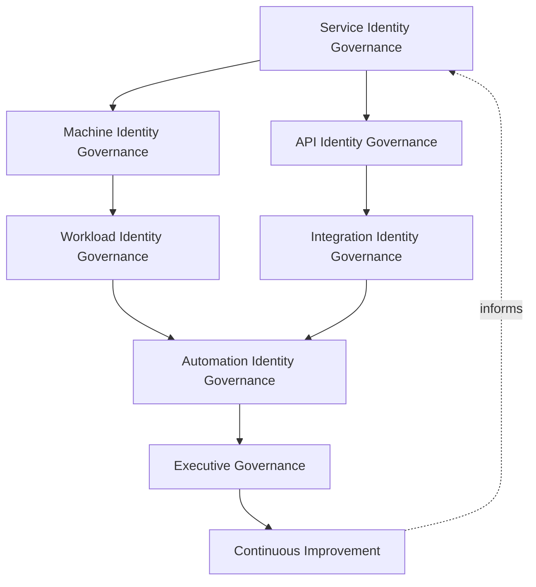
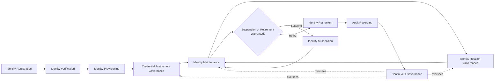
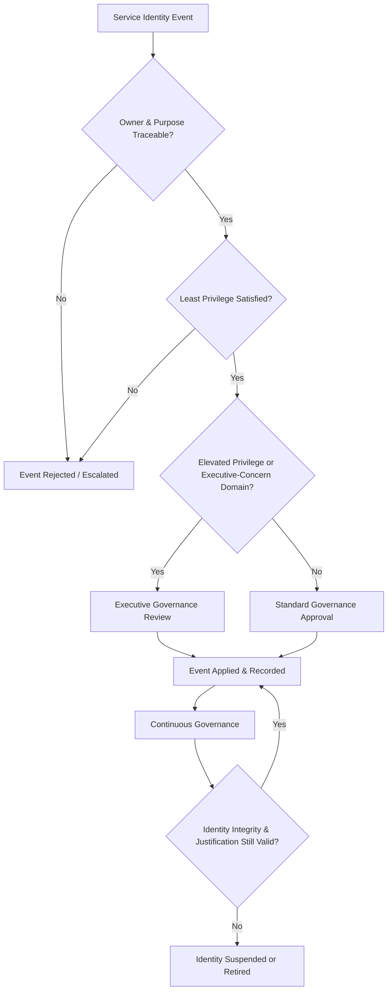
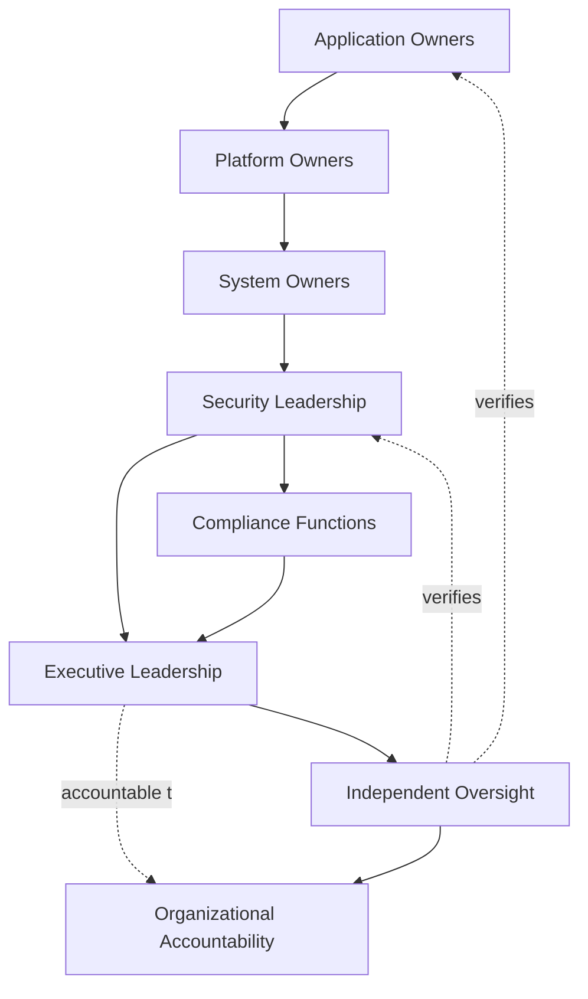
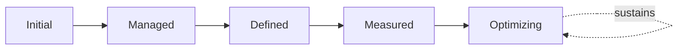

# Enterprise Service & Machine Identity Governance Strategy

## 1. Document Purpose

This document defines the official Enterprise Service & Machine Identity Governance Strategy for **StackLeo Tech Store** — the CISO/CIDO-owned executive charter under which every non-human identity on the platform is governed, from individual application services through infrastructure, integrations, automation, and AI agents. It establishes governance for service identities, machine identities, workload identities, API identities, automation identities, credential governance, organizational accountability, executive oversight, and long-term service identity maturity, consistent with ISO/IEC 27001, the NIST Cybersecurity Framework, Zero Trust principles, and TOGAF enterprise architecture thinking.

`service-accounts-management.md` remains the operational governance framework for non-human identity practice — the document that elaborates in full operational depth how every non-human domain is governed across its lifecycle. This document sits above it as executive mandate, consistent with how `identity-access-strategy.md` charters `identity-access-management.md`, `identity-lifecycle.md` charters `identity-lifecycle-management.md`, `authentication-governance.md` charters `authentication-strategy.md`, and `authorization-governance.md` charters `authorization-model.md`: it does not restate operational detail, it establishes the philosophy, accountability structure, and executive expectations that give that operational practice authority and continuity.

- **Purpose of Service Identity Governance** — to ensure every service, machine, workload, and automated actor on the platform is governed with the same deliberate rigor as a human identity, so that non-human identities — which now typically outnumber human ones — never become an unaccounted-for, ungoverned source of risk.
- **Relationship with Identity & Access Management** — this strategy is the non-human-specific elaboration of `identity-access-strategy.md`; where that strategy governs identity and access as a whole, this document governs specifically how service, machine, and automated identities are established and sustained.
- **Relationship with Authentication Governance** — service identities are verified under `authentication-governance.md`; this strategy governs the broader identity, lifecycle, and ownership structure that verification arrangement depends on.
- **Relationship with Authorization Governance** — non-human permission decisions are governed under `authorization-governance.md`; this strategy defines the dedicated domains and lifecycle those decisions are subject to.
- **Relationship with Zero Trust** — non-human identities are verified under the same "never trust, always verify" posture as human ones, consistent with `zero-trust-strategy.md`; a service's network location or infrastructure origin is never a substitute for genuine identity governance.
- **Relationship with Information Security** — an unaccounted-for service or machine identity is one of the most consequential blind spots in a modern platform's security posture; this strategy protects the posture established in `security-governance.md` by ensuring no non-human actor exists outside deliberate governance.
- **Relationship with Enterprise Governance** — service identity governance is not a separate structure from how StackLeo governs the rest of the business; it is the non-human-specific application of the same executive accountability, policy discipline, and control assurance applied enterprise-wide in `policy-management.md`, `internal-controls.md`, and `audit-governance.md`.

This document is implementation-independent and vendor-neutral. It defines service identity governance philosophy, model, domains, and lifecycle conceptually — not specific cloud providers, secret management systems, IAM vendors, certificate authorities, service mesh technologies, workload identity platforms, Kubernetes platforms, security products, API key implementations, certificate management procedures, secret rotation mechanisms, workload identity implementations, infrastructure configurations, deployment architectures, operational workflows, or code.

## 2. Service Identity Governance Philosophy

Service identity governance at StackLeo rests on eight principles. Each exists to produce a specific business outcome — non-human identity is governed deliberately because it is easily overlooked, not because it is inherently less consequential than human identity.

### 2.1 Every Workload Has an Identity

Every service, workload, and automated process is treated as possessing a distinct, governable identity, never left to operate under an ambient or borrowed trust it was never deliberately granted.

- **Business Value** — ensures every actor on the platform, human or not, can be individually attributed and governed.

### 2.2 Non-Human Identities Require Governance

Service, machine, and automated identities receive the same deliberate governance rigor as human identities, never treated as a lesser concern simply because they cannot advocate for themselves.

- **Business Value** — prevents the platform's growing population of non-human identities from becoming an unaccounted-for, ungoverned source of risk.

### 2.3 Least Privilege for Services

Every non-human identity is granted only the access its defined, specific purpose genuinely requires, never broadened as a convenient shortcut.

- **Business Value** — limits the blast radius of any single compromised non-human identity, which is often granted broad access precisely because no one is watching it closely.

### 2.4 Trust Through Verification

No service or machine identity is trusted based on its network location, deployment context, or infrastructure origin; trust is established through genuine, verifiable identity, consistent with `zero-trust-strategy.md`.

- **Business Value** — ensures compromise of infrastructure or network position alone cannot be mistaken for legitimate identity.

### 2.5 Accountability

Every non-human identity has a single, named human owner accountable for its continued justification, since the identity itself cannot report on its own status.

- **Business Value** — prevents ownership from becoming unknown as the individual who created an identity moves on or forgets.

### 2.6 Identity by Design

Service identity governance structures are established deliberately as a non-human identity domain is introduced, not retrofitted once an unaccounted-for population has already accumulated.

- **Business Value** — prevents the costly, high-visibility discovery of governance gaps only after an incident has already demonstrated their absence.

### 2.7 Business Enablement

Service identity governance exists to let the business build and integrate safely — from core platform services toward future marketplace integrations and AI-assisted capability — not to obstruct legitimate engineering work with disproportionate friction.

- **Business Value** — keeps service identity governance genuinely followed rather than resented and quietly bypassed as an obstacle to real work.

### 2.8 Continuous Improvement

Service identity governance practice matures over time, informed by real review findings, incidents, and the organization's growth in scale and technical complexity.

- **Business Value** — keeps service identity governance aligned with StackLeo's growth in platform scale, integration surface, and automation.

## 3. Enterprise Service Identity Governance Model

Service identity governance operates across eight conceptual layers, each holding accountability for a distinct category of non-human identity. Every layer here is elaborated in full operational depth in `service-accounts-management.md`.

### 3.1 Service Identity Governance

- **Purpose** — own the coherence of how application-level service identities are governed.
- **Governance Scope** — oversight of Application Service Identities (Section 4.1) across their full lifecycle.
- **Business Value** — ensures the identities application components rely on to interact are deliberately managed, not incidentally created.
- **Executive Expectations** — leadership trusts no application service operates under an ungoverned identity.

### 3.2 Machine Identity Governance

- **Purpose** — own the coherence of how infrastructure-level machine identities are governed.
- **Governance Scope** — oversight of Infrastructure Service and Container & Workload Identities (Sections 4.6–4.7).
- **Business Value** — protects the infrastructure layer from unauthorized machine-to-machine interaction.
- **Executive Expectations** — leadership trusts machine identity growth is anticipated as infrastructure scales, not discovered after the fact.

### 3.3 Workload Identity Governance

- **Purpose** — own the coherence of how identity is established for dynamically created and destroyed workloads.
- **Governance Scope** — oversight of Container & Workload Identities (Section 4.7), where identity must remain coherent despite short-lived, frequently changing instances.
- **Business Value** — ensures short-lived compute retains the same governance rigor as long-lived services.
- **Executive Expectations** — leadership trusts workload identity governance keeps pace with dynamic infrastructure, not lagging behind it.

### 3.4 API Identity Governance

- **Purpose** — own the coherence of how identities exchanging data and capability through the platform's API surface are governed.
- **Governance Scope** — oversight of API Identities (Section 4.2), scoped strictly to the specific exchange purpose.
- **Business Value** — protects the API surface connecting StackLeo's own services and future external integrations.
- **Executive Expectations** — leadership trusts API identities are reviewed whenever the underlying capability they expose changes.

### 3.5 Integration Identity Governance

- **Purpose** — own the coherence of how identities representing external system integrations are governed.
- **Governance Scope** — oversight of Integration and Third-Party Integration Identities (Sections 4.3, 4.9), coordinated with `identity-federation.md`.
- **Business Value** — protects the integrations connecting StackLeo to payment, courier, and communication partners.
- **Executive Expectations** — leadership trusts integration identities are scoped narrowly to the specific partner relationship.

### 3.6 Automation Identity Governance

- **Purpose** — own the coherence of how identities driving scheduled, background, and autonomous processes are governed.
- **Governance Scope** — oversight of Background Processing, Scheduled Automation, and AI Agent & Autonomous Service Identities (Sections 4.4–4.5, 4.8).
- **Business Value** — prevents automation from operating under standing, unreviewed trust simply because it runs unattended.
- **Executive Expectations** — leadership trusts automation identities receive the same governance rigor as identities acting under direct human supervision.

### 3.7 Executive Governance

- **Purpose** — own executive-level accountability for the non-human identities carrying the greatest organizational consequence.
- **Governance Scope** — oversight spanning Sections 3.1–3.6 wherever a service identity's potential impact rises to genuine executive concern, coordinated with `privileged-access-management.md`.
- **Business Value** — ensures the most consequential non-human identities are visible at the level accountable for organizational risk.
- **Executive Expectations** — leadership expects to be informed of, not surprised by, the platform's highest-risk service identities.

### 3.8 Continuous Improvement

- **Purpose** — govern the mechanism by which every other layer in this model matures over time.
- **Governance Scope** — consolidates findings from service identity reviews, audits, and incidents across every domain in Section 4.
- **Business Value** — prevents service identity governance itself from becoming the next thing that quietly stagnates as the platform scales.
- **Executive Expectations** — leadership expects service identity maturity to be assessed periodically, not assumed static once established.

### Enterprise Service Identity Governance Matrix

| Layer | Purpose | Business Value | Executive Expectations |
|---|---|---|---|
| Service Identity Governance | Own coherence of application-level service identities | Ensures identities are deliberately managed, not incidental | Trusts no application service operates ungoverned |
| Machine Identity Governance | Own coherence of infrastructure-level machine identities | Protects infrastructure from unauthorized machine interaction | Trusts growth is anticipated as infrastructure scales |
| Workload Identity Governance | Own coherence of dynamic workload identity | Ensures short-lived compute retains the same rigor | Trusts governance keeps pace with dynamic infrastructure |
| API Identity Governance | Own coherence of identities on the API surface | Protects the API surface connecting services and integrations | Trusts identities reviewed when exposed capability changes |
| Integration Identity Governance | Own coherence of external integration identities | Protects integrations commerce depends on | Trusts identities scoped narrowly to specific partnerships |
| Automation Identity Governance | Own coherence of scheduled and autonomous identities | Prevents standing, unreviewed trust for unattended processes | Trusts automation gets the same rigor as supervised identity |
| Executive Governance | Own executive accountability for highest-consequence identities | Ensures the most consequential identities are visible to leadership | Expects leadership informed of, not surprised by, top risk |
| Continuous Improvement | Govern maturation of every other layer | Prevents governance itself from stagnating | Expects maturity to be assessed periodically |

*Diagram 1: Enterprise Service Identity Governance Framework — service and machine identity governance establish the foundation, workload, API, and integration governance apply it across the platform surface, automation governance extends it to unattended actors, and executive oversight converges on continuous improvement that feeds back into the model.*

## 4. Enterprise Service Identity Domains

Non-human identity is governed across ten conceptual domains, each requiring a distinct governance emphasis.

### 4.1 Application Service Identities

- **Purpose** — represent application components interacting with one another to deliver platform functionality.
- **Governance Considerations** — governed under Service Identity Governance (Section 3.1), with standing scoped to the specific component's function.
- **Business Importance** — protects the reliability and integrity of core platform functionality — catalog, checkout, order management.
- **Executive Expectations** — leadership expects application service identities to be inventoried and traceable to a specific owning team.

### 4.2 API Identities

- **Purpose** — represent identities exchanging data and capability through the platform's API surface.
- **Governance Considerations** — governed under API Identity Governance (Section 3.4), scoped strictly to the specific exchange purpose.
- **Business Importance** — protects the API surface that will underpin future Mobile App, marketplace, and partner integrations.
- **Executive Expectations** — leadership expects API identities to be reviewed whenever the capability they expose changes.

### 4.3 Integration Identities

- **Purpose** — represent identities connecting StackLeo to external partners — payment, courier, and communication providers.
- **Governance Considerations** — governed under Integration Identity Governance (Section 3.5), coordinated with `identity-federation.md`.
- **Business Importance** — protects the integrations the commerce experience directly depends on.
- **Executive Expectations** — leadership expects integration identities to be scoped narrowly to each specific partner relationship.

### 4.4 Background Processing Services

- **Purpose** — represent identities driving asynchronous, unattended business processes.
- **Governance Considerations** — governed under Automation Identity Governance (Section 3.6), never assumed lower-risk merely because they run unattended.
- **Business Importance** — protects processes such as order fulfillment, notification, and inventory synchronization that the business depends on continuously.
- **Executive Expectations** — leadership expects background service identities to be inventoried with the same discipline as customer-facing services.

### 4.5 Scheduled Automation

- **Purpose** — represent identities driving time-triggered, recurring processes.
- **Governance Considerations** — governed under Automation Identity Governance (Section 3.6), with standing scoped to the specific scheduled task.
- **Business Importance** — protects routine operational processes — reporting, reconciliation, cleanup — from unauthorized modification.
- **Executive Expectations** — leadership expects scheduled automation identities to be reviewed whenever the underlying task's purpose changes.

### 4.6 Infrastructure Service Identities

- **Purpose** — represent identities used by infrastructure-level components rather than business services.
- **Governance Considerations** — governed under Machine Identity Governance (Section 3.2).
- **Business Importance** — protects the infrastructure layer every business service ultimately depends on.
- **Executive Expectations** — leadership expects infrastructure identity growth to be anticipated as the platform scales, not discovered after the fact.

### 4.7 Container & Workload Identities

- **Purpose** — represent identities for dynamically created and destroyed compute instances.
- **Governance Considerations** — governed under Workload Identity Governance (Section 3.3), where identity coherence must persist despite instance churn.
- **Business Importance** — protects elastic, dynamically scaled infrastructure from inheriting ambient or overly broad trust.
- **Executive Expectations** — leadership expects workload identity governance to scale automatically with infrastructure elasticity.

### 4.8 AI Agent & Autonomous Service Identities

- **Purpose** — represent autonomous or semi-autonomous AI-driven actors performing actions on the platform.
- **Governance Considerations** — governed under Automation Identity Governance (Section 3.6) as a distinct, explicitly inventoried category, anticipating growing AI-assisted capability.
- **Business Importance** — protects against a category of identity that can act at scale and speed, making ungoverned privilege especially consequential.
- **Executive Expectations** — leadership expects AI agent identities to never be governed as an informal extension of the human identity that configured them.

### 4.9 Third-Party Integration Identities

- **Purpose** — represent identities extended to or received from external organizations for system-to-system exchange.
- **Governance Considerations** — governed under Integration Identity Governance (Section 3.5), coordinated with `identity-federation.md`.
- **Business Importance** — enables future marketplace and B2B integrations while protecting against risk from parties outside direct control.
- **Executive Expectations** — leadership expects third-party integration trust to be reviewed and bounded before extension.

### 4.10 Temporary Service Identities

- **Purpose** — represent identities created for a bounded purpose or duration — migrations, testing, short-lived projects.
- **Governance Considerations** — governed jointly across Service and Automation Identity Governance (Sections 3.1, 3.6), with mandatory expiration as a defining characteristic.
- **Business Importance** — prevents temporary technical needs from becoming permanent, unreviewed identities.
- **Executive Expectations** — leadership expects every temporary service identity to carry an explicit expiration, never open-ended by default.

### Enterprise Service Identity Domain Matrix

| Domain | Purpose | Business Importance | Executive Expectations |
|---|---|---|---|
| Application Service Identities | Represent application components interacting with each other | Protects reliability and integrity of core platform functionality | Inventoried and traceable to a specific owning team |
| API Identities | Represent identities on the platform's API surface | Protects the API surface underpinning future integrations | Reviewed whenever exposed capability changes |
| Integration Identities | Represent connections to external partners | Protects integrations commerce directly depends on | Scoped narrowly to each specific partner relationship |
| Background Processing Services | Represent asynchronous, unattended business processes | Protects continuous processes the business depends on | Inventoried with the same discipline as customer-facing services |
| Scheduled Automation | Represent time-triggered, recurring processes | Protects routine operational processes from unauthorized change | Reviewed whenever the underlying task's purpose changes |
| Infrastructure Service Identities | Represent infrastructure-level components | Protects the infrastructure layer every service depends on | Growth anticipated as the platform scales |
| Container & Workload Identities | Represent dynamically created and destroyed compute | Protects elastic infrastructure from ambient, overly broad trust | Governance scales automatically with infrastructure elasticity |
| AI Agent & Autonomous Service Identities | Represent autonomous or semi-autonomous AI-driven actors | Protects against scale-and-speed risk of ungoverned AI privilege | Never governed as an informal human extension |
| Third-Party Integration Identities | Represent external system-to-system exchange | Enables future marketplace/B2B integrations while bounding risk | Trust reviewed and bounded before extension |
| Temporary Service Identities | Represent bounded-purpose or bounded-duration technical needs | Prevents temporary needs becoming permanent identities | Every identity carries an explicit expiration |

## 5. Enterprise Service Identity Lifecycle

Non-human identity is governed across ten conceptual lifecycle stages, applicable across every domain in Section 4.

### 5.1 Identity Registration

- **Purpose** — formally initiate the creation of a new service or machine identity with a stated purpose.
- **Governance Objectives** — require every registration to state its purpose, the domain (Section 4) it belongs to, and its owner.
- **Business Value** — ensures service identity creation is deliberate, not an incidental byproduct of deployment activity.

### 5.2 Identity Verification

- **Purpose** — confirm the registered identity genuinely represents the service or component it claims to be.
- **Governance Objectives** — require verification rigor proportionate to the identity's domain and intended access.
- **Business Value** — ensures the identity entering the managed population is genuine before it is trusted at all.

### 5.3 Identity Provisioning

- **Purpose** — formally establish the verified identity as a managed enterprise record.
- **Governance Objectives** — require provisioning to occur only after verification is complete, never in parallel with it.
- **Business Value** — ensures every service identity's existence is deliberately and traceably established.

### 5.4 Credential Assignment Governance

- **Purpose** — govern how the provisioned identity is equipped with the means to authenticate, consistent with Least Privilege for Services (Section 2.3).
- **Governance Objectives** — require credential assignment to be scoped, recorded, and traceable to the specific identity and purpose.
- **Business Value** — ensures the material a service's trust rests on is itself deliberately governed, never an informal afterthought.

### 5.5 Identity Maintenance

- **Purpose** — keep the identity's attributes, ownership, and purpose current as circumstances change.
- **Governance Objectives** — require maintenance to be triggered by genuine change events, not left to drift indefinitely.
- **Business Value** — ensures service identity records remain an accurate reflection of current technical reality.

### 5.6 Identity Rotation Governance

- **Purpose** — govern the periodic renewal of a service identity's credential material.
- **Governance Objectives** — require rotation to occur on a governed cadence, proportionate to the identity's privilege and exposure.
- **Business Value** — limits how long any single compromised credential remains useful to an attacker.

### 5.7 Identity Suspension

- **Purpose** — deliberately and reversibly disable a service identity without fully removing it, where circumstance warrants.
- **Governance Objectives** — require suspension to be a distinct, recorded state, never conflated with full retirement.
- **Business Value** — provides a proportionate response to circumstances — incident investigation, temporary deployment pause — that do not yet warrant full removal.

### 5.8 Identity Retirement

- **Purpose** — formally and permanently remove a service identity's standing and access once its legitimate purpose has genuinely ended.
- **Governance Objectives** — require retirement to be triggered promptly by the relevant event — service decommission, integration end, project completion.
- **Business Value** — prevents the single most common source of service identity risk: standing access that outlives its legitimate purpose.

### 5.9 Audit Recording

- **Purpose** — record service identity events in a form suitable for independent review.
- **Governance Objectives** — require every registration, credential action, and retirement to leave a durable, reviewable record.
- **Business Value** — ensures service identity governance can be independently verified, not merely asserted.

### 5.10 Continuous Governance

- **Purpose** — sustain oversight of service identities across every stage, rather than treating governance as a one-time gate.
- **Governance Objectives** — require periodic reassessment to run continuously alongside, not only at, discrete lifecycle events.
- **Business Value** — catches an orphaned or unjustified service identity before it becomes a genuine risk.

### Service Identity Lifecycle Matrix

| Stage | Purpose | Governance Objective | Business Value |
|---|---|---|---|
| Identity Registration | Formally initiate creation with a stated purpose | Requests state purpose, domain, and owner | Ensures creation is deliberate, not incidental |
| Identity Verification | Confirm the identity genuinely represents its claim | Rigor proportionate to domain and intended access | Ensures genuineness before the identity is trusted |
| Identity Provisioning | Establish the verified identity as a managed record | Provisioning follows, never parallels, verification | Ensures existence is deliberately, traceably established |
| Credential Assignment Governance | Govern how the identity authenticates | Scoped, recorded, and traceable | Ensures trust material is deliberately governed |
| Identity Maintenance | Keep attributes, ownership, and purpose current | Triggered by genuine change events | Keeps records an accurate reflection of technical reality |
| Identity Rotation Governance | Govern periodic renewal of credential material | Governed cadence proportionate to privilege and exposure | Limits how long a compromised credential remains useful |
| Identity Suspension | Deliberately, reversibly disable an identity | A distinct, recorded state | Provides proportionate response short of full removal |
| Identity Retirement | Formally, permanently remove standing once purpose ends | Triggered promptly by the relevant event | Prevents the most common source of service identity risk |
| Audit Recording | Record events for independent review | Every stage leaves a durable, reviewable record | Ensures governance can be independently verified |
| Continuous Governance | Sustain oversight across every stage | Reassessment runs continuously | Catches orphaned or unjustified identities before they become risk |

*Diagram 2: Service Identity Lifecycle — a service identity proceeds from registration through verification, provisioning, and credential assignment into ongoing maintenance and rotation, with suspension, retirement, and audit recording handling its eventual wind-down under continuous governance.*

## 6. Service Identity Governance Principles

- **Least Privilege** — every non-human identity is granted only the access its defined purpose genuinely requires, consistent with Section 2.3.
- **Accountability** — every service identity traces to a specific, named, human owner responsible for its continued justification.
- **Traceability** — every service identity event can be traced to its business justification, owner, and timing.
- **Auditability** — service identity events — registration, credential actions, suspension, retirement — can be independently reviewed after the fact.
- **Business Alignment** — service identity governance decisions are made in service of genuine technical and business need, never imposed as friction disconnected from real engineering work.
- **Identity Integrity** — a service identity's claimed purpose and actual behavior remain consistent; deviation is treated as a governance signal, not background noise.
- **Risk Awareness** — governance decisions weigh business impact and likelihood, directing scrutiny toward the domains carrying the greatest genuine consequence.
- **Continuous Improvement** — governance practice matures over time, informed by real review findings and incidents.

### Service Identity Governance Principles Matrix

| Principle | Description | Business Value |
|---|---|---|
| Least Privilege | Access scoped to the minimum a defined purpose requires | Limits blast radius of any single compromised identity |
| Accountability | Every identity traces to a specific, named human owner | Ensures identity decisions have a clear, responsible party |
| Traceability | Events traceable to justification, owner, timing | Enables defensible, evidence-based governance decisions |
| Auditability | Events independently reviewable after the fact | Supports ISO/IEC 27001-aligned assurance and audit confidence |
| Business Alignment | Decisions made in service of genuine technical/business need | Keeps governance followed rather than resented as friction |
| Identity Integrity | Claimed purpose and actual behavior remain consistent | Surfaces deviation as a governance signal, not noise |
| Risk Awareness | Decisions weigh business impact and likelihood | Directs scrutiny toward the greatest genuine consequence |
| Continuous Improvement | Practice matures from real review findings and incidents | Keeps governance aligned with organizational and technical growth |

*Diagram 4: Enterprise Service Identity Governance Decision Flow — a service identity event is checked for ownership and least privilege, escalated for executive review where consequential, applied and recorded, then continuously reassessed until reconfirmed or retired.*

## 7. Ownership & Accountability

Governance authority for service identity is distributed deliberately across eight accountable functions, defined here at the governance-objective level, without prescribing specific technical controls.

### 7.1 Application Owners

- **Governance Objective** — each application service identity has an accountable application owner responsible for its continued justification.
- **Business Value** — prevents application identities from persisting without anyone specifically responsible for confirming they still should.

### 7.2 Platform Owners

- **Governance Objective** — platform owners own the identity governance posture of the infrastructure and platform layer as a whole.
- **Business Value** — ensures machine and workload identity governance is coherent across the platform, not fragmented team by team.

### 7.3 System Owners

- **Governance Objective** — each system or integration has an accountable owner responsible for the service identities it exposes or consumes.
- **Business Value** — ensures no system's non-human identity surface is left ungoverned because no one considered it theirs to own.

### 7.4 Security Leadership

- **Governance Objective** — security leadership owns the coherence and enforcement of this strategy across every domain, layer, and stage it defines.
- **Business Value** — provides a single point of accountability for whether service identity governance is genuinely functioning as intended.

### 7.5 Compliance Functions

- **Governance Objective** — compliance functions confirm that service identity governance satisfies applicable regulatory and contractual obligations, coordinated with `compliance.md`.
- **Business Value** — ensures service identity governance protects the business's standing with regulators, partners, and enterprise customers.

### 7.6 Executive Leadership

- **Governance Objective** — executive leadership sets the risk appetite this strategy operates within and holds security leadership accountable for its execution.
- **Business Value** — ensures service identity governance decisions reflect genuine organizational priority, not a delegated technical afterthought.

### 7.7 Independent Oversight

- **Governance Objective** — an independent function, separate from those who design and operate service identity governance, periodically verifies it is genuinely functioning as documented.
- **Business Value** — prevents governance from being assumed effective on the word of the same function responsible for running it.

### 7.8 Organizational Accountability

- **Governance Objective** — accountability for service identity is a property of the organization as a whole, distributed deliberately across Sections 7.1–7.7, not concentrated in or delegated entirely to any single role.
- **Business Value** — ensures no single point of failure exists in the organization's ability to answer "who is accountable for this service identity."

### Ownership & Accountability Matrix

| Role | Governance Objective | Business Value |
|---|---|---|
| Application Owners | Defend the continued justification of an application identity | Prevents identities persisting without a specifically responsible party |
| Platform Owners | Own the identity governance posture of the platform layer | Ensures machine/workload governance is coherent, not fragmented |
| System Owners | Own the service identities a system exposes or consumes | Ensures no system's non-human surface goes ungoverned |
| Security Leadership | Own coherence and enforcement of this strategy | Provides a single point of accountability for governance function |
| Compliance Functions | Confirm alignment with regulatory/contractual obligations | Protects standing with regulators, partners, enterprise customers |
| Executive Leadership | Set risk appetite and hold security leadership accountable | Ensures decisions reflect genuine organizational priority |
| Independent Oversight | Independently verify governance functions as documented | Prevents self-assessed assumption of effectiveness |
| Organizational Accountability | Distribute accountability across every role, not one | Removes single points of failure in accountability |

*Diagram 3: Service Identity Ownership Model — accountability flows from individual application ownership through platform and system ownership into security leadership, with compliance and executive leadership converging on independent oversight and shared organizational accountability.*

## 8. Executive Oversight

- **Service Identity Reviews** — the overall coherence of service identity governance is formally reviewed on a regular cadence, consistent with `security-governance.md` (Section 6).
- **Executive Reporting** — aggregated service identity health — inventory completeness, rotation timeliness, orphaned identity counts — is reported to executive leadership.
- **Service Identity Risk Reviews** — service identity risk from `risk-management.md` and `security-risk-management.md` is reviewed alongside broader enterprise and security risk, never in isolation.
- **Governance Reviews** — the governance model, domains, and lifecycle defined in this strategy (Sections 3–7) are periodically reassessed for continued fitness.
- **Documentation Governance** — this strategy's relationship to `identity-access-strategy.md`, `authentication-governance.md`, `authorization-governance.md`, and `service-accounts-management.md` is kept current as those documents evolve.
- **Audit Readiness** — service identity governance decisions, reviews, and their outcomes are maintained in a state ready for internal or external audit at any time, coordinated with `audit-governance.md`.

### Executive Oversight Matrix

| Oversight Mechanism | Purpose | Governance Role |
|---|---|---|
| Service Identity Reviews | Confirm overall service identity governance coherence | Regular, predictable cadence for the strategy as a whole |
| Executive Reporting | Provide leadership a single, coherent service identity picture | Reports inventory completeness, rotation timeliness, orphaned counts |
| Service Identity Risk Reviews | Review service identity risk alongside broader risk visibility | Not conducted in isolation from enterprise or security risk |
| Governance Reviews | Reassess the governance model itself for continued fitness | Applies to Sections 3–7 of this strategy |
| Documentation Governance | Keep this strategy's subordinate relationships current | Updated as related documents evolve |
| Audit Readiness | Maintain decisions and reviews ready for independent review | Continuous state, coordinated with audit governance |

### Governance Responsibility Matrix

| Role | Responsibility |
|---|---|
| CISO / CIDO | Owns coherence and enforcement of this strategy, in partnership with Executive Leadership. |
| Service Identity Governance Lead | Owns the operational governance model in `service-accounts-management.md` for every domain. |
| Security Leadership | Owns Executive Governance (Section 3.7), the highest-scrutiny governance layer. |
| Platform / Infrastructure Leads | Own Machine and Workload Identity Governance (Sections 3.2–3.3) for infrastructure-level identities. |
| Engineering Leads | Own Service, API, and Automation Identity Governance (Sections 3.1, 3.4, 3.6) for their owned services. |
| Partner / Integration Manager | Coordinates Integration Identity Governance (Section 3.5) for third-party relationships. |
| Executive Leadership | Reviews significant service identity risk exceptions and overall governance health. |
| Independent Oversight / Internal Audit | Independently verifies that service identity governance records reflect actual practice. |

## 9. Future Readiness

This strategy is designed to remain valid as StackLeo evolves in scale, geography, and technical complexity, without requiring redefinition of its underlying philosophy.

- **Autonomous Systems** — increasingly autonomous platform components are governed under the same Least Privilege for Services and Accountability principles (Sections 2.3, 2.5) as any other service identity, regardless of the degree of autonomy involved.
- **AI Agents** — as AI-assisted capability expands, AI Agent & Autonomous Service Identities (Section 4.8) are governed as a distinct, explicitly inventoried category, never as an informal extension of a human or application identity.
- **Cloud-Native Evolution** — Machine and Workload Identity Governance (Sections 3.2–3.3) are defined independently of any specific runtime, so they apply unchanged as infrastructure approaches evolve.
- **Multi-Cloud Environments** — this strategy's governance model, domains, and lifecycle are defined independently of any specific infrastructure provider, so they extend coherently across future multi-environment deployment.
- **Multi-Tenant Platforms** — where future architecture introduces tenant isolation, service identity governance extends to explicitly scope non-human access per tenant.
- **Enterprise Scale** — the governance model, domains, and lifecycle defined throughout this strategy are defined independently of organizational or platform size, so they remain coherent as the non-human identity population grows substantially.
- **Identity Intelligence** — Continuous Governance (Section 5.10) and Continuous Improvement (Section 3.8) are structured to absorb increasingly automated, evidence-driven identity insight as it becomes available.
- **Future Digital Ecosystems** — Third-Party Integration Identities (Section 4.9) and Integration Identity Governance (Section 3.5) are structured to absorb genuinely new categories of digital ecosystem relationship as StackLeo's integration surface grows.

## 10. Service Identity Governance Maturity Model

Service identity governance maturity is described across five conceptual levels, consistent with established process maturity thinking and NIST Cybersecurity Framework tiers.

- **Initial** — service identity governance, where it exists, is informal and inconsistent; identities are created without regular review, and ownership is unclear.
- **Managed** — basic governance exists for individual service identity domains, but consistency across the ten domains in Section 4 varies significantly.
- **Defined** — the governance model, domains, and lifecycle are standardized, documented, and consistently applied across the organization, consistent with the model defined throughout this strategy.
- **Measured** — inventory completeness, rotation timeliness, and orphaned identity counts are measured systematically, and decisions are grounded in genuine evidence rather than qualitative impression alone.
- **Optimizing** — service identity governance is continuously and deliberately improved based on quantitative evidence and organizational learning; improvement itself is a managed, ongoing discipline rather than an occasional initiative.

### Service Identity Maturity Model Matrix

| Level | Characteristics | Primary Focus |
|---|---|---|
| Initial | Informal, inconsistent governance; identities created without review | Ad hoc, individually-dependent service identity practice |
| Managed | Basic governance exists per domain; consistency varies | Domain-level consistency |
| Defined | Standardized governance model, domains, and lifecycle | Organization-wide consistency and clear ownership |
| Measured | Inventory completeness and rotation timeliness measured systematically | Evidence-based service identity governance decisions |
| Optimizing | Practice continuously and deliberately improved from evidence | Sustained, deliberate improvement as a discipline |

*Diagram 5: Continuous Service Identity Improvement Cycle — service identity review and audit outcomes are measured, learned from, improved upon, and standardized back into governed practice, on a continuing basis.*

*Diagram 6: Service Identity Maturity Progression Model — maturity advances from informal, unreviewed service identity practice toward standardized, measured, and continuously optimized service identity governance.*

## 11. Anti-Patterns

The following recurring failure patterns are explicitly recognized and avoided, as each one structurally undermines this strategy.

### Anti-Pattern Summary

| Anti-Pattern | Why It's Avoided |
|---|---|
| Shared Service Credentials | Contradicts Accountability (Section 2.5); credentials shared across multiple services destroy individual attribution for any action taken. |
| Orphaned Service Accounts | Contradicts Every Workload Has an Identity (Section 2.1); identities with no traceable owner or purpose accumulate into an unmanageable, ungoverned population. |
| Unknown Ownership | Contradicts Application Owners (Section 7.1); a service identity without a clear owner has no one specifically responsible for its continued justification. |
| Excessive Service Privileges | Contradicts Least Privilege for Services (Section 2.3); access broader than genuine need increases the consequence of any single compromised identity. |
| Weak Executive Visibility | Contradicts Executive Reporting (Section 8); leadership cannot govern service identity risk it is never shown. |
| Poor Documentation | Undermines Documentation Governance (Section 8) and Traceability (Section 6), leaving service identity decisions unclear or unverifiable after the fact. |
| Siloed Identity Governance | Contradicts the Enterprise Service Identity Governance Model (Section 3); domain-by-domain practice that never converges leaves no coherent, organization-wide picture of non-human identity risk. |
| Missing Continuous Improvement | Contradicts Continuous Improvement (Section 2.8) and Continuous Improvement (Section 3.8); without deliberate improvement, governance stagnates as the platform and identity population grow. |

## 12. Document Information

| Property | Value |
|----------|-------|
| Document | service-identity-governance.md |
| Version | 1.0.0 |
| Status | Active |
| Maintained By | StackLeo |
| Last Updated | 2026-07-24 |

---

© StackLeo. All Rights Reserved.
