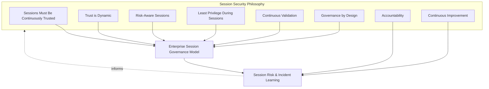
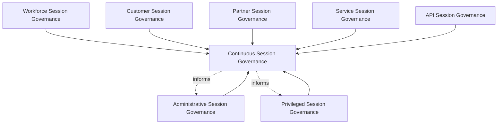
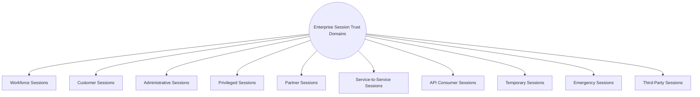
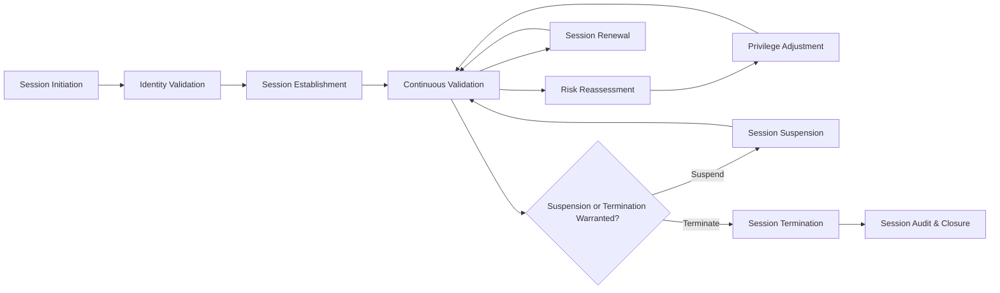
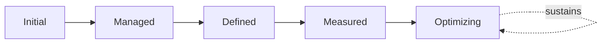
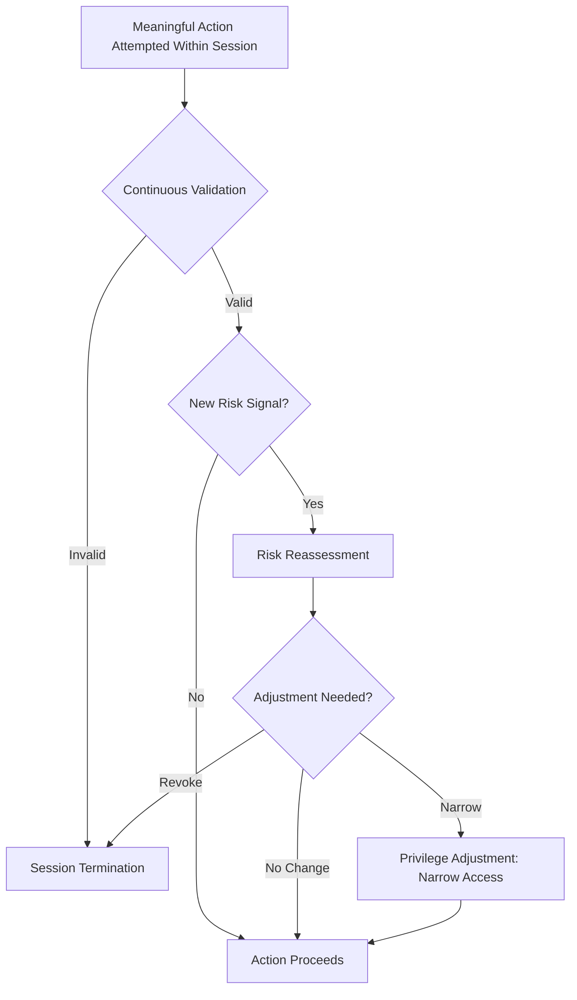
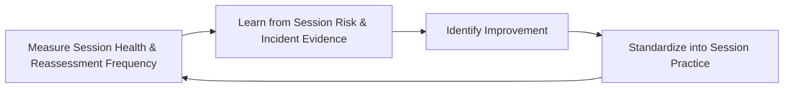

# Enterprise Session Security Governance Strategy

## 1. Document Purpose

This document defines the official Enterprise Session Security Governance Strategy for **StackLeo Tech Store**. It establishes how trust is sustained, re-evaluated, and eventually withdrawn across the entire duration of an active session — independent of any specific session management library, IAM vendor, browser technology, authentication product, or security tool.

Session Trust Governance is referenced in `zero-trust-strategy.md` (Section 3.3) as one of eight governance layers in the broader Zero Trust model; this document is that layer's full, dedicated elaboration. Sessions warrant this dedicated treatment because a single, correct trust decision made at login says nothing about whether that same trust remains warranted a minute, an hour, or a day later — session security is what makes Continuous Verification (`zero-trust-strategy.md`, Section 2.2) genuinely operational rather than aspirational.

- **Purpose of Session Security** — to ensure that trust extended for the duration of a session is never treated as a single, permanent decision, but is continuously sustained, re-evaluated, and withdrawn the moment it is no longer justified.
- **Relationship with Zero Trust** — this document is the dedicated elaboration of Session Trust Governance in `zero-trust-strategy.md` (Section 3.3); every principle in that framework applies here, adapted to the specific characteristics of sustained, ongoing access.
- **Relationship with Identity & Access Management** — a session exists only after `identity-access-management.md` governance has established a legitimate, active identity; this document governs what happens to trust across the lifetime of that identity's ongoing interaction with the platform.
- **Relationship with Authentication** — `authentication-strategy.md` establishes identity confidence at the moment of initial verification; this document governs how that confidence is sustained, degraded, or renewed for as long as the resulting session remains active.
- **Relationship with Authorization** — session trust level can inform the scope of what `authorization-model.md` permits at any given moment within a session, ensuring authorization decisions reflect current, not merely initial, trust.
- **Relationship with Device Trust** — session trust and device trust are evaluated together but distinctly, consistent with `device-trust.md`; a session's device posture is one of the signals session-level risk reassessment depends on.
- **Relationship with Enterprise Security Governance** — this document operates within the broader governance model and executive accountability established in `security-governance.md`, applying it to the window of time — the active session — during which most genuine platform interaction actually occurs.

This document is implementation-independent and vendor-neutral. It defines session security governance philosophy, model, domains, and lifecycle conceptually — not specific session management libraries, IAM vendors, browser technologies, authentication products, cloud providers, security tools, cookie configurations, session timeout values, token handling, browser storage methods, infrastructure configurations, deployment architectures, or implementation workflows.

## 2. Session Security Philosophy

Session security governance at StackLeo is built on eight principles. Each exists to produce a specific business outcome — sessions are governed continuously because most of a platform's genuine risk exposure occurs during, not at the boundary of, active use.

### 2.1 Sessions Must Be Continuously Trusted

A session's trust is never established once and assumed to persist; it is continuously sustained through ongoing evaluation for as long as the session remains active.

- **Business Value** — closes the gap a one-time login check leaves open for the remainder of a session, which is typically the longest and highest-exposure phase of any access relationship.

### 2.2 Trust is Dynamic

A session's effective trust level can rise or, more importantly, fall in response to newly observed conditions, never fixed at the level established when the session began.

- **Business Value** — allows the organization to respond to emerging risk within a session immediately, rather than waiting for the session to naturally end.

### 2.3 Risk-Aware Sessions

The rigor of session validation and the scope of what a session permits scale with the sensitivity of the action being requested at any given moment, consistent with ISO 31000 thinking.

- **Business Value** — directs validation friction toward the moments that carry genuine consequence, rather than applying uniform scrutiny throughout an entire session regardless of stakes.

### 2.4 Least Privilege During Sessions

A session's effective access reflects only what its current, genuine purpose requires at that moment, never the broadest access the underlying identity could theoretically hold.

- **Business Value** — limits the consequence of a session being hijacked or misused mid-use, since even a compromised session carries only the access genuinely warranted in the moment.

### 2.5 Continuous Validation

Every meaningful action within a session is validated against current trust and authorization, not merely against the state that existed at session start.

- **Business Value** — ensures a session's actions remain governed throughout its life, not only at its inception.

### 2.6 Governance by Design

Session governance structures are established deliberately as new session types and channels are introduced, not retrofitted once ungoverned or long-lived sessions have already accumulated.

- **Business Value** — prevents the costly, high-visibility discovery of session governance gaps only after a session-based compromise has already demonstrated their absence.

### 2.7 Accountability

Every session traces to a specific, identifiable identity and, where applicable, an accountable human owner, never left ambiguous or anonymous.

- **Business Value** — ensures the organization can always determine whose session was responsible for a given action.

### 2.8 Continuous Improvement

Session security governance practice matures over time, informed by real session risk findings, incidents, and the organization's growth in channels and session diversity.

- **Business Value** — keeps session governance aligned with StackLeo's growth from Web toward future Mobile App, Physical Store, and POS channels.

*Diagram: Session Security Philosophy Overview — the eight principles shape the enterprise session governance model, and session risk and incident learning feed back into the philosophy itself.*

## 3. Enterprise Session Governance Model

Session governance operates across eight conceptual layers, each holding accountability for a distinct category of session.

### 3.1 Workforce Session Governance

- **Purpose** — own the governance of sessions established by StackLeo's own employees and contractors.
- **Governance Scope** — coordinated with Workforce Identity Governance in `identity-lifecycle-management.md` (Section 3.1).
- **Business Value** — ensures internal session trust reflects current employment status and role throughout the session's duration.
- **Executive Expectations** — leadership expects workforce sessions to be terminated promptly upon any change in employment status.

### 3.2 Customer Session Governance

- **Purpose** — own the governance of sessions established during customer account access and checkout.
- **Governance Scope** — coordinated with Customer Identity Governance in `identity-access-management.md` (Section 3.5).
- **Business Value** — protects the trust relationship every customer transaction depends on, without imposing disproportionate friction on genuine shoppers.
- **Executive Expectations** — leadership expects customer session governance to balance security and usability deliberately.

### 3.3 Administrative Session Governance

- **Purpose** — own the elevated governance rigor sessions with administrative capability require.
- **Governance Scope** — coordinated with Administrative Access Governance in `authorization-model.md` (Section 3.4).
- **Business Value** — ensures sessions capable of the greatest platform impact receive commensurately stronger continuous validation.
- **Executive Expectations** — leadership expects administrative sessions to be shorter-lived and more closely monitored than ordinary sessions.

### 3.4 Privileged Session Governance

- **Purpose** — own the dedicated, heightened governance of sessions operating under privileged access.
- **Governance Scope** — coordinated with `privileged-access-management.md` (Section 5), applying that framework's elevated rigor specifically to the session dimension.
- **Business Value** — ensures the highest-consequence sessions are governed with the highest available scrutiny.
- **Executive Expectations** — leadership expects privileged sessions to be time-bound and never left standing indefinitely.

### 3.5 Partner Session Governance

- **Purpose** — own the governance of sessions established by future marketplace sellers and B2B partners.
- **Governance Scope** — anticipates the multi-vendor marketplace model, coordinated with `identity-federation.md` (Section 3.3).
- **Business Value** — will become foundational to safely enabling seller session access as the marketplace launches.
- **Executive Expectations** — leadership expects partner session governance to be designed ahead of, not after, marketplace launch.

### 3.6 Service Session Governance

- **Purpose** — own the governance of session-like trust relationships between application-level service accounts.
- **Governance Scope** — coordinated with `service-accounts-management.md` (Section 3.1).
- **Business Value** — prevents service-to-service trust from persisting beyond the specific interaction it was established for.
- **Executive Expectations** — leadership trusts service sessions receive the same governance rigor as human sessions.

### 3.7 API Session Governance

- **Purpose** — own the governance of session-like trust relationships with API-consuming clients.
- **Governance Scope** — coordinated with `05_API/api-security.md` and API Trust in `zero-trust-strategy.md` (Section 4.9).
- **Business Value** — protects every current and future channel simultaneously, since compromised API session trust affects all consumers of it at once.
- **Executive Expectations** — leadership expects API session governance to scale consistently as channels multiply.

### 3.8 Continuous Session Governance

- **Purpose** — govern the mechanism by which every other layer in this model matures over time.
- **Governance Scope** — consolidates findings from Session Audit & Closure (Section 5.10) and executive oversight (Section 7).
- **Business Value** — prevents session governance itself from becoming the next thing that quietly stagnates as session volume grows.
- **Executive Expectations** — leadership expects session security maturity to be assessed periodically, not assumed static once established.

### Enterprise Session Governance Matrix

| Layer | Purpose | Business Value | Executive Expectations |
|---|---|---|---|
| Workforce Session Governance | Own governance of employee/contractor sessions | Reflects current employment status and role throughout | Terminated promptly upon employment status change |
| Customer Session Governance | Own governance of customer account/checkout sessions | Protects trust without disproportionate customer friction | Balances security and usability deliberately |
| Administrative Session Governance | Own elevated rigor for administrative-capability sessions | Ensures greatest-impact sessions get stronger validation | Shorter-lived and more closely monitored |
| Privileged Session Governance | Own heightened governance of privileged-access sessions | Ensures highest-consequence sessions get highest scrutiny | Time-bound, never standing indefinitely |
| Partner Session Governance | Own governance of marketplace seller/B2B partner sessions | Foundational to safely enabling seller session access | Designed ahead of, not after, marketplace launch |
| Service Session Governance | Own governance of service-to-service trust relationships | Prevents trust persisting beyond the specific interaction | Same rigor as human sessions |
| API Session Governance | Own governance of API-consuming client trust relationships | Protects every current/future channel simultaneously | Scales consistently as channels multiply |
| Continuous Session Governance | Govern maturation of every other layer | Prevents governance itself from stagnating | Maturity assessed periodically |

*Diagram 1: Enterprise Session Governance Framework — seven domain-specific governance layers feed continuous session governance, which in turn informs the ongoing practice of every domain, especially the highest-risk ones.*

## 4. Enterprise Session Trust Domains

Session trust is organized across ten conceptual domains, each requiring a somewhat different governance emphasis.

### 4.1 Workforce Sessions

- **Purpose** — represent active sessions established by StackLeo's own employees and contractors, per Section 3.1.
- **Governance Scope** — tied to the workforce identity lifecycle, terminated upon employment status change.
- **Business Importance** — protects internal systems from access continuing after an employee's status has genuinely changed.
- **Executive Expectations** — leadership expects workforce sessions to be visible and centrally accounted for.

### 4.2 Customer Sessions

- **Purpose** — represent active sessions during customer browsing, account access, and checkout, per Section 3.2.
- **Governance Scope** — coordinated with the customer journey defined in `02_Product/user-journeys.md`.
- **Business Importance** — foundation of the direct-to-consumer relationship and repeat commerce.
- **Executive Expectations** — leadership expects customer session governance to protect trust without adding shopping friction.

### 4.3 Administrative Sessions

- **Purpose** — represent sessions with elevated capability to administer platform, security, or business-critical systems, per Section 3.3.
- **Governance Scope** — the second-highest-scrutiny domain in this framework, below Privileged Sessions.
- **Business Importance** — protects against a significant category of session-based compromise consequence.
- **Executive Expectations** — leadership expects administrative session activity to be closely monitored throughout its duration.

### 4.4 Privileged Sessions

- **Purpose** — represent sessions operating under the highest tier of privileged access, per Section 3.4.
- **Governance Scope** — governed jointly with `privileged-access-management.md` (Section 5, Privileged Access Lifecycle).
- **Business Importance** — protects against the single highest-consequence category of session compromise.
- **Executive Expectations** — leadership expects privileged sessions to receive the framework's most rigorous continuous validation.

### 4.5 Partner Sessions

- **Purpose** — represent sessions established by future marketplace sellers and B2B relationships, per Section 3.5.
- **Governance Scope** — anticipates the multi-vendor marketplace model.
- **Business Importance** — will become foundational to the marketplace business model as it launches.
- **Executive Expectations** — leadership expects partner session governance to be designed before it is needed.

### 4.6 Service-to-Service Sessions

- **Purpose** — represent ongoing trust relationships between application-level service accounts, per Section 3.6.
- **Governance Scope** — coordinated with `service-accounts-management.md` (Section 4.1, Service Accounts).
- **Business Importance** — protects internal service-to-service communication from trust that outlives its legitimate interaction.
- **Executive Expectations** — leadership expects service session duration to be scoped to genuine, ongoing need.

### 4.7 API Consumer Sessions

- **Purpose** — represent trust relationships with clients consuming StackLeo's APIs, per Section 3.7.
- **Governance Scope** — coordinated with `05_API/authentication.md`.
- **Business Importance** — protects every current and future channel simultaneously.
- **Executive Expectations** — leadership expects API consumer session governance to scale as channels multiply.

### 4.8 Temporary Sessions

- **Purpose** — represent sessions granted for a bounded purpose or duration.
- **Governance Scope** — coordinated with Temporary Access in `authorization-model.md` (Section 4.9), with mandatory expiration as a defining characteristic.
- **Business Importance** — prevents temporary access needs from becoming permanent, unreviewed session grants.
- **Executive Expectations** — leadership expects every temporary session to carry an explicit, enforced expiration.

### 4.9 Emergency Sessions

- **Purpose** — represent sessions established to resolve significant, active harm through emergency or break-glass access.
- **Governance Scope** — coordinated with Emergency Access Governance in `privileged-access-management.md` (Section 3.4).
- **Business Importance** — allows urgent response without abandoning session governance discipline entirely.
- **Executive Expectations** — leadership expects every emergency session to be reviewed after the fact without exception.

### 4.10 Third-Party Sessions

- **Purpose** — represent sessions established by external identities StackLeo does not directly control.
- **Governance Scope** — governed jointly with `identity-federation.md` (Section 4.7, Third-Party Service Providers).
- **Business Importance** — protects against risk introduced by parties outside StackLeo's direct organizational control.
- **Executive Expectations** — leadership expects third-party session trust to be reviewed before extension, not assumed.

### Session Trust Domain Matrix

| Domain | Purpose | Business Importance | Executive Expectations |
|---|---|---|---|
| Workforce Sessions | Represent employee/contractor active sessions | Protects internal systems from access outliving status | Visible and centrally accounted for |
| Customer Sessions | Represent browsing, account, checkout sessions | Foundation of the direct-to-consumer relationship | Protects trust without adding shopping friction |
| Administrative Sessions | Represent elevated administrative-capability sessions | Protects against significant compromise consequence | Closely monitored throughout duration |
| Privileged Sessions | Represent the highest tier of privileged-access sessions | Protects against the highest-consequence compromise category | Receive the most rigorous continuous validation |
| Partner Sessions | Represent marketplace seller/B2B partner sessions | Foundational to the future marketplace business model | Designed before it is needed |
| Service-to-Service Sessions | Represent ongoing service account trust relationships | Protects communication from trust outliving interactions | Duration scoped to genuine, ongoing need |
| API Consumer Sessions | Represent API-consuming client trust relationships | Protects every current/future channel simultaneously | Governance scales as channels multiply |
| Temporary Sessions | Represent bounded-purpose or bounded-duration sessions | Prevents temporary needs becoming permanent grants | Every session carries explicit, enforced expiration |
| Emergency Sessions | Represent break-glass sessions resolving active harm | Allows urgent response without abandoning discipline | Reviewed after the fact without exception |
| Third-Party Sessions | Represent external, uncontrolled identity sessions | Protects against risk from parties outside control | Trust reviewed before extension, never assumed |

*Diagram 3: Continuous Session Trust Evaluation Model (domain view) — ten domains, each requiring a governance emphasis proportionate to its trust level and business role.*

## 5. Session Lifecycle

Session trust is governed across ten conceptual lifecycle stages.

### 5.1 Session Initiation

- **Purpose** — formally recognize that a new session is beginning in response to a successful access request.
- **Governance Objectives** — require every session to be captured as a discrete, trackable entity from its very first moment.
- **Business Value** — ensures session governance begins deliberately, not as an incidental byproduct of successful login.

### 5.2 Identity Validation

- **Purpose** — confirm the identity underlying the session is genuinely verified, consistent with `authentication-strategy.md` (Section 5.4, Authentication Validation).
- **Governance Objectives** — require validation to occur before Session Establishment (Section 5.3) proceeds.
- **Business Value** — ensures every session rests on a genuinely confirmed identity foundation.

### 5.3 Session Establishment

- **Purpose** — formally activate the session with its initial trust level and scope, consistent with Least Privilege During Sessions (Section 2.4).
- **Governance Objectives** — require initial scope to be proportionate to genuine, stated need, never broader.
- **Business Value** — ensures every session begins in a deliberate, well-understood state.

### 5.4 Continuous Validation

- **Purpose** — validate every meaningful action within the session against current trust and authorization, consistent with Section 2.5.
- **Governance Objectives** — connect validation directly to `09_OPERATIONS/monitoring-observability.md` for evidentiary grounding.
- **Business Value** — ensures the session's actions remain governed throughout its life, not only at its inception.

### 5.5 Risk Reassessment

- **Purpose** — formally re-evaluate the session's trust level as new signals — device posture, behavior, context — emerge.
- **Governance Objectives** — require reassessment triggers to be defined and consistently applied, feeding Continuous Session Governance (Section 3.8).
- **Business Value** — allows session trust to reflect genuinely current conditions, not only conditions at session start.

### 5.6 Privilege Adjustment

- **Purpose** — modify the session's effective access in response to risk reassessment findings.
- **Governance Objectives** — require adjustment to be capable of both narrowing and widening access, proportionate to genuinely observed risk.
- **Business Value** — allows session trust to shrink immediately when risk increases, without waiting for the session to naturally end.

### 5.7 Session Renewal

- **Purpose** — extend a session's validity where genuine, continued need exists and trust remains justified.
- **Governance Objectives** — require renewal to itself involve a fresh trust evaluation, never an automatic, unexamined extension.
- **Business Value** — supports legitimate, sustained use without treating renewal as a rubber stamp.

### 5.8 Session Suspension

- **Purpose** — deliberately and reversibly disable a session without fully terminating it, where circumstance warrants.
- **Governance Objectives** — require suspension to be a distinct, recorded state, never conflated with full termination.
- **Business Value** — provides a proportionate response to circumstances (suspected anomaly, pending investigation) that do not yet warrant full termination.

### 5.9 Session Termination

- **Purpose** — formally and deliberately end a session once its legitimate purpose has genuinely concluded or trust is no longer justified.
- **Governance Objectives** — require termination to be executable rapidly, without dependency on a lengthy process, consistent with `zero-trust-strategy.md` (Section 5.9, Trust Revocation).
- **Business Value** — limits the impact of a compromised or no-longer-legitimate session to the shortest possible window.

### 5.10 Session Audit & Closure

- **Purpose** — formally record the session's complete history and close its governance record.
- **Governance Objectives** — require audit records to be retained consistent with `04_Database/data-retention.md` and `compliance.md`.
- **Business Value** — provides the evidentiary foundation for investigation, compliance, and Continuous Session Governance (Section 3.8) improvement.

### Session Lifecycle Matrix

| Stage | Purpose | Governance Objective | Business Value |
|---|---|---|---|
| Session Initiation | Recognize a new session beginning | Captured as a discrete, trackable entity | Ensures governance begins deliberately, not incidentally |
| Identity Validation | Confirm the underlying identity is genuinely verified | Occurs before session establishment | Ensures the session rests on a confirmed foundation |
| Session Establishment | Activate the session with initial trust and scope | Initial scope proportionate to genuine, stated need | Every session begins in a deliberate, well-understood state |
| Continuous Validation | Validate every meaningful action against current trust | Connected to observability practice | Ensures actions remain governed throughout the session's life |
| Risk Reassessment | Re-evaluate trust as new signals emerge | Triggers defined and consistently applied | Reflects genuinely current, not only initial, conditions |
| Privilege Adjustment | Modify effective access per reassessment findings | Capable of both narrowing and widening access | Allows trust to shrink immediately as risk increases |
| Session Renewal | Extend validity where genuine need and trust persist | Renewal itself involves a fresh trust evaluation | Supports legitimate use without automatic, unexamined extension |
| Session Suspension | Deliberately, reversibly disable without termination | A distinct, recorded state | Provides proportionate response short of full termination |
| Session Termination | Formally end a session once purpose concludes | Executable rapidly, no lengthy dependency | Limits impact of a compromised session to the shortest window |
| Session Audit & Closure | Record complete history and close the record | Retained consistent with retention and compliance practice | Provides evidentiary foundation for investigation and improvement |

*Diagram 2: Session Lifecycle — a session proceeds from initiation and identity validation through establishment into ongoing continuous validation, risk reassessment, and adjustment, with renewal, suspension, termination, and audit closure handling its evolution and eventual wind-down.*

## 6. Session Governance Principles

- **Explicit Trust** — no session trust exists implicitly; every session's trust level is deliberately established and re-evaluated, consistent with Section 2.1.
- **Continuous Validation** — trust already granted for a session remains subject to ongoing verification for as long as it is in effect, consistent with Section 2.5.
- **Least Privilege** — a session's effective access reflects only its current, genuine purpose, consistent with Section 2.4.
- **Accountability** — every session traces to a specific, identifiable identity, consistent with Section 2.7.
- **Traceability** — every session's complete history — establishment, adjustment, renewal, termination — can be reconstructed after the fact.
- **Auditability** — session governance decisions and their outcomes can be independently reviewed, supporting ISO/IEC 27001-aligned assurance.
- **Risk Awareness** — session governance decisions are made with explicit awareness of the risk a given session domain represents.
- **Continuous Improvement** — session security governance practice matures over time, informed by real review findings and incidents.

### Session Governance Principles Matrix

| Principle | Description | Business Value |
|---|---|---|
| Explicit Trust | No session trust exists implicitly | Prevents trust from accumulating without genuine evaluation |
| Continuous Validation | Trust remains subject to ongoing verification | Prevents trust from becoming stale or assumed |
| Least Privilege | Effective access reflects only current, genuine purpose | Limits consequence of a hijacked or misused session |
| Accountability | Every session traces to a specific, identifiable identity | Ensures actions within a session are attributable |
| Traceability | Complete session history can be reconstructed | Enables defensible, evidence-based governance decisions |
| Auditability | Decisions and outcomes independently reviewable | Supports ISO/IEC 27001-aligned assurance and audit confidence |
| Risk Awareness | Decisions made with awareness of domain-specific risk | Enables deliberate, informed governance prioritization |
| Continuous Improvement | Governance matures from real review findings | Keeps session governance aligned with organizational growth |

## 7. Executive Oversight

- **Session Governance Reviews** — the overall coherence of session governance across every domain (Section 4) is formally reviewed on a regular cadence, consistent with `zero-trust-strategy.md` (Section 7).
- **Executive Reporting** — aggregated session health — active session counts, suspension and termination trends, privileged session duration — is reported to executive leadership, coordinated with `09_OPERATIONS/operations-metrics-kpis.md`.
- **Risk Reviews** — session-related risk from `security-risk-management.md` (Section 4) is reviewed alongside broader identity and Zero Trust risk.
- **Compliance Reviews** — session governance practice is reviewed against applicable regulatory and contractual obligations, coordinated with `compliance.md`.
- **Documentation Governance** — this framework's relationship to `zero-trust-strategy.md`, `authentication-strategy.md`, `authorization-model.md`, and `privileged-access-management.md` is kept current as those documents evolve.
- **Audit Readiness** — session governance decisions, reviews, and their outcomes are maintained in a state ready for internal or external audit at any time.

### Executive Oversight Matrix

| Oversight Mechanism | Purpose | Governance Role |
|---|---|---|
| Session Governance Reviews | Confirm overall governance coherence across domains | Regular, predictable cadence for the framework as a whole |
| Executive Reporting | Provide leadership a single, coherent session health picture | Coordinated with enterprise operational KPI reporting |
| Risk Reviews | Review session risk alongside broader identity/Zero Trust risk | Not conducted in isolation from enterprise risk visibility |
| Compliance Reviews | Confirm alignment with regulatory/contractual obligations | Reviewed jointly with `compliance.md` |
| Documentation Governance | Keep this framework's subordinate relationships current | Updated as Zero Trust, authentication, authorization, PAM docs evolve |
| Audit Readiness | Maintain decisions and reviews ready for independent review | Continuous state, not preparation-triggered |

### Governance Responsibility Matrix

| Role | Responsibility |
|---|---|
| CISO | Owns coherence and enforcement of this session security strategy, in partnership with Security and Executive leadership. |
| Session Governance Lead | Owns the governance model (Section 3) and lifecycle (Section 5) across every session domain. |
| IAM Governance Lead | Coordinates Workforce and Customer Session Governance (Sections 3.1–3.2) with `identity-access-management.md`. |
| Security Leadership | Owns Administrative and Privileged Session Governance (Sections 3.3–3.4), the highest-scrutiny layers. |
| Engineering Leads | Own Service Session Governance (Section 3.6) within their domain. |
| API Governance Lead | Owns API Session Governance (Section 3.7) jointly with `05_API/api-security.md`. |
| Partner / Vendor Manager | Owns Partner Session Governance (Section 3.5) coordination with `identity-federation.md`. |
| Internal Audit / Review Function | Independently verifies that session governance records reflect actual practice. |

## 8. Future Readiness

This framework is designed to remain valid as StackLeo evolves in scale and architectural complexity, without requiring redefinition of its underlying philosophy.

- **Passwordless Experiences** — this framework's governance model (Section 3) and lifecycle (Section 5) are defined independently of any specific credential mechanism, so they apply unchanged as initial authentication approaches evolve toward passwordless models.
- **AI-Assisted Session Risk Evaluation** — where AI-assisted techniques support Risk Reassessment (Section 5.5), they operate within the same Risk-Aware Sessions and Governance by Design principles (Sections 2.3, 2.6) as any other evaluation practice, never adopted as an unreviewed shortcut around governance.
- **Cloud-Native Platforms** — governance layers (Section 3) are defined independently of any specific runtime or session management technology, so they apply unchanged as infrastructure evolves.
- **Multi-Tenant Platforms** — where future architecture introduces tenant isolation, Session Establishment (Section 5.3) extends to explicitly account for cross-tenant session context.
- **Global Operations** — session governance remains independent of session origin location, supporting distributed operations as StackLeo expands from Bangladesh into South Asia and beyond.
- **Cross-Platform Sessions** — as StackLeo's channels expand to Mobile App, Physical Store, and POS, session governance extends to cover session continuity and trust evaluation consistently across every channel a customer or employee might use.
- **Enterprise Scale** — the governance model, domains, and lifecycle defined in Sections 3–5 are defined independently of organizational size or session volume, so they remain coherent as session activity grows substantially.
- **Evolving Session Threats** — Continuous Session Governance (Section 3.8) and Risk Reassessment (Section 5.5) are structured to absorb genuinely new categories of session-based threat as they emerge.

## 9. Session Security Maturity Model

Session security maturity is described across five conceptual levels, adapted from established process maturity thinking and consistent with NIST Cybersecurity Framework tiers.

- **Initial** — session trust, where evaluated at all, is informal and inconsistent; sessions are often trusted permanently once established, with little to no ongoing reassessment.
- **Managed** — basic session governance exists for individual domains, but consistency across the ten domains in Section 4 varies significantly.
- **Defined** — the governance model, domains, and lifecycle are standardized, documented, and consistently applied across the organization, consistent with the model defined throughout this document; ownership is clear organization-wide.
- **Measured** — active session counts, reassessment frequency, and termination timeliness are measured systematically, and decisions are grounded in genuine evidence rather than qualitative impression alone.
- **Optimizing** — session security governance is continuously and deliberately improved based on quantitative evidence and organizational learning; improvement itself is a managed, ongoing discipline rather than an occasional initiative.

### Session Security Maturity Model Matrix

| Level | Characteristics | Primary Focus |
|---|---|---|
| Initial | Informal, inconsistent trust; sessions trusted permanently once established | Ad hoc, individually-dependent session practice |
| Managed | Basic governance exists per domain; consistency varies | Domain-level consistency |
| Defined | Standardized governance model, domains, and lifecycle | Organization-wide consistency and clear ownership |
| Measured | Session counts, reassessment frequency, termination timeliness measured | Evidence-based session governance decisions |
| Optimizing | Practice continuously and deliberately improved from evidence | Sustained, deliberate improvement as a discipline |

*Diagram 6: Session Security Maturity Progression Model — maturity advances from informal, permanently-trusted sessions toward standardized, measured, and continuously optimized session security governance.*

*Diagram 4: Session Governance Decision Flow — every meaningful action is continuously validated, with new risk signals triggering reassessment that narrows access, terminates the session, or allows the action to proceed unchanged.*

*Diagram 5: Continuous Session Security Improvement Cycle — session health and reassessment outcomes are measured, learned from, improved upon, and standardized back into practice, on a continuing basis.*

## 10. Anti-Patterns

The following recurring failure patterns are explicitly recognized and avoided, as each one structurally undermines this strategy.

| Anti-Pattern | Why It's Avoided |
|---|---|
| Permanent Session Trust | Contradicts Sessions Must Be Continuously Trusted (Section 2.1); treating a session as trusted indefinitely once established leaves it unresponsive to changed conditions for its entire remaining duration. |
| Unreviewed Long-Lived Sessions | Contradicts Risk Reassessment (Section 5.5); a session that persists without periodic re-evaluation accumulates unexamined risk the longer it remains active. |
| Weak Session Ownership | Contradicts Accountability (Section 2.7); a session that cannot be traced to a specific, identifiable identity cannot be held accountable for the actions taken within it. |
| Missing Continuous Validation | Contradicts Continuous Validation (Section 2.5); validating only at session start leaves every subsequent action within the session ungoverned. |
| Excessive Session Privileges | Contradicts Least Privilege During Sessions (Section 2.4); a session granted broader access than its genuine, current purpose requires multiplies the consequence of hijacking or misuse. |
| Poor Documentation | Undermines Documentation Governance (Section 7) and Traceability (Section 6), leaving session governance decisions unclear or unverifiable after the fact. |
| Weak Governance | Undermines Section 3; without clear ownership and review across every domain, session practice drifts into inconsistency as session volume and channels grow. |
| Missing Continuous Improvement | Contradicts Continuous Improvement (Section 2.8, Section 3.8); without deliberate improvement, session security governance stagnates as the organization and threat landscape evolve. |

## 11. Document Information

| Property | Value |
|----------|-------|
| Document | session-security.md |
| Version | 1.0.0 |
| Status | Active |
| Maintained By | StackLeo |
| Last Updated | 2026-07-24 |

---

© StackLeo. All Rights Reserved.
