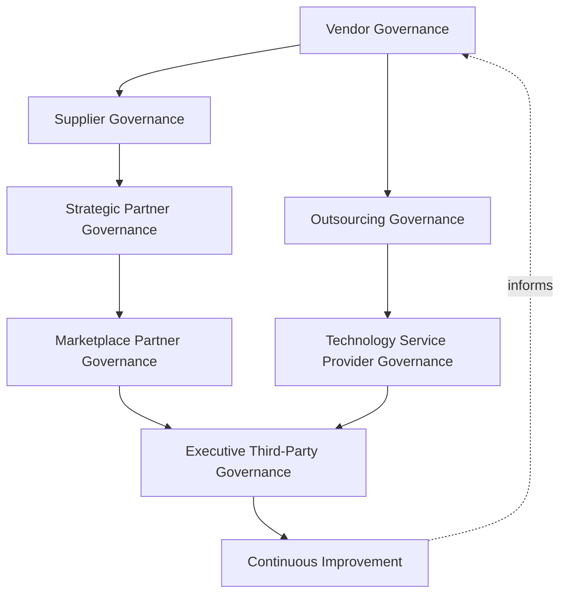
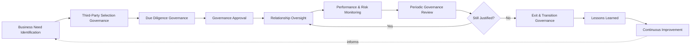
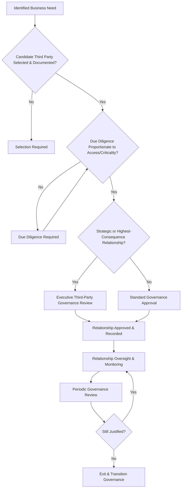
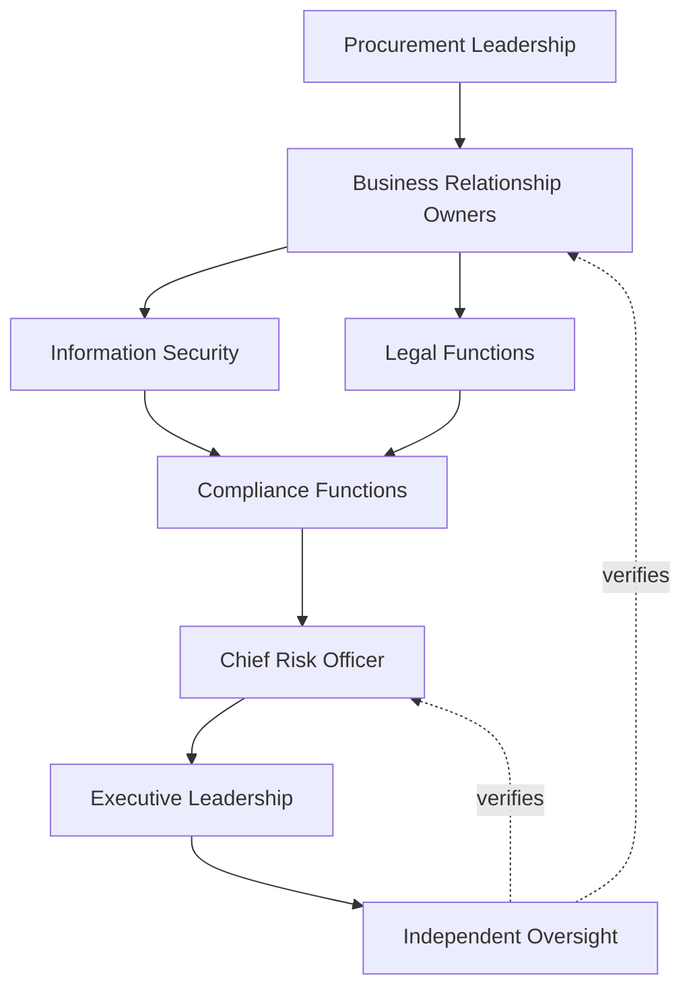
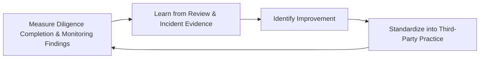
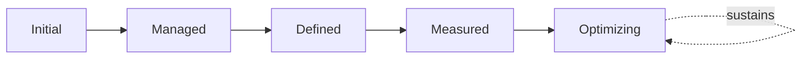

# Enterprise Third-Party Risk Governance Strategy

## 1. Document Purpose

This document defines the official Enterprise Third-Party Risk Governance Strategy for **StackLeo Tech Store** — the CRO/CPO/CISO-owned executive charter under which every external relationship StackLeo depends on — vendors, suppliers, partners, outsourcing providers, marketplace participants, and service providers — is governed as a deliberate, accountable source of both business value and business risk. It establishes governance across the full third-party relationship, organizational accountability, executive oversight, and long-term third-party risk maturity, consistent with ISO 31000, ISO/IEC 27001, NIST Cyber Supply Chain Risk Management, and TOGAF enterprise architecture thinking.

Third-Party Risk is introduced as a domain within `enterprise-risk-management-strategy.md` (Section 3.6, Section 4.7) and Third-Party Compliance is introduced within `compliance-governance.md` (Section 4.7); this document is their dedicated, full governance elaboration, warranted because a relationship StackLeo does not directly control — but is nonetheless genuinely exposed to — carries distinct governance discipline that general enterprise risk and compliance treatment alone cannot fully provide. It is coordinated with `identity-federation.md`, which governs the identity and trust dimension of external relationships, while this strategy governs the business relationship itself across its full life.

- **Purpose of Third-Party Risk Governance** — to ensure every external relationship StackLeo enters is deliberately assessed, approved, monitored, and eventually exited with genuine awareness of the risk it introduces, so that business collaboration never proceeds on the basis of assumed rather than confirmed trust.
- **Relationship with Enterprise Risk Management** — this strategy is the dedicated elaboration of Third-Party Risk Governance in `enterprise-risk-management-strategy.md` (Section 3.6); every principle in that strategy applies here, adapted to the specific characteristics of externally sourced risk.
- **Relationship with Information Security** — third-party access to systems and data is governed under `identity-federation.md` and `security-governance.md`; this strategy governs the broader business relationship and lifecycle those technical trust arrangements operate within.
- **Relationship with Compliance Governance** — this strategy is the dedicated elaboration of Third-Party Compliance in `compliance-governance.md` (Section 4.7), ensuring obligations tied to a specific external relationship are tracked as part of that relationship's own governance, not only in the abstract.
- **Relationship with Procurement Governance** — the business function that sources and contracts with external parties makes its decisions within the risk boundaries this strategy establishes; governance here is what allows procurement to move with confidence rather than case-by-case improvisation.
- **Relationship with Business Continuity** — a critical third party's failure or unavailability is a genuine business continuity risk; this strategy ensures that dependency is understood and planned for, coordinated with `09_OPERATIONS/business-continuity.md`.
- **Relationship with Executive Decision-Making** — this strategy exists to make third-party risk a deliberate, visible input to the decision to enter, continue, or exit an external relationship, never a factor considered only after the relationship already exists.

This document is implementation-independent and vendor-neutral. It defines third-party risk governance philosophy, model, domains, and lifecycle conceptually — not specific vendor management software, procurement platforms, cloud providers, security vendors, consulting firms, contract lifecycle tools, GRC products, vendor onboarding workflows, supplier assessment questionnaires, procurement procedures, contract negotiation practices, infrastructure configurations, deployment architectures, operational governance processes, or code.

## 2. Third-Party Risk Governance Philosophy

Third-party risk governance at StackLeo rests on eight principles. Each exists to produce a specific business outcome — external relationships are governed deliberately because they extend genuine business risk beyond the boundary the organization directly controls.

### 2.1 Trusted Partnerships Enable Business Growth

Deliberate, well-governed third-party relationships enable the collaboration StackLeo's business model genuinely depends on — logistics, payments, and eventually a full marketplace and wholesale ecosystem.

- **Business Value** — ensures governance enables confident partnership rather than becoming an obstacle that pushes relationships into informal, ungoverned arrangements.

### 2.2 Risk-Aware Partner Relationships

Every external relationship is entered into with genuine awareness of the risk it introduces, never assumed benign simply because a business need exists.

- **Business Value** — ensures the business understands what it is genuinely exposed to before, not after, a relationship begins.

### 2.3 Governance Before Engagement

The governance structure — who decides, who owns, who is accountable — is established before a specific third-party engagement is pursued.

- **Business Value** — ensures engagement decisions are made within an established framework, not improvised case by case.

### 2.4 Shared Accountability

Third-party risk is not the sole responsibility of the function that sources a relationship; every part of the organization that relies on or is exposed to that relationship shares accountability for its governance.

- **Business Value** — prevents third-party risk from being treated as someone else's problem by the very functions best positioned to manage it.

### 2.5 Transparency

Which third parties StackLeo depends on, for what, and with what risk, is documented and visible to those who need to know.

- **Business Value** — ensures the organization's external dependencies can be reviewed and defended, not merely assumed understood.

### 2.6 Business Alignment

Third-party risk governance decisions are made in service of genuine business need, never imposed as friction disconnected from real operational purpose.

- **Business Value** — keeps governance genuinely followed rather than resented as an obstacle to legitimate partnership.

### 2.7 Resilience

Governance considers not only how to avoid third-party risk but how the organization would continue operating if a critical relationship failed.

- **Business Value** — protects business continuity even when a genuine third-party risk StackLeo accepted eventually materializes.

### 2.8 Continuous Improvement

Third-party risk governance practice matures over time, informed by real relationship outcomes, incidents, and the organization's growth in scale and partner ecosystem.

- **Business Value** — keeps third-party governance aligned with StackLeo's growth in vendors, suppliers, and partnerships.

## 3. Enterprise Third-Party Risk Governance Model

Third-party risk governance operates across eight conceptual layers, each holding accountability for a distinct category of external relationship.

### 3.1 Vendor Governance

- **Purpose** — own the coherence of how relationships with technology and operational vendors are governed.
- **Governance Scope** — oversight of Technology Vendors and Professional Service Providers (Sections 4.1, 4.7).
- **Business Value** — ensures vendor relationships are deliberately scoped to the specific capability they provide.
- **Executive Expectations** — leadership trusts vendor risk is assessed proportionate to the access and data each vendor is granted.

### 3.2 Supplier Governance

- **Purpose** — own the coherence of how relationships with product suppliers and manufacturers are governed.
- **Governance Scope** — oversight of Suppliers & Manufacturers (Section 4.5), anticipating growth in wholesale sourcing relationships.
- **Business Value** — protects the business's ability to reliably source the products it sells.
- **Executive Expectations** — leadership expects supplier risk to be reviewed as sourcing relationships evolve and scale.

### 3.3 Strategic Partner Governance

- **Purpose** — own the coherence of how strategically significant business relationships are governed.
- **Governance Scope** — oversight of relationships whose loss or failure would carry disproportionate business consequence, spanning multiple domains in Section 4.
- **Business Value** — ensures the organization's most consequential external dependencies receive commensurately deeper governance.
- **Executive Expectations** — leadership expects strategic partnerships to be identified explicitly, not left to blend in with routine vendor relationships.

### 3.4 Outsourcing Governance

- **Purpose** — own the coherence of how functions or processes performed on StackLeo's behalf by an external party are governed.
- **Governance Scope** — oversight of any arrangement where a third party performs a function StackLeo would otherwise perform itself.
- **Business Value** — ensures outsourcing decisions are made with genuine understanding of the accountability that remains with StackLeo regardless of who performs the work.
- **Executive Expectations** — leadership trusts outsourced functions receive governance proportionate to their business criticality, not reduced oversight because the work is external.

### 3.5 Marketplace Partner Governance

- **Purpose** — own the coherence of how relationships with future multi-vendor marketplace sellers are governed.
- **Governance Scope** — oversight of Marketplace Sellers (Section 4.4), structured ahead of the marketplace model's launch.
- **Business Value** — protects the trust foundation the future marketplace business model will depend on.
- **Executive Expectations** — leadership expects marketplace partner governance to be designed before, not retrofitted after, launch.

### 3.6 Technology Service Provider Governance

- **Purpose** — own the coherence of how relationships with AI, data, and infrastructure-adjacent service providers are governed.
- **Governance Scope** — oversight of AI & Data Service Providers and Cloud & Infrastructure Providers (Sections 4.9, 4.8, conceptual only).
- **Business Value** — ensures technology service dependencies receive governance proportionate to their access to systems and data.
- **Executive Expectations** — leadership trusts technology service providers are governed with the same rigor as any other high-access third party.

### 3.7 Executive Third-Party Governance

- **Purpose** — own executive-level accountability for the third-party relationships carrying the greatest organizational consequence.
- **Governance Scope** — oversight spanning Sections 3.1–3.6 wherever a relationship rises to genuine executive or Board concern.
- **Business Value** — ensures the most consequential external dependencies are visible at the level accountable for organizational risk.
- **Executive Expectations** — leadership expects to be informed of, not surprised by, the platform's highest-risk third-party relationships.

### 3.8 Continuous Improvement

- **Purpose** — govern the mechanism by which every other layer in this model matures over time.
- **Governance Scope** — consolidates findings from relationship reviews, incidents, and audits across every domain in Section 4.
- **Business Value** — prevents third-party governance itself from becoming the next thing that quietly stagnates as the organization scales.
- **Executive Expectations** — leadership expects third-party governance maturity to be assessed periodically, not assumed static once established.

### Enterprise Third-Party Governance Matrix

| Layer | Purpose | Business Value | Executive Expectations |
|---|---|---|---|
| Vendor Governance | Own coherence of technology/operational vendor relationships | Ensures relationships are scoped to the specific capability provided | Trusts risk is proportionate to access and data granted |
| Supplier Governance | Own coherence of product supplier/manufacturer relationships | Protects the ability to reliably source products sold | Expects risk reviewed as sourcing relationships scale |
| Strategic Partner Governance | Own coherence of strategically significant relationships | Ensures the most consequential dependencies get deeper governance | Expects strategic partners identified explicitly |
| Outsourcing Governance | Own coherence of externally performed functions | Ensures accountability that remains with StackLeo is understood | Trusts outsourced functions get proportionate oversight |
| Marketplace Partner Governance | Own coherence of future marketplace seller relationships | Protects the trust foundation the marketplace model depends on | Expects governance designed before, not after, launch |
| Technology Service Provider Governance | Own coherence of AI/data/infrastructure-adjacent providers | Ensures dependencies get governance proportionate to access | Trusts providers governed with the same rigor as other high-access parties |
| Executive Third-Party Governance | Own executive accountability for highest-consequence relationships | Ensures the most consequential dependencies are visible to leadership | Expects leadership informed of, not surprised by, top relationships |
| Continuous Improvement | Govern maturation of every other layer | Prevents governance itself from stagnating | Expects maturity to be assessed periodically |

*Diagram 1: Enterprise Third-Party Governance Framework — vendor and supplier governance establish the foundation, strategic partner, outsourcing, marketplace, and technology service governance extend it across specialized relationship categories, and executive oversight converges on continuous improvement that feeds back into the model.*

## 4. Enterprise Third-Party Domains

Third-party risk is governed across ten conceptual domains, each requiring a distinct governance emphasis.

### 4.1 Technology Vendors

- **Purpose** — represent providers of software, platforms, and technical tooling StackLeo relies upon.
- **Governance Considerations** — governed under Vendor Governance (Section 3.1), with access and data grants scoped narrowly.
- **Business Importance** — protects the technical capability much of the platform's functionality depends on.
- **Executive Expectations** — leadership expects technology vendor risk to be reviewed whenever the vendor relationship's scope changes.

### 4.2 Payment Service Providers

- **Purpose** — represent providers enabling payment processing and financial transactions.
- **Governance Considerations** — governed under the highest rigor within Vendor Governance (Section 3.1), given financial and regulatory sensitivity.
- **Business Importance** — protects the business's financial integrity and its standing with regulators.
- **Executive Expectations** — leadership expects payment provider risk to be reviewed with the shortest cadence in this model.

### 4.3 Logistics & Delivery Partners

- **Purpose** — represent couriers and delivery providers fulfilling customer orders.
- **Governance Considerations** — governed under Outsourcing Governance (Section 3.4), given their direct role in the customer experience.
- **Business Importance** — protects the operational reliability customers directly experience.
- **Executive Expectations** — leadership expects logistics partner performance to be monitored continuously, not only reviewed periodically.

### 4.4 Marketplace Sellers

- **Purpose** — represent future third-party sellers operating on the multi-vendor marketplace.
- **Governance Considerations** — governed under Marketplace Partner Governance (Section 3.5), structured ahead of the marketplace model's launch.
- **Business Importance** — will become foundational to the multi-vendor marketplace business model as it launches.
- **Executive Expectations** — leadership expects marketplace seller governance to be designed before, not retrofitted after, launch.

### 4.5 Suppliers & Manufacturers

- **Purpose** — represent the sources of the products StackLeo sells.
- **Governance Considerations** — governed under Supplier Governance (Section 3.2), anticipating growth in wholesale relationships.
- **Business Importance** — protects the business's ability to reliably source and deliver the products it sells.
- **Executive Expectations** — leadership expects supplier risk to be reviewed as sourcing scale and complexity grow.

### 4.6 Marketing & Advertising Partners

- **Purpose** — represent providers supporting customer acquisition and communication.
- **Governance Considerations** — governed under Vendor Governance (Section 3.1), coordinated with `privacy-governance.md` given customer data involvement.
- **Business Importance** — protects the business's ability to reach and communicate with customers effectively.
- **Executive Expectations** — leadership expects marketing partner data handling to be reviewed with particular privacy attention.

### 4.7 Professional Service Providers

- **Purpose** — represent legal, financial, and other professional advisory relationships.
- **Governance Considerations** — governed under Vendor Governance (Section 3.1), often involving highly sensitive business information.
- **Business Importance** — supports the business's ability to obtain genuine specialist expertise.
- **Executive Expectations** — leadership expects professional service relationships to be reviewed for confidentiality and conflict-of-interest risk.

### 4.8 Cloud & Infrastructure Providers (conceptual only)

- **Purpose** — represent the category of provider StackLeo's platform infrastructure conceptually depends on, discussed here without reference to any specific provider.
- **Governance Considerations** — governed under Technology Service Provider Governance (Section 3.6), recognizing infrastructure dependency as a distinct risk category regardless of which provider is eventually selected.
- **Business Importance** — protects the platform's fundamental operational continuity.
- **Executive Expectations** — leadership expects infrastructure dependency risk to be understood conceptually, independent of any specific vendor choice.

### 4.9 AI & Data Service Providers

- **Purpose** — represent providers supporting AI-assisted capability and data processing.
- **Governance Considerations** — governed under Technology Service Provider Governance (Section 3.6) as a distinct, explicitly inventoried category, anticipating growing AI-assisted capability.
- **Business Importance** — protects against risk from a category of provider whose data access and processing role can be especially consequential.
- **Executive Expectations** — leadership expects AI and data service provider risk to be governed with the same rigor as any high-access technology vendor.

### 4.10 Regulatory & Government Partners

- **Purpose** — represent regulators and government bodies StackLeo interacts with as obligated relationships rather than chosen ones.
- **Governance Considerations** — governed under Executive Third-Party Governance (Section 3.7), coordinated with `compliance-governance.md`.
- **Business Importance** — protects the business's standing with the bodies whose authority it operates under.
- **Executive Expectations** — leadership expects regulatory and government relationships to be handled with dedicated, deliberate rigor.

### Enterprise Third-Party Domain Matrix

| Domain | Purpose | Business Importance | Executive Expectations |
|---|---|---|---|
| Technology Vendors | Represent software, platform, and technical tooling providers | Protects the technical capability much functionality depends on | Reviewed whenever the vendor relationship's scope changes |
| Payment Service Providers | Represent payment processing and transaction providers | Protects financial integrity and regulator standing | Reviewed with the shortest cadence in this model |
| Logistics & Delivery Partners | Represent couriers and delivery providers | Protects the operational reliability customers experience | Performance monitored continuously |
| Marketplace Sellers | Represent future third-party marketplace sellers | Will become foundational to the marketplace business model | Designed before, not retrofitted after, launch |
| Suppliers & Manufacturers | Represent sources of the products StackLeo sells | Protects the ability to reliably source and deliver products | Reviewed as sourcing scale and complexity grow |
| Marketing & Advertising Partners | Represent customer acquisition/communication providers | Protects the ability to reach and communicate with customers | Data handling reviewed with particular privacy attention |
| Professional Service Providers | Represent legal, financial, advisory relationships | Supports the ability to obtain genuine specialist expertise | Reviewed for confidentiality and conflict-of-interest risk |
| Cloud & Infrastructure Providers (conceptual only) | Represent the category platform infrastructure depends on | Protects the platform's fundamental operational continuity | Understood conceptually, independent of specific vendor choice |
| AI & Data Service Providers | Represent AI-assisted capability and data processing providers | Protects against risk from consequential data access roles | Governed with the same rigor as any high-access technology vendor |
| Regulatory & Government Partners | Represent obligated regulator/government relationships | Protects standing with the bodies whose authority applies | Handled with dedicated, deliberate rigor |

## 5. Enterprise Third-Party Risk Lifecycle

Third-party relationships are governed across ten conceptual lifecycle stages, applicable across every domain in Section 4.

### 5.1 Business Need Identification

- **Purpose** — formally recognize a genuine business need that may require an external relationship.
- **Governance Objectives** — require the need to be stated explicitly before any specific third party is considered.
- **Business Value** — ensures third-party engagement begins with a genuine business justification, not a vendor-led conversation.

### 5.2 Third-Party Selection Governance

- **Purpose** — govern how a specific external party is identified as a candidate to meet the stated need.
- **Governance Objectives** — require selection to be deliberate and documented, never informal or unrecorded.
- **Business Value** — ensures the organization can defend why a specific party was chosen.

### 5.3 Due Diligence Governance

- **Purpose** — govern how a candidate third party is evaluated for the risk it would introduce.
- **Governance Objectives** — require diligence rigor to be proportionate to the access, data, and criticality involved, consistent with Section 6.
- **Business Value** — ensures risk is genuinely understood before a relationship is formally entered into.

### 5.4 Governance Approval

- **Purpose** — formally decide whether a diligenced relationship is approved to proceed.
- **Governance Objectives** — require the decision to trace to a specific, accountable approver, consistent with Accountability (Section 2.4, Section 6).
- **Business Value** — ensures every relationship has a genuine, deliberate approval behind it, never an informal default.

### 5.5 Relationship Oversight

- **Purpose** — govern the ongoing management of an approved third-party relationship.
- **Governance Objectives** — require oversight to be a continuous responsibility, not concluded once the relationship is approved.
- **Business Value** — ensures relationships remain genuinely governed throughout their active life, not only at their outset.

### 5.6 Performance & Risk Monitoring

- **Purpose** — sustain awareness of a third party's ongoing performance and risk profile.
- **Governance Objectives** — require monitoring to occur on a cadence proportionate to the relationship's criticality.
- **Business Value** — catches a deteriorating relationship before its consequences fully materialize.

### 5.7 Periodic Governance Review

- **Purpose** — formally reassess whether a relationship remains genuinely justified and appropriately governed.
- **Governance Objectives** — require review to occur on a predictable, regular cadence.
- **Business Value** — catches relationships that have drifted from their original justification or risk profile.

### 5.8 Exit & Transition Governance

- **Purpose** — govern how a relationship is deliberately ended and its dependencies transitioned.
- **Governance Objectives** — require exit to be planned, never left to an unmanaged, reactive termination.
- **Business Value** — protects business continuity when a relationship ends, whether by choice or by necessity.

### 5.9 Lessons Learned

- **Purpose** — formally capture what a relationship's outcome reveals about the organization's third-party governance itself.
- **Governance Objectives** — require lessons to be documented and attributed to specific governance implications.
- **Business Value** — ensures the organization genuinely learns from each relationship, positive or negative.

### 5.10 Continuous Improvement

- **Purpose** — apply accumulated lessons to strengthen future third-party governance practice.
- **Governance Objectives** — require findings to be genuinely analyzed for recurring patterns, not treated as isolated exceptions.
- **Business Value** — turns each relationship's outcome into an input that makes future relationships genuinely better governed.

### Enterprise Third-Party Lifecycle Matrix

| Stage | Purpose | Governance Objective | Business Value |
|---|---|---|---|
| Business Need Identification | Recognize a genuine need that may require an external relationship | Stated explicitly before a specific party is considered | Ensures engagement begins with genuine business justification |
| Third-Party Selection Governance | Identify a candidate party to meet the stated need | Deliberate and documented, never informal | Ensures the organization can defend why a party was chosen |
| Due Diligence Governance | Evaluate a candidate for the risk it would introduce | Rigor proportionate to access, data, and criticality | Ensures risk is understood before entering the relationship |
| Governance Approval | Decide whether a diligenced relationship proceeds | Traces to a specific, accountable approver | Ensures every relationship has a genuine, deliberate approval |
| Relationship Oversight | Govern ongoing management of an approved relationship | A continuous responsibility, not concluded at approval | Ensures relationships remain governed throughout their life |
| Performance & Risk Monitoring | Sustain awareness of ongoing performance and risk | Cadence proportionate to relationship criticality | Catches a deteriorating relationship before consequences materialize |
| Periodic Governance Review | Reassess whether a relationship remains justified | Predictable, regular cadence | Catches relationships drifted from original justification |
| Exit & Transition Governance | Govern deliberate ending and dependency transition | Planned, never an unmanaged reactive termination | Protects business continuity when a relationship ends |
| Lessons Learned | Capture what an outcome reveals about governance itself | Documented and attributed to specific implications | Ensures genuine learning from each relationship |
| Continuous Improvement | Apply lessons to strengthen future practice | Findings genuinely analyzed for recurring patterns | Makes future relationships genuinely better governed |

*Diagram 2: Enterprise Third-Party Risk Lifecycle — a business need leads through selection, due diligence, and approval into ongoing oversight and monitoring, with periodic review governing continuation or a planned exit, feeding lessons learned and continuous improvement back into the cycle.*

## 6. Third-Party Risk Governance Principles

- **Accountability** — every third-party relationship traces to a specific, named, responsible owner, consistent with Section 2.4.
- **Transparency** — external dependencies, their purpose, and their risk are documented and visible, consistent with Section 2.5.
- **Risk Awareness** — relationships are entered into with genuine understanding of the risk they introduce, consistent with Section 2.2.
- **Business Alignment** — governance decisions are made in service of genuine business need, never imposed as disconnected friction.
- **Due Diligence** — every relationship is evaluated proportionate to its access, data, and criticality before it is approved.
- **Traceability** — every third-party governance decision can be traced to its evidentiary basis, owner, and timing.
- **Resilience** — governance considers the organization's ability to continue operating if a relationship fails, consistent with Section 2.7.
- **Continuous Improvement** — governance practice matures over time, informed by real relationship outcomes and incidents.

### Third-Party Governance Principles Matrix

| Principle | Description | Business Value |
|---|---|---|
| Accountability | Every relationship traces to a specific, named, responsible owner | Ensures relationships have a clear owner |
| Transparency | Dependencies, purpose, and risk documented and visible | Ensures dependencies can be reviewed and defended |
| Risk Awareness | Relationships entered into with genuine risk understanding | Ensures the business understands genuine exposure |
| Business Alignment | Decisions made in service of genuine business need | Keeps governance followed rather than resented as friction |
| Due Diligence | Evaluated proportionate to access, data, and criticality | Ensures risk is understood before relationships are approved |
| Traceability | Decisions traceable to evidentiary basis, owner, timing | Enables defensible, evidence-based governance |
| Resilience | Considers continuity if a relationship fails | Protects continuity when accepted risk materializes |
| Continuous Improvement | Practice matures from real outcomes and incidents | Keeps governance aligned with organizational growth |

*Diagram 4: Enterprise Third-Party Governance Decision Flow — a business need is matched to a documented candidate, evaluated through proportionate due diligence, escalated for executive review where strategic, approved and recorded, then monitored and periodically reassessed until reconfirmed or exited.*

## 7. Ownership & Accountability

Governance authority for third-party risk is distributed deliberately across eight accountable functions, defined here at the governance-objective level, without prescribing specific operational vendor management activities.

### 7.1 Executive Leadership

- **Governance Objective** — executive leadership sets the risk appetite this strategy operates within and holds the Chief Risk Officer accountable for its execution.
- **Business Value** — ensures third-party governance decisions reflect genuine organizational priority.

### 7.2 Chief Risk Officer

- **Governance Objective** — the Chief Risk Officer owns the coherence and enforcement of this strategy across every domain, layer, and stage it defines.
- **Business Value** — provides a single point of specialist accountability for whether third-party governance is genuinely functioning as intended.

### 7.3 Procurement Leadership

- **Governance Objective** — procurement leadership ensures sourcing decisions are made within this strategy's governance boundaries.
- **Business Value** — allows procurement to move with confidence within an established framework, not case-by-case improvisation.

### 7.4 Business Relationship Owners

- **Governance Objective** — each third-party relationship has a specific, named business owner accountable for its ongoing oversight.
- **Business Value** — ensures no relationship persists without someone genuinely responsible for its continued justification.

### 7.5 Information Security

- **Governance Objective** — information security assesses the technical access and data risk a third party introduces, coordinated with `identity-federation.md`.
- **Business Value** — ensures third-party governance reflects genuine technical risk, not only business or contractual risk.

### 7.6 Compliance Functions

- **Governance Objective** — compliance functions confirm that third-party relationships satisfy applicable regulatory and contractual obligations, coordinated with `compliance-governance.md`.
- **Business Value** — ensures relationships protect the business's standing with regulators and enterprise customers.

### 7.7 Legal Functions

- **Governance Objective** — legal functions ensure third-party relationships are governed by appropriate contractual terms reflecting the risk this strategy identifies.
- **Business Value** — ensures business risk understanding is genuinely reflected in binding contractual protection.

### 7.8 Independent Oversight

- **Governance Objective** — an independent function, separate from those who design and operate third-party governance, periodically verifies its overall effectiveness.
- **Business Value** — prevents governance from being assumed effective on the word of the same function responsible for running it.

### Ownership & Accountability Matrix

| Role | Governance Objective | Business Value |
|---|---|---|
| Executive Leadership | Set risk appetite and hold the CRO accountable | Ensures decisions reflect genuine organizational priority |
| Chief Risk Officer | Own coherence and enforcement of this strategy | Provides a single point of specialist accountability |
| Procurement Leadership | Ensure sourcing decisions stay within governance boundaries | Allows procurement to move with confidence, not improvisation |
| Business Relationship Owners | Own ongoing oversight of a specific relationship | Ensures no relationship persists without genuine responsibility |
| Information Security | Assess technical access and data risk | Ensures governance reflects genuine technical risk |
| Compliance Functions | Confirm relationships satisfy regulatory/contractual obligations | Protects standing with regulators and enterprise customers |
| Legal Functions | Ensure appropriate contractual terms reflect identified risk | Ensures business risk is reflected in binding protection |
| Independent Oversight | Independently verify overall governance effectiveness | Prevents self-assessed assumption of effectiveness |

*Diagram 3: Third-Party Ownership & Accountability Model — accountability flows from procurement leadership through business relationship ownership into security, legal, and compliance functions, converging on the Chief Risk Officer and executive leadership verified by independent oversight.*

## 8. Executive Oversight

- **Executive Third-Party Reviews** — the overall coherence of third-party risk governance is formally reviewed on a regular cadence, consistent with `security-governance.md` (Section 6).
- **Vendor Risk Reporting** — aggregated third-party health — relationship count, diligence completion, monitoring findings — is reported to executive leadership.
- **Governance Reviews** — the governance model, domains, and lifecycle defined in this strategy (Sections 3–7) are periodically reassessed for continued fitness.
- **Strategic Supplier Oversight** — Strategic Partner relationships (Section 3.3) receive direct executive-level review, given their disproportionate business consequence.
- **Documentation Governance** — this strategy's relationship to `enterprise-risk-management-strategy.md`, `compliance-governance.md`, and `identity-federation.md` is kept current as those documents evolve.
- **Audit Readiness** — third-party governance decisions, evidence, and outcomes are maintained in a state ready for internal or external audit at any time, coordinated with `audit-governance.md`.

### Executive Oversight Matrix

| Oversight Mechanism | Purpose | Governance Role |
|---|---|---|
| Executive Third-Party Reviews | Confirm overall third-party governance coherence | Regular, predictable cadence for the strategy as a whole |
| Vendor Risk Reporting | Provide leadership a single, coherent third-party picture | Reports relationship count, diligence completion, monitoring findings |
| Governance Reviews | Reassess the governance model itself for continued fitness | Applies to Sections 3–7 of this strategy |
| Strategic Supplier Oversight | Direct executive review of strategically significant relationships | Applied to relationships identified under Section 3.3 |
| Documentation Governance | Keep this strategy's subordinate relationships current | Updated as related documents evolve |
| Audit Readiness | Maintain decisions and evidence ready for independent review | Continuous state, coordinated with audit governance |

### Governance Responsibility Matrix

| Role | Responsibility |
|---|---|
| Chief Risk Officer | Owns coherence and enforcement of this strategy, in partnership with Executive Leadership. |
| Third-Party Governance Lead | Owns the operational governance practice across every domain. |
| Procurement Leadership | Ensures sourcing decisions occur within this strategy's boundaries. |
| Business Relationship Owners | Own ongoing oversight within their assigned relationship. |
| Information Security | Assesses technical access and data risk in coordination with `identity-federation.md`. |
| Compliance Functions | Own regulatory/contractual obligation tracking for third-party relationships. |
| Legal Functions | Own contractual terms reflecting identified risk. |
| Independent Oversight | Independently verifies the overall effectiveness of third-party governance. |

## 9. Future Readiness

This strategy is designed to remain valid as StackLeo evolves in scale, geography, and organizational complexity, without requiring redefinition of its underlying philosophy.

- **AI-Driven Third-Party Governance** — as due diligence and monitoring increasingly incorporate AI-assisted risk signal detection, they remain governed under Due Diligence and Performance & Risk Monitoring (Sections 5.3, 5.6) at the same rigor as any other method.
- **Global Supplier Networks** — Supplier Governance (Section 3.2) is defined independently of jurisdiction, so it extends coherently as StackLeo's sourcing network grows from Bangladesh into South Asia and global markets.
- **Multi-Vendor Ecosystems** — Marketplace Partner Governance (Section 3.5) is structured to absorb a substantially larger population of third-party relationships as the marketplace model matures.
- **Enterprise Scale** — the governance model, domains, and lifecycle defined throughout this strategy are defined independently of organizational size, so they remain coherent as the third-party population grows substantially.
- **Digital Supply Chains** — Technology Service Provider Governance (Section 3.6) is structured to absorb increasingly interconnected, digitally native supply relationships as they emerge.
- **Cross-Border Operations** — this strategy's governance model is defined independently of jurisdiction, so it extends coherently as StackLeo's third-party relationships span multiple regulatory environments.
- **Cyber Supply Chain Resilience** — Resilience (Section 2.7) extends explicitly to cyber supply chain risk, consistent with NIST Cyber Supply Chain Risk Management thinking, as third-party technical interdependency grows.
- **Future Business Ecosystems** — Strategic Partner and Marketplace Partner Governance (Sections 3.3, 3.5) are structured to absorb genuinely new categories of business ecosystem relationship as StackLeo's model evolves.

## 10. Third-Party Risk Governance Maturity Model

Third-party risk governance maturity is described across five conceptual levels, consistent with ISO 31000 and established process maturity thinking.

- **Initial** — third-party governance, where it exists, is informal and inconsistent; relationships are entered into without consistent diligence, and ownership is unclear.
- **Managed** — basic governance exists for individual domains, but consistency across the ten domains in Section 4 varies significantly.
- **Defined** — the governance model, domains, and lifecycle are standardized, documented, and consistently applied across the organization, consistent with the model defined throughout this strategy.
- **Measured** — relationship count, diligence completion, and monitoring findings are measured systematically, and decisions are grounded in genuine evidence rather than qualitative impression alone.
- **Optimizing** — third-party risk governance is continuously and deliberately improved based on quantitative evidence and organizational learning; improvement itself is a managed, ongoing discipline rather than an occasional initiative.

### Third-Party Governance Maturity Model Matrix

| Level | Characteristics | Primary Focus |
|---|---|---|
| Initial | Informal, inconsistent governance; relationships lack consistent diligence | Ad hoc, individually-dependent third-party practice |
| Managed | Basic governance exists per domain; consistency varies | Domain-level consistency |
| Defined | Standardized governance model, domains, and lifecycle | Organization-wide consistency and clear ownership |
| Measured | Relationship count and diligence completion measured systematically | Evidence-based third-party governance decisions |
| Optimizing | Practice continuously and deliberately improved from evidence | Sustained, deliberate improvement as a discipline |

*Diagram 5: Continuous Third-Party Governance Improvement Cycle — relationship review and incident outcomes are measured, learned from, improved upon, and standardized back into governed practice, on a continuing basis.*

*Diagram 6: Third-Party Governance Maturity Progression Model — maturity advances from informal, inconsistently-diligenced relationships toward standardized, measured, and continuously optimized third-party risk governance.*

## 11. Anti-Patterns

The following recurring failure patterns are explicitly recognized and avoided, as each one structurally undermines this strategy.

### Anti-Pattern Summary

| Anti-Pattern | Why It's Avoided |
|---|---|
| Vendor Relationships Without Governance | Contradicts Governance Before Engagement (Section 2.3); a relationship entered into without genuine governance exposes the business to unassessed risk. |
| Weak Due Diligence | Contradicts Due Diligence (Section 6); diligence disproportionately shallow relative to a relationship's access or criticality leaves genuine risk unassessed. |
| Unknown Third-Party Ownership | Contradicts Business Relationship Owners (Section 7.4); a relationship with no accountable owner has no one genuinely responsible for its continued oversight. |
| Weak Executive Visibility | Contradicts Vendor Risk Reporting (Section 8); leadership cannot govern third-party risk it is never shown. |
| Poor Documentation | Undermines Transparency (Section 6) and Documentation Governance (Section 8), leaving third-party decisions unclear or unverifiable after the fact. |
| Compliance Without Third-Party Governance | Contradicts Compliance Functions (Section 7.6); satisfying a regulatory checklist without genuine underlying relationship governance leaves the organization compliant on paper and exposed in practice. |
| Siloed Vendor Management | Contradicts the Enterprise Third-Party Governance Model (Section 3); domain-by-domain practice that never converges leaves no coherent, organization-wide picture of third-party risk. |
| Missing Continuous Improvement | Contradicts Continuous Improvement (Section 2.8) and Continuous Improvement (Section 3.8); without deliberate improvement, third-party governance stagnates as the organization and its partner ecosystem grow. |

## 12. Document Information

| Property | Value |
|----------|-------|
| Document | third-party-risk-governance.md |
| Version | 1.0.0 |
| Status | Active |
| Maintained By | StackLeo |
| Last Updated | 2026-07-24 |

---

© StackLeo. All Rights Reserved.
