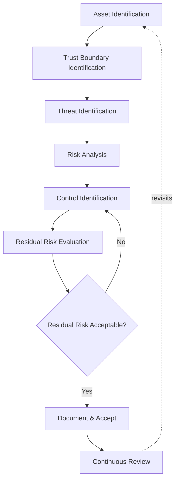
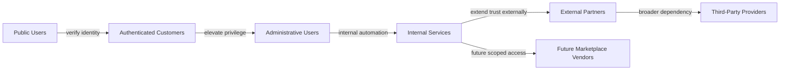
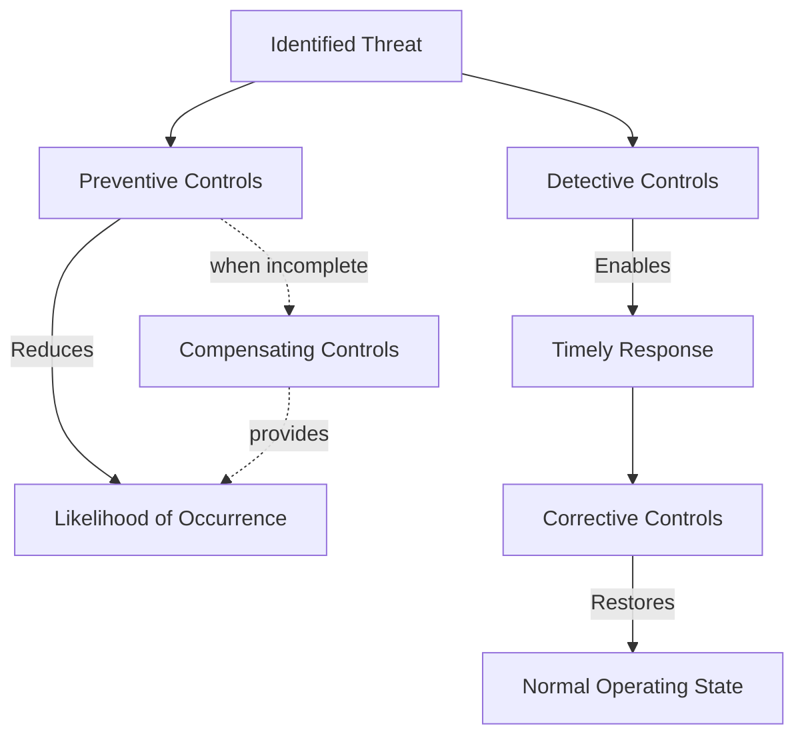
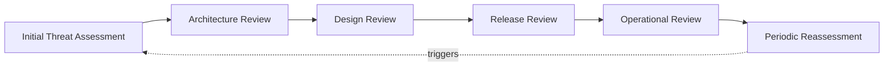

# Threat Model

## 1. Document Purpose

This document defines the official Enterprise Threat Modeling Framework for **StackLeo Tech Store**. It establishes how security threats are identified, analyzed, prioritized, reviewed, and governed across the platform, on an ongoing basis rather than as a one-time exercise.

- **Purpose of Threat Modeling** — to make StackLeo's understanding of "what could go wrong, and to what" explicit, structured, and shared, rather than implicit or held only in individual engineers' heads.
- **Relationship with Security Architecture** — this framework is applied against the domains and trust boundaries defined in `security-architecture.md`; threat modeling is how that architecture is continuously tested against realistic risk, rather than assumed sufficient by design alone.
- **Relationship with Secure Software Design** — threat modeling is the analytical practice that makes Secure by Design (`security-principles.md`, Section 8) concrete: it identifies what a given design must specifically defend against before that design is built.
- **Relationship with Risk Management** — this document operationalizes the risk philosophy defined in `security-principles.md` (Section 5) — Identification, Assessment, Mitigation, Acceptance, Continuous Review — specifically for security threats.
- **Relationship with Business Resilience** — a threat understood in advance is a threat the business can prepare for; this framework exists to keep StackLeo's resilience proactive rather than reactive, consistent with `security-principles.md` (Section 9).

This document is implementation-independent and vendor-neutral. It defines methodology, categories, and governance for threat modeling — not specific tools, exploit techniques, attack instructions, or code.

## 2. Threat Modeling Philosophy

- **Security by Design** — threats are considered while a capability is being designed, not after it has shipped, consistent with `security-principles.md` (Section 8).
- **Assume Breach** — threat modeling assumes that some control will eventually fail or be circumvented, and asks what happens next, not only how a first failure might occur, consistent with `security-principles.md` (Section 3.7).
- **Continuous Threat Assessment** — the threat landscape and the platform both change continuously; threat modeling is treated as an ongoing discipline, not a single completed deliverable.
- **Risk-Based Decision Making** — not every identified threat receives equal investment; response is proportionate to business impact and likelihood, consistent with the Risk Management Matrix in `security-principles.md` (Section 5).
- **Defense in Depth** — threat modeling evaluates whether a given threat is addressed by a single control or by multiple independent layers, consistent with `security-architecture.md` (Section 5).
- **Business-Driven Security** — threats are prioritized by their consequence to the business — customer trust, revenue, regulatory standing, operational continuity — not by technical severity in isolation.

## 3. Threat Modeling Methodology

StackLeo's threat modeling methodology follows seven conceptual stages, applied consistently regardless of the specific system or capability under review:

1. **Asset Identification** — determine what is being protected and why it matters to the business (Section 4).
2. **Trust Boundary Identification** — determine where the level of trust extended to a request or actor changes (Section 6), building on `security-architecture.md` (Section 4).
3. **Threat Identification** — determine what could plausibly go wrong at each asset and boundary, organized by category (Section 5).
4. **Risk Analysis** — evaluate each identified threat's likelihood and business impact, consistent with the Risk Classification in Section 7.
5. **Control Identification** — determine what preventive, detective, corrective, or compensating controls address the threat (Section 8).
6. **Residual Risk Evaluation** — determine what risk remains after controls are considered, and whether that residual risk is acceptable, consistent with Risk Acceptance in `security-principles.md` (Section 5).
7. **Continuous Review** — revisit the analysis as the system, business, and threat landscape evolve (Section 9).

*Diagram 1: Enterprise Threat Modeling Process.*

This methodology is conceptually aligned with recognized industry approaches — including OWASP threat modeling practice and NIST risk management concepts — without prescribing any specific tool, template, or product to carry it out.

## 4. Critical Assets

The following assets warrant deliberate, prioritized protection because of their direct connection to customer trust, revenue, and business operation:

| Asset | Business Value | Security Importance | Protection Priority |
|---|---|---|---|
| Customer Accounts | Represents the customer relationship itself; the foundation of every future transaction. | Compromise directly damages the trust described in `01_Business/vision.md`. | Critical |
| Authentication Systems | Gatekeeper for every other asset in this table. | A weakness here undermines every downstream protection. | Critical |
| Product Catalog | Core of the "Everything Tech, One Marketplace" customer proposition. | Integrity failure misleads customers and damages credibility. | High |
| Orders | Represents committed revenue and fulfillment obligations. | Tampering affects revenue integrity and customer expectations. | Critical |
| Payments | Directly financial; touches customer and business monetary trust. | Highest-consequence category for both fraud and regulatory exposure. | Critical |
| Inventory | Determines accuracy of what can be promised and fulfilled to customers. | Inaccuracy causes broken promises and operational disruption. | High |
| Administrative Functions | Controls the platform's own configuration and business rules. | Compromise here can affect every other asset simultaneously. | Critical |
| Business Analytics | Informs strategic and operational decision-making. | Exposure reveals competitive and strategic information. | Medium |
| Audit Information | The record of accountability for all significant action. | Tampering or loss removes the ability to investigate incidents. | High |
| Future Marketplace Data | Will represent third-party seller business information and performance. | New category of shared trust and liability once introduced. | High (Future) |

### Critical Asset Classification

| Priority | Assets |
|---|---|
| Critical | Customer Accounts, Authentication Systems, Orders, Payments, Administrative Functions |
| High | Product Catalog, Inventory, Audit Information, Future Marketplace Data |
| Medium | Business Analytics |

## 5. Threat Categories

Threats are organized into nine categories, each evaluated for business impact rather than technical mechanism:

| Category | Business Impact | Security Considerations | High-Level Mitigation Principle |
|---|---|---|---|
| Identity Threats | Unauthorized access to accounts and administrative capability. | Weak or spoofable identity undermines every access decision. | Strong identity, continuous verification, least privilege. |
| Data Protection Threats | Exposure or corruption of customer and business data. | Data is the asset most directly tied to customer trust. | Classification, encryption concepts, minimization. |
| Application Threats | Misuse of business logic or exposed capability. | Business rules (pricing, discounts, order integrity) can be circumvented if not enforced consistently. | Secure design, consistent server-side enforcement. |
| Infrastructure Threats | Compromise of the environment underlying the platform. | A weak foundation undermines every layer built upon it. | Environment isolation, least-privilege infrastructure access. |
| Integration Threats | Compromise or misuse via third-party connections. | Payment, courier, and communication integrations extend trust beyond StackLeo's direct control. | Boundary treatment of integrations, scoped access. |
| Insider Risks | Misuse of legitimate access by an internal actor. | Legitimate credentials make misuse harder to distinguish from normal activity. | Separation of duties, auditability, least privilege. |
| Supply Chain Risks | Compromise introduced via a dependency or partner rather than StackLeo directly. | Trust extended to a third party becomes an indirect exposure. | Deliberate dependency management, vendor accountability. |
| Availability Risks | Disruption of the platform's ability to serve customers. | Downtime during peak commerce periods has direct revenue impact. | Resilience by design, graceful degradation. |
| Privacy Risks | Use of customer data beyond what customers would reasonably expect. | Directly damages trust even absent a technical "breach." | Purpose limitation, privacy by design. |

### Threat Category Matrix

| Category | Primary Affected Domain (per `security-architecture.md`) |
|---|---|
| Identity Threats | Identity Security |
| Data Protection Threats | Data Security |
| Application Threats | Application Security |
| Infrastructure Threats | Infrastructure Security |
| Integration Threats | Application Security, Infrastructure Security |
| Insider Risks | Identity Security, Operational Security |
| Supply Chain Risks | Infrastructure Security, Application Security |
| Availability Risks | Infrastructure Security, Operational Security |
| Privacy Risks | Data Security |

This document intentionally describes threat categories and their business consequence only. It does not describe specific exploitation techniques or attack sequences, which fall outside the scope of an implementation-independent architectural document.

## 6. Trust Boundary Analysis

Threat modeling is applied at each conceptual trust boundary identified in `security-architecture.md` (Section 4), viewed here from the perspective of the actors involved:

- **Public Users ↔ Authenticated Customers** — the boundary crossed the moment an unverified visitor establishes a verified identity.
- **Authenticated Customers ↔ Administrative Users** — the boundary separating ordinary customer capability from elevated, business-operating capability.
- **Administrative Users ↔ Internal Services** — the boundary at which human administrative action meets automated internal processing.
- **Internal Services ↔ External Partners** — the boundary at which StackLeo's internal trust ends and a partner's own security posture begins.
- **External Partners ↔ Third-Party Providers** — the boundary distinguishing partners integrated for core operation (payment, courier) from broader third-party service dependencies.
- **Application Layer ↔ Future Marketplace Vendors** — the boundary anticipated for third-party sellers, who will require verifiable, scoped trust distinct from every category above.

Trust boundaries matter to threat modeling because they mark exactly where an assumption of safety could be wrong: most realistic threats materialize at a boundary where trust is assumed rather than verified, making explicit boundary identification the single most valuable step in the methodology (Section 3).

*Diagram 2: Trust Boundary Overview.*

### Trust Boundary Summary

| Boundary | Primary Risk If Unverified |
|---|---|
| Public Users ↔ Authenticated Customers | Unauthorized access to account capability. |
| Authenticated Customers ↔ Administrative Users | Privilege escalation into business-operating capability. |
| Administrative Users ↔ Internal Services | Unaccountable or unintended automated action. |
| Internal Services ↔ External Partners | Trust extended beyond StackLeo's direct governance. |
| External Partners ↔ Third-Party Providers | Indirect exposure through a dependency's own weaknesses. |
| Application Layer ↔ Future Marketplace Vendors | Seller access exceeding its intended scope. |

## 7. Risk Classification

| Level | Business Impact | Likelihood Considerations | Governance Expectations |
|---|---|---|---|
| Critical | Threatens core business viability, customer trust at scale, or regulatory standing. | Any plausible likelihood warrants immediate attention at this impact level. | Requires executive visibility and immediate mitigation planning. |
| High | Significant, but contained, damage to trust, revenue, or operations. | Elevated likelihood or affects a Critical asset (Section 4). | Requires documented mitigation plan and defined owner. |
| Medium | Noticeable but recoverable impact, unlikely to threaten the business as a whole. | Moderate likelihood, typically affecting a High or Medium asset. | Requires monitoring and a scheduled review, not necessarily immediate action. |
| Low | Minor, easily absorbed impact. | Low likelihood or minimal consequence even if realized. | May be knowingly accepted with periodic reassessment. |

This classification is intentionally aligned in spirit with the Risk Management Matrix in `security-principles.md` (Section 5), applying the same likelihood-and-impact reasoning specifically to identified threats.

## 8. Security Control Mapping

Controls addressing an identified threat are categorized conceptually into four types, without reference to any specific product or technology:

- **Preventive Controls** — reduce the likelihood that a threat is realized in the first place.
- **Detective Controls** — increase the likelihood that a realized threat is recognized promptly.
- **Corrective Controls** — reduce the impact of a threat once detected, restoring normal state.
- **Compensating Controls** — provide an alternative form of protection when a primary control cannot be fully applied.

*Diagram 4: Security Control Mapping.*

Layering these control types reduces overall risk because they address a threat at different points: a preventive gap is caught by detection, a detection gap is bounded by correction, and a control that cannot be fully implemented is offset by a compensating alternative — consistent with Defense in Depth (`security-architecture.md`, Section 5).

### Security Control Categories

| Category | Function | Relationship to Risk |
|---|---|---|
| Preventive Controls | Reduce likelihood of threat realization. | Lowers the likelihood axis of the Risk Classification (Section 7). |
| Detective Controls | Increase likelihood of timely recognition. | Shortens the window between occurrence and response. |
| Corrective Controls | Reduce impact once a threat is detected. | Lowers the impact axis of the Risk Classification. |
| Compensating Controls | Offset an incomplete or infeasible primary control. | Prevents a single control gap from becoming unmitigated risk. |

## 9. Security Review Lifecycle

Threat modeling is applied at defined points across a capability's life, not only once:

- **Initial Threat Assessment** — performed when a new capability or significant change is first proposed, establishing an initial understanding of assets, boundaries, and threats.
- **Architecture Review** — performed when the structural approach is defined, verifying alignment with `security-architecture.md`.
- **Design Review** — performed as detailed design takes shape, verifying that identified threats are addressed by specific, deliberate design decisions.
- **Release Review** — performed before a capability reaches production, confirming that the threat model reflects what was actually built.
- **Operational Review** — performed periodically once a capability is live, incorporating real operational and monitoring signal into the threat model.
- **Periodic Reassessment** — performed on a defined cadence regardless of whether change has occurred, since the external threat landscape evolves independently of StackLeo's own changes.

*Diagram 3: Risk Assessment Lifecycle.*

## 10. Future Threat Readiness

This framework is deliberately structured to remain applicable as StackLeo's platform evolves:

- **AI-Assisted Systems** — AI-assisted capability (search, recommendations, fraud detection) is treated as a system actor subject to the same asset, boundary, and threat analysis as any other component.
- **Public APIs** — external API consumers introduce a new category of actor at the Application Layer boundary, requiring the same trust-boundary analysis as any other external party (Section 6).
- **Marketplace Platform** — the Future Marketplace Vendors boundary (Section 6) is already anticipated, allowing seller-related threats to be modeled before the marketplace launches rather than after.
- **Event-Driven Architecture** — as interaction moves toward asynchronous events (per `03_System_Design/event-flows.md`), threat modeling extends trust-boundary analysis to event producers and consumers, not only synchronous requests.
- **Microservices** — decomposition into independently deployable services (per `03_System_Design/architecture-principles.md`, ARCH-041) increases the number of internal trust boundaries requiring analysis, making this framework's boundary-first methodology more important, not less.
- **Global Expansion** — asset and threat categories remain valid across jurisdictions; region-specific regulatory threats are layered on via `compliance.md` without redefining this methodology.
- **Multi-Region Operations** — availability and infrastructure threat categories (Section 5) extend naturally to a multi-region operating model without requiring a new category.

## 11. Governance

- **Threat Model Ownership** — a designated Security Lead owns the currency and coherence of the threat models produced under this framework, consistent with `security-architecture.md` (Section 10).
- **Review Responsibilities** — Engineering leads are responsible for initiating threat modeling at the review points defined in Section 9 for capability within their domain.
- **Risk Acceptance** — residual risk (Section 3, Step 6) accepted rather than mitigated must be explicitly recorded with a named accountable owner and a scheduled reassessment date, consistent with `security-principles.md` (Section 5).
- **Documentation Standards** — threat models are recorded in a manner consistent with this document's structure (assets, boundaries, categories, classification), so findings remain comparable across the platform over time.
- **Continuous Improvement** — the effectiveness of this framework itself is periodically reassessed, incorporating lessons from actual incidents and operational review (Section 9).

### Governance Responsibility Matrix

| Role | Responsibility |
|---|---|
| Security Lead | Owns coherence and enforcement of the threat modeling framework. |
| Engineering Leads | Initiate and participate in threat modeling for capability within their domain. |
| Solution Architect | Ensures threat modeling findings remain consistent with `security-architecture.md`. |
| Product Manager | Ensures business context and priority are reflected in risk classification. |
| Executive Leadership | Accountable for accepting Critical-level residual risk. |
| Internal Audit / Review Function | Independently verifies threat models are current and consistently applied. |

## 12. Anti-Patterns

| Anti-Pattern | Why It's Avoided |
|---|---|
| No Threat Modeling | Leaves realistic risk entirely unconsidered until it is realized as an incident. |
| One-Time Assessment Only | Ignores that the platform and threat landscape both change continuously (Section 2); a stale threat model creates false confidence. |
| Ignoring Business Context | Produces technically framed findings that cannot be prioritized against actual business impact (Section 7). |
| Missing Trust Boundaries | Leaves exactly the points where most realistic threats materialize unanalyzed (Section 6). |
| Ignoring Third-Party Risks | Leaves Supply Chain and Integration threat categories (Section 5) unaddressed despite extending trust beyond StackLeo's direct control. |
| No Review Process | Allows identified threats and accepted risks to go unrevisited indefinitely, contradicting Continuous Review (Section 9). |
| Poor Documentation | Prevents findings from being compared, tracked, or acted upon consistently across the platform. |
| Treating All Risks Equally | Wastes limited mitigation effort on low-impact risk while under-resourcing Critical and High risk (Section 7). |

## 13. Document Information

| Property | Value |
|----------|-------|
| Document | threat-model.md |
| Version | 1.0.0 |
| Status | Active |
| Maintained By | StackLeo |
| Last Updated | 2026-07-17 |

---

© StackLeo. All Rights Reserved.
