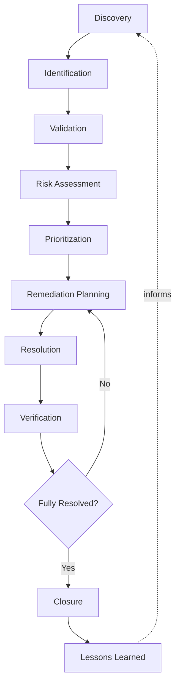
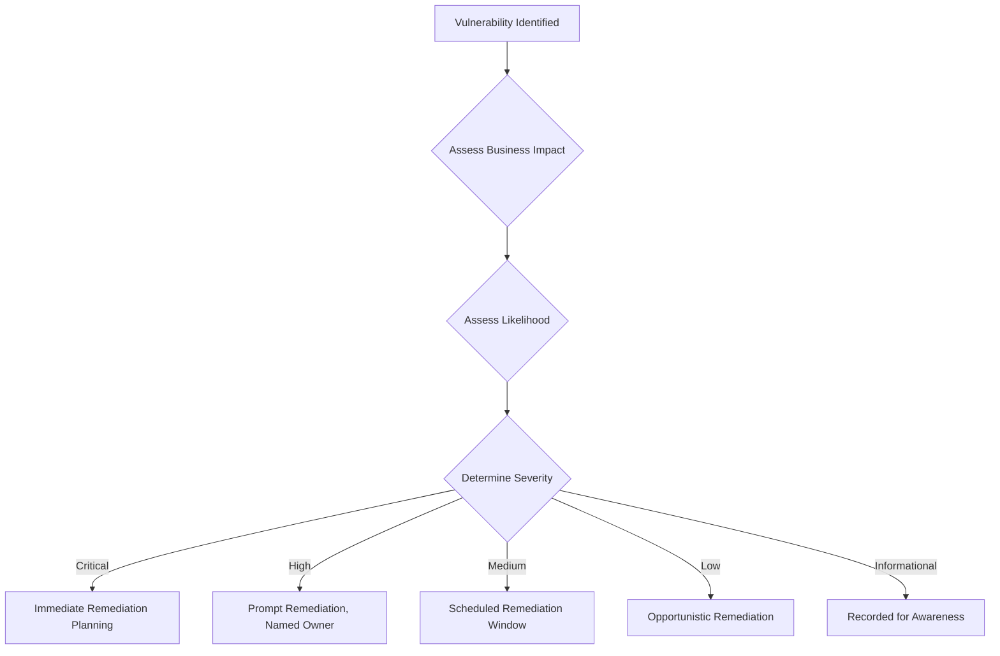
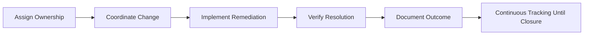
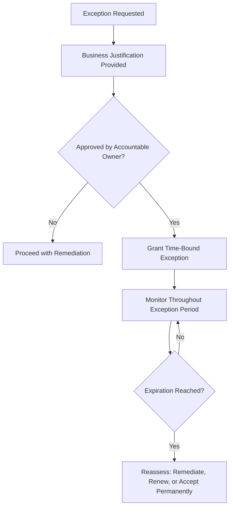
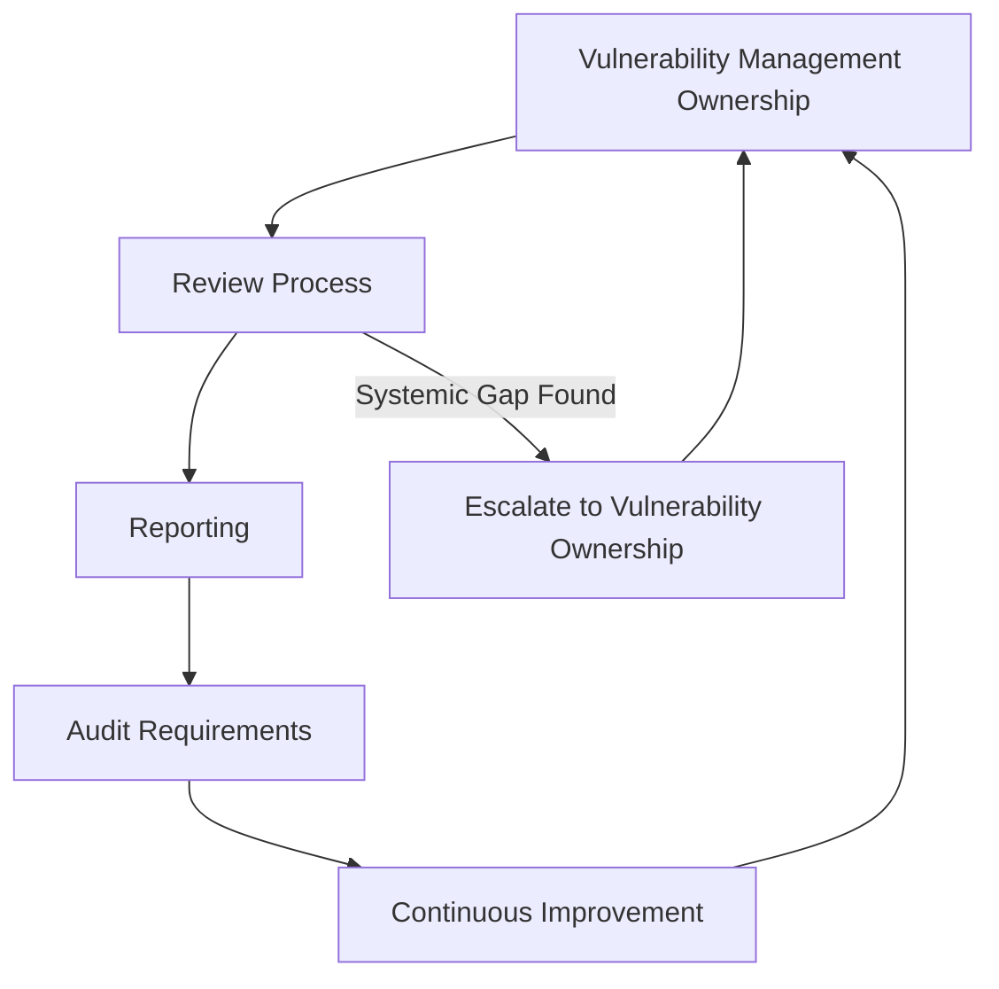

# Vulnerability Management

## 1. Document Purpose

This document defines the official Enterprise Vulnerability Management Strategy for **StackLeo Tech Store**. It establishes how security vulnerabilities are identified, prioritized, remediated, and tracked across the platform on an ongoing basis.

- **Purpose of Vulnerability Management** — to ensure that weaknesses in the platform, once introduced or discovered, are found, understood, and resolved in a disciplined and timely manner rather than left to accumulate unmanaged.
- **Relationship with Enterprise Security** — this document elaborates Vulnerability Management, one of the operational responsibilities defined in `security-architecture.md` (Section 3.5), sustaining protection between design-time decisions and real-world operation.
- **Relationship with Secure SDLC** — this document is the continuation of Secure SDLC's Testing and Maintenance phases (`application-security.md`, Section 3) once a capability is live, addressing what happens when a weakness is nonetheless found in production.
- **Relationship with Risk Management** — this document operationalizes the risk philosophy from `security-principles.md` (Section 5) specifically for vulnerabilities: identification, assessment, mitigation, and acceptance applied to concrete, discovered weaknesses.
- **Relationship with Business Resilience** — an unmanaged vulnerability is latent business risk; disciplined vulnerability management keeps that risk visible and bounded, supporting the resilience described in `security-principles.md` (Section 9).

This document is implementation-independent and vendor-neutral. It defines vulnerability management philosophy, lifecycle, and governance — not specific scanning tools, penetration testing procedures, exploit techniques, or code.

## 2. Vulnerability Management Philosophy

- **Continuous Improvement** — vulnerability management is treated as an ongoing discipline that matures over time, not a program that is ever declared "finished."
- **Risk-Based Prioritization** — remediation effort is directed toward vulnerabilities proportionate to their business impact and likelihood, not applied uniformly regardless of consequence, consistent with `threat-model.md` (Section 7).
- **Defense in Depth** — vulnerability management is one layer among several (`security-architecture.md`, Section 5); a vulnerability's presence does not automatically mean compromise, if other layers hold.
- **Secure by Design** — the volume of vulnerabilities discovered in production is reduced by the upstream Secure SDLC discipline in `application-security.md`, not addressed solely through downstream detection.
- **Shared Responsibility** — vulnerability discovery, remediation, and verification are shared across Engineering, Security, and Operations, not the sole responsibility of any single team.
- **Continuous Monitoring** — the platform is continuously observed for newly disclosed or newly relevant vulnerabilities, since the vulnerability landscape changes independently of StackLeo's own changes.

## 3. Vulnerability Lifecycle

Every identified vulnerability moves through a conceptually consistent lifecycle:

- **Discovery** — a vulnerability becomes known to the organization, whether through internal review, monitoring, or external disclosure.
- **Identification** — the vulnerability is documented with enough detail to understand what it affects and why it matters.
- **Validation** — the vulnerability is confirmed as genuine and applicable to StackLeo's actual environment, distinguishing real risk from false positives.
- **Risk Assessment** — the vulnerability's likelihood and business impact are evaluated, consistent with the Risk Classification in `threat-model.md` (Section 7).
- **Prioritization** — the vulnerability is ranked against other known vulnerabilities and competing engineering priorities, based on its assessed severity (Section 5).
- **Remediation Planning** — an approach and owner are assigned for resolving the vulnerability, proportionate to its priority.
- **Resolution** — the vulnerability is addressed through the planned remediation.
- **Verification** — the resolution is confirmed to actually eliminate or sufficiently mitigate the vulnerability, not merely assumed to have worked.
- **Closure** — the vulnerability is formally recorded as resolved, with its resolution and verification evidence retained.
- **Lessons Learned** — the circumstances that allowed the vulnerability to arise are reviewed for patterns that should inform the Secure SDLC or broader practice.

*Diagram 1: Vulnerability Management Lifecycle.*

### Vulnerability Lifecycle Matrix

| Stage | Trigger | Primary Concern |
|---|---|---|
| Discovery | Internal review, monitoring, or external disclosure | Ensuring vulnerabilities are found, not merely awaited |
| Identification | A candidate vulnerability requires documentation | Capturing sufficient detail to understand scope and effect |
| Validation | Documented vulnerability requires confirmation | Distinguishing genuine risk from false positives |
| Risk Assessment | Validated vulnerability requires evaluation | Establishing likelihood and business impact |
| Prioritization | Assessed vulnerability requires ranking | Allocating limited remediation effort proportionately |
| Remediation Planning | Prioritized vulnerability requires an approach | Assigning ownership and a proportionate plan |
| Resolution | Planned remediation is executed | Ensuring the fix addresses the underlying weakness |
| Verification | Resolution requires confirmation | Confirming the vulnerability no longer applies |
| Closure | Verified resolution requires recording | Retaining evidence of resolution for accountability |
| Lessons Learned | Closed vulnerability requires reflection | Identifying patterns to prevent recurrence |

## 4. Vulnerability Categories

| Category | Business Impact | Security Considerations | High-Level Mitigation Principle |
|---|---|---|---|
| Application Vulnerabilities | Compromise of customer-facing or business logic capability. | Directly affects the commerce experience customers depend on. | Secure SDLC discipline, per `application-security.md`. |
| API Vulnerabilities | Compromise of contracts consumed by channels and partners. | Affects every consumer of the vulnerable API simultaneously. | API-specific protection principles, per `api-security.md`. |
| Infrastructure Vulnerabilities | Compromise of the environment underlying business capability. | Can affect every workload hosted on the vulnerable component. | Defense in depth across infrastructure layers, per `infrastructure-security.md`. |
| Network Vulnerabilities | Compromise of communication paths within or into the platform. | Can enable lateral movement or interception if left unaddressed. | Segmentation and Zero Trust Networking, per `network-security.md`. |
| Configuration Weaknesses | Unintended exposure from a deviation between intended and actual configuration. | Often introduced unintentionally, making detection especially valuable. | Secure defaults and configuration governance, per `security-principles.md` (Section 3.3). |
| Dependency Risks | Compromise introduced via a third-party library or component. | Exposure originates outside StackLeo's own codebase. | Deliberate dependency governance, per `application-security.md` (Section 7). |
| Supply Chain Risks | Compromise introduced via a broader third-party relationship. | Extends beyond code dependencies to partners and providers. | Trust-boundary treatment of third parties, per `security-architecture.md` (Section 4). |
| Identity & Access Weaknesses | Unauthorized access resulting from an identity or authorization gap. | Can undermine the effectiveness of every other protection. | Identity-centric security and least privilege, per `identity-management.md`, `authorization.md`. |

### Vulnerability Category Matrix

| Category | Primary Related Document |
|---|---|
| Application Vulnerabilities | `application-security.md` |
| API Vulnerabilities | `api-security.md` |
| Infrastructure Vulnerabilities | `infrastructure-security.md` |
| Network Vulnerabilities | `network-security.md` |
| Configuration Weaknesses | `security-principles.md` |
| Dependency Risks | `application-security.md` |
| Supply Chain Risks | `security-architecture.md` |
| Identity & Access Weaknesses | `identity-management.md`, `authorization.md` |

## 5. Risk Prioritization

| Severity | Business Impact | Urgency | Governance Expectations |
|---|---|---|---|
| Critical | Threatens core business viability, customer trust at scale, or regulatory standing. | Immediate remediation planning required. | Executive visibility; tracked until resolved. |
| High | Significant, contained damage to trust, revenue, or operations. | Remediation planned and executed promptly. | Documented plan with a named accountable owner. |
| Medium | Noticeable but recoverable impact. | Remediation scheduled within a reasonable, defined window. | Tracked to resolution with periodic status review. |
| Low | Minor, easily absorbed impact. | Remediation scheduled opportunistically. | Tracked; may be batched with related work. |
| Informational | No direct exploitable impact; observational or best-practice in nature. | No mandatory remediation timeline. | Recorded for awareness; may inform future design decisions. |

*Diagram 2: Risk Prioritization Flow.*

### Risk Severity Matrix

| Severity | Typical Remediation Window Expectation | Escalation Path |
|---|---|---|
| Critical | Immediate | Executive Leadership notified |
| High | Prompt, within a short defined period | Security Lead and Engineering Lead notified |
| Medium | Within a defined, moderate period | Engineering Lead tracks to resolution |
| Low | Opportunistic, may align with other planned work | Tracked in normal backlog |
| Informational | None mandatory | Retained for awareness and future design input |

## 6. Remediation Governance

- **Ownership** — every identified vulnerability is assigned a specific, accountable owner responsible for driving it through remediation.
- **Prioritization** — remediation is sequenced according to the severity classification in Section 5, balanced against other legitimate engineering priorities.
- **Change Coordination** — remediation affecting shared or business-critical capability is coordinated with the teams and processes it touches, avoiding unintended disruption.
- **Verification** — every remediation is verified to confirm it genuinely resolves the underlying vulnerability, consistent with `security-testing.md`.
- **Documentation** — the vulnerability, its assessment, and its resolution are recorded consistently, supporting future reference and audit.
- **Continuous Tracking** — open vulnerabilities remain visible until formally closed; none are allowed to become invisible through simple neglect.

*Diagram 3: Remediation Workflow.*

### Remediation Governance Matrix

| Concern | Governance Expectation |
|---|---|
| Ownership | Every vulnerability has a named, accountable owner |
| Prioritization | Sequencing reflects assessed severity (Section 5) |
| Change Coordination | Remediation affecting shared capability is coordinated deliberately |
| Verification | Resolution is confirmed, not assumed |
| Documentation | Assessment and resolution are recorded consistently |
| Continuous Tracking | Open vulnerabilities remain visible until formally closed |

## 7. Exception Management

- **Risk Acceptance** — a vulnerability may be knowingly and explicitly accepted rather than remediated, when the cost of remediation exceeds the business value of doing so, consistent with `security-principles.md` (Section 5).
- **Temporary Exceptions** — a vulnerability may be granted a temporary exception when remediation cannot be completed immediately but is genuinely planned.
- **Business Justification** — every exception requires a documented, specific business rationale, never granted merely because remediation is inconvenient.
- **Review Requirements** — exceptions are reviewed by an accountable owner distinct from whoever requested the exception, consistent with Separation of Duties.
- **Expiration Awareness** — every exception carries a defined expiration or reassessment date; indefinite exceptions are not permitted.

*Diagram 4: Exception Management Process.*

## 8. Future Readiness

This strategy is deliberately structured to remain valid as StackLeo's platform and practice evolve:

- **DevSecOps** — the vulnerability lifecycle (Section 3) is designed to integrate into a continuous delivery practice, where discovery and remediation are embedded throughout development rather than treated as a separate downstream activity.
- **Cloud-Native Platforms** — vulnerability categories (Section 4) apply consistently regardless of the specific cloud-native services adopted.
- **Microservices** — as decomposition into more services increases the number of independently deployable components, this strategy's category-and-severity structure scales without redefinition.
- **Marketplace Platform** — vulnerability management extends naturally to seller-facing capability as the marketplace launches, using the same lifecycle and governance.
- **AI Systems** — AI-assisted capability is subject to the same vulnerability discovery, assessment, and remediation discipline as any other component.
- **Public APIs** — API Vulnerabilities (Section 4) extend to externally exposed contracts as public APIs are introduced per `05_API/api-strategy.md`.
- **Global Expansion** — vulnerability management principles remain jurisdiction-agnostic, allowing region-specific disclosure or reporting obligations to layer on via `compliance.md`.

## 9. Governance

- **Vulnerability Ownership** — the Security Lead owns the overall coherence of this vulnerability management strategy, with individual vulnerabilities owned per Section 6.
- **Review Process** — the population of open vulnerabilities is reviewed on a defined cadence, and this strategy itself is reviewed periodically for continued effectiveness.
- **Reporting** — vulnerability status is reported to accountable stakeholders proportionate to severity, ensuring Critical and High findings receive appropriate visibility.
- **Audit Requirements** — vulnerability lifecycle events (Section 3) are recorded consistently with `security-principles.md` (Section 9).
- **Continuous Improvement** — this strategy is expected to mature as the platform, team, and vulnerability landscape evolve.

*Diagram 5: Vulnerability Governance Framework.*

### Governance Responsibility Matrix

| Role | Responsibility |
|---|---|
| Security Lead | Owns coherence and enforcement of the vulnerability management strategy. |
| Vulnerability Owners | Drive individual vulnerabilities through remediation (Section 6). |
| Engineering Leads | Ensure remediation capacity is planned into delivery work. |
| Operations Lead | Supports discovery and monitoring for production-relevant vulnerabilities. |
| Executive Leadership | Accountable for Critical-severity exception and risk acceptance decisions. |
| Internal Audit / Review Function | Independently verifies vulnerability management practice matches this strategy. |

## 10. Anti-Patterns

| Anti-Pattern | Why It's Avoided |
|---|---|
| One-Time Assessments | Ignores that the vulnerability landscape changes continuously (Section 2); a stale assessment creates false confidence. |
| Ignoring Low-Risk Findings | Allows minor weaknesses to accumulate or combine into more significant risk over time. |
| No Ownership | Leaves identified vulnerabilities without accountability, guaranteeing inconsistent or absent remediation (Section 6). |
| Delayed Remediation | Allows known risk to persist longer than its severity warrants, contradicting the prioritization in Section 5. |
| Poor Documentation | Prevents vulnerabilities from being tracked, audited, or learned from consistently. |
| Weak Verification | Assumes a fix worked without confirming it, potentially leaving the vulnerability effectively unresolved. |
| No Exception Governance | Allows unmanaged, indefinite risk acceptance without accountability, contradicting Section 7. |
| Reactive Security | Treats vulnerability management as a response to incidents rather than a continuous discipline (Section 2). |

## 11. Document Information

| Property | Value |
|----------|-------|
| Document | vulnerability-management.md |
| Version | 1.0.0 |
| Status | Active |
| Maintained By | StackLeo |
| Last Updated | 2026-07-17 |

---

© StackLeo. All Rights Reserved.
