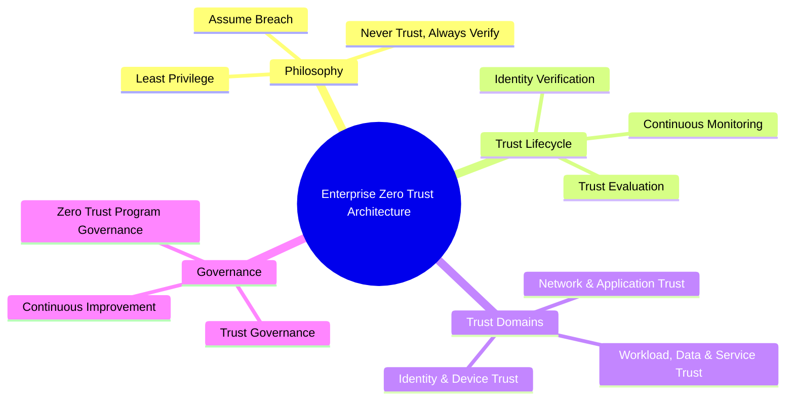
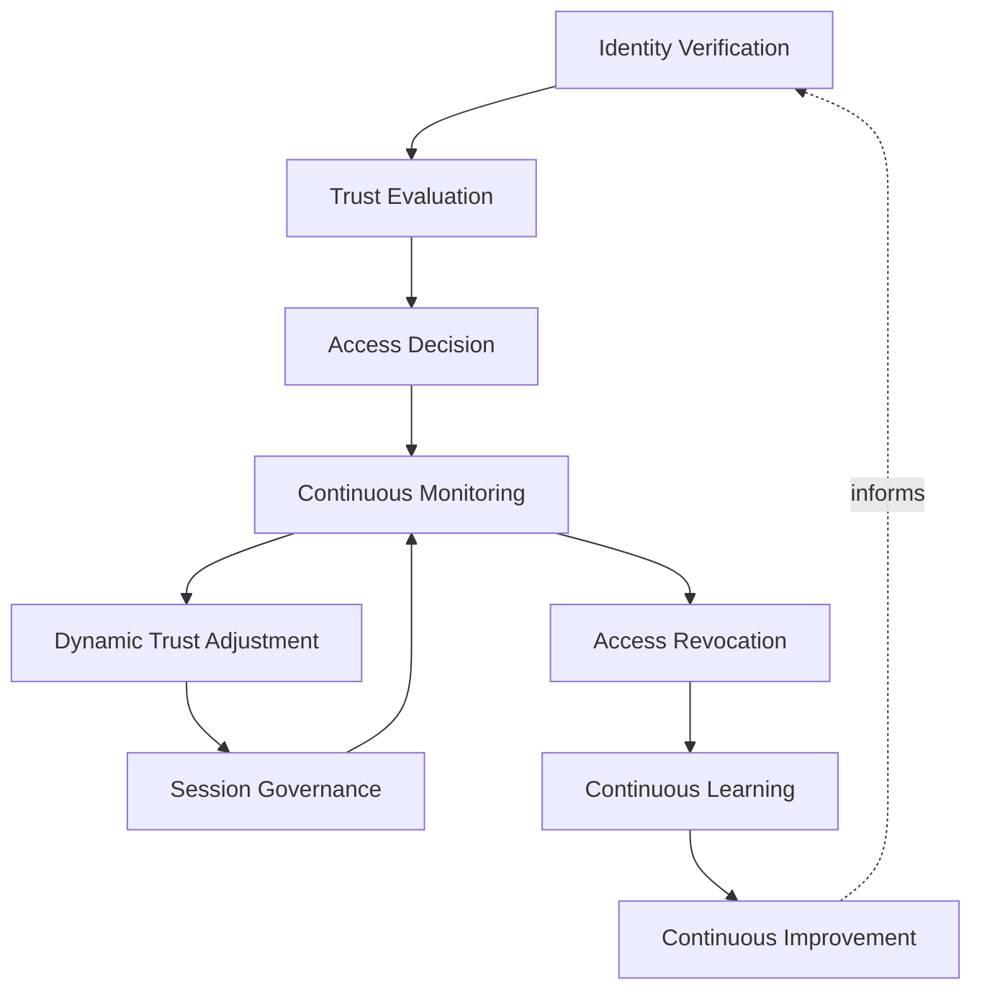
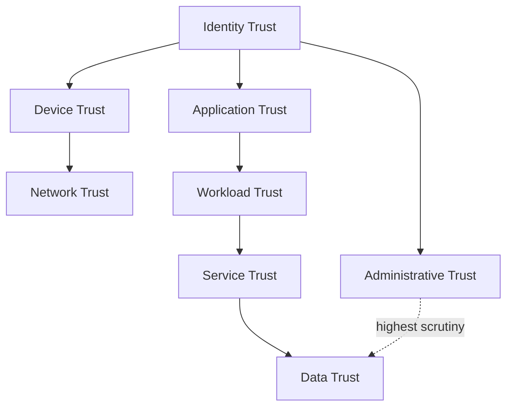
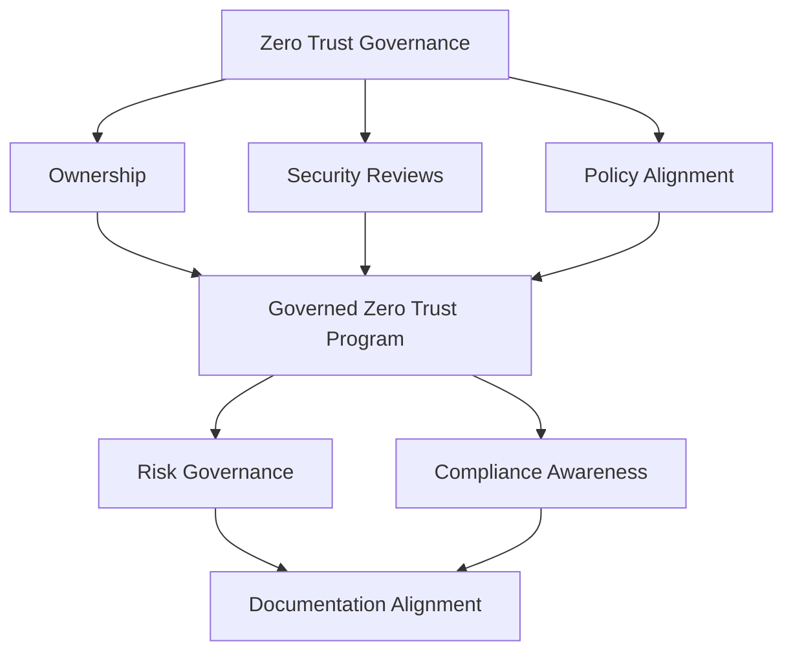
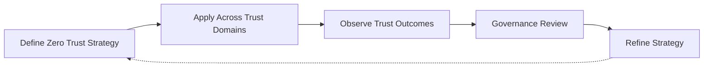

# Zero Trust Strategy

## 1. Document Purpose

This document defines StackLeo's enterprise Zero Trust strategy — the lifecycle, trust domains, and governance through which the Zero Trust philosophy introduced in `security-principles.md` (Section 4) is elaborated into a coherent, organization-wide approach to how trust is established, evaluated, and continuously re-verified.

- **Purpose of Zero Trust** — to ensure that no request, actor, device, or prior authentication event is trusted implicitly anywhere on the platform, so that a compromise in one place cannot silently extend into trust everywhere else.
- **Relationship with Enterprise Security** — this document is the dedicated deep-dive on Zero Trust referenced throughout `security-architecture.md` and `security-principles.md`; it does not redefine the platform's broader security architecture, but elaborates the trust dimension of it.
- **Relationship with IAM** — Zero Trust and identity are inseparable in practice: `identity-management.md`, `authentication.md`, and `authorization.md` define how identity is established and used, while this document defines how much that identity, and every other signal accompanying a request, is trusted at any given moment.
- **Relationship with DevSecOps** — Zero Trust principles are embedded into delivery and operational practice through `07_DEVOPS/devsecops-strategy.md` and `07_DEVOPS/secrets-management.md`, which describe how continuous verification and least-privilege access are practiced across the delivery lifecycle.
- **Relationship with Platform Engineering** — trust evaluation and continuous verification are intended to be delivered as consistent, built-in platform capability through `07_DEVOPS/platform-engineering.md`, so secure-by-default access is the natural outcome of using the platform, not a separately achieved discipline.
- **Relationship with Business Risk Management** — Zero Trust is a direct, proportionate response to the risk of operating a multi-channel, expanding platform where trust cannot reasonably be anchored to network location or organizational boundary alone, consistent with the risk management philosophy in `security-principles.md` (Section 5).

This document is implementation-independent and vendor-neutral. It defines Zero Trust philosophy, lifecycle, domains, and governance — not specific products, authentication technologies, or network architectures.

## 2. Zero Trust Philosophy

Six principles, elaborating the Zero Trust Mindset established in `security-principles.md`, govern this strategy:

- **Never Trust, Always Verify** — every request is evaluated on its own merits at the point of access, regardless of its origin or what trusted it previously. *Business value:* removes reliance on a fixed, defensible perimeter across web, and future mobile, physical store, and POS channels.
- **Least Privilege** — every actor and system is granted only the access its defined responsibility requires, and nothing more. *Business value:* limits the damage a compromised account or credential can cause.
- **Explicit Verification** — trust is established through deliberate evaluation of identity, device, and context, never inferred from convenience or prior relationship. *Business value:* makes trust decisions defensible and auditable rather than assumed.
- **Assume Breach** — the platform is designed as though a compromise has already occurred somewhere within it, limiting what any single compromised point can reach. *Business value:* bounds the impact of a breach that prevention alone cannot guarantee will never happen.
- **Continuous Validation** — trust, once granted, is not treated as permanent; it is re-evaluated as conditions change. *Business value:* closes the gap a one-time check leaves open for the remainder of a session or relationship.
- **Security by Design** — trust evaluation is considered from the point a capability is conceived, not layered on after the fact. *Business value:* makes secure-by-default the natural, lowest-friction outcome rather than a retrofit.

## 3. Zero Trust Lifecycle

Every access decision, regardless of actor or resource, is understood to move through nine conceptual stages.

### Identity Verification

- **Purpose** — confirm that the actor making a request is who it claims to be.
- **Business Value** — establishes the foundational fact every subsequent trust decision depends on.
- **Governance Objectives** — ensure no access decision proceeds without a verified identity, consistent with `authentication.md`.

### Trust Evaluation

- **Purpose** — assess the totality of signals — identity, device, context, and behavior — relevant to a specific request.
- **Business Value** — produces a trust judgment grounded in the full picture, not identity alone.
- **Governance Objectives** — ensure evaluation criteria are consistent and defensible, not ad hoc.

### Access Decision

- **Purpose** — determine, based on trust evaluation, whether and to what extent access is granted.
- **Business Value** — connects trust evaluation to a concrete, least-privilege outcome.
- **Governance Objectives** — ensure decisions are proportionate to the sensitivity of the action requested.

### Continuous Monitoring

- **Purpose** — observe the behavior of a granted session or access relationship for the duration of its use.
- **Business Value** — detects conditions that would have changed the original access decision had they been known at the time.
- **Governance Objectives** — connect monitoring directly to the observability principles in `07_DEVOPS/observability-strategy.md`.

### Dynamic Trust Adjustment

- **Purpose** — modify an actor's effective access in response to newly observed conditions.
- **Business Value** — allows trust to shrink immediately when risk increases, without waiting for a session to naturally end.
- **Governance Objectives** — ensure adjustment mechanisms exist and are exercised consistently, not only in theory.

### Session Governance

- **Purpose** — manage the lifespan, scope, and conditions under which an active session remains valid.
- **Business Value** — prevents a session from silently outliving the conditions that originally justified it.
- **Governance Objectives** — apply session governance uniformly across identity categories defined in Section 4.

### Access Revocation

- **Purpose** — immediately withdraw access when trust is no longer justified.
- **Business Value** — limits the impact of a compromise or a no-longer-legitimate access relationship to the shortest possible window.
- **Governance Objectives** — ensure revocation can be executed rapidly, without dependency on a lengthy process.

### Continuous Learning

- **Purpose** — extract insight from access decisions, adjustments, and revocations over time.
- **Business Value** — improves the accuracy and proportionality of future trust evaluation.
- **Governance Objectives** — ensure learning is fed back into policy, not merely observed and forgotten.

### Continuous Improvement

- **Purpose** — mature the Zero Trust lifecycle itself as the platform, organization, and threat landscape evolve.
- **Business Value** — keeps trust evaluation aligned with genuine, current risk rather than static assumption.
- **Governance Objectives** — ensure this strategy is reviewed and evolved deliberately, not left static.

*Diagram 1: Enterprise Zero Trust Architecture — the philosophy, lifecycle, trust domains, and governance layers this strategy defines.*

*Diagram 2: Continuous Trust Evaluation Flow — trust is verified, evaluated, and decided upon, then continuously monitored and dynamically adjusted throughout a session until it is revoked, with every cycle feeding learning and improvement back into future evaluation.*

### Zero Trust Lifecycle Matrix

| Stage | Purpose | Business Value |
|---|---|---|
| Identity Verification | Confirm the actor is who it claims to be | Establishes the foundation every trust decision depends on |
| Trust Evaluation | Assess identity, device, context, and behavior together | Produces a judgment grounded in the full picture |
| Access Decision | Determine whether and how much access to grant | Connects evaluation to a concrete, least-privilege outcome |
| Continuous Monitoring | Observe behavior for the duration of access | Detects conditions that would change the original decision |
| Dynamic Trust Adjustment | Modify effective access as conditions change | Allows trust to shrink immediately as risk increases |
| Session Governance | Manage lifespan and scope of active sessions | Prevents sessions from outliving their justification |
| Access Revocation | Immediately withdraw unjustified access | Limits impact of compromise to the shortest window |
| Continuous Learning | Extract insight from decisions over time | Improves accuracy of future trust evaluation |
| Continuous Improvement | Mature the lifecycle itself over time | Keeps evaluation aligned with genuine, current risk |

## 4. Zero Trust Domains

### Identity Trust

- **Purpose** — establish and continuously validate confidence in who an actor is.
- **Scope** — human and system actors across every identity category defined in `identity-management.md`.
- **Governance Expectations** — governed jointly with `authentication.md` and `authorization.md`.
- **Business Importance** — the foundational trust domain every other domain's evaluation partially depends on.

### Device Trust

- **Purpose** — evaluate the trustworthiness of the device through which a request is made.
- **Scope** — customer devices across web and future mobile and POS channels, and staff and administrative devices.
- **Governance Expectations** — evaluated independently of identity trust, never assumed from identity alone.
- **Business Importance** — accounts for the risk of a compromised or unmanaged device acting on behalf of a legitimate identity.

### Network Trust

- **Purpose** — treat network origin as one input among many, not an implicit grant of trust.
- **Scope** — all network paths through which requests reach the platform, internal and external.
- **Governance Expectations** — coordinated with `network-security.md`, without relying on network location as a primary control.
- **Business Importance** — prevents a compromised internal network position from conferring unearned trust.

### Application Trust

- **Purpose** — evaluate whether the requesting application or client behaves consistently with its expected, legitimate identity.
- **Scope** — first-party applications across current and future sales channels, and any integrating third-party applications.
- **Governance Expectations** — coordinated with `application-security.md` and `07_DEVOPS/devsecops-strategy.md`.
- **Business Importance** — prevents a legitimate-looking but compromised or spoofed client from being trusted by default.

### Workload Trust

- **Purpose** — evaluate the trustworthiness of running system components and processes, independent of the identity operating through them.
- **Scope** — services, jobs, and automated processes running across the platform's infrastructure.
- **Governance Expectations** — coordinated with `infrastructure-security.md` and `07_DEVOPS/infrastructure-as-code.md`.
- **Business Importance** — protects against a compromised workload being trusted simply because it runs in an expected location.

### Data Trust

- **Purpose** — ensure data is accessed and used consistently with its classification and legitimate purpose.
- **Scope** — customer, business, and operational data across its lifecycle.
- **Governance Expectations** — coordinated with `data-protection.md` and `privacy.md`.
- **Business Importance** — protects StackLeo's most sensitive asset from access that is technically authorized but contextually inappropriate.

### Service Trust

- **Purpose** — evaluate trust in service-to-service communication independent of the identities each service acts on behalf of.
- **Scope** — internal service-to-service interactions and integrations with external partners.
- **Governance Expectations** — coordinated with `api-security.md` and `07_DEVOPS/secrets-management.md`.
- **Business Importance** — prevents lateral movement between services from being an implicit consequence of network proximity.

### Administrative Trust

- **Purpose** — apply the highest level of scrutiny to actors and systems capable of privileged, platform-wide action.
- **Scope** — administrative and operational personnel, and automated systems with elevated privilege.
- **Governance Expectations** — subject to the strictest verification, monitoring, and revocation discipline of any domain.
- **Business Importance** — protects against the highest-impact category of compromise, where a single account can affect the entire platform.

*Diagram 4: Enterprise Trust Domain Model — identity trust underpins device and application trust, which extend into workload and service trust protecting data, with administrative trust held to the highest scrutiny across every domain.*

### Trust Domain Matrix

| Domain | Purpose | Business Importance |
|---|---|---|
| Identity Trust | Establish and continuously validate who an actor is | Foundational trust domain underpinning all others |
| Device Trust | Evaluate trustworthiness of the requesting device | Accounts for compromised or unmanaged devices |
| Network Trust | Treat network origin as one input, not implicit trust | Prevents compromised network position from conferring trust |
| Application Trust | Evaluate legitimacy of the requesting application or client | Prevents spoofed or compromised clients being trusted by default |
| Workload Trust | Evaluate trustworthiness of running system components | Protects against compromised workloads trusted by location alone |
| Data Trust | Ensure access matches classification and legitimate purpose | Protects StackLeo's most sensitive asset |
| Service Trust | Evaluate service-to-service communication independently | Prevents lateral movement via network proximity |
| Administrative Trust | Apply highest scrutiny to privileged actors and systems | Protects against the highest-impact category of compromise |

## 5. Trust Governance

This section defines the operational mechanics by which individual trust decisions are made, distinct from the organizational governance of the Zero Trust program addressed in Section 6.

- **Trust Evaluation** — every access-relevant decision is made through the evaluation process defined in Section 3, never bypassed for convenience.
- **Policy Governance** — the policies determining what trust is required for a given action are defined centrally and applied consistently across domains.
- **Context-Aware Decisions** — trust decisions incorporate relevant context — such as behavior pattern, request pattern, and prior history — rather than identity and device signals alone.
- **Continuous Verification** — trust already granted remains subject to ongoing verification for as long as it is in effect, consistent with Section 3.
- **Risk-Based Access** — the strength of verification and the scope of access granted scale with the sensitivity and potential impact of the action.
- **Auditability** — every trust decision, adjustment, and revocation is traceable to its inputs, reasoning, and outcome.

### Trust Governance Matrix

| Governance Area | Focus | Accountable For |
|---|---|---|
| Trust Evaluation | Consistent application of the defined evaluation process | Preventing bypassed or ad hoc trust decisions |
| Policy Governance | Centrally defined, consistently applied trust policy | Uniform trust requirements across domains |
| Context-Aware Decisions | Incorporation of behavior, pattern, and history | Trust decisions grounded in more than identity and device alone |
| Continuous Verification | Ongoing re-verification of granted trust | Preventing trust from becoming stale or assumed |
| Risk-Based Access | Verification strength scaled to action sensitivity | Balancing customer experience against genuine consequence |
| Auditability | Traceable inputs, reasoning, and outcomes | Supporting investigation and compliance |

### Continuous Verification Matrix

| Verification Checkpoint | Trigger | Business Rationale |
|---|---|---|
| Session Re-Authentication | Elapsed time or sensitive action attempted | Prevents indefinite trust from a single login event |
| Device Posture Recheck | Device signal changes mid-session | Detects a device becoming compromised after initial trust |
| Behavioral Anomaly Detection | Request pattern deviates from established norm | Surfaces potential compromise even with valid credentials |
| Contextual Risk Recalculation | Location, time, or access pattern shifts | Adjusts trust to reflect materially changed circumstance |
| Privilege Re-Evaluation | Role, policy, or organizational status changes | Ensures access reflects current, not historical, entitlement |
| Post-Incident Reverification | Related account or system flagged elsewhere | Contains risk that may have spread beyond the original signal |

## 6. Zero Trust Governance

This section addresses governance of the Zero Trust program itself, distinct from the decision-time mechanics defined in Section 5.

- **Ownership** — a designated Zero Trust program owner, coordinated with the Security Lead defined in `security-governance.md`, is accountable for the coherence of this strategy.
- **Security Reviews** — Zero Trust posture is evaluated as part of the broader security review process defined in `security-architecture.md`.
- **Policy Alignment** — trust policy remains consistent with the principles in `security-principles.md`, so operational practice and stated philosophy do not diverge.
- **Risk Governance** — Zero Trust maturity investment is prioritized according to the risk management philosophy in `security-principles.md` (Section 5).
- **Compliance Awareness** — trust governance is maintained with awareness of the compliance expectations that accompany StackLeo's growing business scope, including corporate and wholesale relationships.
- **Documentation Alignment** — this strategy and its supporting domain documentation are kept current as the platform and threat landscape evolve.

*Diagram 3: Zero Trust Governance Framework — ownership, security reviews, and policy alignment converge on a governed Zero Trust program, sustained by risk governance, compliance awareness, and current documentation.*

## 7. Future Readiness

- **Cloud-Native Platforms** — trust domains are defined independent of any specific provider, allowing adoption of elastic, provider-hosted infrastructure without redefining this strategy.
- **Kubernetes** — workload and service trust extend naturally to container orchestration concepts, consistent with `07_DEVOPS/kubernetes-strategy.md`, without requiring a separate trust philosophy.
- **Multi-Cloud** — trust evaluation principles remain consistent regardless of how many distinct infrastructure environments the platform eventually spans.
- **AI Systems** — AI-assisted capability is subject to the same identity, workload, and data trust domains as any other system capability, with no implicit trust granted on the basis of automation.
- **Marketplace Platform** — as StackLeo evolves toward business sales, corporate accounts, wholesale, and a multi-vendor marketplace, partner and seller trust is governed under the same explicit, continuously verified model as internal actors.
- **Multi-Tenant Architecture** — trust domains extend to enforce isolation between tenants as the marketplace introduces multiple independent seller contexts sharing the platform.
- **Remote Workforce** — device and context trust principles are structured to evaluate distributed, non-office-based staff access without relying on network location as a proxy for trust.
- **Global Engineering Teams** — as StackLeo grows from Bangladesh into South Asia and, over time, global markets, trust governance remains independent of contributor location, supporting distributed teams under consistent verification discipline.

## 8. Governance

- **Ownership** — a designated Zero Trust strategy owner is accountable for the coherence and enforcement of this document across the organization.
- **Review Process** — significant changes to trust lifecycle, domain definitions, or governance expectations are reviewed consistent with the review discipline in `security-architecture.md` and `03_System_Design/architecture-decisions.md`.
- **Zero Trust Policies** — individual domains and teams may define trust detail consistent with this strategy, but may not bypass its evaluation or governance principles.
- **Architecture Reviews** — significant architectural decisions are evaluated for Zero Trust alignment before adoption, consistent with the review process in `security-architecture.md`.
- **Continuous Improvement** — this strategy is expected to mature as the platform, organization, and threat landscape evolve, consistent with the Continuous Improvement principle in `security-principles.md`.

*Diagram 5: Continuous Zero Trust Improvement Cycle — strategy is applied across every trust domain, its outcomes observed, reviewed by governance, and refined, with refinements feeding directly back into the strategy.*

### Governance Responsibility Matrix

| Governance Area | Owner | Accountable For |
|---|---|---|
| Ownership | Zero Trust Strategy Owner | Coherence and enforcement of this strategy |
| Review Process | Security & Architecture Teams | Reviewing changes to lifecycle and domain definitions |
| Zero Trust Policies | Domain Owning Teams | Detail consistent with enterprise evaluation principles |
| Architecture Reviews | Security Architecture Function | Zero Trust alignment of significant architectural decisions |
| Continuous Improvement | Security Leadership | Maturing strategy as platform and threat landscape evolve |

## 9. Anti-Patterns

- **Implicit Trust** — granting access based on network location, prior relationship, or organizational convenience rather than explicit verification. This directly contradicts Never Trust, Always Verify and allows a single compromised point to grant broad, unverified access.
- **Static Access Decisions** — treating an access grant as permanent once made, without ongoing re-evaluation. This leaves trust unresponsive to changed conditions for the remainder of a session or relationship.
- **Excessive Privileges** — granting access broader than a defined responsibility genuinely requires. This directly contradicts Least Privilege and expands the impact of any single compromised account.
- **Weak Identity Governance** — allowing identity verification to be inconsistent or insufficiently rigorous. This undermines the foundational trust domain every other domain partially depends on.
- **Flat Trust Models** — applying the same level of trust and scrutiny to every actor and resource regardless of sensitivity. This fails to protect the highest-impact domains, such as administrative access, proportionate to their actual risk.
- **Reactive Security** — treating Zero Trust maturity as adequate until an incident proves otherwise. This means avoidable failures, rather than deliberate design, drive trust program investment.
- **Weak Documentation** — allowing trust domain definitions or governance expectations to go undocumented or become outdated. This makes the strategy difficult to apply consistently across teams.
- **Missing Continuous Verification** — treating trust as re-established only at login rather than continuously. This leaves long-lived sessions exposed to post-authentication compromise for their entire remaining duration.

### Anti-Pattern Summary

| Anti-Pattern | Why It Must Be Avoided |
|---|---|
| Implicit Trust | Allows a single compromised point to grant broad, unverified access |
| Static Access Decisions | Leaves trust unresponsive to conditions that change after the grant |
| Excessive Privileges | Expands the impact of any single compromised account |
| Weak Identity Governance | Undermines the foundational domain every other domain depends on |
| Flat Trust Models | Fails to protect the highest-impact domains proportionate to their risk |
| Reactive Security | Avoidable failures, not deliberate design, drive program investment |
| Weak Documentation | Makes the strategy difficult to apply consistently across teams |
| Missing Continuous Verification | Leaves long-lived sessions exposed to post-authentication compromise |

## 10. Document Information

| Property | Value |
|----------|-------|
| Document | zero-trust-strategy.md |
| Version | 1.0.0 |
| Status | Active |
| Maintained By | StackLeo |
| Last Updated | 2026-07-24 |

---

© StackLeo. All Rights Reserved.
