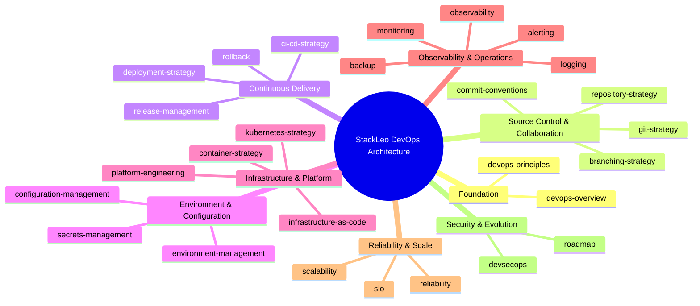
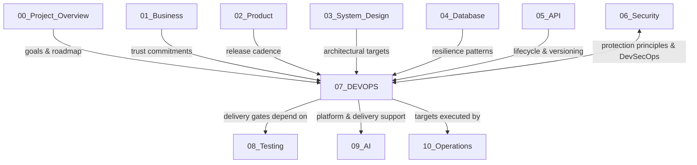
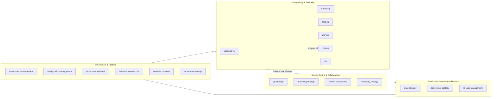
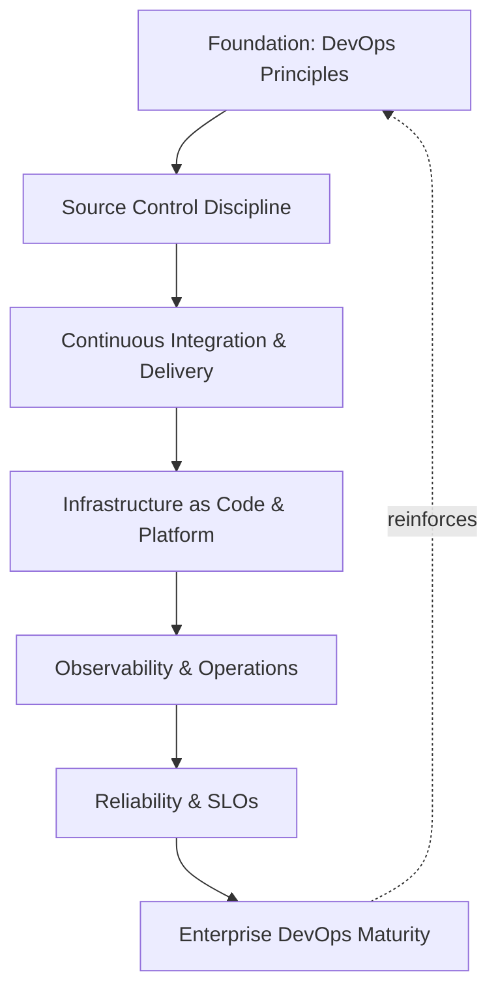
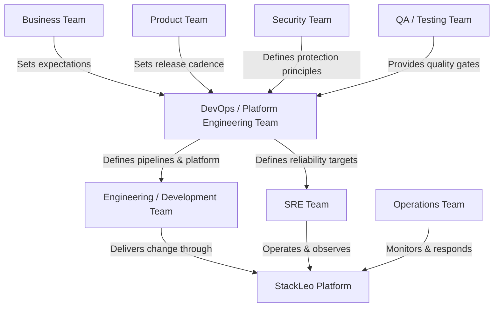

# 07_DEVOPS

## 1. DevOps Documentation Overview

This folder contains the official DevOps architecture documentation for the **StackLeo Tech Store** project. It translates the delivery and operational commitments implied by `01_Business` and the architectural foundation established in `03_System_Design` into a coherent, technology-agnostic view of how the platform is built, delivered, run, and continuously improved.

This README describes the contents of this folder only. It is not the project's main README and does not describe the repository as a whole.

- **Purpose of DevOps Architecture** — to give every reader, regardless of role, a single, authoritative understanding of how StackLeo reasons about the flow of change: how software moves from a developer's intent to a running, observable, recoverable system — independent of any specific tool or vendor chosen to implement it.
- **Relationship with Enterprise Architecture** — this folder is the delivery- and operations-specific elaboration of the architectural principles defined in `03_System_Design/architecture-principles.md`, applied consistently across source control, delivery, infrastructure, and runtime operation. Where `03_System_Design` defines *what* the system is and *why* it is shaped that way, `07_DEVOPS` defines *how* that system is continuously built, shipped, and kept running.
- **Relationship with Development** — this folder does not define application logic or feature behavior; it defines the shared discipline — source control, integration, release — through which development output becomes a reliable, running product. Engineering teams remain accountable for what is built; this folder governs how what is built safely reaches customers.
- **Relationship with Security** — DevOps and security are not sequential concerns. `devsecops.md` and `secrets-management.md` in this folder express, in delivery terms, the identity, access, and data-protection principles defined authoritatively in `06_Security`. Security defines *what must be protected and why*; DevOps defines *how that protection travels through every pipeline and environment*.
- **Relationship with Platform Engineering** — `platform-engineering.md` describes how the practices in this folder are made consumable: durable, self-service, paved-road capability that lets engineering teams deliver safely without re-deriving DevOps discipline for every service.
- **Relationship with SRE** — `observability.md`, `reliability.md`, and `slo.md` establish the shared vocabulary and measurable targets that Site Reliability Engineering practice is built on. DevOps defines how reliability is engineered into the system; SRE, as it matures within `10_Operations`, is accountable for operating against the objectives this folder defines.
- **Relationship with Cloud-Native Systems** — `container-strategy.md`, `kubernetes-strategy.md`, and `infrastructure-as-code.md` establish the conceptual posture toward elastic, declarative, provider-independent infrastructure, ensuring the platform's architecture remains portable as StackLeo scales from a single-market operation toward regional and global infrastructure.

This documentation is implementation-independent and vendor-neutral. It describes DevOps philosophy, architecture, and governance — not specific products, configurations, or step-by-step implementation procedures.

## 2. DevOps Vision

StackLeo's DevOps vision rests on six pillars, elaborated fully in `devops-principles.md`:

- **Flow** — change moves from commit to production through a single, well-understood path, without hidden manual steps or tribal knowledge.
- **Fast Feedback** — every stage of delivery surfaces problems as early and as cheaply as possible, rather than deferring discovery to production.
- **Automation First** — repeatable work is automated by default; manual intervention is reserved for judgment, not toil.
- **Everything as Code** — infrastructure, configuration, and pipelines are defined declaratively, versioned, and reviewed like application code.
- **Resilience by Design** — the platform is built to detect, absorb, and recover from failure, not merely to avoid it.
- **Continuous Improvement** — delivery and operational practice mature deliberately as the platform, team, and business scale.

### DevOps Principle Summary

| Principle | Focus | Primary Business Outcome |
|---|---|---|
| Flow | A single, understood path from commit to production | Reduces lead time and eliminates undocumented, person-dependent releases |
| Fast Feedback | Early, cheap detection of problems | Reduces cost of defects found late or in production |
| Automation First | Repeatable work handled by automated systems | Reduces human error and frees teams for judgment work |
| Everything as Code | Infrastructure and configuration versioned like application code | Makes environments reproducible, reviewable, and auditable |
| Resilience by Design | Systems built to detect, absorb, and recover from failure | Preserves customer trust and business continuity through disruption |
| Continuous Improvement | Deliberate maturing of practice over time | Keeps delivery capability aligned with business growth |

*Diagram 1: DevOps Repository Structure — the eight domains this folder is organized into, and the documents each domain contains.*

## 3. Folder Objectives

This folder exists to:

- Establish a single, authoritative source of truth for how change is delivered and operated at StackLeo, independent of the tools used to implement it.
- Give engineering, security, and business stakeholders a shared vocabulary for discussing delivery speed, environment stability, and operational reliability.
- Define the conceptual boundary between architecture (`03_System_Design`), delivery practice (`07_DEVOPS`), and day-to-day operational execution (`10_Operations`).
- Provide a stable reference that remains valid as StackLeo's infrastructure, team size, and market footprint grow, without requiring re-authorship of underlying principles.
- Embed security, reliability, and cost discipline into delivery practice from the outset, rather than retrofitting them after incidents occur.

## 4. Repository Structure

This folder's documentation is organized into eight domains, each addressed by a dedicated set of documents.

### Foundation

Establishes the philosophy every other document in this folder builds on:

- **devops-overview.md** — introduces the DevOps function at StackLeo: its scope, objectives, and place within the wider engineering organization.
- **devops-principles.md** — defines the foundational DevOps philosophy and non-negotiable principles guiding every practice in this folder.

### Source Control & Collaboration

Covers how change is proposed, organized, and integrated:

- **git-strategy.md** — defines the conceptual approach to source control: how history, ownership, and change are managed across the codebase.
- **branching-strategy.md** — defines how concurrent work is organized, isolated, and integrated across branches.
- **commit-conventions.md** — defines how change is described and structured at the commit level to keep history meaningful and traceable.
- **repository-strategy.md** — defines how code, configuration, and infrastructure are organized across repositories as the platform grows.

### Continuous Delivery

Covers how change moves safely from commit to production:

- **ci-cd-strategy.md** — defines the philosophy for continuous integration and continuous delivery: how change moves safely from commit to production.
- **deployment-strategy.md** — defines how releases are delivered to running environments with predictable, low-risk outcomes.
- **release-management.md** — defines how releases are planned, sequenced, and coordinated across teams and environments.
- **rollback.md** — defines how a change is safely reversed when it produces an unacceptable outcome in production.

### Environment & Configuration

Covers how the surfaces a release lands on are defined and protected:

- **environment-management.md** — defines the lifecycle, purpose, and separation of development, staging, and production environments.
- **configuration-management.md** — defines how environment- and application-level configuration is defined, versioned, and applied consistently.
- **secrets-management.md** — defines principles for protecting credentials, keys, and other sensitive operational material across the delivery lifecycle.

### Infrastructure & Platform

Covers how the runtime foundation of the platform is defined and consumed:

- **infrastructure-as-code.md** — defines the philosophy of treating infrastructure definition as versioned, reviewed, reproducible code.
- **container-strategy.md** — defines the conceptual approach to packaging and running workloads in a portable, consistent runtime unit.
- **kubernetes-strategy.md** — defines the conceptual approach to container orchestration: scheduling, scaling, and self-healing of workloads.
- **platform-engineering.md** — defines how internal platform capability is built to give engineering teams safe, self-service access to infrastructure.

### Observability & Operations

Covers how the running system is understood and protected while live:

- **observability.md** — defines the overarching philosophy for understanding system behavior through telemetry.
- **monitoring.md** — defines how system and business health is continuously measured against expected behavior.
- **logging.md** — defines how event and diagnostic data is captured, structured, and retained across the platform.
- **alerting.md** — defines how abnormal conditions are detected and routed to the right responder with the right urgency.
- **backup.md** — defines how critical data and system state are protected against loss and made recoverable.

### Reliability & Scale

Covers how the platform sustains growth and trustworthy behavior:

- **scalability.md** — defines how the platform sustains growth in load, data, and usage without degrading experience.
- **reliability.md** — defines how the platform sustains consistent, trustworthy behavior under real-world operating conditions.
- **slo.md** — defines how reliability expectations are expressed as measurable service level objectives and error budgets.

### Security & Evolution

Covers how protection and maturity are sustained over time:

- **devsecops.md** — defines how security practice is embedded directly into the delivery lifecycle rather than applied after the fact.
- **roadmap.md** — defines the planned maturity progression of DevOps capability at StackLeo over time.

## 5. Document Summary

| Document | Purpose |
|---|---|
| `devops-overview.md` | Introduces the DevOps function at StackLeo: its scope, objectives, and place within the wider engineering organization. |
| `devops-principles.md` | Defines the foundational DevOps philosophy and non-negotiable principles guiding every practice in this folder. |
| `git-strategy.md` | Defines the conceptual approach to source control: how history, ownership, and change are managed across the codebase. |
| `branching-strategy.md` | Defines how concurrent work is organized, isolated, and integrated across branches. |
| `commit-conventions.md` | Defines how change is described and structured at the commit level to keep history meaningful and traceable. |
| `repository-strategy.md` | Defines how code, configuration, and infrastructure are organized across repositories as the platform grows. |
| `ci-cd-strategy.md` | Defines the philosophy for continuous integration and continuous delivery: how change moves safely from commit to production. |
| `deployment-strategy.md` | Defines how releases are delivered to running environments with predictable, low-risk outcomes. |
| `release-management.md` | Defines how releases are planned, sequenced, and coordinated across teams and environments. |
| `environment-management.md` | Defines the lifecycle, purpose, and separation of development, staging, and production environments. |
| `configuration-management.md` | Defines how environment- and application-level configuration is defined, versioned, and applied consistently. |
| `secrets-management.md` | Defines principles for protecting credentials, keys, and other sensitive operational material across the delivery lifecycle. |
| `infrastructure-as-code.md` | Defines the philosophy of treating infrastructure definition as versioned, reviewed, reproducible code. |
| `container-strategy.md` | Defines the conceptual approach to packaging and running workloads in a portable, consistent runtime unit. |
| `kubernetes-strategy.md` | Defines the conceptual approach to container orchestration: scheduling, scaling, and self-healing of workloads. |
| `platform-engineering.md` | Defines how internal platform capability is built to give engineering teams safe, self-service access to infrastructure. |
| `observability.md` | Defines the overarching philosophy for understanding system behavior through telemetry. |
| `monitoring.md` | Defines how system and business health is continuously measured against expected behavior. |
| `logging.md` | Defines how event and diagnostic data is captured, structured, and retained across the platform. |
| `alerting.md` | Defines how abnormal conditions are detected and routed to the right responder with the right urgency. |
| `rollback.md` | Defines how a change is safely reversed when it produces an unacceptable outcome in production. |
| `backup.md` | Defines how critical data and system state are protected against loss and made recoverable. |
| `scalability.md` | Defines how the platform sustains growth in load, data, and usage without degrading experience. |
| `reliability.md` | Defines how the platform sustains consistent, trustworthy behavior under real-world operating conditions. |
| `slo.md` | Defines how reliability expectations are expressed as measurable service level objectives and error budgets. |
| `devsecops.md` | Defines how security practice is embedded directly into the delivery lifecycle rather than applied after the fact. |
| `roadmap.md` | Defines the planned maturity progression of DevOps capability at StackLeo over time. |

## 6. Architecture Relationships

DevOps architecture does not exist in isolation. It sits between the system's architectural definition and its day-to-day operation, and it depends on and informs every other domain in this repository.

- **`00_Project_Overview`** — this folder operationalizes the goals, scope, and constraints defined there. `roadmap.md` is sequenced against the milestones in `project-roadmap.md`, so delivery capability grows in step with stated project priorities rather than ahead of or behind them.
- **`01_Business`** — delivery speed and operational reliability are direct expressions of business trust: an unreliable platform or a slow release process is a business failure, not merely a technical one. `reliability.md` and `slo.md` translate business trust commitments into measurable engineering targets.
- **`02_Product`** — product release cadence and feature sequencing drive `release-management.md` and `deployment-strategy.md`. This folder exists to make the product roadmap deliverable at the pace the business requires, safely.
- **`03_System_Design`** — this folder is the delivery- and operations-specific elaboration of the architecture defined there. `deployment-architecture.md`, `scalability-strategy.md`, and `observability.md` in `03_System_Design` describe the target system conceptually; `deployment-strategy.md`, `scalability.md`, and `observability.md` in this folder describe how that target system is continuously built, delivered, and kept observable in practice.
- **`04_Database`** — `environment-management.md`, `infrastructure-as-code.md`, and `backup.md` provide the operational scaffolding — environment separation, declarative provisioning, recovery orchestration — surrounding the database architecture and resilience patterns defined in `04_Database`.
- **`05_API`** — `ci-cd-strategy.md` and `deployment-strategy.md` govern how API contracts are built, versioned, and shipped consistently with the lifecycle and versioning discipline defined in `05_API/api-lifecycle.md` and `05_API/versioning.md`.
- **`06_Security`** — `devsecops.md` is the direct bridge between the two folders: it describes how the protection principles authoritatively defined in `06_Security` are embedded into every pipeline and environment. `secrets-management.md` in this folder is the delivery-lifecycle counterpart of `06_Security/secrets-management.md`; security defines what must be protected and why, DevOps defines how that protection travels through the system.
- **`08_Testing`** *(planned)* — `ci-cd-strategy.md` and `rollback.md` depend on the quality gates defined in `08_Testing` to make automated delivery decisions safe; testing discipline is what allows this folder's automation-first principle to be trusted.
- **`09_AI`** *(planned)* — `platform-engineering.md` and `observability.md` extend to support AI/ML workload delivery, versioning, and monitoring as that capability is built, without requiring a parallel delivery discipline.
- **`10_Operations`** *(planned)* — `reliability.md`, `slo.md`, `monitoring.md`, and `alerting.md` are the architectural foundation that day-to-day operational practice in `10_Operations` is expected to execute against; this folder defines the target, `10_Operations` defines the daily discipline of meeting it.

*Diagram 2: DevOps Architecture Relationships — this folder receives direction from project, business, product, architecture, database, and API context, exchanges principles bidirectionally with security, and sets the targets that testing, AI, and operations practice build on.*

## 7. CI/CD Ecosystem Overview

Continuous integration and continuous delivery are not a single document in this folder — they are the connective process that every other domain feeds into or depends on. Source control discipline determines what enters the pipeline; environment, configuration, and infrastructure discipline determine where and how it lands; observability and reliability discipline determine whether the outcome is trustworthy and, if not, how quickly it is reversed.

*Diagram 3: CI/CD Ecosystem Overview — change flows from source through delivery into the runtime environment, is continuously assured, and that assurance both informs future change and triggers rollback when required.*

## 8. DevOps Evolution & Roadmap

DevOps maturity at StackLeo builds in deliberate stages, each depending on the one before it, as elaborated fully in `roadmap.md`:

*Diagram 4: DevOps Maturity Evolution — each stage depends on the discipline established before it, and mature operational practice reinforces the founding principles rather than replacing them.*

### DevOps Evolution Roadmap

| Stage | Focus | Representative Documents |
|---|---|---|
| Foundation | Establish guiding philosophy and non-negotiable principles. | `devops-overview.md`, `devops-principles.md` |
| Source Control Discipline | Establish how change is proposed, organized, and integrated. | `git-strategy.md`, `branching-strategy.md`, `commit-conventions.md`, `repository-strategy.md` |
| Continuous Integration & Delivery | Move change safely and predictably from commit to production. | `ci-cd-strategy.md`, `deployment-strategy.md`, `release-management.md`, `rollback.md` |
| Infrastructure as Code & Platform | Make environments and infrastructure reproducible and self-service. | `environment-management.md`, `configuration-management.md`, `secrets-management.md`, `infrastructure-as-code.md`, `container-strategy.md`, `kubernetes-strategy.md`, `platform-engineering.md` |
| Observability & Operations | Understand and protect the system while it is running. | `observability.md`, `monitoring.md`, `logging.md`, `alerting.md`, `backup.md` |
| Reliability & SLOs | Express and sustain trustworthy behavior as measurable objectives. | `scalability.md`, `reliability.md`, `slo.md` |
| Enterprise DevOps Maturity | Sustain security integration and continuous evolution at scale. | `devsecops.md`, `roadmap.md` |

This progression is deliberate rather than incidental: source control discipline must exist before integration and delivery practice is meaningful; delivery practice must be trustworthy before infrastructure can be safely made self-service; and observability must exist before reliability can be measured, targeted, or improved.

## 9. Folder Navigation

| Folder | Purpose | Status |
|---|---|---|
| `00_Project_Overview` | Project goals, scope, constraints, stakeholders, and roadmap. | Active |
| `01_Business` | Business vision, model, and trust commitments. | Active |
| `02_Product` | Product definition, experience, and feature strategy. | Active |
| `03_System_Design` | Enterprise system architecture and architectural principles. | Active |
| `04_Database` | Data architecture, modeling, and persistence strategy. | Active |
| `05_API` | API architecture, standards, and lifecycle governance. | Active |
| `06_Security` | Security architecture, principles, and governance. | Active |
| `07_DEVOPS` | DevOps, delivery, infrastructure, and reliability architecture. | Active *(this folder)* |
| `08_Testing` | Quality assurance and testing strategy. | Planned |
| `09_AI` | AI/ML capability architecture. | Planned |
| `10_Operations` | Day-to-day operational execution and support. | Planned |

## 10. Responsibility Matrix

DevOps at StackLeo is a shared responsibility, not the sole obligation of any one team:

| Stakeholder | Primary Responsibility | Accountable For |
|---|---|---|
| Business Team | Sets delivery and reliability expectations tied to business outcomes | Aligning DevOps investment with business impact |
| Product Team | Defines release cadence and feature sequencing | Realistic, business-aligned release expectations |
| Engineering / Development Team | Builds application capability within the delivery process | Applying source control and delivery discipline in day-to-day work |
| DevOps / Platform Engineering Team | Owns the coherence of this folder's principles and architecture | Delivery pipeline design, environment strategy, platform self-service capability |
| SRE Team | Operates against reliability and observability targets | Meeting SLOs, incident response, operational feedback into architecture |
| Security Team | Defines protection principles this folder must embed | Coherence between `06_Security` principles and `devsecops.md` practice |
| QA / Testing Team | Defines the quality gates delivery pipelines depend on | Trustworthiness of automated delivery decisions |
| Operations Team | Executes day-to-day monitoring and operational response | Day-to-day enforcement of reliability and recovery practice |

*Diagram 5: DevOps Responsibility Model — business, product, and security set expectations and constraints; the DevOps/Platform Engineering team turns them into pipelines, platform capability, and reliability targets; engineering, SRE, QA, and operations execute against them.*

## 11. Future DevOps Readiness

This folder's documentation is deliberately structured to remain valid as StackLeo's scope grows:

- **Global Expansion** — as StackLeo grows from Bangladesh into South Asia and beyond, `environment-management.md` and `infrastructure-as-code.md` remain region-agnostic, allowing new regional environments to be added without redefining delivery principles.
- **Public APIs** — as capability is exposed to external consumers per `05_API/api-strategy.md`, `ci-cd-strategy.md` and `deployment-strategy.md` extend the same delivery and rollback discipline to externally consumed contracts.
- **Marketplace Platform** — the shift to a multi-vendor marketplace increases the number of independently deployable capabilities; `repository-strategy.md` and `platform-engineering.md` are structured to absorb that growth without fragmenting delivery discipline.
- **AI Features** — AI-assisted capability (search, recommendations, fraud detection) is delivered, versioned, and observed through the same pipelines and observability principles as any other system capability, per `platform-engineering.md` and `observability.md`.
- **Partner Ecosystem** — a growing network of couriers, payment providers, and future sellers depends on the reliability targets defined in `slo.md` and `reliability.md` to trust their integrations with the platform.
- **Enterprise Customers** — corporate and wholesale customers bring heightened expectations for release predictability and uptime, which `release-management.md` and `slo.md` are structured to support.
- **Regulatory Requirements** — as StackLeo's markets expand, `configuration-management.md` and `secrets-management.md` provide the structure through which new regional data-handling and residency obligations are absorbed without disrupting delivery practice.

## 12. DevOps Governance

- **DevOps Ownership** — a designated DevOps/Platform Engineering lead owns the coherence, currency, and enforcement of this folder's documentation, detailed further in `devops-principles.md`.
- **Practice Management** — operational delivery practices are derived from the principles in this folder and maintained as living documents, reviewed on a defined cadence.
- **Architecture Reviews** — significant delivery, infrastructure, and platform decisions are evaluated against this folder's principles before adoption, mirroring the review process in `03_System_Design/architecture-decisions.md`.
- **Reliability Review** — reliability posture is assessed against the objectives in `slo.md`, with deviations addressed deliberately rather than absorbed silently.
- **Continuous Improvement** — this folder's documentation, and the practice it describes, is expected to mature over time as the platform, organization, and operating scale evolve, per `roadmap.md`, rather than being fixed at any single point in time.

## 13. Document Information

| Property | Value |
|----------|-------|
| Document | README.md |
| Folder | 07_DEVOPS |
| Version | 1.0.0 |
| Status | Active |
| Maintained By | StackLeo |
| Last Updated | 2026-07-24 |

---

© StackLeo. All Rights Reserved.
