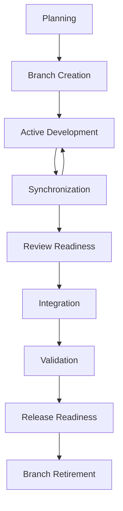
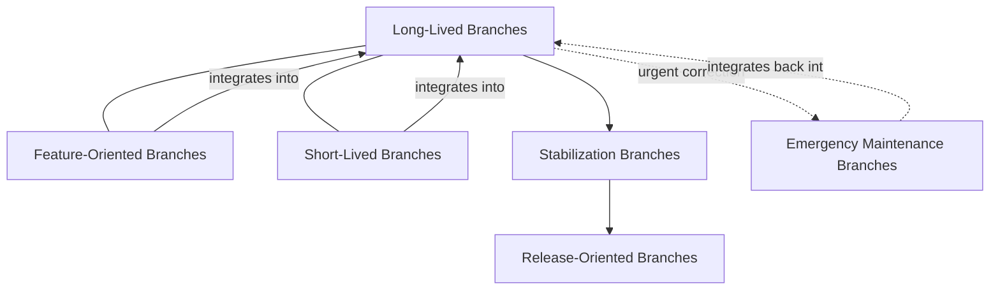
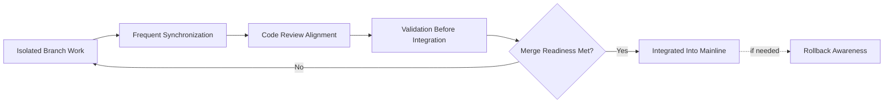
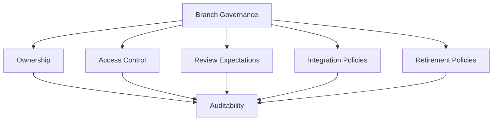
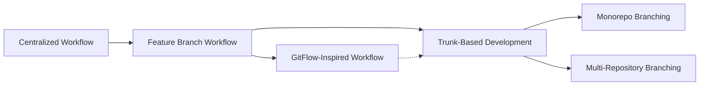

# Branching Strategy

## 1. Document Purpose

This document defines how branching is governed conceptually at **StackLeo** — how isolated work is created, integrated, stabilized, and retired, without prescribing a specific branching model, naming convention, or tool-level workflow.

- **Purpose of Branching Strategy** — to give every contributor a shared understanding of how work is isolated long enough to be developed safely, and integrated soon enough to remain trustworthy, so that concurrent contribution does not compromise the stability of the shared codebase.
- **Relationship with Source Control Governance** — this document is the branch-specific elaboration of the principles defined in `git-strategy.md`, in particular Controlled Change, Small Incremental Changes, and Auditability. Where `git-strategy.md` governs the repository and its history as a whole, this document governs how work-in-progress moves through that history.
- **Relationship with Release Management** — branch structure and release readiness are directly connected; `release-management.md` depends on branches conveying a clear, unambiguous signal of what is stable, what is being stabilized, and what remains under active development.
- **Relationship with Software Quality** — disciplined branching keeps changes small, isolated, and reviewable, which is a precondition for the quality practices defined elsewhere in this repository; poor branching discipline undermines quality assurance regardless of how rigorous testing itself is.
- **Relationship with DevOps** — branching discipline directly determines how effectively `ci-cd-strategy.md` can be practiced; frequent, small, well-integrated change is what makes continuous integration and continuous delivery possible in practice, not just in name.

This document is implementation-independent and vendor-neutral. It defines branching philosophy, lifecycle, and governance conceptually — not specific branch names, commands, or a mandated branching model.

## 2. Branching Philosophy

- **Isolation of Work** — work in progress is separated from stable, shared history until it is ready to be evaluated, protecting the mainline from unfinished or unvalidated change.
- **Controlled Integration** — isolated work is brought back into shared history through a deliberate, governed process, not merged opportunistically or without review.
- **Continuous Collaboration** — isolation exists to protect stability, not to prevent collaboration; contributors are expected to synchronize with shared history frequently rather than diverging for extended periods.
- **Small Incremental Changes** — branches are scoped to represent a small, coherent unit of work, consistent with the Small Incremental Changes principle in `git-strategy.md`.
- **Stable Mainline** — the primary line of shared history is expected to remain in a known-good, reliable state at all times, protected by the integration discipline this strategy defines.
- **Traceability** — every branch's purpose, origin, and eventual disposition is understood and attributable, so history remains a coherent record rather than a collection of unexplained divergences.

## 3. Branch Lifecycle

Every branch, regardless of category, is understood to move through nine conceptual stages.

### Planning

- **Purpose** — establish the scope and intent of the work before isolation begins.
- **Business Value** — reduces wasted effort from work that begins without a clear, agreed purpose.
- **Governance Objectives** — ensure every branch can be traced back to a defined, intentional unit of work.

### Branch Creation

- **Purpose** — isolate the defined unit of work from shared history at a known, stable starting point.
- **Business Value** — protects the mainline from exposure to unfinished work from the outset.
- **Governance Objectives** — ensure branches originate from a known-good state, not an arbitrary or stale one.

### Active Development

- **Purpose** — allow the defined work to progress without affecting shared history.
- **Business Value** — gives contributors room to iterate freely while protecting collaborators from in-progress instability.
- **Governance Objectives** — bound active development to the scope defined during planning.

### Synchronization

- **Purpose** — periodically reconcile the branch with ongoing changes to shared history.
- **Business Value** — reduces the risk of large, difficult conflicts accumulating from prolonged divergence.
- **Governance Objectives** — make synchronization frequent and routine, not a rare, high-effort event.

### Review Readiness

- **Purpose** — confirm the work meets a baseline of completeness and clarity before requesting review.
- **Business Value** — makes reviewer time efficient and reduces cycles spent on premature or incomplete submissions.
- **Governance Objectives** — establish a consistent, understood bar for what "ready for review" means.

### Integration

- **Purpose** — bring reviewed, validated work into shared history through a governed process.
- **Business Value** — ensures shared history only ever receives change that has been examined and approved.
- **Governance Objectives** — make integration conditional on defined review and validation outcomes, not on convenience.

### Validation

- **Purpose** — confirm that integrated change behaves as expected within the context of the full, combined codebase.
- **Business Value** — catches integration-level issues that isolated development could not reveal.
- **Governance Objectives** — treat post-integration validation as a required step, not an optional afterthought.

### Release Readiness

- **Purpose** — determine whether integrated change is suitable to be included in an upcoming release.
- **Business Value** — connects day-to-day integration activity to the business's release commitments.
- **Governance Objectives** — maintain a clear, consistent signal of what is release-ready at any given time.

### Branch Retirement

- **Purpose** — formally close a branch once its work has been integrated or abandoned.
- **Business Value** — keeps the repository navigable and prevents accumulation of stale, ambiguous branches.
- **Governance Objectives** — ensure no branch persists indefinitely without a defined disposition.

*Diagram 1: Branch Lifecycle — every branch moves from planning through creation, iterative development and synchronization, review, integration, and validation, toward release readiness and eventual retirement.*

### Branch Lifecycle Matrix

| Stage | Purpose | Business Value |
|---|---|---|
| Planning | Establish scope and intent before isolation | Reduces wasted, unfocused effort |
| Branch Creation | Isolate work from a known-good state | Protects the mainline from unfinished work |
| Active Development | Allow progress without affecting shared history | Enables free iteration without collaborator risk |
| Synchronization | Periodically reconcile with shared history | Reduces risk of large, difficult conflicts |
| Review Readiness | Confirm completeness before requesting review | Makes reviewer time efficient |
| Integration | Bring validated work into shared history | Ensures only examined change reaches shared history |
| Validation | Confirm behavior within the full codebase | Catches integration-level issues early |
| Release Readiness | Determine suitability for an upcoming release | Connects integration to release commitments |
| Branch Retirement | Formally close a branch after disposition | Keeps the repository navigable and current |

## 4. Branch Categories

Branch categories are described conceptually; this strategy does not prescribe naming conventions or a mandated model.

### Long-Lived Branches

- **Scope** — represent an enduring, stable line of history, most commonly reflecting what is currently released.
- **Responsibilities** — protected from direct, unreviewed change; every change reaching them has passed integration and validation.
- **Typical Usage** — a continuous reference point for what is currently stable or currently in production.
- **Lifecycle Expectations** — persist indefinitely, subject to the strictest governance of any branch category.

### Short-Lived Branches

- **Scope** — represent a single, narrowly scoped unit of work.
- **Responsibilities** — remain isolated only as long as necessary to complete and integrate the defined work.
- **Typical Usage** — the default category for day-to-day development activity.
- **Lifecycle Expectations** — created, developed, integrated, and retired within a short, bounded timeframe.

### Feature-Oriented Branches

- **Scope** — represent the isolated development of a specific capability or enhancement.
- **Responsibilities** — remain scoped to the feature's defined boundary, avoiding unrelated change.
- **Typical Usage** — used when a unit of work is best understood as a discrete capability rather than a general change.
- **Lifecycle Expectations** — retired upon integration or upon a deliberate decision not to proceed.

### Stabilization Branches

- **Scope** — represent a defined scope of change being prepared for release.
- **Responsibilities** — accept corrective change only; new capability is deliberately excluded once stabilization begins.
- **Typical Usage** — used in the period between feature completion and release, to reduce risk before release readiness is declared.
- **Lifecycle Expectations** — short-lived by design, concluding when the associated release is finalized.

### Release-Oriented Branches

- **Scope** — represent the specific state of the codebase associated with a given release.
- **Responsibilities** — provide a stable reference point for what was released, supporting investigation and rollback.
- **Typical Usage** — used when a release's state must remain independently referenceable after ongoing development has moved beyond it.
- **Lifecycle Expectations** — retained for as long as the associated release remains relevant to operations or investigation.

### Emergency Maintenance Branches

- **Scope** — represent an isolated, urgent correction to already-released behavior.
- **Responsibilities** — scoped as narrowly as possible to the specific issue being addressed, minimizing unrelated risk.
- **Typical Usage** — used when an issue in released behavior requires correction faster than the standard development cycle allows.
- **Lifecycle Expectations** — extremely short-lived, retired immediately upon integration and validation of the correction.

*Diagram 3: Repository Collaboration Model — how the different branch categories relate to the stable mainline, converging through integration and diverging only briefly and deliberately, including for urgent correction.*

### Branch Category Comparison

| Category | Scope | Lifecycle Expectation |
|---|---|---|
| Long-Lived Branches | Enduring, stable line of history | Persist indefinitely, strictest governance |
| Short-Lived Branches | Single, narrowly scoped unit of work | Created, integrated, and retired quickly |
| Feature-Oriented Branches | Isolated development of a discrete capability | Retired upon integration or abandonment |
| Stabilization Branches | Defined scope prepared for release | Short-lived, concludes at release finalization |
| Release-Oriented Branches | State of the codebase for a given release | Retained while the release remains relevant |
| Emergency Maintenance Branches | Urgent, narrowly scoped correction | Extremely short-lived, retired immediately after integration |

## 5. Integration Strategy

- **Continuous Integration Awareness** — branches are developed with the expectation of frequent integration, consistent with the continuous integration philosophy in `ci-cd-strategy.md`, rather than as long-running, isolated efforts.
- **Merge Readiness** — a branch is only integrated once it meets a defined, consistent standard of readiness, encompassing review outcome, validation result, and scope completeness.
- **Conflict Prevention** — frequent synchronization and small, scoped branches are treated as the primary defense against difficult conflicts, rather than resolving large conflicts as a routine expectation.
- **Code Review Alignment** — integration is directly gated on the review expectations defined in `git-strategy.md`, ensuring branch governance and change management remain consistent with one another.
- **Validation Before Integration** — a branch's readiness for integration includes confirmation that it behaves as expected, not only that it has been reviewed.
- **Rollback Awareness** — every integration is treated as a change that may need to be identified and reversed, consistent with `rollback.md`, which shapes how integration is scoped and recorded.

*Diagram 2: Conceptual Branch Integration Flow — isolated work is repeatedly synchronized, reviewed, and validated, integrating only once readiness criteria are met, with rollback treated as an available, expected path.*

### Integration Strategy Matrix

| Concept | Focus | Business Value |
|---|---|---|
| Continuous Integration Awareness | Frequent integration over long isolation | Reduces integration risk and delay |
| Merge Readiness | Defined, consistent readiness standard | Prevents inconsistent, ad hoc integration decisions |
| Conflict Prevention | Small scope and frequent synchronization | Reduces likelihood of difficult, costly conflicts |
| Code Review Alignment | Integration gated on review outcomes | Keeps branch and change governance consistent |
| Validation Before Integration | Behavior confirmed, not only reviewed | Catches issues review alone would miss |
| Rollback Awareness | Every integration treated as reversible | Limits business impact when a change must be reversed |

## 6. Branch Governance

- **Ownership** — each long-lived and release-oriented branch has a clearly accountable owner responsible for its protection and integrity.
- **Access Control** — the ability to integrate directly into protected branches is limited according to role and responsibility, consistent with the least-privilege principle in `06_Security/security-principles.md`.
- **Review Expectations** — integration into any shared branch requires review consistent with the standards defined in `git-strategy.md`, without exception for convenience or urgency.
- **Integration Policies** — the conditions under which a branch may be integrated are defined consistently and applied uniformly, not decided case by case.
- **Retirement Policies** — branches are expected to be retired promptly once their purpose concludes, and stale branches are periodically identified and addressed.
- **Auditability** — the creation, integration, and retirement of every branch is traceable, supporting investigation and compliance needs consistent with `git-strategy.md`.

*Diagram 4: Branch Governance Framework — ownership, access, review, and integration and retirement policy all converge on a consistently auditable record of branch activity.*

### Governance Responsibility Matrix

| Governance Area | Owner | Accountable For |
|---|---|---|
| Ownership | Repository & Branch Owners | Protection and integrity of long-lived and release-oriented branches |
| Access Control | Platform & Security Teams | Least-privilege access to protected branches |
| Review Expectations | Engineering Teams | Consistent review before integration, without exception |
| Integration Policies | DevOps / Platform Engineering | Uniform, consistently applied integration conditions |
| Retirement Policies | Repository Owners | Timely retirement of concluded branches |
| Auditability | Platform & Security Teams | Traceable record of branch creation, integration, and retirement |

## 7. Strategy Evolution

Branching approaches vary in how they balance isolation, integration frequency, and release stabilization. StackLeo does not mandate a single approach as universally correct; the appropriate balance may vary by team, repository, and stage of platform maturity, evaluated against the principles in Section 2.

- **Centralized Workflow** — contributors work against a single shared line of history with minimal isolation. Simple to reason about, but offers little protection against unfinished or unstable work affecting collaborators.
- **Feature Branch Workflow** — work is isolated per feature until complete, then integrated. Offers strong isolation, but risks longer-lived divergence if integration is not disciplined.
- **Trunk-Based Development** — contributors integrate small, frequent changes directly into a single mainline, favoring continuous integration over prolonged isolation. Minimizes integration risk but requires strong automated validation and disciplined change scoping.
- **GitFlow-Inspired Workflow** — a structured set of long-lived and short-lived branch categories map explicitly to development, stabilization, and release stages. Provides strong release structure, but introduces more coordination overhead than simpler approaches.
- **Monorepo Branching** — a single repository holds a broad set of related capability, with branching principles applied consistently across it. Simplifies cross-cutting change, but requires strong tooling and governance discipline to remain navigable at scale.
- **Multi-Repository Branching** — branching principles are applied independently across many narrowly scoped repositories. Limits blast radius per repository, but requires more deliberate coordination for changes that span repositories.

*Diagram 5: Branch Strategy Evolution — a conceptual spectrum from minimal isolation toward increasingly structured or increasingly continuous approaches, and from a single repository toward many; no position on this spectrum is presented as universally correct.*

### Workflow Comparison Matrix

| Workflow | Core Idea | Strategic Trade-off |
|---|---|---|
| Centralized Workflow | Minimal isolation, single shared history | Simple, but little protection from unstable work |
| Feature Branch Workflow | Isolation per feature until completion | Strong isolation, risk of prolonged divergence |
| Trunk-Based Development | Frequent, small, direct integration | Low integration risk, requires strong validation discipline |
| GitFlow-Inspired Workflow | Explicit branch categories per lifecycle stage | Strong release structure, more coordination overhead |
| Monorepo Branching | One repository, broad related capability | Simplifies cross-cutting change, requires strong tooling discipline |
| Multi-Repository Branching | Many narrowly scoped repositories | Limits blast radius, requires cross-repository coordination |

## 8. Future Readiness

- **Modular Monolith** — branch category and integration principles apply cleanly to a single, well-bounded codebase organized into internal modules.
- **Microservices** — as capability decomposes into independently deployable services, branch governance principles extend to a growing number of repositories without requiring redefinition.
- **Platform Engineering** — branch lifecycle and integration expectations are structured to be enforceable through self-service platform capability, consistent with `platform-engineering.md`.
- **AI Projects** — repositories supporting AI-assisted capability follow the same branch lifecycle, review, and integration discipline as any other repository.
- **Marketplace Platform** — as StackLeo evolves toward a multi-vendor marketplace with business, corporate, and wholesale sales, branch governance scales to a broader, more diverse set of contributing teams without loss of integration discipline.
- **Multi-Team Development** — synchronization and integration principles are structured to remain coherent as the number of teams contributing concurrently grows.
- **Global Engineering** — as StackLeo grows from Bangladesh into South Asia and, over time, global markets, branch governance remains independent of contributor location or time zone, supporting distributed, asynchronous collaboration.

## 9. Anti-Patterns

- **Long-Lived Feature Branches** — allowing a branch to remain isolated far beyond its intended scope. This increases divergence from shared history and makes eventual integration disproportionately difficult and risky.
- **Massive Merge Operations** — integrating large, sweeping sets of change at once. This overwhelms review and validation, defeating the purpose of both.
- **Weak Integration Discipline** — allowing integration criteria to be applied inconsistently or bypassed under time pressure. This erodes trust in the mainline's stability.
- **Poor Branch Hygiene** — allowing branches to accumulate without clear purpose, ownership, or disposition. This makes the repository progressively harder to navigate and reason about.
- **Missing Reviews** — integrating change without independent review, even occasionally. This removes the primary safeguard this strategy depends on to catch defects before they reach shared history.
- **Branch Proliferation** — creating branches without discipline or a defined lifecycle expectation. This produces an unmanageable number of divergent lines of work that no one is accountable for reconciling.
- **Reactive Integration** — integrating only when forced by an approaching deadline rather than continuously. This concentrates integration risk into infrequent, high-stakes events instead of distributing it safely over time.
- **No Retirement Strategy** — leaving completed or abandoned branches indefinitely in the repository. This obscures which lines of work remain relevant and increases the cognitive cost of navigating the repository.

### Anti-Pattern Summary

| Anti-Pattern | Why It Must Be Avoided |
|---|---|
| Long-Lived Feature Branches | Increases divergence, making eventual integration disproportionately risky |
| Massive Merge Operations | Overwhelms review and validation, defeating their purpose |
| Weak Integration Discipline | Erodes trust in the stability of the mainline |
| Poor Branch Hygiene | Makes the repository progressively harder to navigate |
| Missing Reviews | Removes the primary safeguard against defects reaching shared history |
| Branch Proliferation | Produces unmanaged, divergent lines of work with no clear accountability |
| Reactive Integration | Concentrates integration risk into infrequent, high-stakes events |
| No Retirement Strategy | Obscures which work remains relevant, increasing navigation cost |

## 10. Document Information

| Property | Value |
|----------|-------|
| Document | branching-strategy.md |
| Version | 1.0.0 |
| Status | Active |
| Maintained By | StackLeo |
| Last Updated | 2026-07-24 |

---

© StackLeo. All Rights Reserved.
