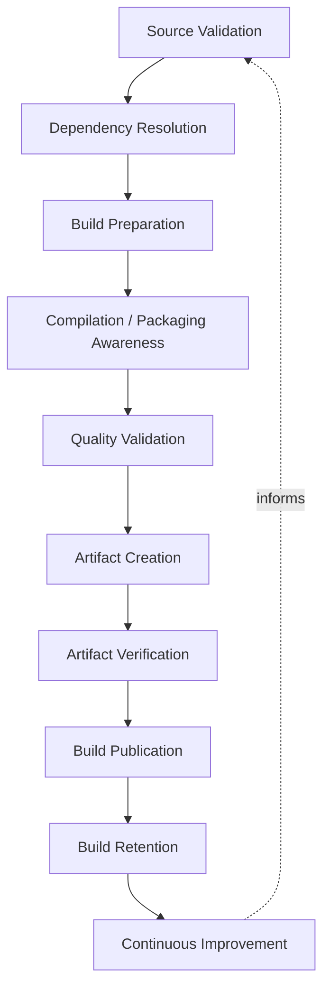
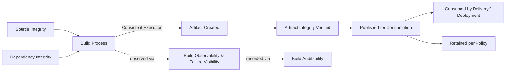
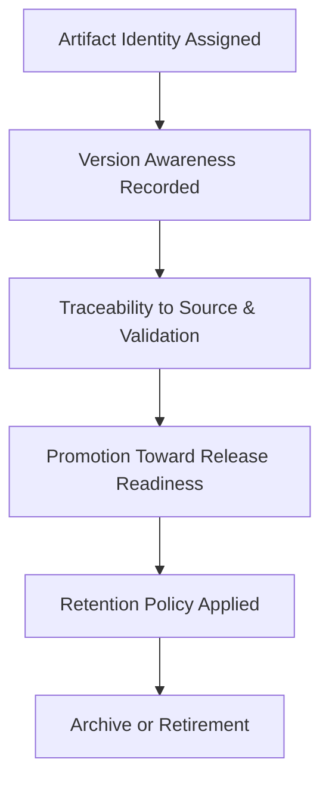
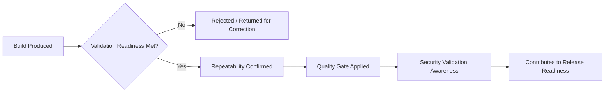
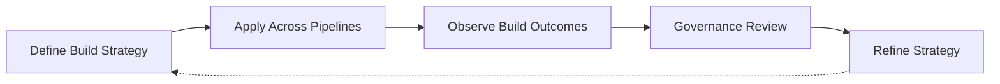

# Build Pipeline

## 1. Document Purpose

This document defines the enterprise strategy for build pipelines at **StackLeo** — how source becomes a trustworthy, verifiable, deployable artifact, and how that artifact is governed from creation through eventual retirement, without prescribing specific build tools, CI platforms, or scripts.

- **Purpose of Build Pipelines** — to ensure that the transformation of source into a deployable artifact is consistent, reproducible, and trustworthy every time it occurs, so that everything downstream — testing, delivery, deployment — can rely on the artifact without re-verifying how it was produced.
- **Relationship with CI/CD** — this document is the build-specific elaboration of `ci-cd-strategy.md`. Where CI/CD strategy governs the full path from commit to production, this document governs the specific stage in which source is transformed into a verifiable, deployable unit.
- **Relationship with Release Management** — `release-management.md` depends on build artifacts being unambiguous, versioned, and traceable, so that what is released can always be connected back to the exact source and validation that produced it.
- **Relationship with Software Quality** — build validation is the earliest point at which quality expectations can be automatically enforced; a weak or bypassed build stage undermines every quality assumption made about a release later in the pipeline.
- **Relationship with DevSecOps** — the build stage is a natural point to apply security validation awareness, consistent with `devsecops.md`, since it is the first stage at which a complete, assembled artifact exists to be examined.

This document is implementation-independent and vendor-neutral. It defines build philosophy, lifecycle, and governance conceptually — not specific tools, pipeline configurations, or build scripts.

## 2. Build Philosophy

- **Reproducible Builds** — the same source, under the same declared conditions, produces the same artifact every time, regardless of when or where the build occurs.
- **Automation First** — the transformation from source to artifact is fully automated, without manual, person-executed steps that introduce variance.
- **Immutable Artifacts** — once created, an artifact is never modified in place; any change requires a new build and a new, distinct artifact.
- **Consistency** — the same build process applies uniformly across environments and teams, so confidence gained in one context transfers to another.
- **Traceability** — every artifact can be traced back to the exact source, dependencies, and conditions that produced it.
- **Reliability** — the build pipeline itself is treated as a production-grade system, engineered to be dependable rather than assumed to work.
- **Continuous Improvement** — build practice is expected to mature over time, informed by what is learned from build outcomes and failures.

## 3. Build Lifecycle

### Source Validation

- **Purpose** — confirm that the source being built is complete, expected, and originates from a trustworthy point in history.
- **Business Value** — prevents wasted build effort on incomplete or unexpected source input.
- **Governance Objectives** — ensure every build is traceable to a known, specific source state.

### Dependency Resolution

- **Purpose** — determine and retrieve the exact set of dependencies the build requires.
- **Business Value** — prevents inconsistent or unexpected dependency versions from silently altering build behavior.
- **Governance Objectives** — ensure dependency resolution is deterministic and traceable, not dependent on unpinned or ambient state.

### Build Preparation

- **Purpose** — assemble the environment and inputs the build requires before transformation begins.
- **Business Value** — reduces mid-build failures caused by missing or misconfigured prerequisites.
- **Governance Objectives** — ensure build preparation is itself automated and repeatable.

### Compilation / Packaging Awareness

- **Purpose** — transform validated source and resolved dependencies into a structured, executable or deployable form.
- **Business Value** — produces the concrete unit that all downstream delivery activity depends on.
- **Governance Objectives** — ensure this transformation is deterministic, given the same source and dependencies.

### Quality Validation

- **Purpose** — confirm the freshly built artifact meets defined quality expectations before it progresses further.
- **Business Value** — catches build-level defects before they consume further pipeline or human effort.
- **Governance Objectives** — make quality validation a required condition of artifact creation, not an optional check.

### Artifact Creation

- **Purpose** — formally produce the immutable, identifiable unit that represents this specific build outcome.
- **Business Value** — gives every downstream stage a single, unambiguous unit to reference and depend on.
- **Governance Objectives** — ensure every artifact is uniquely and consistently identified.

### Artifact Verification

- **Purpose** — confirm the created artifact is complete, uncorrupted, and matches its expected composition.
- **Business Value** — prevents downstream stages from consuming a defective or incomplete artifact.
- **Governance Objectives** — treat verification as a required gate before an artifact is made available for use.

### Build Publication

- **Purpose** — make a verified artifact available to the stages and teams authorized to consume it.
- **Business Value** — connects successful build outcomes to the rest of the delivery pipeline without delay.
- **Governance Objectives** — ensure only verified artifacts are ever published for consumption.

### Build Retention

- **Purpose** — determine how long a given artifact and its associated build record remain available.
- **Business Value** — balances the operational value of historical artifacts against the cost of retaining them indefinitely.
- **Governance Objectives** — apply a consistent, deliberate retention policy rather than an ad hoc one.

### Continuous Improvement

- **Purpose** — feed build outcomes, including failures, back into the build process itself.
- **Business Value** — keeps build practice improving in step with the platform's growing scale and complexity.
- **Governance Objectives** — ensure build failures and inefficiencies are reviewed and acted upon, not merely retried.

*Diagram 1: Enterprise Build Lifecycle — source moves through validation, dependency resolution, preparation, and transformation, into quality-gated artifact creation, verification, publication, and retention, with outcomes feeding back into future builds.*

### Build Lifecycle Matrix

| Stage | Purpose | Business Value |
|---|---|---|
| Source Validation | Confirm source is complete and trustworthy | Prevents wasted effort on unexpected input |
| Dependency Resolution | Determine and retrieve exact dependencies | Prevents inconsistent dependency behavior |
| Build Preparation | Assemble environment and inputs | Reduces mid-build failures from missing prerequisites |
| Compilation / Packaging Awareness | Transform source into deployable form | Produces the unit all downstream activity depends on |
| Quality Validation | Confirm artifact meets quality expectations | Catches defects before further effort is spent |
| Artifact Creation | Produce the immutable, identifiable build outcome | Gives downstream stages an unambiguous reference |
| Artifact Verification | Confirm completeness and integrity | Prevents consumption of a defective artifact |
| Build Publication | Make verified artifacts available for consumption | Connects success to the rest of the pipeline without delay |
| Build Retention | Determine artifact and record availability window | Balances historical value against retention cost |
| Continuous Improvement | Feed outcomes back into build practice | Keeps practice aligned with growing complexity |

## 4. Build Pipeline Capabilities

### Source Integrity

- **Purpose** — ensure the source consumed by a build is exactly what it is expected to be, unaltered and traceable.
- **Business Value** — protects the trustworthiness of everything the build subsequently produces.
- **Strategic Objectives** — make source tampering or ambiguity detectable rather than silently possible.

### Dependency Integrity

- **Purpose** — ensure dependencies resolved during a build are exactly what is declared and expected.
- **Business Value** — prevents unexpected or unauthorized dependency content from entering the build.
- **Strategic Objectives** — make dependency resolution deterministic and verifiable.

### Build Consistency

- **Purpose** — ensure the build process behaves identically regardless of when, where, or by whom it is triggered.
- **Business Value** — removes "works on one machine but not another" as a source of delay and confusion.
- **Strategic Objectives** — eliminate environment-dependent build behavior.

### Artifact Integrity

- **Purpose** — ensure a produced artifact accurately and completely represents its source build.
- **Business Value** — protects downstream stages from consuming a corrupted or incomplete artifact.
- **Strategic Objectives** — make artifact tampering or corruption detectable before consumption.

### Validation Awareness

- **Purpose** — ensure the build process is aware of, and enforces, the quality expectations defined elsewhere in the delivery strategy.
- **Business Value** — keeps build-stage validation consistent with the broader quality standard, not a separate, weaker one.
- **Strategic Objectives** — align build validation directly with `ci-cd-strategy.md` quality gates.

### Build Observability

- **Purpose** — make the build process's behavior and outcomes understandable as they occur.
- **Business Value** — reduces the time needed to diagnose build failures or slowdowns.
- **Strategic Objectives** — treat the build pipeline as a system whose health is continuously visible, not opaque.

### Failure Visibility

- **Purpose** — ensure build failures are surfaced clearly, promptly, and to the right audience.
- **Business Value** — prevents failed builds from being silently ignored or discovered late.
- **Strategic Objectives** — make failure the most visible, not the most hidden, outcome of a build.

### Build Auditability

- **Purpose** — ensure every build's inputs, process, and outcome are traceable after the fact.
- **Business Value** — supports investigation, compliance, and root-cause analysis without reconstruction effort.
- **Strategic Objectives** — treat every build as a potential future audit artifact.

*Diagram 2: Artifact Flow Model — source and dependency integrity feed a consistent build process; the resulting artifact is verified, published for downstream consumption, and retained, with the whole process continuously observed and recorded.*

### Build Capability Matrix

| Capability | Purpose | Strategic Objective |
|---|---|---|
| Source Integrity | Ensure source is exactly what is expected | Make source tampering or ambiguity detectable |
| Dependency Integrity | Ensure dependencies match declared expectations | Make dependency resolution deterministic and verifiable |
| Build Consistency | Ensure identical behavior regardless of context | Eliminate environment-dependent build behavior |
| Artifact Integrity | Ensure artifacts accurately represent their build | Make tampering or corruption detectable before use |
| Validation Awareness | Enforce quality expectations during the build | Align build validation with broader delivery quality gates |
| Build Observability | Make build behavior understandable as it occurs | Reduce diagnosis time for failures or slowdowns |
| Failure Visibility | Surface failures clearly and promptly | Prevent failures from being ignored or discovered late |
| Build Auditability | Make inputs, process, and outcome traceable | Support investigation and compliance without reconstruction |

## 5. Artifact Governance

- **Artifact Identity** — every artifact carries a unique, unambiguous identity connecting it to the exact build that produced it.
- **Version Awareness** — artifacts are versioned consistently, so their relationship to prior and subsequent builds is always clear.
- **Traceability** — an artifact's identity connects back to its source, dependencies, and validation outcome, supporting the traceability principles in `git-strategy.md` and `commit-conventions.md`.
- **Retention Strategy** — how long an artifact and its build record remain available is governed deliberately, balancing operational need against retention cost.
- **Promotion Awareness** — an artifact's movement toward release readiness, consistent with the quality gates in `ci-cd-strategy.md`, is tracked as part of its governed lifecycle, not treated as a separate, disconnected event.
- **Archive Governance** — artifacts no longer in active use are deliberately archived or retired according to policy, rather than left in an ambiguous state.

*Diagram 4: Artifact Governance Lifecycle — every artifact is identified, versioned, and traced, promoted deliberately toward release readiness, and eventually retained, archived, or retired according to policy.*

### Artifact Governance Matrix

| Governance Area | Focus | Strategic Objective |
|---|---|---|
| Artifact Identity | Unique, unambiguous connection to its build | Eliminate ambiguity about what an artifact is |
| Version Awareness | Consistent versioning across builds | Clear relationship between successive artifacts |
| Traceability | Connection to source, dependencies, and validation | Full accountability for artifact provenance |
| Retention Strategy | Deliberate availability window | Balance operational value against retention cost |
| Promotion Awareness | Tracked movement toward release readiness | Connect artifact lifecycle to delivery quality gates |
| Archive Governance | Deliberate handling of inactive artifacts | Prevent ambiguous, unmanaged artifact accumulation |

## 6. Build Quality

- **Validation Readiness** — an artifact is only considered ready for further validation once the build stage's own quality expectations have been satisfied.
- **Repeatability** — the same source and conditions reliably produce a build outcome that behaves the same way when re-validated.
- **Quality Gates** — build-stage quality gates align directly with the broader gate structure defined in `ci-cd-strategy.md`, avoiding a separate or conflicting standard.
- **Security Validation Awareness** — security-relevant checks appropriate at the build stage are incorporated consistent with `devsecops.md`.
- **Documentation Alignment** — build-related documentation, including what an artifact represents and how it was produced, remains current and accurate.
- **Release Readiness** — build quality outcomes are a direct input to whether an artifact can be considered for release, consistent with `release-management.md`.

*Diagram 3: Build Validation Framework — a build must satisfy validation readiness and repeatability before passing through quality and security gates, ultimately contributing to release readiness.*

## 7. Future Readiness

- **Monorepositories** — build lifecycle and artifact governance principles apply consistently whether a single repository produces one artifact or many.
- **Microservices** — as capability decomposes into independently deployable services, artifact identity and traceability principles scale to a growing number of independently built units without redefinition.
- **Cloud-Native Platforms** — build principles are defined independent of any specific provider, allowing adoption of elastic, provider-hosted build infrastructure without redefining build practice.
- **AI Systems** — artifacts supporting AI-assisted capability, including trained components, are governed under the same integrity, versioning, and traceability principles as any other build output.
- **Marketplace Platform** — as StackLeo evolves toward business sales, corporate accounts, wholesale, and a multi-vendor marketplace, build governance extends to a growing number of independently owned components without loss of consistency.
- **Multi-Platform Applications** — as new sales channels, including a future mobile application, are introduced, build lifecycle and artifact governance extend cleanly to additional target platforms.
- **Global Engineering Teams** — as StackLeo grows from Bangladesh into South Asia and, over time, global markets, build reproducibility and consistency ensure identical outcomes regardless of contributor location.

## 8. Governance

- **Ownership** — a designated build pipeline governance owner is accountable for the coherence and enforcement of this strategy across all build processes.
- **Review Process** — significant changes to build lifecycle, artifact governance, or quality expectations are reviewed consistent with the review discipline in `03_System_Design/architecture-decisions.md`.
- **Artifact Governance** — artifact identity, versioning, and retention policy are applied consistently across all repositories and teams, not decided independently by each.
- **Audit Readiness** — build records and artifact provenance are maintained in a state that supports audit and investigation at any time.
- **Continuous Improvement** — build pipeline strategy is expected to mature as the platform, organization, and delivery practice evolve, consistent with `devops-principles.md`.

*Diagram 5: Continuous Build Improvement Cycle — build strategy is applied, its outcomes observed, reviewed by governance, and refined, with refinements feeding directly back into the strategy.*

### Governance Responsibility Matrix

| Governance Area | Owner | Accountable For |
|---|---|---|
| Ownership | Build Pipeline Governance Owner | Coherence and enforcement of this strategy |
| Review Process | Architecture & Platform Teams | Reviewing changes to lifecycle and governance |
| Artifact Governance | Platform / Release Engineering | Consistent identity, versioning, and retention policy |
| Audit Readiness | Platform & Security Teams | Build records and provenance ready for audit |
| Continuous Improvement | DevOps / Platform Engineering | Maturing strategy as platform and practice evolve |

## 9. Anti-Patterns

- **Non-Reproducible Builds** — allowing the same source to produce different outcomes on different occasions. This destroys confidence in what an artifact actually represents and undermines every downstream assumption of correctness.
- **Manual Build Processes** — relying on manual, person-executed steps to produce artifacts. This introduces variance, human error, and dependency on individual availability.
- **Artifact Drift** — allowing an artifact's actual content to diverge from what its identity or version claims. This makes deployment and rollback decisions unreliable.
- **Weak Dependency Integrity** — resolving dependencies without verifying they match declared expectations. This exposes the build to unexpected or unauthorized content.
- **Missing Validation** — allowing artifacts to be created or published without satisfying build-stage quality expectations. This shifts defect discovery to a more expensive, later stage.
- **Poor Traceability** — allowing the connection between an artifact and its source, dependencies, or validation to become unclear. This makes investigation and root-cause analysis disproportionately difficult.
- **Weak Governance** — allowing artifact identity, versioning, or retention to be handled inconsistently across teams. This produces an unmanageable, untrustworthy artifact landscape as the organization scales.
- **Reactive Build Management** — addressing build reliability only after repeated failures accumulate. This means avoidable disruption, rather than deliberate design, drives build improvement.

### Anti-Pattern Summary

| Anti-Pattern | Why It Must Be Avoided |
|---|---|
| Non-Reproducible Builds | Destroys confidence in what an artifact actually represents |
| Manual Build Processes | Introduces variance, error, and dependency on individual availability |
| Artifact Drift | Makes deployment and rollback decisions unreliable |
| Weak Dependency Integrity | Exposes the build to unexpected or unauthorized content |
| Missing Validation | Shifts defect discovery to a more expensive, later stage |
| Poor Traceability | Makes investigation and root-cause analysis disproportionately difficult |
| Weak Governance | Produces an unmanageable, untrustworthy artifact landscape at scale |
| Reactive Build Management | Avoidable disruption, not deliberate design, drives improvement |

## 10. Document Information

| Property | Value |
|----------|-------|
| Document | build-pipeline.md |
| Version | 1.0.0 |
| Status | Active |
| Maintained By | StackLeo |
| Last Updated | 2026-07-24 |

---

© StackLeo. All Rights Reserved.
