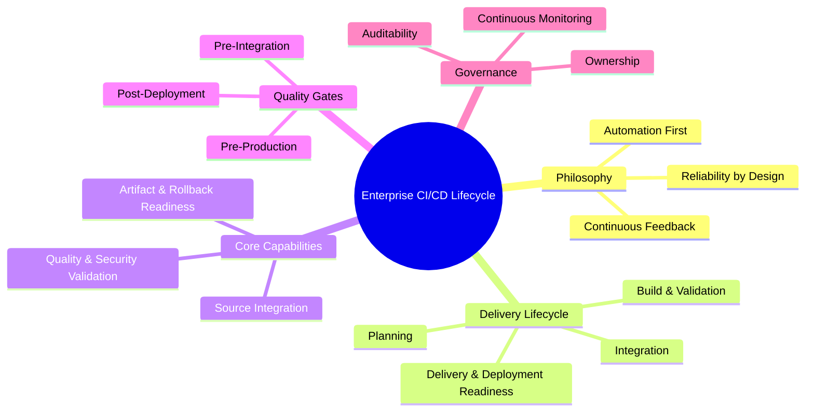
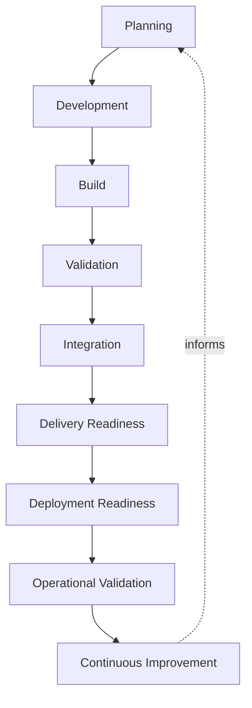
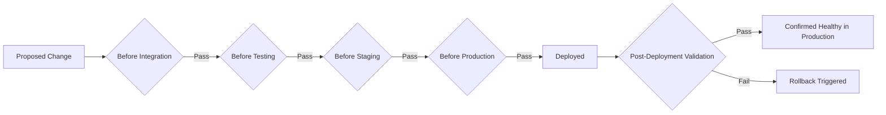
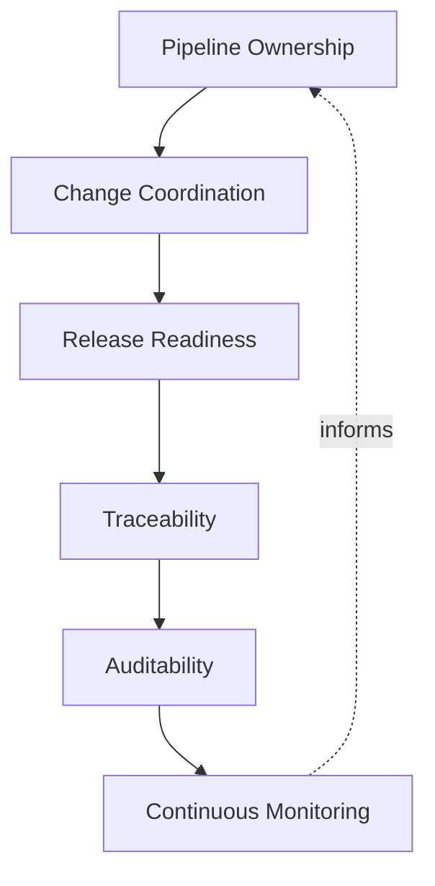
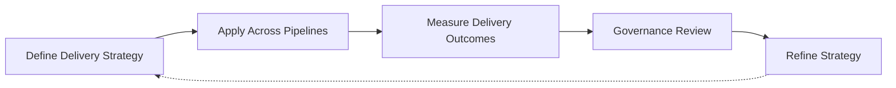

# CI/CD Strategy

## 1. Document Purpose

This document defines the enterprise strategy for continuous integration and continuous delivery at **StackLeo** — the principles, lifecycle, capabilities, and governance that move change safely and predictably from commit to production, without prescribing specific pipeline platforms, configurations, or scripts.

- **Purpose of CI/CD Strategy** — to ensure that the movement of change from development into production is a solved, repeatable capability rather than a source of recurring risk, delay, or inconsistency between teams.
- **Relationship with DevOps** — this document is the delivery-specific elaboration of the DevOps vision and principles defined in `devops-overview.md` and `devops-principles.md`, in particular Automation First, Fast Feedback, and Resilience by Design.
- **Relationship with Platform Engineering** — the capabilities and quality gates defined here are intended to be made available as self-service, paved-road capability through `platform-engineering.md`, so every team benefits from the same delivery discipline without re-deriving it independently.
- **Relationship with Release Management** — CI/CD determines whether change is technically ready to release; `release-management.md` determines when and how that readiness is converted into a business decision to release. The two are distinct but tightly connected.
- **Relationship with Software Quality** — quality gates defined in this document are the mechanism by which testing and validation practice, defined more fully in `08_Testing`, is enforced consistently as part of the delivery path rather than treated as a separate, optional stage.
- **Relationship with Business Agility** — StackLeo's ability to respond to market need — introducing new capability, correcting issues quickly, and supporting an expanding business model — depends directly on delivery being fast and low-risk at the same time. CI/CD is the mechanism that makes speed and safety complementary rather than opposing.

This document is implementation-independent and vendor-neutral. It defines CI/CD philosophy, lifecycle, and governance — not specific platforms, pipeline configurations, or workflow scripts.

## 2. CI/CD Philosophy

- **Automation First** — repeatable steps in building, validating, and delivering change are automated by default, so delivery does not depend on manual, person-executed steps.
- **Continuous Feedback** — every stage of delivery is designed to surface problems as early and as cheaply as possible, rather than deferring discovery to later, more expensive stages.
- **Continuous Integration** — change is integrated and validated frequently, keeping the codebase in a continuously known, trustworthy state.
- **Continuous Delivery** — validated change remains continuously capable of being released, decoupling technical readiness from the business decision of when to release.
- **Continuous Improvement** — delivery practice itself is expected to mature over time, informed by what is learned from operating it, consistent with `devops-principles.md`.
- **Reliability by Design** — delivery pipelines are themselves treated as production-grade systems, engineered to be dependable rather than assumed to work.
- **Security Collaboration** — security validation is embedded directly into the delivery path, consistent with the DevSecOps relationship defined in `devops-principles.md`, rather than applied as a separate, later gate.

*Diagram 1: Enterprise CI/CD Lifecycle — the philosophy, delivery lifecycle, core capabilities, quality gates, and governance domains this strategy defines.*

## 3. Software Delivery Lifecycle

### Planning

- **Purpose** — establish the scope and intent of a change before development begins.
- **Business Value** — reduces wasted delivery effort on work that lacks a clear, agreed purpose.
- **Governance Objectives** — ensure every change entering the pipeline can be traced back to a defined intent.

### Development

- **Purpose** — produce the change within the isolation and quality discipline defined in `branching-strategy.md` and `git-strategy.md`.
- **Business Value** — ensures change enters the delivery pipeline already aligned with source control discipline.
- **Governance Objectives** — keep development consistent with the standards the pipeline will validate against.

### Build

- **Purpose** — transform source into a consistent, verifiable artifact.
- **Business Value** — removes variance and human error from the earliest technical stage of delivery.
- **Governance Objectives** — ensure the same input always produces the same, trustworthy build output.

### Validation

- **Purpose** — confirm the built artifact behaves as expected against defined quality expectations.
- **Business Value** — catches defects at the earliest, cheapest point they can be found.
- **Governance Objectives** — make validation a required, not optional, condition of progressing further.

### Integration

- **Purpose** — combine validated change with the broader codebase and confirm it behaves correctly in that combined context.
- **Business Value** — surfaces integration-level issues that isolated validation cannot reveal.
- **Governance Objectives** — treat successful integration as a precondition for delivery readiness.

### Delivery Readiness

- **Purpose** — confirm that integrated change is packaged and prepared to be released.
- **Business Value** — converts validated change into a state the business can release on demand.
- **Governance Objectives** — maintain a clear, consistent signal of what is delivery-ready at any time.

### Deployment Readiness

- **Purpose** — confirm that the target environment and change are aligned and prepared for deployment.
- **Business Value** — reduces deployment-time risk by resolving readiness questions before deployment begins.
- **Governance Objectives** — ensure deployment proceeds only once environment and change readiness are both confirmed.

### Operational Validation

- **Purpose** — confirm that deployed change behaves correctly in its live operating environment.
- **Business Value** — closes the loop between "delivered" and "actually working as intended for customers."
- **Governance Objectives** — treat post-deployment behavior as part of delivery's responsibility, not a separate concern.

### Continuous Improvement

- **Purpose** — feed what is learned from delivery and operational outcomes back into the delivery process itself.
- **Business Value** — keeps delivery practice improving in step with the platform's growing scale and complexity.
- **Governance Objectives** — ensure delivery outcomes, including failures, are reviewed and acted upon.

*Diagram 2: Software Delivery Flow — change moves through planning, development, build, and validation, into integration and readiness, through deployment and operational validation, with outcomes feeding back into future planning.*

### Software Delivery Lifecycle Matrix

| Stage | Purpose | Business Value |
|---|---|---|
| Planning | Establish scope and intent before development | Reduces wasted effort on unclear work |
| Development | Produce change within source control discipline | Aligns change with pipeline expectations from the start |
| Build | Transform source into a verifiable artifact | Removes variance and error at the earliest stage |
| Validation | Confirm behavior against quality expectations | Catches defects at the earliest, cheapest point |
| Integration | Combine and validate change with the broader codebase | Surfaces integration-level issues early |
| Delivery Readiness | Confirm change is packaged and prepared to release | Converts readiness into an on-demand business capability |
| Deployment Readiness | Confirm environment and change alignment | Reduces deployment-time risk |
| Operational Validation | Confirm correct behavior in the live environment | Closes the loop between delivered and actually working |
| Continuous Improvement | Feed outcomes back into delivery practice | Keeps practice aligned with growing platform complexity |

## 4. Core CI/CD Capabilities

### Source Integration

- **Purpose** — reliably detect and incorporate change from source control into the delivery pipeline.
- **Business Value** — ensures no validated change is delayed or lost between authorship and delivery.
- **Strategic Objectives** — keep the pipeline continuously synchronized with the true state of source control.

### Build Automation

- **Purpose** — automatically transform source into a deployable artifact without manual steps.
- **Business Value** — removes a leading source of inconsistency and delay from the delivery path.
- **Strategic Objectives** — make builds fast, consistent, and independent of any individual's environment.

### Quality Validation

- **Purpose** — automatically confirm that change meets defined functional and quality expectations.
- **Business Value** — reduces the cost of defects by finding them before they reach customers.
- **Strategic Objectives** — make quality validation a continuous, automatic part of delivery, not a manual gate.

### Security Validation Awareness

- **Purpose** — incorporate awareness of security expectations, defined in `06_Security`, directly into the delivery path.
- **Business Value** — prevents security issues from being discovered only after release.
- **Strategic Objectives** — make secure-by-default the natural outcome of passing through the pipeline.

### Artifact Management

- **Purpose** — maintain a trustworthy, traceable record of what was built and is eligible for deployment.
- **Business Value** — ensures what is deployed is always known, verifiable, and connected to its source.
- **Strategic Objectives** — eliminate ambiguity about what a given deployment actually contains.

### Deployment Readiness

- **Purpose** — confirm that a validated artifact and its target environment are prepared for a safe deployment.
- **Business Value** — reduces the likelihood of deployment-time failures caused by unresolved readiness gaps.
- **Strategic Objectives** — make deployment a routine, low-risk event rather than a high-stakes one.

### Rollback Readiness

- **Purpose** — ensure that any deployed change can be identified and reversed if it produces an unacceptable outcome.
- **Business Value** — limits the business impact of a problematic release, consistent with `rollback.md`.
- **Strategic Objectives** — treat reversibility as a designed-in property of every deployment, not an afterthought.

### Pipeline Observability

- **Purpose** — make the behavior and health of the delivery pipeline itself understandable and measurable.
- **Business Value** — allows delivery problems to be detected and addressed before they become recurring bottlenecks.
- **Strategic Objectives** — apply the same observability discipline to the pipeline as to the platform it delivers.

### Core CI/CD Capability Matrix

| Capability | Purpose | Strategic Objective |
|---|---|---|
| Source Integration | Reliably detect and incorporate source change | Keep the pipeline synchronized with source control |
| Build Automation | Automatically transform source into deployable artifacts | Make builds fast, consistent, and person-independent |
| Quality Validation | Automatically confirm functional and quality expectations | Make validation continuous, not a manual gate |
| Security Validation Awareness | Embed security expectations into the delivery path | Make secure-by-default the natural outcome |
| Artifact Management | Maintain a trustworthy record of deployable output | Eliminate ambiguity about deployment content |
| Deployment Readiness | Confirm artifact and environment alignment | Make deployment routine and low-risk |
| Rollback Readiness | Ensure deployed change can be identified and reversed | Treat reversibility as designed-in, not an afterthought |
| Pipeline Observability | Make pipeline behavior understandable and measurable | Apply observability discipline to the pipeline itself |

## 5. Quality Gates

Quality gates are conceptual checkpoints; this document does not define how they are technically enforced, only their governance purpose:

- **Before Integration** — confirms that a change meets a baseline of completeness and review before it is combined with the broader codebase, protecting shared history from unvalidated risk.
- **Before Testing** — confirms that a built artifact is stable and complete enough to be worth the cost of deeper testing effort.
- **Before Staging** — confirms that validated change is suitable to be exposed in a production-representative environment, protecting the integrity of that environment.
- **Before Production** — confirms that change has satisfied every prior gate and is authorized for release, consistent with `deployment-strategy.md`.
- **Post-Deployment Validation** — confirms that deployed change behaves as expected in its actual live environment, closing the loop rather than assuming success at the point of deployment.

*Diagram 3: Quality Gate Framework — change passes through successive gates from integration through production, with post-deployment validation confirming actual live behavior and triggering rollback if it does not hold.*

### Quality Gate Matrix

| Gate | Governance Objective |
|---|---|
| Before Integration | Protect shared history from unvalidated, unreviewed risk |
| Before Testing | Ensure only stable, complete artifacts receive deeper testing effort |
| Before Staging | Protect the integrity of the production-representative environment |
| Before Production | Ensure only fully validated, authorized change is released |
| Post-Deployment Validation | Confirm actual live behavior rather than assuming success |

## 6. Delivery Governance

- **Pipeline Ownership** — every delivery pipeline has a clearly accountable owning team responsible for its health, configuration, and adherence to enterprise standards.
- **Release Readiness** — the pipeline's output is a trustworthy input to the release readiness decisions governed by `release-management.md`, not an independent authority to release.
- **Change Coordination** — delivery activity affecting shared environments is coordinated across teams, preventing conflicting or overlapping changes from creating avoidable risk.
- **Auditability** — every change that passes through the pipeline, and every decision made about it, is traceable to its source, its validation outcome, and its approval.
- **Traceability** — the relationship between a deployed artifact and the source change, requirements, and validation it derived from remains discoverable at all times.
- **Continuous Monitoring** — the pipeline's own performance and reliability are continuously observed, consistent with `pipeline observability` in Section 4, so degradation in delivery capability itself is detected.

*Diagram 4: Delivery Governance Model — pipeline ownership coordinates change and feeds release readiness decisions, sustained by traceability and auditability, with continuous monitoring closing the loop back into ownership.*

### Delivery Governance Matrix

| Governance Area | Focus | Accountable For |
|---|---|---|
| Pipeline Ownership | Health and configuration of the pipeline | Overall pipeline reliability and standards adherence |
| Release Readiness | Trustworthy input to release decisions | Accurate signal of what is technically ready |
| Change Coordination | Alignment across teams sharing environments | Preventing conflicting or overlapping delivery activity |
| Auditability | Traceable record of change and decisions | Supporting investigation and compliance |
| Traceability | Link between deployed artifact and its origin | Discoverable relationship from deployment back to source |
| Continuous Monitoring | Observed pipeline performance and reliability | Detecting degradation in delivery capability itself |

## 7. Future Readiness

- **DevSecOps** — security validation awareness is structured to deepen over time without requiring a redesign of the delivery lifecycle itself, consistent with `devsecops.md`.
- **Platform Engineering** — the capabilities and gates defined here are structured to be delivered as reusable, self-service platform capability as `platform-engineering.md` matures.
- **Cloud-Native Platforms** — delivery principles are defined independent of any specific provider, allowing adoption of elastic, provider-hosted infrastructure without redefining delivery practice.
- **Microservices** — the delivery lifecycle and quality gates apply consistently as capability decomposes into a growing number of independently deployable services.
- **AI Systems** — AI-assisted capability is delivered through the same lifecycle, quality gates, and governance as any other system capability, avoiding a parallel, inconsistent delivery path.
- **Marketplace Platform** — as StackLeo evolves toward business sales, corporate accounts, wholesale, and a multi-vendor marketplace, delivery governance extends to a broader set of contributing teams and integration surfaces without redefinition.
- **Multi-Region Delivery** — as new sales channels — mobile application, physical store, and point-of-sale — and additional currencies beyond BDT are introduced, delivery governance accommodates regional and channel variation without disrupting the core delivery path.
- **Global Engineering Teams** — as StackLeo grows from Bangladesh into South Asia and, over time, global markets, this strategy remains independent of contributor location, supporting distributed, asynchronous delivery collaboration.

## 8. Governance

- **Ownership** — a designated CI/CD governance owner is accountable for the coherence and enforcement of this strategy across all pipelines.
- **Review Process** — significant changes to delivery lifecycle, quality gates, or governance are reviewed consistent with the review discipline in `03_System_Design/architecture-decisions.md`.
- **Pipeline Governance** — individual teams may define pipeline detail consistent with this strategy, but may not bypass its quality gates or governance principles.
- **Audit Readiness** — delivery records, approvals, and validation outcomes are maintained in a state that supports audit and investigation at any time.
- **Continuous Improvement** — this strategy is expected to mature as the platform, organization, and delivery practice evolve, consistent with `devops-principles.md`.

*Diagram 5: Continuous Delivery Improvement Cycle — delivery strategy is applied across pipelines, its outcomes measured, reviewed by governance, and refined, with refinements feeding directly back into the strategy.*

### Governance Responsibility Matrix

| Governance Area | Owner | Accountable For |
|---|---|---|
| Ownership | CI/CD Governance Owner | Coherence and enforcement of this strategy |
| Review Process | Architecture & Platform Teams | Reviewing changes to lifecycle, gates, and governance |
| Pipeline Governance | Pipeline Owning Teams | Detail consistent with enterprise gates and principles |
| Audit Readiness | Platform & Security Teams | Delivery records ready for audit at any time |
| Continuous Improvement | DevOps / Platform Engineering | Maturing strategy as platform and practice evolve |

## 9. Anti-Patterns

- **Manual Deployments** — relying on manual, person-executed steps to move change into production. This introduces variance, human error, and dependency on individual availability that automated delivery exists to remove.
- **Weak Quality Gates** — allowing gates to be bypassed or applied inconsistently under time pressure. This erodes the trust the entire delivery path depends on to be considered safe.
- **Pipeline Drift** — allowing pipeline behavior to diverge silently from documented, expected practice. This makes delivery outcomes unpredictable and difficult to reason about.
- **Missing Validation** — allowing change to progress without confirming it meets defined quality or security expectations. This defeats the purpose of continuous feedback and shifts defect discovery to a more expensive, later stage.
- **Poor Traceability** — allowing the connection between a deployed artifact and its source, requirements, and validation to become unclear. This makes investigation and root-cause analysis disproportionately difficult.
- **Weak Ownership** — leaving a pipeline without a clearly accountable owner. This causes pipeline health, standards adherence, and governance to degrade with no one responsible for correcting it.
- **Reactive Delivery** — treating delivery practice as adequate until an incident proves otherwise. This means avoidable failures, rather than deliberate design, drive delivery improvement.
- **No Continuous Improvement** — treating the current delivery pipeline as a permanently finished state. This guarantees delivery practice falls behind the platform's growing scale and complexity over time.

### Anti-Pattern Summary

| Anti-Pattern | Why It Must Be Avoided |
|---|---|
| Manual Deployments | Introduces variance, error, and dependency on individual availability |
| Weak Quality Gates | Erodes trust the entire delivery path depends on |
| Pipeline Drift | Makes delivery outcomes unpredictable and hard to reason about |
| Missing Validation | Shifts defect discovery to a more expensive, later stage |
| Poor Traceability | Makes investigation and root-cause analysis disproportionately difficult |
| Weak Ownership | Pipeline health and governance degrade with no accountable owner |
| Reactive Delivery | Avoidable failures, not deliberate design, drive improvement |
| No Continuous Improvement | Delivery practice falls behind platform scale and complexity |

## 10. Document Information

| Property | Value |
|----------|-------|
| Document | ci-cd-strategy.md |
| Version | 1.0.0 |
| Status | Active |
| Maintained By | StackLeo |
| Last Updated | 2026-07-24 |

---

© StackLeo. All Rights Reserved.
