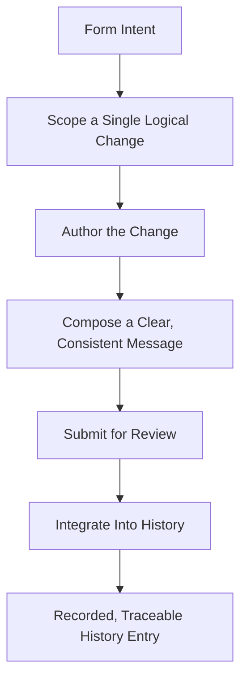
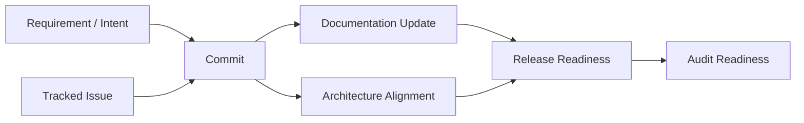
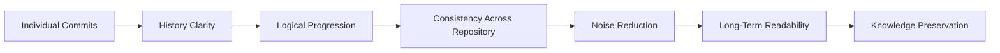
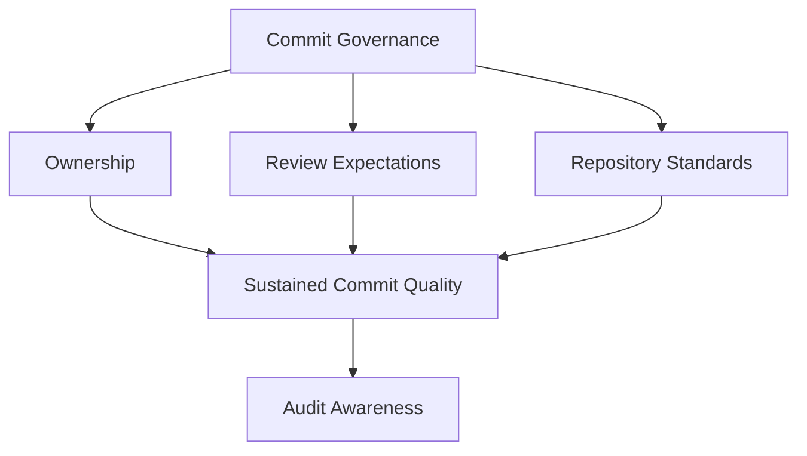
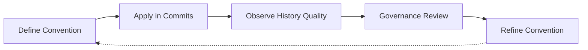

# Commit Conventions

## 1. Document Purpose

This document defines how commits are governed conceptually at **StackLeo** — the philosophy, quality expectations, and traceability principles that make the repository's history a trustworthy, readable record of how the platform evolved, without prescribing a mandatory commit specification or syntax.

- **Purpose of Commit Conventions** — to ensure that every unit of recorded change communicates enough intent and context to be understood on its own, so that history remains useful for review, investigation, and learning long after the change was made.
- **Relationship with Source Control** — this document is the commit-level elaboration of the principles defined in `git-strategy.md`, in particular Atomic Change Philosophy and Auditability. Where `git-strategy.md` governs the repository as a whole, this document governs the smallest unit of recorded change within it.
- **Relationship with Release Management** — meaningful, well-categorized commits are what allow `release-management.md` to determine what a release contains and communicate that content accurately, whether to internal stakeholders or, in time, to customers.
- **Relationship with CI/CD** — automated delivery, as described in `ci-cd-strategy.md`, depends on commits that represent complete, coherent units of change; ambiguous or mixed commits undermine the reliability of automated validation and delivery decisions.
- **Relationship with Engineering Governance** — commit history is a primary artifact of engineering accountability; consistent, traceable commits support the review, audit, and continuous improvement expectations defined in `devops-principles.md`.

This document is implementation-independent and vendor-neutral. It defines commit philosophy and quality principles conceptually — not a mandatory commit message specification, syntax, or tooling.

## 2. Commit Philosophy

- **Small Incremental Changes** — commits represent the smallest coherent unit of change that remains meaningful on its own, consistent with the branching philosophy in `branching-strategy.md`.
- **Meaningful History** — each commit adds a comprehensible entry to a larger narrative, rather than an isolated, context-free fragment.
- **Traceability** — a commit's reasoning, origin, and relationship to broader work is discoverable from the commit itself or its immediate context.
- **Atomic Commits** — a commit represents one logical change; it does not bundle unrelated concerns that would need to be understood or reverted separately.
- **Readability** — commit history is written to be read by people, not merely processed by tooling; clarity is treated as a genuine engineering deliverable.
- **Accountability** — every commit is attributable to its author and their reasoning, reinforcing the Shared Responsibility principle in `devops-principles.md`.
- **Long-Term Maintainability** — commit history remains a useful, trustworthy resource years after it was recorded, supporting engineers who were not present when the change was made.

## 3. Commit Quality Principles

### Single Logical Change

- **Purpose** — ensure each commit represents one coherent, self-contained unit of intent.
- **Business Value** — makes review faster and makes any single change easier to understand, isolate, and reverse if necessary.
- **Governance Objective** — discourage commits that combine unrelated fixes, features, or cleanups.

### Clear Intent

- **Purpose** — ensure a commit communicates why a change was made, not only what changed.
- **Business Value** — reduces the time future engineers spend reconstructing reasoning that was never recorded.
- **Governance Objective** — treat unexplained change as incomplete, regardless of technical correctness.

### Consistent Language

- **Purpose** — ensure commit messages follow a shared, predictable style across contributors and teams.
- **Business Value** — makes history easier to scan, search, and compare across the repository.
- **Governance Objective** — reduce unnecessary variation in how equivalent changes are described.

### Documentation Alignment

- **Purpose** — ensure a commit that changes documented behavior updates the relevant documentation within the same unit of change.
- **Business Value** — prevents documentation from silently diverging from the system it describes.
- **Governance Objective** — treat documentation currency as part of a change's completeness, not a separate, deferrable task.

### Change Transparency

- **Purpose** — ensure the scope and effect of a change is clear from its description, without requiring the reader to infer it from the change itself.
- **Business Value** — supports faster, more confident review and later investigation.
- **Governance Objective** — discourage vague or minimal descriptions that obscure a change's actual effect.

### Review Friendliness

- **Purpose** — ensure a commit is structured to be efficiently and meaningfully reviewed.
- **Business Value** — reduces reviewer effort and improves the likelihood that review catches genuine issues.
- **Governance Objective** — align commit scope and clarity with the review expectations in `git-strategy.md`.

### Auditability

- **Purpose** — ensure a commit provides sufficient context to support later investigation, compliance review, or root-cause analysis.
- **Business Value** — protects the organization's ability to reconstruct what happened and why, when it matters most.
- **Governance Objective** — treat every commit as a potential future audit artifact, not only a present-day convenience.

### Commit Quality Principle Matrix

| Principle | Purpose | Governance Objective |
|---|---|---|
| Single Logical Change | One coherent, self-contained unit of intent | Discourage bundling unrelated concerns |
| Clear Intent | Communicate why, not only what, changed | Treat unexplained change as incomplete |
| Consistent Language | Shared, predictable message style | Reduce unnecessary variation across contributors |
| Documentation Alignment | Documentation updated within the same change | Treat documentation currency as part of completeness |
| Change Transparency | Scope and effect clear without inference | Discourage vague or minimal descriptions |
| Review Friendliness | Structured for efficient, meaningful review | Align commit scope with review expectations |
| Auditability | Sufficient context for future investigation | Treat every commit as a potential audit artifact |

*Diagram 1: Commit Lifecycle — a commit moves from a formed intent through deliberate scoping, authoring, and message composition, into review and, finally, a traceable entry in shared history.*

## 4. Semantic Commit Concepts

Categorizing change by its nature — without prescribing a specific syntax — allows history, and any tooling built on top of it, to communicate meaning at a glance:

- **Features** — change that introduces new, customer- or business-facing capability.
- **Bug Fixes** — change that corrects behavior that deviated from its intended, documented outcome.
- **Refactoring** — change that alters internal structure without altering external behavior.
- **Documentation** — change limited to explanatory or reference material, without altering system behavior.
- **Testing** — change that adds or modifies verification of existing or new behavior.
- **Build Changes** — change to how the platform is compiled, packaged, or prepared for delivery.
- **Configuration** — change to declarative settings governing behavior, distinct from the logic itself.
- **Maintenance** — change that sustains the health of the codebase without altering behavior or adding capability, such as dependency upkeep or housekeeping.

The purpose of semantic categorization is to make the nature of a change discoverable without reading its full content — supporting faster review, more accurate release communication, and, in time, reliable automated summarization of what a release contains.

### Semantic Change Category Matrix

| Category | Nature of Change | Primary Value |
|---|---|---|
| Features | New, customer- or business-facing capability | Communicates what the platform can newly do |
| Bug Fixes | Correction of deviated behavior | Communicates what was broken and is now resolved |
| Refactoring | Internal structure change, no behavior change | Signals lower customer-facing risk to reviewers |
| Documentation | Explanatory or reference material only | Signals no behavioral risk |
| Testing | Added or modified verification | Communicates strengthened confidence in behavior |
| Build Changes | How the platform is compiled or packaged | Isolates delivery-mechanism change from logic change |
| Configuration | Declarative settings, distinct from logic | Isolates environment-level change from code change |
| Maintenance | Codebase health without behavior change | Distinguishes housekeeping from functional change |

## 5. Change Traceability

- **Requirement Traceability** — a commit can be connected back to the requirement or intent that motivated it, so the reasoning behind the codebase's current state remains discoverable.
- **Issue Alignment** — where a commit addresses a known, tracked issue, that relationship is preserved rather than left implicit.
- **Documentation Updates** — where a commit changes documented behavior, the corresponding documentation change is traceable as part of the same unit of work.
- **Architecture Alignment** — where a commit implements or affects an architectural decision, its relationship to that decision, as recorded in `03_System_Design/architecture-decisions.md`, remains discoverable.
- **Release Readiness** — a commit's category and completeness contribute directly to whether the work it represents can be considered release-ready, consistent with `release-management.md`.
- **Audit Readiness** — the combination of requirement, issue, and architecture traceability ensures the repository can support audit or compliance review without special reconstruction effort.

*Diagram 2: Change Traceability Flow — a commit connects requirement and issue context to documentation and architecture alignment, converging on release and audit readiness.*

### Traceability Matrix

| Traceability Dimension | Focus | Supports |
|---|---|---|
| Requirement Traceability | Commit connected to motivating intent | Understanding why the codebase looks as it does |
| Issue Alignment | Relationship to tracked issues preserved | Connecting history to known, managed work |
| Documentation Updates | Documentation change traceable to behavior change | Preventing silent documentation drift |
| Architecture Alignment | Relationship to architectural decisions preserved | Consistency between implementation and intent |
| Release Readiness | Category and completeness inform release inclusion | Accurate communication of release content |
| Audit Readiness | Combined traceability supports investigation | Compliance and root-cause analysis without reconstruction |

## 6. Repository History Quality

- **History Clarity** — history reads as an understandable account of how the platform evolved, rather than a disordered sequence of fragments.
- **Logical Progression** — commits build on one another in a sequence that reflects how the work actually proceeded, rather than being reordered or obscured.
- **Consistency** — equivalent kinds of change are described in a comparably structured, comparably detailed way across the repository.
- **Noise Reduction** — commits that add no lasting information — such as redundant or trivially reversed changes — are minimized, keeping history focused on meaningful change.
- **Long-Term Readability** — history remains understandable to engineers who were not present when it was written, not only to its original author.
- **Knowledge Preservation** — reasoning that would otherwise exist only in a contributor's memory is captured in history, protecting the organization from the loss of that knowledge over time.

*Diagram 3: Repository History Evolution — individual commits accumulate into a body of history whose value compounds as clarity, consistency, and reduced noise are sustained over time.*

### Repository History Quality Matrix

| Quality Dimension | Focus | Long-Term Value |
|---|---|---|
| History Clarity | Understandable account of platform evolution | Reduces effort to reconstruct past reasoning |
| Logical Progression | Commits reflect the actual sequence of work | Preserves an accurate, trustworthy narrative |
| Consistency | Comparable changes described comparably | Makes history easier to scan and compare |
| Noise Reduction | Minimizes commits with no lasting information | Keeps focus on meaningful change |
| Long-Term Readability | Understandable to engineers not present at the time | Extends the useful life of history |
| Knowledge Preservation | Captures reasoning that would otherwise be lost | Protects the organization from knowledge loss |

## 7. Future Readiness

- **Automated Changelog Generation** — consistent semantic categorization and clear commit intent create the conditions under which release content can eventually be summarized reliably from history itself.
- **Release Notes** — well-categorized, clearly described commits provide a trustworthy source from which customer- and stakeholder-facing release communication can be derived.
- **Monorepositories** — commit quality and traceability principles apply consistently whether a single repository holds a broad set of related capability or a narrow one.
- **Microservices** — as capability decomposes into a growing number of independently deployable services, consistent commit practice keeps history comparably readable across every repository.
- **AI Projects** — commits supporting AI-assisted capability are held to the same clarity, traceability, and quality expectations as any other commit.
- **Enterprise Compliance** — as StackLeo's business expands into corporate sales, wholesale, and a multi-vendor marketplace, traceable, auditable history supports the heightened accountability expectations that come with enterprise and regulated engagement.
- **Global Engineering Teams** — as StackLeo grows from Bangladesh into South Asia and, over time, global markets, consistent language and structure in commit history remain understandable across distributed, culturally diverse contributing teams.

## 8. Governance

- **Ownership** — a designated source control governance owner, consistent with `git-strategy.md`, is accountable for the coherence and enforcement of commit quality expectations.
- **Review Expectations** — commit quality is evaluated as part of the standard review process defined in `git-strategy.md`, not treated as a separate or optional concern.
- **Repository Standards** — individual repositories may define additional stylistic detail consistent with this document, but may not contradict the principles defined here.
- **Continuous Improvement** — commit conventions are expected to mature as the organization, tooling landscape, and compliance expectations evolve, consistent with the Continuous Improvement principle in `devops-principles.md`.
- **Audit Awareness** — commit history is maintained in a state that supports audit and investigation at any time, without requiring special preparation.

*Diagram 4: Commit Governance Framework — ownership, review expectations, and repository standards converge to sustain commit quality, which in turn keeps the repository continuously audit-aware.*

*Diagram 5: Continuous Repository Quality Cycle — commit conventions are applied, their resulting history quality observed, reviewed by governance, and refined, with refinements feeding back into the convention itself.*

### Governance Responsibility Matrix

| Governance Area | Owner | Accountable For |
|---|---|---|
| Ownership | Source Control Governance Owner | Coherence and enforcement of commit quality expectations |
| Review Expectations | Engineering Teams | Evaluating commit quality as part of standard review |
| Repository Standards | Repository Owners | Stylistic detail consistent with enterprise principles |
| Continuous Improvement | DevOps / Platform Engineering | Maturing conventions as organization and tooling evolve |
| Audit Awareness | Platform & Security Teams | History remaining audit-ready without special preparation |

## 9. Anti-Patterns

- **Massive Mixed Commits** — bundling unrelated fixes, features, and cleanups into a single commit. This defeats atomicity, making review, understanding, and reversal disproportionately difficult.
- **Meaningless Messages** — recording commits with vague or uninformative descriptions. This strips history of the context future engineers depend on to understand past decisions.
- **Hidden Breaking Changes** — introducing behavior-altering change without clearly signaling its impact. This creates risk for downstream consumers and undermines trust in the history's transparency.
- **Documentation Drift** — changing behavior without updating the documentation that describes it. This causes documentation to silently diverge from reality until it can no longer be trusted.
- **Weak Traceability** — recording change without connection to the requirement, issue, or decision that motivated it. This makes later investigation and audit disproportionately costly.
- **Inconsistent Language** — describing equivalent changes in incompatible styles across contributors and teams. This makes history harder to scan, search, and compare.
- **History Pollution** — allowing large volumes of low-information or redundant commits to accumulate. This dilutes the signal-to-noise ratio of history, obscuring genuinely meaningful change.
- **Reactive Repository Management** — addressing commit quality only after history has already become difficult to navigate. This means avoidable degradation drives correction, rather than deliberate, proactive discipline.

### Anti-Pattern Summary

| Anti-Pattern | Why It Must Be Avoided |
|---|---|
| Massive Mixed Commits | Defeats atomicity; review, understanding, and reversal become disproportionately difficult |
| Meaningless Messages | Strips history of context future engineers depend on |
| Hidden Breaking Changes | Creates downstream risk and undermines trust in history's transparency |
| Documentation Drift | Documentation silently diverges from reality until untrustworthy |
| Weak Traceability | Makes later investigation and audit disproportionately costly |
| Inconsistent Language | Makes history harder to scan, search, and compare |
| History Pollution | Dilutes signal-to-noise ratio, obscuring meaningful change |
| Reactive Repository Management | Avoidable degradation drives correction instead of proactive discipline |

## 10. Document Information

| Property | Value |
|----------|-------|
| Document | commit-conventions.md |
| Version | 1.0.0 |
| Status | Active |
| Maintained By | StackLeo |
| Last Updated | 2026-07-24 |

---

© StackLeo. All Rights Reserved.
