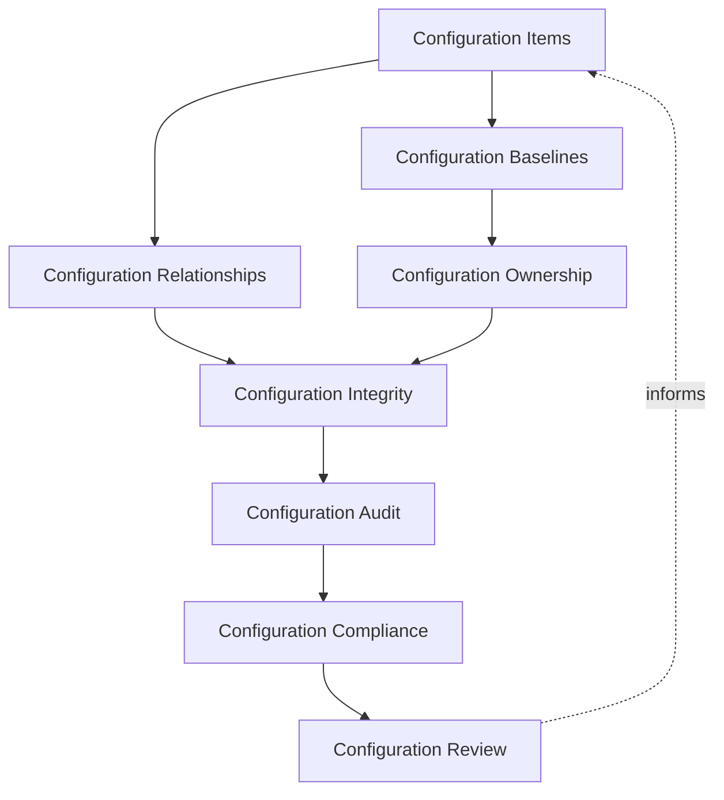
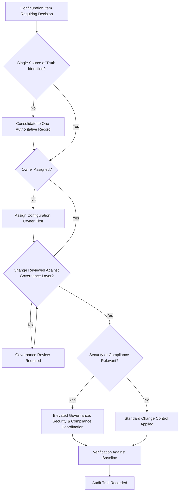
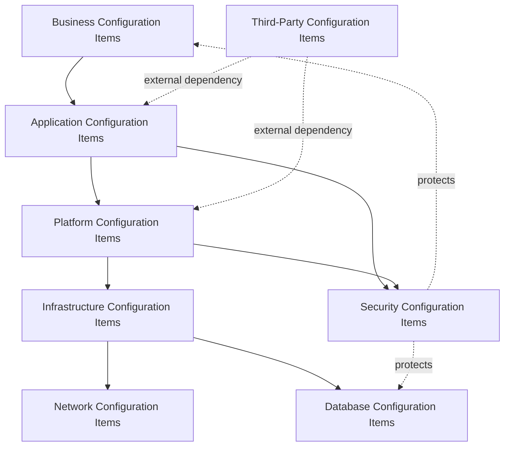
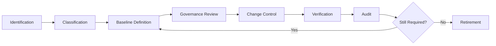
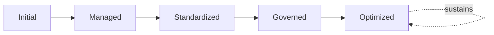
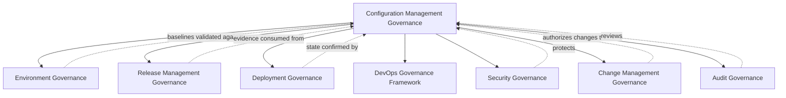

# Enterprise Configuration Management Governance Framework

## 1. Executive Summary

**Purpose** — This document defines the official Enterprise Configuration Management Governance Framework for **StackLeo Tech Store**. It establishes configuration governance, configuration item (CI) governance, baseline governance, lifecycle governance, organizational accountability, auditability, traceability, compliance, and continuous improvement as a deliberate, accountable enterprise discipline. `configuration-management.md` remains the operational configuration framework for `07_DEVOPS` — the document that elaborates configuration philosophy, lifecycle, and category practice in full operational depth. This framework sits above it as the highest-level executive mandate, consistent with the executive-charter relationship `environment-governance.md` holds over `environment-management.md` and `release-management-governance.md` holds over `release-management.md`: it does not restate configuration mechanics or format detail, it establishes the accountability structure, governance model, and executive expectations that give configuration practice its authority across the whole organization.

**Scope** — This framework applies to every configuration item category at StackLeo — business, application, platform, infrastructure, security, database, network, and third-party — across every environment governed under `environment-governance.md`, from the current single-region platform through future multi-region, multi-channel operation.

**Strategic Objectives** — To ensure a single, authoritative source of truth exists for every configuration item; that configuration change is genuinely controlled and traceable; that configuration baselines remain trustworthy over time; and that executive leadership has continuous visibility into configuration governance health and maturity.

**Business Value** — Governed configuration management protects the predictability every environment, deployment, and release decision depends on, prevents configuration drift from silently undermining operational confidence, and gives leadership assurance that the platform's state is genuinely known and controlled as it scales.

**Intended Audience** — Executive leadership, the Chief Technology Officer, platform engineering, DevOps leadership, engineering leadership, security leadership, operations leadership, and audit and compliance functions.

## 2. Enterprise Configuration Strategy

- **Configuration Vision** — every configuration item at StackLeo is knowable, traceable, and governed, never an undocumented or assumed state.
- **Enterprise Configuration Governance** — configuration accountability is governed centrally and consistently, even where day-to-day configuration activity is distributed across many teams.
- **Standardization Strategy** — configuration items of the same category are defined, classified, and governed consistently, so their state can be genuinely compared and trusted.
- **Configuration Integrity** — the organization can trust that a system's actual configuration matches its documented, authorized state at any given time.
- **Operational Stability** — configuration governance protects the stability every deployment, release, and operational decision depends on.
- **Business Alignment** — configuration governance investment is made in service of genuine business priority, connecting to `01_Business/business-model.md`.
- **Compliance Readiness** — configuration state is maintained in a form that supports regulatory and contractual obligation at any time, not only when audit is imminent.

### Enterprise Configuration Strategy Matrix

| Strategy Element | Focus | Business Value |
|---|---|---|
| Configuration Vision | Every item is knowable, traceable, and governed | Prevents undocumented or assumed configuration state |
| Enterprise Configuration Governance | Centralized accountability despite distributed activity | Ensures consistency regardless of who changes configuration |
| Standardization Strategy | Same-category items defined and governed consistently | Enables genuine comparison and trust across items |
| Configuration Integrity | Actual state trusted to match documented, authorized state | Protects confidence in every configuration-dependent decision |
| Operational Stability | Governance protects stability dependent activity relies on | Protects deployment, release, and operational confidence |
| Business Alignment | Investment made in service of genuine business priority | Connects configuration governance to business intent |
| Compliance Readiness | State maintained ready for obligation at any time | Prevents scrambling to reconstruct state before an audit |

## 3. Configuration Governance Principles

Configuration governance at StackLeo rests on nine principles, each producing a specific business outcome.

- **Single Source of Truth** — every configuration item has exactly one authoritative record of its intended state. *Business Value:* eliminates the confusion and error that arise from conflicting, unreconciled records.
- **Configuration Integrity** — a system's actual configuration is trusted to match its documented, authorized state. *Business Value:* protects the reliability of every decision made on the assumption of known configuration.
- **Controlled Change** — configuration change proceeds only through a deliberate, governed process. *Business Value:* prevents uncontrolled change from becoming an unmanaged source of instability.
- **Traceability** — every configuration item's change history can be reconstructed after the fact. *Business Value:* supports investigation, audit, and confident root cause analysis.
- **Accountability** — every configuration item has a specific, named, responsible owner. *Business Value:* ensures no configuration item is left to drift without someone genuinely responsible for it.
- **Auditability** — configuration records and their change history are maintained in a form ready for independent review at any time. *Business Value:* removes the need for reactive, disruptive preparation ahead of an audit.
- **Standardization** — configuration items are classified and documented following a consistent, governed pattern. *Business Value:* reduces the variance that makes configuration-related failures difficult to diagnose.
- **Security by Design** — configuration governance treats security-relevant items as first-class, protected assets, coordinated with `06_Security/security-governance.md`. *Business Value:* prevents configuration itself from becoming an unmonitored path around security discipline.
- **Continuous Improvement** — configuration governance practice matures over time, informed by real configuration outcomes. *Business Value:* keeps configuration governance aligned with the organization's growing scale and complexity.

### Configuration Governance Principles Matrix

| Principle | Description | Business Value |
|---|---|---|
| Single Source of Truth | Exactly one authoritative record per configuration item | Eliminates confusion from conflicting, unreconciled records |
| Configuration Integrity | Actual configuration trusted to match documented state | Protects reliability of decisions made on known configuration |
| Controlled Change | Change proceeds only through a deliberate, governed process | Prevents uncontrolled change from becoming instability |
| Traceability | Change history reconstructable after the fact | Supports investigation, audit, and root cause analysis |
| Accountability | Every item has a specific, named, responsible owner | Ensures no item drifts without genuine ownership |
| Auditability | Records maintained ready for independent review at any time | Removes reactive, disruptive audit preparation |
| Standardization | Items classified and documented following a consistent pattern | Reduces variance that complicates diagnosis |
| Security by Design | Security-relevant items treated as first-class, protected assets | Prevents configuration from bypassing security discipline |
| Continuous Improvement | Practice matures from real configuration outcomes | Keeps governance aligned with growing scale and complexity |

## 4. Enterprise Configuration Governance Model

Configuration governance operates across eight conceptual layers, each holding accountability for a distinct dimension of how StackLeo governs configuration.

### Configuration Items (CIs)

- **Purpose** — own the coherence of how individual configuration items are identified, defined, and tracked.
- **Governance Scope** — oversight of Identification and Classification (`configuration-management.md`, Section 3), extending across every category in Section 5.
- **Business Value** — ensures every genuine configuration item is knowable and accountable, not left undocumented.
- **Executive Expectations** — leadership trusts every configuration item genuinely relevant to the platform is captured.

### Configuration Baselines

- **Purpose** — own the coherence of how a trusted, point-in-time reference state is established and maintained for each configuration category.
- **Governance Scope** — oversight of Baseline Definition (Section 6), coordinated with `environment-governance.md`.
- **Business Value** — provides a genuine, trustworthy reference point against which drift and change can be measured.
- **Executive Expectations** — leadership trusts baselines are current and genuinely representative, not stale or aspirational.

### Configuration Relationships

- **Purpose** — own the coherence of how dependencies and relationships between configuration items are understood.
- **Governance Scope** — oversight ensuring the impact of a change to one item on related items is genuinely understood before it proceeds.
- **Business Value** — prevents a change from producing unanticipated consequence in a dependent item.
- **Executive Expectations** — leadership expects relationship impact to be considered before, not discovered after, a change.

### Configuration Ownership

- **Purpose** — own the coherence of how accountability for each configuration item is assigned and sustained.
- **Governance Scope** — oversight applying Accountability (Section 3) consistently across every item and category.
- **Business Value** — ensures every configuration item has someone genuinely responsible for its accuracy and health.
- **Executive Expectations** — leadership trusts ownership is genuinely assigned, not left implicit or assumed.

### Configuration Integrity

- **Purpose** — own the coherence of how the organization confirms actual configuration matches its documented, authorized state.
- **Governance Scope** — oversight of Verification (Section 6), coordinated with `environment-governance.md` Environment Risk Governance.
- **Business Value** — ensures the organization's trust in its own configuration records is genuinely warranted.
- **Executive Expectations** — leadership trusts integrity is actively verified, not merely assumed by the absence of complaint.

### Configuration Audit

- **Purpose** — own the coherence of how configuration records and change history are maintained ready for independent review.
- **Governance Scope** — oversight of Audit (Section 6), coordinated with `06_Security/audit-governance.md`.
- **Business Value** — removes the cost and disruption of reactive audit preparation.
- **Executive Expectations** — leadership trusts configuration audit readiness is continuous, not seasonal.

### Configuration Compliance

- **Purpose** — own the coherence of how configuration state meets genuine regulatory and contractual obligation.
- **Governance Scope** — oversight coordinated with `06_Security/compliance-governance.md`.
- **Business Value** — protects the business's standing with regulators and its contractual counterparties.
- **Executive Expectations** — leadership expects compliance-relevant configuration to be sustained continuously, not demonstrated only at audit time.

### Configuration Review

- **Purpose** — own the coherence of the periodic, formal reassessment of configuration governance itself.
- **Governance Scope** — oversight of Governance Review (Section 6), consistent with Executive Oversight (Section 9).
- **Business Value** — ensures configuration governance is genuinely scrutinized, not assumed correct by default.
- **Executive Expectations** — leadership expects configuration governance to be reviewed on a predictable, recurring cadence.

### Configuration Governance Matrix

| Layer | Purpose | Business Value | Executive Expectations |
|---|---|---|---|
| Configuration Items (CIs) | Own coherence of identifying, defining, and tracking items | Ensures every genuine item is knowable and accountable | Trusts every relevant item is captured |
| Configuration Baselines | Own coherence of establishing trusted reference states | Provides a genuine reference point for measuring drift | Trusts baselines are current and representative |
| Configuration Relationships | Own coherence of understanding item dependencies | Prevents unanticipated consequence in dependent items | Expects impact considered before, not after, change |
| Configuration Ownership | Own coherence of assigning and sustaining accountability | Ensures every item has genuine responsibility | Trusts ownership is genuinely assigned, not implicit |
| Configuration Integrity | Own coherence of confirming actual matches documented state | Ensures trust in configuration records is warranted | Trusts integrity is actively verified, not assumed |
| Configuration Audit | Own coherence of maintaining audit-ready records | Removes cost and disruption of reactive preparation | Trusts audit readiness is continuous, not seasonal |
| Configuration Compliance | Own coherence of meeting regulatory and contractual obligation | Protects standing with regulators and counterparties | Expects compliance sustained continuously |
| Configuration Review | Own coherence of periodically reassessing governance itself | Ensures governance is genuinely scrutinized | Expects review on a predictable, recurring cadence |

*Diagram 1: Enterprise Configuration Governance Framework — configuration item and relationship governance inform ownership and integrity governance, converging on audit and compliance governance, resolving into configuration review that feeds back into the model.*

*Diagram 4: Enterprise Configuration Governance Decision Flow — a configuration item is checked for a single source of truth, assigned ownership, and governance review, with elevated coordination applied where security or compliance relevance is present, resolving into verification and a recorded audit trail.*

## 5. Configuration Item Classification

Configuration items are classified across eight conceptual categories, each requiring a distinct governance emphasis. Every category here is elaborated in full operational depth in `configuration-management.md` (Section 4).

- **Business Configuration Items** — configuration expressing business rules, policies, and commercial parameters, governed under Configuration Compliance (Section 4) given its direct business consequence.
- **Application Configuration Items** — configuration governing application behavior, coordinated with Application Configuration (`configuration-management.md`, Section 4.1).
- **Platform Configuration Items** — configuration governing shared platform capability, coordinated with `platform-engineering.md`.
- **Infrastructure Configuration Items** — configuration governing the underlying technical foundation, coordinated with `infrastructure-as-code.md`.
- **Security Configuration Items** — configuration governing protective controls, governed jointly with, and never superseding, `06_Security/security-governance.md`.
- **Database Configuration Items** — configuration governing data-layer structure and behavior, given elevated consequence for irreversible error.
- **Network Configuration Items** — configuration governing connectivity and traffic behavior between platform components.
- **Third-Party Configuration Items** — configuration governing integration with external vendors and partners, coordinated with third-party risk governance.

### Configuration Item Classification Matrix

| Classification | Governance Emphasis | Coordination |
|---|---|---|
| Business Configuration Items | Direct business consequence, compliance governance | Coordinated with Configuration Compliance (Section 4) |
| Application Configuration Items | Application behavior governance | Coordinated with `configuration-management.md` |
| Platform Configuration Items | Shared platform capability governance | Coordinated with `platform-engineering.md` |
| Infrastructure Configuration Items | Underlying technical foundation governance | Coordinated with `infrastructure-as-code.md` |
| Security Configuration Items | Protective control governance | Coordinated with `06_Security/security-governance.md` |
| Database Configuration Items | Data-layer structure and behavior governance | Elevated rigor given irreversible-error consequence |
| Network Configuration Items | Connectivity and traffic behavior governance | Coordinated with infrastructure governance |
| Third-Party Configuration Items | External vendor and partner integration governance | Coordinated with third-party risk governance |

*Diagram 3: Configuration Item Relationship Model — business configuration items shape application and platform configuration, which depend on infrastructure, network, and database items, with security items protecting across categories and third-party items introducing external dependency at the application and platform layers.*

## 6. Configuration Lifecycle Governance

Configuration governance operates across eight conceptual lifecycle stages.

- **Identification** — govern how a genuine configuration item is recognized and distinguished from routine operational detail.
- **Classification** — govern how an identified item is assigned to the appropriate category in Section 5.
- **Baseline Definition** — govern how a trusted, point-in-time reference state is established for a classified item.
- **Governance Review** — govern how a proposed configuration change is reviewed against the appropriate governance layer in Section 4.
- **Change Control** — govern how a reviewed change is deliberately authorized and applied.
- **Verification** — govern how the applied change is confirmed to match its authorized intent.
- **Audit** — govern the periodic, formal confirmation that configuration records remain accurate and complete.
- **Retirement** — govern how a configuration item is deliberately decommissioned once no longer needed.

### Configuration Lifecycle Matrix

| Stage | Governance Objective | Business Value |
|---|---|---|
| Identification | Recognize a genuine configuration item | Ensures every genuine item is captured, not left undocumented |
| Classification | Assign an identified item to the appropriate category | Ensures governance by the genuinely accountable function |
| Baseline Definition | Establish a trusted, point-in-time reference state | Provides a genuine reference point for measuring drift |
| Governance Review | Review a proposed change against the appropriate layer | Ensures every change is reviewed deliberately |
| Change Control | Deliberately authorize and apply a reviewed change | Prevents uncontrolled, unauthorized configuration change |
| Verification | Confirm the applied change matches authorized intent | Ensures configuration integrity is genuinely upheld |
| Audit | Periodically confirm records remain accurate and complete | Removes the need for reactive, disruptive audit preparation |
| Retirement | Deliberately decommission an item no longer needed | Prevents abandoned configuration becoming an ungoverned risk |

*Diagram 2: Configuration Lifecycle — identification and classification inform baseline definition, with governance review and change control gating verification and audit, cycling back to baseline maintenance or proceeding to deliberate retirement.*

## 7. Organizational Governance

Governance accountability is distributed deliberately across eight organizational roles.

- **Executive Leadership** — holds ultimate accountability for whether configuration practice is genuinely governed as an enterprise discipline.
- **CTO** — owns the coherence and enforcement of this framework across every configuration category and governance layer it defines.
- **Platform Engineering** — owns the self-service capability that makes governed configuration practice the default path for every team.
- **DevOps Leadership** — owns Configuration Lifecycle Governance (Section 6) in coordination with `devops-governance-framework.md`.
- **Engineering Leadership** — owns Application and Platform Configuration Items (Section 5) within their accountable teams.
- **Security Leadership** — owns Security Configuration Items (Section 5) jointly with `06_Security/security-governance.md`, which remains authoritative for security-specific obligations.
- **Operations Leadership** — owns Configuration Integrity and Baselines (Section 4) in coordination with `09_OPERATIONS/operations-governance-strategy.md`.
- **Audit & Compliance Functions** — own Configuration Audit and Compliance (Section 4) in coordination with `06_Security/audit-governance.md` and `06_Security/compliance-governance.md`.

### Configuration Ownership Matrix

| Role | Governance Objective | Business Value |
|---|---|---|
| Executive Leadership | Hold ultimate accountability for governed configuration practice | Provides a single point of ultimate accountability |
| CTO | Own coherence and enforcement of this framework | Provides a single point of specialist accountability |
| Platform Engineering | Own self-service capability enabling governed practice by default | Makes the governed path the path of least resistance |
| DevOps Leadership | Own configuration lifecycle governance | Keeps configuration practice coordinated with broader DevOps governance |
| Engineering Leadership | Own application and platform configuration items | Embeds accountability closest to where configuration is defined |
| Security Leadership | Own security configuration items jointly with security governance | Ensures no configuration item becomes an unmonitored security gap |
| Operations Leadership | Own configuration integrity and baselines | Protects the trustworthiness of the organization's reference state |
| Audit & Compliance Functions | Own configuration audit and compliance | Ensures records remain genuinely ready for independent review |

### Governance Responsibility Matrix

| Role | Responsibility |
|---|---|
| Executive Leadership | Owns ultimate accountability for governed configuration practice. |
| CTO | Owns coherence and enforcement of this framework, in partnership with executive leadership. |
| Platform Engineering | Owns self-service capability enabling governed configuration practice by default. |
| DevOps Leadership | Owns configuration lifecycle governance within `configuration-management.md`. |
| Engineering Leadership | Owns application and platform configuration items within their accountable teams. |
| Security Leadership | Owns security configuration items jointly with `06_Security/security-governance.md`. |
| Operations Leadership | Owns configuration integrity and baselines. |
| Audit & Compliance Functions | Own configuration audit and compliance readiness. |

## 8. Configuration Risk Governance

Configuration-related risk is governed across seven conceptual categories, coordinated with `06_Security/enterprise-risk-management-strategy.md`.

- **Configuration Drift** — the risk that actual configuration silently diverges from its documented, authorized state.
- **Unauthorized Configuration Changes** — the risk that configuration is modified outside governed change control.
- **Inconsistent Baselines** — the risk that reference states across environments or items are not genuinely equivalent.
- **Configuration Sprawl** — the risk that configuration items accumulate without governance, ownership, or genuine purpose.
- **Compliance Risks** — the risk that configuration fails to meet a genuine regulatory or contractual obligation.
- **Security Risks** — the risk that configuration introduces or exposes a genuine security weakness.
- **Operational Risks** — the risk that ungoverned configuration undermines the organization's ability to operate or recover the platform.

### Risk Governance Matrix

| Risk Category | Focus | Governance Coordination |
|---|---|---|
| Configuration Drift | Actual configuration silently diverging from documented state | Coordinated with Configuration Integrity (Section 4) |
| Unauthorized Configuration Changes | Modification outside governed change control | Coordinated with Change Control (Section 6) |
| Inconsistent Baselines | Reference states not genuinely equivalent across scope | Coordinated with Configuration Baselines (Section 4) |
| Configuration Sprawl | Items accumulating without governance or purpose | Coordinated with Configuration Ownership (Section 4) |
| Compliance Risks | Failure to meet regulatory or contractual obligation | Coordinated with `06_Security/compliance-governance.md` |
| Security Risks | Introduced or exposed security weakness | Coordinated with `06_Security/security-governance.md` |
| Operational Risks | Ungoverned configuration undermining operation or recovery | Coordinated with operations and disaster recovery governance |

## 9. Executive Oversight

- **Configuration Governance Reviews** — the overall coherence of configuration governance is formally reviewed on a regular cadence.
- **Compliance Reporting** — configuration adherence to regulatory and contractual obligation is reported to executive leadership and the Board.
- **Audit Reviews** — configuration audit readiness and outcomes are reviewed directly with executive leadership.
- **Executive Dashboards** — aggregated configuration health — drift incidence, baseline currency, ownership coverage — is made visible to executive leadership.
- **Operational Readiness Reviews** — configuration integrity underlying operational readiness is reviewed as a distinct, ongoing concern.
- **Continuous Improvement Reviews** — the organization's follow-through on captured configuration governance lessons is reviewed directly with executive leadership.

### Executive Oversight Matrix

| Oversight Mechanism | Purpose | Governance Role |
|---|---|---|
| Configuration Governance Reviews | Confirm overall configuration governance coherence | Regular, predictable cadence for the framework as a whole |
| Compliance Reporting | Report configuration adherence to obligations | Regular reporting to executive leadership and the Board |
| Audit Reviews | Review configuration audit readiness and outcomes | Direct executive-level review of audit posture |
| Executive Dashboards | Provide leadership a single, coherent configuration picture | Visibility into drift, baseline currency, ownership coverage |
| Operational Readiness Reviews | Review configuration integrity underlying readiness | Treats integrity as ongoing, not assumed |
| Continuous Improvement Reviews | Review follow-through on captured lessons | Direct executive-level review of improvement completion |

## 10. Future Readiness

This framework is designed to remain valid as StackLeo evolves in scale, geography, and organizational complexity.

- **AI-Assisted Configuration Governance** — as configuration drift detection and classification increasingly incorporate AI-assisted analysis, they remain governed under Configuration Integrity (Section 4) at the same rigor as any other method.
- **Intelligent Configuration Discovery** — where the organization develops the capability to automatically discover configuration items, that capability remains governed under Identification (Section 6), not a separate discipline.
- **Policy-as-Code (Conceptual)** — where governance policy increasingly expresses itself as enforceable, machine-readable rules, that practice remains governed under Controlled Change (Section 3), never bypassing genuine governance review.
- **Digital Configuration Twins (Conceptual)** — where the organization develops a live, synthesized representation of platform configuration state, that representation remains governed as a Configuration Baseline (Section 4), not an independent source of truth.
- **Enterprise Scale** — the governance model, categories, and lifecycle defined throughout this framework are defined independently of organizational size.
- **Multi-Cloud Readiness (Conceptual)** — this framework's governance model is structured to remain coherent regardless of how many distinct infrastructure providers configuration spans.
- **Autonomous Governance (Conceptual)** — where automation increasingly performs steps within configuration verification or audit, that automation remains subject to the same ownership and executive oversight as any human-performed activity.

## 11. Configuration Maturity Model

Configuration governance maturity is described across five conceptual levels.

- **Initial** — configuration governance, where it exists, is informal and inconsistent; configuration is tracked reactively, and ownership is unclear.
- **Managed** — basic configuration governance exists for individual categories, but consistency across the eight categories in Section 5 varies significantly.
- **Standardized** — configuration items are classified, documented, and governed following a standardized, consistently applied pattern.
- **Governed** — the full governance model — items, baselines, relationships, ownership, integrity, audit, and compliance — operates as one coherent, enforced discipline.
- **Optimized** — configuration governance is continuously and deliberately improved based on quantitative evidence and organizational learning; improvement itself is a managed, ongoing discipline.

### Configuration Maturity Matrix

| Level | Characteristics | Primary Focus |
|---|---|---|
| Initial | Informal, inconsistent governance; configuration tracked reactively | Ad hoc, individually-dependent configuration practice |
| Managed | Basic governance exists per category; consistency varies | Category-level consistency |
| Standardized | Items classified, documented, and governed consistently | Consistent, documented configuration practice |
| Governed | Full governance model operates as one coherent, enforced discipline | Organization-wide accountability and enforcement |
| Optimized | Practice continuously and deliberately improved from evidence | Sustained, deliberate improvement as a discipline |

*Diagram 6: Configuration Maturity Progression — maturity advances from informal, reactively-tracked configuration practice toward standardized, fully governed, and continuously optimized configuration management governance.*

## 12. Governance Anti-Patterns

- **Configuration Drift** — actual configuration silently diverging from its documented, authorized state undermines the validity of every decision made on the assumption of known configuration.
- **Multiple Sources of Truth** — conflicting, unreconciled records of the same configuration item's intended state creates confusion and error that a single source of truth exists to eliminate.
- **Weak Ownership** — a configuration item with no accountable owner has no one genuinely responsible for its accuracy or health.
- **Poor Traceability** — configuration change with no reconstructable history undermines investigation and confident root cause analysis.
- **Manual Configuration Dependency** — reliance on manual, person-executed configuration change introduces variance and error that governance and automation exist to remove.
- **Missing Audit Trails** — configuration change without an audit trail leaves the organization unable to demonstrate what changed, when, and why.
- **Inconsistent Baselines** — reference states that are not genuinely equivalent across scope produce comparisons and decisions that cannot be trusted.
- **Reactive Configuration Governance** — treating configuration governance as adequate only until a failure proves otherwise means avoidable failures, not deliberate design, drive improvement.

### Anti-Pattern Summary

| Anti-Pattern | Business Impact |
|---|---|
| Configuration Drift | Undermines the validity of every decision made on known configuration |
| Multiple Sources of Truth | Creates confusion and error a single source of truth exists to eliminate |
| Weak Ownership | Leaves no one genuinely responsible for an item's accuracy or health |
| Poor Traceability | Undermines investigation and confident root cause analysis |
| Manual Configuration Dependency | Introduces variance and error governance and automation exist to remove |
| Missing Audit Trails | Leaves the organization unable to demonstrate what changed, when, and why |
| Inconsistent Baselines | Produces comparisons and decisions that cannot be trusted |
| Reactive Configuration Governance | Lets avoidable failures, not deliberate design, drive improvement |

*Diagram 5: Configuration Governance Ecosystem — configuration management governance sits at the center of a coordinated ecosystem, informing and being informed by environment, release, deployment, DevOps, security, change, and audit governance across the organization.*

## Related Documents

| Document | Relationship |
|---|---|
| `deployment-strategy.md` | Elaborates the deployment mechanics this framework's Configuration Baselines (Section 4) support. |
| `devops-governance-framework.md` | The broader DevOps executive charter this framework's configuration governance operates within. |
| `release-management-governance.md` | Governs the release decision this framework's Configuration Compliance (Section 4) supports evidence for. |
| `environment-governance.md` | Governs the environments this framework's Configuration Baselines (Section 4) are established against. |
| CI/CD Governance (`ci-cd-strategy.md`) | Governs the broader delivery path this framework's Change Control (Section 6) coordinates with. |
| Deployment Risk Governance (`deployment-governance.md`, Section 7) | The deployment-specific elaboration of this framework's Configuration Risk Governance (Section 8). |
| DevOps Maturity Framework (`devops-governance-framework.md`, Section 11) | The enterprise-wide DevOps maturity model this framework's Configuration Maturity Model (Section 11) extends into configuration-specific practice. |
| `09_OPERATIONS/change-management-governance.md` | Governs the broader organizational change discipline this framework's Change Control (Section 6) connects to. |

## Document Information

| Property | Value |
|----------|-------|
| Document | configuration-management-governance.md |
| Version | 1.0.0 |
| Status | Active |
| Maintained By | StackLeo |
| Last Updated | 2026-07-24 |

---

© StackLeo. All Rights Reserved.
