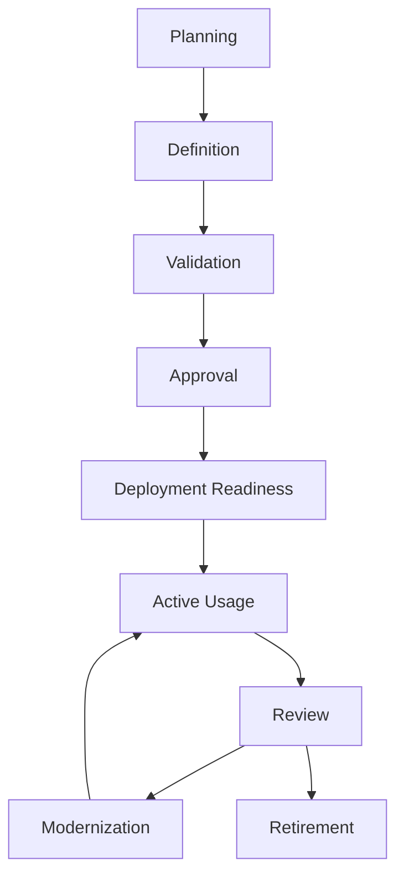
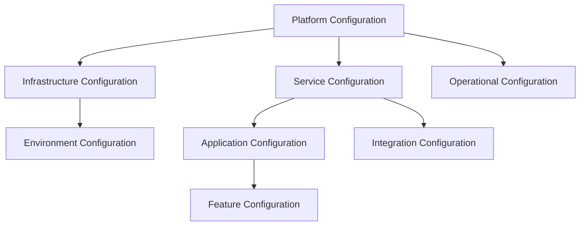
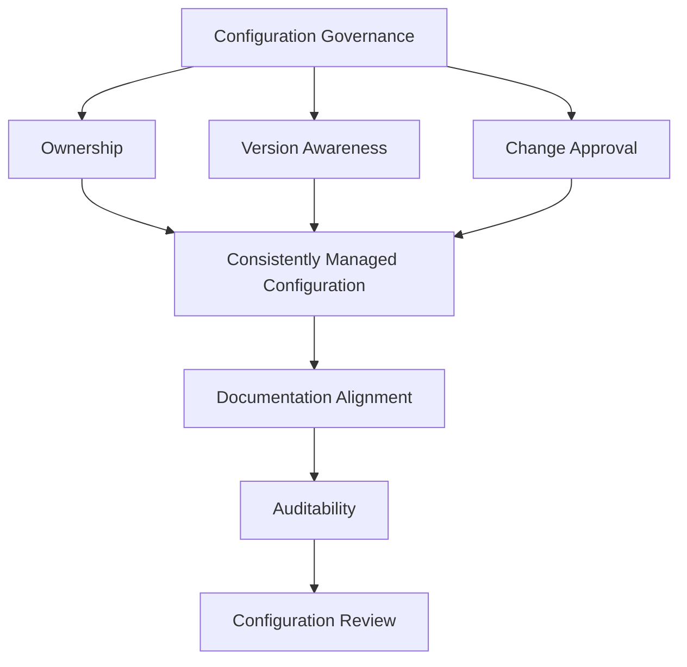
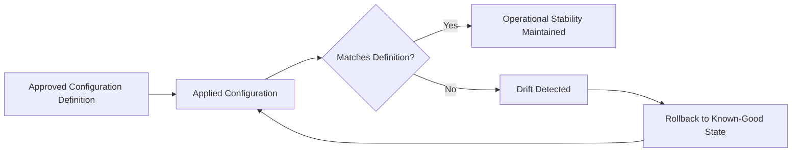
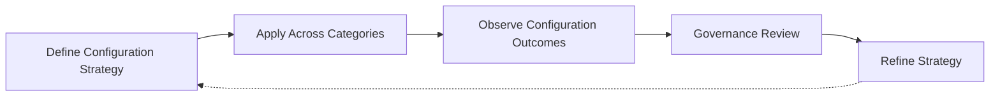

# Configuration Management

## 1. Document Purpose

This document defines how configuration is governed at **StackLeo** — how the settings that shape application, infrastructure, and platform behavior are defined, validated, approved, applied, and retired, without prescribing specific configuration management tools, environment variable naming conventions, or configuration files.

- **Purpose of Configuration Management** — to ensure that the behavior of the platform in any given environment is defined deliberately, consistently, and traceably, rather than shaped by undocumented, ad hoc settings that no one can fully account for.
- **Relationship with DevOps** — this document is the configuration-specific elaboration of the Everything as Code and Consistency principles defined in `devops-principles.md`, applied specifically to the settings that govern behavior rather than the logic that implements it.
- **Relationship with Deployment Strategy** — `deployment-strategy.md` depends on configuration being correct and environment-appropriate at the moment of deployment; misconfigured settings are one of the most common causes of deployment-time failure.
- **Relationship with Infrastructure Governance** — configuration and infrastructure are closely related but distinct; `infrastructure-as-code.md` governs the provisioned foundation itself, while this document governs the settings that shape how software behaves on top of that foundation.
- **Relationship with Operational Excellence** — configuration is a direct determinant of runtime behavior; disciplined configuration management is a precondition for the predictability that `reliability.md` and `monitoring.md` depend on.
- **Relationship with Business Continuity** — configuration errors are a leading, avoidable cause of outages; this document exists to make configuration a source of stability rather than a recurring point of operational risk.

This document is implementation-independent and vendor-neutral. It defines configuration philosophy, lifecycle, and governance conceptually — not specific tools, naming conventions, or configuration files.

## 2. Configuration Management Philosophy

- **Configuration as Managed Assets** — configuration is treated with the same seriousness, review, and version history as application code, not as an informal, secondary concern.
- **Separation of Configuration and Application Logic** — behavior that varies by environment or context is expressed as configuration, distinct from the logic that remains constant, so the two can be reasoned about and changed independently.
- **Consistency** — equivalent environments are configured comparably, so confidence gained in one environment transfers reliably to another, consistent with `environment-management.md`.
- **Traceability** — every configuration value in use can be traced to its source, its approval, and the reasoning behind it.
- **Predictability** — configuration behavior can be reasoned about in advance, rather than discovered through unexpected runtime behavior.
- **Change Governance** — configuration changes follow a deliberate, governed process, particularly for production-affecting settings.
- **Continuous Improvement** — configuration management practice is expected to mature as the platform, organization, and operational scale evolve.

## 3. Configuration Lifecycle

### Planning

- **Purpose** — determine what configuration a capability requires and how it should vary, if at all, across environments.
- **Business Value** — prevents configuration needs from being discovered reactively during implementation or deployment.
- **Governance Objectives** — ensure every configuration value can be traced back to a deliberate, understood need.

### Definition

- **Purpose** — establish the specific configuration values and their intended scope.
- **Business Value** — makes configuration explicit and reviewable rather than implicit and assumed.
- **Governance Objectives** — ensure configuration definition follows a consistent, documented structure.

### Validation

- **Purpose** — confirm defined configuration is complete, correctly scoped, and free of obvious error before use.
- **Business Value** — catches configuration mistakes before they affect a running environment.
- **Governance Objectives** — treat configuration validation as a required step, not an assumption of correctness.

### Approval

- **Purpose** — obtain a deliberate, accountable decision authorizing configuration to be applied, particularly for production-affecting settings.
- **Business Value** — ensures configuration changes reflect an intentional decision, not an unreviewed default.
- **Governance Objectives** — ensure approval authority and criteria are clearly defined and consistently applied.

### Deployment Readiness

- **Purpose** — confirm configuration is prepared and available for the environment it is intended to shape.
- **Business Value** — reduces the likelihood of deployment-time failure caused by missing or misapplied configuration.
- **Governance Objectives** — ensure configuration readiness is verified as a distinct step alongside deployment readiness.

### Active Usage

- **Purpose** — support the running platform's behavior during its primary period of operation.
- **Business Value** — delivers the environment-appropriate behavior configuration exists to provide.
- **Governance Objectives** — ensure active configuration remains consistent with its approved, documented definition.

### Review

- **Purpose** — periodically reassess whether existing configuration remains accurate, necessary, and appropriately scoped.
- **Business Value** — prevents configuration from accumulating unnoticed, unnecessary, or outdated settings.
- **Governance Objectives** — ensure configuration review occurs on a defined cadence, not only when a problem forces it.

### Modernization

- **Purpose** — deliberately update configuration structure or values to remain consistent with evolving standards.
- **Business Value** — keeps mature configuration sustainable rather than allowing it to become a growing liability.
- **Governance Objectives** — prevent long-lived configuration from silently diverging from current governance expectations.

### Retirement

- **Purpose** — formally remove configuration that is no longer needed.
- **Business Value** — reduces the operational and security surface area the organization must maintain and reason about.
- **Governance Objectives** — ensure retirement is a deliberate, recorded decision rather than an unexplained omission.

*Diagram 1: Enterprise Configuration Lifecycle — configuration moves from planning and definition through validation and deliberate approval, into active use, and is periodically reviewed, modernized, or formally retired.*

### Configuration Lifecycle Matrix

| Stage | Purpose | Business Value |
|---|---|---|
| Planning | Determine required configuration and its scope | Prevents reactive discovery of configuration needs |
| Definition | Establish specific values and intended scope | Makes configuration explicit and reviewable |
| Validation | Confirm completeness and correctness before use | Catches mistakes before they affect a running environment |
| Approval | Obtain a deliberate, accountable decision | Ensures changes reflect intentional, not default, decisions |
| Deployment Readiness | Confirm configuration is prepared for its environment | Reduces deployment-time failure from missing configuration |
| Active Usage | Support running platform behavior | Delivers environment-appropriate behavior |
| Review | Periodically reassess accuracy and necessity | Prevents accumulation of outdated or unnecessary settings |
| Modernization | Update structure and values deliberately | Keeps mature configuration sustainable |
| Retirement | Formally remove configuration no longer needed | Reduces ongoing operational and security surface area |

## 4. Configuration Categories

### Application Configuration

- **Purpose** — shape the behavior of application logic without altering the code itself.
- **Scope** — settings specific to a single application's functional behavior.
- **Governance Expectations** — reviewed alongside the application code it affects.
- **Business Importance** — directly determines the customer-facing behavior of the platform.

### Infrastructure Configuration

- **Purpose** — shape the behavior and characteristics of the provisioned infrastructure foundation.
- **Scope** — settings governing infrastructure defined in `infrastructure-as-code.md`.
- **Governance Expectations** — subject to the same review discipline as infrastructure definitions themselves.
- **Business Importance** — determines the platform's operational capacity and foundational stability.

### Environment Configuration

- **Purpose** — express the differences in behavior appropriate to a specific environment.
- **Scope** — settings that vary between local, shared, staging, production, and other environments defined in `environment-management.md`.
- **Governance Expectations** — governed with particular attention to preventing unintended cross-environment leakage.
- **Business Importance** — protects the isolation and predictability of the environment portfolio.

### Service Configuration

- **Purpose** — shape the behavior of an individual service within the broader platform.
- **Scope** — settings scoped to a single service's responsibilities and interfaces.
- **Governance Expectations** — owned by the team accountable for the service, consistent with `repository-strategy.md`.
- **Business Importance** — determines the reliability and correctness of a specific capability.

### Platform Configuration

- **Purpose** — shape behavior shared across multiple services or teams through common platform capability.
- **Scope** — settings governed centrally as part of `platform-engineering.md`.
- **Governance Expectations** — held to the highest consistency standard due to its broad downstream impact.
- **Business Importance** — affects the stability and consistency of the entire platform at once.

### Integration Configuration

- **Purpose** — shape how the platform connects to and interacts with external systems and partners.
- **Scope** — settings governing integration points, consistent with `03_System_Design/integration-architecture.md`.
- **Governance Expectations** — reviewed with attention to the partner or third-party relationship it affects.
- **Business Importance** — determines the reliability of relationships with couriers, payment providers, and future sellers.

### Feature Configuration

- **Purpose** — control the visibility or activation of specific capability independently of its deployment.
- **Scope** — settings governing whether and to whom a given capability is exposed.
- **Governance Expectations** — governed jointly by engineering and product stakeholders, given its direct business timing impact.
- **Business Importance** — enables the business to control capability rollout timing independently of technical delivery.

### Operational Configuration

- **Purpose** — shape how the platform is monitored, alerted on, and operationally managed.
- **Scope** — settings governing observability, monitoring, and alerting behavior.
- **Governance Expectations** — reviewed alongside the reliability and observability principles in `observability.md` and `monitoring.md`.
- **Business Importance** — directly determines how quickly the organization detects and responds to operational issues.

*Diagram 3: Configuration Category Model — platform-level configuration underpins infrastructure and service configuration, which in turn shape environment-specific, application-level, integration, and feature configuration, with operational configuration governing how the whole is observed.*

### Configuration Category Matrix

| Category | Purpose | Business Importance |
|---|---|---|
| Application Configuration | Shape application logic behavior | Directly determines customer-facing behavior |
| Infrastructure Configuration | Shape provisioned infrastructure characteristics | Determines operational capacity and foundational stability |
| Environment Configuration | Express environment-specific behavior differences | Protects isolation and predictability across environments |
| Service Configuration | Shape an individual service's behavior | Determines reliability and correctness of a specific capability |
| Platform Configuration | Shape behavior shared across services | Affects stability and consistency of the whole platform |
| Integration Configuration | Shape connections to external systems and partners | Determines reliability of partner relationships |
| Feature Configuration | Control capability visibility independent of deployment | Enables business-controlled rollout timing |
| Operational Configuration | Shape monitoring, alerting, and operational management | Determines speed of issue detection and response |

## 5. Configuration Governance

- **Ownership** — every category of configuration has a clearly identified owning team accountable for its correctness and currency.
- **Version Awareness** — configuration is versioned consistently, so its state at any point in time is discoverable and its history is traceable.
- **Change Approval** — configuration changes, particularly those affecting production, follow a defined approval process proportionate to their potential impact.
- **Documentation Alignment** — configuration is documented in terms of its purpose and scope, kept current as it evolves.
- **Auditability** — every configuration change is traceable to its author, its reasoning, and its approval.
- **Configuration Review** — configuration is periodically reviewed for continued accuracy and necessity, not left unexamined indefinitely once applied.

*Diagram 2: Configuration Governance Framework — ownership, version awareness, and approval converge on consistently managed configuration, which is documented, audited, and periodically reviewed.*

### Configuration Governance Matrix

| Governance Area | Focus | Accountable For |
|---|---|---|
| Ownership | Clearly identified owning team per category | Correctness and currency of owned configuration |
| Version Awareness | Consistent versioning of configuration state | Discoverable history and current state |
| Change Approval | Defined, proportionate approval process | Preventing unreviewed configuration change |
| Documentation Alignment | Purpose and scope documented and current | Understandable configuration for any reader |
| Auditability | Traceable authorship, reasoning, and approval | Supporting investigation and compliance |
| Configuration Review | Periodic reassessment of accuracy and necessity | Preventing unexamined, stale configuration |

## 6. Configuration Integrity

- **Configuration Consistency** — equivalent environments and services apply configuration in a comparably structured, comparably governed way.
- **Drift Awareness** — the actual, applied configuration is continuously compared against its documented, approved definition, so divergence is detected rather than silently accumulating.
- **Validation** — configuration is validated for correctness and completeness before and after it is applied, not assumed correct by default.
- **Separation of Duties** — the ability to define configuration and the authority to approve its application to production are held by distinct, deliberately separated responsibilities where risk warrants it.
- **Rollback Awareness** — configuration changes are treated as reversible events, with the ability to restore a prior, known-good configuration state confirmed in advance.
- **Operational Stability** — configuration integrity is a direct precondition for the platform's operational stability; unmanaged configuration is a leading, avoidable source of instability.

*Diagram 4: Configuration Integrity Flow — applied configuration is continuously compared against its approved definition; detected drift triggers rollback to a known-good state, sustaining operational stability.*

### Configuration Integrity Matrix

| Integrity Dimension | Focus | Risk Reduced |
|---|---|---|
| Configuration Consistency | Comparable structure and governance across contexts | Divergent, unpredictable behavior between equivalent contexts |
| Drift Awareness | Continuous comparison of applied vs. approved state | Silent accumulation of undetected configuration divergence |
| Validation | Correctness confirmed before and after application | Preventable configuration-caused failures |
| Separation of Duties | Distinct definition and approval responsibilities | Unreviewed, unilateral configuration change |
| Rollback Awareness | Confirmed ability to restore known-good state | Extended impact from a problematic configuration change |
| Operational Stability | Direct dependency on managed configuration | Avoidable, configuration-caused instability |

## 7. Future Readiness

- **Cloud-Native Platforms** — configuration principles are defined independent of any specific provider, allowing adoption of elastic, provider-hosted infrastructure without redefining configuration practice.
- **Microservices** — as capability decomposes into a growing number of independently deployable services, service and integration configuration governance scale without requiring redefinition.
- **Platform Engineering** — configuration governance is structured to be delivered as self-service platform capability, consistent with `platform-engineering.md`.
- **AI Systems** — configuration governing AI-assisted capability, including behavioral and operational parameters, is governed under the same integrity and governance principles as any other configuration.
- **Marketplace Platform** — as StackLeo evolves toward business sales, corporate accounts, wholesale, and a multi-vendor marketplace, integration and feature configuration extend to new partner and seller contexts without redefinition.
- **Multi-Region Operations** — as new sales channels and additional currencies beyond BDT are introduced, environment and integration configuration accommodate regional and channel variation without disrupting core governance.
- **Global Engineering Teams** — configuration governance remains independent of contributor location, supporting distributed teams managing configuration across the platform.

## 8. Governance

- **Ownership** — a designated configuration management governance owner is accountable for the coherence and enforcement of this strategy across all configuration categories.
- **Review Process** — significant changes to configuration lifecycle, category definitions, or governance expectations are reviewed consistent with the review discipline in `03_System_Design/architecture-decisions.md`.
- **Configuration Policies** — individual teams may define configuration detail consistent with this strategy, but may not bypass its approval or integrity principles.
- **Audit Readiness** — configuration records, versions, and approval history are maintained in a state that supports audit and investigation at any time.
- **Continuous Improvement** — configuration management practice is expected to mature as the platform, organization, and operational scale evolve, consistent with `devops-principles.md`.

*Diagram 5: Continuous Configuration Improvement Cycle — configuration strategy is applied across every category, its outcomes observed, reviewed by governance, and refined, with refinements feeding directly back into the strategy.*

### Governance Responsibility Matrix

| Governance Area | Owner | Accountable For |
|---|---|---|
| Ownership | Configuration Management Governance Owner | Coherence and enforcement of this strategy |
| Review Process | Architecture & Platform Teams | Reviewing changes to lifecycle and category definitions |
| Configuration Policies | Configuration Owning Teams | Detail consistent with enterprise governance principles |
| Audit Readiness | Platform & Security Teams | Configuration records ready for audit at any time |
| Continuous Improvement | DevOps / Platform Engineering | Maturing strategy as platform and scale evolve |

## 9. Anti-Patterns

- **Configuration Drift** — allowing applied configuration to silently diverge from its documented, approved definition. This undermines confidence in what is actually running and makes incidents harder to diagnose.
- **Hardcoded Configuration** — embedding environment- or context-specific values directly within application logic. This defeats the separation of configuration and logic and makes environment-specific behavior difficult to change safely.
- **Poor Documentation** — allowing configuration's purpose or scope to go undocumented. This makes configuration difficult for anyone but its original author to understand or safely modify.
- **Weak Ownership** — leaving a category of configuration without a clearly accountable owner. This causes correctness and currency to degrade with no one responsible for correcting it.
- **Manual Configuration Changes** — modifying configuration through untracked, manual intervention rather than a governed process. This introduces variance and makes actual state diverge from documented, approved state.
- **Mixed Responsibilities** — allowing the same party to both define and approve production-affecting configuration without separation. This removes an independent check against error or unauthorized change.
- **Reactive Configuration Management** — addressing configuration discipline only after a configuration-caused incident occurs. This means avoidable disruption, rather than deliberate design, drives improvement.
- **Missing Governance** — allowing configuration definition, approval, and retirement to proceed without consistent standards. This produces an inconsistent, ungovernable configuration landscape as the platform scales.

### Anti-Pattern Summary

| Anti-Pattern | Why It Must Be Avoided |
|---|---|
| Configuration Drift | Undermines confidence in what is actually running |
| Hardcoded Configuration | Defeats separation of configuration and logic |
| Poor Documentation | Configuration becomes difficult for anyone but its author to understand |
| Weak Ownership | Correctness and currency degrade with no accountable owner |
| Manual Configuration Changes | Actual state diverges from documented, approved state |
| Mixed Responsibilities | Removes an independent check against error or unauthorized change |
| Reactive Configuration Management | Avoidable disruption, not deliberate design, drives improvement |
| Missing Governance | Produces an inconsistent, ungovernable configuration landscape |

## 10. Document Information

| Property | Value |
|----------|-------|
| Document | configuration-management.md |
| Version | 1.0.0 |
| Status | Active |
| Maintained By | StackLeo |
| Last Updated | 2026-07-24 |

---

© StackLeo. All Rights Reserved.
