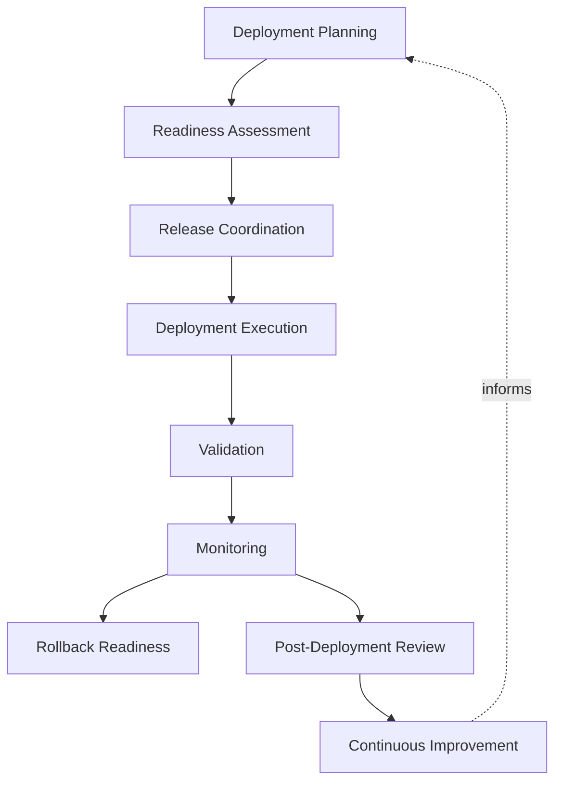
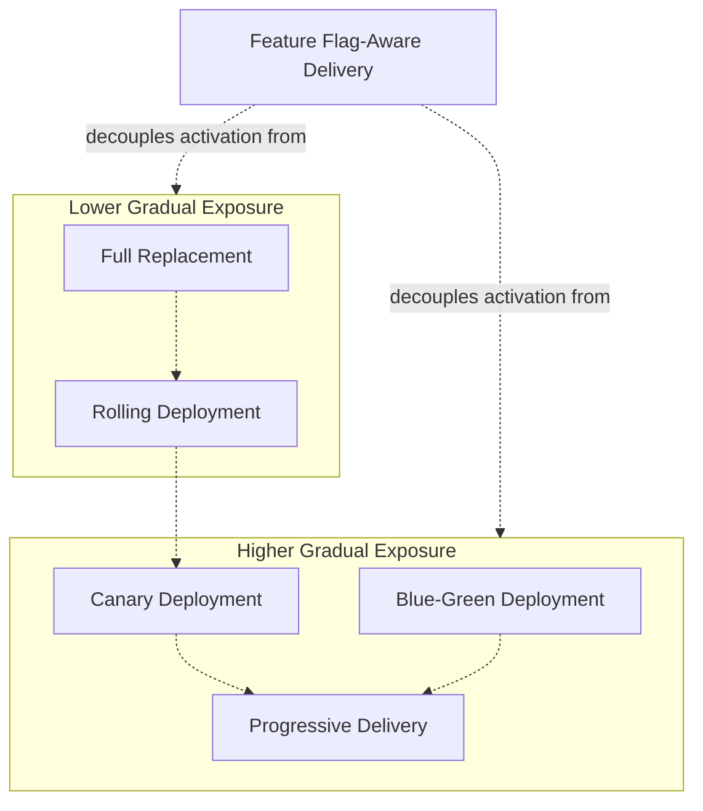
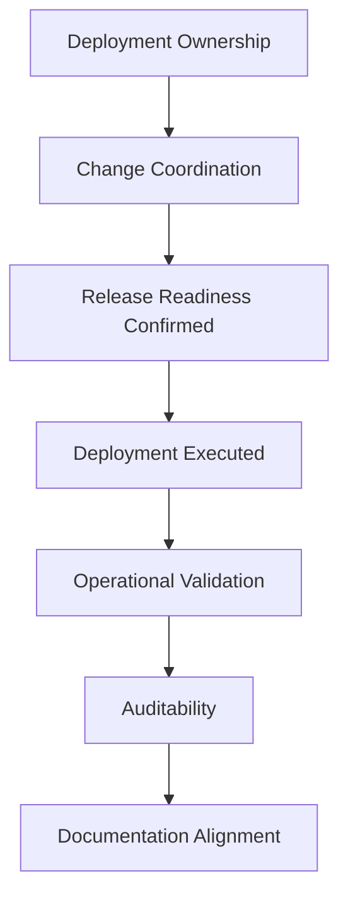
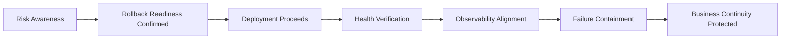
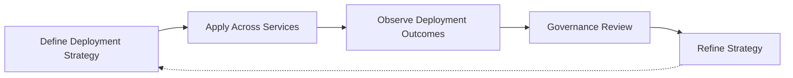

# Deployment Strategy

## 1. Document Purpose

This document defines the enterprise strategy for deploying change at **StackLeo** — how validated software reaches running environments predictably and safely, and how that process is governed, without prescribing specific deployment platforms, cloud providers, scripts, or infrastructure configurations.

- **Purpose of Deployment Strategy** — to ensure that the act of putting change into a running environment is a controlled, predictable, low-risk event, regardless of how frequently it occurs or how much the platform has grown.
- **Relationship with CI/CD** — this document is the deployment-specific elaboration of `ci-cd-strategy.md`. Where CI/CD strategy governs the full path from commit to production, this document governs the specific act of releasing a validated artifact into a running environment.
- **Relationship with Release Management** — deployment is the technical execution of a decision `release-management.md` governs; this document ensures that execution is safe and reliable regardless of what business timing decision triggered it.
- **Relationship with Platform Engineering** — deployment capability is intended to be delivered as consistent, self-service platform capability through `platform-engineering.md`, so every team deploys with the same safety guarantees without independently re-deriving them.
- **Relationship with Operational Excellence** — a deployment does not end at the moment new code starts running; it is only successful once operational health is confirmed, connecting this document directly to the observability and monitoring principles in `observability.md` and `monitoring.md`.
- **Relationship with Business Continuity** — deployment is one of the most common self-inflicted sources of business disruption if done carelessly; this document exists to make deployment a source of confidence rather than a recurring point of risk to business continuity.

This document is implementation-independent and vendor-neutral. It defines deployment philosophy, lifecycle, and governance conceptually — not specific platforms, scripts, or infrastructure configurations.

## 2. Deployment Philosophy

- **Automation First** — the mechanics of deployment are automated by default, removing manual, person-executed steps as a source of variance and error.
- **Deployment Safety** — every deployment is designed to limit its potential negative impact before it occurs, not merely to be corrected after the fact.
- **Progressive Delivery Awareness** — exposure to new change can be deliberately controlled and gradually expanded, rather than being an immediate, all-or-nothing event.
- **Reliability** — the deployment mechanism itself is engineered to be dependable, consistent with the reliability principles in `reliability.md`.
- **Predictability** — a deployment's behavior and duration can be reasoned about in advance, rather than being a source of uncertainty each time it occurs.
- **Traceability** — every deployment is connected to the specific artifact, source, and approval that authorized it, consistent with `build-pipeline.md` and `release-management.md`.
- **Continuous Improvement** — deployment practice is expected to mature over time, informed by what is learned from every deployment's outcome.

## 3. Deployment Lifecycle

### Deployment Planning

- **Purpose** — determine what will be deployed, to which environment, and under what conditions.
- **Business Value** — reduces the likelihood of deployments proceeding without a clear, agreed intent.
- **Governance Objectives** — ensure every deployment can be traced back to a deliberate planning decision.

### Readiness Assessment

- **Purpose** — confirm that the artifact, environment, and organization are all prepared for the deployment to proceed.
- **Business Value** — surfaces readiness gaps before they become deployment-time failures.
- **Governance Objectives** — make readiness assessment a required, not assumed, precondition.

### Release Coordination

- **Purpose** — align the deployment with other teams, dependent systems, and business timing considerations.
- **Business Value** — prevents avoidable conflict between simultaneous, uncoordinated changes.
- **Governance Objectives** — ensure deployments affecting shared context are visible to all relevant stakeholders in advance.

### Deployment Execution

- **Purpose** — carry out the deployment through a consistent, automated, well-understood process.
- **Business Value** — makes deployment a routine, low-drama operational event.
- **Governance Objectives** — ensure execution follows the same governed process every time, without exception.

### Validation

- **Purpose** — confirm the deployed change is present and functioning as expected immediately after execution.
- **Business Value** — catches deployment-specific issues before they are mistaken for a successful release.
- **Governance Objectives** — treat validation as a required step, not an assumption of success.

### Monitoring

- **Purpose** — continue observing the deployed change's behavior over a meaningful period following deployment.
- **Business Value** — catches issues that only manifest under real, sustained operating conditions.
- **Governance Objectives** — extend deployment accountability beyond the moment of execution.

### Rollback Readiness

- **Purpose** — maintain the ability to reverse the deployment quickly if it produces an unacceptable outcome.
- **Business Value** — limits the business impact of a deployment that does not perform as expected.
- **Governance Objectives** — ensure rollback capability is confirmed before deployment, not improvised after a problem occurs.

### Post-Deployment Review

- **Purpose** — deliberately assess how the deployment went, regardless of whether it succeeded without incident.
- **Business Value** — turns every deployment into a source of organizational learning.
- **Governance Objectives** — ensure review occurs consistently, not only after visible failures.

### Continuous Improvement

- **Purpose** — feed what is learned from deployment outcomes back into deployment practice itself.
- **Business Value** — keeps deployment practice improving in step with the platform's growing scale and complexity.
- **Governance Objectives** — ensure deployment learning is acted upon, not merely recorded.

*Diagram 1: Enterprise Deployment Lifecycle — a deployment moves from planning and readiness through coordinated execution, validation, and sustained monitoring, with rollback readiness maintained throughout and review feeding continuous improvement.*

### Deployment Lifecycle Matrix

| Stage | Purpose | Business Value |
|---|---|---|
| Deployment Planning | Determine what, where, and under what conditions | Ensures deliberate, traceable deployment intent |
| Readiness Assessment | Confirm artifact, environment, and organizational readiness | Surfaces gaps before they cause deployment-time failure |
| Release Coordination | Align with other teams and dependent systems | Prevents avoidable conflict between changes |
| Deployment Execution | Carry out deployment through a consistent process | Makes deployment routine and low-drama |
| Validation | Confirm change is present and functioning post-deployment | Catches deployment-specific issues immediately |
| Monitoring | Observe behavior over a sustained period | Catches issues only visible under real conditions |
| Rollback Readiness | Maintain ability to reverse the deployment | Limits business impact of an unacceptable outcome |
| Post-Deployment Review | Deliberately assess how the deployment went | Turns every deployment into organizational learning |
| Continuous Improvement | Feed outcomes back into deployment practice | Keeps practice aligned with growing complexity |

## 4. Deployment Strategies

StackLeo does not mandate a single deployment strategy as universally correct. The appropriate strategy may vary by service criticality, risk tolerance, and platform maturity, evaluated against the principles in Section 2.

### Full Replacement

- **Characteristics** — the entire running instance of a service is replaced with the new version at once.
- **Advantages** — simple to reason about and execute; no intermediate mixed-version state to manage.
- **Trade-Offs** — offers no gradual exposure; any defect affects the full user base immediately upon deployment.
- **Suitable Organizational Contexts** — low-traffic services, early-stage capability, or contexts where simplicity outweighs the value of gradual exposure.

### Rolling Deployment

- **Characteristics** — the new version is introduced incrementally across a set of running instances, replacing the old version gradually.
- **Advantages** — avoids a single, full-scale cutover moment; maintains availability throughout the process.
- **Trade-Offs** — introduces a period where old and new versions run simultaneously, requiring compatibility awareness.
- **Suitable Organizational Contexts** — services with multiple running instances where continuous availability during deployment is a priority.

### Blue-Green Deployment

- **Characteristics** — a complete, parallel environment running the new version is prepared and then traffic is switched to it, with the prior environment retained temporarily.
- **Advantages** — enables a near-instant switch and an equally fast reversal if problems are detected.
- **Trade-Offs** — requires maintaining duplicate environments during the transition, increasing resource and coordination overhead.
- **Suitable Organizational Contexts** — services where minimizing switch-over risk and enabling fast reversal justifies the overhead of parallel environments.

### Canary Deployment

- **Characteristics** — the new version is exposed to a small, controlled subset of traffic or users before wider rollout.
- **Advantages** — limits the impact of an undetected defect to a small population before it affects everyone.
- **Trade-Offs** — requires the ability to route and monitor a subset of traffic distinctly, adding operational complexity.
- **Suitable Organizational Contexts** — customer-facing services where the cost of a broad, undetected defect is high relative to the added complexity of staged exposure.

### Progressive Delivery

- **Characteristics** — exposure to the new version is expanded in deliberate stages, guided by observed health and confidence at each stage.
- **Advantages** — combines the gradual exposure benefits of canary deployment with an explicit, staged decision process for continued rollout.
- **Trade-Offs** — requires strong observability and defined decision criteria at each stage to be effective.
- **Suitable Organizational Contexts** — mature platforms where deployment risk must be actively managed across many services and releases.

### Feature Flag-Aware Delivery

- **Characteristics** — new capability is deployed but its visibility or activation is controlled independently of the deployment itself.
- **Advantages** — decouples the technical act of deployment from the business decision of when a capability becomes active or visible.
- **Trade-Offs** — introduces additional complexity in managing the state and lifecycle of flags themselves.
- **Suitable Organizational Contexts** — contexts where business timing of a capability's activation must be controlled independently of engineering delivery cadence.

*Diagram 2: Deployment Strategy Comparison — strategies range from simple, all-at-once replacement toward increasingly gradual, staged exposure, with feature flag-aware delivery available as an independent layer of control across any of them.*

### Deployment Strategy Comparison Matrix

| Strategy | Characteristics | Primary Advantage | Primary Trade-Off |
|---|---|---|---|
| Full Replacement | Entire instance replaced at once | Simple to reason about and execute | No gradual exposure to limit defect impact |
| Rolling Deployment | New version introduced incrementally | Maintains availability throughout | Temporary mixed-version state requires compatibility |
| Blue-Green Deployment | Parallel environment, traffic switched at once | Near-instant switch and reversal | Requires maintaining duplicate environments |
| Canary Deployment | Exposed to a small, controlled subset first | Limits impact of undetected defects | Requires distinct traffic routing and monitoring |
| Progressive Delivery | Exposure expanded in deliberate, guided stages | Actively managed, staged risk | Requires strong observability and decision criteria |
| Feature Flag-Aware Delivery | Deployment decoupled from activation | Business timing independent of delivery cadence | Adds complexity in managing flag lifecycle |

## 5. Deployment Governance

- **Deployment Ownership** — every deployable service has a clearly accountable owning team responsible for the safety and correctness of its deployments.
- **Change Coordination** — deployments affecting shared environments or dependent services are coordinated to avoid conflicting or overlapping change.
- **Release Readiness** — deployment proceeds only once release readiness has been confirmed consistent with `release-management.md`, not as an independent decision.
- **Operational Validation** — a deployment's success is judged by confirmed operational health, not merely by the completion of the deployment mechanism.
- **Auditability** — every deployment is traceable to its authorizing decision, the artifact deployed, and its outcome.
- **Documentation Alignment** — documentation describing a service's deployed state and configuration remains current with what is actually running.

*Diagram 3: Deployment Governance Flow — accountable ownership and coordination gate deployment on confirmed release readiness, with operational validation, auditability, and documentation alignment sustaining trust in the outcome.*

### Deployment Governance Matrix

| Governance Area | Focus | Accountable For |
|---|---|---|
| Deployment Ownership | Accountable team per deployable service | Safety and correctness of deployments |
| Change Coordination | Alignment across shared environments | Preventing conflicting or overlapping change |
| Release Readiness | Confirmed readiness before deployment | Deployment only proceeds on a verified decision |
| Operational Validation | Confirmed health after deployment | Judging success by real operational outcome |
| Auditability | Traceable authorization, artifact, and outcome | Supporting investigation and compliance |
| Documentation Alignment | Deployed state matches documentation | Preventing silent drift between reality and record |

## 6. Deployment Safety

- **Risk Awareness** — every deployment is assessed for its potential impact before it proceeds, proportionate to the criticality of what is being changed.
- **Rollback Readiness** — the ability to reverse a deployment is confirmed as a precondition, consistent with `rollback.md`, not something improvised after a problem is discovered.
- **Health Verification** — a deployment is confirmed to be operating correctly through deliberate checks, not assumed healthy by the absence of immediate complaint.
- **Observability Alignment** — deployment safety depends directly on the observability and monitoring capability defined in `observability.md` and `monitoring.md`; a deployment cannot be judged safe if its behavior cannot be seen.
- **Failure Containment** — a deployment is designed so that a failure's impact is bounded and does not cascade beyond its intended scope.
- **Business Continuity Awareness** — deployment safety practice exists in direct service of protecting business continuity, and deployment decisions are weighed against that responsibility.

*Diagram 4: Deployment Safety Framework — risk awareness and confirmed rollback readiness precede deployment, with health verification and observability sustaining failure containment and, ultimately, business continuity.*

### Deployment Safety Matrix

| Safety Dimension | Focus | Business Value |
|---|---|---|
| Risk Awareness | Impact assessed proportionate to criticality | Prevents disproportionate exposure from routine change |
| Rollback Readiness | Reversal capability confirmed beforehand | Enables fast recovery rather than improvisation |
| Health Verification | Deliberate confirmation of correct operation | Prevents false confidence from silence |
| Observability Alignment | Dependence on observability and monitoring | Ensures deployment safety is verifiable, not assumed |
| Failure Containment | Bounded impact scope by design | Prevents a single failure from cascading |
| Business Continuity Awareness | Decisions weighed against continuity impact | Keeps safety practice connected to real business stakes |

## 7. Future Readiness

- **Cloud-Native Platforms** — deployment principles are defined independent of any specific provider, allowing adoption of elastic, provider-hosted infrastructure without redefining deployment practice.
- **Microservices** — deployment lifecycle and safety principles scale consistently as capability decomposes into a growing number of independently deployable services.
- **Multi-Region Deployments** — as StackLeo expands from Bangladesh into South Asia and, over time, global markets, deployment coordination and governance extend to multiple regions without redefinition.
- **AI Systems** — AI-assisted capability is deployed under the same safety, validation, and rollback readiness principles as any other system capability.
- **Marketplace Platform** — as StackLeo evolves toward business sales, corporate accounts, wholesale, and a multi-vendor marketplace, deployment governance extends to a broader set of independently owned services without loss of consistency.
- **Platform Engineering** — deployment safety and lifecycle expectations are structured to be enforceable through self-service platform capability, consistent with `platform-engineering.md`.
- **Global Engineering Teams** — deployment governance remains independent of contributor or operator location, supporting distributed teams coordinating deployments across time zones.

## 8. Governance

- **Ownership** — a designated deployment governance owner is accountable for the coherence and enforcement of this strategy across all deployable services.
- **Review Process** — significant changes to deployment lifecycle, strategy selection criteria, or safety expectations are reviewed consistent with the review discipline in `03_System_Design/architecture-decisions.md`.
- **Deployment Policies** — individual teams may define deployment detail consistent with this strategy, but may not bypass its governance or safety principles.
- **Audit Readiness** — deployment records, approvals, and outcomes are maintained in a state that supports audit and investigation at any time.
- **Continuous Improvement** — deployment strategy is expected to mature as the platform, organization, and operational practice evolve, consistent with `devops-principles.md`.

*Diagram 5: Continuous Deployment Improvement Cycle — deployment strategy is applied across services, its outcomes observed, reviewed by governance, and refined, with refinements feeding directly back into the strategy.*

### Governance Responsibility Matrix

| Governance Area | Owner | Accountable For |
|---|---|---|
| Ownership | Deployment Governance Owner | Coherence and enforcement of this strategy |
| Review Process | Architecture & Platform Teams | Reviewing changes to lifecycle and safety expectations |
| Deployment Policies | Service Owning Teams | Detail consistent with enterprise governance and safety |
| Audit Readiness | Platform & Security Teams | Deployment records ready for audit at any time |
| Continuous Improvement | DevOps / Platform Engineering | Maturing strategy as platform and practice evolve |

## 9. Anti-Patterns

- **Manual Deployments** — relying on manual, person-executed steps to deploy change. This introduces variance, human error, and dependency on individual availability that automation exists to remove.
- **Big-Bang Releases** — deploying large, infrequent batches of accumulated change at once. This concentrates risk into rare, high-stakes events rather than distributing it safely over time.
- **Missing Validation** — treating deployment execution as equivalent to deployment success without confirming actual behavior. This allows failures to go unnoticed until customers discover them.
- **Weak Rollback Planning** — deploying without a confirmed, tested ability to reverse the change. This turns an otherwise recoverable problem into an extended outage.
- **Poor Change Coordination** — deploying without awareness of other concurrent changes affecting the same environment or dependent services. This creates avoidable conflict and confused incident response.
- **Reactive Deployments** — treating deployment safety as adequate until an incident proves otherwise. This means avoidable failures, rather than deliberate design, drive improvement.
- **Weak Documentation** — allowing a service's documented configuration to diverge from what is actually deployed. This makes investigation and future deployment decisions unreliable.
- **No Continuous Improvement** — treating current deployment practice as a permanently finished state. This guarantees practice falls behind the platform's growing scale and complexity over time.

### Anti-Pattern Summary

| Anti-Pattern | Why It Must Be Avoided |
|---|---|
| Manual Deployments | Introduces variance, error, and dependency on individual availability |
| Big-Bang Releases | Concentrates risk into rare, high-stakes events |
| Missing Validation | Allows failures to go unnoticed until customers discover them |
| Weak Rollback Planning | Turns a recoverable problem into an extended outage |
| Poor Change Coordination | Creates avoidable conflict and confused incident response |
| Reactive Deployments | Avoidable failures, not deliberate design, drive improvement |
| Weak Documentation | Makes investigation and future decisions unreliable |
| No Continuous Improvement | Practice falls behind platform scale and complexity |

## 10. Document Information

| Property | Value |
|----------|-------|
| Document | deployment-strategy.md |
| Version | 1.0.0 |
| Status | Active |
| Maintained By | StackLeo |
| Last Updated | 2026-07-24 |

---

© StackLeo. All Rights Reserved.
