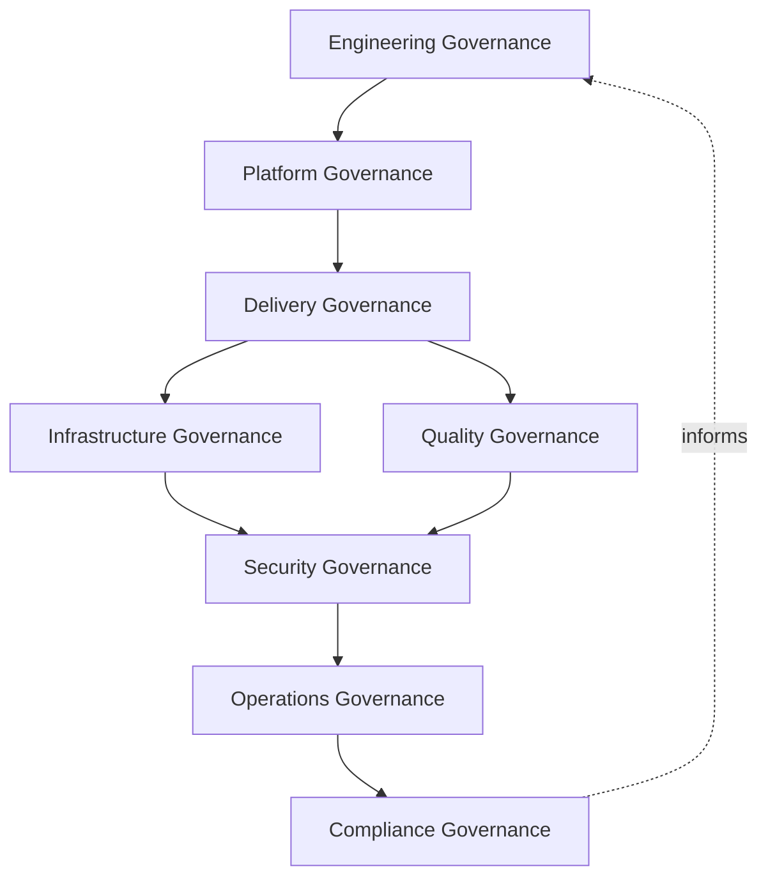
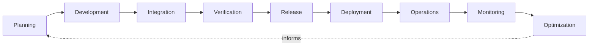
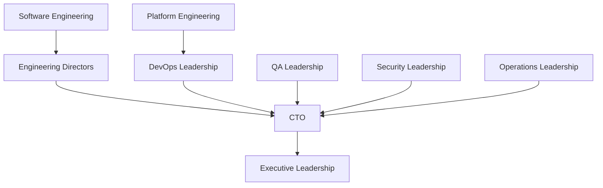
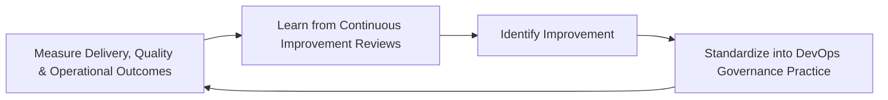
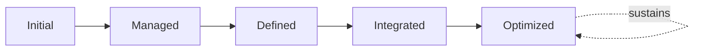

# Enterprise DevOps Governance Framework

## 1. Executive Summary

**Purpose** — This document defines the official Enterprise DevOps Governance Framework for **StackLeo Tech Store**. It establishes the organizational collaboration model, delivery governance, platform governance, operational excellence, engineering accountability, executive oversight, and long-term maturity discipline under which DevOps practice as a whole is governed. `devops-overview.md` and `devops-principles.md` remain the operational foundation for this folder — the documents that elaborate DevOps vision, capability, operating model, and engineering principle in full operational depth. This framework sits above both as the highest-level executive mandate, consistent with the executive-charter relationship `deployment-governance.md` holds over `deployment-strategy.md`: it does not restate capability or principle detail, it establishes the formal governance model, organizational accountability, risk discipline, and executive oversight that give DevOps practice its authority across the whole organization.

**Scope** — This framework applies to every DevOps capability domain at StackLeo — source control, build management, release management, deployment, platform engineering, infrastructure, security, monitoring, incident response, and reliability engineering — across the full engineering organization, from the current single-team delivery model through future global, multi-team engineering scale.

**Objectives** — To ensure DevOps decisions are governed deliberately by accountable people; that engineering collaboration is structured rather than incidental; that delivery, platform, and operational risk are identified and weighed before acceptance; and that executive leadership has genuine, continuous visibility into engineering governance health and maturity.

**Business Value** — Governed DevOps practice converts engineering capability into a genuine, compounding competitive advantage, protects the business from the disruption ungoverned delivery and operational practice would otherwise cause, and gives leadership confidence to scale engineering organization and delivery pace together without one undermining the other.

**Intended Audience** — Executive leadership, the Chief Technology Officer, engineering directors, DevOps and platform engineering leadership, software engineering, QA leadership, security leadership, operations leadership, and independent audit and oversight functions.

## 2. Enterprise DevOps Vision

- **DevOps Vision** — DevOps at StackLeo is governed as a single, coherent enterprise discipline connecting engineering intent to reliable customer-facing outcome, never as a disconnected collection of team-level practices.
- **Engineering Culture** — engineering culture is treated as a deliberately governed asset, cultivated consistently across every team, not assumed to emerge automatically from talented individuals.
- **Organizational Collaboration** — collaboration across engineering, platform, security, quality, and operations functions is structured and governed, not left to informal, ad hoc coordination.
- **Delivery Excellence** — the ability to deliver validated change reliably and at pace is governed as a genuine business capability, consistent with `devops-overview.md` (Section 2).
- **Platform Reliability** — the platform's reliability is governed as a shared, enterprise-wide accountability, coordinated with `sre-strategy.md`, never the responsibility of a single isolated function.
- **Business Agility** — DevOps governance exists to make business agility — StackLeo's ability to adapt to Bangladesh's market and eventual South Asian and global expansion — an engineering reality, not merely a stated ambition.
- **Customer Value** — every DevOps governance decision is ultimately weighed against its genuine effect on the value delivered to the customer, consistent with `01_Business/vision.md`.

### DevOps Vision Matrix

| Vision Element | Focus | Business Value |
|---|---|---|
| DevOps Vision | Coherent enterprise discipline, not disconnected team practice | Ensures consistent engineering outcomes regardless of team |
| Engineering Culture | Deliberately governed, cultivated asset | Prevents culture quality from depending on individual talent alone |
| Organizational Collaboration | Structured and governed across functions | Prevents collaboration from depending on informal coordination |
| Delivery Excellence | Governed as a genuine business capability | Connects delivery reliability directly to business outcome |
| Platform Reliability | Shared, enterprise-wide accountability | Prevents reliability from resting on a single isolated function |
| Business Agility | Makes market adaptability an engineering reality | Supports expansion into South Asia and global markets |
| Customer Value | Every decision weighed against genuine customer effect | Keeps governance connected to the trust-centered brand promise |

## 3. DevOps Principles

DevOps governance at StackLeo rests on nine principles, each producing a specific business outcome.

- **Collaboration Over Silos** — engineering, platform, security, quality, and operations functions govern delivery as a shared responsibility, not as sequential handoffs between isolated teams. *Business Value:* prevents the delay and quality erosion that occurs when functions operate without genuine coordination.
- **Shared Ownership** — every team that touches a capability shares genuine accountability for its outcome in production, not only its initial delivery. *Business Value:* aligns incentive with the platform's actual, sustained success.
- **Automation with Governance** — automation is pursued deliberately, under genuine governance, never as an ungoverned accumulation of scripts and tools. *Business Value:* ensures automation investment is trustworthy and sustainable, not a hidden liability.
- **Security by Design** — security is embedded into every DevOps capability domain from the outset, coordinated with `devsecops-strategy.md`, never treated as a separate, later concern. *Business Value:* prevents security from becoming an unmonitored gap in delivery practice.
- **Continuous Feedback** — every stage of the DevOps lifecycle produces genuine feedback that informs the stages before it. *Business Value:* enables the organization to correct course early, before cost and risk compound.
- **Reliability First** — the reliability of the running platform takes precedence over the convenience of any individual engineering decision. *Business Value:* protects the operational trust every customer transaction depends on.
- **Transparency** — DevOps governance decisions, outcomes, and health are documented and genuinely visible to those who need them. *Business Value:* allows engineering governance to be scrutinized and defended, not merely asserted.
- **Accountability** — every DevOps capability domain and governance decision traces to a specific, named, responsible owner. *Business Value:* ensures no dimension of DevOps practice drifts without someone genuinely responsible for it.
- **Continuous Improvement** — DevOps governance practice matures over time, informed by real engineering and operational outcomes. *Business Value:* keeps governance aligned with the organization's growing scale and complexity.

### DevOps Principles Matrix

| Principle | Description | Business Value |
|---|---|---|
| Collaboration Over Silos | Delivery governed as shared responsibility, not sequential handoffs | Prevents delay and quality erosion from disconnected functions |
| Shared Ownership | Accountability extends to production outcome, not just delivery | Aligns incentive with sustained platform success |
| Automation with Governance | Automation pursued deliberately, under genuine governance | Ensures automation is trustworthy, not a hidden liability |
| Security by Design | Security embedded from the outset across every domain | Prevents security from becoming an unmonitored gap |
| Continuous Feedback | Every stage produces feedback informing prior stages | Enables early correction before cost and risk compound |
| Reliability First | Platform reliability takes precedence over convenience | Protects the operational trust every transaction depends on |
| Transparency | Decisions, outcomes, and health documented and visible | Allows governance to be scrutinized and defended |
| Accountability | Every domain and decision traces to a named owner | Ensures no dimension of practice drifts without responsibility |
| Continuous Improvement | Practice matures from real engineering and operational outcomes | Keeps governance aligned with growing scale and complexity |

## 4. Enterprise DevOps Governance Model

DevOps governance operates across eight conceptual layers, each holding accountability for a distinct dimension of engineering practice.

### Engineering Governance

- **Purpose** — own the coherence of how software engineering practice itself is governed across the organization.
- **Governance Scope** — oversight coordinated with `03_System_Design/architecture-principles.md` and `devops-principles.md`.
- **Business Value** — ensures engineering discipline is consistent across teams, not dependent on individual practice.
- **Executive Expectations** — leadership trusts engineering practice is genuinely governed, not merely encouraged.

### Platform Governance

- **Purpose** — own the coherence of how self-service platform capability is governed, coordinated with `platform-engineering.md`.
- **Governance Scope** — oversight of platform capability consumed consistently across every engineering team.
- **Business Value** — ensures every team benefits from the same governed safety guarantees without re-deriving them independently.
- **Executive Expectations** — leadership trusts platform capability is genuinely consistent, not fragmented by team.

### Delivery Governance

- **Purpose** — own the coherence of how validated change moves from commit to production.
- **Governance Scope** — oversight coordinated with `ci-cd-strategy.md`, `release-management.md`, and `deployment-governance.md`.
- **Business Value** — ensures delivery is predictable and governed, not an ungoverned, ad hoc process per team.
- **Executive Expectations** — leadership trusts delivery governance is exercised consistently regardless of release frequency.

### Infrastructure Governance

- **Purpose** — own the coherence of how the platform's underlying technical infrastructure is governed.
- **Governance Scope** — oversight coordinated with `infrastructure-as-code.md` and `environment-management.md`.
- **Business Value** — protects the technical foundation every other governance layer ultimately depends on.
- **Executive Expectations** — leadership trusts infrastructure governance is exercised with consistent rigor regardless of scale.

### Security Governance

- **Purpose** — own the coherence of how security is embedded into DevOps practice, jointly with, and never superseding, `06_Security/security-governance.md`.
- **Governance Scope** — oversight coordinated with `devsecops-strategy.md` and `secrets-management.md`.
- **Business Value** — protects StackLeo's core trust differentiator through continuous, embedded security discipline.
- **Executive Expectations** — leadership expects security governance to carry mandatory, non-negotiable weight in every DevOps decision.

### Quality Governance

- **Purpose** — own the coherence of how quality verification is embedded into DevOps practice, coordinated with `08_QUALITY_ASSURANCE/testing-governance.md`.
- **Governance Scope** — oversight ensuring delivery pace never proceeds ahead of genuine quality confidence.
- **Business Value** — ensures increasing delivery frequency is matched by proportionate, genuine verification.
- **Executive Expectations** — leadership trusts quality governance is never quietly bypassed under schedule pressure.

### Operations Governance

- **Purpose** — own the coherence of how the platform is operated, monitored, and sustained once live, coordinated with `09_OPERATIONS/operations-governance-strategy.md`.
- **Governance Scope** — oversight of Observability and Reliability Engineering (`observability-strategy.md`, `sre-strategy.md`).
- **Business Value** — ensures operational excellence is a governed, sustained discipline, not an incidental outcome.
- **Executive Expectations** — leadership trusts operational governance extends genuinely beyond the moment of deployment.

### Compliance Governance

- **Purpose** — own the coherence of how DevOps practice meets its regulatory and contractual obligations.
- **Governance Scope** — oversight coordinated with `06_Security/compliance-governance.md`.
- **Business Value** — protects the business's standing with regulators and its contractual counterparties.
- **Executive Expectations** — leadership expects compliance obligations to be sustained continuously, not demonstrated only at audit time.

### DevOps Governance Matrix

| Layer | Purpose | Business Value | Executive Expectations |
|---|---|---|---|
| Engineering Governance | Own coherence of how engineering practice is governed | Ensures discipline is consistent, not individually dependent | Trusts practice is genuinely governed, not merely encouraged |
| Platform Governance | Own coherence of self-service platform capability | Ensures consistent safety guarantees across every team | Trusts capability is genuinely consistent, not fragmented |
| Delivery Governance | Own coherence of the path from commit to production | Ensures delivery is predictable and governed | Trusts governance is exercised regardless of release frequency |
| Infrastructure Governance | Own coherence of underlying technical infrastructure | Protects the technical foundation every layer depends on | Trusts governance is exercised with consistent rigor at scale |
| Security Governance | Own coherence of embedding security into DevOps practice | Protects StackLeo's core trust differentiator | Expects mandatory, non-negotiable weight in every decision |
| Quality Governance | Own coherence of embedding verification into practice | Ensures delivery pace matched by genuine verification | Trusts quality governance is never bypassed under pressure |
| Operations Governance | Own coherence of operating and sustaining the platform | Ensures operational excellence is governed, not incidental | Trusts operations extends genuinely beyond deployment |
| Compliance Governance | Own coherence of meeting regulatory and contractual obligation | Protects standing with regulators and counterparties | Expects obligations sustained continuously, not only at audit |

*Diagram 1: Enterprise DevOps Governance Framework — engineering and platform governance feed delivery governance, branching into infrastructure and quality governance, converging on security governance ahead of operations and compliance governance, which feeds back into engineering governance.*

## 5. Enterprise DevOps Capability Domains

DevOps governance is exercised across ten conceptual capability domains, each elaborated in full operational depth in its own subordinate document.

- **Source Control** — governs how source code change is proposed, reviewed, and integrated, coordinated with `git-strategy.md`, `branching-strategy.md`, and `repository-strategy.md`.
- **Build Management** — governs how source code is deterministically converted into a deployable artifact, coordinated with `build-pipeline.md`.
- **Release Management** — governs the business decision of when and how validated change becomes an actual release, coordinated with `release-management.md`.
- **Deployment** — governs the safe, controlled act of putting validated change into a running environment, coordinated with `deployment-governance.md` and `deployment-strategy.md`.
- **Platform Engineering** — governs the self-service capability that makes governed delivery the path of least resistance, coordinated with `platform-engineering.md`.
- **Infrastructure** — governs the underlying technical foundation the platform runs on, coordinated with `infrastructure-as-code.md` and `environment-management.md`.
- **Security** — governs the embedding of protection into every DevOps capability, coordinated with `devsecops-strategy.md` and `secrets-management.md`.
- **Monitoring** — governs how the platform's behavior and health are continuously observed, coordinated with `observability-strategy.md`.
- **Incident Response** — governs how the organization responds to and learns from operational disruption, coordinated with `incident-management.md` and `09_OPERATIONS/incident-management-governance.md`.
- **Reliability Engineering** — governs the engineered discipline of sustaining platform reliability at scale, coordinated with `sre-strategy.md`.

### Capability Domain Matrix

| Domain | Governance Focus | Coordinated Document |
|---|---|---|
| Source Control | How change is proposed, reviewed, integrated | `git-strategy.md`, `branching-strategy.md`, `repository-strategy.md` |
| Build Management | Deterministic conversion of source into artifact | `build-pipeline.md` |
| Release Management | Business decision of when and how to release | `release-management.md` |
| Deployment | Safe, controlled act of putting change into environments | `deployment-governance.md`, `deployment-strategy.md` |
| Platform Engineering | Self-service capability enabling governed delivery by default | `platform-engineering.md` |
| Infrastructure | Underlying technical foundation the platform runs on | `infrastructure-as-code.md`, `environment-management.md` |
| Security | Protection embedded into every DevOps capability | `devsecops-strategy.md`, `secrets-management.md` |
| Monitoring | Continuous observation of platform behavior and health | `observability-strategy.md` |
| Incident Response | Response to and learning from operational disruption | `incident-management.md`, `09_OPERATIONS/incident-management-governance.md` |
| Reliability Engineering | Engineered discipline sustaining reliability at scale | `sre-strategy.md` |

## 6. Enterprise DevOps Lifecycle

DevOps governance operates across nine conceptual lifecycle stages.

- **Planning** — *Governance Objective:* ensure every unit of engineering work traces to a deliberate, governed intent before development begins.
- **Development** — *Governance Objective:* ensure development practice is consistent with governed engineering principles, coordinated with `devops-principles.md`.
- **Integration** — *Governance Objective:* ensure change is integrated continuously and safely, coordinated with Source Control and Build Management (Section 5).
- **Verification** — *Governance Objective:* ensure quality confidence is genuinely established before change proceeds, coordinated with `08_QUALITY_ASSURANCE/testing-governance.md`.
- **Release** — *Governance Objective:* ensure the business decision to release is made deliberately, coordinated with `release-management.md`.
- **Deployment** — *Governance Objective:* ensure validated change reaches running environments safely and predictably, coordinated with `deployment-governance.md`.
- **Operations** — *Governance Objective:* ensure the platform is sustained reliably once live, coordinated with `09_OPERATIONS/operations-governance-strategy.md`.
- **Monitoring** — *Governance Objective:* ensure platform behavior remains continuously observed and understood.
- **Optimization** — *Governance Objective:* ensure lessons from every prior stage are converted into genuine, lasting improvement.

### Lifecycle Governance Matrix

| Stage | Governance Objective | Business Value |
|---|---|---|
| Planning | Ensure work traces to deliberate, governed intent | Prevents effort spent on undeliberate, ungoverned activity |
| Development | Ensure practice is consistent with governed principles | Keeps development discipline consistent across teams |
| Integration | Ensure change is integrated continuously and safely | Reduces the risk of large, infrequent, high-stakes merges |
| Verification | Ensure quality confidence is genuinely established | Prevents delivery pace outrunning genuine verification |
| Release | Ensure the release decision is made deliberately | Converts release into a routine, evidence-based decision |
| Deployment | Ensure change reaches environments safely and predictably | Protects operational reliability during active change |
| Operations | Ensure the platform is sustained reliably once live | Extends accountability beyond the moment of deployment |
| Monitoring | Ensure behavior remains continuously observed | Enables issues to be caught before they compound |
| Optimization | Ensure lessons convert into lasting improvement | Keeps DevOps practice compounding in capability over time |

*Diagram 3: Enterprise DevOps Lifecycle — planning and development inform integration and verification, proceeding through release and deployment into operations and monitoring, with optimization feeding lessons learned back into planning.*

## 7. Organizational Governance

Governance accountability is distributed deliberately across nine organizational roles, defined here at the governance-objective level.

- **Executive Leadership** — holds ultimate accountability for whether DevOps practice is genuinely governed as an enterprise discipline.
- **CTO** — owns the coherence and enforcement of this framework across every capability domain and governance layer it defines.
- **Engineering Directors** — own Engineering Governance (Section 4) within the teams and capability they are accountable for.
- **DevOps Leadership** — owns Delivery and Platform Governance (Section 4) in coordination with `devops-overview.md` and `platform-engineering.md`.
- **Platform Engineering** — owns the self-service capability that makes governed practice the default path for every team.
- **Software Engineering** — owns Development and Integration lifecycle stages (Section 6) within their assigned capability.
- **QA Leadership** — owns Quality Governance (Section 4) in coordination with `08_QUALITY_ASSURANCE/qa-governance.md`.
- **Security Leadership** — owns Security Governance (Section 4) jointly with `06_Security/security-governance.md`, which remains authoritative for security-specific obligations.
- **Operations Leadership** — owns Operations Governance (Section 4) in coordination with `09_OPERATIONS/operations-governance-strategy.md`.

### Organizational Responsibility Matrix

| Role | Governance Objective | Business Value |
|---|---|---|
| Executive Leadership | Hold ultimate accountability for governed DevOps practice | Provides a single point of ultimate accountability |
| CTO | Own coherence and enforcement of this framework | Provides a single point of specialist accountability |
| Engineering Directors | Own engineering governance within their accountable teams | Embeds governance closest to where engineering occurs |
| DevOps Leadership | Own delivery and platform governance | Provides specialist accountability for delivery coherence |
| Platform Engineering | Own self-service capability enabling governed practice by default | Makes the governed path the path of least resistance |
| Software Engineering | Own development and integration within their capability | Embeds accountability closest to where code is written |
| QA Leadership | Own quality governance in coordination with QA governance | Keeps DevOps and QA governance genuinely coordinated |
| Security Leadership | Own security governance jointly with security governance | Keeps security embedded, not a separate, later concern |
| Operations Leadership | Own operations governance in coordination with operations strategy | Ensures accountability extends beyond deployment |

*Diagram 4: Organizational Governance Structure — accountability flows from software engineering, platform engineering, QA, security, and operations leadership into the CTO, converging on executive leadership.*

## 8. Risk Governance

DevOps-related risk is governed across seven conceptual categories, coordinated with `06_Security/enterprise-risk-management-strategy.md`.

- **Delivery Risk** — the risk that validated change fails to reach customers reliably or predictably.
- **Operational Risk** — the risk that the platform cannot be adequately operated, supported, or recovered once live.
- **Platform Risk** — the risk that self-service platform capability itself becomes a source of inconsistency or failure.
- **Infrastructure Risk** — the risk that the platform's underlying technical foundation fails to support genuine reliability.
- **Security Risk** — the risk that DevOps practice introduces or fails to detect a genuine security weakness.
- **Compliance Risk** — the risk that DevOps practice fails to meet a genuine regulatory or contractual obligation.
- **Business Continuity Risk** — the risk that DevOps practice itself becomes a source of business disruption rather than protection against it.

### Risk Governance Matrix

| Risk Category | Focus | Governance Coordination |
|---|---|---|
| Delivery Risk | Failure to reach customers reliably or predictably | Coordinated with delivery and release governance |
| Operational Risk | Inadequate ability to operate, support, or recover | Coordinated with operations governance |
| Platform Risk | Self-service capability becoming a source of failure | Coordinated with platform governance |
| Infrastructure Risk | Technical foundation failing to support reliability | Coordinated with infrastructure governance |
| Security Risk | Introduced or undetected security weakness | Coordinated with `06_Security/security-governance.md` |
| Compliance Risk | Failure to meet regulatory or contractual obligation | Coordinated with compliance governance |
| Business Continuity Risk | DevOps practice as a source of disruption | Coordinated with `09_OPERATIONS/business-continuity-governance.md` |

## 9. Executive Oversight

- **Engineering Governance Reviews** — the overall coherence of engineering governance is formally reviewed on a regular cadence.
- **Delivery Reviews** — the organization's delivery governance health is reviewed directly with executive leadership.
- **Operational Reviews** — sustained operational health is reviewed as a distinct, ongoing concern.
- **Executive Reporting** — aggregated DevOps governance health — delivery frequency, quality confidence, operational stability — is reported to executive leadership and the Board.
- **Continuous Improvement Reviews** — the organization's follow-through on captured DevOps governance lessons is reviewed directly with executive leadership.

### Executive Oversight Matrix

| Oversight Mechanism | Purpose | Governance Role |
|---|---|---|
| Engineering Governance Reviews | Confirm overall engineering governance coherence | Regular, predictable cadence for the framework as a whole |
| Delivery Reviews | Review delivery governance health | Direct executive-level review of delivery discipline |
| Operational Reviews | Review sustained operational health | Treats operations as ongoing, not assumed from delivery success |
| Executive Reporting | Provide leadership a single, coherent governance picture | Reports delivery frequency, quality confidence, stability |
| Continuous Improvement Reviews | Review follow-through on captured lessons | Direct executive-level review of improvement completion |

## 10. Future Readiness

This framework is designed to remain valid as StackLeo evolves in scale, geography, and organizational complexity.

- **Platform Engineering** — as self-service platform capability matures, Platform Governance (Section 4) extends coherently without requiring redefinition.
- **AI-Assisted DevOps** — as engineering and operational practice increasingly incorporate AI-assisted methods, they remain governed under the same rigor as any other method.
- **Intelligent Operations** — where operational decision-making increasingly draws on intelligent pattern analysis, that analysis remains subject to Operations Governance (Section 4).
- **GitOps (Conceptual)** — where delivery practice increasingly treats declarative configuration as the source of truth for operational state, that practice remains governed under Delivery and Infrastructure Governance (Section 4).
- **Internal Developer Platforms** — as platform capability matures into a genuinely self-service internal developer platform, this framework's governance model extends without requiring redefinition.
- **Enterprise Scale** — the governance model, domains, and lifecycle defined throughout this framework are defined independently of organizational size.
- **Global Engineering Organizations** — Organizational Governance (Section 7) is structured to remain coherent as engineering scales into distributed, multi-region teams supporting StackLeo's expansion beyond Bangladesh.

## 11. DevOps Maturity Model

DevOps governance maturity is described across five conceptual levels.

- **Initial** — DevOps governance, where it exists, is informal and inconsistent; practice varies by team, and ownership is unclear.
- **Managed** — basic governance exists for individual capability domains, but consistency across the ten domains in Section 5 varies significantly.
- **Defined** — the governance model, domains, and lifecycle are standardized, documented, and consistently applied across the organization.
- **Integrated** — governance across engineering, platform, security, quality, and operations functions operates as one genuinely coordinated discipline, not disconnected domain silos.
- **Optimized** — DevOps governance is continuously and deliberately improved based on quantitative evidence and organizational learning; improvement itself is a managed, ongoing discipline.

### DevOps Maturity Matrix

| Level | Characteristics | Primary Focus |
|---|---|---|
| Initial | Informal, inconsistent governance; practice varies by team | Ad hoc, individually-dependent DevOps practice |
| Managed | Basic governance exists per domain; consistency varies | Domain-level consistency |
| Defined | Standardized governance model, domains, and lifecycle | Organization-wide consistency and clear ownership |
| Integrated | Governance across functions operates as one coordinated discipline | Cross-functional coordination, not domain silos |
| Optimized | Practice continuously and deliberately improved from evidence | Sustained, deliberate improvement as a discipline |

*Diagram 5: Continuous DevOps Improvement Cycle — delivery, quality, and operational outcomes are measured, learned from, improved upon, and standardized back into governed practice, on a continuing basis.*

*Diagram 6: DevOps Maturity Progression — maturity advances from informal, team-dependent practice toward standardized, cross-functionally integrated, and continuously optimized DevOps governance.*

## 12. Governance Anti-Patterns

- **DevOps Without Governance** — DevOps practice pursued without genuine governance leaves no accountable structure behind delivery and operational decisions, creating long-term organizational risk as the platform scales beyond what informal coordination can sustain.
- **Tool-Driven Culture** — allowing tooling choices to define practice, rather than governance defining what tooling must serve, misdirects investment and leaves governance an afterthought.
- **Organizational Silos** — engineering, platform, security, quality, and operations functions operating without genuine coordination reproduces the delay and quality erosion DevOps exists to eliminate.
- **Weak Ownership** — a capability domain with no accountable owner has no one genuinely responsible for its governance, leaving gaps to persist unaddressed.
- **Reactive Operations** — treating operational governance as adequate only until an incident proves otherwise means avoidable failures, not deliberate design, drive improvement.
- **Poor Knowledge Sharing** — governance knowledge and lessons held only by the individuals who produced them cannot prevent the organization from repeating the same investigation elsewhere.
- **Missing Feedback Loops** — a lifecycle stage that produces no genuine feedback to prior stages loses its ability to correct course before cost and risk compound.
- **Lack of Executive Visibility** — leadership cannot govern DevOps risk and maturity it is never genuinely shown, undermining the accountability this entire framework depends on.

### Anti-Pattern Summary

| Anti-Pattern | Why It Creates Long-Term Organizational Risk |
|---|---|
| DevOps Without Governance | Leaves no accountable structure as the platform scales beyond informal coordination |
| Tool-Driven Culture | Misdirects investment and leaves governance an afterthought |
| Organizational Silos | Reproduces the delay and quality erosion DevOps exists to eliminate |
| Weak Ownership | Leaves governance gaps to persist with no one genuinely responsible |
| Reactive Operations | Lets avoidable failures, not deliberate design, drive improvement |
| Poor Knowledge Sharing | Prevents the organization from avoiding repeated investigation |
| Missing Feedback Loops | Loses the ability to correct course before cost and risk compound |
| Lack of Executive Visibility | Undermines the accountability this entire framework depends on |

## Related Documents

| Document | Relationship |
|---|---|
| `deployment-strategy.md` | Elaborates deployment mechanics and strategy patterns in operational depth. |
| `deployment-governance.md` | The executive charter for deployment governance this framework's Delivery Governance (Section 4) coordinates with. |
| `release-management.md` | Governs the business timing decision this framework's Release lifecycle stage (Section 6) depends on. |
| `environment-management.md` | Elaborates environment governance in operational depth beyond this framework's Infrastructure Governance (Section 4). |
| `configuration-management.md` | Governs configuration state coordinated with this framework's Infrastructure Governance (Section 4). |
| `ci-cd-strategy.md` | Governs the broader path from commit to production this framework's Delivery Governance (Section 4) sits above. |
| Deployment Risk Governance (Section 7, `deployment-governance.md`) | The deployment-specific elaboration of this framework's broader Risk Governance (Section 8). |
| DevOps Maturity (Section 11 of this document) | The enterprise-wide maturity model this framework establishes as authoritative for DevOps governance overall. |

## 13. Document Information

| Property | Value |
|----------|-------|
| Document | devops-governance-framework.md |
| Version | 1.0.0 |
| Status | Active |
| Maintained By | StackLeo |
| Last Updated | 2026-07-24 |

---

© StackLeo. All Rights Reserved.
