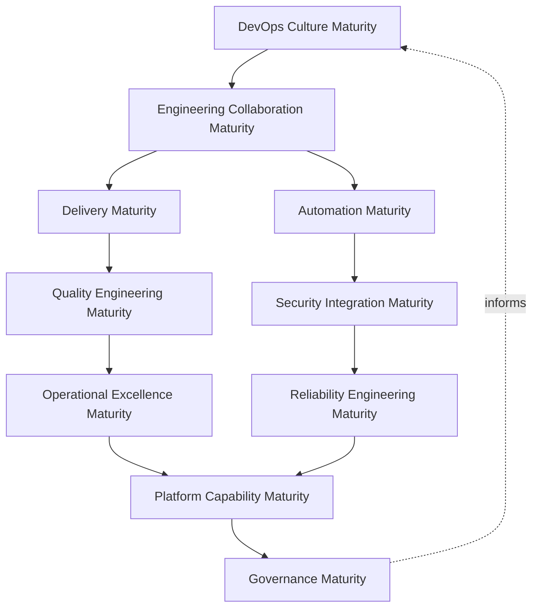
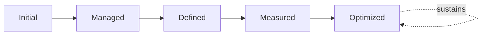
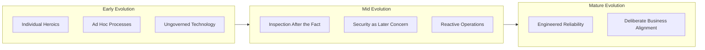
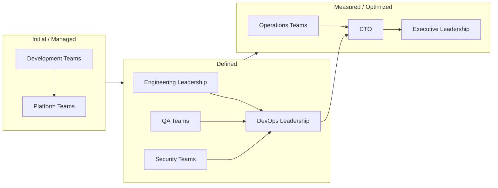
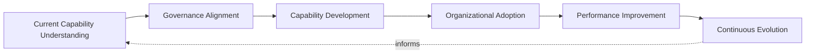

# Enterprise DevOps Maturity Framework

## 1. Executive Summary

**Purpose** — This document defines the official Enterprise DevOps Maturity Framework for **StackLeo Tech Store**. It establishes DevOps capability evolution, engineering excellence, delivery maturity, operational maturity, governance maturity, organizational capability, executive oversight, and continuous DevOps improvement as a deliberate, enterprise-wide discipline. Every governance document in `07_DEVOPS` already defines its own maturity model for its own domain — `devops-governance-framework.md` (DevOps governance maturity), `deployment-governance.md` (deployment maturity), `release-management-governance.md` (release maturity), `environment-governance.md` (environment maturity), `configuration-management-governance.md` (configuration maturity), `ci-cd-governance.md` (CI/CD maturity), and `deployment-risk-governance.md` (risk maturity). Each of those models remains authoritative within its own domain. This framework does not replace or restate any of them. It is the single, enterprise-wide capstone that establishes one authoritative five-level maturity scale and synthesizes those seven domain-specific pictures into a coherent understanding of StackLeo's overall DevOps capability — exactly as `08_QUALITY_ASSURANCE/quality-maturity-framework.md` does for quality maturity.

**Scope** — This framework applies to every DevOps capability domain at StackLeo — culture, engineering collaboration, delivery, automation, quality engineering, security integration, operational excellence, reliability engineering, platform capability, and governance — across the full engineering organization, from the current team through future global, multi-team engineering scale.

**Strategic Objectives** — To ensure StackLeo understands its overall DevOps capability as a single, honest enterprise picture; that capability evolution is pursued deliberately, never assumed to occur automatically; that engineering excellence is cultivated as a genuine, measured discipline; and that executive leadership has continuous visibility into DevOps maturity and its trajectory.

**Business Value** — A genuinely mature DevOps capability compounds into faster, safer delivery, a stronger engineering culture, and a platform that scales with the business rather than constraining it; this framework ensures that maturity is cultivated deliberately rather than left to chance.

**Intended Audience** — Executive leadership, the Chief Technology Officer, engineering leadership, DevOps leadership, platform, development, QA, security, and operations teams, and independent audit and oversight functions.

## 2. Enterprise DevOps Maturity Vision

- **DevOps as Organizational Capability** — DevOps maturity is treated as a genuine, cultivated organizational capability that compounds over time, never a static state achieved once and then assumed.
- **Engineering Excellence** — this framework gives Engineering Excellence its own dedicated maturity treatment, coordinated with `08_QUALITY_ASSURANCE/quality-maturity-framework.md` (Section 3.2), ensuring engineering practice maturity is measured with the same rigor as delivery and operational maturity.
- **Delivery Reliability** — DevOps maturity is measured in part by how reliably validated change reaches customers, coordinated with `ci-cd-governance.md` and `release-management-governance.md`.
- **Operational Excellence** — DevOps maturity extends beyond delivery into how reliably the platform is sustained once live, coordinated with `09_OPERATIONS/operational-excellence-framework.md`.
- **Business Agility** — this framework exists to ensure DevOps maturity makes StackLeo's ability to adapt to market opportunity a genuine, compounding organizational asset.
- **Customer Value** — every dimension of DevOps maturity is ultimately weighed against its genuine effect on the value delivered to the customer, consistent with `01_Business/vision.md`.
- **Continuous Evolution** — DevOps maturity is never treated as a final destination; it is pursued as an ongoing, deliberate evolution proportionate to the organization's growing scale and complexity.

### Enterprise DevOps Maturity Vision Matrix

| Vision Element | Focus | Business Value |
|---|---|---|
| DevOps as Organizational Capability | Maturity as a cultivated capability, not a static state | Ensures capability compounds rather than plateauing |
| Engineering Excellence | Dedicated maturity treatment for engineering practice | Measures engineering discipline with genuine rigor |
| Delivery Reliability | Maturity measured by how reliably change reaches customers | Connects maturity to genuine delivery outcome |
| Operational Excellence | Maturity extends to how reliably the platform is sustained | Connects maturity to genuine operational outcome |
| Business Agility | Maturity as a genuine, compounding organizational asset | Supports responsiveness to genuine business opportunity |
| Customer Value | Every dimension weighed against genuine customer effect | Keeps maturity connected to the trust-centered brand promise |
| Continuous Evolution | Maturity pursued as ongoing, never a final destination | Keeps capability aligned with growing scale and complexity |

## 3. DevOps Maturity Philosophy

DevOps maturity governance at StackLeo rests on eight principles, each producing a specific business outcome.

- **Continuous Improvement Over Perfection** — the organization pursues genuine, continuous evolution in DevOps capability rather than treating any fixed maturity level as a final destination. *Business Value:* keeps the organization oriented toward genuine, ongoing improvement rather than complacency.
- **Governance Before Optimization** — the accountability structure for maturity investment is established before specific optimization activity is undertaken. *Business Value:* ensures maturity investment exists because a genuine, governed decision called for it.
- **Business Alignment** — maturity investment decisions are made in service of genuine business priority, connecting to `01_Business/business-model.md`. *Business Value:* ensures limited maturity investment is directed toward what genuinely matters most.
- **Collaboration Culture** — maturity is pursued as a shared, cross-functional discipline, never the isolated responsibility of a single team. *Business Value:* prevents the erosion that occurs when every other function assumes maturity is someone else's job.
- **Automation Governance** — automation maturity is pursued deliberately, under genuine governance, coordinated with `ci-cd-governance.md` (Section 3). *Business Value:* ensures automation investment compounds into genuine capability, not hidden liability.
- **Reliability Mindset** — reliability is treated as a first-class dimension of maturity, coordinated with `sre-strategy.md`. *Business Value:* protects the operational trust every level of maturity ultimately serves.
- **Learning Organization** — every operating and delivery experience deepens the organization's genuine, collective understanding of how to operate better. *Business Value:* converts ordinary experience into a compounding source of organizational capability.
- **Sustainable Engineering** — maturity is pursued in a way that protects, rather than exhausts, engineering capacity and wellbeing. *Business Value:* ensures maturity gains are durable, not achieved at the cost of unsustainable practice.

### DevOps Maturity Philosophy Matrix

| Principle | Description | Business Value |
|---|---|---|
| Continuous Improvement Over Perfection | No fixed level treated as a final destination | Keeps the organization oriented toward ongoing improvement |
| Governance Before Optimization | Accountability established before optimization activity | Ensures investment exists because governance called for it |
| Business Alignment | Investment made in service of genuine business priority | Directs limited investment toward what matters most |
| Collaboration Culture | Maturity pursued as a shared, cross-functional discipline | Prevents erosion from assuming maturity is someone else's job |
| Automation Governance | Automation maturity pursued deliberately, under governance | Ensures automation compounds into capability, not liability |
| Reliability Mindset | Reliability treated as a first-class dimension of maturity | Protects the operational trust maturity ultimately serves |
| Learning Organization | Every experience deepens genuine collective understanding | Converts experience into compounding organizational capability |
| Sustainable Engineering | Maturity pursued without exhausting capacity or wellbeing | Ensures maturity gains are durable, not unsustainable |

## 4. Enterprise DevOps Maturity Domains

DevOps maturity is governed across ten conceptual domains, each requiring a distinct maturity emphasis. Domains already elaborated in dedicated documents are synthesized here at the enterprise level, not restated.

### DevOps Culture Maturity

- **Purpose** — govern the maturity of shared ownership, collaboration, and psychological safety across engineering.
- **Business Importance** — protects the cultural foundation every other maturity domain ultimately depends on.
- **Maturity Expectations** — culture maturity is expected to be genuinely lived, not merely stated as an aspiration.
- **Executive View** — leadership expects culture maturity to be honestly assessed, not assumed favorable by default.

### Engineering Collaboration Maturity

- **Purpose** — govern the maturity of how engineering, platform, security, quality, and operations functions coordinate.
- **Business Importance** — prevents the delay and quality erosion that occurs when functions operate without genuine coordination.
- **Maturity Expectations** — collaboration maturity is expected to extend across every function with a genuine stake in delivery.
- **Executive View** — leadership expects collaboration to be structured and governed, not incidental.

### Delivery Maturity

- **Purpose** — govern the enterprise synthesis of delivery maturity already defined in `ci-cd-governance.md` (Section 11) and `release-management-governance.md` (Section 11).
- **Business Importance** — protects confidence that validated change reaches customers reliably and predictably.
- **Maturity Expectations** — delivery maturity is understood as a trend across both CI/CD and release governance, not evaluated in isolation.
- **Executive View** — leadership expects delivery maturity to be visible as one coherent input to the enterprise picture.

### Automation Maturity

- **Purpose** — govern the maturity of how automation is pursued as a deliberate, sustainable investment.
- **Business Importance** — protects confidence that automation compounds into genuine capacity, not hidden maintenance burden.
- **Maturity Expectations** — automation maturity is expected to reflect sustainability, not only coverage volume.
- **Executive View** — leadership expects automation maturity to be governed, coordinated with `ci-cd-governance.md`.

### Quality Engineering Maturity

- **Purpose** — govern the enterprise synthesis of quality maturity already defined in `08_QUALITY_ASSURANCE/quality-maturity-framework.md`.
- **Business Importance** — protects confidence that quality capability genuinely strengthens over time.
- **Maturity Expectations** — quality engineering maturity is consumed as an input here, not restated in operational depth.
- **Executive View** — leadership expects quality maturity to be understood as genuinely connected to DevOps maturity overall.

### Security Integration Maturity

- **Purpose** — govern the maturity of how security is embedded into DevOps practice from the outset.
- **Business Importance** — protects StackLeo's core trust differentiator through continuous, embedded security discipline.
- **Maturity Expectations** — security integration maturity is governed jointly with, and never supersedes, `06_Security/security-governance.md`.
- **Executive View** — leadership expects security integration maturity to be assessed with the rigor security governance defines.

### Operational Excellence Maturity

- **Purpose** — govern the enterprise synthesis of operational excellence maturity, coordinated with `09_OPERATIONS/operational-excellence-framework.md` (Section 10).
- **Business Importance** — protects the operational reliability customers directly experience once the platform is live.
- **Maturity Expectations** — operational excellence maturity is consumed as an input here, not restated in operational depth.
- **Executive View** — leadership expects operational and delivery maturity to be understood as genuinely connected.

### Reliability Engineering Maturity

- **Purpose** — govern the maturity of engineered reliability discipline, coordinated with `sre-strategy.md`.
- **Business Importance** — protects the sustained trust customers place in the platform's dependability.
- **Maturity Expectations** — reliability engineering maturity is expected to be genuinely measured, not assumed from delivery speed.
- **Executive View** — leadership expects reliability maturity to be a first-class dimension of the enterprise picture.

### Platform Capability Maturity

- **Purpose** — govern the maturity of self-service platform capability, coordinated with `platform-engineering.md`.
- **Business Importance** — protects every team's ability to deliver with consistent, governed safety guarantees.
- **Maturity Expectations** — platform capability maturity is expected to make the governed path the path of least resistance.
- **Executive View** — leadership expects platform maturity to be genuinely consistent across every consuming team.

### Governance Maturity

- **Purpose** — govern the enterprise synthesis of the seven domain-specific governance maturity models already defined across `07_DEVOPS`.
- **Business Importance** — protects leadership's ability to understand overall governance maturity as a whole, not domain by domain.
- **Maturity Expectations** — governance maturity is expected to converge into one coherent enterprise picture, not seven disconnected assessments.
- **Executive View** — leadership expects one coherent governance maturity picture across every subordinate framework.

### Capability Domain Maturity Matrix

| Domain | Purpose | Business Importance | Executive View |
|---|---|---|---|
| DevOps Culture Maturity | Govern maturity of shared ownership and collaboration | Protects the cultural foundation every domain depends on | Expects culture maturity honestly assessed, not assumed |
| Engineering Collaboration Maturity | Govern maturity of cross-functional coordination | Prevents delay and erosion from disconnected functions | Expects collaboration structured and governed |
| Delivery Maturity | Synthesize CI/CD and release maturity into the enterprise picture | Protects confidence in reliable, predictable delivery | Expects visibility as one coherent input |
| Automation Maturity | Govern maturity of automation as a sustainable investment | Protects confidence automation compounds into capacity | Expects governance reflecting sustainability, not coverage alone |
| Quality Engineering Maturity | Synthesize QA maturity into the enterprise picture | Protects confidence quality capability strengthens over time | Expects understanding of quality's connection to DevOps maturity |
| Security Integration Maturity | Govern maturity of embedded security practice | Protects StackLeo's core trust differentiator | Expects assessment with rigor defined by security governance |
| Operational Excellence Maturity | Synthesize operational excellence maturity into the picture | Protects operational reliability customers experience | Expects understanding of operational and delivery connection |
| Reliability Engineering Maturity | Govern maturity of engineered reliability discipline | Protects sustained trust in platform dependability | Expects reliability as a first-class dimension |
| Platform Capability Maturity | Govern maturity of self-service platform capability | Protects consistent, governed delivery for every team | Expects genuine consistency across consuming teams |
| Governance Maturity | Synthesize seven domain governance maturity models | Protects understanding of governance maturity as a whole | Expects one coherent picture, not seven disconnected assessments |

*Diagram 1: Enterprise DevOps Maturity Framework — culture and collaboration maturity inform delivery and automation maturity, converging through quality, security, and operational excellence maturity on reliability and platform capability maturity, resolving into governance maturity that feeds back into the model.*

## 5. Enterprise DevOps Maturity Model

DevOps maturity at StackLeo is described across five conceptual levels — the single, authoritative scale every domain-specific maturity model in `07_DEVOPS` and `08_QUALITY_ASSURANCE` maps onto.

### Level 1 — Initial

- **Ad-hoc practices** — delivery and operational practice varies by individual and team, with no consistent, governed pattern.
- **Limited governance** — where governance exists, it is informal and inconsistently applied.
- **Reactive operations** — problems are addressed only once they become visible, not anticipated.
- **Individual dependency** — capability depends heavily on specific individuals rather than genuinely shared, durable practice.

### Level 2 — Managed

- **Basic standards** — foundational standards exist for individual capability domains, though consistency varies.
- **Defined ownership** — accountability for key capability domains is assigned, though not yet uniformly enforced.
- **Improved collaboration** — cross-functional coordination begins to occur deliberately rather than incidentally.
- **Emerging governance** — governance structures are established but not yet consistently applied across every domain.

### Level 3 — Defined

- **Standardized practices** — practice is standardized, documented, and consistently applied across the organization.
- **Organizational alignment** — capability domains operate in genuine alignment with one another, not in isolation.
- **Consistent delivery approach** — the same governed delivery pattern applies regardless of team or capability.
- **Formal governance** — the governance model, domains, and lifecycle defined throughout this framework and its subordinate documents are consistently exercised.

### Level 4 — Measured

- **Data-driven improvement** — improvement decisions are grounded in genuine, quantitative evidence rather than qualitative impression.
- **Performance visibility** — capability performance is continuously visible to accountable owners and executive leadership alike.
- **Predictable operations** — operational and delivery outcomes are genuinely predictable, forecast with confidence grounded in accumulated evidence.
- **Continuous optimization** — improvement is pursued as an ongoing, deliberate discipline, not an occasional initiative.

### Level 5 — Optimized

- **Engineering excellence** — engineering discipline is genuinely and continuously excellent, not merely adequate.
- **Intelligent operations** — operational and delivery decisions are informed by intelligent analysis of accumulated evidence.
- **Adaptive governance** — governance itself adapts deliberately to genuinely new capability domains and organizational models.
- **Continuous innovation** — the organization actively and deliberately seeks genuinely better ways of operating, not merely maintaining its current state.

### DevOps Maturity Model Matrix

| Level | Characteristics | Primary Focus |
|---|---|---|
| Initial | Ad-hoc practices, limited governance, reactive operations, individual dependency | Ad hoc, individually-dependent DevOps practice |
| Managed | Basic standards, defined ownership, improved collaboration, emerging governance | Domain-level consistency beginning to form |
| Defined | Standardized practices, organizational alignment, consistent delivery, formal governance | Organization-wide consistency and clear ownership |
| Measured | Data-driven improvement, performance visibility, predictable operations, continuous optimization | Evidence-based DevOps maturity decisions |
| Optimized | Engineering excellence, intelligent operations, adaptive governance, continuous innovation | Sustained, deliberate improvement as a discipline |

*Diagram 6: DevOps Maturity Progression — maturity advances from ad-hoc, individually-dependent practice through managed and defined consistency toward measured, evidence-based, and continuously optimized DevOps capability.*

## 6. DevOps Capability Evolution

Capability evolves conceptually across eight dimensions as the organization advances through the maturity levels defined in Section 5.

- **Culture** — evolves from individual heroics toward genuinely shared, psychologically safe collaboration.
- **Processes** — evolves from ad hoc, team-specific activity toward standardized, consistently governed practice.
- **Technology Governance** — evolves from ungoverned tool adoption toward deliberate, accountable technology decisions.
- **Quality** — evolves from inspection after the fact toward quality genuinely built in from the outset.
- **Security** — evolves from a separate, later concern toward security embedded from the outset of every capability.
- **Operations** — evolves from reactive firefighting toward proactive, engineered reliability.
- **Reliability** — evolves from assumed dependability toward genuinely engineered, measured reliability.
- **Business Alignment** — evolves from disconnected technical activity toward capability deliberately aligned with genuine business priority.

### Governance Evolution Matrix

| Dimension | Initial State | Evolved State |
|---|---|---|
| Culture | Individual heroics | Genuinely shared, psychologically safe collaboration |
| Processes | Ad hoc, team-specific activity | Standardized, consistently governed practice |
| Technology Governance | Ungoverned tool adoption | Deliberate, accountable technology decisions |
| Quality | Inspection after the fact | Quality genuinely built in from the outset |
| Security | Separate, later concern | Embedded from the outset of every capability |
| Operations | Reactive firefighting | Proactive, engineered reliability |
| Reliability | Assumed dependability | Genuinely engineered, measured reliability |
| Business Alignment | Disconnected technical activity | Capability deliberately aligned with business priority |

*Diagram 2: DevOps Capability Evolution Model — capability evolves from early-stage individual dependency and ungoverned practice, through mid-stage embedding of quality, security, and proactive operations, toward mature, engineered reliability genuinely aligned with business priority.*

## 7. Organizational Governance

Maturity ownership is distributed deliberately across nine organizational roles.

- **Executive Leadership** — holds ultimate accountability for whether DevOps maturity is genuinely cultivated as an enterprise capability.
- **CTO** — owns the coherence and enforcement of this framework's maturity model across every domain it defines.
- **Engineering Leadership** — owns Engineering Collaboration and Culture Maturity (Section 4) within their accountable teams.
- **DevOps Leadership** — owns the synthesis of Delivery, Automation, and Governance Maturity (Section 4) in coordination with `devops-governance-framework.md`.
- **Platform Teams** — own Platform Capability Maturity (Section 4), making governed practice the default path for every team.
- **Development Teams** — own their contribution to Delivery and Automation Maturity (Section 4) within their assigned capability.
- **QA Teams** — own Quality Engineering Maturity (Section 4) in coordination with `08_QUALITY_ASSURANCE/quality-maturity-framework.md`.
- **Security Teams** — own Security Integration Maturity (Section 4) jointly with `06_Security/security-governance.md`, which remains authoritative for security-specific obligations.
- **Operations Teams** — own Operational Excellence and Reliability Engineering Maturity (Section 4) in coordination with `09_OPERATIONS/operational-excellence-framework.md` and `sre-strategy.md`.

### Organizational Responsibility Matrix

| Role | Maturity Ownership | Business Value |
|---|---|---|
| Executive Leadership | Hold ultimate accountability for genuinely cultivated maturity | Provides a single point of ultimate accountability |
| CTO | Own coherence and enforcement of this framework's maturity model | Provides a single point of specialist accountability |
| Engineering Leadership | Own engineering collaboration and culture maturity | Embeds maturity closest to where engineering occurs |
| DevOps Leadership | Own synthesis of delivery, automation, and governance maturity | Provides specialist accountability for cross-domain synthesis |
| Platform Teams | Own platform capability maturity | Makes governed practice the default path for every team |
| Development Teams | Own their contribution to delivery and automation maturity | Embeds accountability closest to where capability is built |
| QA Teams | Own quality engineering maturity | Keeps quality maturity genuinely connected to DevOps maturity |
| Security Teams | Own security integration maturity jointly with security governance | Ensures security embedding is genuinely measured |
| Operations Teams | Own operational excellence and reliability engineering maturity | Ensures accountability extends beyond delivery into operation |

*Diagram 3: Organizational DevOps Maturity Journey — as maturity advances from initial, team-level practice through defined cross-functional coordination toward measured, executive-visible capability, organizational engagement widens from individual teams to the CTO and executive leadership.*

## 8. Executive Oversight

- **DevOps Capability Reviews** — the overall coherence of this framework and its enterprise maturity picture is formally reviewed on a regular cadence.
- **Engineering Excellence Reviews** — the organization's engineering excellence maturity is reviewed directly with executive leadership, coordinated with `08_QUALITY_ASSURANCE/quality-maturity-framework.md`.
- **Delivery Performance Reviews** — delivery maturity, synthesized from `ci-cd-governance.md` and `release-management-governance.md`, is reviewed with executive leadership.
- **Operational Maturity Reviews** — operational and reliability engineering maturity is reviewed as a distinct, ongoing concern.
- **Strategic Improvement Reviews** — the organization's follow-through on captured maturity improvement lessons is reviewed directly with executive leadership.

### Executive Oversight Matrix

| Oversight Mechanism | Purpose | Governance Role |
|---|---|---|
| DevOps Capability Reviews | Confirm overall framework and enterprise maturity picture coherence | Regular, predictable cadence for the framework as a whole |
| Engineering Excellence Reviews | Review engineering excellence maturity | Coordinated with `08_QUALITY_ASSURANCE/quality-maturity-framework.md` |
| Delivery Performance Reviews | Review synthesized delivery maturity | Direct executive-level review of delivery capability |
| Operational Maturity Reviews | Review operational and reliability maturity | Treats maturity as ongoing, not assumed static |
| Strategic Improvement Reviews | Review follow-through on captured lessons | Direct executive-level review of improvement completion |

## 9. Future Readiness

This framework is designed to remain valid as StackLeo evolves in scale, geography, and organizational complexity.

- **AI-Assisted DevOps** — as delivery and operational practice increasingly incorporate AI-assisted methods, they remain governed under the same maturity model as any other method.
- **Intelligent Operations** — where operational decision-making increasingly draws on intelligent pattern analysis, that analysis remains subject to the same Level 4–5 evidence-based rigor defined in Section 5.
- **Autonomous Engineering (Conceptual)** — where automation increasingly performs steps within delivery or operational practice, that automation remains subject to the same ownership and executive oversight as any human-performed activity.
- **Platform Engineering Evolution** — as self-service platform capability matures into a genuinely internal developer platform, Platform Capability Maturity (Section 4) extends coherently without requiring redefinition.
- **Enterprise Scale** — the maturity model, domains, and evolution defined throughout this framework are defined independently of organizational size.
- **Global Engineering Organizations** — Organizational Governance (Section 7) is structured to remain coherent as engineering scales into distributed, multi-region teams supporting StackLeo's expansion beyond Bangladesh.
- **Digital Transformation** — this framework's maturity discipline is treated as a direct enabler of digital transformation, ensuring transformation proceeds deliberately rather than chaotically.

## 10. DevOps Maturity Improvement Journey

Maturity improvement is pursued across six conceptual stages, applicable to every domain in Section 4.

- **Current Capability Understanding** — the organization honestly assesses its genuine current maturity level across every domain before pursuing improvement.
- **Governance Alignment** — an identified capability gap is aligned to the appropriate governance layer across this framework's subordinate documents.
- **Capability Development** — the organization deliberately builds the capability required to advance to the next maturity level.
- **Organizational Adoption** — developed capability is genuinely adopted across every team and function it applies to, not confined to a pilot group.
- **Performance Improvement** — the organization confirms, through genuine evidence, that adopted capability produced the intended maturity advancement.
- **Continuous Evolution** — the cycle repeats, informed by what was learned, keeping maturity improvement a genuinely ongoing discipline.

### Continuous Improvement Matrix

| Stage | Purpose | Business Value |
|---|---|---|
| Current Capability Understanding | Honestly assess genuine current maturity | Ensures improvement rests on genuine understanding |
| Governance Alignment | Align a capability gap to the appropriate governance layer | Ensures gaps addressed by the genuinely accountable function |
| Capability Development | Deliberately build capability for the next level | Ensures maturity advancement is a deliberate investment |
| Organizational Adoption | Ensure developed capability is genuinely adopted broadly | Prevents maturity gains confined to an isolated pilot group |
| Performance Improvement | Confirm genuine evidence of maturity advancement | Ensures maturity claims rest on genuine evidence |
| Continuous Evolution | Repeat the cycle, informed by what was learned | Keeps maturity improvement a genuinely ongoing discipline |

*Diagram 4: Continuous DevOps Improvement Cycle — capability understanding and governance alignment inform deliberate capability development, adopted organization-wide and confirmed through genuine performance improvement, with continuous evolution feeding lessons back into the cycle.*

## 11. DevOps Maturity Anti-Patterns

- **Tool-Driven Transformation** — pursuing maturity by adopting tools rather than genuinely governed practice mistakes activity for genuine capability advancement.
- **DevOps Without Culture Change** — pursuing process and technical maturity without genuine cultural evolution leaves the underlying collaboration gaps this framework exists to close unaddressed.
- **Automation Without Governance** — automating delivery or operational practice without genuine governance accelerates the rate at which ungoverned practice produces consequence.
- **Siloed Teams** — teams that operate without genuine cross-functional coordination reproduce the delay and quality erosion DevOps exists to eliminate.
- **Ignoring Operations** — treating maturity as a delivery-only concern, neglecting Operational Excellence and Reliability Engineering Maturity (Section 4), leaves the platform's sustained reliability unaddressed.
- **Weak Ownership** — a maturity domain with no accountable owner has no one genuinely responsible for its advancement.
- **Short-Term Optimization** — pursuing maturity gains that trade away sustainable practice for immediate, visible results undermines Sustainable Engineering (Section 3).
- **No Continuous Learning** — treating current maturity as a permanently finished state guarantees capability falls behind the organization's growing scale and complexity.

### Anti-Pattern Summary

| Anti-Pattern | Business Impact |
|---|---|
| Tool-Driven Transformation | Mistakes activity for genuine capability advancement |
| DevOps Without Culture Change | Leaves underlying collaboration gaps unaddressed |
| Automation Without Governance | Accelerates the rate ungoverned practice produces consequence |
| Siloed Teams | Reproduces the delay and quality erosion DevOps exists to eliminate |
| Ignoring Operations | Leaves the platform's sustained reliability unaddressed |
| Weak Ownership | Leaves no one genuinely responsible for a domain's advancement |
| Short-Term Optimization | Trades away sustainable practice for immediate, visible results |
| No Continuous Learning | Guarantees capability falls behind growing scale and complexity |

## 12. Relationship With Other Governance Frameworks

This framework is the enterprise-wide maturity synthesis point for every governance framework in `07_DEVOPS`, and coordinates with quality maturity governed in `08_QUALITY_ASSURANCE`.

- **Deployment Strategy** (`deployment-strategy.md`, `deployment-governance.md`) — provides the deployment maturity model this framework synthesizes into Delivery Maturity (Section 4).
- **Release Governance** (`release-management-governance.md`) — provides the release maturity model this framework synthesizes into Delivery Maturity (Section 4).
- **Environment Governance** (`environment-governance.md`) — provides the environment maturity model this framework synthesizes into Platform Capability Maturity (Section 4).
- **Configuration Governance** (`configuration-management-governance.md`) — provides the configuration maturity model this framework synthesizes into Governance Maturity (Section 4).
- **CI/CD Governance** (`ci-cd-governance.md`) — provides the CI/CD maturity model this framework synthesizes into Delivery and Automation Maturity (Section 4).
- **Security Governance** (`06_Security/security-governance.md`) — remains authoritative for security-specific obligations that Security Integration Maturity (Section 4) is measured against.
- **Quality Governance** (`08_QUALITY_ASSURANCE/quality-maturity-framework.md`) — the sibling enterprise-wide capstone this framework coordinates with for Quality Engineering Maturity (Section 4).
- **Operations Governance** (`09_OPERATIONS/operational-excellence-framework.md`) — provides the operational excellence maturity model this framework synthesizes into Operational Excellence Maturity (Section 4).

```mermaid
flowchart TD
    DevOpsMaturity[DevOps Maturity Framework] --> DeployGov[Deployment Governance]
    DevOpsMaturity --> RelGov[Release Management Governance]
    DevOpsMaturity --> EnvGov[Environment Governance]
    DevOpsMaturity --> ConfigGov[Configuration Management Governance]
    DevOpsMaturity --> CICDGov[CI/CD Governance]
    DevOpsMaturity --> RiskGov[Deployment Risk Governance]
    DevOpsMaturity -.coordinates with.-> QualityMaturity[Quality Maturity Framework]
    DevOpsMaturity -.coordinates with.-> SecGov[Security Governance]
    DevOpsMaturity -.coordinates with.-> OpsExcellence[Operational Excellence Framework]
    DeployGov -.contributes maturity model.-> DevOpsMaturity
    RelGov -.contributes maturity model.-> DevOpsMaturity
    EnvGov -.contributes maturity model.-> DevOpsMaturity
    ConfigGov -.contributes maturity model.-> DevOpsMaturity
    CICDGov -.contributes maturity model.-> DevOpsMaturity
    RiskGov -.contributes maturity model.-> DevOpsMaturity
```

*Diagram 5: DevOps Governance Relationship Model — this framework synthesizes the maturity models contributed by every governance framework in `07_DEVOPS`, while coordinating with the sibling quality maturity, security, and operational excellence frameworks that sit alongside it.*

## 13. Document Information

| Property | Value |
|---|---|
| Document | devops-maturity-framework.md |
| Version | 1.0.0 |
| Status | Active |
| Maintained By | StackLeo |
| Last Updated | 2026-07-24 |

---

© StackLeo. All Rights Reserved.
