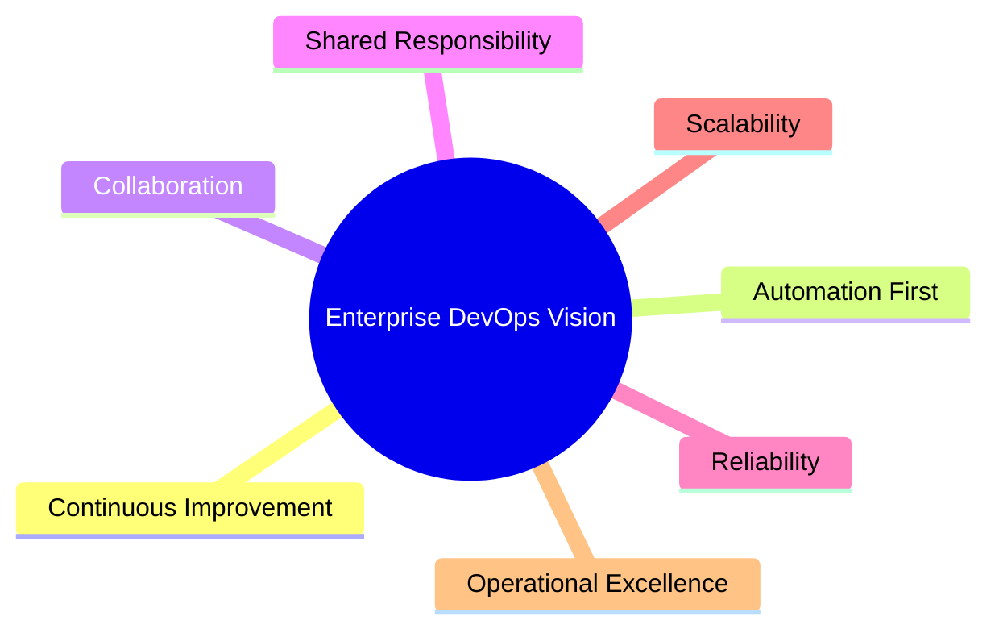
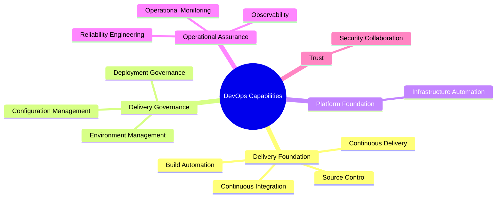
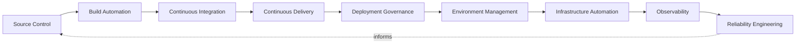
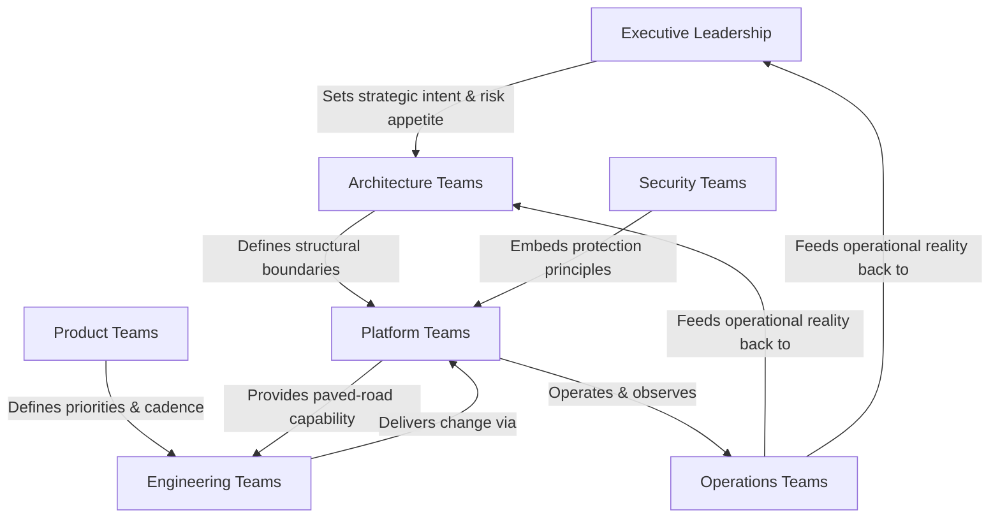
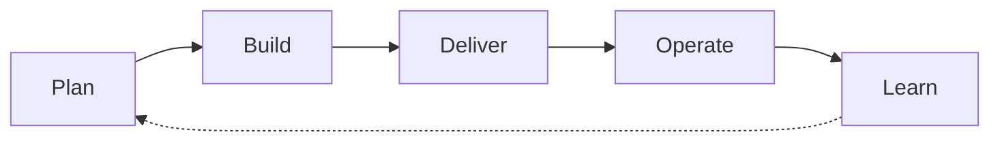

# DevOps Overview

## 1. Executive Summary

DevOps at **StackLeo** is the discipline that converts architectural intent and product ambition into a running, trustworthy platform — repeatedly, safely, and at the pace the business requires. It is not a team, a tool, or a phase of a project; it is the connective practice between deciding what to build and reliably operating it in production for customers across Bangladesh and, over time, South Asia and beyond.

- **Purpose of DevOps** — to ensure that every unit of engineering effort reaches customers as a working, observable, recoverable capability, with the shortest responsible lead time and the lowest responsible risk. DevOps exists to make delivery a solved, repeatable problem, so that competitive advantage is decided by what StackLeo builds, not by how reliably it can ship what it builds.
- **Relationship with Enterprise Architecture** — DevOps is the operational elaboration of the architecture defined in `03_System_Design`. Architecture decides what the platform is and why it is shaped that way; DevOps decides how that platform is continuously built, delivered, and kept running consistent with those decisions. Where architecture and delivery practice diverge, delivery practice must yield to architecture, and architecture must be informed by what delivery practice learns in production.
- **Relationship with Software Engineering** — DevOps does not own application logic or product behavior; engineering does. DevOps owns the shared path every engineering team's work travels through — source control, integration, delivery, and operation — so that individual teams do not each re-solve delivery as a side effect of building features.
- **Relationship with Platform Engineering** — Platform Engineering is how DevOps practice is made consumable at scale: durable, self-service, paved-road capability that lets product and engineering teams move quickly without re-deriving delivery, environment, or operational discipline for every new service.
- **Relationship with Security** — DevOps and security are a single continuous concern, not two sequential ones. Security, defined authoritatively in `06_Security`, determines what must be protected and why; DevOps determines how that protection is embedded into every pipeline, environment, and operational surface, consistent with `06_Security/security-principles.md`.
- **Relationship with Business Agility** — StackLeo's business model spans direct consumer retail today and, over time, business sales, corporate accounts, wholesale, and a multi-vendor marketplace, delivered across web and, in future, mobile, physical, and point-of-sale channels. Each of these is a business decision that depends on engineering being able to deliver, adapt, and recover quickly. DevOps is the mechanism by which business agility becomes an engineering reality rather than a stated intention.

This document is implementation-independent and vendor-neutral. It defines DevOps vision, philosophy, operating model, and governance — not specific tools, pipelines, or infrastructure configurations.

## 2. DevOps Vision

StackLeo's DevOps vision is built on seven commitments:

- **Continuous Improvement** — delivery and operational practice are never considered finished; they are expected to mature deliberately as the platform, team, and business scale.
- **Automation First** — repeatable, well-understood work is automated by default; human judgment is reserved for decisions that genuinely require it, not consumed by toil.
- **Collaboration** — delivery and reliability are achieved through continuous collaboration between product, engineering, platform, security, and operations, not through handoffs between isolated stages.
- **Shared Responsibility** — the reliability and security of what is shipped is owned jointly by everyone who contributes to it, from the author of a change through to the team that operates it in production.
- **Reliability** — the platform behaves consistently and predictably under real-world conditions, and deviations from that behavior are treated as first-class engineering signals.
- **Scalability** — delivery and operational practice are designed to absorb growth in traffic, team size, and business complexity without requiring re-architecture of how the platform is built and run.
- **Operational Excellence** — day-to-day operation of the platform is treated as a discipline in its own right, measured deliberately rather than assumed to be adequate by default.

*Diagram 1: Enterprise DevOps Vision — the seven commitments that define what "good" means for delivery and operations at StackLeo.*

## 3. DevOps Philosophy

The following philosophical commitments shape how every DevOps capability in this document is designed and practiced:

- **Culture over Tools** — no tool substitutes for shared ownership, trust, and communication between teams. Tools are chosen to serve the culture described in this document; the culture is never redefined to accommodate a tool.
- **Shift Left** — quality, security, and operability are considered from the moment a capability is conceived, not inspected in after the fact. The earlier a problem is found, the cheaper it is to correct.
- **Feedback Loops** — every stage of building and running the platform is designed to surface information quickly, so teams learn from real behavior rather than assumption.
- **Continuous Delivery Mindset** — software is kept in a state where it could be released at any time; releasing is a routine, low-risk event rather than a rare, high-ceremony one.
- **Resilience by Design** — systems are built expecting failure to occur, with detection, containment, and recovery designed in from the start rather than bolted on after an incident.
- **Platform Thinking** — recurring delivery and operational needs are solved once, as reusable, self-service capability, rather than repeatedly and inconsistently by each team that encounters them.

## 4. Core DevOps Capabilities

DevOps at StackLeo is expressed through twelve core capabilities. Each is described below by its purpose, the business value it protects or creates, and the strategic objective it exists to serve.

### Source Control

- **Purpose** — provide a single, trustworthy record of how the platform's code, configuration, and infrastructure definitions change over time.
- **Business Value** — protects institutional knowledge and makes every change attributable, reviewable, and reversible.
- **Strategic Objective** — establish the foundation every other delivery capability depends on.

### Build Automation

- **Purpose** — transform source into a consistent, verifiable, deployable artifact without manual, person-dependent steps.
- **Business Value** — removes variance and human error from the earliest stage of delivery, reducing defects that would otherwise surface later and cost more.
- **Strategic Objective** — make "it builds the same way every time" a guarantee, not an aspiration.

### Continuous Integration

- **Purpose** — merge and validate change frequently, so integration problems are found in minutes rather than discovered weeks later.
- **Business Value** — reduces the cost and risk of combining work from multiple engineers and teams.
- **Strategic Objective** — keep the codebase in a continuously releasable state.

### Continuous Delivery

- **Purpose** — ensure every validated change is capable of being released to production with minimal additional effort.
- **Business Value** — converts releasing from a risky, infrequent event into a routine business capability that can respond to market need on demand.
- **Strategic Objective** — decouple "ready to release" from "released," giving the business control over timing without engineering becoming the bottleneck.

### Deployment Governance

- **Purpose** — ensure that what reaches production is authorized, traceable, and consistent with organizational risk tolerance.
- **Business Value** — protects the business from unreviewed or unauthorized change reaching customers.
- **Strategic Objective** — make control and speed complementary rather than opposing forces.

### Environment Management

- **Purpose** — define and protect the distinct purposes of development, staging, and production environments, and the boundaries between them.
- **Business Value** — prevents unvalidated change and unmanaged risk from reaching customers.
- **Strategic Objective** — give engineering a safe, representative path to validate change before it matters commercially.

### Configuration Management

- **Purpose** — define application and environment behavior declaratively and consistently, separate from code.
- **Business Value** — reduces environment drift and configuration-related incidents, a leading cause of avoidable outages.
- **Strategic Objective** — make environment behavior predictable and reproducible at any scale.

### Infrastructure Automation

- **Purpose** — define and provision the platform's runtime foundation through versioned, reviewed, repeatable definitions.
- **Business Value** — removes manual infrastructure work as a source of inconsistency, delay, and undocumented risk.
- **Strategic Objective** — treat infrastructure with the same rigor, review, and history as application code.

### Observability

- **Purpose** — make the internal behavior of the platform understandable from its external outputs.
- **Business Value** — reduces the time between a problem occurring and a problem being understood, directly protecting customer experience.
- **Strategic Objective** — ensure the platform's true state is always knowable, not inferred or assumed.

### Reliability Engineering

- **Purpose** — engineer the platform to sustain consistent, trustworthy behavior under real operating conditions, including failure.
- **Business Value** — protects revenue, customer trust, and brand reputation, all of which depend directly on the platform being available and correct.
- **Strategic Objective** — treat reliability as an engineered outcome, not a byproduct of good intentions.

### Security Collaboration

- **Purpose** — embed the protection principles defined in `06_Security` directly into delivery and operational practice.
- **Business Value** — prevents security from becoming a late-stage blocker or an afterthought that is discovered only through incidents.
- **Strategic Objective** — make secure delivery the default path, not an exception process.

### Operational Monitoring

- **Purpose** — continuously compare actual platform and business behavior against expected behavior.
- **Business Value** — enables proactive response to degradation before customers are meaningfully affected.
- **Strategic Objective** — ensure operational awareness is continuous, not dependent on customer-reported failure.

*Diagram 2: DevOps Capability Map — the twelve core capabilities, grouped by the delivery function they serve.*

*Diagram 3: Continuous Delivery Ecosystem — the conceptual flow of change from source through governed delivery into an observed, reliability-engineered runtime, with operational learning flowing back into future change.*

### Core DevOps Capability Matrix

| Capability | Purpose | Business Value |
|---|---|---|
| Source Control | Trustworthy record of how the platform changes over time | Attributable, reviewable, reversible change |
| Build Automation | Consistent, verifiable artifact creation | Removes variance and human error early |
| Continuous Integration | Frequent merge and validation of change | Reduces cost and risk of combining work |
| Continuous Delivery | Change is always release-ready | Converts release into a routine business capability |
| Deployment Governance | Authorized, traceable production change | Protects against unreviewed or unauthorized change |
| Environment Management | Defined, protected environment purposes | Prevents unvalidated risk reaching customers |
| Configuration Management | Declarative, consistent behavior definition | Reduces drift and configuration-related incidents |
| Infrastructure Automation | Versioned, repeatable infrastructure provisioning | Removes manual infrastructure risk and delay |
| Observability | Understandable internal system behavior | Reduces time between problem and understanding |
| Reliability Engineering | Engineered, consistent platform behavior | Protects revenue, trust, and brand reputation |
| Security Collaboration | Embedded protection principles in delivery | Prevents late-stage security blockers |
| Operational Monitoring | Continuous comparison of actual vs. expected behavior | Enables proactive response before customer impact |

## 5. DevOps Operating Model

DevOps at StackLeo functions as a conceptual collaboration model spanning seven groups, none of which owns delivery or reliability in isolation:

- **Product Teams** — define what capability is needed and the priority and cadence at which it should reach customers.
- **Engineering Teams** — build application capability within the shared delivery path, and remain accountable for what they build once it is operating in production.
- **Platform Teams** — provide the self-service delivery, environment, and infrastructure capability that engineering teams build on, reducing duplicated effort across the organization.
- **Security Teams** — define the protection principles delivery and operational practice must embed, and validate that embedding is genuine rather than nominal.
- **Operations Teams** — execute day-to-day monitoring, incident response, and operational discipline against the reliability targets this practice defines.
- **Architecture Teams** — define the structural boundaries and quality attributes DevOps practice must operate within, and absorb operational learning back into architectural decisions.
- **Executive Leadership** — sets strategic intent and risk appetite, and depends on DevOps practice to convert that intent into delivered, reliable business capability.

*Diagram 4: DevOps Operating Model — strategic intent flows down into structural and delivery decisions; operational reality flows back up to inform architecture and leadership.*

### DevOps Operating Model Matrix

| Team | Role in DevOps | Primary Interface |
|---|---|---|
| Product Teams | Defines priority, scope, and release cadence | Engineering & Executive Leadership |
| Engineering Teams | Builds capability within the shared delivery path | Platform & Product Teams |
| Platform Teams | Provides self-service delivery and infrastructure capability | Engineering, Security, Operations |
| Security Teams | Defines and validates embedded protection principles | Platform & Engineering Teams |
| Operations Teams | Executes monitoring, response, and operational discipline | Platform & Architecture Teams |
| Architecture Teams | Defines structural boundaries and absorbs operational learning | Executive Leadership & Platform Teams |
| Executive Leadership | Sets strategic intent and risk appetite | Architecture & Product Teams |

## 6. Enterprise DevOps Principles

- **Standardization** — common, well-understood patterns are used for source control, delivery, and environments across teams, so capability is transferable and onboarding is fast.
- **Automation** — automation is the default response to repeatable work; manual steps require deliberate justification, not the reverse.
- **Repeatability** — the same input, delivery path, or environment definition produces the same outcome every time, regardless of who or what initiates it.
- **Reliability** — the platform's behavior is engineered and measured to be consistent, not assumed to be adequate because failures have not yet occurred.
- **Auditability** — every change to code, configuration, or infrastructure is traceable to its author, its reason, and its approval, consistent with `06_Security/security-governance.md`.
- **Continuous Learning** — operational and delivery outcomes, including failures, are treated as a source of improvement, not merely as incidents to be closed.

*Diagram 5: Continuous Improvement Cycle — delivery and operational practice form a closed loop; what is learned from operating the platform directly informs what is planned next.*

## 7. Future Readiness

DevOps practice at StackLeo is deliberately structured to remain valid as the platform's technical and business scope grows:

- **Cloud-Native Platforms** — delivery and infrastructure principles are defined independent of any specific provider, so the platform can adopt elastic, provider-hosted infrastructure without redefining how it is built or run.
- **Microservices** — source control, delivery, and environment principles are structured to support an increasing number of independently deployable capabilities without fragmenting delivery discipline.
- **Event-Driven Systems** — observability and reliability principles extend naturally to asynchronous, event-driven interactions as the platform's architecture evolves beyond direct request/response patterns.
- **AI Platforms** — AI-assisted capability is delivered, versioned, and observed through the same delivery and operational discipline as any other system capability, avoiding a parallel, inconsistent practice.
- **Marketplace Platform** — StackLeo's evolution from direct-to-consumer retail toward business sales, corporate accounts, wholesale, and a multi-vendor marketplace introduces new actor classes and integration surfaces; delivery and environment principles are structured to onboard them without redefinition.
- **Multi-Region Operations** — as new sales channels — mobile application, physical store, and point-of-sale — and new currencies beyond BDT are introduced, environment and configuration principles are structured to absorb regional and channel variation without disrupting the core delivery path.
- **Global Expansion** — as StackLeo grows from Bangladesh into South Asia and, over time, global markets, this document's vision and principles remain jurisdiction- and scale-agnostic, allowing region-specific delivery and operational detail to layer on beneath a stable foundation.

### Future Readiness Matrix

| Future Dimension | Readiness Focus | Depends On |
|---|---|---|
| Cloud-Native Platforms | Provider-independent delivery and infrastructure principles | Infrastructure Automation |
| Microservices | Delivery discipline that scales with service count | Source Control, Continuous Delivery |
| Event-Driven Systems | Observability extended to asynchronous interactions | Observability, Reliability Engineering |
| AI Platforms | Consistent delivery discipline for AI-assisted capability | Continuous Delivery, Observability |
| Marketplace Platform | Onboarding of new business and seller actor classes | Deployment Governance, Security Collaboration |
| Multi-Region Operations | Channel and currency variation absorbed without disruption | Environment Management, Configuration Management |
| Global Expansion | Jurisdiction- and scale-agnostic foundational principles | All Core Capabilities |

## 8. Governance

- **Ownership** — a designated DevOps / Platform Engineering lead owns the coherence, currency, and enforcement of DevOps principles across the organization.
- **Review Process** — significant delivery, infrastructure, and platform decisions are reviewed against the principles in this document before adoption, consistent with the review discipline in `03_System_Design/architecture-decisions.md`.
- **Architecture Alignment** — DevOps practice is continuously reconciled with the architectural principles defined in `03_System_Design`, so operational reality and architectural intent do not drift apart unnoticed.
- **Policy Management** — operational delivery policies are derived from this document's principles and maintained as living references, reviewed on a defined cadence rather than left static.
- **Continuous Improvement** — DevOps practice itself is subject to the continuous improvement principle it defines; governance exists to ensure that improvement is deliberate and tracked, not incidental.

### Governance Responsibility Matrix

| Governance Area | Owner | Accountable For |
|---|---|---|
| Ownership | DevOps / Platform Engineering Lead | Coherence and enforcement of DevOps principles |
| Review Process | Architecture & Platform Teams | Evaluating delivery and infrastructure decisions before adoption |
| Architecture Alignment | Architecture Teams | Reconciling operational reality with architectural intent |
| Policy Management | Platform Teams | Keeping delivery policy current and living |
| Continuous Improvement | All Teams (shared) | Tracking and acting on operational and delivery learning |

## 9. Anti-Patterns

The following patterns are recognized failure modes and are deliberately excluded from StackLeo's DevOps practice:

- **Tool-First Mindset** — selecting or mandating tools before agreeing on principles and desired outcomes. This produces practice shaped by tool limitations rather than business need, and creates costly rework when the tool is later replaced.
- **Manual Operations** — relying on manual, person-dependent steps for repeatable delivery or operational work. This introduces variance, human error, and single points of failure tied to specific individuals' availability and memory.
- **Siloed Teams** — treating development, security, and operations as sequential, disconnected stages. This delays feedback, pushes problems to the most expensive point of discovery, and erodes shared accountability.
- **Weak Automation** — automating inconsistently or only for convenient cases, leaving critical paths manual. This creates a false sense of reliability while the highest-risk work remains the least protected.
- **Poor Feedback Loops** — allowing significant delay between an action and knowledge of its consequence. This slows learning, allows small problems to compound, and disconnects engineering decisions from their real-world effect.
- **Weak Governance** — allowing delivery and infrastructure change to proceed without consistent review or traceability. This exposes the business to unauthorized, unreviewed risk and undermines auditability.
- **Reactive Operations** — operating the platform only in response to customer-reported failure, rather than through proactive observability and monitoring. This means customers routinely discover problems before the organization does.
- **No Continuous Improvement** — treating current delivery and operational practice as a fixed, finished state. This guarantees that practice falls behind the platform's growing scale and complexity over time.

### Anti-Pattern Summary

| Anti-Pattern | Why It Must Be Avoided |
|---|---|
| Tool-First Mindset | Shapes practice around tool limitations instead of business outcomes |
| Manual Operations | Introduces variance, human error, and single points of failure |
| Siloed Teams | Delays feedback and erodes shared accountability |
| Weak Automation | Creates false confidence while critical paths stay unprotected |
| Poor Feedback Loops | Slows learning and lets small problems compound |
| Weak Governance | Exposes the business to unauthorized, untraceable risk |
| Reactive Operations | Customers discover problems before the organization does |
| No Continuous Improvement | Practice falls behind platform scale and complexity over time |

## 10. Document Information

| Property | Value |
|----------|-------|
| Document | devops-overview.md |
| Version | 1.0.0 |
| Status | Active |
| Maintained By | StackLeo |
| Last Updated | 2026-07-24 |

---

© StackLeo. All Rights Reserved.
