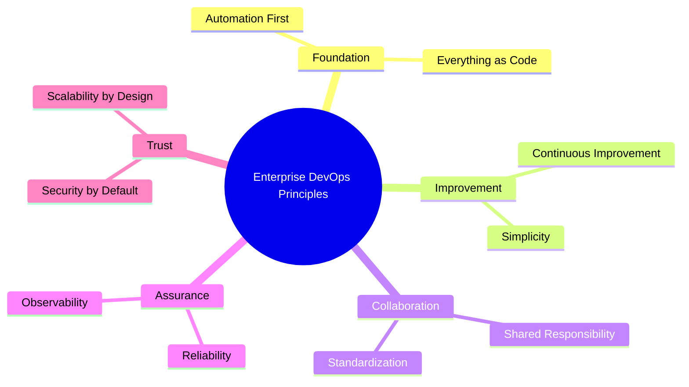
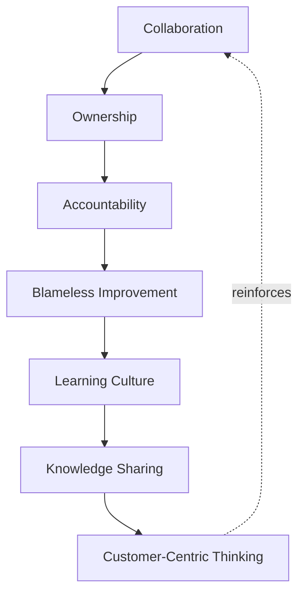
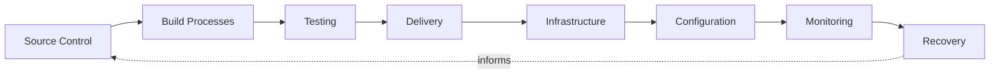
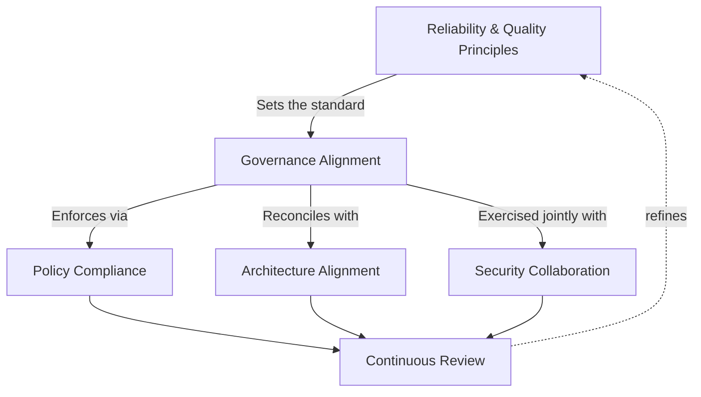
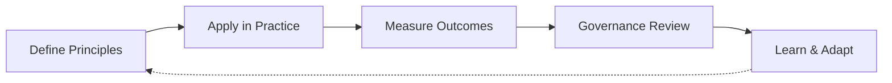

# DevOps Principles

## 1. Document Purpose

This document defines the non-negotiable principles that govern how DevOps is practiced at **StackLeo** — the engineering philosophy, operational mindset, collaboration model, and cultural commitments that every delivery and operational decision is expected to be consistent with.

- **Purpose of DevOps Principles** — to give every engineer, team, and leader a shared, durable definition of "good" that does not depend on which tools, teams, or individuals are involved at a given moment. Principles outlast specific implementations; they are what remains true even as the platform's technology choices evolve.
- **Relationship with Enterprise Architecture** — these principles are the delivery- and operations-specific expression of the architectural principles defined in `03_System_Design/architecture-principles.md`. Architecture defines the structural qualities the platform must have; these principles define the engineering behavior required to sustain those qualities over time.
- **Relationship with Engineering Standards** — this document does not define coding standards, style guides, or language-specific conventions. It defines the higher-order principles those standards must serve: automation, reliability, shared responsibility, and continuous improvement.
- **Relationship with Platform Engineering** — platform capability, described in `platform-engineering.md`, exists to make these principles easy to follow by default. A well-built platform makes the correct, principled path the path of least resistance for every engineering team.
- **Relationship with DevSecOps** — security is not a separate principle set layered on top of these; `devsecops.md` describes how the security-by-default and shared-responsibility principles defined here are practiced jointly with the protection principles authoritative in `06_Security`.
- **Relationship with Operational Excellence** — the reliability, observability, and recoverability principles in this document are what make operational excellence achievable in practice rather than aspirational; they are the engineering-level commitments that day-to-day operational discipline in `10_Operations` is built on.

This document is implementation-independent and vendor-neutral. It defines principles, not tools, pipelines, or infrastructure configurations.

## 2. DevOps Core Principles

Ten core principles govern every DevOps decision at StackLeo.

### Automation First

- **Principle Description** — repeatable, well-understood work is automated by default; manual execution requires deliberate justification.
- **Business Value** — reduces the cost, delay, and error rate associated with human-executed repetitive work.
- **Engineering Objective** — make automation the default assumption for any task performed more than once.

### Everything as Code (Conceptual)

- **Principle Description** — the definitions that shape the platform — infrastructure, configuration, and delivery process — are expressed declaratively, versioned, and reviewed like application code.
- **Business Value** — makes the platform's state reproducible, auditable, and recoverable from a known, trusted source.
- **Engineering Objective** — eliminate undocumented, person-held knowledge about how the platform is configured or provisioned.

### Continuous Improvement

- **Principle Description** — delivery and operational practice is never considered finished; it is expected to mature deliberately as the platform and organization grow.
- **Business Value** — keeps engineering capability aligned with business growth instead of becoming a constraint on it.
- **Engineering Objective** — treat every operational outcome, including failure, as an input to future improvement.

### Shared Responsibility

- **Principle Description** — the reliability, security, and correctness of what is shipped is owned jointly by everyone who contributes to it, not handed off at a boundary.
- **Business Value** — prevents accountability gaps where a problem is "someone else's stage" and therefore no one's priority.
- **Engineering Objective** — extend ownership of a change through to its behavior in production, not just its point of authorship.

### Standardization

- **Principle Description** — common, well-understood patterns are used for delivery, environments, and operational practice across teams.
- **Business Value** — makes engineering capability transferable across teams and reduces onboarding and coordination cost.
- **Engineering Objective** — minimize unnecessary variation between teams solving structurally similar problems.

### Simplicity

- **Principle Description** — the simplest approach that meets a genuine requirement is preferred over a more complex one that anticipates unproven future need.
- **Business Value** — reduces the cost of understanding, operating, and changing the platform over its lifetime.
- **Engineering Objective** — treat complexity as a cost to be justified, not a default to be assumed.

### Reliability

- **Principle Description** — the platform behaves consistently and predictably under real operating conditions, including partial failure.
- **Business Value** — protects revenue, customer trust, and brand reputation, which depend directly on the platform working as expected.
- **Engineering Objective** — engineer reliability deliberately rather than assume it as a byproduct of good intentions.

### Observability

- **Principle Description** — the platform's internal behavior can be understood from its external outputs, without guesswork.
- **Business Value** — reduces the time between a problem occurring and a problem being understood and addressed.
- **Engineering Objective** — ensure the platform's true state is always knowable, not inferred.

### Security by Default

- **Principle Description** — the default configuration and behavior of any system is the most secure reasonable option, consistent with `06_Security/security-principles.md`.
- **Business Value** — reduces risk introduced by oversight, unreviewed configuration, or convenience-driven shortcuts.
- **Engineering Objective** — make the secure path and the easy path the same path.

### Scalability by Design

- **Principle Description** — delivery and operational practice is designed to absorb growth in traffic, team size, and business complexity without requiring re-architecture of how the platform is built and run.
- **Business Value** — protects the business's ability to grow without engineering practice becoming a bottleneck at scale.
- **Engineering Objective** — design for the platform's next order of magnitude, not only its current state.

*Diagram 1: Enterprise DevOps Principles Framework — the ten core principles, grouped by the engineering concern each one primarily serves.*

### DevOps Principle Matrix

| Principle | Principle Description | Business Value |
|---|---|---|
| Automation First | Repeatable work is automated by default | Reduces cost, delay, and error from manual work |
| Everything as Code (Conceptual) | Platform-shaping definitions are declarative and versioned | Makes platform state reproducible and auditable |
| Continuous Improvement | Practice is never considered finished | Keeps engineering capability aligned with growth |
| Shared Responsibility | Ownership extends through to production behavior | Prevents accountability gaps |
| Standardization | Common patterns used across teams | Makes capability transferable, reduces coordination cost |
| Simplicity | Simplest approach meeting genuine need is preferred | Reduces lifetime cost of understanding and change |
| Reliability | Consistent, predictable behavior under real conditions | Protects revenue, trust, and reputation |
| Observability | Internal behavior understandable from external output | Reduces time to detect and understand problems |
| Security by Default | Most secure reasonable default configuration | Reduces risk from oversight and shortcuts |
| Scalability by Design | Practice absorbs growth without re-architecture | Protects ability to grow without engineering bottlenecks |

## 3. Engineering Culture

Principles are only as durable as the culture that sustains them. Seven cultural commitments underpin DevOps practice at StackLeo:

- **Collaboration** — delivery and reliability are achieved through continuous interaction between product, engineering, platform, security, and operations, not through handoffs between disconnected stages.
- **Ownership** — engineers own the outcomes of what they build, including its behavior once it is running in production, not only its correctness at the point of authorship.
- **Accountability** — responsibility for a decision is traceable to the team or individual who made it, and is treated as a normal part of engineering practice rather than a punitive mechanism.
- **Knowledge Sharing** — understanding of how the platform works is actively distributed across the organization, so capability does not depend on any single person's availability.
- **Learning Culture** — gaps in knowledge or capability are treated as normal and addressed openly, rather than hidden or worked around indefinitely.
- **Blameless Improvement** — failures are analyzed to understand contributing conditions and system weaknesses, not to assign individual fault; the goal is a more resilient system, not a identified culprit.
- **Customer-Centric Thinking** — engineering decisions are evaluated, in part, by their effect on the customer's experience of the platform, not solely by internal technical convenience.

*Diagram 2: Engineering Culture Model — each cultural commitment reinforces the next, closing a loop that keeps engineering practice grounded in collaboration and customer outcomes.*

### Engineering Culture Matrix

| Cultural Commitment | Focus | Primary Outcome |
|---|---|---|
| Collaboration | Continuous interaction across functions | Prevents disconnected, siloed decision-making |
| Ownership | Accountability through to production behavior | Aligns authorship with real-world outcomes |
| Accountability | Traceable responsibility for decisions | Normalizes responsibility without punitive framing |
| Knowledge Sharing | Distributed understanding of the platform | Removes single points of organizational knowledge failure |
| Learning Culture | Open acknowledgement of capability gaps | Enables deliberate, continuous skill growth |
| Blameless Improvement | Analysis of conditions, not individual fault | Produces a more resilient system after every failure |
| Customer-Centric Thinking | Engineering decisions weighed by customer effect | Keeps technical decisions connected to business outcomes |

## 4. Operational Principles

The following principles govern how the platform is expected to behave and be reasoned about once running, independent of any specific operational tooling:

- **Repeatability** — the same input, process, or environment definition produces the same outcome every time, regardless of who or what initiates it.
- **Predictability** — the platform's behavior under a given condition can be reasoned about in advance, rather than discovered only when the condition occurs.
- **Resilience** — the platform is designed to detect, absorb, and recover from failure, rather than to merely avoid it.
- **Consistency** — equivalent environments and equivalent changes behave equivalently, so confidence gained in one context transfers to another.
- **Auditability** — every change to the platform is traceable to its author, its reason, and its approval.
- **Recoverability** — the platform and its data can be restored to a known-good state within an understood, bounded time following an adverse event.
- **Change Awareness** — the organization always knows what changed, when, and why, so cause and effect can be reasoned about during investigation.

### Operational Principle Matrix

| Principle | Focus | Why It Matters |
|---|---|---|
| Repeatability | Same input produces same outcome | Confidence in process, independent of who runs it |
| Predictability | Behavior can be reasoned about in advance | Reduces surprise during both normal operation and incidents |
| Resilience | Detect, absorb, and recover from failure | Sustains business continuity through disruption |
| Consistency | Equivalent environments behave equivalently | Confidence transfers safely across contexts |
| Auditability | Every change is traceable | Supports investigation, compliance, and trust |
| Recoverability | Restoration to known-good state within bounded time | Limits the business impact of adverse events |
| Change Awareness | What changed, when, and why is always known | Enables fast, accurate root-cause reasoning |

## 5. Automation Philosophy

Automation at StackLeo is treated as a strategic capability, not a convenience. The following areas are governed by a consistent automation philosophy, described here in terms of strategic objective only:

- **Source Control** — automate the enforcement of review, history integrity, and change traceability, so trust in the codebase does not depend on individual discipline alone.
- **Build Processes** — automate the transformation of source into verifiable artifacts, so the same input always produces the same, trustworthy output.
- **Testing** — automate the validation of expected behavior at the earliest responsible point, so confidence in a change is established before it progresses.
- **Delivery** — automate the movement of validated change toward production, so releasing is a routine, low-risk capability rather than a rare, high-ceremony event.
- **Infrastructure** — automate the provisioning and modification of the platform's runtime foundation, so infrastructure state matches its declared definition at all times.
- **Configuration** — automate the application of environment and application behavior, so drift between intended and actual state is prevented rather than discovered.
- **Monitoring** — automate the continuous comparison of actual platform behavior against expected behavior, so degradation is surfaced without waiting for customer reports.
- **Recovery** — automate the response to well-understood failure conditions, so restoration does not depend on manual intervention being available and correct under pressure.

*Diagram 3: Automation Philosophy Overview — automation coverage extends across the full path from source to recovery, with recovery outcomes informing future source-level decisions.*

## 6. Reliability & Quality Principles

Reliability and quality are treated as engineered, measured properties of the platform, not assumed states:

- **Stable Operations** — the platform's day-to-day behavior is consistent enough that deviations are noticeable and meaningful, rather than lost in normal noise.
- **Risk Reduction** — engineering and operational decisions actively account for the risk they introduce, and prefer the option that reduces overall platform risk.
- **Failure Awareness** — realistic failure modes are considered deliberately, not assumed away because they have not yet occurred.
- **Continuous Validation** — assumptions about the platform's behavior and resilience are tested deliberately over time, rather than trusted indefinitely once made.
- **Service Reliability** — the platform's ability to meet its commitments to customers is treated as a primary engineering outcome, on par with feature delivery.
- **Operational Confidence** — teams operate the platform with justified confidence, grounded in observability and tested resilience, rather than hope.

## 7. Governance Alignment

DevOps principles are sustained through consistent governance, not through good intentions alone:

- **Policy Compliance** — delivery and operational practice is expected to comply with the policies derived from this document and from `06_Security`, applied consistently rather than selectively.
- **Architecture Alignment** — DevOps practice is continuously reconciled with the architectural principles in `03_System_Design`, so operational reality and architectural intent do not silently diverge.
- **Security Collaboration** — governance of DevOps practice is exercised jointly with the Security function, consistent with the DevSecOps relationship defined in Section 1.
- **Operational Governance** — day-to-day operational practice is reviewed against the principles in this document, not left to informal or ad hoc judgment alone.
- **Continuous Review** — the principles themselves are periodically reviewed for continued relevance as the platform, organization, and market evolve, consistent with the review discipline in `03_System_Design/architecture-decisions.md`.

*Diagram 4: Reliability & Governance Relationship — reliability principles set the standard governance is built to protect, and continuous review closes the loop back into refined reliability expectations.*

### Governance Alignment Matrix

| Governance Area | Focus | Owner Interface |
|---|---|---|
| Policy Compliance | Consistent application of derived policy | Platform & Security Teams |
| Architecture Alignment | Reconciling practice with architectural intent | Architecture Teams |
| Security Collaboration | Joint governance with the Security function | Security & Platform Teams |
| Operational Governance | Review of day-to-day operational practice | Operations & Platform Teams |
| Continuous Review | Periodic reassessment of principle relevance | Architecture & DevOps Leadership |

*Diagram 5: Continuous Improvement Lifecycle — principles are applied, their outcomes measured and governed, and what is learned is fed back into refined principles rather than discarded.*

## 8. Future Readiness

These principles are deliberately structured to remain valid regardless of the platform's future technical or business shape:

- **Cloud-Native Platforms** — the principles in this document are provider-independent by design, so adoption of elastic, provider-hosted infrastructure requires no redefinition of underlying practice.
- **Microservices** — standardization and consistency principles are structured to scale with an increasing number of independently deployable capabilities, rather than assuming a single monolithic codebase.
- **Platform Engineering** — the automation-first and everything-as-code principles are the foundation platform capability is built on, ensuring platform tooling reinforces these principles rather than working around them.
- **AI Systems** — AI-assisted capability is expected to be delivered, observed, and governed under the same reliability, security-by-default, and observability principles as any other system capability.
- **Marketplace Platform** — as StackLeo evolves from direct-to-consumer retail toward business sales, corporate accounts, wholesale, and a multi-vendor marketplace, shared responsibility and governance alignment principles extend to new external actor classes, such as sellers, without redefinition.
- **Global Expansion** — as StackLeo grows from Bangladesh into South Asia and, over time, global markets, these principles remain jurisdiction-agnostic, allowing regional variation to layer on beneath a stable foundation.
- **Multi-Region Operations** — as new sales channels — mobile application, physical store, and point-of-sale — and additional currencies beyond BDT are introduced, consistency and change awareness principles ensure equivalent behavior and traceability across every region and channel.

### Future Readiness Matrix

| Future Dimension | Readiness Focus | Governing Principles |
|---|---|---|
| Cloud-Native Platforms | Provider-independent practice | Automation First, Everything as Code |
| Microservices | Practice scales with service count | Standardization, Consistency |
| Platform Engineering | Tooling reinforces, not bypasses, principles | Automation First, Everything as Code |
| AI Systems | Same governance as any other capability | Reliability, Security by Default, Observability |
| Marketplace Platform | New actor classes onboarded without redefinition | Shared Responsibility, Governance Alignment |
| Global Expansion | Jurisdiction-agnostic foundation | All Core Principles |
| Multi-Region Operations | Equivalent behavior across region and channel | Consistency, Change Awareness |

## 9. Anti-Patterns

The following patterns represent a direct violation of the principles in this document and are deliberately excluded from StackLeo's DevOps practice:

- **Manual-First Culture** — defaulting to manual execution and treating automation as optional. This directly contradicts Automation First and reintroduces the variance and error automation exists to remove.
- **Siloed Ownership** — allowing ownership of a change to end at the point of authorship rather than extending into production. This contradicts Shared Responsibility and recreates the accountability gaps it is designed to prevent.
- **Inconsistent Standards** — allowing teams to independently define equivalent practice in incompatible ways. This contradicts Standardization and Consistency, and erodes the transferability of engineering capability across the organization.
- **Automation Without Governance** — automating delivery or infrastructure change without review, traceability, or oversight. This produces speed without control, contradicting Auditability and Governance Alignment.
- **Ignoring Reliability** — treating reliability as an implicit outcome of feature work rather than a deliberate engineering objective. This contradicts the Reliability & Quality Principles and leaves customer trust exposed to avoidable failure.
- **Reactive Operations** — operating the platform only in response to customer-reported failure rather than proactive observability. This contradicts Observability and Operational Confidence, and means the organization is consistently the last to know.
- **Weak Documentation** — allowing critical operational or delivery knowledge to remain undocumented and person-dependent. This contradicts Knowledge Sharing and reintroduces single points of organizational failure.
- **No Continuous Learning** — treating current practice as permanently sufficient rather than subject to ongoing review. This contradicts Continuous Improvement and guarantees practice falls behind the platform's growing scale and complexity.

### Anti-Pattern Summary

| Anti-Pattern | Principle Violated | Why It Must Be Avoided |
|---|---|---|
| Manual-First Culture | Automation First | Reintroduces variance and error automation removes |
| Siloed Ownership | Shared Responsibility | Recreates accountability gaps at handoff boundaries |
| Inconsistent Standards | Standardization, Consistency | Erodes transferability of capability across teams |
| Automation Without Governance | Auditability, Governance Alignment | Produces speed without control or traceability |
| Ignoring Reliability | Reliability | Leaves customer trust exposed to avoidable failure |
| Reactive Operations | Observability | Organization is consistently last to know of problems |
| Weak Documentation | Knowledge Sharing | Reintroduces single points of organizational failure |
| No Continuous Learning | Continuous Improvement | Practice falls behind platform scale and complexity |

## 10. Document Information

| Property | Value |
|----------|-------|
| Document | devops-principles.md |
| Version | 1.0.0 |
| Status | Active |
| Maintained By | StackLeo |
| Last Updated | 2026-07-24 |

---

© StackLeo. All Rights Reserved.
