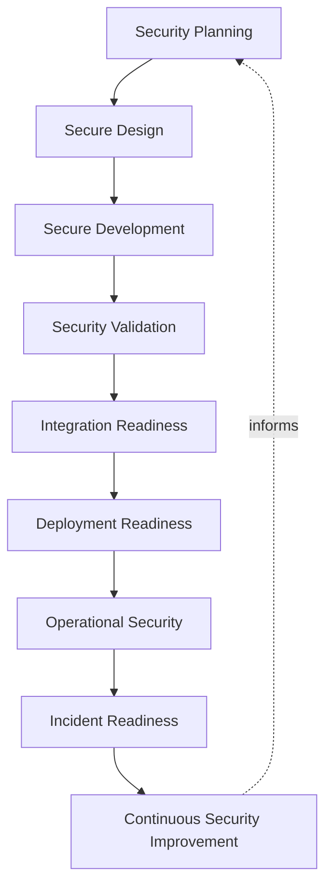
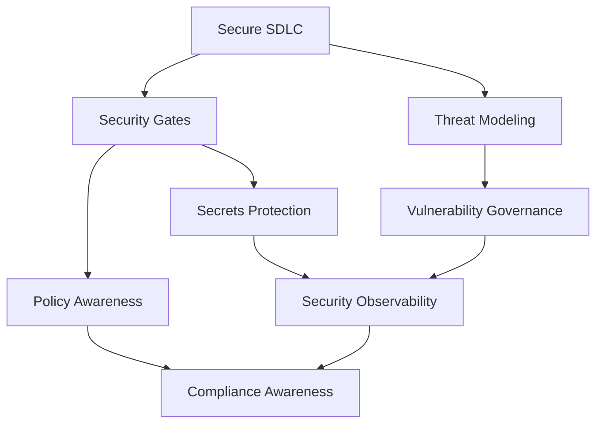
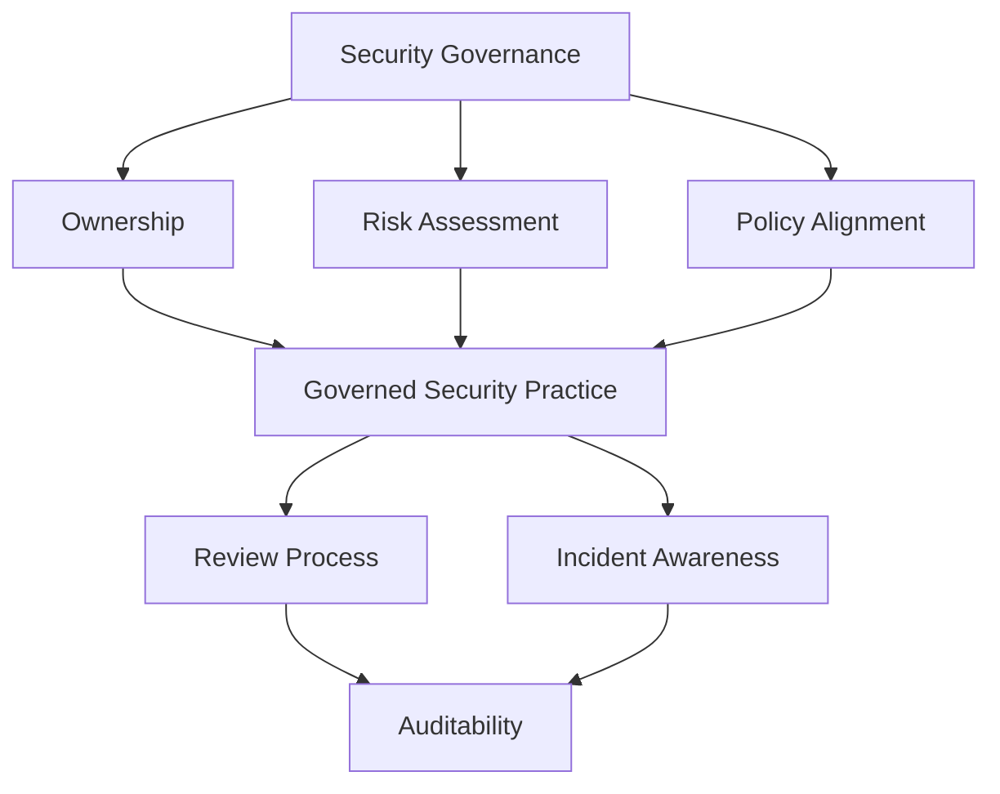
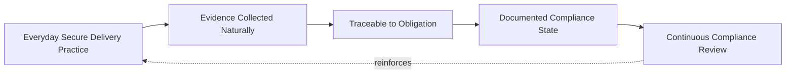
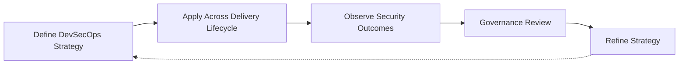

# DevSecOps Strategy

## 1. Document Purpose

This document defines the enterprise strategy for DevSecOps at **StackLeo** — how security is embedded directly into the software delivery lifecycle rather than applied as a separate, later stage, without recommending specific security products, scanning tools, or configurations.

- **Purpose of DevSecOps** — to ensure that security is a continuous, shared property of how software is built and operated at StackLeo, not a gate imposed after delivery decisions have already been made.
- **Relationship with DevOps** — this document is the security-specific elaboration of `devops-principles.md`, in particular Security by Default, applied specifically to how protection is embedded across the delivery lifecycle rather than treated as a parallel discipline.
- **Relationship with Platform Engineering** — secure defaults and embedded validation are intended to be delivered as self-service platform capability through `platform-engineering.md`, so secure delivery is the easiest path for every engineering team, not an added burden.
- **Relationship with Secure SDLC** — this document defines how the Secure Software Development Lifecycle is practiced conceptually at StackLeo, connecting security consideration to every stage of delivery rather than isolating it to a single review point.
- **Relationship with Compliance** — disciplined DevSecOps practice, including auditability and evidence collection, directly supports the compliance expectations that grow as StackLeo expands into corporate sales, wholesale, and a multi-vendor marketplace.
- **Relationship with Business Risk Management** — security decisions in this document are made in proportion to genuine business risk and impact, connecting engineering practice directly to the risk-based approach defined in `06_Security/security-principles.md`.

This document is the delivery-lifecycle expression of the protection principles authoritatively defined in `06_Security`. It is implementation-independent and vendor-neutral, defining philosophy, lifecycle, and governance — not specific products, scanning tools, or configurations.

## 2. DevSecOps Philosophy

- **Shift-Left Security** — security is considered from the moment a capability is conceived, not inspected in after implementation is complete.
- **Shared Responsibility** — the security of what is built and shipped is owned jointly by engineering, security, and operations, not delegated entirely to a single specialized team.
- **Security by Design** — the default behavior and configuration of any system is the most secure reasonable option, consistent with `06_Security/security-principles.md`.
- **Automation First** — repeatable security validation is automated by default, so security does not depend on manual, easily skipped steps.
- **Continuous Verification** — security assumptions are continuously tested rather than trusted indefinitely once established.
- **Risk-Based Decision Making** — security effort and rigor are proportionate to genuine business risk and impact, not applied uniformly regardless of consequence.
- **Continuous Improvement** — DevSecOps practice is expected to mature as the platform, organization, and threat landscape evolve.

## 3. Secure Software Delivery Lifecycle

### Security Planning

- **Purpose** — identify security considerations relevant to a capability before design begins.
- **Business Value** — prevents security needs from being discovered reactively during or after implementation.
- **Governance Objectives** — ensure every capability can be traced back to a deliberate security consideration.

### Secure Design

- **Purpose** — shape a capability's architecture to account for realistic threats from the outset.
- **Business Value** — makes security a structural property of the capability rather than a later patch.
- **Governance Objectives** — ensure design decisions are reviewed for security implications before implementation begins.

### Secure Development

- **Purpose** — implement the capability consistent with secure coding and configuration expectations.
- **Business Value** — reduces the introduction of avoidable vulnerabilities during implementation.
- **Governance Objectives** — ensure secure development practice is applied consistently, not dependent on individual initiative.

### Security Validation

- **Purpose** — confirm the implemented capability meets defined security expectations before it progresses further.
- **Business Value** — catches security defects at the earliest, cheapest point they can be found.
- **Governance Objectives** — make security validation a required condition of progressing, connected directly to the quality gates in `ci-cd-strategy.md`.

### Integration Readiness

- **Purpose** — confirm the validated capability is safe to combine with the broader codebase and system.
- **Business Value** — prevents security issues from being introduced through unsafe combination of otherwise validated components.
- **Governance Objectives** — treat integration-level security readiness as a distinct check, not an assumption from component-level validation alone.

### Deployment Readiness

- **Purpose** — confirm the security posture of the target environment and change are aligned before deployment.
- **Business Value** — reduces deployment-time security risk by resolving readiness questions before deployment begins.
- **Governance Objectives** — ensure deployment proceeds only once security readiness is explicitly confirmed.

### Operational Security

- **Purpose** — sustain the capability's security posture during its live, operating period.
- **Business Value** — protects customers and the business continuously, not only at the moment of release.
- **Governance Objectives** — treat operational security as an ongoing responsibility, connected to `06_Security/vulnerability-management.md`.

### Incident Readiness

- **Purpose** — maintain a prepared, practiced capability to detect, contain, and recover from a security incident.
- **Business Value** — limits the business impact of an incident that does occur, consistent with `06_Security/incident-response.md`.
- **Governance Objectives** — ensure incident readiness is verified proactively, not assumed adequate until tested by a real event.

### Continuous Security Improvement

- **Purpose** — feed what is learned from security outcomes, including incidents and near-misses, back into practice.
- **Business Value** — keeps security practice improving in step with the platform's growing scale and evolving threat landscape.
- **Governance Objectives** — ensure security learning is acted upon, not merely recorded.

*Diagram 1: Enterprise DevSecOps Lifecycle — security consideration moves from planning and secure design through development, validation, and readiness, into sustained operational security and incident readiness, with outcomes feeding continuous improvement.*

### Secure Delivery Lifecycle Matrix

| Stage | Purpose | Business Value |
|---|---|---|
| Security Planning | Identify considerations before design begins | Prevents reactive discovery of security needs |
| Secure Design | Shape architecture to account for realistic threats | Makes security structural, not a later patch |
| Secure Development | Implement consistent with secure practice | Reduces avoidable vulnerabilities during implementation |
| Security Validation | Confirm capability meets security expectations | Catches defects at the earliest, cheapest point |
| Integration Readiness | Confirm safe combination with the broader system | Prevents issues from unsafe component combination |
| Deployment Readiness | Confirm environment and change security alignment | Reduces deployment-time security risk |
| Operational Security | Sustain security posture during live operation | Protects customers and business continuously |
| Incident Readiness | Maintain prepared detection and recovery capability | Limits business impact of an actual incident |
| Continuous Security Improvement | Feed outcomes back into practice | Keeps practice aligned with evolving threats |

## 4. Core DevSecOps Capabilities

### Secure SDLC

- **Purpose** — embed security consideration at every stage of the software development lifecycle.
- **Business Value** — prevents security from being isolated to a single, easily bypassed checkpoint.
- **Strategic Objectives** — make security a continuous property of delivery, not a discrete phase.

### Security Gates

- **Purpose** — establish conceptual checkpoints at which security readiness must be confirmed before progression.
- **Business Value** — ensures unvalidated risk cannot silently advance toward production.
- **Strategic Objectives** — align security gates directly with the quality gates defined in `ci-cd-strategy.md`.

### Policy Awareness

- **Purpose** — ensure delivery practice remains consistent with organizational security policy at every stage.
- **Business Value** — prevents policy violations from being discovered only during audit or incident investigation.
- **Strategic Objectives** — make policy compliance a built-in property of delivery, not a separate check.

### Threat Modeling

- **Purpose** — deliberately consider realistic adversary behavior and attack paths relevant to a given capability.
- **Business Value** — surfaces security risk before it is implemented rather than after it is exploited.
- **Strategic Objectives** — make threat modeling a routine part of design, not an occasional specialized exercise.

### Vulnerability Governance

- **Purpose** — govern the identification, prioritization, and remediation of vulnerabilities across the platform.
- **Business Value** — ensures known weaknesses are addressed proportionate to their genuine risk, consistent with `06_Security/vulnerability-management.md`.
- **Strategic Objectives** — treat vulnerability management as continuous, not a periodic, disconnected activity.

### Secrets Protection

- **Purpose** — embed the protection principles defined in `secrets-management.md` and `06_Security` directly into delivery practice.
- **Business Value** — prevents credential and key exposure, a leading cause of significant security incidents.
- **Strategic Objectives** — make secure secret handling the default behavior of the delivery pipeline.

### Security Observability

- **Purpose** — make security-relevant system behavior understandable and continuously visible.
- **Business Value** — reduces the time between a security-relevant event occurring and it being understood.
- **Strategic Objectives** — extend the observability principles in `observability.md` explicitly to security-relevant signals.

### Compliance Awareness

- **Purpose** — ensure delivery practice remains consistent with applicable compliance and regulatory obligations.
- **Business Value** — reduces the risk and cost of compliance failures discovered late or externally.
- **Strategic Objectives** — make compliance a continuously maintained state, not a periodic scramble.

*Diagram 2: Secure SDLC Framework — the Secure SDLC anchors security gates and threat modeling, which inform policy awareness, vulnerability governance, and secrets protection, converging on continuous security observability and compliance awareness.*

### DevSecOps Capability Matrix

| Capability | Purpose | Strategic Objective |
|---|---|---|
| Secure SDLC | Embed security at every lifecycle stage | Make security continuous, not a discrete phase |
| Security Gates | Conceptual checkpoints for security readiness | Align with CI/CD quality gates |
| Policy Awareness | Consistency with organizational security policy | Make policy compliance built-in, not separate |
| Threat Modeling | Deliberate consideration of realistic threats | Make threat modeling routine, not occasional |
| Vulnerability Governance | Identify, prioritize, and remediate weaknesses | Treat vulnerability management as continuous |
| Secrets Protection | Embed credential and key protection into delivery | Make secure secret handling the default |
| Security Observability | Understandable, visible security-relevant behavior | Extend observability explicitly to security signals |
| Compliance Awareness | Consistency with regulatory obligations | Make compliance continuously maintained |

## 5. Security Governance

- **Ownership** — a designated security governance owner, exercised jointly with `06_Security/security-governance.md`, is accountable for the coherence of DevSecOps practice.
- **Risk Assessment** — security decisions in delivery practice are informed by deliberate risk assessment, proportionate to the capability's genuine business impact.
- **Policy Alignment** — delivery practice is continuously reconciled with the security policies derived from `06_Security`, so operational reality and policy intent do not silently diverge.
- **Review Process** — significant security-relevant delivery decisions are reviewed consistent with the review discipline in `03_System_Design/architecture-decisions.md`.
- **Incident Awareness** — delivery teams maintain awareness of active and historical incidents relevant to their capability, consistent with `06_Security/incident-response.md`.
- **Auditability** — every security-relevant decision and validation outcome is traceable to its author, reasoning, and approval.

*Diagram 3: Security Governance Model — ownership, risk assessment, and policy alignment converge on governed security practice, sustained by ongoing review, incident awareness, and auditability.*

### Security Governance Matrix

| Governance Area | Focus | Accountable For |
|---|---|---|
| Ownership | Joint accountability with enterprise security governance | Coherence of DevSecOps practice |
| Risk Assessment | Proportionate, deliberate risk-informed decisions | Security effort matched to genuine business impact |
| Policy Alignment | Delivery practice reconciled with security policy | Preventing silent divergence from policy intent |
| Review Process | Review of significant security-relevant decisions | Consistent, deliberate decision-making |
| Incident Awareness | Team-level awareness of relevant incidents | Informed, context-aware delivery decisions |
| Auditability | Traceable decisions, reasoning, and approval | Supporting investigation and compliance |

## 6. Compliance Alignment

This section defines conceptual compliance concerns without referencing specific regulatory frameworks, except as generic illustrative examples.

- **Governance Awareness** — delivery practice is maintained with awareness of the governance obligations, such as data protection or financial handling requirements common to retail and marketplace platforms, that StackLeo may be subject to as it scales.
- **Risk Management** — compliance-relevant risk is assessed and managed with the same rigor as any other business risk, consistent with `06_Security/security-principles.md`.
- **Evidence Collection** — the artifacts that demonstrate compliant practice — approvals, validation outcomes, audit logs — are collected as a natural byproduct of following this strategy, not as a separate, retrofitted effort.
- **Traceability** — the connection between a compliance obligation and the delivery practice that satisfies it remains discoverable.
- **Documentation** — compliance-relevant practice is documented clearly enough to be demonstrated to an external party without requiring reconstruction.
- **Continuous Compliance** — compliance is treated as a continuously maintained state rather than a periodic, point-in-time exercise performed only ahead of an audit.

*Diagram 4: Continuous Security Feedback Loop — everyday secure delivery practice naturally produces traceable evidence and documentation, which is continuously reviewed and reinforces the practice that generated it.*

### Compliance Alignment Matrix

| Concern | Focus | Supports |
|---|---|---|
| Governance Awareness | Awareness of applicable governance obligations | Practice that anticipates, not reacts to, obligations |
| Risk Management | Compliance-relevant risk assessed with rigor | Business risk decisions inclusive of compliance impact |
| Evidence Collection | Artifacts collected as a natural byproduct | Demonstrable compliance without retrofitted effort |
| Traceability | Obligation connected to satisfying practice | Discoverable link between requirement and evidence |
| Documentation | Clear, demonstrable compliance-relevant practice | Compliance demonstrable without reconstruction |
| Continuous Compliance | Continuously maintained, not point-in-time | Compliance sustained rather than periodically chased |

## 7. Future Readiness

- **Zero Trust Architecture** — shared responsibility and continuous verification principles in Section 2 are structured to deepen naturally as Zero Trust maturity grows, consistent with `06_Security/security-principles.md`.
- **Cloud-Native Platforms** — DevSecOps principles are defined independent of any specific provider, allowing adoption of elastic, provider-hosted infrastructure without redefining this strategy.
- **Kubernetes** — security gates and policy awareness extend naturally to container orchestration concepts, consistent with `kubernetes-strategy.md`, without requiring a separate security philosophy.
- **Microservices** — as capability decomposes into a growing number of independently deployable services, secure SDLC and vulnerability governance principles scale without requiring redefinition.
- **AI Systems** — AI-assisted capability is governed under the same secure delivery lifecycle, threat modeling, and compliance awareness principles as any other system capability.
- **Marketplace Platform** — as StackLeo evolves toward business sales, corporate accounts, wholesale, and a multi-vendor marketplace, security governance extends to a broader set of partner and seller integration surfaces without redefinition.
- **Global Engineering Teams** — as StackLeo grows from Bangladesh into South Asia and, over time, global markets, DevSecOps governance remains independent of contributor location, supporting distributed teams operating under consistent security discipline.

## 8. Governance

- **Ownership** — a designated DevSecOps governance owner is accountable for the coherence and enforcement of this strategy across the delivery lifecycle.
- **Review Process** — significant changes to secure delivery lifecycle, capability priorities, or governance expectations are reviewed consistent with the review discipline in `03_System_Design/architecture-decisions.md` and `06_Security/security-governance.md`.
- **Security Policies** — individual teams may define security detail consistent with this strategy, but may not bypass its gates or governance principles.
- **Audit Readiness** — security-relevant records, approvals, and outcomes are maintained in a state that supports audit and investigation at any time.
- **Continuous Improvement** — DevSecOps practice is expected to mature as the platform, organization, and threat landscape evolve, consistent with `devops-principles.md`.

*Diagram 5: Enterprise Security Improvement Cycle — DevSecOps strategy is applied across the delivery lifecycle, its outcomes observed, reviewed by governance, and refined, with refinements feeding directly back into the strategy.*

### Governance Responsibility Matrix

| Governance Area | Owner | Accountable For |
|---|---|---|
| Ownership | DevSecOps Governance Owner | Coherence and enforcement of this strategy |
| Review Process | Security & Architecture Teams | Reviewing changes to lifecycle and capability priorities |
| Security Policies | Delivery Owning Teams | Detail consistent with enterprise gates and governance |
| Audit Readiness | Security & Platform Teams | Security-relevant records ready for audit at any time |
| Continuous Improvement | DevSecOps / Platform Engineering | Maturing strategy as threat landscape and scale evolve |

## 9. Anti-Patterns

- **Security as a Final Step** — treating security review as a single checkpoint before release rather than a continuous consideration. This defers the discovery of security issues to the most expensive, least flexible point in delivery.
- **Manual Security Processes** — relying on manual, person-executed security checks for repeatable concerns. This introduces variance, human error, and dependency on individual availability.
- **Weak Security Ownership** — leaving security-relevant practice without a clearly accountable owner. This causes gate enforcement and policy alignment to degrade with no one responsible for correcting it.
- **Missing Threat Awareness** — designing capability without deliberately considering realistic adversary behavior. This allows preventable attack paths to be built into the platform from the outset.
- **Poor Secrets Management** — allowing credentials or keys to be handled outside the discipline defined in `secrets-management.md`. This creates a direct, high-impact path to compromise.
- **Weak Compliance Evidence** — failing to naturally produce the artifacts that demonstrate compliant practice. This forces costly, reactive evidence reconstruction ahead of an audit.
- **Reactive Security** — treating security practice as adequate until an incident proves otherwise. This means avoidable failures, rather than deliberate design, drive security improvement.
- **Missing Security Culture** — treating security as the sole responsibility of a specialized team rather than a shared engineering concern. This limits security's reach to wherever that team can directly intervene, leaving the rest of delivery unprotected by default.

### Anti-Pattern Summary

| Anti-Pattern | Why It Must Be Avoided |
|---|---|
| Security as a Final Step | Defers discovery to the most expensive, least flexible point |
| Manual Security Processes | Introduces variance, error, and dependency on individual availability |
| Weak Security Ownership | Gate enforcement and policy alignment degrade with no accountable owner |
| Missing Threat Awareness | Preventable attack paths get built into the platform from the outset |
| Poor Secrets Management | Creates a direct, high-impact path to compromise |
| Weak Compliance Evidence | Forces costly, reactive evidence reconstruction ahead of audits |
| Reactive Security | Avoidable failures, not deliberate design, drive improvement |
| Missing Security Culture | Leaves delivery unprotected wherever a specialized team cannot directly intervene |

## 10. Document Information

| Property | Value |
|----------|-------|
| Document | devsecops-strategy.md |
| Version | 1.0.0 |
| Status | Active |
| Maintained By | StackLeo |
| Last Updated | 2026-07-24 |

---

© StackLeo. All Rights Reserved.
