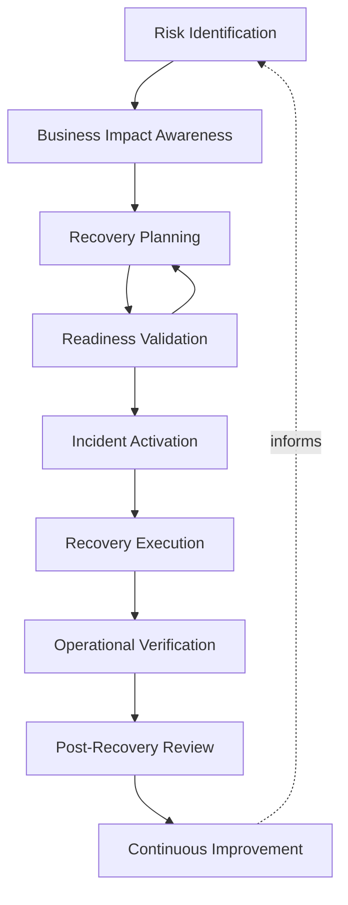
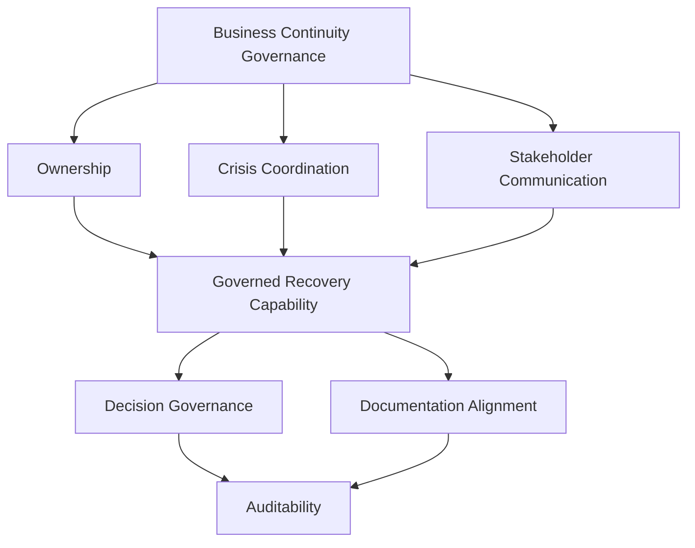
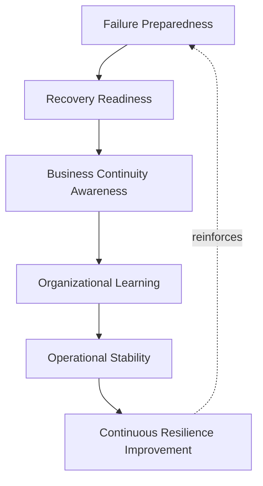
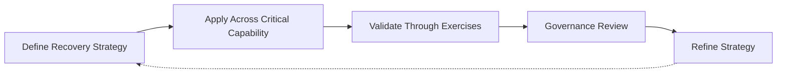

# Disaster Recovery

## 1. Document Purpose

This document defines the enterprise strategy for disaster recovery and business continuity execution at **StackLeo** — how the platform is prepared to recover critical operation following a severe disruption, without recommending backup, disaster recovery, or cloud products, and without prescribing recovery time or recovery point objectives.

- **Purpose of Disaster Recovery** — to ensure that when a severe, otherwise unrecoverable disruption occurs, the organization has a prepared, practiced, and governed path back to critical operation, rather than improvising recovery under the pressure of an active crisis.
- **Relationship with Business Continuity** — this document is the operational, engineering-execution counterpart to `06_Security/business-continuity.md` and `06_Security/disaster-recovery.md`, which remain authoritative for the organization's business continuity philosophy and risk posture; this document defines how engineering and platform practice deliver against that philosophy.
- **Relationship with SRE** — disaster recovery is the extreme end of the resilience spectrum defined in `sre-strategy.md`; where day-to-day reliability engineering addresses routine failure, disaster recovery addresses the severe, low-frequency events that routine resilience is not designed to absorb alone.
- **Relationship with DevOps** — this document extends the Resilience by Design principle in `devops-principles.md` to its most demanding case, ensuring recovery capability is engineered deliberately rather than assumed to exist when needed.
- **Relationship with Platform Engineering** — recovery capability, including environment and infrastructure restoration, is intended to be delivered as governed, repeatable platform capability through `platform-engineering.md` and `infrastructure-as-code.md`, not dependent on manual, person-held knowledge.
- **Relationship with Enterprise Risk Management** — disaster recovery is a direct, deliberate mitigation against the most severe category of operational risk StackLeo faces, connecting engineering practice to the risk-based approach defined in `06_Security/security-principles.md`.

This document is implementation-independent and vendor-neutral. It defines disaster recovery philosophy, lifecycle, and governance conceptually — not specific products, infrastructure configurations, or recovery objective values.

## 2. Disaster Recovery Philosophy

- **Resilience by Design** — the ability to recover from a severe disruption is engineered into the platform deliberately, not assumed to emerge naturally from routine operational practice.
- **Business Continuity First** — recovery decisions are made in service of restoring critical business capability, not merely restoring technical systems for their own sake.
- **Preparedness** — the organization maintains a prepared, current recovery capability at all times, rather than developing one only after a disaster has occurred.
- **Controlled Recovery** — recovery proceeds through a known, governed process, even under the pressure of an active crisis, rather than through improvisation.
- **Continuous Validation** — recovery capability is periodically tested to confirm it would genuinely work if needed, rather than trusted on the basis of untested assumption.
- **Shared Responsibility** — disaster recovery readiness is owned jointly across engineering, platform, security, and business leadership, not delegated entirely to a single team.
- **Continuous Improvement** — disaster recovery practice is expected to mature over time, informed by validation exercises and, when they occur, real events.

## 3. Disaster Recovery Lifecycle

### Risk Identification

- **Purpose** — recognize the categories of severe disruption the platform could realistically face.
- **Business Value** — ensures recovery planning addresses genuine, realistic risk rather than assumption.
- **Governance Objectives** — ensure risk identification is revisited deliberately, not performed once and left static.

### Business Impact Awareness

- **Purpose** — understand which capabilities are most critical to the business and the consequence of their unavailability.
- **Business Value** — ensures recovery priority reflects genuine business importance, not technical convenience.
- **Governance Objectives** — connect recovery planning directly to business priorities defined in `01_Business` and `02_Product`.

### Recovery Planning

- **Purpose** — define how critical capability would be restored following a severe disruption.
- **Business Value** — replaces crisis-time improvisation with a prepared, understood path to recovery.
- **Governance Objectives** — ensure recovery plans are documented, current, and accessible when needed.

### Readiness Validation

- **Purpose** — confirm through deliberate exercise that the recovery plan would genuinely work.
- **Business Value** — converts an assumed capability into a demonstrated, trustworthy one.
- **Governance Objectives** — ensure validation occurs on a defined cadence, not only in response to concern.

### Incident Activation

- **Purpose** — formally recognize that a disruption meets the threshold for disaster recovery response.
- **Business Value** — ensures the organization moves decisively into recovery mode rather than delaying under uncertainty.
- **Governance Objectives** — ensure activation criteria and authority are clearly defined in advance.

### Recovery Execution

- **Purpose** — carry out the planned recovery actions to restore critical capability.
- **Business Value** — returns the business to operation, limiting the duration and depth of disruption.
- **Governance Objectives** — ensure execution follows the validated plan, with deviations deliberately made and recorded.

### Operational Verification

- **Purpose** — confirm that recovered capability is genuinely and sustainably functioning as expected.
- **Business Value** — prevents declaring recovery complete prematurely, only to face renewed disruption.
- **Governance Objectives** — treat verification as a required, distinct step before recovery is considered concluded.

### Post-Recovery Review

- **Purpose** — deliberately examine how the disruption occurred and how the recovery was executed.
- **Business Value** — extracts durable organizational learning from a genuinely severe event.
- **Governance Objectives** — ensure review occurs for every disaster recovery activation, without exception.

### Continuous Improvement

- **Purpose** — feed what is learned from validation exercises and real activations back into recovery planning.
- **Business Value** — keeps recovery capability aligned with the platform's evolving scale and risk landscape.
- **Governance Objectives** — ensure improvement actions are tracked to completion, not merely proposed.

*Diagram 1: Enterprise Disaster Recovery Lifecycle — recovery capability moves from risk identification and business impact awareness through planning and repeated readiness validation, into activation and execution when genuinely needed, with post-recovery review driving continuous improvement.*

### Disaster Recovery Lifecycle Matrix

| Stage | Purpose | Business Value |
|---|---|---|
| Risk Identification | Recognize realistic categories of severe disruption | Ensures planning addresses genuine risk, not assumption |
| Business Impact Awareness | Understand criticality and consequence of unavailability | Ensures priority reflects genuine business importance |
| Recovery Planning | Define how critical capability would be restored | Replaces crisis improvisation with a prepared path |
| Readiness Validation | Confirm the plan would genuinely work | Converts assumed capability into demonstrated capability |
| Incident Activation | Formally recognize disaster recovery threshold is met | Ensures decisive movement into recovery mode |
| Recovery Execution | Carry out planned recovery actions | Returns the business to operation, limiting disruption |
| Operational Verification | Confirm genuine, sustained recovered function | Prevents premature declaration of recovery |
| Post-Recovery Review | Examine how the disruption and recovery occurred | Extracts durable organizational learning |
| Continuous Improvement | Feed learning back into recovery planning | Keeps capability aligned with evolving risk |

## 4. Recovery Strategy Concepts

### Service Recovery

- **Purpose** — restore individual customer- or business-facing services to functioning operation.
- **Business Value** — directly restores the capability customers and the business depend on.
- **Governance Expectations** — service recovery priority is informed by the business impact awareness in Section 3.

### Data Recovery

- **Purpose** — restore business and customer data to a trustworthy, usable state.
- **Business Value** — protects the integrity of the platform's most sensitive and valuable asset.
- **Governance Expectations** — governed jointly with `backup.md` and the data protection principles in `06_Security/data-protection.md`.

### Infrastructure Recovery

- **Purpose** — restore the underlying infrastructure foundation the platform depends on.
- **Business Value** — re-establishes the operating environment services and data recovery depend on.
- **Governance Expectations** — governed consistent with the declarative, repeatable principles in `infrastructure-as-code.md`.

### Application Recovery

- **Purpose** — restore application-level functionality to its expected, correct behavior.
- **Business Value** — ensures restored infrastructure and data translate into genuinely usable capability.
- **Governance Expectations** — connected to the deployment and rollback discipline in `deployment-strategy.md` and `rollback.md`.

### Communication Continuity

- **Purpose** — sustain the organization's ability to communicate internally and with stakeholders during a disruption.
- **Business Value** — prevents a technical disruption from also becoming a communication and trust failure.
- **Governance Expectations** — governed as part of the stakeholder communication principles in Section 5.

### Operational Continuity

- **Purpose** — sustain the organization's ability to make decisions and act during a disruption, independent of the affected technical systems.
- **Business Value** — ensures the organization can function even while its primary systems are impaired.
- **Governance Expectations** — includes deliberate consideration of how key functions operate with degraded technical support.

### Regional Recovery

- **Purpose** — address disruption that affects a specific geographic region rather than the platform as a whole.
- **Business Value** — protects continuity of operation as StackLeo's footprint expands beyond a single market.
- **Governance Expectations** — anticipates the multi-region operation described in Section 7 without prescribing specific regional infrastructure.

### Organizational Recovery

- **Purpose** — address disruption to the organization's own people, facilities, or operating capacity, not only its technical systems.
- **Business Value** — recognizes that severe disruption can affect the organization directly, not only the platform it operates.
- **Governance Expectations** — coordinated with broader business continuity planning beyond engineering scope.

### Recovery Strategy Matrix

| Concept | Purpose | Business Value |
|---|---|---|
| Service Recovery | Restore individual customer- or business-facing services | Directly restores depended-upon capability |
| Data Recovery | Restore business and customer data to trustworthy state | Protects the platform's most sensitive, valuable asset |
| Infrastructure Recovery | Restore the underlying infrastructure foundation | Re-establishes the environment other recovery depends on |
| Application Recovery | Restore application-level functionality | Ensures restored infrastructure translates into usable capability |
| Communication Continuity | Sustain internal and stakeholder communication | Prevents technical disruption from becoming a trust failure |
| Operational Continuity | Sustain decision-making and action during disruption | Ensures the organization can function despite impairment |
| Regional Recovery | Address disruption affecting a specific region | Protects continuity as the footprint expands beyond one market |
| Organizational Recovery | Address disruption to people, facilities, or capacity | Recognizes disruption can affect the organization directly |

## 5. Business Continuity Governance

- **Ownership** — a designated disaster recovery owner is accountable for the coherence and currency of recovery plans across the platform.
- **Crisis Coordination** — response to a declared disaster follows a known structure defining roles and decision authority, preventing ambiguity during a high-pressure event.
- **Stakeholder Communication** — business leadership, affected teams, and, where appropriate, customers and partners are informed consistent with the severity and nature of the disruption.
- **Decision Governance** — the authority to activate disaster recovery, and to make significant recovery decisions, is clearly defined and understood in advance.
- **Documentation Alignment** — recovery plans remain current with the actual state of the platform, reviewed whenever significant architectural change occurs.
- **Auditability** — the full record of a disaster recovery activation, from declaration through review, is traceable and available for later investigation.

*Diagram 2: Business Continuity Governance Framework — ownership, crisis coordination, and stakeholder communication converge on governed recovery capability, sustained by clear decision authority, current documentation, and full auditability.*

*Diagram 3: Recovery Coordination Flow — a declared disaster triggers plan activation by the recovery owner, mobilizing a crisis team, informing stakeholders, and executing recovery actions until critical operation is confirmed restored.*

### Business Continuity Governance Matrix

| Governance Area | Focus | Accountable For |
|---|---|---|
| Ownership | Designated disaster recovery owner | Coherence and currency of recovery plans |
| Crisis Coordination | Known structure of roles and decision authority | Preventing ambiguity during a high-pressure event |
| Stakeholder Communication | Communication proportionate to severity and nature | Keeping business leadership and stakeholders informed |
| Decision Governance | Clearly defined activation and decision authority | Preventing delay or confusion over who can act |
| Documentation Alignment | Plans kept current with actual platform state | Preventing reliance on outdated recovery assumptions |
| Auditability | Traceable record from declaration through review | Supporting later investigation and compliance |

## 6. Operational Resilience

- **Failure Preparedness** — the organization maintains deliberate awareness of how it would respond to categories of severe failure before they occur.
- **Recovery Readiness** — recovery capability is kept in a genuinely usable, current state, not left to degrade silently between validation exercises.
- **Business Continuity Awareness** — every significant architectural and operational decision is made with awareness of its effect on the organization's ability to recover from severe disruption.
- **Organizational Learning** — validation exercises and real activations are treated as a source of learning that extends beyond the immediately involved teams.
- **Operational Stability** — disaster recovery readiness contributes directly to the broader operational stability commitments defined in `sre-strategy.md`.
- **Continuous Resilience Improvement** — resilience against severe disruption is treated as continuously improvable, never considered complete or sufficient permanently.

*Diagram 4: Operational Resilience Model — failure preparedness sustains recovery readiness and continuity awareness, which feed organizational learning and operational stability, with continuous improvement reinforcing preparedness over time.*

### Operational Resilience Matrix

| Resilience Dimension | Focus | Business Value |
|---|---|---|
| Failure Preparedness | Deliberate awareness of severe failure categories | Prevents unpreparedness when a disruption occurs |
| Recovery Readiness | Recovery capability kept genuinely current | Prevents silent degradation between exercises |
| Business Continuity Awareness | Decisions made with recovery impact in mind | Embeds continuity thinking into everyday decisions |
| Organizational Learning | Exercises and activations shared broadly | Extends benefit of learning beyond involved teams |
| Operational Stability | Direct contribution to broader reliability commitments | Connects disaster recovery to everyday reliability practice |
| Continuous Resilience Improvement | Ongoing improvement, never considered complete | Keeps resilience aligned with evolving risk and scale |

## 7. Future Readiness

- **Cloud-Native Platforms** — disaster recovery principles are defined independent of any specific provider, allowing adoption of elastic, provider-hosted infrastructure without redefining this strategy.
- **Multi-Region Operations** — as StackLeo expands from Bangladesh into South Asia and, over time, global markets, regional recovery concepts extend to a growing footprint without disrupting core governance.
- **Kubernetes** — infrastructure and application recovery concepts extend naturally to container orchestration, consistent with `kubernetes-strategy.md`, without requiring a separate recovery philosophy.
- **Microservices** — as capability decomposes into a growing number of independently deployable services, service recovery planning scales without requiring redefinition.
- **AI Systems** — recovery planning extends to AI-assisted capability, including its data and model dependencies, under the same governance principles as any other critical capability.
- **Marketplace Platform** — as StackLeo evolves toward business sales, corporate accounts, wholesale, and a multi-vendor marketplace, communication continuity extends to a broader set of partners and sellers who depend on platform availability.
- **Global Engineering Teams** — disaster recovery governance remains independent of responder location, supporting distributed teams coordinating recovery across time zones.

## 8. Governance

- **Ownership** — a designated disaster recovery governance owner is accountable for the coherence and enforcement of this strategy, coordinated with `06_Security/security-governance.md`.
- **Review Process** — significant changes to recovery lifecycle, strategy concepts, or governance expectations are reviewed consistent with the review discipline in `03_System_Design/architecture-decisions.md`.
- **Disaster Recovery Policies** — individual teams may define recovery detail consistent with this strategy, but may not bypass its validation or governance principles.
- **Audit Readiness** — recovery plans, validation records, and activation history are maintained in a state that supports audit and investigation at any time.
- **Continuous Improvement** — disaster recovery strategy is expected to mature as the platform, organization, and risk landscape evolve, consistent with `devops-principles.md`.

*Diagram 5: Continuous Resilience Improvement Cycle — recovery strategy is applied across critical capability, validated through deliberate exercises, reviewed by governance, and refined, with refinements feeding directly back into the strategy.*

### Governance Responsibility Matrix

| Governance Area | Owner | Accountable For |
|---|---|---|
| Ownership | Disaster Recovery Governance Owner | Coherence and enforcement of this strategy |
| Review Process | Architecture & Security Teams | Reviewing changes to lifecycle and strategy concepts |
| Disaster Recovery Policies | Capability Owning Teams | Detail consistent with enterprise governance principles |
| Audit Readiness | Platform & Security Teams | Recovery records ready for audit at any time |
| Continuous Improvement | SRE / Platform Engineering | Maturing strategy as platform and risk landscape evolve |

## 9. Anti-Patterns

- **Untested Recovery Plans** — maintaining a recovery plan that has never been validated through deliberate exercise. This means the organization's recovery capability is assumed rather than genuinely known.
- **Weak Documentation** — allowing recovery plans to become outdated relative to the platform's actual state. This causes recovery execution to fail against reality precisely when it is needed most.
- **Poor Communication** — failing to inform stakeholders adequately during a disaster recovery activation. This compounds a technical crisis with an avoidable trust and coordination failure.
- **Single Points of Failure** — allowing critical capability to depend on a single, unprotected component or individual. This creates a disproportionate risk that undermines the value of broader recovery planning.
- **Reactive Recovery** — developing recovery capability only after a severe disruption has already occurred. This means the organization learns its most expensive lessons in the worst possible circumstances.
- **Weak Ownership** — leaving disaster recovery planning without a clearly accountable owner. This causes plans to become stale and readiness to degrade with no one responsible for correcting it.
- **Missing Business Continuity Planning** — treating disaster recovery as a purely technical exercise disconnected from broader business continuity. This leaves the organization's decision-making and operational capacity unaddressed during a crisis.
- **No Continuous Improvement** — treating current recovery capability as a permanently finished state. This guarantees capability falls behind the platform's growing scale and evolving risk landscape.

### Anti-Pattern Summary

| Anti-Pattern | Why It Must Be Avoided |
|---|---|
| Untested Recovery Plans | Recovery capability is assumed rather than genuinely known |
| Weak Documentation | Execution fails against reality precisely when needed most |
| Poor Communication | Compounds a technical crisis with an avoidable trust failure |
| Single Points of Failure | Creates disproportionate risk undermining broader recovery planning |
| Reactive Recovery | Organization learns its most expensive lessons in the worst circumstances |
| Weak Ownership | Plans become stale and readiness degrades with no accountable owner |
| Missing Business Continuity Planning | Leaves decision-making and operational capacity unaddressed during crisis |
| No Continuous Improvement | Capability falls behind platform scale and evolving risk |

## 10. Document Information

| Property | Value |
|----------|-------|
| Document | disaster-recovery.md |
| Version | 1.0.0 |
| Status | Active |
| Maintained By | StackLeo |
| Last Updated | 2026-07-24 |

---

© StackLeo. All Rights Reserved.
