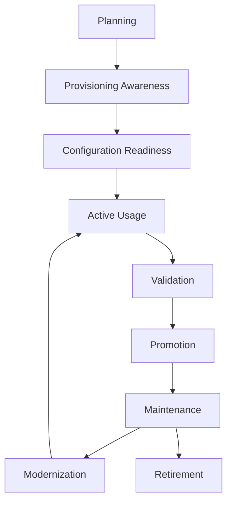
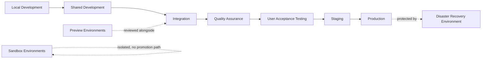
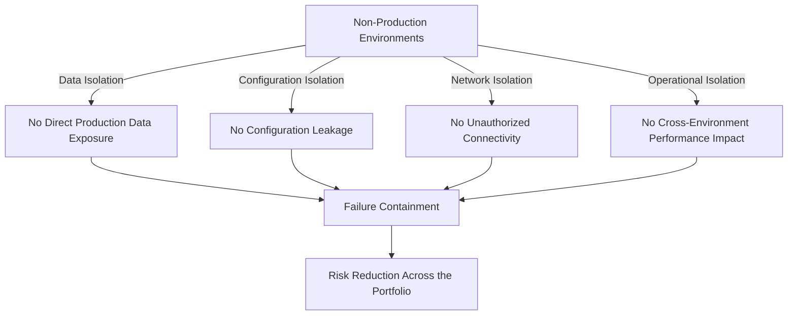
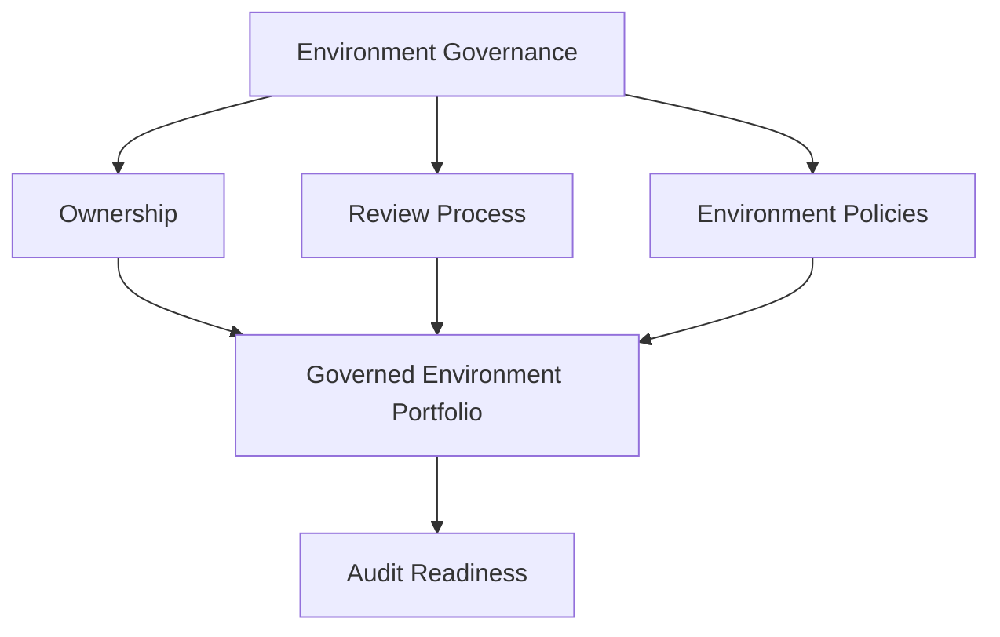
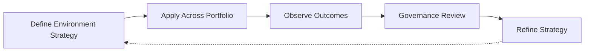

# Environment Management

## 1. Document Purpose

This document defines how environments are governed at **StackLeo** — how the distinct surfaces on which the platform runs are planned, provisioned, isolated, promoted through, and eventually retired, without prescribing specific cloud providers, hosting platforms, infrastructure configurations, or naming conventions.

- **Purpose of Environment Management** — to ensure that every environment the platform runs in — from a developer's own workspace through to production — has a clear, understood purpose, and that change moves between them in a controlled, predictable way.
- **Relationship with DevOps** — this document is the environment-specific elaboration of the DevOps principles defined in `devops-principles.md`, in particular Consistency, Repeatability, and Reliability, applied to the surfaces the platform runs on rather than the code itself.
- **Relationship with CI/CD** — `ci-cd-strategy.md` depends on environments being consistently defined and reliably reproducible; without disciplined environment management, validation performed in one environment cannot be trusted to predict behavior in another.
- **Relationship with Release Management** — environment promotion is the mechanism through which `release-management.md` observes a release moving toward production; a release's readiness is only as trustworthy as the environments it has passed through.
- **Relationship with Operational Excellence** — the stability and consistency of environments directly determine how reliably the platform can be operated, monitored, and understood, connecting this document to `observability.md` and `monitoring.md`.
- **Relationship with Business Continuity** — environment isolation and disaster recovery readiness are direct protections against disruption; poor environment discipline is one of the most common self-inflicted causes of business-impacting incidents.

This document is implementation-independent and vendor-neutral. It defines environment philosophy, lifecycle, and governance conceptually — not specific infrastructure configurations, hosting platforms, or naming conventions.

## 2. Environment Management Philosophy

- **Environment Consistency** — equivalent environments behave equivalently, so confidence gained in one context transfers reliably to another.
- **Isolation by Design** — environments are deliberately separated so that activity in one cannot unintentionally affect another.
- **Predictability** — an environment's behavior and configuration can be reasoned about in advance, rather than discovered through trial and error.
- **Repeatability** — an environment can be reliably reconstructed or reset to a known state, consistent with the Everything as Code principle in `devops-principles.md`.
- **Controlled Promotion** — change moves between environments through a deliberate, governed process rather than an ad hoc one.
- **Operational Stability** — environments, particularly production, are protected from disruption caused by activity that belongs in an earlier stage.
- **Continuous Improvement** — environment management practice is expected to mature as the platform, organization, and operating scale evolve.

## 3. Environment Lifecycle

### Planning

- **Purpose** — determine whether a new environment is genuinely warranted and define its intended purpose.
- **Business Value** — avoids unnecessary environment proliferation before it occurs.
- **Governance Objectives** — ensure every environment can be traced back to a defined, intentional purpose.

### Provisioning Awareness

- **Purpose** — establish the environment's foundation consistent with declared, repeatable definitions.
- **Business Value** — ensures the environment begins its life in a known, reproducible state.
- **Governance Objectives** — prevent environments from being established through undocumented, one-off effort.

### Configuration Readiness

- **Purpose** — apply the environment's intended configuration consistently before it is used.
- **Business Value** — reduces the likelihood of configuration-related issues being discovered only after the environment is in active use.
- **Governance Objectives** — ensure configuration is verified as complete before an environment is declared ready.

### Active Usage

- **Purpose** — support the environment's intended purpose during its primary period of use.
- **Business Value** — delivers the value the environment exists to provide, whether development, validation, or serving customers.
- **Governance Objectives** — ensure usage remains consistent with the environment's declared purpose.

### Validation

- **Purpose** — confirm the environment continues to behave as expected and consistently with its peers.
- **Business Value** — catches environment-level issues before they are mistaken for application-level ones.
- **Governance Objectives** — treat environment validation as an ongoing, not one-time, responsibility.

### Promotion

- **Purpose** — move validated change from this environment toward the next stage in the promotion path.
- **Business Value** — provides a controlled, incremental path toward production rather than a single, high-risk leap.
- **Governance Objectives** — ensure promotion criteria are consistently applied and never bypassed under pressure.

### Maintenance

- **Purpose** — sustain the environment's health and currency once its primary setup phase has concluded.
- **Governance Objectives** — ensure maintenance is resourced rather than deprioritized indefinitely.
- **Business Value** — protects the long-term reliability of an environment the organization continues to depend on.

### Modernization

- **Purpose** — deliberately update the environment's configuration or structure to remain consistent with current standards.
- **Business Value** — keeps mature environments sustainable rather than allowing them to become a growing liability.
- **Governance Objectives** — prevent long-lived environments from silently diverging from evolving governance expectations.

### Retirement

- **Purpose** — formally conclude an environment's lifecycle once it is no longer needed.
- **Business Value** — reduces the operational and security surface area the organization must maintain.
- **Governance Objectives** — ensure retirement is a deliberate, recorded decision rather than an unexplained cessation of use.

*Diagram 1: Enterprise Environment Lifecycle — an environment moves from planning and provisioning through configuration readiness and active, validated use, is promoted deliberately, and cycles through maintenance and modernization until eventual retirement.*

### Environment Lifecycle Matrix

| Stage | Purpose | Business Value |
|---|---|---|
| Planning | Determine whether a new environment is warranted | Avoids unnecessary environment proliferation |
| Provisioning Awareness | Establish the environment's foundation | Ensures a known, reproducible starting state |
| Configuration Readiness | Apply intended configuration before use | Reduces configuration issues discovered late |
| Active Usage | Support the environment's intended purpose | Delivers the value the environment exists to provide |
| Validation | Confirm ongoing expected, consistent behavior | Catches environment-level issues early |
| Promotion | Move validated change toward the next stage | Provides a controlled, incremental path to production |
| Maintenance | Sustain health after initial setup | Protects long-term reliability |
| Modernization | Deliberately update configuration and structure | Keeps mature environments sustainable |
| Retirement | Formally conclude the environment's lifecycle | Reduces ongoing operational and security surface area |

## 4. Environment Categories

### Local Development

- **Purpose** — support an individual engineer's own iterative development work.
- **Typical Usage** — day-to-day coding and initial self-verification before sharing change.
- **Isolation Expectations** — fully isolated from all shared environments and from other engineers' work.
- **Governance Considerations** — minimal formal governance; consistency with shared environments is encouraged but not strictly enforced.

### Shared Development

- **Purpose** — support integration and collaboration among a team working on related, in-progress capability.
- **Typical Usage** — validating that concurrently developed changes work together before wider review.
- **Isolation Expectations** — isolated from validation and production environments; shared among a defined, limited group of contributors.
- **Governance Considerations** — lightweight governance; expected to be reset or reconstructed frequently.

### Integration

- **Purpose** — validate that changes from multiple sources combine correctly as a whole.
- **Typical Usage** — automated and manual verification following the integration stage defined in `ci-cd-strategy.md`.
- **Isolation Expectations** — isolated from production, but representative enough of combined system behavior to be meaningful.
- **Governance Considerations** — governed consistency with recent shared history; not treated as a long-term stable reference.

### Quality Assurance

- **Purpose** — provide a dedicated environment for structured verification of functional and quality expectations.
- **Typical Usage** — systematic testing activity distinct from ad hoc developer verification.
- **Isolation Expectations** — isolated from production and other environments to prevent test activity from causing unintended side effects elsewhere.
- **Governance Considerations** — configuration expected to closely mirror production-relevant behavior.

### User Acceptance Testing

- **Purpose** — validate that delivered capability meets business and stakeholder expectations before release.
- **Typical Usage** — business and product stakeholder review, distinct from technical quality verification.
- **Isolation Expectations** — isolated from production; stable enough to support meaningful stakeholder evaluation.
- **Governance Considerations** — access extended to non-engineering stakeholders under clear, defined expectations.

### Staging

- **Purpose** — provide the closest practical representation of production before release.
- **Typical Usage** — final validation immediately prior to production deployment, consistent with `deployment-strategy.md`.
- **Isolation Expectations** — isolated from production, but configured as closely to production as practically possible.
- **Governance Considerations** — held to production-comparable configuration discipline.

### Production

- **Purpose** — serve real customers and real business activity.
- **Typical Usage** — the live environment customers and the business directly depend on.
- **Isolation Expectations** — the most strictly protected and isolated environment in the portfolio.
- **Governance Considerations** — subject to the strictest access, change, and audit governance of any environment.

### Preview Environments

- **Purpose** — provide a temporary, isolated environment representing a specific, in-progress change for review.
- **Typical Usage** — reviewing a specific proposed change in a running context before it is integrated.
- **Isolation Expectations** — fully isolated and temporary, existing only for the duration of the review.
- **Governance Considerations** — created and retired automatically as part of the change review process, without manual overhead.

### Sandbox Environments

- **Purpose** — provide a safe space for exploration, experimentation, or training without risk to other environments.
- **Typical Usage** — evaluating new approaches or onboarding new contributors without production-adjacent risk.
- **Isolation Expectations** — fully isolated, with no expectation of durable state or production-representative data.
- **Governance Considerations** — governed loosely, but never permitted to hold sensitive or production-derived data.

### Disaster Recovery Environment

- **Purpose** — provide a prepared capability to restore critical operation following a severe disruption to production.
- **Typical Usage** — invoked only during a declared disaster recovery event, consistent with `backup.md`.
- **Isolation Expectations** — isolated from day-to-day activity but kept consistent enough with production to be genuinely usable when needed.
- **Governance Considerations** — subject to periodic, deliberate validation to confirm it would function if actually needed.

*Diagram 2: Environment Promotion Flow — change progresses through a deliberate sequence from local development toward production, with preview environments supporting review alongside integration, sandbox environments remaining outside the promotion path, and a disaster recovery environment protecting production.*

### Environment Category Matrix

| Environment | Purpose | Isolation Expectations |
|---|---|---|
| Local Development | Individual iterative development | Fully isolated from shared and production environments |
| Shared Development | Team-level integration and collaboration | Isolated from validation and production environments |
| Integration | Validate combined changes from multiple sources | Isolated from production, representative of combined behavior |
| Quality Assurance | Structured functional and quality verification | Isolated to prevent unintended side effects elsewhere |
| User Acceptance Testing | Business and stakeholder validation | Isolated from production, stable for stakeholder review |
| Staging | Closest practical representation of production | Isolated from production, production-comparable configuration |
| Production | Serve real customers and business activity | Most strictly protected and isolated environment |
| Preview Environments | Temporary review of a specific in-progress change | Fully isolated and temporary |
| Sandbox Environments | Safe exploration and experimentation | Fully isolated, no production-derived data |
| Disaster Recovery Environment | Restore critical operation after severe disruption | Isolated from daily activity, kept production-consistent |

## 5. Environment Governance

- **Ownership** — every environment has a clearly identified owning team accountable for its health, configuration, and adherence to this strategy.
- **Access Governance** — access to each environment is granted according to role and responsibility, following the least-privilege principle in `06_Security/security-principles.md`, with production held to the strictest standard.
- **Promotion Governance** — the criteria for moving change between environments are defined consistently and applied uniformly, never bypassed for convenience.
- **Configuration Consistency** — environments intended to be comparable are kept comparably configured, preventing drift that would undermine confidence gained in earlier stages.
- **Change Coordination** — activity affecting shared environments is coordinated across teams, preventing conflicting or overlapping use.
- **Documentation Alignment** — every environment's purpose, configuration, and ownership are documented and kept current.

### Environment Governance Matrix

| Governance Area | Focus | Accountable For |
|---|---|---|
| Ownership | Clearly identified owning team per environment | Health, configuration, and standards adherence |
| Access Governance | Role-based, least-privilege access | Who may access and change each environment |
| Promotion Governance | Consistent, uniformly applied promotion criteria | Preventing promotion from being bypassed |
| Configuration Consistency | Comparable environments kept comparably configured | Preserving confidence gained across stages |
| Change Coordination | Alignment across teams sharing an environment | Preventing conflicting or overlapping activity |
| Documentation Alignment | Purpose, configuration, and ownership documented | Keeping environment records current and trustworthy |

## 6. Environment Isolation

- **Data Isolation** — data in one environment, particularly non-production environments, is kept separate from and never directly derived from production customer data without deliberate, governed handling.
- **Configuration Isolation** — configuration specific to one environment does not leak into or affect another.
- **Network Isolation** — communication paths are structured so that activity in one environment cannot reach another without deliberate, authorized connection.
- **Operational Isolation** — operational activity, such as testing or load generation, in one environment does not affect the performance or availability of another.
- **Failure Containment** — a failure originating in one environment is prevented from cascading into others, particularly protecting production from non-production failures.
- **Risk Reduction** — isolation is the primary mechanism by which risk introduced anywhere in the environment portfolio is prevented from compounding across it.

*Diagram 3: Environment Isolation Model — data, configuration, network, and operational isolation each contribute to failure containment, which sustains risk reduction across the whole environment portfolio.*

### Isolation Principle Matrix

| Isolation Dimension | Focus | Risk Reduced |
|---|---|---|
| Data Isolation | Non-production data kept separate from production | Unauthorized exposure or misuse of customer data |
| Configuration Isolation | Environment-specific configuration does not leak | Unintended cross-environment behavior |
| Network Isolation | Communication paths deliberately restricted | Unauthorized cross-environment connectivity |
| Operational Isolation | Activity in one environment does not affect another | Cross-environment performance or availability impact |
| Failure Containment | Failures prevented from cascading | Escalation of a contained problem into a broader one |
| Risk Reduction | Aggregate effect of isolation across the portfolio | Compounding risk across the environment portfolio |

## 7. Future Readiness

- **Cloud-Native Platforms** — environment principles are defined independent of any specific provider, allowing adoption of elastic, provider-hosted infrastructure without redefining environment practice.
- **Multi-Region Operations** — as StackLeo expands from Bangladesh into South Asia and, over time, global markets, environment governance extends to multiple regions without requiring redefinition of underlying principles.
- **Platform Engineering** — environment provisioning and governance are structured to be delivered as self-service platform capability, consistent with `platform-engineering.md`.
- **Microservices** — as capability decomposes into a growing number of independently deployable services, environment isolation and promotion principles scale without requiring redefinition.
- **AI Systems** — environments supporting AI-assisted capability, including training and evaluation contexts, are governed under the same isolation and lifecycle principles as any other environment.
- **Marketplace Platform** — as StackLeo evolves toward business sales, corporate accounts, wholesale, and a multi-vendor marketplace, environment governance accommodates new integration surfaces, such as seller-facing environments, without redefinition.
- **Global Engineering Teams** — environment governance remains independent of contributor or operator location, supporting distributed teams working across a shared environment portfolio.

## 8. Governance

- **Ownership** — a designated environment governance owner is accountable for the coherence and enforcement of this strategy across the full environment portfolio.
- **Review Process** — significant changes to environment categories, promotion criteria, or isolation expectations are reviewed consistent with the review discipline in `03_System_Design/architecture-decisions.md`.
- **Environment Policies** — individual teams may define environment detail consistent with this strategy, but may not bypass its isolation or governance principles.
- **Audit Readiness** — environment configuration, access records, and promotion history are maintained in a state that supports audit and investigation at any time.
- **Continuous Improvement** — environment management practice is expected to mature as the platform, organization, and operational scale evolve, consistent with `devops-principles.md`.

*Diagram 4: Governance Framework — ownership, review process, and environment policies converge on a consistently governed, audit-ready environment portfolio.*

*Diagram 5: Continuous Environment Improvement Cycle — environment strategy is applied across the portfolio, its outcomes observed, reviewed by governance, and refined, with refinements feeding directly back into the strategy.*

### Governance Responsibility Matrix

| Governance Area | Owner | Accountable For |
|---|---|---|
| Ownership | Environment Governance Owner | Coherence and enforcement of this strategy |
| Review Process | Architecture & Platform Teams | Reviewing changes to categories and promotion criteria |
| Environment Policies | Environment Owning Teams | Detail consistent with enterprise isolation and governance |
| Audit Readiness | Platform & Security Teams | Configuration and access records ready for audit |
| Continuous Improvement | DevOps / Platform Engineering | Maturing strategy as platform and scale evolve |

## 9. Anti-Patterns

- **Shared Production Data** — using real customer or production data in non-production environments without deliberate, governed handling. This exposes sensitive data to unnecessary risk and often violates the data protection principles in `06_Security`.
- **Configuration Drift** — allowing environments intended to be comparable to gradually diverge in configuration. This undermines confidence that validation in one environment predicts behavior in another.
- **Environment Inconsistency** — provisioning environments through inconsistent, undocumented, one-off effort. This makes environment behavior unpredictable and difficult to reason about.
- **Weak Isolation** — allowing insufficient separation between environments, particularly between non-production and production. This allows a failure or misconfiguration in one environment to affect another.
- **Manual Environment Changes** — modifying an environment through untracked, manual intervention. This introduces variance and makes the environment's actual state diverge from its documented, expected state.
- **Poor Promotion Governance** — allowing change to move toward production without consistently applied promotion criteria. This undermines the entire purpose of a staged environment path.
- **Weak Documentation** — allowing an environment's purpose, configuration, or ownership to go undocumented. This makes the environment difficult for anyone but its original creators to understand or safely engage with.
- **Reactive Environment Management** — addressing environment discipline only after an incident traced back to environment inconsistency occurs. This means avoidable disruption, rather than deliberate design, drives improvement.

### Anti-Pattern Summary

| Anti-Pattern | Why It Must Be Avoided |
|---|---|
| Shared Production Data | Exposes sensitive data to unnecessary risk |
| Configuration Drift | Undermines confidence that validation predicts real behavior |
| Environment Inconsistency | Makes environment behavior unpredictable and hard to reason about |
| Weak Isolation | Allows failure or misconfiguration to spread between environments |
| Manual Environment Changes | Introduces variance and divergence from documented state |
| Poor Promotion Governance | Undermines the purpose of a staged path to production |
| Weak Documentation | Environment becomes difficult for anyone but its creators to understand |
| Reactive Environment Management | Avoidable disruption, not deliberate design, drives improvement |

## 10. Document Information

| Property | Value |
|----------|-------|
| Document | environment-management.md |
| Version | 1.0.0 |
| Status | Active |
| Maintained By | StackLeo |
| Last Updated | 2026-07-24 |

---

© StackLeo. All Rights Reserved.
