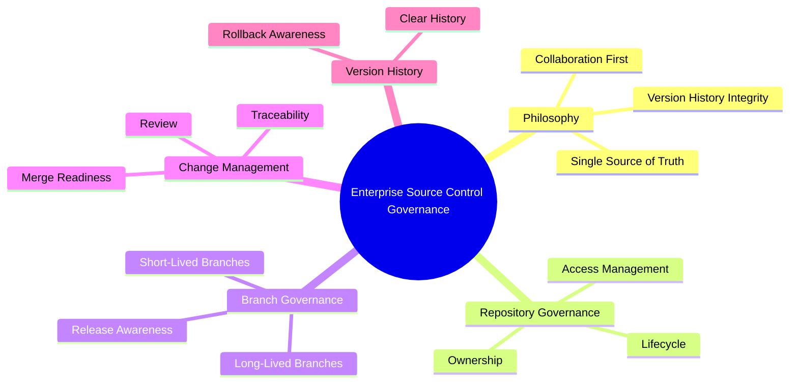
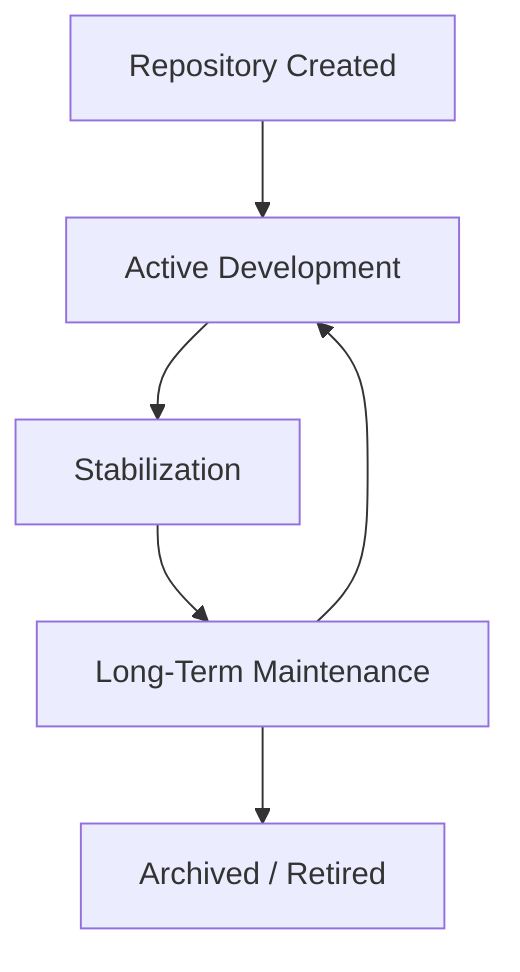
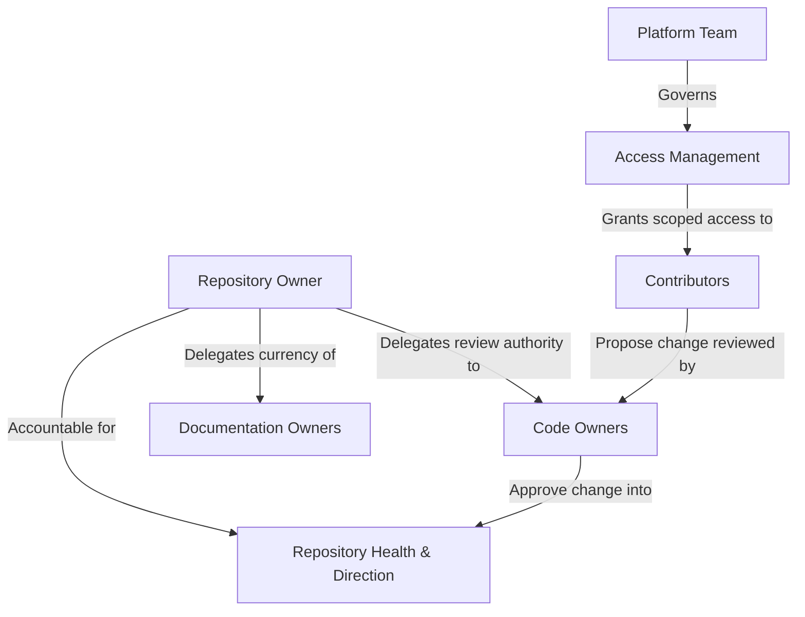
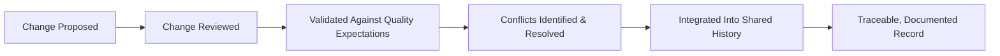
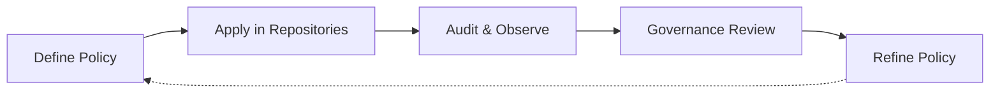

# Git Strategy

## 1. Document Purpose

This document defines how source control is governed at **StackLeo** — the principles, ownership model, and change discipline that protect the integrity of the platform's version history as the single, trustworthy record of how the codebase evolves.

- **Purpose of Source Control Governance** — to ensure that the history of the platform's code, configuration, and infrastructure definitions is complete, trustworthy, and meaningful, so that every past and present state of the system can be understood, attributed, and recovered with confidence.
- **Relationship with DevOps** — source control is the foundation every other DevOps capability depends on, as established in `devops-overview.md`. Build automation, continuous integration, and continuous delivery all assume a source of truth that is itself governed and trustworthy; this document defines the conditions under which that assumption holds.
- **Relationship with Software Engineering** — this document does not define coding standards or implementation technique; it defines the shared discipline of proposing, reviewing, and integrating change that every engineering team operates within, regardless of what they are building.
- **Relationship with Release Management** — version history is the record `release-management.md` depends on to determine what is included in a release, what changed since the last one, and what a release can be safely rolled back to.
- **Relationship with Quality Assurance** — a well-governed repository makes quality verifiable: reviewable, atomic change and clear history allow quality issues to be traced to a specific, understood change rather than diagnosed against an ambiguous history.

This document is implementation-independent and vendor-neutral. It defines source control philosophy and governance — not specific commands, hosting platforms, or a prescribed branching model.

## 2. Git Strategy Philosophy

- **Single Source of Truth** — the repository is the authoritative record of the platform's code, configuration, and infrastructure definitions; no parallel, undocumented copy is treated as equally authoritative.
- **Version History Integrity** — the history of change is protected from silent alteration, so that what happened, and when, remains a reliable record indefinitely.
- **Collaboration First** — the repository is structured and governed to support multiple contributors working concurrently without eroding clarity or trust in its content.
- **Traceability** — every change can be traced to its author, its reasoning, and its review, connecting the codebase's current state to the decisions that produced it.
- **Accountability** — ownership of a change extends beyond the moment it is proposed to its behavior once integrated, consistent with the Shared Responsibility principle in `devops-principles.md`.
- **Continuous Improvement** — source control practice itself is expected to mature as the codebase, team, and organization grow, rather than remaining fixed at its earliest form.

*Diagram 1: Enterprise Source Control Governance — the philosophy, repository, branch, change, and history domains this strategy governs.*

## 3. Source Control Principles

### Repository Integrity

- **Purpose** — ensure the repository's content and history accurately and consistently represent the platform's real state.
- **Business Value** — protects the trustworthiness of the single source of truth every other engineering activity depends on.
- **Governance Objectives** — prevent undocumented or unreviewed alteration of repository content or history.

### Controlled Change

- **Purpose** — ensure that change enters the repository through a known, consistent path rather than arbitrary means.
- **Business Value** — reduces the risk of unreviewed or accidental change reaching shared or production-facing history.
- **Governance Objectives** — make the path from proposed change to integrated change explicit and enforced.

### Review Before Integration

- **Purpose** — ensure that change is examined by someone other than its author before it becomes part of shared history.
- **Business Value** — catches defects, design concerns, and knowledge gaps before they affect the wider codebase.
- **Governance Objectives** — make independent review a required, not optional, step in every change.

### Small Incremental Changes

- **Purpose** — favor frequent, narrowly scoped changes over infrequent, broad ones.
- **Business Value** — reduces review burden, integration risk, and the blast radius of any single change.
- **Governance Objectives** — keep individual changes small enough to be understood fully by a reviewer.

### Atomic Change Philosophy

- **Purpose** — ensure each change represents one complete, coherent unit of intent rather than a bundle of unrelated modifications.
- **Business Value** — makes history meaningful and makes reverting a specific change possible without unintended side effects.
- **Governance Objectives** — discourage changes that mix unrelated concerns within a single unit of history.

### Reproducibility

- **Purpose** — ensure that any past state of the repository can be reliably reconstructed.
- **Business Value** — supports investigation, recovery, and confident comparison between past and present system behavior.
- **Governance Objectives** — protect history from operations that would make a past state unreachable or ambiguous.

### Auditability

- **Purpose** — ensure that who changed what, when, and why can always be determined.
- **Business Value** — supports investigation, compliance, and organizational trust in the change record.
- **Governance Objectives** — ensure every integrated change carries sufficient context to be understood without relying on memory.

### Source Control Principle Matrix

| Principle | Purpose | Governance Objective |
|---|---|---|
| Repository Integrity | Content and history accurately represent real state | Prevent undocumented or unreviewed alteration |
| Controlled Change | Change enters through a known, consistent path | Make the path to integration explicit and enforced |
| Review Before Integration | Change is examined before becoming shared history | Make independent review a required step |
| Small Incremental Changes | Favor frequent, narrow changes over broad ones | Keep changes small enough to be fully understood |
| Atomic Change Philosophy | Each change is one coherent unit of intent | Discourage bundling unrelated concerns |
| Reproducibility | Any past state can be reliably reconstructed | Protect history from operations that erase past states |
| Auditability | Who, what, when, and why is always determinable | Ensure every change carries sufficient context |

## 4. Repository Governance

- **Repository Ownership** — every repository has a clearly identified owning team accountable for its health, direction, and adherence to this strategy.
- **Access Management** — access to propose, review, and approve change is granted according to role and responsibility, following the least-privilege principle established in `06_Security/security-principles.md`.
- **Code Ownership** — specific areas of a repository may have designated owners whose review is expected before change in that area is integrated, ensuring relevant expertise is consulted.
- **Documentation Ownership** — documentation accompanying a repository is owned with the same seriousness as the code it describes, and is expected to remain current as the repository evolves.
- **Archive Strategy** — repositories that are no longer actively developed are deliberately archived rather than left in an ambiguous, unmaintained state, preserving their history for future reference.
- **Repository Lifecycle** — every repository is understood to move through a defined lifecycle, from creation through active development, stabilization, long-term maintenance, and eventual archival.

*Diagram 2: Repository Lifecycle — a repository moves from creation through active development and stabilization into long-term maintenance, cycling back into active development as needed, until it is deliberately archived.*

*Diagram 4: Repository Ownership Model — accountability sits with a designated repository owner, who delegates review and documentation currency, while access itself is governed centrally on a least-privilege basis.*

### Repository Governance Matrix

| Governance Area | Focus | Accountable For |
|---|---|---|
| Repository Ownership | Clearly identified owning team | Overall repository health and direction |
| Access Management | Role-based, least-privilege access | Who may propose, review, and approve change |
| Code Ownership | Designated review authority by area | Relevant expertise is consulted before integration |
| Documentation Ownership | Documentation kept current with code | Accuracy and relevance of accompanying documentation |
| Archive Strategy | Deliberate retirement of inactive repositories | Preserving history without ambiguous, unmaintained state |
| Repository Lifecycle | Defined progression from creation to archival | Consistent expectations at every repository stage |

## 5. Branch Governance

Branching is governed conceptually, independent of any specific naming convention or workflow model:

- **Long-Lived Branches** — represent an enduring, stable line of history — most commonly the state that reflects what is running in production — and are protected accordingly, with stricter integration requirements than other lines of work.
- **Short-Lived Branches** — represent a single, narrowly scoped unit of work, created to be integrated and retired quickly rather than persisting indefinitely.
- **Integration Branches** — represent a converging point where multiple contributions are combined and validated together before progressing further.
- **Stabilization Branches** — represent a line of history deliberately held to a defined scope while it is prepared for release, accepting only corrective change rather than new capability.
- **Release Awareness** — branch structure is understood in relation to what has been released, is being prepared for release, and is under active development, so that the state of any branch can be reasoned about without ambiguity.

### Branch Governance Summary

| Branch Concept | Purpose | Governance Expectation |
|---|---|---|
| Long-Lived Branches | Represent an enduring, stable line of history | Strictest integration requirements; protected from direct change |
| Short-Lived Branches | Represent a single, narrowly scoped unit of work | Created, integrated, and retired quickly |
| Integration Branches | Converge multiple contributions for combined validation | Validated as a whole before progressing further |
| Stabilization Branches | Prepare a defined scope for release | Accept corrective change only, not new capability |
| Release Awareness | Understand branch state relative to release status | No ambiguity about what is released, pending, or in development |

## 6. Change Management

- **Change Reviews** — every change is reviewed by someone other than its author before integration, evaluating correctness, design, and consistency with existing practice.
- **Merge Readiness** — a change is only integrated once it meets a defined, consistent standard of readiness, rather than being integrated on an ad hoc basis.
- **Conflict Awareness** — contributors are expected to recognize and deliberately resolve conflicting changes rather than allowing one to silently override another.
- **Traceability** — every integrated change is linked to the reasoning behind it, so history explains not just what changed but why.
- **Documentation Alignment** — a change that alters documented behavior is expected to update the relevant documentation as part of the same unit of change.
- **Quality Expectations** — change is expected to meet the platform's quality expectations before integration, not be corrected reactively afterward.

*Diagram 3: Conceptual Change Flow — a proposed change is reviewed, validated, checked for conflicts, and only then integrated into a traceable, documented shared history.*

### Change Management Matrix

| Activity | Focus | Expected Outcome |
|---|---|---|
| Change Reviews | Independent examination before integration | Defects and design concerns caught early |
| Merge Readiness | Defined, consistent standard before integration | No ad hoc or inconsistent integration decisions |
| Conflict Awareness | Deliberate recognition and resolution of conflicts | No silent overwriting of concurrent work |
| Traceability | Change linked to its reasoning | History explains why, not only what |
| Documentation Alignment | Documentation updated alongside behavior change | Documentation remains trustworthy and current |
| Quality Expectations | Standards met before, not after, integration | Quality issues prevented rather than retrofitted |

## 7. Version History Principles

- **Clear History** — history reads as a coherent narrative of how the platform evolved, rather than a disordered sequence of unrelated fragments.
- **Meaningful Changes** — each recorded change conveys enough context to be understood on its own, without requiring external memory or explanation.
- **Change Visibility** — what has changed, and its scope, is easy to determine at a glance, supporting both review and later investigation.
- **Rollback Awareness** — history is maintained with the assumption that any change may eventually need to be identified and reversed, consistent with `rollback.md`.
- **Long-Term Maintainability** — history remains a useful, trustworthy resource years after it was recorded, not only in the immediate aftermath of a change.

## 8. Future Readiness

This strategy is deliberately structured to remain valid as StackLeo's engineering organization and technical footprint grow:

- **Monorepositories** — governance and ownership principles are structured to remain coherent whether a single repository holds a broad set of related capability or many repositories each hold a narrow one.
- **Multi-Repository Strategies** — access management and repository lifecycle principles extend cleanly across an increasing number of independently governed repositories.
- **Platform Engineering** — repository and branch governance are structured to be enforceable through self-service platform capability, consistent with `platform-engineering.md`, rather than depending on manual policing.
- **Microservices** — as the platform's architecture decomposes into a growing number of independently deployable services, ownership and branch governance principles scale with the number of repositories without redefinition.
- **AI Projects** — repositories supporting AI-assisted capability are governed under the same integrity, review, and traceability principles as any other repository, avoiding a parallel, weaker standard.
- **Enterprise Teams** — as StackLeo's business expands into corporate sales, wholesale, and a multi-vendor marketplace, ownership and access governance scale to a larger, more diverse set of contributing teams without loss of accountability.
- **Global Engineering Collaboration** — as StackLeo grows from Bangladesh into South Asia and, over time, global markets, these principles remain independent of contributor location or time zone, supporting distributed collaboration without redefinition.

## 9. Governance

- **Ownership** — a designated source control governance owner is accountable for the coherence and enforcement of this strategy across all repositories.
- **Review Process** — this strategy, and the repository-level policies derived from it, are periodically reviewed for continued relevance, consistent with the review discipline in `03_System_Design/architecture-decisions.md`.
- **Repository Policies** — individual repositories may define policy detail consistent with this strategy, but may not contradict the principles defined here.
- **Audit Readiness** — repository history and access records are maintained in a state that supports audit and investigation at any time, without special preparation.
- **Continuous Improvement** — source control governance is expected to mature as the codebase, organization, and tooling landscape evolve, consistent with the Continuous Improvement principle in `devops-principles.md`.

*Diagram 5: Continuous Repository Improvement Cycle — governance policy is applied, observed through audit, reviewed, and refined, with refinements feeding directly back into policy.*

### Governance Responsibility Matrix

| Governance Area | Owner | Accountable For |
|---|---|---|
| Ownership | Source Control Governance Owner | Coherence and enforcement of this strategy |
| Review Process | Architecture & Platform Teams | Periodic relevance review of governance principles |
| Repository Policies | Repository Owners | Policy detail consistent with enterprise strategy |
| Audit Readiness | Platform & Security Teams | History and access records ready for audit at any time |
| Continuous Improvement | All Contributing Teams (shared) | Maturing governance as codebase and organization grow |

## 10. Anti-Patterns

- **Direct Production Changes** — modifying long-lived, production-reflecting history without review or validation. This bypasses every protection this strategy exists to provide and introduces unreviewed risk directly into what customers depend on.
- **Large Unreviewed Changes** — proposing broad, sweeping changes that are too large for a reviewer to meaningfully assess. This defeats the purpose of review and allows defects and design concerns to pass through unnoticed.
- **Poor Repository Organization** — allowing repository structure to grow without deliberate ownership or boundaries. This makes the repository progressively harder to navigate, understand, and safely change.
- **Weak Ownership** — leaving a repository without a clearly accountable owner. This causes governance, review quality, and documentation currency to degrade without anyone responsible for correcting it.
- **Inconsistent History** — allowing commits that are vague, unrelated in scope, or disconnected from their reasoning. This erodes the value of history as a trustworthy record and makes investigation and rollback unreliable.
- **Missing Documentation** — integrating change that alters behavior without updating the documentation that describes it. This causes documentation to silently diverge from reality, eventually making it untrustworthy.
- **Weak Review Culture** — treating review as a formality rather than a genuine, independent check. This removes the primary safeguard against defects and unshared design concerns reaching shared history.
- **Reactive Governance** — defining or enforcing repository governance only after a problem has already occurred. This means avoidable incidents are what drives policy, rather than deliberate, proactive design.

### Anti-Pattern Summary

| Anti-Pattern | Why It Must Be Avoided |
|---|---|
| Direct Production Changes | Bypasses review and introduces unreviewed risk into production-reflecting history |
| Large Unreviewed Changes | Defeats the purpose of review; defects pass through unnoticed |
| Poor Repository Organization | Makes the repository progressively harder to navigate and safely change |
| Weak Ownership | Governance, review quality, and documentation degrade with no accountable owner |
| Inconsistent History | Erodes trust in history; makes investigation and rollback unreliable |
| Missing Documentation | Documentation silently diverges from reality and becomes untrustworthy |
| Weak Review Culture | Removes the primary safeguard against defects reaching shared history |
| Reactive Governance | Avoidable incidents drive policy instead of deliberate, proactive design |

## 11. Document Information

| Property | Value |
|----------|-------|
| Document | git-strategy.md |
| Version | 1.0.0 |
| Status | Active |
| Maintained By | StackLeo |
| Last Updated | 2026-07-24 |

---

© StackLeo. All Rights Reserved.
