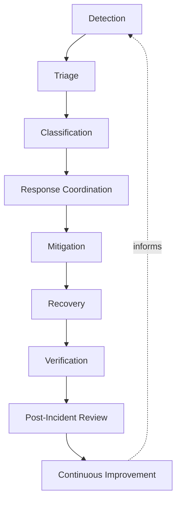
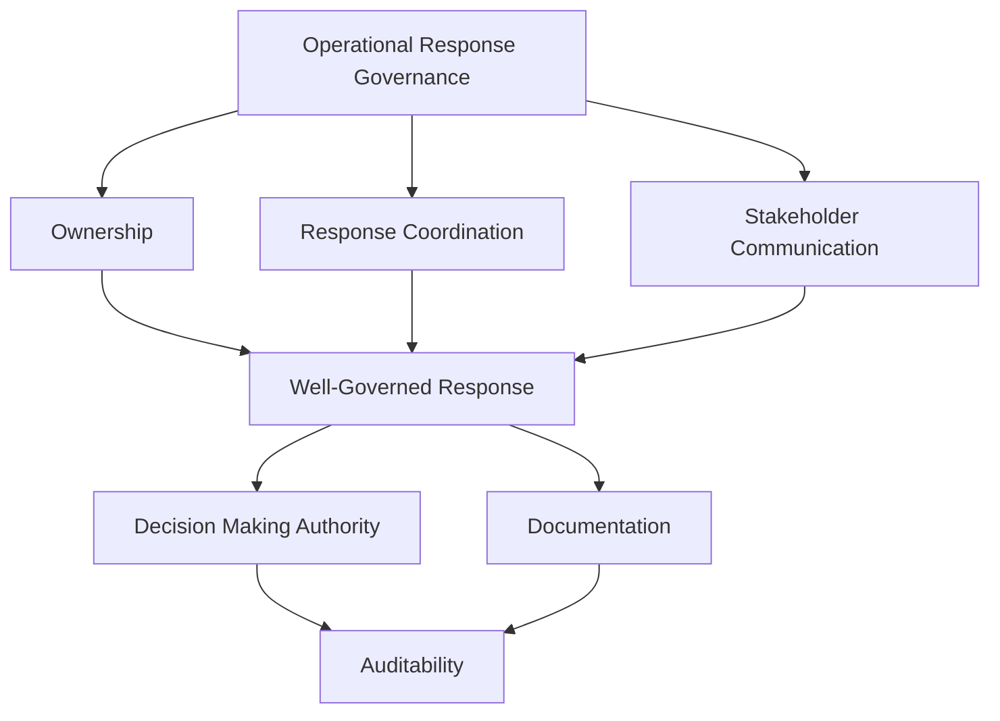
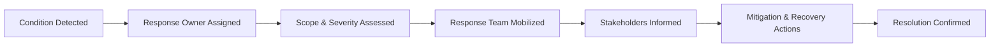
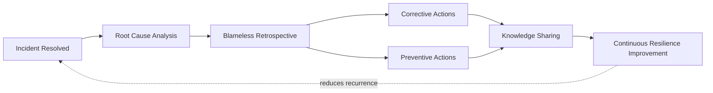
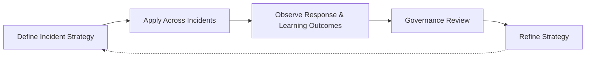

# Incident Management

## 1. Document Purpose

This document defines the enterprise strategy for operational incident management at **StackLeo** — how disruptions to the platform are detected, responded to, communicated, and learned from, without recommending specific incident management tools, ITSM platforms, escalation configurations, or alert rules.

- **Purpose of Incident Management** — to ensure that when the platform behaves unexpectedly, the organization responds in a coordinated, timely, and learning-oriented way, limiting business and customer impact and converting every disruption into an investment in future resilience.
- **Relationship with SRE** — this document is the response-specific elaboration of `sre-strategy.md`; reliability engineering reduces the frequency and severity of incidents, while this document governs how the organization responds when they occur regardless.
- **Relationship with DevOps** — this document extends the Resilience by Design and Continuous Improvement principles in `devops-principles.md` into a dedicated discipline of operational response and organizational learning.
- **Relationship with Platform Engineering** — the mechanisms that support detection, coordination, and communication during an incident are intended to be delivered as consistent, self-service platform capability through `platform-engineering.md`.
- **Relationship with Business Continuity** — incident management is the operational mechanism through which business continuity is protected in the moment a disruption occurs, directly complementing the proactive resilience defined in `sre-strategy.md` and `06_Security/business-continuity.md`.
- **Relationship with Customer Trust** — how quickly and transparently StackLeo responds to a disruption directly shapes customer trust; a well-handled incident can preserve trust even through a real disruption, while a poorly handled one compounds the damage.

This document governs operational incidents broadly. Where an incident is security-related, it is handled jointly with the process defined in `06_Security/incident-response.md`, which remains authoritative for security-specific response obligations. This document is implementation-independent and vendor-neutral, defining philosophy, lifecycle, and governance — not specific tools, platforms, or configurations.

## 2. Incident Management Philosophy

- **Rapid Detection** — problems are identified as early as possible, ideally before they meaningfully affect customers, consistent with the proactive detection principle in `observability-strategy.md`.
- **Coordinated Response** — response to an incident follows a known, understood structure, rather than being improvised uniquely each time.
- **Customer Impact Awareness** — every response decision is made with explicit awareness of its effect on customers, not only its technical resolution.
- **Learning Culture** — every incident, regardless of severity, is treated as an opportunity for organizational learning.
- **Blameless Reviews** — incident review focuses on contributing conditions and systemic weaknesses, not on assigning fault to individuals.
- **Operational Transparency** — the organization communicates honestly about incidents, internally and, where appropriate, externally, rather than minimizing or obscuring them.
- **Continuous Improvement** — incident management practice itself is expected to mature over time, informed by what is learned from handling real incidents.

## 3. Incident Lifecycle

### Detection

- **Purpose** — recognize that the platform is behaving in a way that requires attention.
- **Business Value** — limits the duration between a problem occurring and the organization becoming aware of it.
- **Governance Objectives** — ensure detection depends on deliberate observability, not solely on customer reports.

### Triage

- **Purpose** — perform an initial, rapid assessment of scope and severity to determine urgency.
- **Business Value** — ensures response effort is allocated proportionate to genuine impact from the outset.
- **Governance Objectives** — ensure triage occurs quickly and consistently, not delayed by uncertainty about ownership.

### Classification

- **Purpose** — assign the incident to a defined category, consistent with Section 4, to guide the appropriate response.
- **Business Value** — connects response intensity and stakeholder involvement to genuine business impact.
- **Governance Objectives** — ensure classification criteria are applied consistently rather than subjectively.

### Response Coordination

- **Purpose** — organize the people and effort needed to address the incident.
- **Business Value** — prevents duplicated, conflicting, or absent effort during a time-sensitive event.
- **Governance Objectives** — ensure coordination follows a known structure, consistent with Section 5.

### Mitigation

- **Purpose** — reduce or eliminate the incident's active impact, even if the underlying cause is not yet fully resolved.
- **Business Value** — limits ongoing harm to customers and the business while a full resolution is pursued.
- **Governance Objectives** — ensure mitigation actions are recorded and understood, not applied ad hoc.

### Recovery

- **Purpose** — restore the platform to its normal, expected operating state.
- **Business Value** — returns the business to full, reliable operation.
- **Governance Objectives** — ensure recovery is confirmed deliberately, connected to `rollback.md` and `backup.md` where relevant.

### Verification

- **Purpose** — confirm the platform is genuinely and sustainably operating normally, not merely appearing to.
- **Business Value** — prevents premature closure of an incident that later recurs.
- **Governance Objectives** — treat verification as a required, distinct step before an incident is considered resolved.

### Post-Incident Review

- **Purpose** — deliberately examine what happened, why, and how the organization responded.
- **Business Value** — extracts durable, actionable learning from the incident, elaborated in Section 6.
- **Governance Objectives** — ensure review occurs for every incident meeting a defined threshold, not selectively.

### Continuous Improvement

- **Purpose** — feed what is learned from incidents back into the platform, processes, and this strategy itself.
- **Business Value** — reduces the likelihood and impact of similar future incidents.
- **Governance Objectives** — ensure improvement actions are tracked to completion, not merely proposed.

*Diagram 1: Enterprise Incident Lifecycle — an incident moves from detection and triage through classification and coordinated response, into mitigation, recovery, and verification, with post-incident review driving continuous improvement.*

### Incident Lifecycle Matrix

| Stage | Purpose | Business Value |
|---|---|---|
| Detection | Recognize behavior requiring attention | Limits time between occurrence and organizational awareness |
| Triage | Rapid initial assessment of scope and severity | Allocates response effort proportionate to genuine impact |
| Classification | Assign the incident to a defined category | Connects response intensity to genuine business impact |
| Response Coordination | Organize people and effort to address the incident | Prevents duplicated, conflicting, or absent effort |
| Mitigation | Reduce or eliminate active impact | Limits ongoing harm while full resolution is pursued |
| Recovery | Restore the platform to normal operation | Returns the business to full, reliable operation |
| Verification | Confirm genuine, sustained normal operation | Prevents premature closure and recurrence |
| Post-Incident Review | Deliberately examine what happened and why | Extracts durable, actionable organizational learning |
| Continuous Improvement | Feed learning back into practice | Reduces likelihood and impact of similar future incidents |

## 4. Incident Classification

This section describes conceptual categories without prescribing specific severity criteria or thresholds, which are determined operationally in `10_Operations`.

### Critical Incidents

- **Characteristics** — a severe disruption affecting the platform's core ability to serve customers or conduct business.
- **Business Impact** — significant, immediate impact on revenue, customer trust, or business operation.
- **Governance Expectations** — the highest level of response coordination, stakeholder communication, and post-incident scrutiny.

### High-Priority Incidents

- **Characteristics** — a substantial disruption affecting an important, but not universally core, capability.
- **Business Impact** — meaningful impact on a significant subset of customers or business activity.
- **Governance Expectations** — rapid, coordinated response with defined stakeholder communication.

### Medium-Priority Incidents

- **Characteristics** — a limited disruption affecting a narrower capability or a smaller customer segment.
- **Business Impact** — moderate impact, generally without immediate, severe business consequence.
- **Governance Expectations** — timely response through standard process, without the heightened coordination of higher categories.

### Low-Priority Incidents

- **Characteristics** — a minor issue with negligible or cosmetic impact on customers or operations.
- **Business Impact** — minimal business impact, though still worth deliberate tracking and resolution.
- **Governance Expectations** — addressed through routine process, without urgent escalation.

### Security-Related Incidents

- **Characteristics** — an incident involving a suspected or confirmed security compromise, data exposure, or unauthorized access.
- **Business Impact** — potential impact spans technical, legal, regulatory, and reputational dimensions simultaneously.
- **Governance Expectations** — jointly governed with `06_Security/incident-response.md`, which remains authoritative for security-specific obligations.

### Operational Incidents

- **Characteristics** — an incident arising from operational conditions such as capacity exhaustion, dependency failure, or configuration error, without a security dimension.
- **Business Impact** — impact proportionate to the affected capability's business importance.
- **Governance Expectations** — governed through the standard lifecycle in Section 3, informed by `configuration-management.md` and `scalability.md` where relevant.

### Incident Classification Matrix

| Category | Characteristics | Governance Expectations |
|---|---|---|
| Critical Incidents | Severe disruption to core customer or business capability | Highest coordination, communication, and post-incident scrutiny |
| High-Priority Incidents | Substantial disruption to an important capability | Rapid, coordinated response with defined communication |
| Medium-Priority Incidents | Limited disruption to a narrower capability or segment | Timely response through standard process |
| Low-Priority Incidents | Minor, negligible or cosmetic impact | Routine process, no urgent escalation |
| Security-Related Incidents | Suspected or confirmed security compromise | Jointly governed with `06_Security/incident-response.md` |
| Operational Incidents | Non-security operational condition, such as capacity or dependency failure | Standard lifecycle, informed by relevant operational documents |

## 5. Operational Response Governance

- **Ownership** — every incident has a clearly designated response owner accountable for coordinating its resolution.
- **Response Coordination** — response follows a known structure defining roles and responsibilities during an active incident, preventing ambiguity about who is doing what.
- **Stakeholder Communication** — relevant stakeholders, internal and, where appropriate, external, are informed at a cadence and level of detail appropriate to the incident's classification.
- **Decision Making** — authority to make significant response decisions, such as invoking rollback, is clearly defined and understood in advance.
- **Documentation** — the incident's timeline, actions taken, and decisions made are recorded as it unfolds, not reconstructed afterward from memory.
- **Auditability** — the full incident record, from detection through review, is traceable and available for later investigation.

*Diagram 2: Incident Response Governance Framework — ownership, coordination, and communication converge on a well-governed response, sustained by clear decision-making authority, real-time documentation, and full auditability.*

*Diagram 3: Operational Response Flow — a detected condition is assigned an owner, assessed for scope and severity, mobilized into coordinated response, communicated to stakeholders, and acted upon until resolution is confirmed.*

### Operational Response Matrix

| Governance Area | Focus | Accountable For |
|---|---|---|
| Ownership | Clearly designated response owner per incident | Coordinating the incident through to resolution |
| Response Coordination | Known structure of roles and responsibilities | Preventing ambiguity during active response |
| Stakeholder Communication | Cadence and detail appropriate to classification | Keeping relevant parties genuinely informed |
| Decision Making | Clearly defined response decision authority | Preventing delay or confusion over who can act |
| Documentation | Real-time recording of timeline and actions | Preserving an accurate record, not a reconstructed one |
| Auditability | Traceable, complete incident record | Supporting later investigation and compliance |

## 6. Post-Incident Learning

- **Root Cause Analysis Awareness** — every incident meeting a defined threshold is examined to understand its genuine underlying cause, not only its immediate trigger.
- **Blameless Retrospectives** — review focuses on the conditions and systemic factors that allowed an incident to occur, consistent with the Blameless Improvement principle in `devops-principles.md`.
- **Corrective Actions** — specific, owned actions are identified to address what directly caused or worsened the incident.
- **Preventive Actions** — broader, systemic actions are identified to reduce the likelihood of similar future incidents, not only this specific recurrence.
- **Knowledge Sharing** — what is learned from an incident is shared beyond the immediately involved team, so the organization as a whole benefits from the learning.
- **Continuous Resilience Improvement** — the accumulated learning from incidents over time is treated as a direct input to the reliability optimization defined in `sre-strategy.md`.

*Diagram 4: Post-Incident Learning Cycle — a resolved incident moves through root cause analysis and blameless retrospective into corrective and preventive actions, shared broadly, feeding continuous resilience improvement intended to reduce recurrence.*

### Post-Incident Learning Matrix

| Learning Activity | Focus | Business Value |
|---|---|---|
| Root Cause Analysis Awareness | Understanding genuine underlying cause | Prevents addressing only symptoms |
| Blameless Retrospectives | Examining conditions, not assigning fault | Encourages honest, complete disclosure |
| Corrective Actions | Addressing what directly caused the incident | Resolves the specific contributing failure |
| Preventive Actions | Addressing broader, systemic contributing factors | Reduces likelihood of similar future incidents |
| Knowledge Sharing | Distributing learning beyond the involved team | Extends benefit of learning organization-wide |
| Continuous Resilience Improvement | Feeding learning into reliability optimization | Connects incident history to deliberate reliability investment |

## 7. Future Readiness

- **Cloud-Native Platforms** — incident management principles are defined independent of any specific provider, allowing adoption of elastic, provider-hosted infrastructure without redefining this strategy.
- **Kubernetes** — detection and mitigation principles extend naturally to container orchestration concepts, consistent with `kubernetes-strategy.md`, without requiring a separate incident philosophy.
- **Microservices** — as capability decomposes into a growing number of independently deployable services, response coordination and classification principles scale without requiring redefinition.
- **AI Systems** — incidents involving AI-assisted capability are governed under the same lifecycle, classification, and learning principles as any other operational incident.
- **Marketplace Platform** — as StackLeo evolves toward business sales, corporate accounts, wholesale, and a multi-vendor marketplace, stakeholder communication extends to a broader set of partners and sellers without redefinition.
- **Multi-Region Operations** — as StackLeo expands from Bangladesh into South Asia and, over time, global markets, incident response coordination accommodates regional and time-zone variation without disrupting core governance.
- **Global Engineering Teams** — incident management remains independent of responder location, supporting distributed teams coordinating response across time zones.

## 8. Governance

- **Ownership** — a designated incident management governance owner is accountable for the coherence and enforcement of this strategy across the organization.
- **Review Process** — significant changes to incident lifecycle, classification, or governance expectations are reviewed consistent with the review discipline in `03_System_Design/architecture-decisions.md`.
- **Incident Policies** — individual teams may define incident response detail consistent with this strategy, but may not bypass its classification or review principles.
- **Audit Readiness** — incident records, communications, and review outcomes are maintained in a state that supports audit and investigation at any time.
- **Continuous Improvement** — incident management practice is expected to mature as the platform, organization, and operational scale evolve, consistent with `devops-principles.md`.

*Diagram 5: Continuous Operational Resilience Improvement — incident strategy is applied across every incident, response and learning outcomes are observed, reviewed by governance, and refined, with refinements feeding directly back into the strategy.*

### Governance Responsibility Matrix

| Governance Area | Owner | Accountable For |
|---|---|---|
| Ownership | Incident Management Governance Owner | Coherence and enforcement of this strategy |
| Review Process | SRE & Architecture Teams | Reviewing changes to lifecycle and classification |
| Incident Policies | Response Owning Teams | Detail consistent with enterprise governance principles |
| Audit Readiness | Platform & Security Teams | Incident records ready for audit at any time |
| Continuous Improvement | SRE / Platform Engineering | Maturing strategy as platform and scale evolve |

## 9. Anti-Patterns

- **Slow Detection** — depending on customer reports rather than deliberate observability to discover incidents. This means the organization is consistently the last to know about its own platform's condition.
- **Poor Communication** — failing to inform relevant stakeholders adequately during an active incident. This erodes trust and creates avoidable confusion at exactly the moment clarity matters most.
- **Blame Culture** — treating incident review as an exercise in identifying who caused a problem. This discourages honest disclosure and prevents genuine understanding of systemic contributing factors.
- **Weak Documentation** — failing to record an incident's timeline and actions as it unfolds. This makes accurate post-incident review and later investigation unreliable.
- **Reactive Operations** — treating incident response readiness as adequate until a real incident proves otherwise. This means avoidable failures, rather than deliberate preparation, drive readiness improvement.
- **Missing Root Cause Analysis** — resolving the immediate symptom of an incident without understanding its genuine underlying cause. This leaves the organization exposed to the same incident recurring.
- **Weak Ownership** — allowing an incident to proceed without a clearly designated response owner. This causes coordination to break down at exactly the moment it matters most.
- **No Continuous Learning** — failing to feed incident learning back into practice, the platform, or this strategy. This forfeits the primary value every incident, despite its cost, is capable of providing.

### Anti-Pattern Summary

| Anti-Pattern | Why It Must Be Avoided |
|---|---|
| Slow Detection | Organization is consistently the last to know its own condition |
| Poor Communication | Erodes trust and creates confusion when clarity matters most |
| Blame Culture | Discourages honest disclosure and genuine systemic understanding |
| Weak Documentation | Makes post-incident review and later investigation unreliable |
| Reactive Operations | Avoidable failures, not deliberate preparation, drive readiness |
| Missing Root Cause Analysis | Leaves the organization exposed to the same incident recurring |
| Weak Ownership | Coordination breaks down at exactly the moment it matters most |
| No Continuous Learning | Forfeits the primary value every incident is capable of providing |

## 10. Document Information

| Property | Value |
|----------|-------|
| Document | incident-management.md |
| Version | 1.0.0 |
| Status | Active |
| Maintained By | StackLeo |
| Last Updated | 2026-07-24 |

---

© StackLeo. All Rights Reserved.
