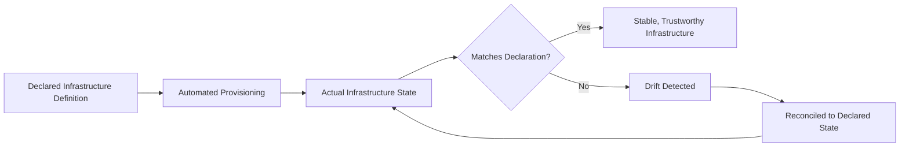
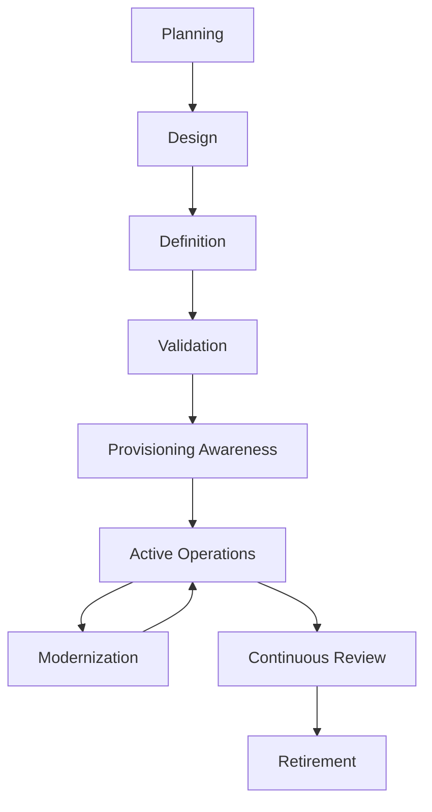
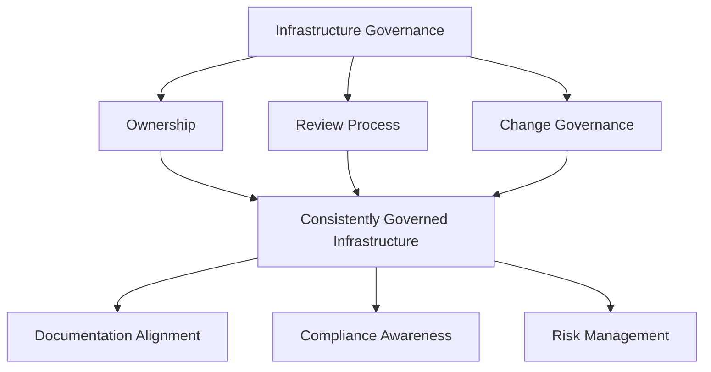
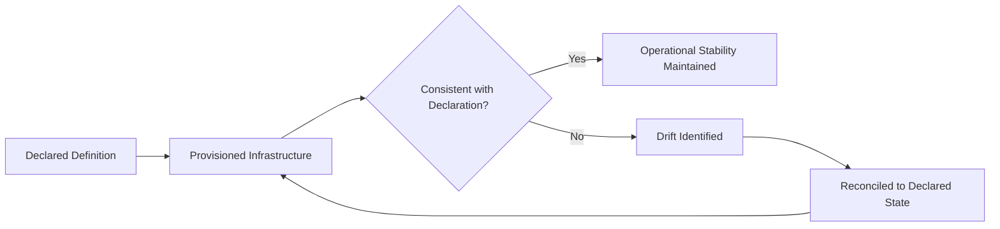
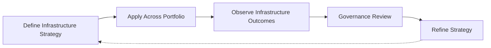

# Infrastructure as Code

## 1. Document Purpose

This document defines the enterprise strategy for Infrastructure as Code at **StackLeo** — the philosophy, lifecycle, and governance that treat the platform's infrastructure as a versioned, declarative, reviewable asset, without recommending specific IaC tools, cloud providers, or infrastructure templates.

- **Purpose of Infrastructure as Code** — to ensure that the platform's runtime foundation is defined, provisioned, and evolved through a trustworthy, repeatable process, so that infrastructure state is always knowable and never dependent on undocumented, manually performed action.
- **Relationship with DevOps** — this document is the infrastructure-specific elaboration of the Everything as Code principle defined in `devops-principles.md`, extending the same discipline applied to application code to the environments that code runs on.
- **Relationship with Platform Engineering** — declarative, well-governed infrastructure is the foundation `platform-engineering.md` depends on to offer consistent, self-service infrastructure capability to engineering teams.
- **Relationship with Cloud Strategy** — this document defines infrastructure philosophy independent of any specific cloud provider, ensuring StackLeo's approach to infrastructure remains coherent regardless of where or how it is ultimately hosted.
- **Relationship with Operational Excellence** — infrastructure defined as code is a precondition for the consistency and predictability that `reliability.md` and `monitoring.md` depend on; infrastructure that cannot be reliably reproduced cannot be reliably operated.
- **Relationship with Business Agility** — the ability to provision, scale, and evolve infrastructure quickly and safely directly determines how fast StackLeo can respond to business growth, seasonal demand, and market expansion.

This document is implementation-independent and vendor-neutral. It defines infrastructure philosophy, lifecycle, and governance conceptually — not specific tools, providers, or infrastructure templates.

## 2. Infrastructure Philosophy

- **Infrastructure as Managed Assets** — infrastructure definitions are treated with the same seriousness, review, and version history as application code, not as informal, one-off setup activity.
- **Declarative Infrastructure** — infrastructure is defined by describing its intended end state, rather than by the sequence of manual steps used to reach it.
- **Automation First** — the provisioning and modification of infrastructure is automated by default, removing manual, person-executed steps as a source of variance and error.
- **Immutable Infrastructure Awareness** — infrastructure components are, wherever practical, replaced rather than modified in place, reducing the accumulation of undocumented, incremental change.
- **Repeatability** — the same declared definition reliably produces the same infrastructure outcome, regardless of when or where it is applied.
- **Consistency** — equivalent environments are provisioned from equivalent definitions, so confidence gained in one environment transfers reliably to another.
- **Continuous Improvement** — infrastructure practice is expected to mature as the platform, organization, and operating scale evolve.

*Diagram 3: Declarative Infrastructure Model — infrastructure begins from a declared definition, is provisioned automatically, and is continuously compared against that declaration, with any divergence reconciled back to the intended state.*

## 3. Infrastructure Lifecycle

### Planning

- **Purpose** — determine what infrastructure capability is genuinely needed before defining it.
- **Business Value** — prevents infrastructure from being provisioned without a clear, agreed purpose.
- **Governance Objectives** — ensure every infrastructure definition can be traced back to a deliberate need.

### Design

- **Purpose** — shape the intended structure and characteristics of the infrastructure to meet planned needs.
- **Business Value** — ensures infrastructure decisions are made deliberately, consistent with `03_System_Design/deployment-architecture.md`.
- **Governance Objectives** — ensure design decisions are reviewed before implementation begins.

### Definition

- **Purpose** — express the designed infrastructure as a declarative, versioned definition.
- **Business Value** — makes infrastructure state explicit, reviewable, and reproducible.
- **Governance Objectives** — ensure infrastructure is never defined outside of governed, version-controlled processes.

### Validation

- **Purpose** — confirm the infrastructure definition is correct, complete, and free of obvious risk before it is applied.
- **Business Value** — catches infrastructure mistakes before they affect a running environment.
- **Governance Objectives** — treat infrastructure validation as a required step, not an assumption of correctness.

### Provisioning Awareness

- **Purpose** — apply a validated definition to bring infrastructure into its intended, real-world state.
- **Business Value** — ensures infrastructure is created consistently, matching its declared definition exactly.
- **Governance Objectives** — ensure provisioning always originates from a validated, approved definition.

### Active Operations

- **Purpose** — support the infrastructure's intended function during its primary period of use.
- **Business Value** — delivers the operational capacity and capability the infrastructure exists to provide.
- **Governance Objectives** — ensure infrastructure in active use remains consistent with its declared definition.

### Modernization

- **Purpose** — deliberately update infrastructure definitions to remain consistent with evolving standards and needs.
- **Business Value** — keeps mature infrastructure sustainable rather than allowing it to become a growing liability.
- **Governance Objectives** — prevent long-lived infrastructure from silently diverging from current governance expectations.

### Retirement

- **Purpose** — formally decommission infrastructure that is no longer needed.
- **Business Value** — reduces ongoing operational cost and the security surface area the organization must maintain.
- **Governance Objectives** — ensure retirement is a deliberate, recorded decision rather than an unexplained cessation of use.

### Continuous Review

- **Purpose** — periodically reassess the infrastructure portfolio for continued necessity and appropriate scale.
- **Business Value** — prevents unnecessary or oversized infrastructure from accumulating unnoticed cost and risk.
- **Governance Objectives** — ensure review occurs on a defined cadence, not only when a problem forces it.

*Diagram 1: Enterprise Infrastructure Lifecycle — infrastructure moves from planning and design through declarative definition and validation, into provisioned, active use, cycling through modernization and periodic review until deliberate retirement.*

### Infrastructure Lifecycle Matrix

| Stage | Purpose | Business Value |
|---|---|---|
| Planning | Determine genuinely needed infrastructure capability | Prevents infrastructure without clear, agreed purpose |
| Design | Shape intended structure and characteristics | Ensures deliberate, architecture-aligned decisions |
| Definition | Express design as declarative, versioned definition | Makes infrastructure state explicit and reproducible |
| Validation | Confirm correctness before application | Catches mistakes before they affect a running environment |
| Provisioning Awareness | Apply validated definition to reach real state | Ensures infrastructure matches its declared definition |
| Active Operations | Support infrastructure's intended function | Delivers the operational capacity it exists to provide |
| Modernization | Deliberately update definitions over time | Keeps mature infrastructure sustainable |
| Retirement | Formally decommission unneeded infrastructure | Reduces ongoing cost and security surface area |
| Continuous Review | Periodically reassess necessity and scale | Prevents unnecessary cost and risk accumulation |

## 4. Infrastructure Principles

### Standardization

- **Purpose** — apply common, well-understood patterns to infrastructure definitions across teams.
- **Business Value** — makes infrastructure knowledge transferable and reduces onboarding and coordination cost.
- **Strategic Objectives** — minimize unnecessary variation between teams solving structurally similar infrastructure needs.

### Modularity

- **Purpose** — structure infrastructure definitions as coherent, independently understandable units.
- **Business Value** — reduces the cognitive cost of understanding and safely changing any single piece of infrastructure.
- **Strategic Objectives** — make infrastructure definitions composable rather than monolithic.

### Reusability

- **Purpose** — make well-defined infrastructure patterns available for reuse across teams and services.
- **Business Value** — reduces duplicated effort and the risk of divergent, inconsistent infrastructure implementations.
- **Strategic Objectives** — make reuse the easier path relative to redefinition.

### Scalability

- **Purpose** — ensure infrastructure definitions accommodate growth in load, team size, and business complexity.
- **Business Value** — protects the business's ability to grow without infrastructure practice becoming a bottleneck.
- **Strategic Objectives** — design for the platform's next order of magnitude, not only its current state.

### Policy Alignment

- **Purpose** — ensure infrastructure definitions are consistent with organizational security, cost, and operational policy.
- **Business Value** — prevents infrastructure from introducing risk or cost the organization has not knowingly accepted.
- **Strategic Objectives** — make policy compliance a built-in property of infrastructure definitions, not a separate check.

### Traceability

- **Purpose** — ensure every piece of infrastructure can be traced back to the definition, decision, and approval that produced it.
- **Business Value** — supports impact analysis when infrastructure or architectural decisions change.
- **Strategic Objectives** — keep infrastructure provenance discoverable at all times.

### Auditability

- **Purpose** — ensure infrastructure changes are traceable to their author, reasoning, and approval.
- **Business Value** — supports investigation, compliance, and organizational trust in the infrastructure record.
- **Strategic Objectives** — treat every infrastructure change as a potential future audit artifact.

### Security Collaboration

- **Purpose** — embed the protection principles defined in `06_Security` directly into infrastructure definitions.
- **Business Value** — prevents security from becoming a late-stage blocker or an afterthought discovered only through incidents.
- **Strategic Objectives** — make secure-by-default the natural outcome of following this strategy.

### Infrastructure Principle Matrix

| Principle | Purpose | Strategic Objective |
|---|---|---|
| Standardization | Apply common patterns across teams | Minimize unnecessary variation |
| Modularity | Structure definitions as coherent units | Make definitions composable, not monolithic |
| Reusability | Make patterns available for reuse | Make reuse easier than redefinition |
| Scalability | Accommodate growth in load and complexity | Design for the platform's next order of magnitude |
| Policy Alignment | Consistency with security, cost, and operational policy | Make compliance built-in, not a separate check |
| Traceability | Trace infrastructure to its definition and decision | Keep provenance discoverable at all times |
| Auditability | Trace changes to author, reasoning, and approval | Treat every change as a potential audit artifact |
| Security Collaboration | Embed protection principles into definitions | Make secure-by-default the natural outcome |

## 5. Infrastructure Governance

- **Ownership** — every category of infrastructure has a clearly identified owning team accountable for its correctness, currency, and cost.
- **Review Process** — significant infrastructure changes are reviewed before application, consistent with the review discipline in `03_System_Design/architecture-decisions.md`.
- **Change Governance** — infrastructure changes follow a defined, consistent process, particularly for production-affecting infrastructure.
- **Documentation Alignment** — infrastructure is documented in terms of its purpose, structure, and ownership, kept current as it evolves.
- **Compliance Awareness** — infrastructure governance is maintained with awareness of the regulatory and audit expectations that accompany StackLeo's growing business scope.
- **Risk Management** — infrastructure decisions deliberately account for the risk they introduce, consistent with the risk-based approach in `06_Security/security-principles.md`.

*Diagram 2: Infrastructure Governance Framework — ownership, review, and change governance converge on consistently governed infrastructure, sustaining documentation currency, compliance awareness, and deliberate risk management.*

### Infrastructure Governance Matrix

| Governance Area | Focus | Accountable For |
|---|---|---|
| Ownership | Clearly identified owning team per category | Correctness, currency, and cost of owned infrastructure |
| Review Process | Review before significant change is applied | Preventing unreviewed infrastructure change |
| Change Governance | Defined, consistent change process | Ensuring changes follow the same governed path |
| Documentation Alignment | Purpose, structure, and ownership documented | Understandable infrastructure for any reader |
| Compliance Awareness | Alignment with regulatory and audit expectations | Governance that scales with business complexity |
| Risk Management | Deliberate assessment of introduced risk | Infrastructure decisions with knowingly accepted risk |

## 6. Infrastructure Consistency

- **Environment Consistency** — infrastructure provisioned for equivalent environments, consistent with `environment-management.md`, is structurally comparable, preserving the value of validation performed earlier in the pipeline.
- **Provisioning Consistency** — the same declared definition produces the same infrastructure outcome regardless of when, where, or by whom it is applied.
- **Configuration Awareness** — infrastructure definitions remain aware of, and consistent with, the configuration principles defined in `configuration-management.md`.
- **Drift Awareness** — actual infrastructure state is continuously compared against its declared definition, so divergence is detected rather than silently accumulating.
- **Validation** — infrastructure is validated for correctness both before and after it is provisioned, not assumed correct by default.
- **Operational Stability** — infrastructure consistency is a direct precondition for operational stability; unmanaged infrastructure drift is a leading, avoidable source of instability.

*Diagram 4: Infrastructure Consistency Flow — provisioned infrastructure is continuously checked against its declared definition; identified drift is reconciled back to the intended state, sustaining operational stability.*

### Infrastructure Consistency Matrix

| Consistency Dimension | Focus | Risk Reduced |
|---|---|---|
| Environment Consistency | Comparable infrastructure across equivalent environments | Loss of confidence transferred from earlier validation |
| Provisioning Consistency | Same definition produces same outcome | Unpredictable, context-dependent infrastructure behavior |
| Configuration Awareness | Alignment with configuration management principles | Conflicting or duplicated governance between the two domains |
| Drift Awareness | Continuous comparison of actual vs. declared state | Silent accumulation of undetected divergence |
| Validation | Correctness confirmed before and after provisioning | Preventable infrastructure-caused failures |
| Operational Stability | Direct dependency on managed infrastructure | Avoidable, infrastructure-caused instability |

## 7. Future Readiness

- **Cloud-Native Platforms** — infrastructure principles are defined independent of any specific provider, allowing adoption of elastic, provider-hosted infrastructure without redefining this strategy.
- **Kubernetes** — modularity and standardization principles extend naturally to container orchestration concepts, consistent with `kubernetes-strategy.md`, without requiring a separate infrastructure philosophy.
- **Platform Engineering** — infrastructure governance and provisioning are structured to be delivered as self-service platform capability, consistent with `platform-engineering.md`.
- **Microservices** — as capability decomposes into a growing number of independently deployable services, modular, reusable infrastructure definitions scale without requiring redefinition.
- **AI Systems** — infrastructure supporting AI-assisted capability, including specialized compute needs, is governed under the same declarative, reviewed principles as any other infrastructure.
- **Marketplace Platform** — as StackLeo evolves toward business sales, corporate accounts, wholesale, and a multi-vendor marketplace, infrastructure scalability principles accommodate growing transaction and integration volume without redefinition.
- **Multi-Region Operations** — as StackLeo expands from Bangladesh into South Asia and, over time, global markets, infrastructure consistency principles extend to multiple regions without disrupting core governance.
- **Global Engineering Teams** — infrastructure governance remains independent of contributor location, supporting distributed teams working across a shared infrastructure portfolio.

## 8. Governance

- **Ownership** — a designated infrastructure governance owner is accountable for the coherence and enforcement of this strategy across the full infrastructure portfolio.
- **Review Process** — significant changes to infrastructure lifecycle, principles, or governance expectations are reviewed consistent with the review discipline in `03_System_Design/architecture-decisions.md`.
- **Infrastructure Policies** — individual teams may define infrastructure detail consistent with this strategy, but may not bypass its governance or consistency principles.
- **Audit Readiness** — infrastructure definitions, change records, and provisioning history are maintained in a state that supports audit and investigation at any time.
- **Continuous Improvement** — infrastructure strategy is expected to mature as the platform, organization, and operational scale evolve, consistent with `devops-principles.md`.

*Diagram 5: Continuous Infrastructure Improvement Cycle — infrastructure strategy is applied across the portfolio, its outcomes observed, reviewed by governance, and refined, with refinements feeding directly back into the strategy.*

### Governance Responsibility Matrix

| Governance Area | Owner | Accountable For |
|---|---|---|
| Ownership | Infrastructure Governance Owner | Coherence and enforcement of this strategy |
| Review Process | Architecture & Platform Teams | Reviewing changes to lifecycle and principles |
| Infrastructure Policies | Infrastructure Owning Teams | Detail consistent with enterprise governance principles |
| Audit Readiness | Platform & Security Teams | Infrastructure records ready for audit at any time |
| Continuous Improvement | DevOps / Platform Engineering | Maturing strategy as platform and scale evolve |

## 9. Anti-Patterns

- **Manual Infrastructure Changes** — modifying infrastructure through untracked, manual intervention rather than a declared, versioned definition. This introduces variance and makes actual state diverge from documented, approved state.
- **Configuration Drift** — allowing provisioned infrastructure to silently diverge from its declared definition. This undermines confidence in what is actually running and makes incidents harder to diagnose.
- **Weak Governance** — allowing infrastructure creation, change, and retirement to proceed without consistent standards or review. This produces an unmanageable, untrustworthy infrastructure landscape as the organization scales.
- **Poor Documentation** — allowing infrastructure's purpose, structure, or ownership to go undocumented. This makes infrastructure difficult for anyone but its original authors to understand or safely engage with.
- **Tight Coupling** — defining infrastructure components that depend heavily on each other's internal detail rather than well-defined interfaces. This prevents independent evolution and turns unrelated changes into cross-cutting risk.
- **Missing Validation** — applying infrastructure definitions without confirming their correctness beforehand. This shifts defect discovery to production rather than the definition and review stage.
- **Reactive Infrastructure Management** — addressing infrastructure discipline only after an incident traced back to infrastructure inconsistency occurs. This means avoidable disruption, rather than deliberate design, drives improvement.
- **Uncontrolled Growth** — allowing infrastructure to be provisioned without deliberate planning or ongoing review. This produces unnecessary cost and an expanding, unmanaged operational and security surface area.

### Anti-Pattern Summary

| Anti-Pattern | Why It Must Be Avoided |
|---|---|
| Manual Infrastructure Changes | Actual state diverges from documented, approved state |
| Configuration Drift | Undermines confidence in what is actually running |
| Weak Governance | Produces an unmanageable, untrustworthy infrastructure landscape |
| Poor Documentation | Infrastructure becomes difficult for anyone but its authors to understand |
| Tight Coupling | Prevents independent evolution; unrelated change becomes cross-cutting risk |
| Missing Validation | Shifts defect discovery to production instead of definition and review |
| Reactive Infrastructure Management | Avoidable disruption, not deliberate design, drives improvement |
| Uncontrolled Growth | Produces unnecessary cost and an unmanaged operational surface area |

## 10. Document Information

| Property | Value |
|----------|-------|
| Document | infrastructure-as-code.md |
| Version | 1.0.0 |
| Status | Active |
| Maintained By | StackLeo |
| Last Updated | 2026-07-24 |

---

© StackLeo. All Rights Reserved.
