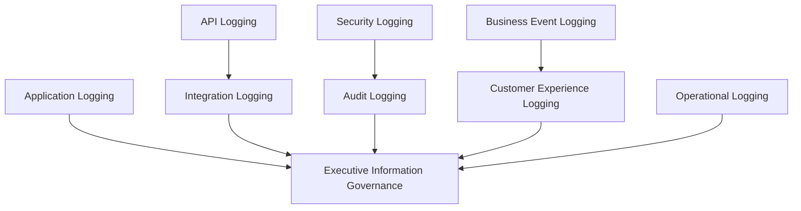
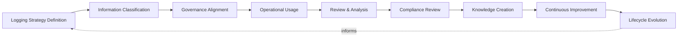
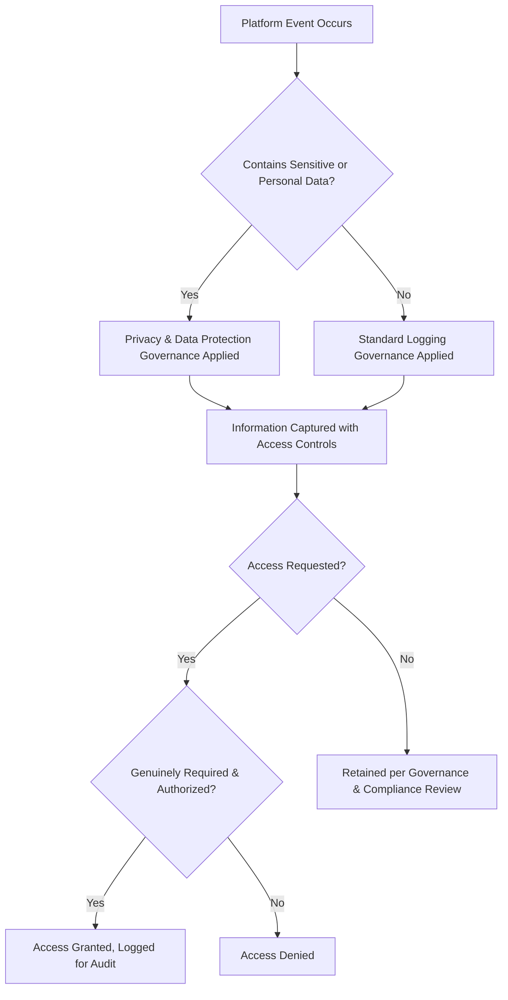
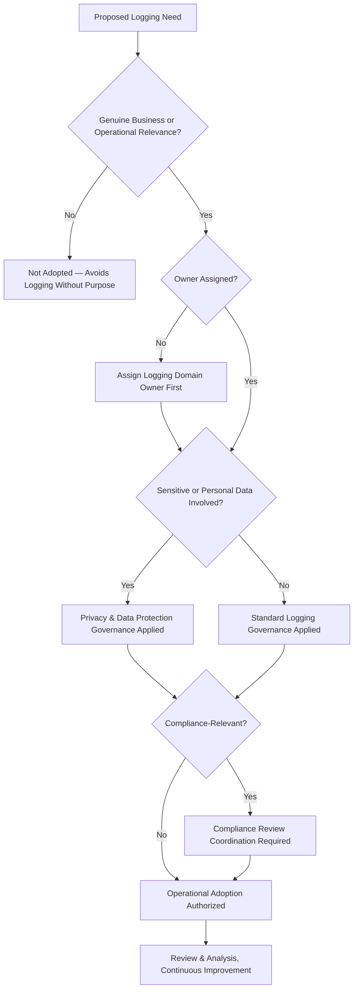
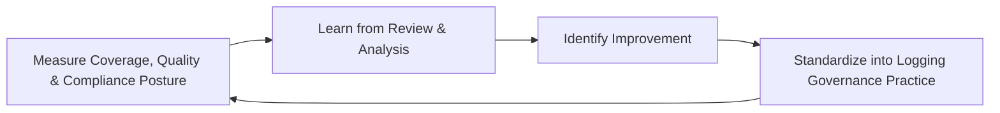
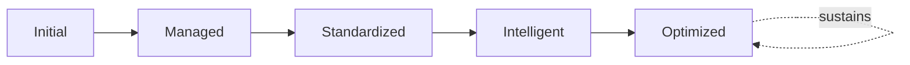

# Enterprise Logging Governance Framework

## 1. Executive Summary

**Purpose** — This document defines the official Enterprise Logging Governance Framework for **StackLeo Tech Store**. It establishes logging strategy, information governance, operational visibility, security alignment, auditability, ownership, lifecycle governance, executive oversight, and long-term logging maturity as a deliberate, accountable enterprise discipline. `observability-strategy.md` references logs as one of several telemetry types (Section 4, Logs); `monitoring-strategy.md` governs operational and business visibility across every telemetry type broadly. This framework does not duplicate either. It is the dedicated elevation of logging specifically — the one telemetry category that most directly carries discrete event detail, sensitive information, and audit evidence — into its own full governance treatment, with a distinct emphasis on information governance: what is logged, who may access it, how it is protected, and how it serves as trustworthy evidence.

**Scope** — This framework applies to every logging domain at StackLeo — application, API, security, business event, operational, audit, integration, and customer experience logging — across the full platform lifecycle, coordinated with `06_Security/data-protection.md`, `06_Security/privacy-governance.md`, and `06_Security/audit-governance.md`.

**Strategic Objectives** — To ensure logging captures genuinely meaningful information, not merely volume; that log data is protected consistent with its sensitivity; that logs remain trustworthy evidence for security investigation, audit, and compliance; and that executive leadership has continuous confidence in the organization's logging discipline.

**Business Value** — Governed logging protects the organization's ability to investigate, explain, and learn from what has genuinely happened on the platform, protects customer and business data from careless or excessive capture, and gives leadership confidence that log-based evidence is genuinely trustworthy when it matters most — during an incident, an audit, or an investigation.

**Intended Audience** — Executive leadership, the Chief Technology Officer, engineering leadership, DevOps leadership, development teams, security teams, operations teams, compliance functions, and business stakeholders.

## 2. Enterprise Logging Vision

- **Logging as Business Information Capability** — logging is governed as a genuine business information asset, never merely a technical debugging convenience.
- **Operational Visibility** — logs provide the detailed, sequential record `monitoring-strategy.md` and `observability-strategy.md` depend on to understand specific occurrences.
- **System Understanding** — logs capture events with enough context to be understood independently, consistent with `observability-strategy.md` (Section 4).
- **Security Awareness** — logs are governed as a first-class security asset, coordinated with `06_Security/security-monitoring.md`, supporting genuine investigation capability.
- **Audit Readiness** — logs are maintained in a form ready to serve as trustworthy evidence for internal or external audit at any time, coordinated with `06_Security/audit-governance.md`.
- **Reliability Improvement** — logs inform the reliability discipline governed in `sre-strategy.md`, converting past occurrence into future prevention.
- **Organizational Learning** — logged events, once understood, deepen the organization's genuine collective understanding of how the platform actually behaves.

### Enterprise Logging Vision Matrix

| Vision Element | Focus | Business Value |
|---|---|---|
| Logging as Business Information Capability | Genuine business information asset, not just debugging convenience | Prevents logging from being treated as a low-priority afterthought |
| Operational Visibility | Detailed, sequential record for understanding occurrences | Supports monitoring and observability with concrete evidence |
| System Understanding | Events captured with enough context to stand alone | Enables confident investigation without guesswork |
| Security Awareness | Logs as a first-class security investigation asset | Supports genuine security investigation capability |
| Audit Readiness | Logs maintained ready for audit at any time | Removes reactive, disruptive audit preparation |
| Reliability Improvement | Logs inform reliability discipline | Converts past occurrence into future prevention |
| Organizational Learning | Logged events deepen collective understanding | Converts logged evidence into durable organizational insight |

## 3. Logging Governance Principles

Logging governance at StackLeo rests on nine principles, each producing a specific business outcome.

- **Meaningful Information Over Volume** — logging is judged by the genuine understanding it enables, not by the sheer quantity of events captured. *Business Value:* protects investigative attention from being diluted by noise.
- **Data Integrity** — logged information is trusted to genuinely and accurately reflect what occurred. *Business Value:* protects the credibility of every decision or investigation that relies on log evidence.
- **Traceability** — every logged event can be connected to the specific request, transaction, or actor that produced it. *Business Value:* enables confident, end-to-end investigation of any given occurrence.
- **Security Awareness** — logging is governed with explicit awareness of its role in detecting and investigating security-relevant events, coordinated with `06_Security/security-governance.md`. *Business Value:* ensures logs genuinely support, rather than undermine, security investigation.
- **Privacy Responsibility** — logging never captures more sensitive or personal information than is genuinely necessary, coordinated with `06_Security/privacy-governance.md`. *Business Value:* protects customer trust and regulatory standing from careless over-capture.
- **Accountability** — every logging domain has a specific, named, responsible owner. *Business Value:* ensures no logging domain drifts without someone genuinely responsible for it.
- **Standardization** — logging follows a consistent, governed pattern across every domain and team. *Business Value:* reduces the variance that makes cross-system investigation difficult.
- **Business Context** — logged events are captured with genuine awareness of their business relevance, not only technical detail. *Business Value:* ensures logs answer real business questions, not only technical ones.
- **Continuous Improvement** — logging governance practice matures over time, informed by real investigative and audit outcomes. *Business Value:* keeps logging aligned with the organization's growing scale and complexity.

### Logging Governance Principles Matrix

| Principle | Description | Business Value |
|---|---|---|
| Meaningful Information Over Volume | Judged by understanding enabled, not quantity captured | Protects investigative attention from being diluted by noise |
| Data Integrity | Logged information trusted to accurately reflect events | Protects credibility of decisions relying on log evidence |
| Traceability | Every event connects to the request, transaction, or actor | Enables confident, end-to-end investigation |
| Security Awareness | Governed with explicit awareness of investigative role | Ensures logs genuinely support security investigation |
| Privacy Responsibility | Never captures more sensitive information than necessary | Protects customer trust and regulatory standing |
| Accountability | Every domain has a specific, named, responsible owner | Ensures no domain drifts without genuine ownership |
| Standardization | Consistent, governed pattern across domains and teams | Reduces variance that complicates cross-system investigation |
| Business Context | Events captured with genuine awareness of business relevance | Ensures logs answer real business questions |
| Continuous Improvement | Practice matures from real investigative and audit outcomes | Keeps governance aligned with growing scale and complexity |

## 4. Enterprise Logging Governance Model

Logging governance operates across nine conceptual domains, each holding accountability for a distinct dimension of logged information.

### Application Logging

- **Purpose** — govern logging of application-level behavior and business logic execution.
- **Governance Scope** — oversight coordinated with `08_QUALITY_ASSURANCE/defect-management-governance.md` for investigative support.
- **Business Value** — protects confidence that application behavior can be genuinely understood after the fact.
- **Executive Expectations** — leadership expects application logs to support investigation without excessive, unmanaged volume.

### API Logging

- **Purpose** — govern logging of interface interactions between internal components and external integration partners.
- **Governance Scope** — oversight coordinated with API Test Automation and integration boundary practice.
- **Business Value** — protects the ability to investigate boundary-crossing defects and integration failures.
- **Executive Expectations** — leadership expects API logging to capture sufficient context without exposing sensitive payload data unnecessarily.

### Security Logging

- **Purpose** — govern logging of security-relevant events, jointly with, and never superseding, `06_Security/security-monitoring.md`.
- **Governance Scope** — oversight ensuring security logs meet the rigor `06_Security/security-governance.md` requires.
- **Business Value** — protects StackLeo's core trust differentiator through genuine investigative capability.
- **Executive Expectations** — leadership expects security logging to be treated as mandatory, non-negotiable evidence.

### Business Event Logging

- **Purpose** — govern logging of genuine business transactions and outcomes flowing through the platform.
- **Governance Scope** — oversight coordinated with `01_Business/business-model.md` and Business Monitoring (`monitoring-strategy.md`, Section 4).
- **Business Value** — connects logged evidence directly to genuine business consequence.
- **Executive Expectations** — leadership expects business event logs to answer genuine business questions.

### Operational Logging

- **Purpose** — govern logging that supports how the platform is operated and sustained once live.
- **Governance Scope** — oversight coordinated with `09_OPERATIONS/operations-governance-strategy.md`.
- **Business Value** — protects the organization's ability to genuinely operate what it has built.
- **Executive Expectations** — leadership expects operational logs to extend genuinely beyond the moment of deployment.

### Audit Logging

- **Purpose** — govern logging that specifically serves as trustworthy evidence for internal and external audit.
- **Governance Scope** — oversight coordinated with `06_Security/audit-governance.md`, held to the highest integrity standard in this model.
- **Business Value** — removes the cost and disruption of reactive audit preparation.
- **Executive Expectations** — leadership expects audit logs to be tamper-evident and continuously ready for review.

### Integration Logging

- **Purpose** — govern logging of interaction with third-party vendors and integration partners.
- **Governance Scope** — oversight coordinated with `06_Security/third-party-risk-governance.md`.
- **Business Value** — protects the ability to investigate failures originating in a dependency the organization does not directly control.
- **Executive Expectations** — leadership expects integration logging to be sufficient to attribute failure to the correct party.

### Customer Experience Logging

- **Purpose** — govern logging that reflects the customer's genuine experience of the platform.
- **Governance Scope** — oversight coordinated with `09_OPERATIONS/service-level-governance.md`, with heightened privacy sensitivity.
- **Business Value** — protects the trust relationship every customer interaction depends on.
- **Executive Expectations** — leadership expects customer experience logging to balance genuine insight against Privacy Responsibility (Section 3).

### Executive Information Governance

- **Purpose** — govern the synthesized, executive-relevant picture of logging health and information governance across every domain above.
- **Governance Scope** — oversight exclusively accountable for converging every domain into one coherent enterprise picture.
- **Business Value** — protects leadership's ability to understand overall logging discipline as a whole, not domain by domain.
- **Executive Expectations** — leadership expects one coherent logging governance picture, not nine disconnected domain views.

### Logging Governance Matrix

| Domain | Purpose | Business Value | Executive Expectations |
|---|---|---|---|
| Application Logging | Govern logging of application behavior and business logic | Protects confidence application behavior can be understood | Expects support for investigation without excessive volume |
| API Logging | Govern logging of interface interactions | Protects ability to investigate boundary-crossing failures | Expects sufficient context without unnecessary payload exposure |
| Security Logging | Govern logging of security-relevant events | Protects StackLeo's core trust differentiator | Expects treatment as mandatory, non-negotiable evidence |
| Business Event Logging | Govern logging of genuine business transactions | Connects logged evidence to genuine business consequence | Expects logs to answer genuine business questions |
| Operational Logging | Govern logging supporting sustained operation | Protects the ability to genuinely operate what is built | Expects logging extending genuinely beyond deployment |
| Audit Logging | Govern logging serving as trustworthy audit evidence | Removes cost and disruption of reactive preparation | Expects tamper-evident, continuously ready evidence |
| Integration Logging | Govern logging of third-party vendor interaction | Protects ability to attribute failure to the correct party | Expects sufficient detail for accurate attribution |
| Customer Experience Logging | Govern logging reflecting genuine customer experience | Protects the trust relationship every interaction depends on | Expects balance against privacy responsibility |
| Executive Information Governance | Synthesize the enterprise logging governance picture | Protects leadership's ability to understand discipline as a whole | Expects one coherent picture, not nine disconnected views |

*Diagram 1: Enterprise Logging Governance Framework — application, API, and integration logging converge with security and audit logging, and business event and customer experience logging, alongside operational logging, on executive information governance, which synthesizes every domain into one coherent enterprise picture.*

## 5. Logging Capability Domains

Logging governance is exercised across eight conceptual capability domains, each requiring a distinct governance emphasis.

- **Information Visibility** — governs whether genuinely relevant events are captured and available when needed.
- **Event Understanding** — governs whether a captured event carries enough context to be understood independently.
- **Operational Analysis** — governs how logged information supports understanding of operational health and behavior.
- **Security Investigation Capability** — governs whether logs genuinely support security investigation when required.
- **Compliance Evidence** — governs whether logs serve as trustworthy evidence for regulatory and contractual obligation.
- **Business Insight** — governs whether logged information genuinely informs business understanding.
- **Reliability Improvement** — governs how logged evidence feeds back into strengthening platform reliability.
- **Organizational Learning** — governs how understanding gained from logs deepens genuine collective capability.

### Logging Capability Domain Matrix

| Domain | Governance Focus | Coordination |
|---|---|---|
| Information Visibility | Genuinely relevant events captured and available | Application, API, and Operational Logging (Section 4) |
| Event Understanding | Sufficient context for independent understanding | `observability-strategy.md` (Section 4) |
| Operational Analysis | Support for understanding operational health | Operational Monitoring (`monitoring-strategy.md`, Section 4) |
| Security Investigation Capability | Genuine support for security investigation | `06_Security/security-monitoring.md` |
| Compliance Evidence | Trustworthy evidence for regulatory obligation | `06_Security/audit-governance.md`, `06_Security/compliance-governance.md` |
| Business Insight | Genuine informing of business understanding | Business Event Logging (Section 4) |
| Reliability Improvement | Evidence strengthening platform reliability | `sre-strategy.md` |
| Organizational Learning | Understanding deepening collective capability | Continuous Improvement (Section 3) |

## 6. Logging Lifecycle Governance

Logging governance operates across nine conceptual lifecycle stages.

- **Logging Strategy Definition** — govern how the organization decides what genuinely warrants logging, and why.
- **Information Classification** — govern how a category of logged information is classified by sensitivity and business relevance.
- **Governance Alignment** — govern how a logging initiative is aligned to the appropriate domain in Section 4.
- **Operational Usage** — govern how logged information is genuinely used in day-to-day operational practice.
- **Review & Analysis** — govern the periodic, formal review of logged information for genuine insight.
- **Compliance Review** — govern the periodic confirmation that logging meets genuine regulatory and contractual obligation.
- **Knowledge Creation** — govern how understanding gained from logs is captured as durable organizational knowledge.
- **Continuous Improvement** — govern how logging practice is deliberately strengthened based on real investigative outcomes.
- **Lifecycle Evolution** — govern the periodic reassessment of whether logging priorities remain aligned with evolving business and technical need.

### Logging Lifecycle Matrix

| Stage | Governance Objective | Business Value |
|---|---|---|
| Logging Strategy Definition | Decide what genuinely warrants logging | Ensures logging effort is deliberately directed |
| Information Classification | Classify information by sensitivity and relevance | Ensures protection and access proportionate to sensitivity |
| Governance Alignment | Align an initiative to the appropriate domain | Ensures review by the genuinely accountable function |
| Operational Usage | Ensure information is genuinely used in practice | Prevents logging investment going unused |
| Review & Analysis | Periodically review for genuine insight | Confirms logging investment is genuinely working |
| Compliance Review | Confirm genuine regulatory and contractual adherence | Protects standing with regulators and counterparties |
| Knowledge Creation | Capture understanding as durable organizational knowledge | Converts logged evidence into lasting organizational insight |
| Continuous Improvement | Strengthen practice from real investigative outcomes | Keeps logging practice compounding in capability |
| Lifecycle Evolution | Reassess alignment with evolving business and technical need | Keeps logging genuinely connected to business intent |

*Diagram 2: Logging Lifecycle Governance Model — strategy definition and information classification inform governance alignment and operational usage, feeding review, compliance confirmation, and knowledge creation, with continuous improvement and lifecycle evolution feeding lessons back into the cycle.*

## 7. Logging Information Governance

- **Business-Relevant Information** — logged content is governed to reflect genuine business and operational relevance, not incidental technical detail.
- **Sensitive Information Awareness** — logging is governed with explicit awareness of when sensitive or personal information may be present, coordinated with `06_Security/data-loss-prevention.md`.
- **Privacy Considerations** — logged information is governed consistent with `06_Security/privacy-governance.md` and `06_Security/privacy.md`, never capturing more than genuinely necessary.
- **Data Responsibility** — logged information is treated as a genuine data asset requiring the same protection discipline as any other, coordinated with `06_Security/data-protection.md`.
- **Access Governance** — access to logged information is limited to what is genuinely required, proportionate to its sensitivity.
- **Auditability** — logged information and its access history are maintained in a form ready for independent review at any time.
- **Information Quality** — logged information is governed for genuine accuracy and completeness, not merely presence.

### Information Governance Matrix

| Governance Area | Focus | Coordination |
|---|---|---|
| Business-Relevant Information | Genuine business and operational relevance | Business Event Logging (Section 4) |
| Sensitive Information Awareness | Explicit awareness of sensitive or personal data presence | `06_Security/data-loss-prevention.md` |
| Privacy Considerations | Never capturing more than genuinely necessary | `06_Security/privacy-governance.md`, `06_Security/privacy.md` |
| Data Responsibility | Logged information treated as a genuine, protected data asset | `06_Security/data-protection.md` |
| Access Governance | Access limited to what is genuinely required | `06_Security/privileged-access-management.md` |
| Auditability | Information and access history ready for independent review | `06_Security/audit-governance.md` |
| Information Quality | Genuine accuracy and completeness, not merely presence | Data Integrity (Section 3) |

*Diagram 3: Logging Information Flow — a platform event is classified for sensitive or personal data, with protective governance applied where relevant, before capture with access controls, and every access request itself authorized and logged for audit.*

## 8. Organizational Governance

Governance accountability is distributed deliberately across nine organizational roles.

- **Executive Leadership** — holds ultimate accountability for whether logging genuinely serves as trustworthy organizational information.
- **CTO** — owns the coherence and enforcement of this framework across every logging domain and governance layer it defines.
- **Engineering Leadership** — owns Application and API Logging (Section 4) within their accountable teams.
- **DevOps Leadership** — owns Operational Logging (Section 4) in coordination with `devops-governance-framework.md`.
- **Development Teams** — own the instrumentation of logging within their assigned capability.
- **Security Teams** — own Security and Audit Logging (Section 4) jointly with `06_Security/security-governance.md`, which remains authoritative for security-specific obligations.
- **Operations Teams** — own Operational Logging (Section 4) in coordination with `09_OPERATIONS/operations-governance-strategy.md`.
- **Compliance Functions** — own Compliance Review (Section 6) in coordination with `06_Security/compliance-governance.md` and `06_Security/audit-governance.md`.
- **Business Stakeholders** — own Business Event Logging (Section 4) alignment with genuine business priority.

### Organizational Responsibility Matrix

| Role | Governance Objective | Business Value |
|---|---|---|
| Executive Leadership | Hold ultimate accountability for trustworthy logging | Provides a single point of ultimate accountability |
| CTO | Own coherence and enforcement of this framework | Provides a single point of specialist accountability |
| Engineering Leadership | Own application and API logging | Embeds logging accountability closest to where events occur |
| DevOps Leadership | Own operational logging | Keeps logging coordinated with broader DevOps governance |
| Development Teams | Own instrumentation within their assigned capability | Ensures logging is designed in, not added after the fact |
| Security Teams | Own security and audit logging jointly with security governance | Ensures logs genuinely support investigation and evidence |
| Operations Teams | Own operational logging | Ensures accountability extends beyond deployment into operation |
| Compliance Functions | Own compliance review | Ensures logging genuinely meets regulatory obligation |
| Business Stakeholders | Own business event logging alignment with priority | Connects logging to genuine business relevance |

*Diagram 4: Logging Governance Decision Flow — a proposed logging need is checked for genuine relevance and assigned ownership, with privacy governance applied where sensitive data is involved and compliance coordination required where relevant, resolving into authorized adoption and ongoing review.*

## 9. Logging Risk Governance

Logging-related risk is governed across eight conceptual categories.

- **Missing Visibility** — the risk that a genuinely important event goes unlogged.
- **Excessive Information** — the risk that logging volume obscures genuine insight and burdens storage and review.
- **Poor Data Quality** — the risk that logged information is inaccurate, incomplete, or misleading.
- **Privacy Risks** — the risk that sensitive or personal information is captured or exposed without adequate protection.
- **Security Risks** — the risk that logging itself introduces a security weakness, such as exposing credentials or sensitive payloads.
- **Compliance Risks** — the risk that logging fails to meet a genuine regulatory or contractual obligation.
- **Operational Blind Spots** — the risk that a genuinely important operational condition remains unobserved due to a logging gap.
- **Information Misuse** — the risk that logged information is accessed or used beyond its genuine, authorized purpose.

### Risk Governance Matrix

| Risk Category | Focus | Governance Coordination |
|---|---|---|
| Missing Visibility | A genuinely important event goes unlogged | Coordinated with Information Visibility (Section 5) |
| Excessive Information | Volume obscuring genuine insight | Coordinated with Meaningful Information Over Volume (Section 3) |
| Poor Data Quality | Inaccurate, incomplete, or misleading information | Coordinated with Data Integrity (Section 3) |
| Privacy Risks | Sensitive or personal information exposed | Coordinated with `06_Security/privacy-governance.md` |
| Security Risks | Logging itself introducing a security weakness | Coordinated with `06_Security/security-governance.md` |
| Compliance Risks | Failure to meet regulatory or contractual obligation | Coordinated with `06_Security/compliance-governance.md` |
| Operational Blind Spots | Important condition unobserved due to a gap | Coordinated with Operational Logging (Section 4) |
| Information Misuse | Access or use beyond authorized purpose | Coordinated with Access Governance (Section 7) |

## 10. Executive Oversight

- **Logging Governance Reviews** — the overall coherence of logging governance is formally reviewed on a regular cadence.
- **Security Visibility Reviews** — security and audit logging sufficiency is reviewed directly with executive leadership.
- **Compliance Reviews** — logging adherence to regulatory and contractual obligation is periodically reviewed with executive leadership.
- **Operational Intelligence Reviews** — the genuine operational insight produced by logging is reviewed as a distinct, ongoing concern.
- **Executive Reporting** — aggregated logging health — coverage, information quality, compliance posture — is reported to executive leadership and the Board.
- **Continuous Improvement Reviews** — the organization's follow-through on captured logging governance lessons is reviewed directly with executive leadership.

### Executive Oversight Matrix

| Oversight Mechanism | Purpose | Governance Role |
|---|---|---|
| Logging Governance Reviews | Confirm overall logging governance coherence | Regular, predictable cadence for the framework as a whole |
| Security Visibility Reviews | Review security and audit logging sufficiency | Direct executive-level review of investigative readiness |
| Compliance Reviews | Review adherence to regulatory and contractual obligation | Periodic executive-level compliance review |
| Operational Intelligence Reviews | Review genuine operational insight produced by logging | Treats insight quality as ongoing, not assumed |
| Executive Reporting | Provide leadership a single, coherent logging picture | Reports coverage, information quality, compliance posture |
| Continuous Improvement Reviews | Review follow-through on captured lessons | Direct executive-level review of improvement completion |

## 11. Future Readiness

This framework is designed to remain valid as StackLeo evolves in scale, geography, and organizational complexity.

- **AI-Assisted Log Intelligence** — as review and analysis increasingly incorporate AI-assisted methods, they remain governed under Review & Analysis (Section 6) at the same rigor as any other method.
- **Intelligent Event Analysis** — where event understanding increasingly draws on intelligent pattern analysis, that analysis remains subject to Event Understanding (Section 5).
- **Predictive Operations** — where the organization develops the capability to anticipate an operational issue from logged patterns, that capability is governed as an extension of Reliability Improvement (Section 5).
- **Automated Insight Generation (Conceptual)** — where automation increasingly performs steps within Review & Analysis or Knowledge Creation (Section 6), that automation remains subject to the same ownership and executive oversight as any human-performed activity.
- **Enterprise Scale** — the governance model, domains, and lifecycle defined throughout this framework are defined independently of organizational size.
- **Global Operations** — Logging Strategy Definition and Information Classification (Section 6) are structured to be re-applied as StackLeo expands from Bangladesh into South Asia and global markets, each with genuinely distinct privacy and regulatory considerations.
- **Digital Intelligence Platforms** — this framework's governance discipline is treated as a direct contributor to the digital trust customers, partners, and regulators extend to StackLeo.

## 12. Logging Maturity Model

Logging governance maturity is described across five conceptual levels.

- **Initial** — logging, where it exists, is informal and inconsistent; events are captured reactively, and ownership is unclear.
- **Managed** — basic logging governance exists for individual domains, but consistency across the nine domains in Section 4 varies significantly.
- **Standardized** — the governance model, domains, and lifecycle are standardized, documented, and consistently applied across the organization.
- **Intelligent** — logging governance draws systematically on accumulated evidence and pattern analysis to inform genuinely proactive insight.
- **Optimized** — logging governance is continuously and deliberately improved based on quantitative evidence and organizational learning; improvement itself is a managed, ongoing discipline.

### Logging Maturity Matrix

| Level | Characteristics | Primary Focus |
|---|---|---|
| Initial | Informal, inconsistent logging; events captured reactively | Ad hoc, individually-dependent logging practice |
| Managed | Basic governance exists per domain; consistency varies | Domain-level consistency |
| Standardized | Standardized governance model, domains, and lifecycle | Organization-wide consistency and clear ownership |
| Intelligent | Governance draws systematically on evidence and pattern analysis | Proactive, evidence-informed logging insight |
| Optimized | Practice continuously and deliberately improved from evidence | Sustained, deliberate improvement as a discipline |

*Diagram 5: Continuous Logging Improvement Cycle — logging coverage, quality, and compliance posture are measured, learned from, improved upon, and standardized back into governed practice, on a continuing basis.*

*Diagram 6: Logging Maturity Progression — maturity advances from informal, reactively-captured logging practice toward standardized, intelligently informed, and continuously optimized logging governance.*

## 13. Logging Anti-Patterns

- **Logging Without Purpose** — capturing events without a genuine, governed reason produces volume without direction.
- **Excessive Data Collection** — capturing more than is genuinely necessary burdens storage and review while increasing privacy exposure.
- **Missing Business Context** — logging that captures only technical detail without business relevance fails to answer genuine business questions.
- **Poor Ownership** — a logging domain with no accountable owner has no one genuinely responsible for its coverage or quality.
- **Weak Security Awareness** — logging that fails to consider its own security implications can itself become a source of exposure.
- **Inconsistent Standards** — logging that varies by team or system produces information that cannot be genuinely compared or correlated.
- **Missing Auditability** — logging that cannot itself be verified or traced undermines its value as trustworthy evidence.
- **Reactive Analysis** — reviewing logged information only after a problem is already visible forfeits the chance to detect it proactively.

### Anti-Pattern Summary

| Anti-Pattern | Business Impact |
|---|---|
| Logging Without Purpose | Produces volume without direction, wasting investment |
| Excessive Data Collection | Burdens storage and review while increasing privacy exposure |
| Missing Business Context | Fails to answer genuine business questions |
| Poor Ownership | Leaves no one genuinely responsible for coverage or quality |
| Weak Security Awareness | Logging itself can become a source of security exposure |
| Inconsistent Standards | Produces information that cannot be genuinely compared or correlated |
| Missing Auditability | Undermines logging's value as trustworthy evidence |
| Reactive Analysis | Forfeits the chance to detect problems proactively |

## Related Documents

| Document | Relationship |
|---|---|
| `monitoring-strategy.md` | Consumes this framework's logged information as part of broader operational and business visibility. |
| Observability Framework (conceptual future companion) | An anticipated deeper technical elaboration of instrumentation practice this framework's logs contribute to. |
| Metrics Governance (conceptual future companion) | An anticipated sibling governance treatment for metric data, distinct from this framework's discrete-event focus. |
| Alerting Governance (conceptual future companion) | An anticipated dedicated governance treatment of how logged and monitored signals become alerts. |
| Incident Observability (conceptual future companion) | An anticipated elaboration of how logged evidence supports `incident-management.md` and `09_OPERATIONS/incident-management-governance.md`. |
| Reliability Engineering Framework (`sre-strategy.md`) | Consumes this framework's Reliability Improvement capability (Section 5) as an evidentiary input. |

## Document Information

| Property | Value |
|----------|-------|
| Document | logging-governance.md |
| Version | 1.0.0 |
| Status | Active |
| Maintained By | StackLeo |
| Last Updated | 2026-07-24 |

---

© StackLeo. All Rights Reserved.
