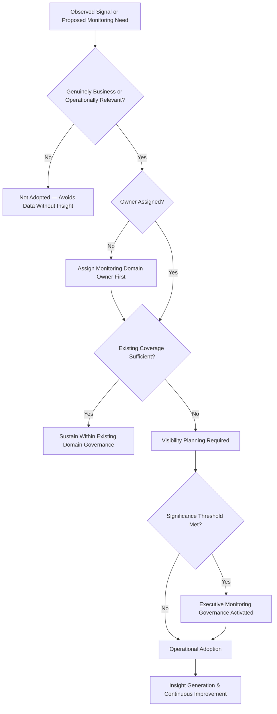
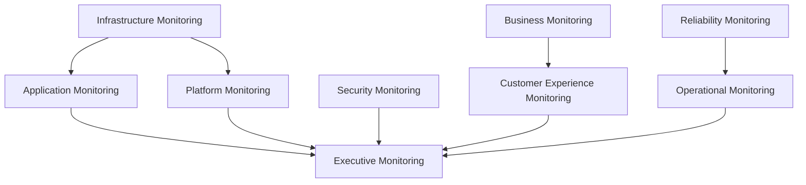
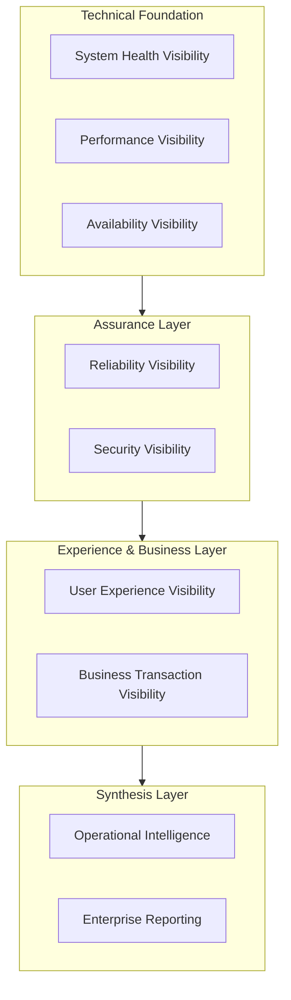
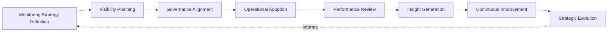
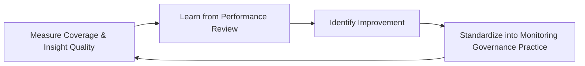
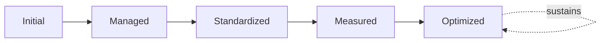

# Enterprise Monitoring Strategy Framework

## 1. Executive Summary

**Purpose** — This document defines the official Enterprise Monitoring Strategy Framework for **StackLeo Tech Store**. It establishes operational visibility, system health governance, reliability oversight, performance visibility, business monitoring alignment, executive reporting, and long-term monitoring maturity as a deliberate, accountable enterprise discipline. `observability-strategy.md` remains authoritative for the technical and philosophical foundation of telemetry — logs, metrics, traces, instrumentation, and the lifecycle by which platform behavior is made knowable. This framework does not redefine that foundation. It is the governance and business-alignment layer built on top of it: where `observability-strategy.md` governs *how the platform is made watchable*, this framework governs *who watches what, why, and how what they see rolls up into business and executive decisions* — organizing visibility into business- and operationally-relevant domains (application, infrastructure, platform, security, business, customer experience, reliability, operational, and executive monitoring) that observability's technical capability serves.

**Scope** — This framework applies to every monitoring domain at StackLeo — application, infrastructure, platform, security, business, customer experience, reliability, operational, and executive monitoring — across the full platform lifecycle, consuming the telemetry foundation established in `observability-strategy.md`.

**Strategic Objectives** — To ensure monitoring is organized around genuine business and operational relevance, not merely technical convenience; that visibility gaps are identified and closed deliberately; that monitoring data converts into genuine insight and decision support, not unused volume; and that executive leadership has continuous, honest visibility into the platform's operating state.

**Business Value** — Governed monitoring protects the business's ability to detect and respond to disruption before it compounds, converts operational data into genuine competitive advantage through faster, better-informed decisions, and gives leadership confidence that the platform's true state is always knowable, not merely assumed.

**Intended Audience** — Executive leadership, the Chief Technology Officer, engineering leadership, DevOps leadership, platform, development, security, and operations teams, and business stakeholders.

## 2. Enterprise Monitoring Vision

- **Monitoring as Business Capability** — monitoring is governed as a genuine business capability that protects revenue, trust, and continuity, never merely a technical convenience for engineering teams.
- **Operational Visibility** — the organization's true operating state is always knowable, coordinated with the telemetry foundation in `observability-strategy.md`.
- **Reliability Excellence** — monitoring exists to make the reliability discipline governed in `sre-strategy.md` genuinely achievable in practice.
- **Customer Experience Protection** — monitoring exists to protect the customer's experience of the platform, consistent with `01_Business/vision.md`.
- **Business Continuity** — the speed at which disruption is detected directly determines its business impact; monitoring is a direct, proactive investment in limiting that impact, coordinated with `09_OPERATIONS/business-continuity-governance.md`.
- **Proactive Operations** — monitoring is governed to anticipate and prevent disruption wherever possible, not only to react once it has already occurred.
- **Data-Driven Decisions** — operational and business decisions are grounded in genuine, observed evidence, not assumption or anecdote.

### Enterprise Monitoring Vision Matrix

| Vision Element | Focus | Business Value |
|---|---|---|
| Monitoring as Business Capability | Protects revenue, trust, and continuity | Prevents monitoring from being treated as a technical convenience |
| Operational Visibility | True operating state always knowable | Connects governance to the underlying telemetry foundation |
| Reliability Excellence | Makes reliability discipline genuinely achievable | Connects monitoring directly to engineered reliability |
| Customer Experience Protection | Protects the customer's experience of the platform | Protects the trust-centered brand commitment |
| Business Continuity | Detection speed directly determines business impact | Connects monitoring to proactive continuity protection |
| Proactive Operations | Anticipates and prevents disruption where possible | Reduces frequency and severity of customer-visible disruption |
| Data-Driven Decisions | Decisions grounded in genuine, observed evidence | Improves the accuracy and speed of operational decisions |

## 3. Monitoring Philosophy

Monitoring governance at StackLeo rests on seven principles, each producing a specific business outcome.

- **Visibility Before Action** — the organization understands what is genuinely happening before it acts, never acting on assumption or incomplete information. *Business Value:* prevents wasted or counterproductive action taken without genuine understanding.
- **Business-Aligned Monitoring** — what is monitored, and with what priority, is decided by genuine business and customer relevance, not only technical convenience. *Business Value:* ensures monitoring investment protects what genuinely matters to the business.
- **Proactive Detection** — monitoring is governed to surface a genuine problem before it becomes customer-visible wherever possible. *Business Value:* reduces the business cost of disruption by catching it earlier.
- **Reliability First** — monitoring exists in direct service of protecting platform reliability, never as an end in itself. *Business Value:* keeps monitoring investment connected to genuine operational outcome.
- **Meaningful Insights Over Data Volume** — monitoring is judged by the genuine insight it produces, not by the sheer volume of data collected. *Business Value:* protects attention and decision quality from being diluted by noise.
- **Accountability** — every monitoring domain traces to a specific, named, responsible owner. *Business Value:* ensures no dimension of visibility is left to drift without someone genuinely responsible for it.
- **Continuous Improvement** — monitoring governance practice matures over time, informed by real operational outcomes. *Business Value:* keeps monitoring aligned with the organization's growing scale and complexity.

### Monitoring Philosophy Matrix

| Principle | Description | Business Value |
|---|---|---|
| Visibility Before Action | Understanding established before acting | Prevents wasted or counterproductive action |
| Business-Aligned Monitoring | Priority decided by genuine business relevance | Ensures investment protects what genuinely matters |
| Proactive Detection | Surfaces problems before they become customer-visible | Reduces the business cost of disruption |
| Reliability First | Monitoring exists in service of protecting reliability | Keeps investment connected to genuine operational outcome |
| Meaningful Insights Over Data Volume | Judged by insight produced, not volume collected | Protects attention and decision quality from noise |
| Accountability | Every domain traces to a specific, named, responsible owner | Ensures no dimension of visibility drifts without responsibility |
| Continuous Improvement | Practice matures from real operational outcomes | Keeps monitoring aligned with growing scale and complexity |

*Diagram 4: Monitoring Governance Decision Flow — a signal or proposed monitoring need is checked for genuine business relevance and assigned ownership, with executive monitoring governance activated upon meeting significance thresholds, resolving into visibility planning, operational adoption, and continuous improvement.*

## 4. Enterprise Monitoring Governance Model

Monitoring governance operates across nine conceptual domains, each holding accountability for a distinct dimension of organizational visibility.

### Application Monitoring

- **Purpose** — govern visibility into the platform's application-level behavior and correctness.
- **Governance Scope** — oversight coordinated with `08_QUALITY_ASSURANCE/quality-metrics-governance.md`.
- **Business Value** — protects confidence that the platform's core functional behavior is genuinely understood.
- **Executive Expectations** — leadership expects application monitoring to surface genuine defect trends, not only availability.

### Infrastructure Monitoring

- **Purpose** — govern visibility into the platform's underlying technical infrastructure.
- **Governance Scope** — oversight coordinated with `infrastructure-as-code.md` and `environment-governance.md`.
- **Business Value** — protects the technical foundation every other monitoring domain ultimately depends on.
- **Executive Expectations** — leadership expects infrastructure visibility to be consistent regardless of environment.

### Platform Monitoring

- **Purpose** — govern visibility into shared platform capability consumed by multiple teams.
- **Governance Scope** — oversight coordinated with `platform-engineering.md`.
- **Business Value** — ensures a platform-level issue is never invisible to the teams depending on it.
- **Executive Expectations** — leadership expects platform monitoring to reflect its broad dependency footprint.

### Security Monitoring

- **Purpose** — govern visibility into security-relevant platform behavior, jointly with, and never superseding, `06_Security/security-monitoring.md`.
- **Governance Scope** — oversight ensuring security visibility remains coordinated with broader operational monitoring.
- **Business Value** — protects StackLeo's core trust differentiator through continuous security visibility.
- **Executive Expectations** — leadership expects security monitoring to carry the rigor defined in `06_Security/security-governance.md`.

### Business Monitoring

- **Purpose** — govern visibility into genuine business transaction and outcome behavior.
- **Governance Scope** — oversight coordinated with `01_Business/business-model.md`.
- **Business Value** — connects technical monitoring directly to business consequence, not only technical health.
- **Executive Expectations** — leadership expects business monitoring to answer genuine business questions, not only technical ones.

### Customer Experience Monitoring

- **Purpose** — govern visibility into the customer's genuine experience of the platform.
- **Governance Scope** — oversight coordinated with `09_OPERATIONS/service-level-governance.md`.
- **Business Value** — protects the trust relationship every customer interaction depends on.
- **Executive Expectations** — leadership expects customer experience monitoring to be weighted alongside internal technical metrics.

### Reliability Monitoring

- **Purpose** — govern visibility into the platform's engineered reliability, coordinated with `sre-strategy.md`.
- **Governance Scope** — oversight of the evidence reliability engineering depends on to be genuinely accountable.
- **Business Value** — ensures reliability claims rest on genuine, continuous evidence.
- **Executive Expectations** — leadership expects reliability monitoring to be a first-class dimension, not an afterthought.

### Operational Monitoring

- **Purpose** — govern visibility into how the platform is operated and sustained once live.
- **Governance Scope** — oversight coordinated with `09_OPERATIONS/operations-governance-strategy.md`.
- **Business Value** — protects the organization's ability to genuinely operate what it has built.
- **Executive Expectations** — leadership expects operational monitoring to extend genuinely beyond the moment of deployment.

### Executive Monitoring

- **Purpose** — govern the single, synthesized view of platform and business health presented to executive leadership.
- **Governance Scope** — oversight exclusively accountable for converging every domain above into one coherent enterprise picture.
- **Business Value** — protects leadership's ability to understand overall platform health as a whole, not domain by domain.
- **Executive Expectations** — leadership expects one coherent monitoring picture, not nine disconnected domain views.

### Monitoring Governance Matrix

| Domain | Purpose | Business Value | Executive Expectations |
|---|---|---|---|
| Application Monitoring | Govern visibility into application-level behavior | Protects confidence in genuine functional understanding | Expects genuine defect trends, not only availability |
| Infrastructure Monitoring | Govern visibility into underlying technical infrastructure | Protects the foundation every domain depends on | Expects consistent visibility regardless of environment |
| Platform Monitoring | Govern visibility into shared platform capability | Ensures platform issues are never invisible to dependents | Expects visibility reflecting broad dependency footprint |
| Security Monitoring | Govern visibility into security-relevant behavior | Protects StackLeo's core trust differentiator | Expects rigor defined by security governance |
| Business Monitoring | Govern visibility into business transaction behavior | Connects technical monitoring to business consequence | Expects answers to genuine business questions |
| Customer Experience Monitoring | Govern visibility into genuine customer experience | Protects the trust relationship every interaction depends on | Expects weighting alongside internal technical metrics |
| Reliability Monitoring | Govern visibility into engineered reliability | Ensures reliability claims rest on genuine evidence | Expects reliability as a first-class monitoring dimension |
| Operational Monitoring | Govern visibility into sustained platform operation | Protects the ability to genuinely operate what is built | Expects visibility extending genuinely beyond deployment |
| Executive Monitoring | Govern the single, synthesized enterprise view | Protects leadership's ability to understand health as a whole | Expects one coherent picture, not nine disconnected views |

*Diagram 1: Enterprise Monitoring Governance Framework — application, infrastructure, platform, and security monitoring converge with business, customer experience, reliability, and operational monitoring on executive monitoring, which synthesizes every domain into one coherent enterprise picture.*

## 5. Monitoring Capability Domains

Monitoring governance is exercised across nine conceptual capability domains, each requiring a distinct governance emphasis. Technical capability underlying these domains is elaborated in `observability-strategy.md` (Section 4).

- **System Health Visibility** — governs understanding of whether the platform's components are genuinely functioning as intended.
- **Performance Visibility** — governs understanding of whether the platform responds within acceptable, expected bounds.
- **Availability Visibility** — governs understanding of whether the platform is genuinely reachable and usable by customers.
- **Reliability Visibility** — governs understanding of whether the platform behaves consistently over sustained operation.
- **Security Visibility** — governs understanding of the platform's protective posture, jointly with `06_Security/security-monitoring.md`.
- **User Experience Visibility** — governs understanding of the platform's behavior as customers genuinely experience it.
- **Business Transaction Visibility** — governs understanding of genuine business outcomes flowing through the platform.
- **Operational Intelligence** — governs the synthesis of monitoring data into genuinely actionable operational understanding.
- **Enterprise Reporting** — governs how synthesized visibility is communicated to executive leadership and the Board.

### Monitoring Capability Domain Matrix

| Domain | Governance Focus | Coordination |
|---|---|---|
| System Health Visibility | Whether components genuinely function as intended | `observability-strategy.md` (Section 4) |
| Performance Visibility | Whether the platform responds within acceptable bounds | Performance Testing Governance |
| Availability Visibility | Whether the platform is genuinely reachable and usable | Reliability Monitoring (Section 4) |
| Reliability Visibility | Whether behavior is consistent over sustained operation | `sre-strategy.md` |
| Security Visibility | The platform's genuine protective posture | `06_Security/security-monitoring.md` |
| User Experience Visibility | Platform behavior as customers genuinely experience it | `09_OPERATIONS/service-level-governance.md` |
| Business Transaction Visibility | Genuine business outcomes flowing through the platform | `01_Business/business-model.md` |
| Operational Intelligence | Synthesis of data into actionable operational understanding | Operational Monitoring (Section 4) |
| Enterprise Reporting | Communication of synthesized visibility to leadership | Executive Monitoring (Section 4) |

*Diagram 3: Operational Visibility Architecture (Conceptual) — a layered architecture in which the technical foundation of system health, performance, and availability supports an assurance layer of reliability and security, informing the experience and business layer, which converges into operational intelligence and enterprise reporting.*

## 6. Monitoring Lifecycle Governance

Monitoring governance operates across eight conceptual lifecycle stages.

- **Monitoring Strategy Definition** — govern how the organization decides what genuinely warrants monitoring, and why.
- **Visibility Planning** — govern how monitoring coverage is deliberately planned against genuine business and technical priority.
- **Governance Alignment** — govern how a planned monitoring initiative is aligned to the appropriate domain in Section 4.
- **Operational Adoption** — govern how monitoring capability is genuinely adopted into daily operational practice, not left unused.
- **Performance Review** — govern the periodic, formal assessment of whether monitoring is genuinely serving its intended purpose.
- **Insight Generation** — govern how monitoring data is converted into genuinely actionable understanding.
- **Continuous Improvement** — govern how monitoring practice is deliberately strengthened based on real operational experience.
- **Strategic Evolution** — govern the periodic reassessment of whether monitoring priorities remain aligned with evolving business strategy.

### Monitoring Lifecycle Matrix

| Stage | Governance Objective | Business Value |
|---|---|---|
| Monitoring Strategy Definition | Decide what genuinely warrants monitoring | Ensures monitoring effort is deliberately directed |
| Visibility Planning | Plan coverage against genuine priority | Directs investment toward what genuinely matters |
| Governance Alignment | Align an initiative to the appropriate domain | Ensures review by the genuinely accountable function |
| Operational Adoption | Ensure capability is genuinely adopted into practice | Prevents monitoring investment going unused |
| Performance Review | Assess whether monitoring serves its intended purpose | Confirms monitoring investment is genuinely working |
| Insight Generation | Convert data into genuinely actionable understanding | Ensures data translates into real operational value |
| Continuous Improvement | Strengthen practice from real operational experience | Keeps monitoring practice compounding in capability |
| Strategic Evolution | Reassess alignment with evolving business strategy | Keeps monitoring genuinely connected to business intent |

*Diagram 2: Monitoring Lifecycle Model — strategy definition and visibility planning inform governance alignment and operational adoption, feeding performance review and insight generation, with continuous improvement and strategic evolution feeding lessons back into the cycle.*

## 7. Organizational Governance

Governance accountability is distributed deliberately across nine organizational roles.

- **Executive Leadership** — holds ultimate accountability for whether the organization's true operating state is genuinely knowable.
- **CTO** — owns the coherence and enforcement of this framework across every monitoring domain and governance layer it defines.
- **Engineering Leadership** — owns Application Monitoring (Section 4) within their accountable teams.
- **DevOps Leadership** — owns Infrastructure and Platform Monitoring (Section 4) in coordination with `devops-governance-framework.md`.
- **Platform Teams** — own the self-service capability that makes governed monitoring the default path for every team.
- **Development Teams** — own the instrumentation of their capability consistent with `observability-strategy.md`.
- **Security Teams** — own Security Monitoring (Section 4) jointly with `06_Security/security-monitoring.md`, which remains authoritative for security-specific obligations.
- **Operations Teams** — own Operational and Reliability Monitoring (Section 4) in coordination with `09_OPERATIONS/operations-governance-strategy.md` and `sre-strategy.md`.
- **Business Stakeholders** — own Business Monitoring (Section 4) alignment with genuine business priority.

### Organizational Responsibility Matrix

| Role | Governance Objective | Business Value |
|---|---|---|
| Executive Leadership | Hold ultimate accountability for knowable operating state | Provides a single point of ultimate accountability |
| CTO | Own coherence and enforcement of this framework | Provides a single point of specialist accountability |
| Engineering Leadership | Own application monitoring within accountable teams | Embeds visibility closest to where application behavior occurs |
| DevOps Leadership | Own infrastructure and platform monitoring | Keeps monitoring coordinated with broader DevOps governance |
| Platform Teams | Own self-service capability enabling governed monitoring | Makes the governed path the path of least resistance |
| Development Teams | Own instrumentation of their capability | Ensures visibility is designed in, not added after the fact |
| Security Teams | Own security monitoring jointly with security monitoring practice | Keeps security visibility integrated with broader monitoring |
| Operations Teams | Own operational and reliability monitoring | Ensures accountability extends beyond deployment into operation |
| Business Stakeholders | Own business monitoring alignment with priority | Connects monitoring to genuine business relevance |

### Governance Responsibility Matrix

| Role | Responsibility |
|---|---|
| Executive Leadership | Owns ultimate accountability for a genuinely knowable operating state. |
| CTO | Owns coherence and enforcement of this framework, in partnership with executive leadership. |
| Engineering Leadership | Owns application monitoring within accountable teams. |
| DevOps Leadership | Owns infrastructure and platform monitoring. |
| Platform Teams | Own self-service capability enabling governed monitoring by default. |
| Security Teams | Own security monitoring jointly with `06_Security/security-monitoring.md`. |
| Operations Teams | Own operational and reliability monitoring. |
| Business Stakeholders | Own business monitoring alignment with genuine priority. |

## 8. Monitoring Risk Governance

Monitoring-related risk is governed across seven conceptual categories.

- **Blind Spots** — the risk that a genuinely important dimension of platform or business behavior remains unmonitored.
- **Excessive Noise** — the risk that monitoring volume obscures rather than reveals genuine insight.
- **Missing Visibility** — the risk that a monitored dimension exists but is not genuinely visible to those who need it.
- **Incorrect Prioritization** — the risk that monitoring attention is directed toward what is easiest to observe rather than what genuinely matters.
- **Operational Dependency** — the risk that critical operational decisions depend on monitoring capability that has not been verified reliable.
- **Business Impact Risks** — the risk that a monitoring gap allows genuine business impact to go undetected.
- **Reliability Risks** — the risk that monitoring itself becomes unreliable at the moment it is most needed.

### Risk Governance Matrix

| Risk Category | Focus | Governance Coordination |
|---|---|---|
| Blind Spots | Genuinely important behavior left unmonitored | Coordinated with Visibility Planning (Section 6) |
| Excessive Noise | Volume obscuring rather than revealing insight | Coordinated with Meaningful Insights principle (Section 3) |
| Missing Visibility | Monitored data not genuinely visible to those needing it | Coordinated with Enterprise Reporting (Section 5) |
| Incorrect Prioritization | Attention directed by ease rather than genuine importance | Coordinated with Business-Aligned Monitoring (Section 3) |
| Operational Dependency | Decisions depending on unverified monitoring capability | Coordinated with Performance Review (Section 6) |
| Business Impact Risks | Monitoring gap allowing undetected business impact | Coordinated with Business Monitoring (Section 4) |
| Reliability Risks | Monitoring itself unreliable when most needed | Coordinated with `sre-strategy.md` |

## 9. Executive Oversight

- **Operational Visibility Reviews** — the overall coherence of monitoring governance is formally reviewed on a regular cadence.
- **Reliability Reviews** — reliability monitoring outcomes are reviewed directly with executive leadership, coordinated with `sre-strategy.md`.
- **Performance Reviews** — performance and availability visibility trends are reviewed with executive leadership.
- **Executive Reporting** — the synthesized enterprise monitoring picture is reported to executive leadership and the Board.
- **Business Impact Reviews** — the genuine business consequence of monitored trends is reviewed directly with executive leadership.
- **Continuous Improvement Reviews** — the organization's follow-through on captured monitoring governance lessons is reviewed directly with executive leadership.

### Executive Oversight Matrix

| Oversight Mechanism | Purpose | Governance Role |
|---|---|---|
| Operational Visibility Reviews | Confirm overall monitoring governance coherence | Regular, predictable cadence for the framework as a whole |
| Reliability Reviews | Review reliability monitoring outcomes | Coordinated with `sre-strategy.md` |
| Performance Reviews | Review performance and availability trends | Direct executive-level review of platform responsiveness |
| Executive Reporting | Provide leadership the synthesized enterprise picture | Regular reporting to executive leadership and the Board |
| Business Impact Reviews | Review genuine business consequence of monitored trends | Direct executive-level review of business relevance |
| Continuous Improvement Reviews | Review follow-through on captured lessons | Direct executive-level review of improvement completion |

## 10. Future Readiness

This framework is designed to remain valid as StackLeo evolves in scale, geography, and organizational complexity.

- **AI-Assisted Monitoring** — as insight generation increasingly incorporates AI-assisted analysis, it remains governed under Insight Generation (Section 6) at the same rigor as any other method.
- **Intelligent Observability** — where the technical foundation in `observability-strategy.md` increasingly incorporates intelligent correlation, that capability remains subject to Operational Intelligence (Section 5).
- **Predictive Operations** — where the organization develops the capability to anticipate an operational issue before it manifests, that capability is governed as an extension of Proactive Detection (Section 3).
- **Autonomous Operations (Conceptual)** — where automation increasingly performs steps within monitoring response, that automation remains subject to the same ownership and executive oversight as any human-performed activity.
- **Enterprise Scale** — the governance model, domains, and lifecycle defined throughout this framework are defined independently of organizational size.
- **Global Operations** — Monitoring Strategy Definition and Visibility Planning (Section 6) are structured to be re-applied as StackLeo expands from Bangladesh into South Asia and global markets.
- **Digital Reliability Platforms** — this framework's governance discipline is treated as a direct contributor to the digital trust customers, partners, and regulators extend to StackLeo.

## 11. Monitoring Maturity Model

Monitoring governance maturity is described across five conceptual levels.

- **Initial** — monitoring, where it exists, is informal and inconsistent; visibility is reactive, and ownership is unclear.
- **Managed** — basic monitoring governance exists for individual domains, but consistency across the nine domains in Section 4 varies significantly.
- **Standardized** — the governance model, domains, and lifecycle are standardized, documented, and consistently applied across the organization.
- **Measured** — monitoring coverage, insight quality, and business relevance are measured systematically, and decisions are grounded in genuine evidence.
- **Optimized** — monitoring governance is continuously and deliberately improved based on quantitative evidence and organizational learning; improvement itself is a managed, ongoing discipline.

### Monitoring Maturity Matrix

| Level | Characteristics | Primary Focus |
|---|---|---|
| Initial | Informal, inconsistent monitoring; visibility is reactive | Ad hoc, individually-dependent monitoring practice |
| Managed | Basic governance exists per domain; consistency varies | Domain-level consistency |
| Standardized | Standardized governance model, domains, and lifecycle | Organization-wide consistency and clear ownership |
| Measured | Coverage, insight quality, and relevance measured systematically | Evidence-based monitoring governance decisions |
| Optimized | Practice continuously and deliberately improved from evidence | Sustained, deliberate improvement as a discipline |

*Diagram 5: Continuous Monitoring Improvement Cycle — monitoring coverage and insight quality are measured, learned from, improved upon, and standardized back into governed practice, on a continuing basis.*

*Diagram 6: Monitoring Maturity Progression — maturity advances from informal, reactive monitoring practice toward standardized, measured, and continuously optimized monitoring governance.*

## 12. Monitoring Anti-Patterns

- **Monitoring Without Strategy** — collecting monitoring data without a genuine, governed strategy produces volume without direction.
- **Data Without Insights** — accumulating monitoring data that never converts into genuine, actionable understanding wastes the investment made to collect it.
- **Alert Overload** — excessive, poorly prioritized signals erode the organization's ability to distinguish genuinely urgent conditions from routine noise.
- **Weak Ownership** — a monitoring domain with no accountable owner has no one genuinely responsible for its coverage or quality.
- **Poor Business Alignment** — monitoring organized around technical convenience rather than genuine business relevance misses what actually matters.
- **Reactive Operations** — treating monitoring as adequate only until an incident proves otherwise means avoidable failures, not deliberate design, drive improvement.
- **Missing Documentation** — allowing monitoring coverage and ownership to go undocumented makes gaps invisible until they cause genuine harm.
- **Lack of Continuous Improvement** — treating current monitoring practice as a permanently finished state guarantees it falls behind the platform's growing scale and complexity.

### Anti-Pattern Summary

| Anti-Pattern | Business Impact |
|---|---|
| Monitoring Without Strategy | Produces volume without direction, wasting investment |
| Data Without Insights | Wastes investment made to collect data that is never used |
| Alert Overload | Erodes the ability to distinguish urgent conditions from noise |
| Weak Ownership | Leaves no one genuinely responsible for coverage or quality |
| Poor Business Alignment | Misses what genuinely matters to the business |
| Reactive Operations | Lets avoidable failures, not deliberate design, drive improvement |
| Missing Documentation | Makes gaps invisible until they cause genuine harm |
| Lack of Continuous Improvement | Guarantees practice falls behind growing scale and complexity |

## Related Documents

| Document | Relationship |
|---|---|
| `observability-strategy.md` | The technical and telemetry foundation this framework governs the organizational and business application of. |
| Observability Framework (conceptual future companion) | An anticipated deeper technical elaboration of instrumentation practice beyond `observability-strategy.md`. |
| Logging Governance (conceptual future companion) | An anticipated dedicated governance treatment of log data specifically, extending `observability-strategy.md` (Section 4). |
| Metrics Governance (conceptual future companion) | An anticipated dedicated governance treatment of metric data specifically, extending `observability-strategy.md` (Section 4). |
| Alerting Governance (conceptual future companion) | An anticipated dedicated governance treatment of alert prioritization, extending Alert Overload avoidance (Section 12). |
| Incident Observability (conceptual future companion) | An anticipated elaboration of how monitoring evidence supports `incident-management.md` and `09_OPERATIONS/incident-management-governance.md`. |
| Reliability Engineering Framework (`sre-strategy.md`) | Consumes this framework's Reliability Monitoring (Section 4) as its evidentiary foundation. |

## Document Information

| Property | Value |
|----------|-------|
| Document | monitoring-strategy.md |
| Version | 1.0.0 |
| Status | Active |
| Maintained By | StackLeo |
| Last Updated | 2026-07-24 |

---

© StackLeo. All Rights Reserved.
