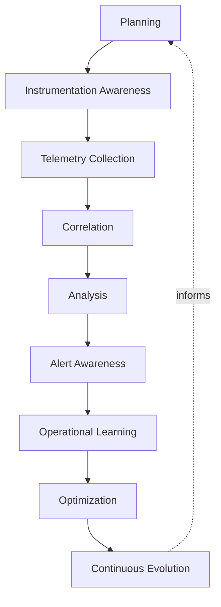
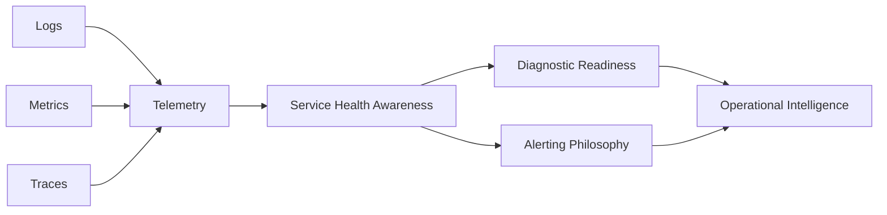
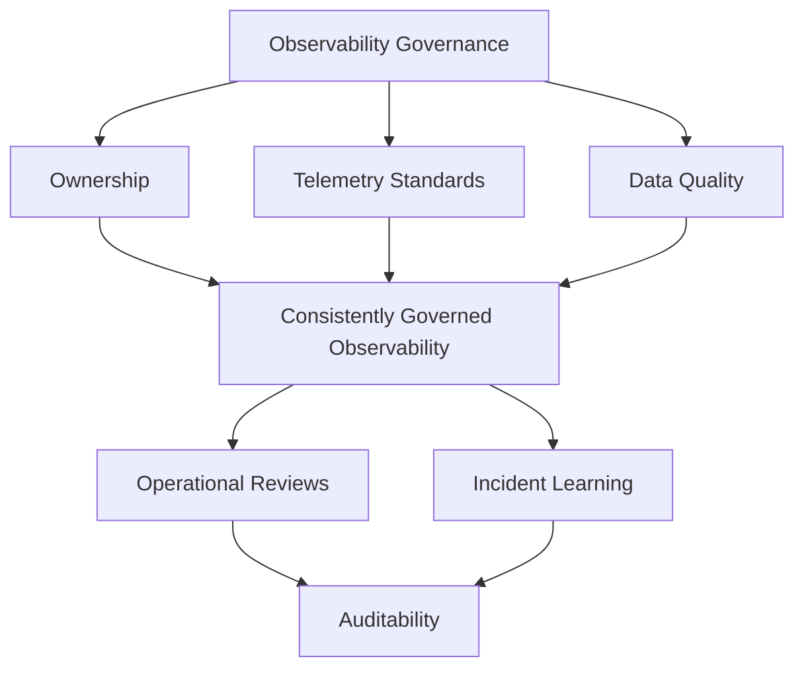
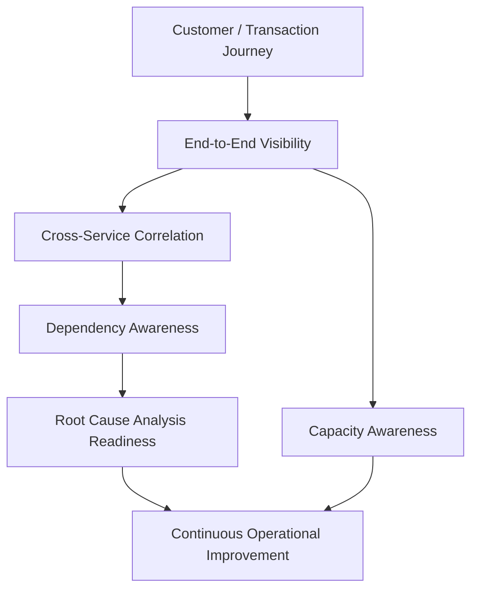
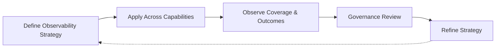

# Observability Strategy

## 1. Document Purpose

This document defines the enterprise strategy for observability at **StackLeo** — how the platform's internal behavior is made understandable from its external outputs, without recommending specific monitoring, logging, tracing, or observability tools, and without defining implementation metrics.

- **Purpose of Observability** — to ensure that the platform's true operating state is always knowable, so that questions about its behavior can be answered without guesswork, and problems can be understood quickly regardless of how novel or unexpected they are.
- **Relationship with SRE** — this document is the telemetry-specific foundation `sre-strategy.md` depends on; SLIs, error budgets, and reliability reviews are only meaningful if grounded in trustworthy, comprehensive observability data.
- **Relationship with DevOps** — this document is the observability-specific elaboration of the Observability principle defined in `devops-principles.md`, extending it into a dedicated discipline of telemetry, correlation, and operational learning.
- **Relationship with Platform Engineering** — observability capability is intended to be delivered as self-service platform capability through `platform-engineering.md`, so operational visibility is a built-in property of using the platform, not a separately achieved skill.
- **Relationship with Operational Excellence** — observability is the precondition for operational excellence; an organization cannot excel at operating what it cannot see.
- **Relationship with Business Continuity** — the speed at which the organization detects and understands a disruption directly determines its business impact; observability is a direct, proactive investment in limiting that impact.

This document is implementation-independent and vendor-neutral. It defines observability philosophy, lifecycle, and governance conceptually — not specific tools, platforms, or implementation metrics.

## 2. Observability Philosophy

- **Observability by Design** — the ability to understand a capability's behavior is considered from the moment it is designed, not added as an afterthought once it is already running.
- **Telemetry as a Strategic Asset** — the data describing platform behavior is treated as a valuable organizational asset, deliberately managed, not an incidental byproduct.
- **Data-Driven Operations** — operational decisions are grounded in observed evidence, not assumption or anecdote.
- **Proactive Detection** — problems are identified through deliberate observation before they are reported by customers, wherever possible.
- **Continuous Learning** — what observability reveals, including surprises and failures, is treated as a source of ongoing organizational learning.
- **Shared Responsibility** — the observability of a capability is owned jointly by the team that builds it and the team that operates it, not delegated entirely to a single specialized function.
- **Continuous Improvement** — observability practice itself is expected to mature over time, informed by what is learned from using it.

## 3. Observability Lifecycle

### Planning

- **Purpose** — determine what needs to be observable about a capability before it is built.
- **Business Value** — prevents observability needs from being discovered reactively after a capability is already live.
- **Governance Objectives** — ensure every capability can be traced back to a deliberate observability plan.

### Instrumentation Awareness

- **Purpose** — recognize where and how a capability must expose information about its own behavior.
- **Business Value** — ensures the information needed to understand a capability actually exists when needed.
- **Governance Objectives** — treat instrumentation as a required part of implementation, not an optional addition.

### Telemetry Collection

- **Purpose** — gather the exposed information reliably and consistently.
- **Business Value** — ensures observability data is complete and trustworthy rather than sporadic or incomplete.
- **Governance Objectives** — ensure collection is consistent across capabilities, not dependent on individual team discipline.

### Correlation

- **Purpose** — connect related telemetry across components, services, and time so a coherent picture emerges.
- **Business Value** — turns isolated data points into a genuinely useful understanding of system behavior.
- **Governance Objectives** — ensure telemetry is structured to support correlation, not collected in isolation.

### Analysis

- **Purpose** — interpret collected and correlated telemetry to understand actual system behavior.
- **Business Value** — converts raw data into actionable operational understanding.
- **Governance Objectives** — ensure analysis capability is available to the teams who need it, not siloed.

### Alert Awareness

- **Purpose** — recognize when observed behavior warrants human attention and route that awareness appropriately.
- **Business Value** — ensures the right people are informed of the right conditions at the right urgency.
- **Governance Objectives** — align alerting with the philosophy defined in `alerting.md`, avoiding noise or silence.

### Operational Learning

- **Purpose** — extract lasting understanding from what observability reveals, including during and after incidents.
- **Business Value** — turns operational experience into durable organizational knowledge.
- **Governance Objectives** — ensure learning is captured and acted upon, not lost after the moment passes.

### Optimization

- **Purpose** — deliberately improve observability coverage and quality based on what has been learned.
- **Business Value** — directs observability investment toward genuine, evidence-based gaps.
- **Governance Objectives** — ensure optimization is prioritized and resourced, not perpetually deferred.

### Continuous Evolution

- **Purpose** — mature observability practice itself as the platform, organization, and operating scale grow.
- **Business Value** — keeps observability practice aligned with the platform's growing complexity.
- **Governance Objectives** — ensure observability practice is reviewed and evolved deliberately, not left static.

*Diagram 1: Enterprise Observability Lifecycle — observability moves from planning and instrumentation through collection and correlation, into analysis and alerting, with operational learning driving optimization and continuous evolution.*

### Observability Lifecycle Matrix

| Stage | Purpose | Business Value |
|---|---|---|
| Planning | Determine what needs to be observable before building | Prevents reactive discovery of observability needs |
| Instrumentation Awareness | Recognize where behavior must be exposed | Ensures needed information actually exists |
| Telemetry Collection | Gather exposed information reliably | Ensures data is complete and trustworthy |
| Correlation | Connect related telemetry across the system | Turns isolated data into a coherent picture |
| Analysis | Interpret telemetry to understand behavior | Converts raw data into actionable understanding |
| Alert Awareness | Recognize and route conditions warranting attention | Right people informed at the right urgency |
| Operational Learning | Extract lasting understanding from observed behavior | Turns operational experience into durable knowledge |
| Optimization | Improve coverage and quality based on learning | Directs investment toward genuine, evidenced gaps |
| Continuous Evolution | Mature observability practice itself | Keeps practice aligned with growing complexity |

## 4. Core Observability Capabilities

### Logs

- **Purpose** — record discrete events and their context as they occur within the platform.
- **Business Value** — provides a detailed, sequential record for investigating specific occurrences.
- **Strategic Objectives** — ensure events are captured with enough context to be understood independently.

### Metrics

- **Purpose** — quantify system and business behavior over time in a form suitable for trend and threshold analysis.
- **Business Value** — enables detection of gradual degradation and comparison against expected behavior.
- **Strategic Objectives** — make system and business health continuously quantifiable.

### Traces

- **Purpose** — follow a single request or transaction as it moves across the platform's components.
- **Business Value** — makes it possible to understand where time and failure occur within a complex, multi-component interaction.
- **Strategic Objectives** — connect isolated component behavior into an end-to-end understanding.

### Telemetry

- **Purpose** — serve as the umbrella category encompassing logs, metrics, traces, and other observability signals.
- **Business Value** — ensures observability is understood as a coherent whole, not a collection of unrelated data types.
- **Strategic Objectives** — govern all forms of observability data under a consistent set of principles.

### Service Health Awareness

- **Purpose** — maintain a continuously current understanding of whether a capability is behaving as expected.
- **Business Value** — enables confident, evidence-based statements about the platform's current state at any time.
- **Strategic Objectives** — make health status a directly answerable question, not an inference.

### Alerting Philosophy

- **Purpose** — define the principles governing when and how observed conditions become actionable notifications.
- **Business Value** — ensures attention is directed where it is genuinely warranted.
- **Strategic Objectives** — align with the dedicated philosophy in `alerting.md`, avoiding both noise and silence.

### Diagnostic Readiness

- **Purpose** — ensure the information needed to investigate a problem is available when a problem occurs.
- **Business Value** — reduces the time required to move from detection to understanding during an incident.
- **Strategic Objectives** — treat diagnostic capability as prepared in advance, not assembled reactively.

### Operational Intelligence

- **Purpose** — synthesize observability data into insight that informs operational and business decisions.
- **Business Value** — extends observability's value beyond incident response into ongoing decision-making.
- **Strategic Objectives** — make observability data a genuine input to strategic, not only tactical, decisions.

*Diagram 2: Telemetry Flow Model — logs, metrics, and traces converge into a unified telemetry foundation, informing service health awareness, alerting, and diagnostic readiness, which together produce operational intelligence.*

### Observability Capability Matrix

| Capability | Purpose | Strategic Objective |
|---|---|---|
| Logs | Record discrete events and their context | Ensure events are understandable independently |
| Metrics | Quantify behavior over time | Make system and business health continuously quantifiable |
| Traces | Follow a request across components | Connect isolated behavior into end-to-end understanding |
| Telemetry | Umbrella category for all observability signals | Govern all data types under consistent principles |
| Service Health Awareness | Continuously current understanding of expected behavior | Make health status directly answerable, not inferred |
| Alerting Philosophy | Principles for when conditions become actionable | Direct attention where genuinely warranted |
| Diagnostic Readiness | Investigation information available when needed | Reduce time from detection to understanding |
| Operational Intelligence | Synthesized insight for operational and business decisions | Extend value beyond incident response |

## 5. Observability Governance

- **Ownership** — every capability has a clearly accountable owner responsible for its observability coverage and quality.
- **Telemetry Standards** — telemetry is structured consistently across the platform, so correlation and analysis remain possible at scale.
- **Data Quality** — telemetry is expected to be accurate, complete, and timely; low-quality data is treated as a genuine operational risk.
- **Operational Reviews** — a capability's observability coverage is periodically and deliberately reviewed, not assumed adequate indefinitely.
- **Incident Learning** — observability's role in every incident, including gaps it revealed, is examined as part of the incident learning process defined in `sre-strategy.md`.
- **Auditability** — observability data and access to it are maintained in a state that supports investigation and compliance at any time.

*Diagram 3: Observability Governance Framework — ownership, telemetry standards, and data quality converge on consistently governed observability, sustained by operational reviews, incident learning, and auditability.*

### Telemetry Governance Matrix

| Governance Area | Focus | Accountable For |
|---|---|---|
| Ownership | Clearly accountable owner per capability | Observability coverage and quality |
| Telemetry Standards | Consistent structure across the platform | Preserving correlation and analysis capability at scale |
| Data Quality | Accuracy, completeness, and timeliness | Preventing low-quality data from becoming an operational risk |
| Operational Reviews | Periodic, deliberate coverage assessment | Proactive identification of observability gaps |
| Incident Learning | Observability examined within incident review | Learning from both incidents and the gaps they reveal |
| Auditability | Traceable data and access | Supporting investigation and compliance |

## 6. Operational Visibility

- **End-to-End Visibility** — the platform's behavior is understandable across the full path a customer or transaction takes, not only within isolated components.
- **Cross-Service Correlation** — telemetry from independently owned services can be correlated to understand behavior that spans them, consistent with the traces capability in Section 4.
- **Dependency Awareness** — the relationships and dependencies between services and external systems are understood well enough to reason about the impact of a failure in any one of them.
- **Root Cause Analysis Readiness** — the platform's observability foundation is structured to support efficient investigation back to a genuine root cause, not only symptom identification.
- **Capacity Awareness** — observability extends to understanding the platform's consumption of capacity relative to its limits, connecting to `scalability.md`.
- **Continuous Operational Improvement** — operational visibility itself is treated as continuously improvable, informed by what investigations and reviews reveal about its gaps.

*Diagram 4: Operational Visibility Model — visibility across the full customer or transaction journey enables cross-service correlation and dependency awareness, supporting root cause analysis and capacity understanding, both feeding continuous operational improvement.*

### Operational Visibility Matrix

| Dimension | Focus | Business Value |
|---|---|---|
| End-to-End Visibility | Understanding across the full customer or transaction path | Prevents blind spots between isolated components |
| Cross-Service Correlation | Correlating telemetry across independently owned services | Enables understanding of behavior spanning services |
| Dependency Awareness | Understood relationships between services and systems | Enables reasoning about impact of a failure anywhere |
| Root Cause Analysis Readiness | Structured support for genuine root-cause investigation | Reduces time and effort to move past symptoms |
| Capacity Awareness | Understanding consumption relative to limits | Prevents capacity-driven reliability failures |
| Continuous Operational Improvement | Ongoing improvement of visibility itself | Keeps visibility aligned with actual operational need |

## 7. Future Readiness

- **Cloud-Native Platforms** — observability principles are defined independent of any specific provider, allowing adoption of elastic, provider-hosted infrastructure without redefining this strategy.
- **Kubernetes** — telemetry and correlation principles extend naturally to container orchestration concepts, consistent with `kubernetes-strategy.md`, without requiring a separate observability philosophy.
- **Microservices** — as capability decomposes into a growing number of independently deployable services, cross-service correlation and dependency awareness scale without requiring redefinition.
- **AI Systems** — observability extends to AI-assisted capability, including its behavioral and performance signals, under the same telemetry and governance principles as any other system capability.
- **Marketplace Platform** — as StackLeo evolves toward business sales, corporate accounts, wholesale, and a multi-vendor marketplace, end-to-end visibility extends to a broader set of integrated partner and seller interactions without redefinition.
- **Multi-Region Operations** — as StackLeo expands from Bangladesh into South Asia and, over time, global markets, observability accommodates regional variation without disrupting core telemetry governance.
- **Global Engineering Teams** — observability governance remains independent of contributor or operator location, supporting distributed teams sharing a consistent operational picture.

## 8. Governance

- **Ownership** — a designated observability governance owner is accountable for the coherence and enforcement of this strategy across the platform.
- **Review Process** — significant changes to observability lifecycle, capability priorities, or governance expectations are reviewed consistent with the review discipline in `03_System_Design/architecture-decisions.md`.
- **Observability Policies** — individual teams may define observability detail consistent with this strategy, but may not bypass its telemetry standards or governance principles.
- **Audit Readiness** — telemetry records, access logs, and review outcomes are maintained in a state that supports audit and investigation at any time.
- **Continuous Improvement** — observability strategy is expected to mature as the platform, organization, and operational scale evolve, consistent with `devops-principles.md`.

*Diagram 5: Continuous Observability Improvement Cycle — observability strategy is applied across every capability, its coverage and outcomes observed, reviewed by governance, and refined, with refinements feeding directly back into the strategy.*

### Governance Responsibility Matrix

| Governance Area | Owner | Accountable For |
|---|---|---|
| Ownership | Observability Governance Owner | Coherence and enforcement of this strategy |
| Review Process | Architecture & Platform Teams | Reviewing changes to lifecycle and capability priorities |
| Observability Policies | Capability Owning Teams | Detail consistent with enterprise telemetry standards |
| Audit Readiness | Platform & Security Teams | Telemetry and access records ready for audit |
| Continuous Improvement | SRE / Platform Engineering | Maturing strategy as platform and scale evolve |

## 9. Anti-Patterns

- **Monitoring Without Context** — collecting data without the correlation needed to understand what it actually means. This produces noise instead of insight, leaving teams no better equipped to understand behavior.
- **Missing Telemetry** — allowing capability to be built without adequate instrumentation. This creates blind spots that are only discovered when they are needed most, during an incident.
- **Alert Fatigue** — generating alerts inconsistent with genuine urgency or actionability. This trains responders to ignore or delay attention to alerts, undermining the entire purpose of alerting.
- **Data Silos** — allowing telemetry to remain isolated within individual teams or services. This prevents the cross-service correlation needed to understand end-to-end behavior.
- **Reactive Operations** — relying on customer reports to discover problems rather than proactive observability. This means the organization is consistently the last to know about its own platform's condition.
- **Weak Ownership** — leaving a capability's observability coverage without a clearly accountable owner. This causes coverage and data quality to degrade with no one responsible for correcting it.
- **Poor Operational Visibility** — operating capability without sufficient end-to-end insight into its actual behavior. This means investigation is slow and root cause is often never genuinely found.
- **Missing Continuous Improvement** — treating current observability coverage as a permanently finished state. This guarantees coverage falls behind the platform's growing scale and complexity over time.

### Anti-Pattern Summary

| Anti-Pattern | Why It Must Be Avoided |
|---|---|
| Monitoring Without Context | Produces noise instead of insight |
| Missing Telemetry | Creates blind spots discovered only when needed most |
| Alert Fatigue | Trains responders to ignore or delay attention to alerts |
| Data Silos | Prevents cross-service correlation and end-to-end understanding |
| Reactive Operations | Organization is consistently the last to know its own condition |
| Weak Ownership | Coverage and data quality degrade with no accountable owner |
| Poor Operational Visibility | Investigation is slow and root cause is often never found |
| Missing Continuous Improvement | Coverage falls behind platform scale and complexity |

## 10. Document Information

| Property | Value |
|----------|-------|
| Document | observability-strategy.md |
| Version | 1.0.0 |
| Status | Active |
| Maintained By | StackLeo |
| Last Updated | 2026-07-24 |

---

© StackLeo. All Rights Reserved.
