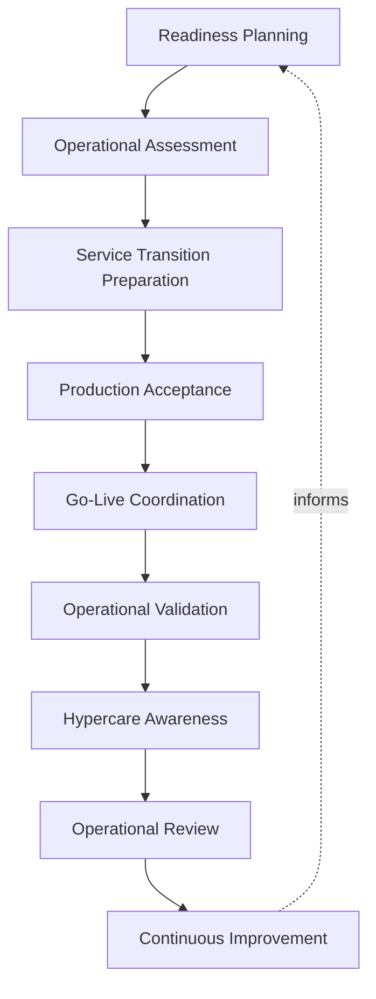
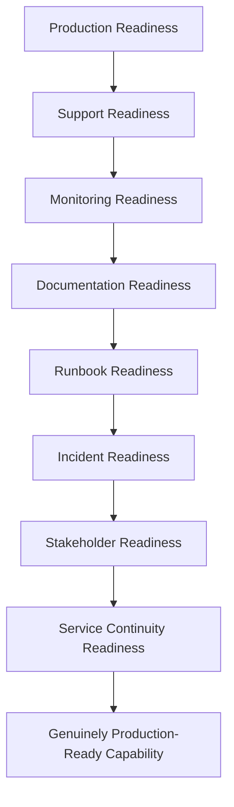
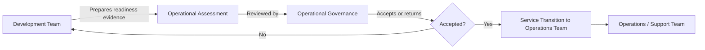
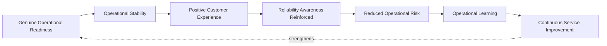
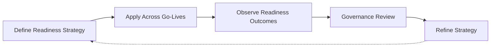

# Operational Readiness

## 1. Document Purpose

This document defines the enterprise strategy for operational readiness at **StackLeo** — how a capability is confirmed genuinely prepared to be operated, supported, and sustained before and immediately after it goes live, without recommending specific operational tools, platforms, or configurations.

- **Purpose of Operational Readiness** — to ensure that a capability is never handed to production responsibility before the organization is genuinely prepared to run it, closing the gap between "technically deployed" and "operationally sustainable."
- **Relationship with DevOps** — this document is the readiness-specific elaboration of the Deployment Readiness and Operational Validation stages defined in `ci-cd-strategy.md` and `deployment-strategy.md`, giving them a dedicated, structured discipline of their own.
- **Relationship with SRE** — operational readiness is the precondition `sre-strategy.md` depends on; a capability cannot be reliably operated if the organization was never genuinely prepared to operate it.
- **Relationship with Platform Engineering** — readiness assessment and support enablement are intended to be delivered as consistent, self-service platform capability through `platform-engineering.md`, so readiness discipline is available to every team without independent reinvention.
- **Relationship with IT Service Management** — this document reflects ITSM's service transition discipline, adapted to StackLeo's context: a capability moves deliberately from development into supported, operated service, not silently or by default.
- **Relationship with Business Continuity** — a capability that goes live without genuine operational readiness is a direct, avoidable risk to business continuity; this document exists to prevent that risk before it materializes.

This document is implementation-independent and vendor-neutral. It defines operational readiness philosophy, lifecycle, and governance conceptually — not specific tools, platforms, or configurations.

## 2. Operational Readiness Philosophy

- **Production Readiness by Design** — operational readiness is considered from the point a capability is planned, not assessed for the first time immediately before go-live.
- **Operational Excellence** — a capability's readiness is measured by the organization's genuine ability to sustain it reliably, not merely by its successful deployment.
- **Customer-Centric Operations** — readiness is ultimately judged by its effect on the customer's experience once the capability is live, not only by internal technical criteria.
- **Predictable Service Transition** — a capability's movement from development into operated service follows a known, repeatable process, not an ad hoc handoff.
- **Shared Responsibility** — readiness is owned jointly by the team that built the capability and the team that will operate it, not assumed to be someone else's concern.
- **Continuous Validation** — readiness is confirmed through deliberate verification, not assumed from the completion of preceding delivery stages.
- **Continuous Improvement** — operational readiness practice itself is expected to mature over time, informed by what is learned from every go-live.

## 3. Operational Readiness Lifecycle

### Readiness Planning

- **Purpose** — determine what operational readiness a capability will require before it is built.
- **Business Value** — prevents readiness needs from being discovered reactively immediately before go-live.
- **Governance Objectives** — ensure every capability can be traced back to a deliberate readiness plan.

### Operational Assessment

- **Purpose** — evaluate a capability's actual readiness against the domains defined in Section 4.
- **Business Value** — surfaces readiness gaps while there is still time to address them.
- **Governance Objectives** — apply assessment criteria consistently, without exception for schedule pressure.

### Service Transition Preparation

- **Purpose** — prepare the organizational and operational changes needed to support the capability once live.
- **Business Value** — ensures the operating organization, not only the technical system, is prepared.
- **Governance Objectives** — treat transition preparation as a distinct, required activity, not an afterthought of deployment.

### Production Acceptance

- **Purpose** — obtain a deliberate, accountable decision that the capability is genuinely ready for production responsibility.
- **Business Value** — ensures go-live reflects an intentional readiness decision, not a default outcome of deployment completion.
- **Governance Objectives** — ensure acceptance authority and criteria are clearly defined and consistently applied.

### Go-Live Coordination

- **Purpose** — align the go-live event with the teams, stakeholders, and timing considerations it affects.
- **Business Value** — prevents avoidable disruption or confusion at the moment of transition to live operation.
- **Governance Objectives** — connect go-live coordination directly to the release coordination in `release-management.md`.

### Operational Validation

- **Purpose** — confirm the capability behaves correctly and sustainably in its actual live environment.
- **Business Value** — closes the loop between "went live" and "is genuinely functioning as intended."
- **Governance Objectives** — treat operational validation as a required, distinct step, not an assumption from deployment success.

### Hypercare Awareness

- **Purpose** — maintain heightened attention and support readiness during the period immediately following go-live.
- **Business Value** — allows early issues to be caught and addressed quickly, before they become entrenched or widely felt.
- **Governance Objectives** — ensure hypercare has a defined scope and conclusion, not an indefinite, undefined duration.

### Operational Review

- **Purpose** — deliberately assess how the transition to live operation went, regardless of apparent success.
- **Business Value** — turns every go-live into a source of organizational learning.
- **Governance Objectives** — ensure review occurs consistently, not only after visible problems.

### Continuous Improvement

- **Purpose** — feed what is learned from operational readiness outcomes back into the readiness process itself.
- **Business Value** — keeps readiness practice improving in step with the platform's growing scale and complexity.
- **Governance Objectives** — ensure readiness learning is acted upon, not merely recorded.

*Diagram 1: Enterprise Operational Readiness Lifecycle — readiness moves from planning and assessment through transition preparation and deliberate acceptance, into coordinated go-live and validation, with hypercare and review driving continuous improvement.*

### Operational Readiness Lifecycle Matrix

| Stage | Purpose | Business Value |
|---|---|---|
| Readiness Planning | Determine required readiness before building | Prevents reactive discovery immediately before go-live |
| Operational Assessment | Evaluate actual readiness against defined domains | Surfaces gaps while time remains to address them |
| Service Transition Preparation | Prepare organizational changes needed to support | Ensures the operating organization is prepared, not just the system |
| Production Acceptance | Obtain a deliberate readiness decision | Ensures go-live reflects an intentional decision |
| Go-Live Coordination | Align go-live with affected teams and stakeholders | Prevents avoidable disruption at the moment of transition |
| Operational Validation | Confirm correct, sustainable live behavior | Closes the loop between went live and genuinely functioning |
| Hypercare Awareness | Maintain heightened attention immediately post-go-live | Catches early issues before they become entrenched |
| Operational Review | Assess how the transition went, regardless of outcome | Turns every go-live into organizational learning |
| Continuous Improvement | Feed outcomes back into readiness practice | Keeps practice aligned with growing complexity |

## 4. Operational Readiness Domains

### Production Readiness

- **Purpose** — confirm the capability itself meets the technical and functional standard required for live operation.
- **Business Value** — ensures the foundation being operated is genuinely sound.
- **Governance Expectations** — assessed against the quality gates defined in `ci-cd-strategy.md`.

### Support Readiness

- **Purpose** — confirm the team and process needed to support the capability are in place.
- **Business Value** — ensures customer and internal issues can be addressed once the capability is live.
- **Governance Expectations** — support ownership is explicitly assigned before go-live, never left implicit.

### Monitoring Readiness

- **Purpose** — confirm the observability capability needed to understand the capability's live behavior is in place.
- **Business Value** — enables proactive detection of issues rather than dependence on customer reports.
- **Governance Expectations** — aligned directly with `observability-strategy.md` and `monitoring.md`.

### Documentation Readiness

- **Purpose** — confirm the capability's operational documentation is complete and current.
- **Business Value** — reduces dependence on the original builders' direct availability to operate the capability.
- **Governance Expectations** — documentation completeness is a required, checked criterion, not assumed.

### Runbook Readiness

- **Purpose** — confirm that known, anticipated operational scenarios have a defined, documented response.
- **Business Value** — reduces response time and variance when a known scenario occurs.
- **Governance Expectations** — runbooks are validated for accuracy, not merely drafted and left untested.

### Incident Readiness

- **Purpose** — confirm the capability is covered by the incident management practice defined in `incident-management.md`.
- **Business Value** — ensures disruption to the new capability is handled with the same rigor as any other.
- **Governance Expectations** — incident classification and ownership are established before go-live.

### Stakeholder Readiness

- **Purpose** — confirm relevant business and operational stakeholders understand what is going live and what to expect.
- **Business Value** — prevents avoidable surprise or misalignment at the moment of transition.
- **Governance Expectations** — aligned with the stakeholder communication model in `release-management.md`.

### Service Continuity Readiness

- **Purpose** — confirm the capability's dependency on broader continuity and recovery planning is understood.
- **Business Value** — ensures a new capability does not silently introduce a gap in continuity coverage.
- **Governance Expectations** — assessed against `disaster-recovery.md` where the capability is deemed critical.

*Diagram 2: Production Readiness Framework — each readiness domain builds on the last, from the technical soundness of the capability itself through support, observability, documentation, and continuity coverage, converging on a genuinely production-ready state.*

### Readiness Domain Matrix

| Domain | Purpose | Business Value |
|---|---|---|
| Production Readiness | Confirm technical and functional standard is met | Ensures the operated foundation is genuinely sound |
| Support Readiness | Confirm team and process to support the capability | Ensures issues can be addressed once live |
| Monitoring Readiness | Confirm observability capability is in place | Enables proactive detection over customer-reported discovery |
| Documentation Readiness | Confirm operational documentation is complete | Reduces dependence on original builders' availability |
| Runbook Readiness | Confirm documented response for known scenarios | Reduces response time and variance for known issues |
| Incident Readiness | Confirm coverage by incident management practice | Ensures disruption is handled with consistent rigor |
| Stakeholder Readiness | Confirm stakeholder understanding of what is going live | Prevents avoidable surprise at the moment of transition |
| Service Continuity Readiness | Confirm continuity and recovery coverage is understood | Prevents a silent gap in continuity coverage |

## 5. Operational Governance

- **Ownership** — every capability has a clearly designated operational owner accountable for its readiness and ongoing support.
- **Operational Acceptance** — a capability proceeds to go-live only through a defined acceptance decision, consistent with Section 3.
- **Service Transition Governance** — the movement from development responsibility to operational responsibility follows a defined, consistent process.
- **Stakeholder Coordination** — relevant stakeholders are engaged throughout readiness assessment, not only informed after decisions are made.
- **Documentation Alignment** — operational documentation is kept current with the capability's actual state, not left to drift after go-live.
- **Auditability** — readiness assessments, acceptance decisions, and their outcomes are traceable for later review.

*Diagram 3: Service Transition Governance Flow — the development team presents readiness evidence for governed assessment, which either returns the capability for further preparation or accepts it, transitioning ownership to the operations and support team.*

### Operational Governance Matrix

| Governance Area | Focus | Accountable For |
|---|---|---|
| Ownership | Clearly designated operational owner per capability | Readiness and ongoing support |
| Operational Acceptance | Defined decision gating go-live | Preventing go-live without genuine readiness |
| Service Transition Governance | Defined, consistent transition process | Preventing ad hoc, undocumented handoffs |
| Stakeholder Coordination | Engagement throughout, not only after decisions | Preventing surprise or misalignment |
| Documentation Alignment | Documentation kept current post-go-live | Preventing drift between documentation and reality |
| Auditability | Traceable assessments and decisions | Supporting later review and investigation |

## 6. Production Excellence

- **Operational Stability** — a capability's post-go-live behavior is consistent and predictable, reflecting genuine readiness rather than good fortune.
- **Customer Experience** — the ultimate measure of operational readiness is a consistently positive, reliable customer experience.
- **Reliability Awareness** — operational readiness is directly connected to, and informed by, the reliability principles in `sre-strategy.md`.
- **Risk Reduction** — thorough readiness assessment is one of the most effective, proactive reductions of operational risk available to the organization.
- **Operational Learning** — every go-live, successful or not, contributes to the organization's accumulated readiness knowledge.
- **Continuous Service Improvement** — operational excellence is pursued as a continuous trajectory, not a state achieved once and assumed to persist.

*Diagram 4: Operational Excellence Model — genuine readiness produces operational stability and positive customer experience, reinforcing reliability awareness and reducing risk, with accumulated learning continuously strengthening future readiness.*

### Production Excellence Matrix

| Dimension | Focus | Business Value |
|---|---|---|
| Operational Stability | Consistent, predictable post-go-live behavior | Reflects genuine readiness, not good fortune |
| Customer Experience | Ultimate measure of readiness success | Connects readiness directly to business outcome |
| Reliability Awareness | Connection to broader reliability principles | Keeps readiness aligned with reliability engineering |
| Risk Reduction | Proactive reduction of operational risk | Reduces likelihood of avoidable post-go-live incidents |
| Operational Learning | Every go-live contributes to accumulated knowledge | Builds organizational readiness capability over time |
| Continuous Service Improvement | Excellence pursued as a continuous trajectory | Prevents complacency after initial success |

## 7. Future Readiness

- **Cloud-Native Platforms** — operational readiness principles are defined independent of any specific provider, allowing adoption of elastic, provider-hosted infrastructure without redefining this strategy.
- **Kubernetes** — readiness domains extend naturally to container orchestration concepts, consistent with `kubernetes-strategy.md`, without requiring a separate readiness philosophy.
- **Platform Engineering** — readiness assessment and support enablement are structured to be delivered as self-service platform capability, consistent with `platform-engineering.md`.
- **Microservices** — as capability decomposes into a growing number of independently deployable services, readiness assessment scales without requiring redefinition.
- **AI Systems** — AI-assisted capability is subject to the same readiness domains and acceptance governance as any other capability before go-live.
- **Marketplace Platform** — as StackLeo evolves toward business sales, corporate accounts, wholesale, and a multi-vendor marketplace, stakeholder readiness extends to a broader set of partners and sellers without redefinition.
- **Multi-Region Operations** — as StackLeo expands from Bangladesh into South Asia and, over time, global markets, readiness assessment accommodates regional variation without disrupting core governance.
- **Global Engineering Teams** — operational readiness governance remains independent of contributor or operator location, supporting distributed teams coordinating go-live across time zones.

## 8. Governance

- **Ownership** — a designated operational readiness governance owner is accountable for the coherence and enforcement of this strategy across the platform.
- **Review Process** — significant changes to readiness lifecycle, domains, or acceptance criteria are reviewed consistent with the review discipline in `03_System_Design/architecture-decisions.md`.
- **Operational Policies** — individual teams may define readiness detail consistent with this strategy, but may not bypass its acceptance or governance principles.
- **Audit Readiness** — readiness assessments, acceptance decisions, and review outcomes are maintained in a state that supports audit and investigation at any time.
- **Continuous Improvement** — operational readiness practice is expected to mature as the platform, organization, and operational scale evolve, consistent with `devops-principles.md`.

*Diagram 5: Continuous Operational Improvement Cycle — readiness strategy is applied across every go-live, its outcomes observed, reviewed by governance, and refined, with refinements feeding directly back into the strategy.*

### Governance Responsibility Matrix

| Governance Area | Owner | Accountable For |
|---|---|---|
| Ownership | Operational Readiness Governance Owner | Coherence and enforcement of this strategy |
| Review Process | SRE & Architecture Teams | Reviewing changes to lifecycle and domains |
| Operational Policies | Capability Owning Teams | Detail consistent with enterprise governance principles |
| Audit Readiness | Platform & Operations Teams | Readiness records ready for audit at any time |
| Continuous Improvement | SRE / Platform Engineering | Maturing strategy as platform and scale evolve |

## 9. Anti-Patterns

- **Unprepared Go-Live** — allowing a capability to reach production responsibility without genuine readiness assessment. This transfers avoidable risk directly onto customers and the business.
- **Weak Documentation** — allowing a capability to go live without complete, current operational documentation. This makes the capability difficult to support by anyone beyond its original builders.
- **Missing Runbooks** — going live without documented responses to known, anticipated operational scenarios. This increases response time and variance precisely when consistency matters most.
- **Poor Service Transition** — allowing operational responsibility to move from development to operations without a defined, deliberate process. This creates ambiguity about ownership at exactly the moment it is most needed.
- **Reactive Operations** — treating operational readiness as adequate until a post-go-live incident proves otherwise. This means avoidable failures, rather than deliberate design, drive readiness improvement.
- **Weak Ownership** — leaving a capability's operational readiness without a clearly designated owner. This causes readiness discipline to degrade with no one responsible for correcting it.
- **Missing Operational Validation** — assuming a capability functions correctly in production without deliberately confirming it. This allows problems to persist undetected until customers discover them.
- **No Continuous Improvement** — treating current readiness practice as a permanently finished state. This guarantees practice falls behind the platform's growing scale and complexity over time.

### Anti-Pattern Summary

| Anti-Pattern | Why It Must Be Avoided |
|---|---|
| Unprepared Go-Live | Transfers avoidable risk directly onto customers and the business |
| Weak Documentation | Makes the capability difficult to support beyond its original builders |
| Missing Runbooks | Increases response time and variance for known scenarios |
| Poor Service Transition | Creates ownership ambiguity at exactly the moment it matters most |
| Reactive Operations | Avoidable failures, not deliberate design, drive improvement |
| Weak Ownership | Readiness discipline degrades with no accountable owner |
| Missing Operational Validation | Allows problems to persist undetected until customers discover them |
| No Continuous Improvement | Practice falls behind platform scale and complexity |

## 10. Document Information

| Property | Value |
|----------|-------|
| Document | operational-readiness.md |
| Version | 1.0.0 |
| Status | Active |
| Maintained By | StackLeo |
| Last Updated | 2026-07-24 |

---

© StackLeo. All Rights Reserved.
