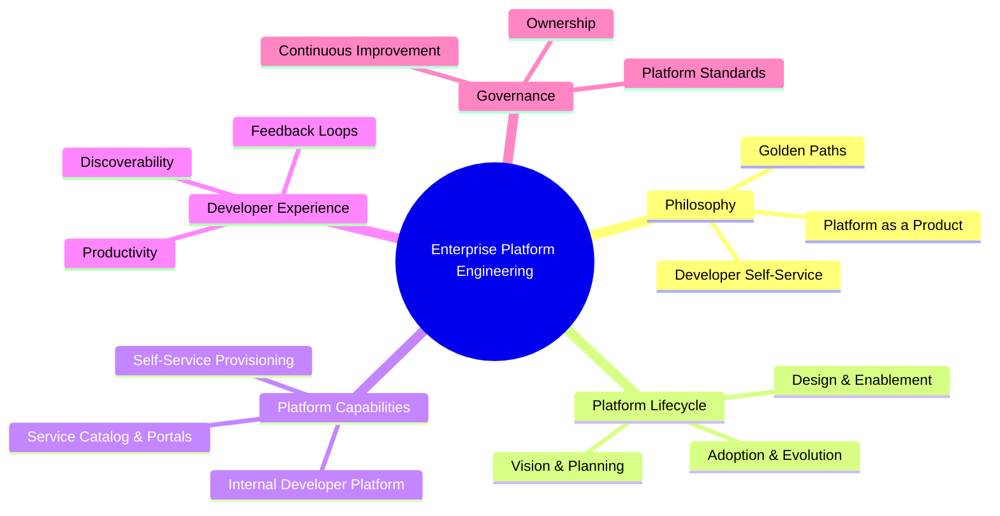
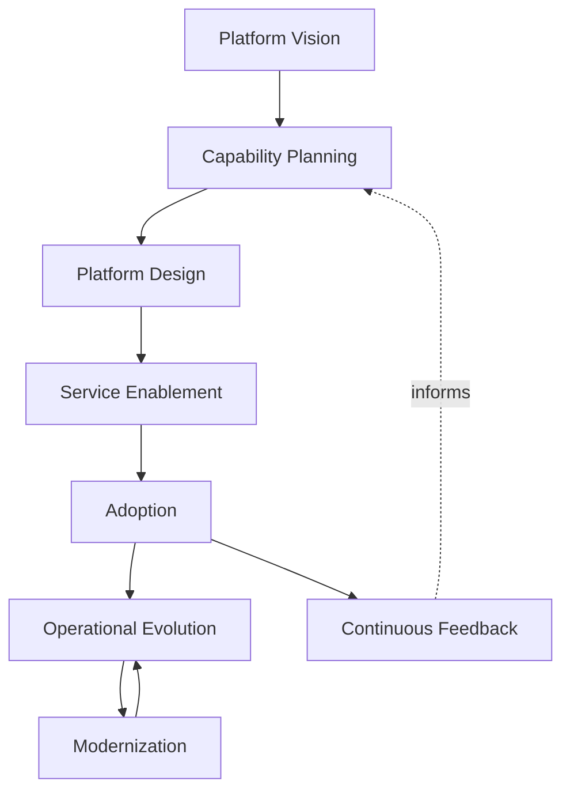
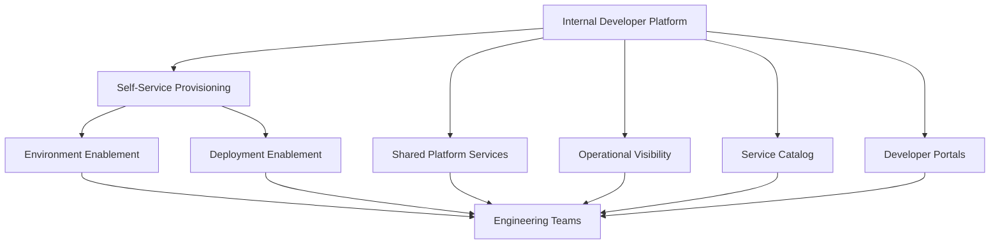
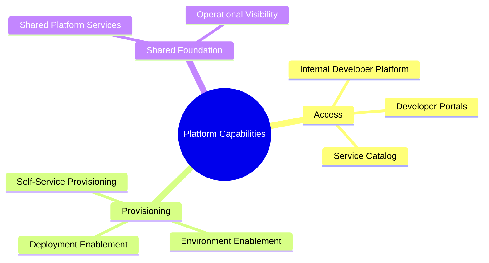
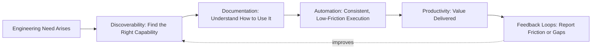
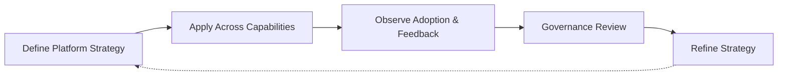

# Platform Engineering

## 1. Document Purpose

This document defines the enterprise strategy for platform engineering at **StackLeo** — how durable, self-service capability is built so that engineering teams can deliver safely and quickly without re-deriving delivery, infrastructure, and operational discipline for every service, without recommending specific platform tools, cloud providers, or implementations.

- **Purpose of Platform Engineering** — to make the practices defined across this repository — source control, delivery, infrastructure, observability, reliability — consumable as reusable, self-service capability, so that following the correct path is the easiest path for every engineering team, not an additional burden layered on top of their work.
- **Relationship with DevOps** — platform engineering is the mechanism through which the DevOps principles defined in `devops-principles.md` are made consistently practical at scale, rather than depending on every team independently interpreting and applying them.
- **Relationship with Infrastructure as Code** — `infrastructure-as-code.md` defines how infrastructure is declared and governed; platform engineering is how that declarative capability is exposed to engineering teams as safe, self-service functionality rather than requiring direct infrastructure expertise from every team.
- **Relationship with Cloud Strategy** — platform capability is designed to abstract away the specifics of underlying cloud infrastructure from the teams consuming it, keeping platform strategy coherent regardless of where or how infrastructure is ultimately hosted.
- **Relationship with Developer Experience** — platform engineering exists in direct service of developer experience; a platform that is difficult, inconsistent, or unclear to use has failed at its core purpose regardless of its technical sophistication.
- **Relationship with Business Agility** — the speed and safety with which engineering teams can deliver new capability is directly determined by the quality of the platform they build on; platform engineering is a direct investment in StackLeo's ability to respond to market opportunity.

This document is implementation-independent and vendor-neutral. It defines platform philosophy, lifecycle, and governance conceptually — not specific tools, providers, or platform implementations.

## 2. Platform Engineering Philosophy

- **Platform as a Product** — the internal platform is treated as a product with real users — engineering teams — whose needs, feedback, and adoption are actively managed, not as a passive collection of infrastructure.
- **Developer Self-Service** — engineering teams can access the capability they need — environments, delivery pipelines, infrastructure — without depending on manual, person-mediated requests.
- **Standardization** — common, well-understood patterns are made available consistently, reducing unnecessary variation across teams solving structurally similar problems.
- **Golden Paths** — the platform offers a clear, well-supported default path for common needs, making the correct approach the path of least resistance without prohibiting deliberate deviation where genuinely justified.
- **Shared Responsibility** — the platform team and the teams consuming the platform share responsibility for outcomes; the platform team owns the capability's quality, and consuming teams own how they use it.
- **Automation First** — repeatable platform interactions are automated by default, consistent with `devops-principles.md`, removing manual mediation as a source of delay and inconsistency.
- **Continuous Improvement** — the platform is expected to evolve deliberately based on real usage and feedback, rather than being defined once and left static.

*Diagram 1: Enterprise Platform Engineering Framework — the philosophy, lifecycle, capabilities, developer experience, and governance domains this strategy defines.*

## 3. Platform Lifecycle

### Platform Vision

- **Purpose** — establish the platform's overall purpose and the outcomes it exists to enable for engineering teams.
- **Business Value** — ensures platform investment is directed toward genuine organizational need.
- **Governance Objectives** — ensure the platform's direction can be traced back to a deliberate, agreed vision.

### Capability Planning

- **Purpose** — determine which specific capabilities the platform should offer, and in what order.
- **Business Value** — prioritizes platform investment toward the highest-value capability first.
- **Governance Objectives** — ensure capability planning is informed by genuine engineering team need, not assumption.

### Platform Design

- **Purpose** — shape how planned capability will be structured and made available to consuming teams.
- **Business Value** — ensures capability is designed for real usability, not only technical completeness.
- **Governance Objectives** — ensure design decisions are reviewed before implementation begins.

### Service Enablement

- **Purpose** — make a designed capability genuinely available for engineering teams to use.
- **Business Value** — converts platform investment into capability teams can actually rely on.
- **Governance Objectives** — ensure enablement includes the documentation and support needed for genuine adoption.

### Adoption

- **Purpose** — support engineering teams in actually beginning to use newly enabled capability.
- **Business Value** — realizes the value of platform investment only once capability is genuinely in use.
- **Governance Objectives** — treat adoption as a measured outcome, not an assumed consequence of availability.

### Operational Evolution

- **Purpose** — sustain and improve platform capability based on real usage during its primary period of use.
- **Business Value** — keeps platform capability genuinely useful rather than static and increasingly mismatched to need.
- **Governance Objectives** — ensure operational evolution is resourced rather than deprioritized after initial launch.

### Modernization

- **Purpose** — deliberately update platform capability to remain consistent with evolving standards and needs.
- **Business Value** — keeps mature platform capability sustainable rather than allowing it to become a growing liability.
- **Governance Objectives** — prevent long-lived capability from silently diverging from current governance expectations.

### Continuous Feedback

- **Purpose** — systematically gather and act on input from the teams consuming the platform.
- **Business Value** — keeps platform direction grounded in genuine user need rather than platform team assumption.
- **Governance Objectives** — ensure feedback is a structured, recurring input to planning, not an occasional afterthought.

*Diagram: Platform Lifecycle — the platform moves from vision and capability planning through design and enablement, into adoption and ongoing operational evolution, with continuous feedback informing future planning.*

### Platform Lifecycle Matrix

| Stage | Purpose | Business Value |
|---|---|---|
| Platform Vision | Establish overall purpose and enabled outcomes | Directs investment toward genuine organizational need |
| Capability Planning | Determine which capabilities to build, and in what order | Prioritizes investment toward highest-value capability |
| Platform Design | Shape structure and availability of planned capability | Ensures capability is designed for real usability |
| Service Enablement | Make designed capability genuinely available | Converts investment into capability teams can rely on |
| Adoption | Support teams in beginning to use new capability | Realizes value only once capability is genuinely in use |
| Operational Evolution | Sustain and improve capability based on real usage | Keeps capability useful rather than static |
| Modernization | Deliberately update capability over time | Keeps mature capability sustainable |
| Continuous Feedback | Systematically gather and act on user input | Keeps platform direction grounded in genuine need |

## 4. Platform Capabilities

### Internal Developer Platform (IDP)

- **Purpose** — provide a coherent, unified entry point through which engineering teams access platform capability.
- **Business Value** — reduces the cognitive overhead of navigating disparate tools and processes to get work done.
- **Strategic Objectives** — make the platform a single, trustworthy front door rather than a fragmented collection of capability.

### Self-Service Provisioning

- **Purpose** — allow engineering teams to provision environments and infrastructure capability without manual, person-mediated requests.
- **Business Value** — removes provisioning delay as a bottleneck to engineering velocity.
- **Strategic Objectives** — make provisioning fast, safe, and consistent regardless of which team initiates it.

### Shared Platform Services

- **Purpose** — provide common capability — such as authentication, observability, or delivery infrastructure — centrally rather than requiring each team to build it independently.
- **Business Value** — reduces duplicated effort and the risk of inconsistent, divergent implementations of the same underlying need.
- **Strategic Objectives** — make shared capability the default, easier choice relative to independent reimplementation.

### Service Catalog

- **Purpose** — provide a discoverable inventory of available platform capability and the services built on top of it.
- **Business Value** — reduces time spent searching for or unknowingly duplicating existing capability.
- **Strategic Objectives** — make what already exists genuinely discoverable to every team.

### Developer Portals

- **Purpose** — provide a consolidated, navigable interface through which engineering teams interact with platform capability and documentation.
- **Business Value** — reduces the friction of engaging with the platform to a single, familiar starting point.
- **Strategic Objectives** — make platform interaction intuitive rather than requiring specialized platform knowledge.

### Environment Enablement

- **Purpose** — provide consistent, self-service access to the environment categories defined in `environment-management.md`.
- **Business Value** — reduces delay and inconsistency in how teams obtain and use environments.
- **Strategic Objectives** — make environment access uniform in experience across every consuming team.

### Deployment Enablement

- **Purpose** — provide consistent, self-service access to the delivery and deployment capability defined in `ci-cd-strategy.md` and `deployment-strategy.md`.
- **Business Value** — reduces the effort required for any team to deliver safely, without re-deriving delivery discipline.
- **Strategic Objectives** — make safe delivery the default outcome of using the platform, not a separately achieved skill.

### Operational Visibility

- **Purpose** — provide consistent, self-service access to the observability and monitoring capability defined in `observability.md` and `monitoring.md`.
- **Business Value** — reduces the effort required for any team to understand and operate what they have built.
- **Strategic Objectives** — make operational insight a built-in property of using the platform, not an added responsibility.

*Diagram 2: Internal Developer Platform Concept — the IDP serves as the unified entry point through which engineering teams access self-service provisioning, shared services, and operational visibility, all discoverable through the service catalog and developer portal.*

*Diagram 3: Platform Capability Model — the eight platform capabilities, grouped by whether they primarily serve access, provisioning, or shared foundational needs.*

### Platform Capability Matrix

| Capability | Purpose | Strategic Objective |
|---|---|---|
| Internal Developer Platform (IDP) | Coherent, unified entry point to platform capability | Single, trustworthy front door, not a fragmented collection |
| Self-Service Provisioning | Provision environments and infrastructure without manual mediation | Fast, safe, consistent provisioning for any team |
| Shared Platform Services | Provide common capability centrally | Make shared capability the default, easier choice |
| Service Catalog | Discoverable inventory of available capability | Make existing capability genuinely discoverable |
| Developer Portals | Consolidated interface for platform interaction | Make interaction intuitive, not specialized |
| Environment Enablement | Self-service access to environment categories | Uniform environment access experience across teams |
| Deployment Enablement | Self-service access to delivery and deployment capability | Make safe delivery the default outcome |
| Operational Visibility | Self-service access to observability and monitoring | Make operational insight built-in, not an added task |

## 5. Developer Experience (DevEx)

- **Productivity** — the platform is measured, in part, by how much friction it removes from an engineer's ability to deliver value, not only by the capability it technically provides.
- **Standardized Workflows** — common tasks follow consistent, predictable patterns across the platform, reducing the cognitive cost of context-switching between services.
- **Discoverability** — capability, documentation, and ownership are genuinely findable, so engineers are not dependent on informal, person-to-person knowledge transfer.
- **Documentation** — every platform capability is documented clearly enough to be used correctly without requiring direct assistance from the platform team.
- **Automation** — repeatable interactions with the platform are automated, consistent with Automation First in Section 2, minimizing manual, error-prone steps.
- **Feedback Loops** — engineers have a clear, low-friction way to report friction or gaps, and can observe that feedback leads to genuine improvement over time.
- **Operational Simplicity** — the platform reduces, rather than adds to, the operational burden an engineering team must carry to run what they build.

*Diagram 4: Developer Experience Flow — an engineering need moves through discovery, documentation, and automated execution toward delivered value, with feedback continuously improving discoverability for the next need.*

### Developer Experience Matrix

| Dimension | Focus | Business Value |
|---|---|---|
| Productivity | Friction removed from delivering value | Faster time from need to delivered capability |
| Standardized Workflows | Consistent, predictable common task patterns | Reduces cognitive cost of context-switching |
| Discoverability | Genuinely findable capability and documentation | Reduces dependence on informal knowledge transfer |
| Documentation | Clear, self-sufficient usage guidance | Reduces dependency on direct platform team assistance |
| Automation | Automated, repeatable platform interactions | Minimizes manual, error-prone steps |
| Feedback Loops | Low-friction reporting with visible improvement | Keeps the platform aligned with genuine user need |
| Operational Simplicity | Reduced, not added, operational burden | Frees engineering teams to focus on their own capability |

## 6. Platform Governance

- **Ownership** — the platform has a clearly accountable owning team responsible for its overall health, direction, and adherence to enterprise standards.
- **Platform Standards** — capability exposed through the platform is held to a consistent, defined standard of quality, documentation, and support.
- **Capability Review** — new and existing platform capability is periodically reviewed for continued relevance, quality, and adoption.
- **Service Lifecycle** — every platform capability is managed through a defined lifecycle, from introduction through eventual deprecation, mirroring the discipline in `repository-strategy.md`.
- **Documentation Governance** — platform documentation is treated as a required deliverable of any capability, kept current as capability evolves.
- **Continuous Improvement** — platform governance itself is expected to mature as the organization and platform scale grow.

### Platform Governance Matrix

| Governance Area | Focus | Accountable For |
|---|---|---|
| Ownership | Clearly accountable owning team for the platform | Overall platform health and direction |
| Platform Standards | Consistent quality, documentation, and support bar | Ensuring exposed capability meets a defined standard |
| Capability Review | Periodic reassessment of relevance and quality | Preventing stale or low-value capability from persisting |
| Service Lifecycle | Defined progression from introduction to deprecation | Consistent expectations at every capability stage |
| Documentation Governance | Documentation as a required capability deliverable | Keeping documentation current as capability evolves |
| Continuous Improvement | Maturing governance itself over time | Governance that scales with organizational growth |

## 7. Future Readiness

- **Cloud-Native Platforms** — platform capability is defined independent of any specific provider, allowing adoption of elastic, provider-hosted infrastructure without redefining the platform strategy.
- **Kubernetes** — self-service provisioning and deployment enablement extend naturally to container orchestration concepts, consistent with `kubernetes-strategy.md`, without requiring a separate platform philosophy.
- **Microservices** — as capability decomposes into a growing number of independently deployable services, platform capability scales to support a growing number of consuming teams without redefinition.
- **AI Systems** — platform capability extends to support AI-assisted capability delivery, versioning, and observability under the same self-service and governance principles as any other capability.
- **Marketplace Platform** — as StackLeo evolves toward business sales, corporate accounts, wholesale, and a multi-vendor marketplace, the platform accommodates a broader, more diverse set of consuming teams, including seller-facing capability, without redefinition.
- **Multi-Region Operations** — as StackLeo expands from Bangladesh into South Asia and, over time, global markets, platform capability accommodates regional variation without disrupting core self-service principles.
- **Global Engineering Teams** — platform capability remains independent of consuming team location, supporting distributed teams accessing the same consistent, self-service experience.

## 8. Governance

- **Ownership** — a designated platform engineering governance owner is accountable for the coherence and enforcement of this strategy across the platform.
- **Review Process** — significant changes to platform vision, capability priorities, or governance expectations are reviewed consistent with the review discipline in `03_System_Design/architecture-decisions.md`.
- **Platform Policies** — individual platform capabilities may define detail consistent with this strategy, but may not bypass its governance or standardization principles.
- **Audit Readiness** — platform usage, ownership, and capability records are maintained in a state that supports audit and investigation at any time.
- **Continuous Improvement** — platform engineering strategy is expected to mature as the organization, platform scale, and engineering needs evolve, consistent with `devops-principles.md`.

*Diagram 5: Continuous Platform Improvement Cycle — platform strategy is applied across every capability, adoption and feedback are observed, reviewed by governance, and refined, with refinements feeding directly back into the strategy.*

### Governance Responsibility Matrix

| Governance Area | Owner | Accountable For |
|---|---|---|
| Ownership | Platform Engineering Governance Owner | Coherence and enforcement of this strategy |
| Review Process | Architecture & Platform Leadership | Reviewing changes to vision and capability priorities |
| Platform Policies | Platform Capability Owning Teams | Detail consistent with enterprise governance principles |
| Audit Readiness | Platform & Security Teams | Usage and capability records ready for audit |
| Continuous Improvement | Platform Engineering Team | Maturing strategy as organization and needs evolve |

## 9. Anti-Patterns

- **Platform Without Product Thinking** — building platform capability without treating engineering teams as genuine users whose needs must be understood and served. This produces capability that is technically complete but practically unused.
- **Weak Developer Experience** — allowing the platform to be difficult, inconsistent, or unclear to use. This drives teams to work around the platform rather than through it, defeating its purpose.
- **Manual Service Provisioning** — requiring manual, person-mediated action to provision environments or infrastructure. This reintroduces the delay and inconsistency self-service exists to remove.
- **Platform Fragmentation** — allowing inconsistent, disconnected tooling and processes to accumulate under the platform's umbrella. This recreates the exact confusion the platform exists to eliminate.
- **Poor Documentation** — allowing platform capability to be exposed without clear, current documentation. This forces engineers to depend on direct assistance the platform team cannot scale to provide.
- **Weak Ownership** — leaving platform capability without a clearly accountable owner. This causes quality, documentation, and support to degrade with no one responsible for correcting it.
- **Reactive Platform Evolution** — evolving the platform only in response to acute pain rather than deliberate, planned improvement. This means the platform consistently lags genuine engineering need.
- **Missing Governance** — allowing platform capability to be introduced, changed, or retired without consistent standards or review. This produces an inconsistent, ungovernable platform as the organization scales.

### Anti-Pattern Summary

| Anti-Pattern | Why It Must Be Avoided |
|---|---|
| Platform Without Product Thinking | Produces capability that is technically complete but practically unused |
| Weak Developer Experience | Drives teams to work around the platform, defeating its purpose |
| Manual Service Provisioning | Reintroduces the delay and inconsistency self-service exists to remove |
| Platform Fragmentation | Recreates the confusion the platform exists to eliminate |
| Poor Documentation | Forces dependence on assistance the platform team cannot scale to provide |
| Weak Ownership | Quality, documentation, and support degrade with no accountable owner |
| Reactive Platform Evolution | The platform consistently lags genuine engineering need |
| Missing Governance | Produces an inconsistent, ungovernable platform at scale |

## 10. Document Information

| Property | Value |
|----------|-------|
| Document | platform-engineering.md |
| Version | 1.0.0 |
| Status | Active |
| Maintained By | StackLeo |
| Last Updated | 2026-07-24 |

---

© StackLeo. All Rights Reserved.
