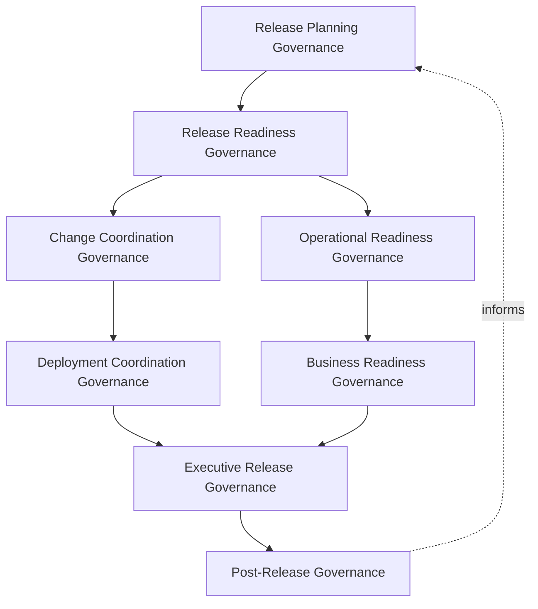
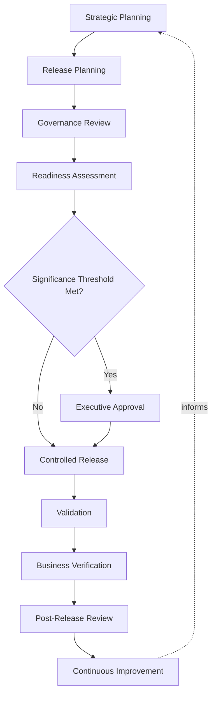
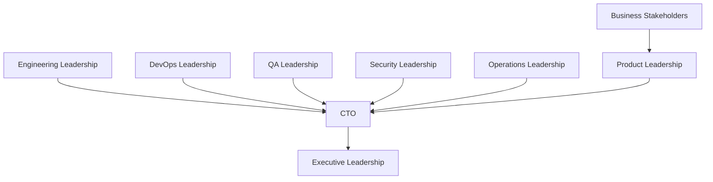
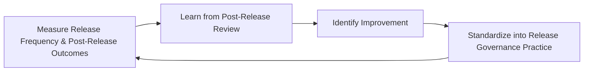
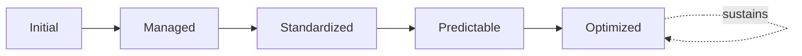

# Enterprise Release Management Governance Framework

## 1. Executive Summary

**Purpose** — This document defines the official Enterprise Release Management Governance Framework for **StackLeo Tech Store**. It establishes release oversight, release approval governance, organizational accountability, executive decision-making, release readiness, business continuity alignment, and continuous release improvement as a deliberate, accountable enterprise discipline. `release-management.md` remains the operational release framework for `07_DEVOPS` — the document that elaborates release philosophy, lifecycle, categories, and version governance in full operational depth. This framework sits above it as the highest-level executive mandate, consistent with the executive-charter relationship `deployment-governance.md` holds over `deployment-strategy.md` and `devops-governance-framework.md` holds over `devops-overview.md`: it does not restate release execution detail, it establishes the accountability structure, governance model, and executive expectations that give release decisions their authority across the whole organization.

**Scope** — This framework applies to every category of release at StackLeo — major, minor, maintenance, emergency, security, hotfix, platform, and marketplace releases — across the full business lifecycle from the current B2C web platform through future mobile app, physical store, POS, corporate sales, wholesale, and multi-vendor marketplace expansion.

**Strategic Objectives** — To ensure the release decision is always made deliberately by accountable people; that release readiness is genuinely confirmed, not assumed, before customer exposure; that business and operational readiness are weighed alongside technical readiness; and that executive leadership has genuine, continuous visibility into release governance health and maturity.

**Business Value** — Governed release management protects the trust every release either sustains or spends, reduces the business cost of avoidable release failure, and gives leadership the confidence to increase release frequency and market responsiveness without accepting ungoverned risk.

**Intended Audience** — Executive leadership, the Chief Technology Officer, product leadership, engineering and DevOps leadership, QA leadership, security leadership, operations leadership, business stakeholders, and independent audit and oversight functions.

## 2. Enterprise Release Vision

- **Enterprise Release Strategy** — releases at StackLeo are governed as deliberate business events, not merely technical completions, coordinated across every function with a genuine stake in the outcome.
- **Business Alignment** — every release decision traces to genuine business value, consistent with `01_Business/business-model.md`, never released for technical convenience alone.
- **Customer Experience** — release governance exists to protect and enhance the customer's experience of the platform, consistent with the trust-centered brand commitment in `01_Business/vision.md`.
- **Reliability** — a release is governed to sustain, never threaten, the platform's reliability, coordinated with `07_DEVOPS/sre-strategy.md`.
- **Release Stability** — release governance protects a predictable, stable release cadence, preventing releases from becoming a recurring source of organizational disruption.
- **Operational Readiness** — a release proceeds only once the organization is genuinely prepared to support and sustain it, coordinated with `operational-readiness.md`.
- **Business Continuity** — release governance is treated as a direct contributor to business continuity, coordinated with `09_OPERATIONS/business-continuity-governance.md`, never an independent technical concern.

### Enterprise Release Vision Matrix

| Vision Element | Focus | Business Value |
|---|---|---|
| Enterprise Release Strategy | Releases governed as deliberate business events | Ensures releases reflect coordinated, cross-functional intent |
| Business Alignment | Every release traces to genuine business value | Prevents releases driven by technical convenience alone |
| Customer Experience | Governance protects and enhances customer experience | Protects the trust-centered brand commitment |
| Reliability | Releases sustain, never threaten, platform reliability | Connects release governance to sustained reliability |
| Release Stability | Protects predictable, stable release cadence | Prevents releases from becoming a source of disruption |
| Operational Readiness | Release proceeds only once support is genuinely prepared | Ensures the organization can sustain what it releases |
| Business Continuity | Release governance as a direct continuity contributor | Connects release decisions to business resilience |

## 3. Release Governance Principles

Release governance at StackLeo rests on eight principles, each producing a specific business outcome.

- **Governance Before Release** — the accountability structure for a release is established before it is executed, never inferred after the fact. *Business Value:* ensures releases proceed because a genuine, governed decision called for them.
- **Business Value First** — every release traces to a genuine, articulated business value it exists to deliver. *Business Value:* ensures release effort is directed toward what genuinely matters to the business.
- **Risk-Based Decision Making** — the scrutiny a release receives is proportionate to its genuine potential impact. *Business Value:* directs governance attention where a release failure would matter most.
- **Customer-Centric Releases** — every release decision considers its genuine effect on the customer, not only its internal technical completion. *Business Value:* protects the trust relationship every release either sustains or spends.
- **Accountability** — every release traces to a specific, named, responsible owner from planning through post-release review. *Business Value:* ensures no release proceeds without someone genuinely responsible for its outcome.
- **Transparency** — release status, decisions, and outcomes are documented and visible to those who genuinely need them. *Business Value:* allows release governance to be scrutinized and defended, not merely asserted.
- **Traceability** — every release traces to its authorizing decision, its content, and its outcome. *Business Value:* supports accountability, audit, and confident investigation when something goes wrong.
- **Continuous Improvement** — release governance practice matures over time, informed by real release outcomes. *Business Value:* keeps release governance aligned with the organization's growing scale and complexity.

### Release Governance Principles Matrix

| Principle | Description | Business Value |
|---|---|---|
| Governance Before Release | Accountability established before execution | Ensures releases proceed on a genuine, governed decision |
| Business Value First | Every release traces to articulated business value | Directs release effort toward what genuinely matters |
| Risk-Based Decision Making | Scrutiny proportionate to genuine potential impact | Directs governance attention where it matters most |
| Customer-Centric Releases | Decisions consider genuine effect on the customer | Protects the trust relationship every release affects |
| Accountability | Every release traces to a specific, named, responsible owner | Ensures no release proceeds without genuine responsibility |
| Transparency | Status, decisions, and outcomes documented and visible | Allows release governance to be scrutinized and defended |
| Traceability | Every release traces to decision, content, and outcome | Supports accountability, audit, and investigation |
| Continuous Improvement | Practice matures from real release outcomes | Keeps governance aligned with growing scale and complexity |

## 4. Enterprise Release Governance Model

Release governance operates across eight conceptual layers, each holding accountability for a distinct dimension of the release decision.

### Release Planning Governance

- **Purpose** — own the coherence of how release scope and timing are deliberately decided.
- **Governance Scope** — oversight of Release Planning and Scope Definition (`release-management.md`, Sections 3).
- **Business Value** — ensures every release traces to a deliberate planning decision, never an accumulation of unreviewed change.
- **Executive Expectations** — leadership trusts release scope is genuinely deliberate, not assembled by default.

### Release Readiness Governance

- **Purpose** — own the coherence of how a release is confirmed genuinely ready to proceed.
- **Governance Scope** — oversight of Release Readiness (`release-management.md`, Section 7), coordinated with `08_QUALITY_ASSURANCE/testing-governance.md`.
- **Business Value** — ensures readiness is genuinely confirmed, not assumed from schedule alone.
- **Executive Expectations** — leadership trusts readiness criteria are never silently bypassed under schedule pressure.

### Change Coordination Governance

- **Purpose** — own the coherence of how a release's content is coordinated across teams and dependent systems.
- **Governance Scope** — oversight coordinated with `09_OPERATIONS/change-management-governance.md`.
- **Business Value** — prevents avoidable conflict between simultaneous, uncoordinated change.
- **Executive Expectations** — leadership trusts release content is genuinely coordinated, not assembled in isolation by individual teams.

### Deployment Coordination Governance

- **Purpose** — own the coherence of how a governed release decision connects to the technical act of deployment.
- **Governance Scope** — oversight coordinated with `deployment-governance.md` and `deployment-strategy.md`.
- **Business Value** — ensures the release decision and its technical execution remain connected and consistent.
- **Executive Expectations** — leadership trusts the release decision genuinely governs when and how deployment proceeds.

### Operational Readiness Governance

- **Purpose** — own the coherence of how the organization confirms it is prepared to operate and support what is released.
- **Governance Scope** — oversight coordinated with `operational-readiness.md` and `09_OPERATIONS/operational-excellence-framework.md`.
- **Business Value** — ensures a release is never exposed to customers before the organization can genuinely sustain it.
- **Executive Expectations** — leadership trusts operational readiness is verified, never assumed.

### Business Readiness Governance

- **Purpose** — own the coherence of how business stakeholders confirm genuine readiness for a release's business impact.
- **Governance Scope** — oversight ensuring business stakeholders, not only engineering, confirm release readiness.
- **Business Value** — ensures the business is genuinely prepared for a release's commercial, support, and communication consequences.
- **Executive Expectations** — leadership expects business readiness to carry equal weight to technical readiness.

### Executive Release Governance

- **Purpose** — own executive-level accountability for the releases carrying the greatest organizational consequence.
- **Governance Scope** — oversight spanning Sections 4.1–4.6 and 4.8 wherever a release rises to genuine executive concern.
- **Business Value** — ensures the most consequential releases are visible at the level accountable for the organization as a whole.
- **Executive Expectations** — leadership expects to be informed of, not surprised by, the organization's most significant release decisions.

### Post-Release Governance

- **Purpose** — own the coherence of how a completed release is reviewed and its lessons captured.
- **Governance Scope** — oversight of Release Review (`release-management.md`, Section 3).
- **Business Value** — ensures every release genuinely strengthens future release governance, regardless of whether it succeeded without incident.
- **Executive Expectations** — leadership expects every significant release to produce a documented, attributable lesson.

### Release Governance Matrix

| Layer | Purpose | Business Value | Executive Expectations |
|---|---|---|---|
| Release Planning Governance | Own coherence of deliberate scope and timing decisions | Ensures every release traces to a deliberate decision | Trusts scope is genuinely deliberate, not assembled by default |
| Release Readiness Governance | Own coherence of confirming genuine readiness | Ensures readiness is confirmed, not assumed | Trusts readiness criteria are never silently bypassed |
| Change Coordination Governance | Own coherence of coordinating content across teams | Prevents avoidable conflict between uncoordinated change | Trusts content is genuinely coordinated, not isolated |
| Deployment Coordination Governance | Own coherence of connecting decision to execution | Keeps the decision and its execution connected and consistent | Trusts the decision genuinely governs deployment |
| Operational Readiness Governance | Own coherence of confirming preparedness to operate | Ensures releases are never exposed before support is ready | Trusts readiness is verified, never assumed |
| Business Readiness Governance | Own coherence of confirming genuine business readiness | Ensures the business is prepared for commercial consequences | Expects business readiness to carry equal weight to technical |
| Executive Release Governance | Own executive accountability for highest-consequence releases | Ensures the most consequential releases are visible to leadership | Expects leadership informed of, not surprised by, top decisions |
| Post-Release Governance | Own coherence of reviewing completed releases | Ensures every release strengthens future governance | Expects every significant release to produce a documented lesson |

*Diagram 1: Enterprise Release Governance Framework — planning and readiness governance branch into change coordination and operational readiness, converging through deployment coordination and business readiness on executive release governance, resolving into post-release governance that feeds back into planning.*

## 5. Enterprise Release Types

Release governance is exercised across eight conceptual release types, each requiring a distinct governance emphasis. Every type here is elaborated in full operational depth in `release-management.md` (Section 4).

- **Major Releases** — releases introducing substantial new capability or business change; governed under Executive Release Governance (Section 4) given their significant consequence.
- **Minor Releases** — releases introducing incremental capability; governed under standard Release Planning and Readiness Governance (Section 4).
- **Maintenance Releases** — releases addressing accumulated non-urgent fixes; governed under Release Planning Governance with routine cadence.
- **Emergency Releases** — releases addressing urgent, unplanned need; governed under compressed but never bypassed governance, consistent with Risk-Based Decision Making (Section 3).
- **Security Releases** — releases addressing security-relevant findings; governed jointly with, and never superseding, `06_Security/security-governance.md`.
- **Hotfix Releases** — releases addressing a specific, narrow, urgent defect; governed under expedited Release Readiness Governance without bypassing genuine verification.
- **Platform Releases** — releases affecting shared platform capability consumed by multiple teams; governed under Change Coordination Governance given their broad dependency footprint.
- **Marketplace Releases** — releases affecting sales and, eventually, multi-vendor marketplace capability; governed under Business Readiness Governance given direct commercial consequence.

### Release Type Matrix

| Release Type | Governance Emphasis | Business Consideration |
|---|---|---|
| Major Releases | Executive Release Governance | Significant business and customer consequence |
| Minor Releases | Standard planning and readiness governance | Incremental capability, routine governance rigor |
| Maintenance Releases | Release Planning Governance, routine cadence | Accumulated non-urgent fixes |
| Emergency Releases | Compressed but never bypassed governance | Urgent, unplanned business or technical need |
| Security Releases | Joint governance with security governance | Security-relevant findings requiring urgent action |
| Hotfix Releases | Expedited readiness governance without bypass | Narrow, urgent defect requiring rapid, safe correction |
| Platform Releases | Change Coordination Governance | Broad dependency footprint across multiple teams |
| Marketplace Releases | Business Readiness Governance | Direct commercial consequence |

## 6. Enterprise Release Lifecycle

Release governance operates across ten conceptual lifecycle stages.

- **Strategic Planning** — *Objective:* connect a proposed release to genuine business strategy before scope is defined.
- **Release Planning** — *Objective:* determine what will be released, when, and under what conditions.
- **Governance Review** — *Objective:* confirm the planned release has been reviewed against the appropriate governance layer in Section 4.
- **Readiness Assessment** — *Objective:* confirm technical, operational, and business readiness are all genuinely established.
- **Executive Approval** — *Objective:* secure explicit executive authorization for any release meeting a defined significance threshold.
- **Controlled Release** — *Objective:* execute the release through a consistent, governed process, coordinated with `deployment-governance.md`.
- **Validation** — *Objective:* confirm the released change is genuinely present and functioning as intended.
- **Business Verification** — *Objective:* confirm the release genuinely delivers the business value it was intended to deliver.
- **Post-Release Review** — *Objective:* deliberately assess how the release went, regardless of whether it succeeded without incident.
- **Continuous Improvement** — *Objective:* apply captured lessons to strengthen future release governance practice.

### Release Lifecycle Matrix

| Stage | Objective | Business Value |
|---|---|---|
| Strategic Planning | Connect the release to genuine business strategy | Ensures release scope reflects genuine business intent |
| Release Planning | Determine what, when, and under what conditions | Ensures deliberate, traceable release intent |
| Governance Review | Confirm review against the appropriate governance layer | Ensures the release is reviewed by the accountable function |
| Readiness Assessment | Confirm technical, operational, and business readiness | Prevents release before genuine, complete readiness |
| Executive Approval | Secure authorization above significance thresholds | Ensures the most consequential releases carry genuine sign-off |
| Controlled Release | Execute through a consistent, governed process | Makes release routine and predictable |
| Validation | Confirm the change is genuinely present and functioning | Catches release-specific issues immediately |
| Business Verification | Confirm genuine delivery of intended business value | Ensures releases are judged by business outcome, not completion |
| Post-Release Review | Deliberately assess how the release went | Converts every release into organizational learning |
| Continuous Improvement | Apply lessons to strengthen future governance | Keeps practice aligned with growing scale and complexity |

*Diagram 2: Enterprise Release Lifecycle — strategic and release planning inform governance review and readiness assessment, escalating to executive approval only where thresholds are met before controlled release, validation, and business verification, with post-release review and continuous improvement feeding back into the cycle.*

## 7. Organizational Governance

Governance accountability is distributed deliberately across nine organizational roles.

- **Executive Leadership** — holds ultimate accountability for whether release decisions are genuinely governed as an enterprise discipline.
- **CTO** — owns the coherence and enforcement of this framework across every release type and governance layer it defines.
- **Product Leadership** — owns Business Value First (Section 3) and Business Readiness Governance (Section 4) for their assigned capability.
- **Engineering Leadership** — owns Release Planning and Change Coordination Governance (Section 4) within their accountable teams.
- **DevOps Leadership** — owns Deployment Coordination Governance (Section 4) in coordination with `deployment-governance.md`.
- **QA Leadership** — owns Release Readiness Governance (Section 4) in coordination with `08_QUALITY_ASSURANCE/testing-governance.md`.
- **Security Leadership** — owns Security Releases (Section 5) jointly with `06_Security/security-governance.md`, which remains authoritative for security-specific obligations.
- **Operations Leadership** — owns Operational Readiness Governance (Section 4) in coordination with `09_OPERATIONS/operations-governance-strategy.md`.
- **Business Stakeholders** — own Business Verification (Section 6) for their affected capability, confirming genuine delivery of intended value.

### Governance Responsibility Matrix

| Role | Governance Objective | Business Value |
|---|---|---|
| Executive Leadership | Hold ultimate accountability for governed release decisions | Provides a single point of ultimate accountability |
| CTO | Own coherence and enforcement of this framework | Provides a single point of specialist accountability |
| Product Leadership | Own business value first and business readiness governance | Ensures releases connect to genuine business value |
| Engineering Leadership | Own release planning and change coordination | Embeds governance closest to where release content is built |
| DevOps Leadership | Own deployment coordination governance | Keeps the release decision connected to its execution |
| QA Leadership | Own release readiness governance | Ensures readiness rests on genuine verification evidence |
| Security Leadership | Own security releases jointly with security governance | Keeps security-relevant releases governed with mandatory rigor |
| Operations Leadership | Own operational readiness governance | Ensures the organization can genuinely sustain what is released |
| Business Stakeholders | Own business verification for affected capability | Confirms releases deliver their intended value |

*Diagram 4: Organizational Release Governance Model — accountability flows from engineering, DevOps, QA, security, operations, and product leadership, with business stakeholders feeding through product leadership, into the CTO, converging on executive leadership.*

## 8. Release Risk Governance

Release-related risk is governed across seven conceptual categories, coordinated with `06_Security/enterprise-risk-management-strategy.md`.

- **Business Risk** — the risk that a release fails to deliver, or actively undermines, genuine business value.
- **Technical Risk** — the risk that a release introduces instability, defects, or incompatibility into the running platform.
- **Security Risk** — the risk that a release introduces or exposes a genuine security weakness, governed jointly with `06_Security/security-governance.md`.
- **Operational Risk** — the risk that a release cannot be adequately operated, supported, or recovered once live.
- **Customer Impact** — the risk that a release produces a genuine, negative effect on the customer's experience of the platform.
- **Compliance Risk** — the risk that a release fails to meet a genuine regulatory or contractual obligation.
- **Vendor Dependency** — the risk introduced through a release's dependency on a third-party vendor or integration partner.

### Release Risk Matrix

| Risk Category | Focus | Governance Coordination |
|---|---|---|
| Business Risk | Failure to deliver, or actively undermining, business value | Coordinated with enterprise risk management |
| Technical Risk | Instability, defects, or incompatibility | Coordinated with testing and release readiness governance |
| Security Risk | Introduced or exposed security weakness | Coordinated with `06_Security/security-governance.md` |
| Operational Risk | Inadequate ability to operate, support, or recover | Coordinated with operational readiness governance |
| Customer Impact | Genuine, negative effect on customer experience | Coordinated with customer experience governance |
| Compliance Risk | Failure to meet regulatory or contractual obligation | Coordinated with compliance governance |
| Vendor Dependency | Dependency on third-party vendors or partners | Coordinated with third-party risk governance |

## 9. Executive Oversight

- **Executive Release Reviews** — the overall coherence of release governance is formally reviewed on a regular cadence.
- **Release Readiness Reviews** — executive leadership reviews the organization's readiness to authorize significant releases.
- **Governance Reporting** — aggregated release health — release frequency, readiness confirmation rate, post-release outcomes — is reported to executive leadership and the Board.
- **Operational Readiness Reviews** — sustained operational preparedness for upcoming releases is reviewed as a distinct, ongoing concern.
- **Business Impact Reviews** — the genuine business value delivered by recent releases is reviewed directly with executive leadership.
- **Continuous Improvement Reviews** — the organization's follow-through on captured release governance lessons is reviewed directly with executive leadership.

### Executive Oversight Matrix

| Oversight Mechanism | Purpose | Governance Role |
|---|---|---|
| Executive Release Reviews | Confirm overall release governance coherence | Regular, predictable cadence for the framework as a whole |
| Release Readiness Reviews | Review readiness to authorize significant releases | Direct executive-level review of release decision rigor |
| Governance Reporting | Provide leadership a single, coherent release picture | Reports frequency, readiness confirmation, post-release outcomes |
| Operational Readiness Reviews | Review sustained operational preparedness | Treats readiness as ongoing, not assumed from prior success |
| Business Impact Reviews | Review genuine business value delivered | Confirms releases are judged by business outcome |
| Continuous Improvement Reviews | Review follow-through on captured lessons | Direct executive-level review of improvement completion |

## 10. Future Readiness

This framework is designed to remain valid as StackLeo evolves in scale, geography, and organizational complexity.

- **AI-Assisted Release Governance** — as release readiness assessment increasingly incorporates AI-assisted analysis, it remains governed under Release Readiness Governance (Section 4) at the same rigor as any other method.
- **Intelligent Release Planning** — where release planning increasingly draws on intelligent pattern analysis, that analysis remains subject to Release Planning Governance (Section 4).
- **Progressive Delivery (Conceptual)** — as gradual, staged release exposure practice matures, it remains governed under the same lifecycle and risk principles defined in this framework, elaborated operationally in `deployment-strategy.md`.
- **Enterprise Scale** — the governance model, types, and lifecycle defined throughout this framework are defined independently of organizational size.
- **Multi-Region Releases** — Release Planning and Business Readiness Governance (Section 4) are structured to extend coherently as StackLeo expands from Bangladesh into South Asia and global markets.
- **Global Operations** — this framework's governance discipline remains coherent as release coordination extends across distributed, multi-region teams and time zones.
- **Digital Enterprise** — this framework's governance discipline is treated as a direct contributor to the digital trust customers, partners, and regulators extend to StackLeo, not merely an internal technical exercise.

## 11. Release Maturity Model

Release governance maturity is described across five conceptual levels.

- **Initial** — release governance, where it exists, is informal and inconsistent; releases proceed reactively, and ownership is unclear.
- **Managed** — basic release governance exists for individual release types, but consistency across the eight types in Section 5 varies significantly.
- **Standardized** — the governance model, types, and lifecycle are standardized, documented, and consistently applied across the organization.
- **Predictable** — release outcomes are genuinely predictable; timing, readiness, and business impact are forecast with confidence grounded in accumulated evidence.
- **Optimized** — release governance is continuously and deliberately improved based on quantitative evidence and organizational learning; improvement itself is a managed, ongoing discipline.

### Release Maturity Matrix

| Level | Characteristics | Primary Focus |
|---|---|---|
| Initial | Informal, inconsistent governance; releases proceed reactively | Ad hoc, individually-dependent release practice |
| Managed | Basic governance exists per release type; consistency varies | Type-level consistency |
| Standardized | Standardized governance model, types, and lifecycle | Organization-wide consistency and clear ownership |
| Predictable | Outcomes genuinely predictable, forecast with confidence | Evidence-based release governance decisions |
| Optimized | Practice continuously and deliberately improved from evidence | Sustained, deliberate improvement as a discipline |

*Diagram 5: Continuous Release Improvement Cycle — release outcomes are measured, learned from, improved upon, and standardized back into governed practice, on a continuing basis.*

*Diagram 6: Release Maturity Progression — maturity advances from informal, reactive release practice toward standardized, predictable, and continuously optimized release governance.*

## 12. Governance Anti-Patterns

- **Releases Without Governance** — releases proceeding without genuine governance leave no accountable record of why they occurred or who authorized them, creating organizational risk that compounds as release frequency increases.
- **Weak Approval Processes** — approval that exists in name only, without genuine scrutiny proportionate to risk, leaves consequential releases effectively ungoverned.
- **Poor Cross-Team Coordination** — releases that proceed without genuine coordination create avoidable conflict and confused response when something goes wrong.
- **Reactive Releases** — treating release governance as adequate only until a failure proves otherwise means avoidable failures, not deliberate design, drive improvement.
- **Undefined Ownership** — a release with no accountable owner has no one genuinely responsible for its outcome, leaving business impact unmanaged.
- **Weak Documentation** — allowing release records to diverge from actual outcomes makes investigation and future governance decisions unreliable.
- **No Executive Visibility** — leadership cannot govern release risk and maturity it is never genuinely shown, undermining the accountability this framework depends on.
- **Missing Continuous Learning** — treating current release practice as a permanently finished state guarantees it falls behind the platform's growing scale and business complexity.

### Anti-Pattern Summary

| Anti-Pattern | Organizational Risk & Business Impact |
|---|---|
| Releases Without Governance | Creates unaccountable risk that compounds as release frequency increases |
| Weak Approval Processes | Leaves consequential releases effectively ungoverned despite nominal approval |
| Poor Cross-Team Coordination | Creates avoidable conflict and confused response when problems occur |
| Reactive Releases | Lets avoidable failures, not deliberate design, drive improvement |
| Undefined Ownership | Leaves business impact of a release unmanaged by anyone genuinely accountable |
| Weak Documentation | Makes investigation and future governance decisions unreliable |
| No Executive Visibility | Undermines the accountability this entire framework depends on |
| Missing Continuous Learning | Guarantees practice falls behind growing scale and business complexity |

## Related Documents

| Document | Relationship |
|---|---|
| `deployment-strategy.md` | Elaborates the technical execution this framework's release decision governs the timing and authorization of. |
| `devops-governance-framework.md` | The broader DevOps executive charter this framework's release-specific governance operates within. |
| `environment-management.md` | Elaborates the environments a governed release proceeds through. |
| `configuration-management.md` | Governs the configuration state coordinated with a release's technical content. |
| `ci-cd-strategy.md` | Governs the broader path from commit to production a governed release authorizes progression through. |
| Deployment Risk Governance (`deployment-governance.md`, Section 7) | The deployment-specific elaboration of this framework's Release Risk Governance (Section 8). |
| DevOps Maturity (`devops-governance-framework.md`, Section 11) | The enterprise-wide DevOps maturity model this framework's Release Maturity Model (Section 11) extends into release-specific practice. |
| `09_OPERATIONS/change-management-governance.md` | Governs the broader organizational change discipline this framework's Change Coordination Governance (Section 4) connects to. |

## Document Information

| Property | Value |
|----------|-------|
| Document | release-management-governance.md |
| Version | 1.0.0 |
| Status | Active |
| Maintained By | StackLeo |
| Last Updated | 2026-07-24 |

---

© StackLeo. All Rights Reserved.
