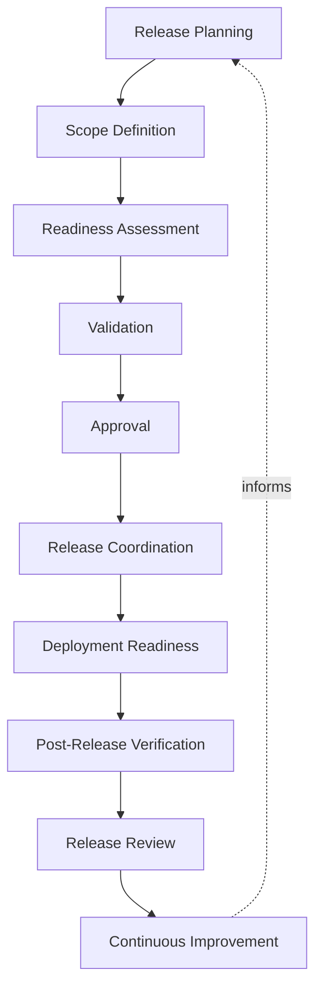
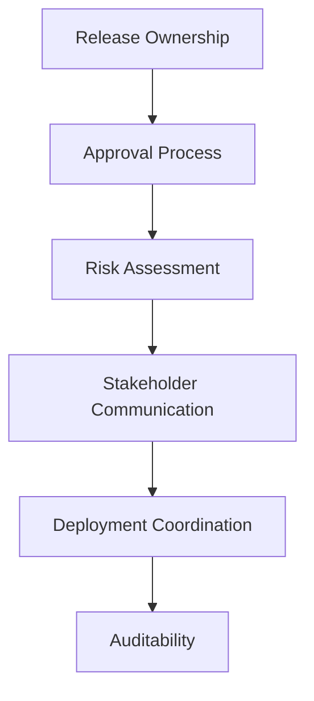
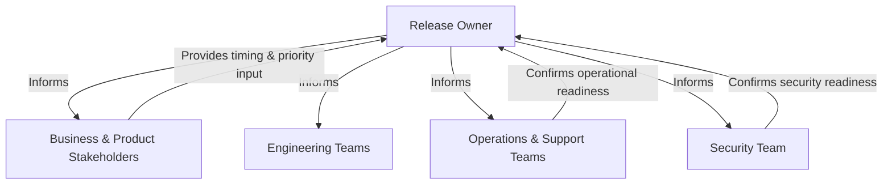
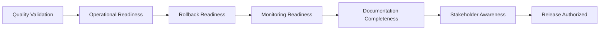
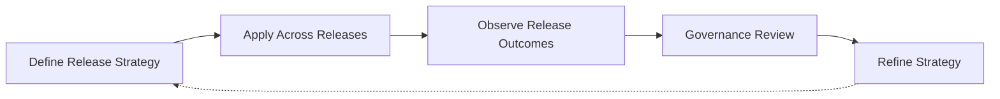

# Release Management

## 1. Document Purpose

This document defines how releases are governed at **StackLeo** — how validated, deployment-ready change becomes a deliberate business event: planned, approved, coordinated, communicated, and verified, without prescribing specific release management tools, version numbering schemes, or deployment scripts.

- **Purpose of Release Management** — to ensure that the decision to release change to customers is a controlled, well-informed business decision, distinct from — but built on top of — the technical readiness that CI/CD and deployment practice establish.
- **Relationship with DevOps** — this document is the release-specific elaboration of the DevOps principles defined in `devops-principles.md`, in particular Reliability, Auditability, and Continuous Improvement, applied to the moment change is committed to customers.
- **Relationship with CI/CD** — `ci-cd-strategy.md` establishes whether change is technically ready to release; this document governs the separate decision of when and how that readiness becomes an actual release, keeping the two connected but distinct.
- **Relationship with Deployment Strategy** — `deployment-strategy.md` defines how a release is technically executed; this document defines the planning, approval, and coordination that determines what gets deployed, when, and under what conditions.
- **Relationship with Business Continuity** — releases are one of the most common deliberate points of risk to business continuity; disciplined release management exists to make that risk understood and managed rather than incidental.
- **Relationship with Software Quality** — release readiness depends directly on the quality validation performed earlier in the pipeline; this document ensures that quality outcomes are a genuine gate to release, not a formality.

This document is implementation-independent and vendor-neutral. It defines release philosophy, lifecycle, and governance conceptually — not specific tools, version numbering schemes, or deployment scripts.

## 2. Release Management Philosophy

- **Predictable Releases** — releases occur through a known, repeatable process, so their timing and behavior can be reasoned about in advance rather than treated as a surprise each time.
- **Controlled Change** — what enters a release, and when, is a deliberate decision, not an accumulation of whatever happened to be ready at an arbitrary moment.
- **Business Alignment** — release timing and scope are informed by genuine business need, consistent with the product and business context in `01_Business` and `02_Product`, not driven by engineering convenience alone.
- **Operational Readiness** — a release is not considered ready until the organization is prepared to support it once it is live, not only prepared to deploy it.
- **Quality First** — a release proceeds only once it has genuinely satisfied the quality expectations defined earlier in the delivery pipeline, never on the basis of schedule pressure alone.
- **Traceability** — every release can be traced to the specific changes, approvals, and validation outcomes that constitute it.
- **Continuous Improvement** — release practice is expected to mature over time, informed by what is learned from every release's outcome.

## 3. Release Lifecycle

### Release Planning

- **Purpose** — establish the intent, target timing, and business context for an upcoming release.
- **Business Value** — connects engineering delivery activity to genuine business timing needs.
- **Governance Objectives** — ensure every release can be traced back to a deliberate planning decision.

### Scope Definition

- **Purpose** — determine precisely what change is, and is not, included in the release.
- **Business Value** — prevents ambiguity about what customers and stakeholders should expect.
- **Governance Objectives** — make release scope explicit and agreed before readiness assessment begins.

### Readiness Assessment

- **Purpose** — evaluate whether the defined scope has genuinely met the criteria required to release.
- **Business Value** — surfaces readiness gaps before they become release-day surprises.
- **Governance Objectives** — apply readiness criteria consistently, without exception for schedule pressure.

### Validation

- **Purpose** — confirm the release candidate behaves as expected against defined quality and business expectations.
- **Business Value** — reduces the likelihood of releasing a defect that could have been caught earlier.
- **Governance Objectives** — treat validation as a required gate, connected directly to `ci-cd-strategy.md` quality gates.

### Approval

- **Purpose** — obtain a deliberate, accountable decision authorizing the release to proceed.
- **Business Value** — ensures releases reflect an intentional business decision, not a default outcome of readiness alone.
- **Governance Objectives** — ensure approval authority and criteria are clearly defined and consistently applied.

### Release Coordination

- **Purpose** — align the release with other teams, dependent systems, and business timing considerations.
- **Business Value** — prevents avoidable conflict between simultaneous, uncoordinated releases.
- **Governance Objectives** — ensure releases affecting shared context are visible to all relevant stakeholders in advance.

### Deployment Readiness

- **Purpose** — confirm the technical execution path, governed by `deployment-strategy.md`, is prepared to carry out the release.
- **Business Value** — reduces the likelihood of deployment-time failures caused by unresolved readiness gaps.
- **Governance Objectives** — ensure deployment readiness is confirmed as a distinct step, not assumed from release approval alone.

### Post-Release Verification

- **Purpose** — confirm the release is functioning as intended once it is live.
- **Business Value** — closes the loop between "released" and "actually delivering the intended value to customers."
- **Governance Objectives** — treat post-release verification as a required, not optional, step.

### Release Review

- **Purpose** — deliberately assess how the release went, regardless of whether it succeeded without incident.
- **Business Value** — turns every release into a source of organizational learning.
- **Governance Objectives** — ensure review occurs consistently, not only after visible failures.

### Continuous Improvement

- **Purpose** — feed what is learned from release outcomes back into release practice itself.
- **Business Value** — keeps release practice improving in step with the platform's growing scale and business complexity.
- **Governance Objectives** — ensure release learning is acted upon, not merely recorded.

*Diagram 1: Enterprise Release Lifecycle — a release moves from planning and scope through readiness, validation, and deliberate approval, into coordinated deployment and post-release verification, with review feeding continuous improvement back into future planning.*

### Release Lifecycle Matrix

| Stage | Purpose | Business Value |
|---|---|---|
| Release Planning | Establish intent, timing, and business context | Connects delivery activity to genuine business need |
| Scope Definition | Determine what is and is not included | Prevents ambiguity about stakeholder expectations |
| Readiness Assessment | Evaluate whether scope meets release criteria | Surfaces gaps before they become release-day surprises |
| Validation | Confirm behavior against quality and business expectations | Reduces likelihood of releasing a preventable defect |
| Approval | Obtain a deliberate, accountable release decision | Ensures releases reflect intentional business decisions |
| Release Coordination | Align with other teams and dependent systems | Prevents avoidable conflict between releases |
| Deployment Readiness | Confirm the technical execution path is prepared | Reduces deployment-time failures from unresolved gaps |
| Post-Release Verification | Confirm the release functions as intended once live | Closes the loop between released and actually delivering value |
| Release Review | Deliberately assess how the release went | Turns every release into organizational learning |
| Continuous Improvement | Feed outcomes back into release practice | Keeps practice aligned with growing complexity |

## 4. Release Categories

### Regular Releases

- **Characteristics** — planned, scheduled releases following the organization's normal release cadence.
- **Typical Usage** — the default category for the majority of feature and capability delivery.
- **Governance Expectations** — full lifecycle governance applies, including standard planning, approval, and coordination.
- **Risk Considerations** — generally lower risk per release due to predictable scope and thorough preparation time.

### Maintenance Releases

- **Characteristics** — releases focused on sustaining existing capability rather than introducing new capability.
- **Typical Usage** — addressing accumulated non-urgent corrections, dependency upkeep, or technical debt.
- **Governance Expectations** — full lifecycle governance applies, with scope explicitly limited to maintenance activity.
- **Risk Considerations** — moderate risk; changes are typically narrow but may touch foundational, widely-depended-upon capability.

### Emergency Releases

- **Characteristics** — releases triggered by a significant, time-sensitive issue requiring correction faster than standard cadence allows.
- **Typical Usage** — addressing a severe, active problem affecting customers or business operation.
- **Governance Expectations** — an abbreviated but still deliberate approval path, with governance intensity concentrated on risk assessment rather than process duration.
- **Risk Considerations** — elevated risk due to compressed timelines, requiring heightened post-release verification.

### Hotfix Releases

- **Characteristics** — narrowly scoped, urgent corrections to already-released behavior, distinguished from emergency releases by their typically smaller and more contained scope.
- **Typical Usage** — correcting a specific, well-understood defect in production.
- **Governance Expectations** — expedited but still governed approval, scoped strictly to the specific correction.
- **Risk Considerations** — lower risk than emergency releases due to narrow scope, but still requires deliberate rollback readiness.

### Feature Releases

- **Characteristics** — releases centered on delivering a specific, discrete new capability.
- **Typical Usage** — introducing a defined enhancement aligned with product roadmap priorities.
- **Governance Expectations** — full lifecycle governance, with particular emphasis on stakeholder awareness and communication.
- **Risk Considerations** — risk proportionate to the scope and customer visibility of the new capability.

### Platform Releases

- **Characteristics** — releases affecting foundational, cross-cutting platform capability rather than a single customer-facing feature.
- **Typical Usage** — introducing or evolving capability that many other teams or services depend on.
- **Governance Expectations** — heightened coordination and communication governance due to broad downstream impact.
- **Risk Considerations** — higher risk due to wide blast radius; requires the most thorough readiness and rollback preparation.

### Release Category Comparison Matrix

| Category | Characteristics | Risk Considerations |
|---|---|---|
| Regular Releases | Planned, scheduled, standard cadence | Generally lower risk due to thorough preparation |
| Maintenance Releases | Sustains existing capability, no new features | Moderate risk; may touch widely-depended-upon capability |
| Emergency Releases | Urgent, time-sensitive correction | Elevated risk from compressed timelines |
| Hotfix Releases | Narrow, urgent correction to production behavior | Lower risk than emergency releases due to narrow scope |
| Feature Releases | Delivers a specific, discrete new capability | Risk proportionate to scope and customer visibility |
| Platform Releases | Affects foundational, cross-cutting capability | Higher risk due to wide downstream blast radius |

## 5. Version Governance

This document does not prescribe a specific version numbering scheme; it defines the governance concerns any scheme must satisfy.

- **Version Awareness** — every release is associated with a distinct, identifiable version, so its content and position in release history is always unambiguous.
- **Change Visibility** — a version's association with the specific changes it contains is discoverable, connecting release history to the traceability principles in `commit-conventions.md`.
- **Traceability** — a released version can be traced back to the exact source, build artifact, and approval that produced it, consistent with `build-pipeline.md`.
- **Compatibility Considerations** — the relationship between versions, including whether a change introduces compatibility concerns for dependent systems or consumers, is deliberately assessed and communicated.
- **Documentation Alignment** — documentation reflecting the current released version is kept current, avoiding divergence between what is documented and what is actually live.
- **Release History** — a complete, ordered record of released versions is maintained, supporting investigation, rollback decisions, and long-term organizational memory.

### Version Governance Matrix

| Governance Concern | Focus | Supports |
|---|---|---|
| Version Awareness | Every release distinctly and unambiguously identified | Unambiguous reference to any point in release history |
| Change Visibility | Version tied to its specific contained changes | Connects release history to commit-level traceability |
| Traceability | Version traced to source, artifact, and approval | Full accountability for release provenance |
| Compatibility Considerations | Deliberate assessment of cross-version impact | Informed decisions for dependent systems and consumers |
| Documentation Alignment | Documentation reflects the current released version | Prevents divergence between documentation and reality |
| Release History | Complete, ordered record of released versions | Investigation, rollback decisions, organizational memory |

## 6. Release Governance

- **Ownership** — every release has a clearly accountable release owner responsible for its planning, coordination, and outcome.
- **Approval Process** — releases proceed only through a defined approval process, with clearly identified approval authority appropriate to the release category.
- **Risk Assessment** — every release is assessed for its potential business and operational impact, proportionate to its category and scope.
- **Communication** — relevant stakeholders are informed of upcoming, in-progress, and completed releases at a level of detail appropriate to their role.
- **Deployment Coordination** — release governance is directly connected to the deployment governance defined in `deployment-strategy.md`, ensuring the two remain aligned rather than operating independently.
- **Auditability** — every release is traceable to its planning, approval, and outcome, supporting investigation and compliance needs.

*Diagram 2: Release Governance Flow — accountable ownership drives a defined approval process informed by risk assessment, sustained by stakeholder communication and deployment coordination, and captured in an auditable record.*

*Diagram 4: Stakeholder Communication Model — the release owner maintains two-way communication with business, engineering, operations, and security stakeholders, gathering input on readiness and priority while keeping every group informed.*

## 7. Release Readiness

- **Quality Validation** — the release candidate has genuinely satisfied the quality gates defined in `ci-cd-strategy.md`, not merely progressed through them nominally.
- **Operational Readiness** — the teams responsible for supporting the platform once the release is live are prepared, consistent with `10_Operations`.
- **Rollback Readiness** — the ability to reverse the release is confirmed in advance, consistent with `rollback.md`, not improvised if a problem occurs.
- **Monitoring Readiness** — the observability and monitoring capability needed to confirm the release's health is in place before the release proceeds, consistent with `observability.md` and `monitoring.md`.
- **Documentation Completeness** — documentation affected by the release, whether internal or customer-facing, is complete and current at the time of release.
- **Stakeholder Awareness** — relevant stakeholders understand what is being released, when, and what to expect, consistent with the communication model in Section 6.

*Diagram 3: Release Readiness Framework — a release is authorized only once quality, operational, rollback, monitoring, documentation, and stakeholder readiness are all independently confirmed.*

### Release Readiness Matrix

| Readiness Dimension | Focus | Confirms |
|---|---|---|
| Quality Validation | Genuine satisfaction of quality gates | The release candidate meets defined quality expectations |
| Operational Readiness | Preparedness of supporting teams | The organization can support the release once live |
| Rollback Readiness | Confirmed reversal capability | The release can be safely reversed if needed |
| Monitoring Readiness | Observability capability in place | Release health can be confirmed after going live |
| Documentation Completeness | Current, affected documentation | No divergence between documentation and reality |
| Stakeholder Awareness | Shared understanding across stakeholders | No surprise about what is being released and when |

## 8. Future Readiness

- **Cloud-Native Platforms** — release governance is defined independent of any specific provider, allowing adoption of elastic, provider-hosted infrastructure without redefining release practice.
- **Microservices** — release lifecycle and category principles scale consistently as capability decomposes into a growing number of independently releasable services.
- **AI Systems** — releases of AI-assisted capability are governed under the same readiness, approval, and traceability principles as any other release.
- **Marketplace Platform** — as StackLeo evolves toward business sales, corporate accounts, wholesale, and a multi-vendor marketplace, release coordination extends to a broader set of stakeholders, including sellers, without redefinition.
- **Multi-Region Releases** — as StackLeo expands from Bangladesh into South Asia and, over time, global markets, release coordination accommodates regional timing and compatibility considerations without disrupting core release governance.
- **Platform Engineering** — release readiness and coordination capability are structured to be delivered as self-service platform capability, consistent with `platform-engineering.md`.
- **Global Engineering Teams** — release governance remains independent of contributor or approver location, supporting distributed teams coordinating releases across time zones.

## 9. Governance

- **Ownership** — a designated release management governance owner is accountable for the coherence and enforcement of this strategy across all release categories.
- **Review Process** — significant changes to release lifecycle, category definitions, or approval criteria are reviewed consistent with the review discipline in `03_System_Design/architecture-decisions.md`.
- **Release Policies** — individual teams may define release detail consistent with this strategy, but may not bypass its approval or governance principles.
- **Audit Readiness** — release records, approvals, and outcomes are maintained in a state that supports audit and investigation at any time.
- **Continuous Improvement** — release management practice is expected to mature as the platform, organization, and business complexity evolve, consistent with `devops-principles.md`.

*Diagram 5: Continuous Release Improvement Cycle — release strategy is applied across every release, its outcomes observed, reviewed by governance, and refined, with refinements feeding directly back into the strategy.*

### Governance Responsibility Matrix

| Governance Area | Owner | Accountable For |
|---|---|---|
| Ownership | Release Management Governance Owner | Coherence and enforcement of this strategy |
| Review Process | Architecture & Platform Teams | Reviewing changes to lifecycle and approval criteria |
| Release Policies | Release Owning Teams | Detail consistent with enterprise governance principles |
| Audit Readiness | Platform & Security Teams | Release records ready for audit at any time |
| Continuous Improvement | DevOps / Platform Engineering | Maturing strategy as platform and business complexity evolve |

## 10. Anti-Patterns

- **Unplanned Releases** — allowing releases to occur without deliberate planning or agreed scope. This produces unpredictable outcomes and undermines every downstream readiness assumption.
- **Weak Approval Process** — allowing releases to proceed without a genuine, accountable approval decision. This removes the primary safeguard against releasing change the business has not actually agreed to.
- **Missing Validation** — allowing a release to proceed without genuinely satisfying quality gates. This shifts defect discovery to customers rather than the delivery pipeline.
- **Poor Communication** — releasing without informing relevant stakeholders adequately in advance. This creates avoidable confusion and erodes trust between engineering and the business.
- **Weak Rollback Planning** — releasing without a confirmed, tested ability to reverse the change. This turns an otherwise recoverable problem into an extended, business-impacting incident.
- **Inconsistent Documentation** — allowing release-related documentation to be incomplete or applied unevenly across releases. This makes release history unreliable as an organizational record.
- **Reactive Release Management** — treating release governance as adequate until a release-caused incident proves otherwise. This means avoidable failures, rather than deliberate design, drive improvement.
- **No Post-Release Review** — failing to deliberately assess how a release went, particularly when it appeared successful. This forfeits the learning opportunity every release, successful or not, represents.

### Anti-Pattern Summary

| Anti-Pattern | Why It Must Be Avoided |
|---|---|
| Unplanned Releases | Produces unpredictable outcomes and undermines readiness assumptions |
| Weak Approval Process | Removes the safeguard against releasing unagreed change |
| Missing Validation | Shifts defect discovery to customers instead of the pipeline |
| Poor Communication | Creates avoidable confusion and erodes business trust |
| Weak Rollback Planning | Turns a recoverable problem into an extended incident |
| Inconsistent Documentation | Makes release history unreliable as an organizational record |
| Reactive Release Management | Avoidable failures, not deliberate design, drive improvement |
| No Post-Release Review | Forfeits the learning opportunity every release represents |

## 11. Document Information

| Property | Value |
|----------|-------|
| Document | release-management.md |
| Version | 1.0.0 |
| Status | Active |
| Maintained By | StackLeo |
| Last Updated | 2026-07-24 |

---

© StackLeo. All Rights Reserved.
