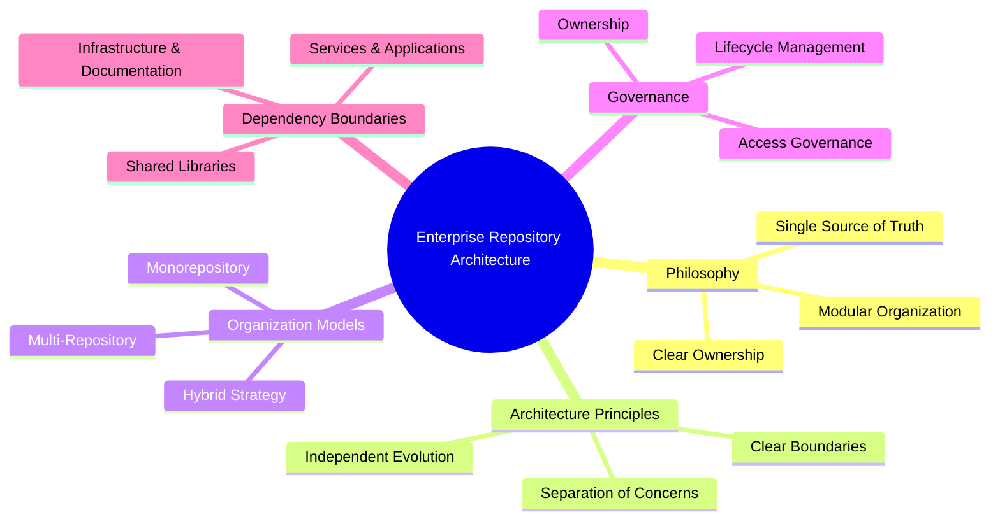
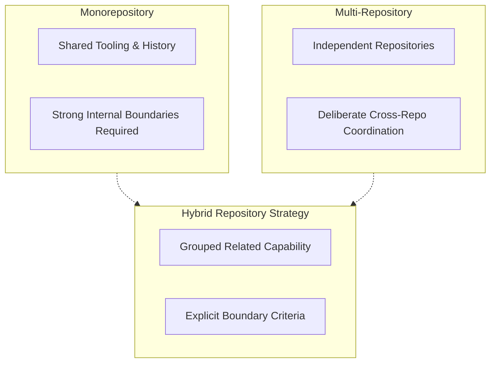
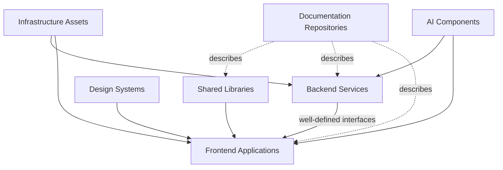
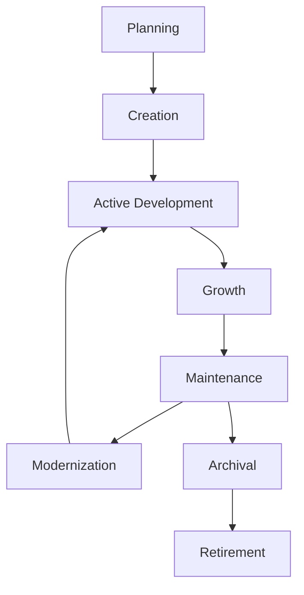
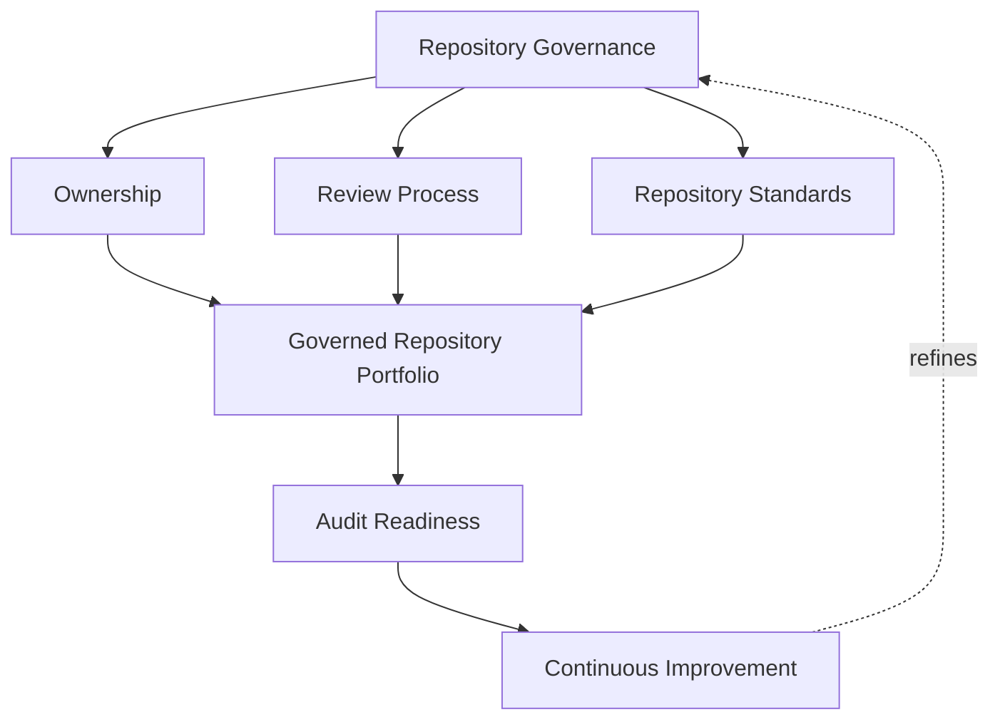

# Repository Strategy

## 1. Document Purpose

This document defines how repositories are architected and governed across **StackLeo** — how code, configuration, infrastructure definitions, and documentation are organized into repositories, owned, evolved, and eventually retired, without prescribing a specific organizational model or hosting platform.

- **Purpose of Repository Strategy** — to ensure that as the platform and organization grow, the boundaries between repositories remain deliberate and understood, rather than an accumulation of historical accident. Repository structure should make the platform easier to reason about at scale, not harder.
- **Relationship with Software Architecture** — repository boundaries are expected to reflect, not contradict, the component and service boundaries defined in `03_System_Design/component-architecture.md` and `03_System_Design/service-architecture.md`. A repository boundary that cuts against an architectural boundary creates persistent friction between how the system is designed and how it is built.
- **Relationship with Source Control Governance** — this document is the repository-level elaboration of the principles defined in `git-strategy.md`, in particular Repository Ownership and Repository Lifecycle. Where `git-strategy.md` governs how change moves within a repository, this document governs how repositories themselves are structured, related, and managed as a portfolio.
- **Relationship with DevOps** — repository structure directly shapes how effectively `ci-cd-strategy.md` and `deployment-strategy.md` can be practiced; poorly bounded repositories create delivery pipelines that are difficult to reason about and slow to change safely.
- **Relationship with Platform Engineering** — `platform-engineering.md` depends on a coherent repository strategy to provide consistent, self-service capability across the organization; inconsistent repository structure undermines the reusability platform engineering exists to provide.

This document is implementation-independent and vendor-neutral. It defines repository philosophy, architecture, and governance conceptually — not hosting platforms, repository configurations, or a mandated organizational model.

## 2. Repository Strategy Philosophy

- **Single Source of Truth** — every unit of code, configuration, or documentation has one authoritative repository of record; no ambiguity exists about where the current, trustworthy version resides.
- **Clear Ownership** — every repository has an identifiable owning team accountable for its health, direction, and adherence to enterprise standards.
- **Modular Organization** — repositories are structured around coherent units of capability, so their boundaries remain meaningful as the platform grows.
- **Scalability** — the repository strategy is designed to accommodate a growing number of teams, services, and repositories without requiring periodic wholesale restructuring.
- **Collaboration** — repository organization supports, rather than obstructs, the ability of multiple teams to contribute to related capability efficiently.
- **Long-Term Maintainability** — repository structure remains understandable and navigable years after it was established, not only during its initial design.

*Diagram 1: Enterprise Repository Architecture — the philosophy, architecture principles, organization models, governance, and dependency boundaries this strategy defines.*

## 3. Repository Architecture Principles

### Separation of Concerns

- **Purpose** — ensure repositories are bounded around distinct areas of responsibility rather than mixed, unrelated concerns.
- **Business Value** — reduces the cognitive and operational cost of understanding and safely changing any single repository.
- **Strategic Objective** — align repository boundaries with meaningful, defensible units of responsibility.

### Clear Boundaries

- **Purpose** — ensure that what belongs inside a repository, and what does not, is unambiguous.
- **Business Value** — prevents scope creep that gradually turns a well-bounded repository into an unmanageable one.
- **Strategic Objective** — make repository scope a deliberate, documented decision rather than an emergent one.

### Shared Components

- **Purpose** — ensure genuinely reusable capability is available consistently rather than duplicated across repositories.
- **Business Value** — reduces duplicated effort and the risk of divergent, inconsistent implementations of the same capability.
- **Strategic Objective** — make reuse the easier path relative to duplication.

### Independent Evolution

- **Purpose** — ensure a repository can be changed, released, and evolved without requiring coordinated change across unrelated repositories.
- **Business Value** — allows teams to move at their own pace without becoming a bottleneck for, or being bottlenecked by, unrelated teams.
- **Strategic Objective** — minimize unnecessary coupling between independently owned repositories.

### Documentation First

- **Purpose** — ensure every repository's purpose, ownership, and boundaries are documented and discoverable.
- **Business Value** — reduces the time new contributors and other teams need to understand what a repository is for and how to engage with it.
- **Strategic Objective** — treat repository documentation as a required deliverable, not an optional afterthought.

### Traceability

- **Purpose** — ensure the relationship between a repository and the architectural or business capability it implements is discoverable.
- **Business Value** — supports impact analysis when architectural or business decisions change.
- **Strategic Objective** — keep repository purpose explainable in terms of the architecture and business capability it serves.

### Governance

- **Purpose** — ensure repository creation, structure, and retirement follow a consistent, enterprise-wide standard.
- **Business Value** — prevents the repository portfolio from becoming inconsistent and difficult to govern as it grows.
- **Strategic Objective** — make repository governance a continuous discipline, not a one-time setup decision.

### Repository Architecture Principle Matrix

| Principle | Purpose | Strategic Objective |
|---|---|---|
| Separation of Concerns | Bound repositories around distinct responsibility | Align boundaries with defensible units of responsibility |
| Clear Boundaries | Make repository scope unambiguous | Make scope a deliberate, documented decision |
| Shared Components | Make reusable capability consistently available | Make reuse easier than duplication |
| Independent Evolution | Allow change without unrelated coordination | Minimize unnecessary coupling between repositories |
| Documentation First | Make purpose and ownership discoverable | Treat documentation as a required deliverable |
| Traceability | Connect repositories to architecture and business capability | Keep repository purpose explainable |
| Governance | Apply a consistent standard to repository lifecycle | Make governance continuous, not one-time |

## 4. Repository Organization Models

StackLeo does not mandate a single repository organization model as universally correct. The appropriate model may vary by domain, team structure, and platform maturity, evaluated against the principles in Section 3.

### Monorepository

- **Characteristics** — a broad set of related capability is held within a single repository, sharing common tooling, versioning, and history.
- **Advantages** — simplifies cross-cutting change, keeps related capability visibly connected, and reduces duplication of shared tooling and standards.
- **Trade-Offs** — requires strong internal boundaries and governance discipline to remain navigable as it grows; access control is coarser without additional structure.
- **Suitable Organizational Contexts** — closely related teams working on tightly interdependent capability, or organizations prioritizing unified tooling and cross-cutting consistency.

### Multi-Repository

- **Characteristics** — capability is distributed across many independently managed repositories, each narrowly scoped.
- **Advantages** — limits the blast radius of change within any single repository, allows independent access control and release cadence per repository.
- **Trade-Offs** — requires deliberate coordination for changes that span repositories, and consistent standards must be actively maintained rather than assumed.
- **Suitable Organizational Contexts** — larger numbers of independently operating teams, or capability with genuinely independent release cadences and ownership.

### Hybrid Repository Strategy

- **Characteristics** — related capability is grouped into a smaller number of coherent repositories, balancing consolidation and independence rather than defaulting fully to either extreme.
- **Advantages** — allows the organization to apply monorepository benefits where capability is tightly coupled, and multi-repository benefits where it is not.
- **Trade-Offs** — requires clear, deliberate criteria for how the boundary decision is made, or it risks becoming inconsistent over time.
- **Suitable Organizational Contexts** — organizations with a mix of tightly coupled core capability and independently evolving peripheral capability, which describes many platforms as they scale.

*Diagram 2: Repository Organization Models — monorepository and multi-repository represent opposite ends of a spectrum; a hybrid strategy deliberately combines elements of both where appropriate.*

### Repository Model Comparison Matrix

| Model | Characteristics | Primary Advantage | Primary Trade-Off |
|---|---|---|---|
| Monorepository | Single repository, shared tooling and history | Simplifies cross-cutting change | Requires strong internal governance at scale |
| Multi-Repository | Many independently managed repositories | Limits blast radius, independent cadence | Requires deliberate cross-repository coordination |
| Hybrid Repository Strategy | Related capability grouped deliberately | Combines benefits where each applies best | Requires explicit, maintained boundary criteria |

## 5. Repository Governance

- **Repository Ownership** — every repository has a clearly identified owning team accountable for its health, structure, and adherence to this strategy.
- **Access Governance** — access to a repository is granted according to role and responsibility, consistent with the least-privilege principle in `06_Security/security-principles.md`.
- **Documentation Standards** — every repository maintains documentation describing its purpose, ownership, and boundaries, consistent with the Documentation First principle in Section 3.
- **Dependency Awareness** — a repository's relationships to other repositories and shared components are understood and deliberately managed, not left implicit.
- **Archive Strategy** — repositories that are no longer actively developed are deliberately archived, preserving their history while removing ambiguity about their status.
- **Lifecycle Management** — every repository is managed through the defined lifecycle in Section 7, from planning through eventual retirement.

## 6. Dependency Boundaries

Dependency relationships between repositories are managed deliberately, as strategic decisions rather than incidental outcomes:

- **Shared Libraries** — capability genuinely common across multiple consumers is centralized, versioned, and governed to prevent divergence, while avoiding forcing unrelated capability into shared ownership.
- **Design Systems** — shared user experience components are governed as a distinct, deliberately consumed dependency, so consistency across customer-facing surfaces does not depend on informal coordination.
- **Backend Services** — service repositories expose their capability through well-defined interfaces, consistent with `05_API/api-strategy.md`, rather than through direct, informal coupling to their internal implementation.
- **Frontend Applications** — application repositories consume shared components and backend interfaces deliberately, maintaining a clear boundary between what they own and what they depend on.
- **Infrastructure Assets** — infrastructure definitions are managed with explicit dependency awareness, so changes to shared infrastructure capability have a traceable path to the repositories that depend on them.
- **Documentation Repositories** — documentation that spans multiple repositories or capabilities is maintained with clear ownership, preventing it from silently falling out of sync with any single source repository.
- **AI Components** — AI-assisted capability is governed under the same dependency discipline as any other shared component, with consumers deliberately aware of what they depend on and its evolution.

*Diagram 4: Dependency Relationship Model — shared libraries, design systems, and AI components are consumed deliberately by backend and frontend repositories through well-defined interfaces, with infrastructure underpinning both and documentation describing the whole.*

### Dependency Boundary Matrix

| Dependency Type | Governance Focus | Strategic Objective |
|---|---|---|
| Shared Libraries | Centralized, versioned, prevents divergence | Reuse without forcing unrelated ownership together |
| Design Systems | Governed as a deliberately consumed dependency | Consistency across customer-facing surfaces |
| Backend Services | Exposed through well-defined interfaces | Prevents informal coupling to internal implementation |
| Frontend Applications | Deliberate consumption of shared and backend capability | Clear boundary between owned and depended-upon capability |
| Infrastructure Assets | Explicit dependency awareness for shared infrastructure | Traceable path from infrastructure change to dependents |
| Documentation Repositories | Clear ownership across spanning documentation | Prevents silent drift from source repositories |
| AI Components | Same dependency discipline as any shared component | Deliberate awareness of AI capability evolution |

## 7. Repository Lifecycle

### Planning

- **Purpose** — determine whether a new repository is genuinely warranted, and define its intended scope and ownership.
- **Governance Objectives** — prevent repository creation as a default response to any new unit of work.
- **Business Value** — avoids unnecessary fragmentation before it occurs.

### Creation

- **Purpose** — establish the repository consistent with enterprise standards for documentation, ownership, and access.
- **Governance Objectives** — ensure no repository exists without a recorded owner and stated purpose.
- **Business Value** — sets the repository up to be discoverable and governable from its first day.

### Active Development

- **Purpose** — support the repository's primary period of capability growth and iteration.
- **Governance Objectives** — maintain adherence to architecture and dependency boundaries throughout growth.
- **Business Value** — delivers the capability the repository exists to provide.

### Growth

- **Purpose** — accommodate increasing scope, contributors, or dependency relationships as the repository matures.
- **Governance Objectives** — reassess whether original boundaries remain appropriate as scope expands.
- **Business Value** — prevents boundary decisions made early from silently becoming inappropriate at scale.

### Maintenance

- **Purpose** — sustain the repository's health once its primary growth phase has stabilized.
- **Governance Objectives** — ensure ongoing upkeep is resourced rather than deprioritized indefinitely.
- **Business Value** — protects the long-term reliability of capability the business continues to depend on.

### Modernization

- **Purpose** — deliberately update the repository's structure, dependencies, or practices to remain consistent with current enterprise standards.
- **Governance Objectives** — prevent long-lived repositories from silently diverging from evolving governance expectations.
- **Business Value** — keeps mature capability sustainable rather than allowing it to become a growing liability.

### Archival

- **Purpose** — formally mark a repository as no longer under active development while preserving its history.
- **Governance Objectives** — ensure archival is a deliberate decision, communicated and recorded rather than an unexplained gap in activity.
- **Business Value** — removes ambiguity for anyone who later encounters the repository.

### Retirement

- **Purpose** — formally conclude a repository's lifecycle when its history is no longer required to be readily accessible.
- **Governance Objectives** — ensure retirement follows a defined, deliberate process consistent with organizational record-keeping needs.
- **Business Value** — keeps the active repository portfolio focused and reduces long-term maintenance overhead.

*Diagram 3: Repository Lifecycle — a repository moves from planning and creation through growth and ongoing maintenance, cycling through modernization as needed, until it is deliberately archived and eventually retired.*

### Repository Lifecycle Matrix

| Stage | Purpose | Business Value |
|---|---|---|
| Planning | Determine whether a new repository is warranted | Avoids unnecessary fragmentation before it occurs |
| Creation | Establish the repository to enterprise standards | Discoverable and governable from day one |
| Active Development | Support primary capability growth | Delivers the repository's intended capability |
| Growth | Accommodate increasing scope and contributors | Prevents boundaries from silently becoming inappropriate |
| Maintenance | Sustain repository health after stabilization | Protects long-term reliability of depended-upon capability |
| Modernization | Update structure and practices deliberately | Keeps mature capability sustainable, not a liability |
| Archival | Mark as inactive while preserving history | Removes ambiguity for future encounters |
| Retirement | Formally conclude the repository's lifecycle | Keeps the active portfolio focused |

## 8. Future Readiness

- **Modular Monolith** — repository architecture principles apply cleanly to a single, well-bounded codebase organized into internally coherent modules.
- **Microservices** — as capability decomposes into a growing number of independently deployable services, dependency boundary and lifecycle governance extend without requiring redefinition.
- **Platform Engineering** — repository governance and lifecycle expectations are structured to be enforceable through self-service platform capability, consistent with `platform-engineering.md`.
- **AI Projects** — repositories supporting AI-assisted capability follow the same architecture, dependency, and lifecycle principles as any other repository.
- **Marketplace Platform** — as StackLeo evolves toward business sales, corporate accounts, wholesale, and a multi-vendor marketplace, repository organization accommodates new capability domains, such as seller-facing tooling, without redefining governance.
- **Enterprise Teams** — as the number of contributing teams grows, clear ownership and dependency boundary principles keep the repository portfolio governable rather than increasingly ambiguous.
- **Global Collaboration** — as StackLeo grows from Bangladesh into South Asia and, over time, global markets, repository governance remains independent of contributor location, supporting distributed teams working across the portfolio.

## 9. Governance

- **Ownership** — a designated repository governance owner is accountable for the coherence and enforcement of this strategy across the repository portfolio.
- **Review Process** — significant repository creation, restructuring, or retirement decisions are reviewed against this strategy, consistent with the review discipline in `03_System_Design/architecture-decisions.md`.
- **Repository Standards** — individual repositories may define detail consistent with this strategy, but may not contradict the principles defined here.
- **Audit Readiness** — the repository portfolio, its ownership, and its dependency relationships are maintained in a state that supports audit and investigation at any time.
- **Continuous Improvement** — repository strategy is expected to mature as the platform, organization, and technology landscape evolve, consistent with the Continuous Improvement principle in `devops-principles.md`.

*Diagram 5: Repository Governance Framework — ownership, review, and standards converge on a governed repository portfolio that remains audit-ready and feeds continuous improvement back into governance itself.*

### Governance Responsibility Matrix

| Governance Area | Owner | Accountable For |
|---|---|---|
| Ownership | Repository Governance Owner | Coherence and enforcement of this strategy |
| Review Process | Architecture & Platform Teams | Evaluating creation, restructuring, and retirement decisions |
| Repository Standards | Repository Owners | Detail consistent with enterprise-wide principles |
| Audit Readiness | Platform & Security Teams | Portfolio, ownership, and dependencies ready for audit |
| Continuous Improvement | DevOps / Platform Engineering | Maturing strategy as platform and organization evolve |

## 10. Anti-Patterns

- **Repository Sprawl** — creating new repositories without deliberate justification or planning. This produces a portfolio no one can fully account for, increasing coordination and governance cost.
- **Weak Ownership** — leaving a repository without a clearly accountable owner. This causes structure, documentation, and dependency discipline to degrade with no one responsible for correcting it.
- **Tight Coupling** — allowing repositories to depend on each other's internal implementation rather than well-defined interfaces. This prevents independent evolution and turns unrelated changes into cross-repository risk.
- **Documentation Neglect** — allowing a repository's purpose, ownership, or boundaries to go undocumented. This makes the repository difficult for anyone but its original authors to understand or safely engage with.
- **Uncontrolled Dependencies** — allowing dependency relationships to form informally and go untracked. This makes impact analysis unreliable and increases the risk of unexpected breakage from unrelated change.
- **Poor Archive Practices** — leaving inactive repositories in an ambiguous, unarchived state. This makes it unclear whether a repository is safe to ignore, depend on, or revive.
- **Reactive Organization** — restructuring the repository portfolio only after significant pain has accumulated. This means avoidable friction, rather than deliberate design, drives repository strategy.
- **Missing Governance** — allowing repository creation, structure, and retirement to proceed without consistent standards or review. This produces an inconsistent, ungovernable portfolio as the organization scales.

### Anti-Pattern Summary

| Anti-Pattern | Why It Must Be Avoided |
|---|---|
| Repository Sprawl | Produces a portfolio no one can fully account for |
| Weak Ownership | Structure and discipline degrade with no accountable owner |
| Tight Coupling | Prevents independent evolution; unrelated change becomes cross-repository risk |
| Documentation Neglect | Repository becomes difficult for anyone but original authors to understand |
| Uncontrolled Dependencies | Impact analysis becomes unreliable; unexpected breakage increases |
| Poor Archive Practices | Unclear whether a repository is safe to ignore, depend on, or revive |
| Reactive Organization | Avoidable friction, not deliberate design, drives repository strategy |
| Missing Governance | Portfolio becomes inconsistent and ungovernable at scale |

## 11. Document Information

| Property | Value |
|----------|-------|
| Document | repository-strategy.md |
| Version | 1.0.0 |
| Status | Active |
| Maintained By | StackLeo |
| Last Updated | 2026-07-24 |

---

© StackLeo. All Rights Reserved.
